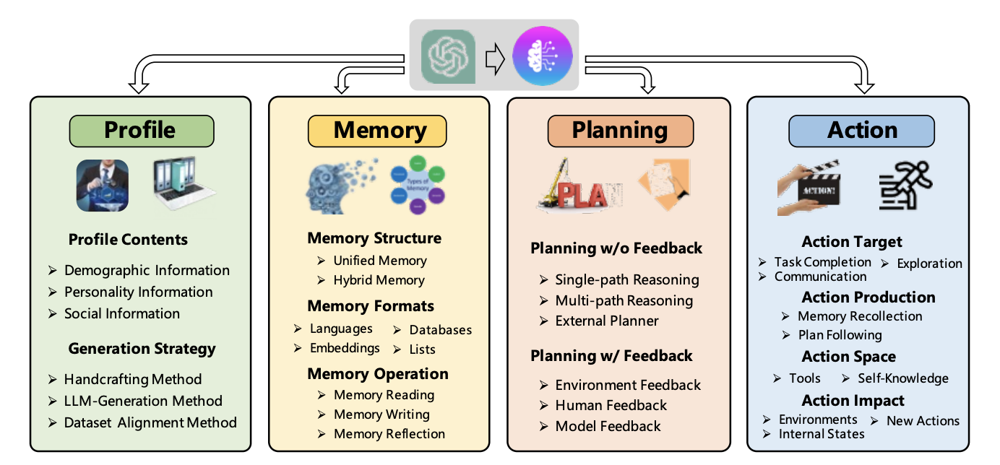
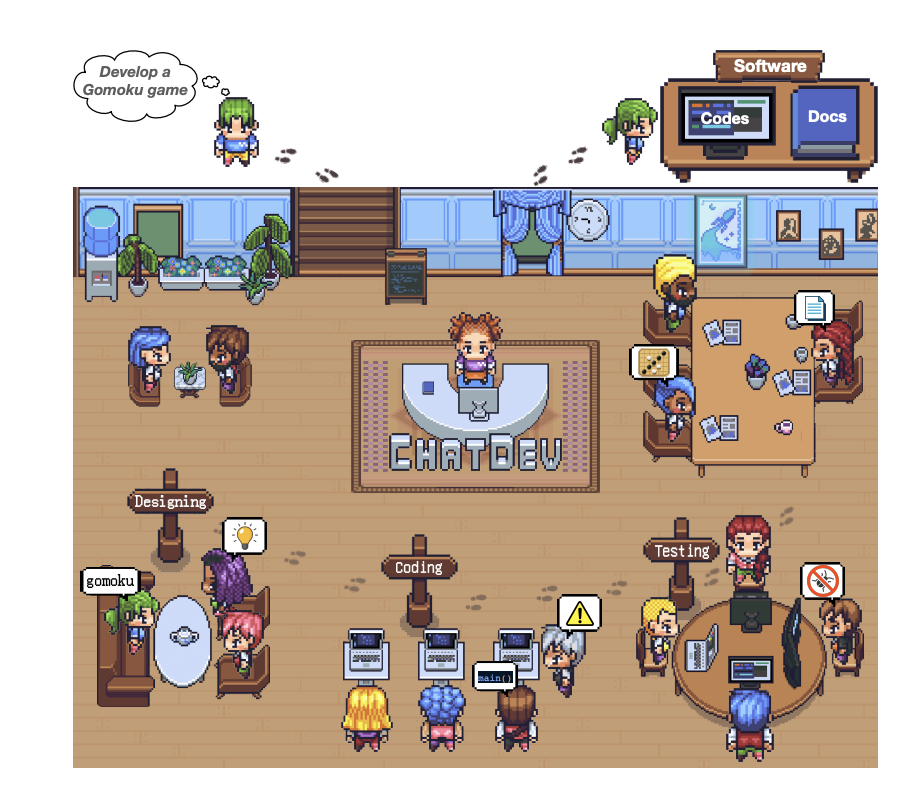
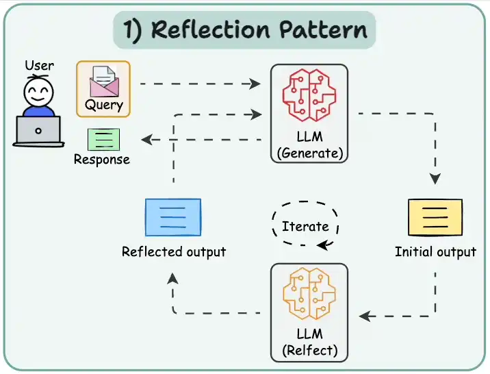
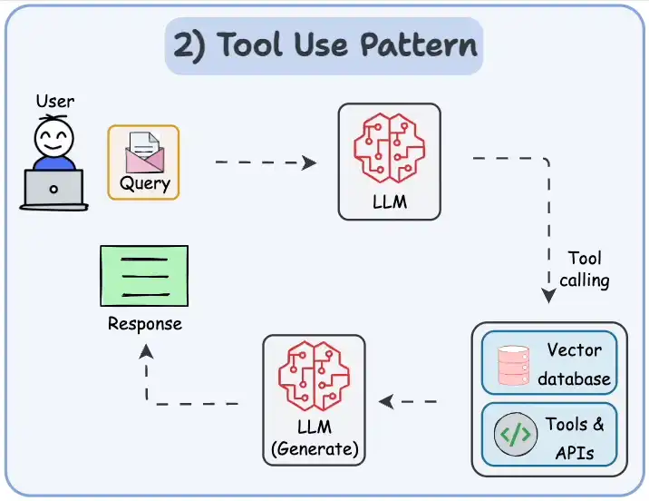
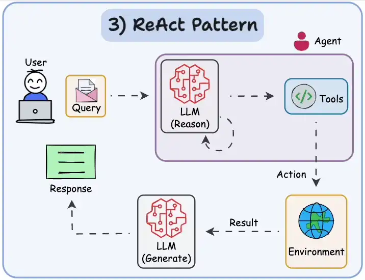
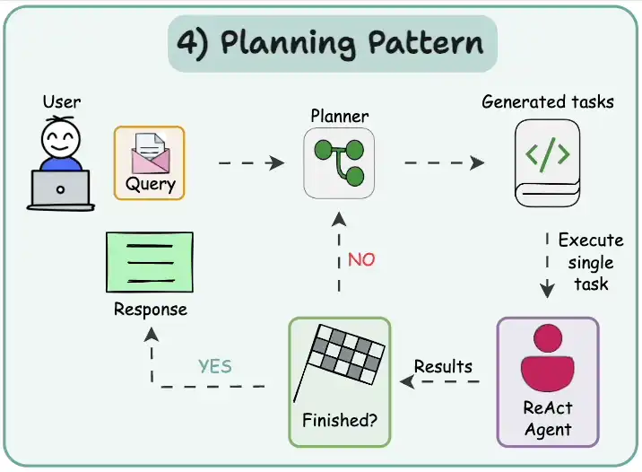
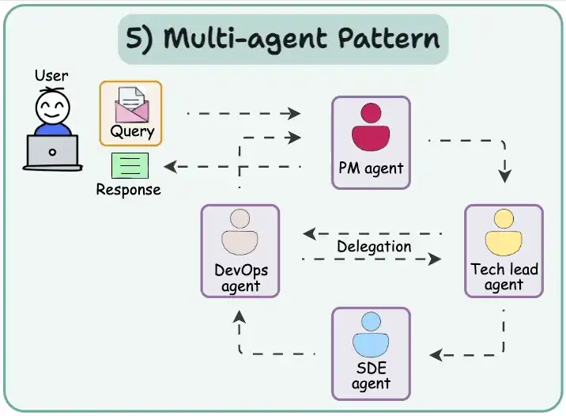
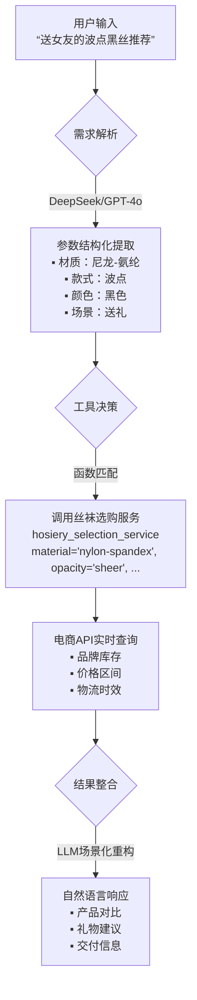
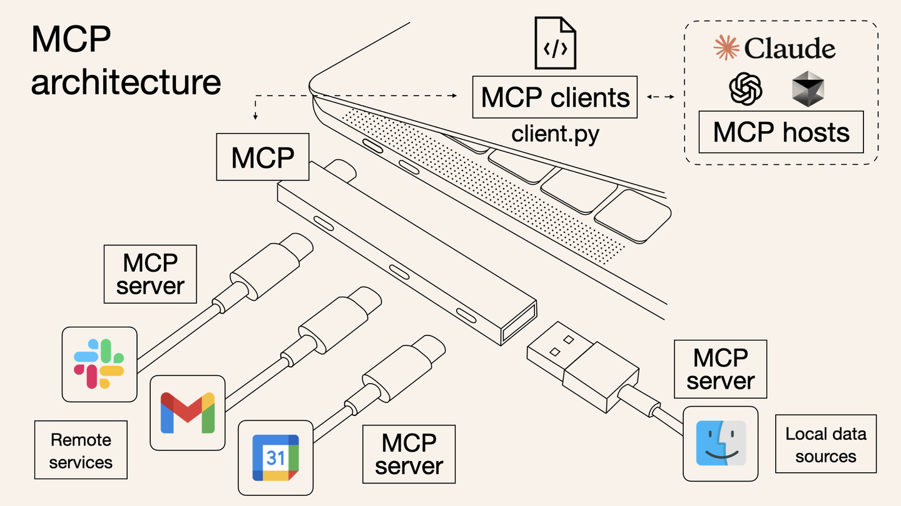

# 目录

- [1.什么是AI Agent（智能体）？](#1.什么是AI-Agent（智能体）？)
- [2.AI Agent的主流设计模式有哪些？](#2.AI-Agent的主流设计模式有哪些？)
- [3.什么是AI Agent中的function call？](#3.什么是AI-Agent中的function-call？)
- [4.什么是AI Agent中的MCP（Model Context Protocol）？](#4.什么是AI-Agent中的MCP（Model Context Protocol）？)


<h2 id="1.什么是AI-Agent（智能体）？">1.什么是AI Agent（智能体）？</h2>

**在AIGC时代，Rocky认为AI Agent是一个非常重要的方向，也是AIGC技术发展的大势所趋。**

那么，AI Agent到底是什么呢？

Rocky首先给大家讲解一下非AI Agent（Non-Agent），即常规AIGC大模型的运行逻辑，然后我们就能从两者的对比中恍然大悟。

我们以经典的文本内容创作为例子🌰，**非智能体、智能体以及人类创作者的工作流呈现显著差异：**

| **主体类型**   | **执行特征**                                                                 | **流程剖析**                                                                 |
|----------------|-----------------------------------------------------------------------------|-----------------------------------------------------------------------------|
| **Non-Agent（非智能体）**   | 线性单次输出                                                                | 用户输入提示词→大模型直接生成终稿（无迭代过程）                                |
| **AI Agent（智能体）**     | 多阶段认知闭环                                                              | 规划大纲→检索资料→生成初稿→自检修订→循环优化→输出终稿（模拟人类创作思维）         |
| **人类创作者** | 认知驱动型工作流                                                            | 构思框架→信息搜集→内容填充→交叉审核→反复润色（与智能体流程高度同构）              |


**我们可以发现：AI Agent的核心是通过任务解构-执行-反思的认知闭环，实现对人类工作范式的数字孪生。**



**AI行业大牛吴恩达认为，AI Agent的终极演进方向是构建具备完整认知能力的数字主体**，其技术架构可解构为四大核心能力：

1. **反思（Reflection）**：AI Agent模拟人类自我修正行为，如同学生完成作业后的自主检查过程。突破单次推理局限，建立错误检测-反馈-修正的增强回路。在代码生成、法律文书等高精度需求场景实现质量跃升。
2. **工具调用（Tool use）**：AI Agent判定自身能力边界，选择合适的AI工具（AI服务/搜索引擎/专业数据库等）来提升大模型的能力边界。
3. **规划（Planning）**：AI Agent在解决复杂问题时，为到达目标制定合理的行动计划的能力，从而对任务进行拆解。
4. **多智能体协作（Multi-agent collaboration）**：多个AI Agent的组合应用，我们可以畅想当每个用户可配置专属AI团队（产品经理Agent+工程师Agent+测试Agent+商务市场Agent等），传统生产模式将被重构。



我们都知道自动驾驶领域对技术级别有L1-L5之分，级别越高代表越向无人驾驶靠近。**在AIGC时代，我们可以对AIGC技术的能力演进路径进行级别划分，同样可构建五个级别：**

| **层级** | **能力定位**       | **人机协作范式**                                                                 | **演进状态**          |  
|----------|--------------------|---------------------------------------------------------------------------------|---------------------|  
| **L1**   | 基础工具（Tool）        | 用户独立完成全流程，系统无显性AI能力                                            | 技术替代进程中      |  
| **L2**   | 对话辅助（Chatbot）         | 用户主导执行，AI提供信息参考（如知识检索、建议生成）                                | 基础应用形态        |  
| **L3**   | 协同创作（Copilot）        | 人机任务共担：用户设定目标→AI生成初稿→用户修正确认                                | 当前核心价值区      |  
| **L4**   | 智能体（AI Agent）      | 用户定义目标与资源，AI自主实现任务拆解、工具调度、过程管控的全闭环                  | 近通用AGI临界点     |  
| **L5**   | 通用智能（Intelligence）         | 系统自驱完成目标定义、资源获取、工具调用及结果交付                                | 理论发展阶段        |  

当前AI Agent的核心还是基于LLM大模型+深度的Prompts工程，**Rocky认为未来AI Agent会有更多内涵，比如：**
1. AI Agent中的核心大模型可能是基于AIGC多模态大模型构建的。
2. AI Agent中会包含更多的模态能力，比如图像、视频、音频、数字人等。
3. 会有基于AI Agent为核心的爆款AIGC产品问世。
4. 基于AI Agent的AI算法解决方案会在各行各业落地，重构各行各业的业务形态。


<h2 id="2.AI-Agent的主流设计模式有哪些？">2.AI Agent的主流设计模式有哪些？</h2>

**当前主流的AI Agent（Manus、Deep Research等）都是基于LLM大模型 + 一整套AIGC算法解决方案(Prompts工程、Function Call、MCP、AI工程策略、AI功能服务等)构建而成**，同时未来还会持续扩展延伸其内涵。

基于上面的框架，接着再形成了5种主流的AI Agent设计模式：

1. **反射模式（Reflection pattern）**：这个模式的**核心运作机制是构建自检-纠错迭代环**，AI Agent会审查其工作以发现错误并迭代，直到生成最终输出结果。



2. **工具使用模式（Tool use pattern）**：AI Agent允许LLM大模型通过使用外部工具获得更多信息，包括调用API、使用AI服务、查询矢量数据库、执行Python脚本等。**这使得LLM大模型不仅仅依赖于其内部知识，还可以获得互联网世界的庞大实时数据流来扩展知识边界**。



3. **ReAct模式（Reason and Act）**：**ReAct模式结合了反射模式和工具使用模式**，这使其成为当前AI Agent使用的最强大的模式之一。AI Agent既可以自我思考，自我纠错，还可以使用工具与世界交互。



4. **规划模式（Planning pattern）**：在这种模式下，**AI Agent根据任务的复杂程度，设计任务计划流程，对任务进行细分，再对细分子任务动用ReAct 模式进行处理**。可以说这种模式是一种战略思维，可以更有效地解决战略级复杂任务。



5. **多智能体模式（Multi-agent pattern）**：在这个模式中，**AI Agent系统中包含多个子Agent，每个子Agent都分配有一个专用的角色和任务，同时每个子Agent还可以访问外部工具进行综合工作**。最后，所有子Agent协同工作以提供最终结果，同时根据需要将细分任务委派给其他子Agent，形成一个复杂的“AI Agent协同社区”。




<h2 id="3.什么是AI-Agent中的function-call？">3.什么是AI Agent中的function call？</h2>

在AI Agent架构中，**Function Call（函数调用）本质上是智能体通过LLM大模型调用外部能力（API、AI服务、AI工具、数据库、搜索引擎等）并进行整合处理的闭环过程**。

接下来，Rocky举一个生动形象的例子，让我们通俗易懂的领会Function Call的整个流程。

假设我们已经有一个AI Agent系统，里面的核心LLM大模型是DeepSeek和GPT-4o，我们想要设计一个快速帮女朋友购买丝袜的AI服务-《丝袜选购服务》，实现AI Agent能够灵活帮女朋友选购丝袜的功能。

这时，Function Call的整体流程如下所示：
1. 需求解析阶段（Demand Analysis）：我们输入丝袜选购问题，LLM大模型（DeepSeek/GPT-4o）先解析用户自然语言请求（如“帮女友买波点黑丝”），识别核心参数：
```python  
{"品类": "丝袜", "风格": "波点", "颜色": "黑色", "用户身份": "送礼"}  
``` 
2. 工具决策阶段（Tool Orchestration）：如果问到了丝袜选购问题，LLM大模型则分析生成出需要调用丝袜选购服务function以及调用丝袜选购服务function要传入的参数，生成结构化调用JSON指令：
```json  
     {  
       "function": "hosiery_selection_service",  
       "parameters": {  
         "material": "nylon-spandex",  
         "opacity": "sheer",   
         "color": "black",  
         "purpose": "gift"  
       }  
     }  
```  
3. 服务执行阶段（Service Execution）：接着开始调用丝袜选购服务function，返回结构化结果：
```json  
     {  
       "recommendations": [  
         {"brand": "Wolford", "price": 189, "features": ["防勾丝", "微透明"]},  
         {"brand": "Calzedonia", "price": 89, "features": ["简约塑形", "透气"]}  
       ],  
       "delivery_time": "当日达"  
     }  
 ```  
5. 响应生成阶段（Response Synthesis）：最后将function返回的内容追加到输入提示词中，一起给到大模型，让它总结完善回答，并将答案整理好生成回复给我们：
 
> “推荐两款高品质黑丝：  
> 1. **Wolford透肉款**（189元）：顶级防勾丝工艺，微透明设计提升舒适度  
> 2. **Calzedonia塑形款**（89元）：简约显瘦同时透气性强  
> ⚡️均可今日送达，礼物建议选Wolford+礼盒包装”  

### **全流程可视化图表**


到这里，相信大家已经对AI Agent的Function Call有一个清晰的了解，接下来我们再总结一下Function Call与传统API调用的本质区别：

   | **维度**         | 传统API调用               | Agent Function Call          |  
   |------------------|--------------------------|------------------------------|  
   | **输入格式**      | 结构化参数（JSON/XML）   | 自然语言指令                 |  
   | **调用方**        | 开发者硬编码触发          | Agent自主决策触发            |  
   | **错误处理**      | 显式异常捕获              | 反射机制自动重试/替换工具    |  
   | **协议依赖**      | 固定通信协议（REST/gRPC） | 支持MCP等自适应协议          |  


### 关键阶段解析：
1. **意图识别**  
   - 大模型解析“查询天气”语义，定位到工具类别  
2. **参数抽取**  
   - 从自然语言提取结构化参数（`材质`：`尼龙-氨纶`, `款式`：`波点`, `颜色`：`黑色`, `场景`：`送礼`）  
3. **协议转换**  
   - 生成工具要求的调用格式（如OpenAI Function Calling规范）  
4. **结果整合**  
   - 将工具返回的数据转化为自然语言响应  

> **技术哲学启示**：当Function Call从技术组件进化为**AI Agent与现实的通用接口**，人类正将“行动权”赋予人工智能。这不仅是效率革命，更是认知范式的迁移——我们不再需要理解螺丝刀的结构，只需说：“请把画挂在墙上。”


<h2 id="4.什么是AI-Agent中的MCP（Model Context Protocol）？">4.什么是AI Agent中的MCP（Model Context Protocol）？</h2>

2024年11月25日，Anthropic发布技术白皮书《Model Context Protocol: A Standardized Interface for AI Integration》，首次提出MCP（Model Context Protocol协议框架的概念。

MCP（Model Context Protocol）构建了AI大模型与外部应用程序间的上下文交换规范，这使得AI开发者能够以一致的规范将各种实时数据源、AI工具和外接功能连接到AIGC大模型中，就像Type-C让不同设备能够通过相同的接口连接到主机一样。MCP的目标是创建一个通用标准，使 AI 应用程序的开发和集成变得更加简单和统一。

在没有MCP之前，AIGC大模型和外部功能交互时的Function Calling是可以五花八门的，这样就导致了虽然有海量的应用程序和多样的AIGC大模型，但是他们之间却不一定能够兼容组合。而MCP就是以更标准的方式让AIGC大模型使用不同的外部工具，只要这些外部工具根据MCP协议定义输入输出规范。

MCP由三个核心组件构成：Host、Client 和 Server。让我们通过一个实际案例来理解这些组件如何协同工作：

假设我们正在使用AI Agent询问："帮我女朋友购买丝袜？"

Host：AI Agent作为 Host，负责接收我们的提问并与其中的AIGC大模型交互。
Client：当AIGC大模型需要确定丝袜购买方案时，Host 中内置的 MCP Client 会被激活。这个 Client 负责与适当的 MCP Server 建立连接。
Server：在这个例子中，丝袜购买方案 MCP Server 会被调用。它负责执行实际的丝袜购买方案确定操作，访问对应的电商API，并返回找到的丝袜购买方案。

整个流程是这样的：我们的问题 → AI Agent(Host) → AIGC大模型 → 需要丝袜购买信息 → MCP Client 连接 → 丝袜购买 MCP Server → 执行操作 → 返回结果 → AIGC大模型生成回答 → 显示在AI Agent上。

这种架构设计使得AI Agent中的AIGC大模型可以在不同场景下灵活调用各种应用工具和数据源，而AIGC开发者只需专注于开发对应的 MCP Server，无需关心 Host 和 Client 的实现细节。


