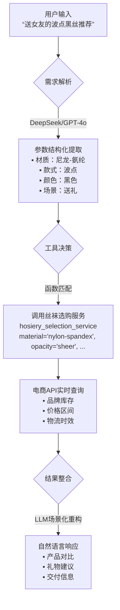

# 目录

- [1.什么是AI Agent（智能体）？](#1.什么是AI-Agent（智能体）？)
- [2.AI Agent的主流设计模式有哪些？](#2.AI-Agent的主流设计模式有哪些？)
- [3.什么是AI Agent中的function call？](#3.什么是AI-Agent中的function-call？)
- [4.什么是AI Agent中的MCP（Model Context Protocol）？](#4.什么是AI-Agent中的MCP（Model Context Protocol）？)
- [5.AI Agent中function call和MCP的区别是什么？](#5.AI-Agent中function-call和MCP的区别是什么？)
- [6.AI Agent中的Agent2Agent(A2A)？](#6.AI-Agent中的Agent2Agent(A2A)？)
- [7.AI Agent中的A2A和MCP的区别是什么？](#7.AI-Agent中的A2A和MCP的区别是什么？)
- [8.当前AI Agent中的主流核心大模型有哪些？](#8.当前AI-Agent中的主流核心大模型有哪些？)
- [9.AI Agent中的系统提示词有哪些作用？](#9.AI-Agent中的系统提示词有哪些作用？)
- [10.在AI Agent中如何构建强大的系统提示词？](#10.在AI-Agent中如何构建强大的系统提示词？)


<h2 id="1.什么是AI-Agent（智能体）？">1.什么是AI Agent（智能体）？</h2>

**在AIGC时代，Rocky认为AI Agent是一个非常重要的方向，也是AIGC技术发展的大势所趋。**

那么，AI Agent到底是什么呢？

Rocky首先给大家讲解一下非AI Agent（Non-Agent），即常规AIGC大模型的运行逻辑，然后我们就能从两者的对比中恍然大悟。

我们以经典的文本内容创作为例子🌰，**非智能体、智能体以及人类创作者的工作流呈现显著差异：**

| **主体类型**   | **执行特征**                                                                 | **流程剖析**                                                                 |
|----------------|-----------------------------------------------------------------------------|-----------------------------------------------------------------------------|
| **Non-Agent（非智能体）**   | 线性单次输出                                                                | 用户输入提示词→大模型直接生成终稿（无迭代过程）                                |
| **AI Agent（智能体）**     | 多阶段认知闭环                                                              | 规划大纲→检索资料→生成初稿→自检修订→循环优化→输出终稿（模拟人类创作思维）         |
| **人类创作者** | 认知驱动型工作流                                                            | 构思框架→信息搜集→内容填充→交叉审核→反复润色（与智能体流程高度同构）              |


**我们可以发现：AI Agent的核心是通过任务解构-执行-反思的认知闭环，实现对人类工作范式的数字孪生。**


**AI行业大牛吴恩达认为，AI Agent的终极演进方向是构建具备完整认知能力的数字主体**，其技术架构可解构为四大核心能力：

1. **反思（Reflection）**：AI Agent模拟人类自我修正行为，如同学生完成作业后的自主检查过程。突破单次推理局限，建立错误检测-反馈-修正的增强回路。在代码生成、法律文书等高精度需求场景实现质量跃升。
2. **工具调用（Tool use）**：AI Agent判定自身能力边界，选择合适的AI工具（AI服务/搜索引擎/专业数据库等）来提升大模型的能力边界。
3. **规划（Planning）**：AI Agent在解决复杂问题时，为到达目标制定合理的行动计划的能力，从而对任务进行拆解。
4. **多智能体协作（Multi-agent collaboration）**：多个AI Agent的组合应用，我们可以畅想当每个用户可配置专属AI团队（产品经理Agent+工程师Agent+测试Agent+商务市场Agent等），传统生产模式将被重构。


我们都知道自动驾驶领域对技术级别有L1-L5之分，级别越高代表越向无人驾驶靠近。**在AIGC时代，我们可以对AIGC技术的能力演进路径进行级别划分，同样可构建五个级别：**

| **层级** | **能力定位**       | **人机协作范式**                                                                 | **演进状态**          |  
|----------|--------------------|---------------------------------------------------------------------------------|---------------------|  
| **L1**   | 基础工具（Tool）        | 用户独立完成全流程，系统无显性AI能力                                            | 技术替代进程中      |  
| **L2**   | 对话辅助（Chatbot）         | 用户主导执行，AI提供信息参考（如知识检索、建议生成）                                | 基础应用形态        |  
| **L3**   | 协同创作（Copilot）        | 人机任务共担：用户设定目标→AI生成初稿→用户修正确认                                | 当前核心价值区      |  
| **L4**   | 智能体（AI Agent）      | 用户定义目标与资源，AI自主实现任务拆解、工具调度、过程管控的全闭环                  | 近通用AGI临界点     |  
| **L5**   | 通用智能（Intelligence）         | 系统自驱完成目标定义、资源获取、工具调用及结果交付                                | 理论发展阶段        |  

当前AI Agent的核心还是基于LLM大模型+深度的Prompts工程，**Rocky认为未来AI Agent会有更多内涵，比如：**
1. AI Agent中的核心大模型可能是基于AIGC多模态大模型构建的。
2. AI Agent中会包含更多的模态能力，比如图像、视频、音频、数字人等。
3. 会有基于AI Agent为核心的爆款AIGC产品问世。
4. 基于AI Agent的AI算法解决方案会在各行各业落地，重构各行各业的业务形态。


<h2 id="2.AI-Agent的主流设计模式有哪些？">2.AI Agent的主流设计模式有哪些？</h2>

**当前主流的AI Agent（Manus、Deep Research等）都是基于LLM大模型 + 一整套AIGC算法解决方案(Prompts工程、Function Call、MCP、AI工程策略、AI功能服务等)构建而成**，同时未来还会持续扩展延伸其内涵。

基于上面的框架，接着再形成了5种主流的AI Agent设计模式：

1. **反射模式（Reflection pattern）**：这个模式的**核心运作机制是构建自检-纠错迭代环**，AI Agent会审查其工作以发现错误并迭代，直到生成最终输出结果。


2. **工具使用模式（Tool use pattern）**：AI Agent允许LLM大模型通过使用外部工具获得更多信息，包括调用API、使用AI服务、查询矢量数据库、执行Python脚本等。**这使得LLM大模型不仅仅依赖于其内部知识，还可以获得互联网世界的庞大实时数据流来扩展知识边界**。


3. **ReAct模式（Reason and Act）**：**ReAct模式结合了反射模式和工具使用模式**，这使其成为当前AI Agent使用的最强大的模式之一。AI Agent既可以自我思考，自我纠错，还可以使用工具与世界交互。


4. **规划模式（Planning pattern）**：在这种模式下，**AI Agent根据任务的复杂程度，设计任务计划流程，对任务进行细分，再对细分子任务动用ReAct 模式进行处理**。可以说这种模式是一种战略思维，可以更有效地解决战略级复杂任务。


5. **多智能体模式（Multi-agent pattern）**：在这个模式中，**AI Agent系统中包含多个子Agent，每个子Agent都分配有一个专用的角色和任务，同时每个子Agent还可以访问外部工具进行综合工作**。最后，所有子Agent协同工作以提供最终结果，同时根据需要将细分任务委派给其他子Agent，形成一个复杂的“AI Agent协同社区”。


<h2 id="3.什么是AI-Agent中的function-call？">3.什么是AI Agent中的function call？</h2>

在AI Agent架构中，**Function Call（函数调用）本质上是智能体通过LLM大模型调用外部能力（API、AI服务、AI工具、数据库、搜索引擎等）并进行整合处理的闭环过程**。

接下来，Rocky举一个生动形象的例子，让我们通俗易懂的领会Function Call的整个流程。

假设我们已经有一个AI Agent系统，里面的核心LLM大模型是DeepSeek和GPT-4o，我们想要设计一个快速帮女朋友购买丝袜的AI服务-《丝袜选购服务》，实现AI Agent能够灵活帮女朋友选购丝袜的功能。

这时，Function Call的整体流程如下所示：
1. 需求解析阶段（Demand Analysis）：我们输入丝袜选购问题，LLM大模型（DeepSeek/GPT-4o）先解析用户自然语言请求（如“帮女友买波点黑丝”），识别核心参数：
```python  
{"品类": "丝袜", "风格": "波点", "颜色": "黑色", "用户身份": "送礼"}  
``` 
2. 工具决策阶段（Tool Orchestration）：如果问到了丝袜选购问题，LLM大模型则分析生成出需要调用丝袜选购服务function以及调用丝袜选购服务function要传入的参数，生成结构化调用JSON指令：
```json  
     {  
       "function": "hosiery_selection_service",  
       "parameters": {  
         "material": "nylon-spandex",  
         "opacity": "sheer",   
         "color": "black",  
         "purpose": "gift"  
       }  
     }  
```  
3. 服务执行阶段（Service Execution）：接着开始调用丝袜选购服务function，返回结构化结果：
```json  
     {  
       "recommendations": [  
         {"brand": "Wolford", "price": 189, "features": ["防勾丝", "微透明"]},  
         {"brand": "Calzedonia", "price": 89, "features": ["简约塑形", "透气"]}  
       ],  
       "delivery_time": "当日达"  
     }  
 ```  
5. 响应生成阶段（Response Synthesis）：最后将function返回的内容追加到输入提示词中，一起给到大模型，让它总结完善回答，并将答案整理好生成回复给我们：
 
> “推荐两款高品质黑丝：  
> 1. **Wolford透肉款**（189元）：顶级防勾丝工艺，微透明设计提升舒适度  
> 2. **Calzedonia塑形款**（89元）：简约显瘦同时透气性强  
> ⚡️均可今日送达，礼物建议选Wolford+礼盒包装”  

### **全流程可视化图表**


到这里，相信大家已经对AI Agent的Function Call有一个清晰的了解，接下来我们再总结一下Function Call与传统API调用的本质区别：

   | **维度**         | 传统API调用               | Agent Function Call          |  
   |------------------|--------------------------|------------------------------|  
   | **输入格式**      | 结构化参数（JSON/XML）   | 自然语言指令                 |  
   | **调用方**        | 开发者硬编码触发          | Agent自主决策触发            |  
   | **错误处理**      | 显式异常捕获              | 反射机制自动重试/替换工具    |  
   | **协议依赖**      | 固定通信协议（REST/gRPC） | 支持MCP等自适应协议          |  


### 关键阶段解析：
1. **意图识别**  
   - 大模型解析“查询天气”语义，定位到工具类别  
2. **参数抽取**  
   - 从自然语言提取结构化参数（`材质`：`尼龙-氨纶`, `款式`：`波点`, `颜色`：`黑色`, `场景`：`送礼`）  
3. **协议转换**  
   - 生成工具要求的调用格式（如OpenAI Function Calling规范）  
4. **结果整合**  
   - 将工具返回的数据转化为自然语言响应  

> **技术哲学启示**：当Function Call从技术组件进化为**AI Agent与现实的通用接口**，人类正将“行动权”赋予人工智能。这不仅是效率革命，更是认知范式的迁移——我们不再需要理解螺丝刀的结构，只需说：“请把画挂在墙上。”


<h2 id="4.什么是AI-Agent中的MCP（Model Context Protocol）？">4.什么是AI Agent中的MCP（Model Context Protocol）？</h2>

2024年11月25日，Anthropic发布技术白皮书《Model Context Protocol: A Standardized Interface for AI Integration》，首次提出MCP（Model Context Protocol协议框架的概念。

MCP（Model Context Protocol）构建了AI大模型与外部应用程序间的上下文交换规范，这使得AI开发者能够以一致的规范将各种实时数据源、AI工具和外接功能连接到AIGC大模型中，就像Type-C让不同设备能够通过相同的接口连接到主机一样。MCP的目标是创建一个通用标准，使 AI 应用程序的开发和集成变得更加简单和统一。

在没有MCP之前，AIGC大模型和外部功能交互时的Function Calling是可以五花八门的，这样就导致了虽然有海量的应用程序和多样的AIGC大模型，但是他们之间却不一定能够兼容组合。而MCP就是以更标准的方式让AIGC大模型使用不同的外部工具，只要这些外部工具根据MCP协议定义输入输出规范。

MCP由三个核心组件构成：Host、Client 和 Server。让我们通过一个实际案例来理解这些组件如何协同工作：

假设我们正在使用AI Agent询问："帮我女朋友购买丝袜？"

Host：AI Agent作为 Host，负责接收我们的提问并与其中的AIGC大模型交互。
Client：当AIGC大模型需要确定丝袜购买方案时，Host 中内置的 MCP Client 会被激活。这个 Client 负责与适当的 MCP Server 建立连接。
Server：在这个例子中，丝袜购买方案 MCP Server 会被调用。它负责执行实际的丝袜购买方案确定操作，访问对应的电商API，并返回找到的丝袜购买方案。

整个流程是这样的：我们的问题 → AI Agent(Host) → AIGC大模型 → 需要丝袜购买信息 → MCP Client 连接 → 丝袜购买 MCP Server → 执行操作 → 返回结果 → AIGC大模型生成回答 → 显示在AI Agent上。

这种架构设计使得AI Agent中的AIGC大模型可以在不同场景下灵活调用各种应用工具和数据源，而AIGC开发者只需专注于开发对应的 MCP Server，无需关心 Host 和 Client 的实现细节。


<h2 id="5.AI-Agent中function-call和MCP的区别是什么？">5.AI Agent中function call和MCP的区别是什么？</h2>

在AI Agent领域视角来看，**MCP可以说是function call的更进一步延伸和封装**。

function call解决了AIGC大模型与外部应用工具之间交互的问题；而MCP则在此基础上对交互的整个流程进行规范化，从而解决海量数据、AIGC大模型、AI应用工具之间的“孤岛”问题。


<h2 id="6.AI-Agent中的Agent2Agent(A2A)？">6.AI Agent中的Agent2Agent(A2A)？</h2>

**Agent2Agent (A2A) 协议** 是驱动多智能体生态系统的核心通信框架，其本质是 **AI Agent之间的标准化协议，也是Agent之间的“社会契约”**。

在没有A2A协议之前，不同的Agent A（DeepSeek）与Agent B（GPT-4o）输出格式各异，无法进行协同合作，形成了很多的AI Agent孤岛。

因此通过A2A协议，为异构 AI Agent之间的互通与交互提供通用的语言：

   ```mermaid
   graph LR
       A[Agent A] -->|原生JSON| B[A2A协议层]
       C[Agent B] -->|原生XML| B
       B --> D[统一通信格式]
       D --> E[共识决策引擎]
   ```

### 核心工作机制
#### 1. **分布式共识流程**
   **案例：多Agent协同撰写报告**
   ```mermaid
   graph TB
       A[研究员Agent] -->|提交初稿| B[共识池]
       C[数据分析Agent] -->|添加图表| B
       D[合规Agent] -->|法律审核| B
       B --> E{共识达成？}
       E -->|是| F[发布终稿]
       E -->|否| G[启动修改协议]
   ```
   - **实用拜占庭容错（PBFT）**：1/3节点故障仍可达成共识

#### 2. **跨平台身份认证**
   - **Agent护照系统**：
     ```json
     {
       "id": "agent://medical/diag-009",
       "issuer": "Huawei_A2A_Cert",
       "public_key": "0x23a7...",
       "scope": ["diagnosis", "report_gen"],
       "expiry": 1735689600
     }
     ```
   - **验证流程**：  
     `JWT签名校验 → 权限范围检查 → 时效验证`

### 产业级应用场景
#### 1. **智能制造：柔性产线调度**
   ```mermaid
   graph LR
       O[订单Agent] -->|需求指令| P[计划Agent]
       P --> M1[机床Agent]
       P --> M2[机械臂Agent]
       M1 -->|完工通知| Q[质检Agent]
       M2 --> Q
       Q -->|质量报告| S[仓储Agent]
   ```
   - **效果**：东莞某工厂部署后，换线时间缩短76%

#### 2. **智慧城市：应急响应联盟**
   | **Agent类型** | **灾难响应动作**        | **协同规则**              |
   |---------------|------------------------|--------------------------|
   | 交通Agent     | 封锁受损路段            | 优先保障救援通道          |
   | 医疗Agent     | 调度救护车              | 根据伤情分级响应          |
   | 电网Agent     | 切断危险区域供电        | 同步消防Agent行动         |
   - **真实事件**：杭州亚运会期间暴雨协同响应提速3倍

#### 3. **金融交易：跨境支付网络**
   - **SWIFT替代方案**：
     ```python
     def cross_border_payment(sender, receiver, amount):
         # 多Agent协同验证
         AML_Agent.check_suspicion(sender)          # 反洗钱审核
         FX_Agent.convert_currency(amount)          # 实时汇兑
         Settlement_Agent.execute(receiver)         # 链上清算
     ```
   - **优势**：传统3天流程压缩至8分钟，费用降低60%

### 技术哲学启示  
当医疗Agent通过A2A协议向药物研发Agent发送`{"action": "compound_design", "target": "EGFR_L858R"}`时，人类目睹了**机器文明的第一次贸易**。A2A协议不仅是技术标准，更是智能体社会的“汉谟拉比法典”——它用代码定义权利边界，用算法建立信任机制，最终将催生**硅基文明的生产关系革命**。


<h2 id="7.AI-Agent中的A2A和MCP的区别是什么？">7.AI Agent中的A2A和MCP的区别是什么？</h2>

MCP协议解决的是AI Agent和各种外部工具/资源之间的交互问题，可以看做是一个AI应用商店协议，主要关注单个AI Agent如何更好的使用外部工具。

而A2A协议解决的是AI Agent和AI Agent之间的交互问题，主要关注不同的AI Agent之间怎么协作的问题。

总的来说，它们是互补的，共同构建AI Agent的生态。


<h2 id="8.当前AI-Agent中的主流核心大模型有哪些？">8.当前AI Agent中的主流核心大模型有哪些？</h2>

Rockyu总结了当前AI Agent中的主流核心大模型，随着AI Agent领域的不断发展，相信未来会有更多核心大模型出现，Rocky也会持续更新本问答：
1. claude-3.7/4-sonnet
2. DeepSeek-R1/V3
3. gemini-2.5系列
4. qwen2.5系列
5. 未来会有更多的LLM大模型和AIGC多模态大模型可以作为AI Agent的核心大模型


<h2 id="9.AI-Agent中的系统提示词有哪些作用？">9.AI Agent中的系统提示词有哪些作用？</h2>

在AI Agent架构中，**系统提示词（System Prompt）** 是AI Agent的核心控制中枢，其设计质量直接决定Agent的可靠性、安全性与执行效能。

### 系统提示词的四大核心作用
#### 1. **角色定义与人格建模**
   ```python
   # 法律顾问Agent示例
   """
   身份：环球律所高级合伙人（执业15年）
   专长领域：跨境并购、知识产权诉讼
   语言风格：严谨专业，引用法条需标注出处
   """
   ```
   - **效果**：  
     - 约束模型自由发挥倾向，幻觉率降低40%  
     - 建立用户对Agent的专业信任感

#### 2. **能力边界锁定**
   ```python
   # 工具调用白名单
   """
   可用工具：
     - contract_review：合同审查（输入PDF→输出风险报告）
     - clause_search：条款库检索（关键词→相似判例）
   禁用行为：
     - 生成法律效力承诺
     - 解释未生效草案
   """
   ```
   - **安全价值**：  
     - 避免越权操作（如医疗Agent禁止诊断）  
     - 符合GDPR/网信办监管要求

#### 3. **认知框架植入**
   | **任务类型** | **预设思维链**                  |
   |--------------|--------------------------------|
   | 合同审查     | 主体校验→权责分析→违约条款评估  |
   | 法律咨询     | 事实提取→法条匹配→解决方案生成  |
   - **效能提升**：  
     - 复杂任务处理速度提升3倍  
     - 结果可预测性达92%

#### 4. **动态上下文管理**
   ```python
   """
   记忆规则：
     - 保留核心实体（公司名/金额/时间节点）
     - 丢弃情绪化表述（用户抱怨等）
     - 持久化关键日期（合同截止日）
   """
   ```
   - **技术创新**：  
     - 在4K上下文窗口中实现10倍信息密度


<h2 id="10.在AI-Agent中如何构建强大的系统提示词？">10.在AI Agent中如何构建强大的系统提示词？</h2>

目前主流的AI Agent系统提示词需要遵循8个设计构建要点：

1. 明确的目标、角色和范围：明确界定AI Agent的身份定位、核心功能及运作领域，能有效锚定其行为模式，设定用户预期，并防止功能范围的无序扩张或产生无意义的反馈。这相当于为AI Agent确立了身份标识与职责边界。
2. 结构化的指令与任务分解：结构化的使用标题、列表、代码块或自定义标签，能帮助AI Agent的维护者清晰理解，也能协助AI Agent更精确地解析、区分不同规则或信息集的优先级，减少歧义。
3. 明确工具集成与使用指南：对于AI Agent的行为，需要向AI Agent描述清楚：它们是什么，它们做什么，如何调用它们（语法、参数），所需的格式（例如XML、JSON），以及至关重要的是，何时不使用它们。这需要详细的描述、清晰的模式和明确的规则。
4. 逐步推理、规划：复杂任务需要需要进行拆解。需要引导AI Agent有条理地思考、规划行动、迭代执行，并在进行下一个任务前，等待用户的反馈或结果，从而减少错误并提升连贯性。
5. 环境和上下文：AI Agent会在各种特定环境（如操作系统、集成开发环境、浏览器沙箱、特定库）中运行。提供这些上下文信息能让AI Agent生成兼容的代码、使用合适的命令，以及理解环境的限制。
6. 特定领域的专业知识和限制：需要告诉AI Agent需要处理的特定领域（如网页开发、数据分析等）。需要在提示词中加入领域专业知识、最佳实践、风格指南以及约束条件，以确保输出内容既高质量又符合上下文的需求。
7. 安全、对齐、拒绝协议：负责任的AI Agent需要明确的界限。提示词需要界定负面的请求，并规定AI Agent应如何拒绝此类请求。也要确保如何正确安全地做事。
8. 设定语气和互动风格：设定一致的角色定位（例如友善的专家、风趣的助手、直率的工程师）能打造更具可预测性和吸引力的用户体验。具体实施时，可从宽泛的指导原则延伸至非常细致的风格化指令。

