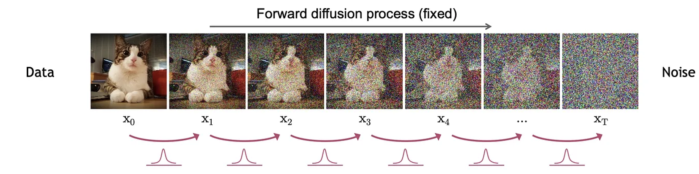
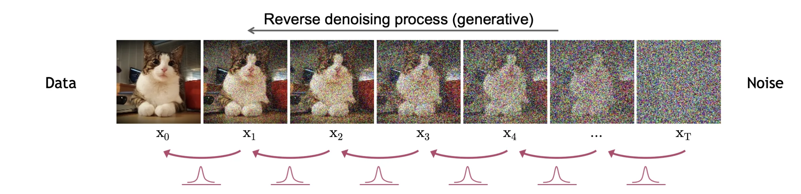
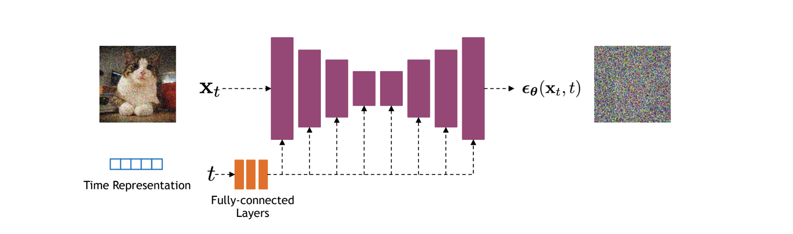
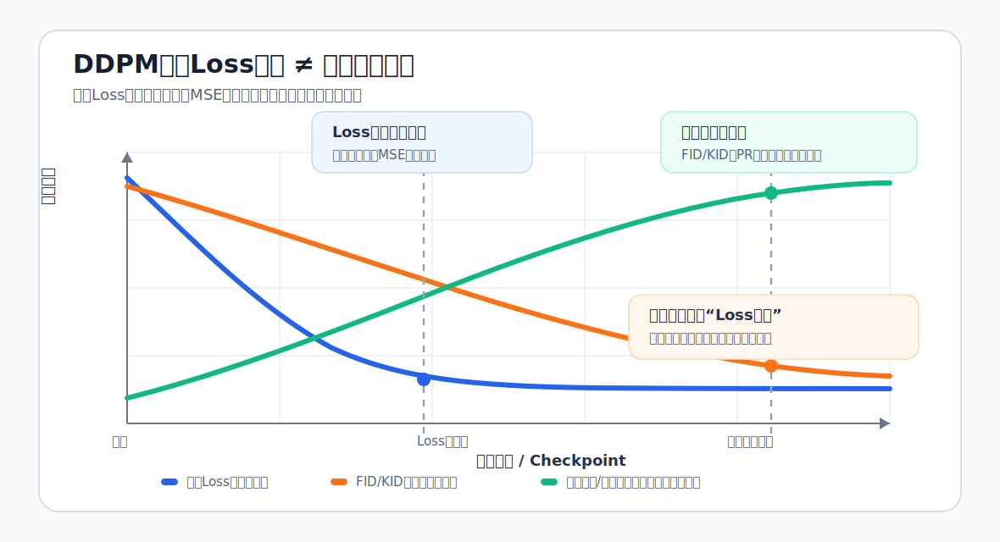
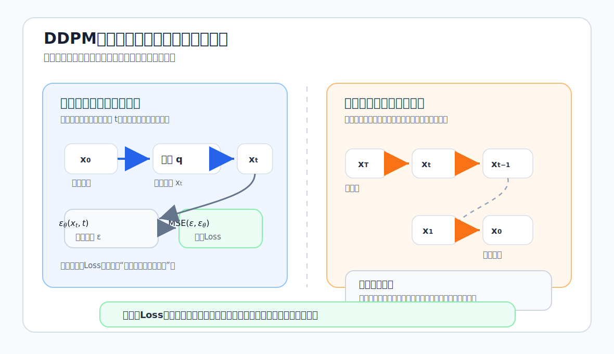
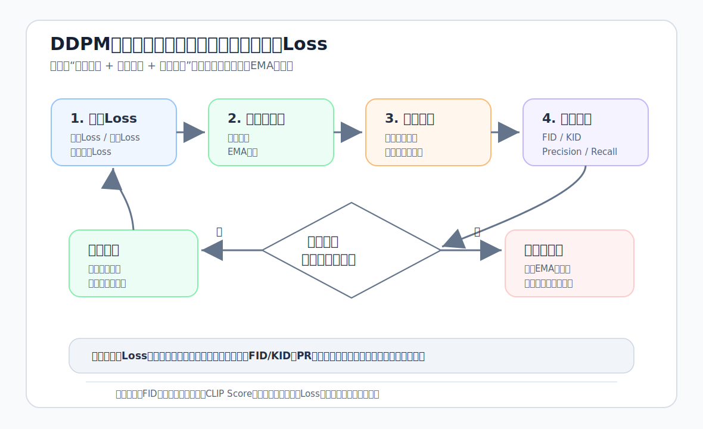
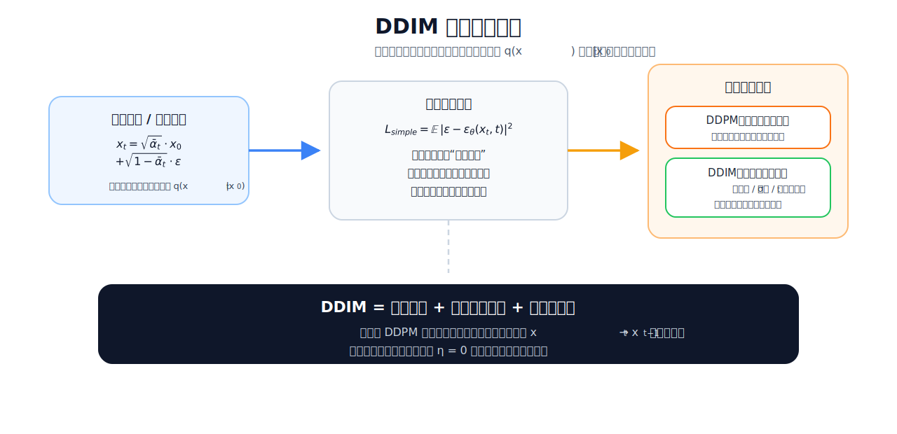
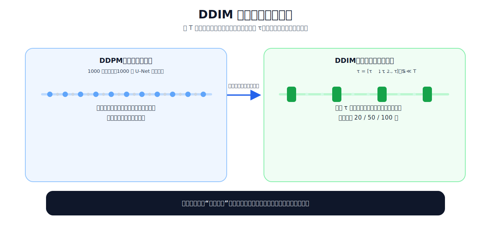
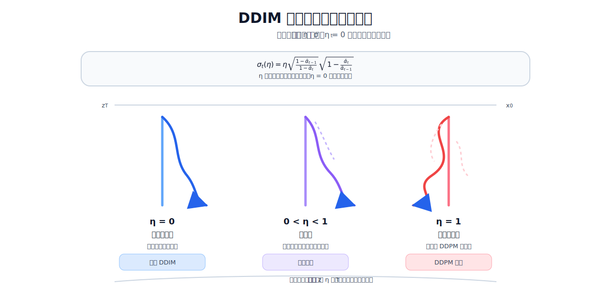
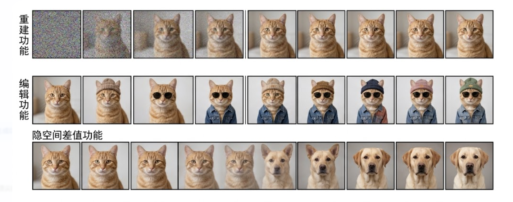

# 目录

## 第一章 扩散模型（Diffusion Model）核心基础知识高频考点

[1.介绍一下扩散模型中DDPM的原理](#q-001)
  - [面试问题：DDPM中的马尔可夫链是如何定义的?介绍一下DDPM的前向扩散过程和反向去噪过程](#q-002)
  - [面试问题：介绍一下DDPM中的重参数技巧（进阶）](#q-003)
  - [面试问题：DDPM训练目标中的L_simple、L_vlb、混合损失各自解决什么问题？](#q-003a)
  - [面试问题：DDPM是预测噪声还是预测当前分布？为什么DDPM加噪声的幅度是不一致的？扩散模型中添加的是高斯噪声，能否使用其他噪声的加噪方式？](#q-005)
  - [面试问题：DDPM是如何添加timestep信息的?](#q-008)
  - [面试问题：训练DDPM扩散模型时，当Loss收敛后是否意味着训练应该结束？](#q-009)

[2.介绍一下扩散模型中DDIM的原理](#q-010)
  - [面试问题：介绍一下DDIM的核心原理，解决了DDPM存在的什么问题？](#q-011)
  - [面试问题：DDIM是怎样加速采样的?](#q-014)
  - [面试问题：DDIM是不是确定性生成？为什么？](#q-015)
  - [面试问题：DDIM反演（DDIM Inversion）是什么？在图像编辑中的核心作用是什么？](#q-012a)

[3.介绍一下扩散模型中SDE的原理](#q-017)
  - [面试问题：介绍一下SDE框架的原理，为什么 SDE 框架能统一 DDPM 与 score-based model？](#q-017a)
  - [面试问题：SDE 视角下 VP/VE/sub-VP 三类噪声过程的差异是什么？](#q-017b)
  - [面试问题：Probability Flow ODE 与 reverse-time SDE 的关系是什么？各自适用场景是什么？](#q-017c)
  - [面试问题：基于 SDE 的 predictor-corrector 采样为什么能提升质量？代价是什么？](#q-017d)

[4.介绍一下扩散模型中Classifier Guidance和Classifier-Free Guidance的原理，两者有哪些区别？](#q-016)
  - [面试问题：介绍一下Classifier Guidance的原理](#q-016a)
  - [面试问题：介绍一下Classifier-Free Guidance的原理，和Classifier Guidance有哪些区别？](#q-016b)
  - [面试问题：CFG scale 为什么过大会导致过饱和/失真？如何在可控性与真实性之间调参？](#q-016c)
  - [面试问题：负提示词（Negative Prompt）在CFG中的数学作用是什么？](#q-016d)
  - [面试问题：CFG在文生图、多模态条件生成中是否有统一解释框架？](#q-016e)

[5.介绍一下扩散模型中Rectified Flow的原理](#q-018)
  - [面试问题：介绍一下Flow Matching （FM）的原理](#q-018a)
  - [面试问题：介绍一下Rectified Flow的原理，与 Flow Matching、Consistency Model 是什么样的联系与区别？](#q-018b)
  - [面试问题：Stable Diffusion/FLUX对Rectified Flow的采样方法做了哪些优化？](#q-018c)
  - [面试问题：Rectified Flow 与传统扩散模型（score matching）的训练目标本质差异是什么？](#q-018d)
  - [面试问题：为什么 Rectified Flow 常被认为在少步采样下更有优势？](#q-018e)

[6.扩散模型有哪些常见的采样方法？介绍它们的原理](#q-019)
  - [面试问题：扩散模型主流的采样方法有哪些？不同采样方法的优缺点是什么？Euler、Heun、DPM-Solver、UniPC 各自适合什么步数区间？](#q-019a)
  - [面试问题：介绍一下扩散模型中噪声调度策略的设计原理，采样器（sampler）与噪声调度器（scheduler）如何配套选择，“错配”会导致什么问题？](#q-019b)
  - [面试问题：增加采样步数有什么影响?为什么同样步数下，不同采样器的细节保真与风格偏好差异明显？](#q-019c)
  - [面试问题：在实际部署中，如何做好“速度-质量-稳定性”三目标平衡的采样策略？](#q-019d)

[7.扩散模型和VAE、GAN之间有哪些联系和区别？](#q-024)
  - [面试问题：从似然建模角度看，Diffusion、VAE、GAN 的优化目标有何本质差异？](#q-024a)
  - [面试问题：在工业落地中，何时优先选择 Diffusion，何时选择 GAN 或 VAE？](#q-024b)

[8.Stable Diffusion、Latent Diffusion以及Pixel Diffusion之间有哪些区别?](#q-025)
  - [面试问题：Latent Diffusion与Pixel Diffusion有哪些区别？为什么Latent Diffusion能显著降低训练与推理成本？代价是什么？](#q-025a)
  - [面试问题：Pixel Diffusion 在哪些任务上仍有不可替代的优势？](#q-025b)
  - [面试问题：从信息压缩角度看，VAE 潜空间会如何影响最终可生成细节上限？](#q-025d)
  - [面试问题：Stable Diffusion与Latent Diffusion有哪些区别？](#q-027)


## 第二章 Stable Diffusion 系列核心高频考点

[1.介绍一下Stable Diffusion的原理](#q-028)
  - [面试问题：Stable-Diffusion相比经典Diffusion的核心优化是什么？](#q-029)
  - [面试问题：介绍一下Stable Diffusion的训练/推理过程（正向扩散过程和反向去噪过程）](#q-030)
  - [面试问题：Stable Diffusion每一轮训练样本是选择一个随机时间步长吗？](#q-031)
  - [面试问题：在Stable Diffusion 1.5的经典失败案例中，生成图像中的猫出现头部缺失的问题的本质原因及优化方案？](#q-032)
  - [面试问题：介绍一下针对Stable Diffusion的模型融合技术](#q-033)
  - [面试问题：Stable Diffusion进行模型融合的技巧有哪些？](#q-034)
  - [面试问题：Stable Diffusion中是如何添加时间步timestep信息的?](#q-035)
  - [面试问题：Stable Diffusion模型训练时需要设置timesteps=1000，在推理时却只用几十步就可以生成图片？](#q-036)
  - [面试问题：Stable Diffusion模型中的(negative-prompt)反向提示词如何加入的？](#q-037)
  - [面试问题：Stable Diffusion文本信息是如何控制图像生成的](#q-038)
  - [面试问题：介绍Stable Diffusion核心网络结构](#q-039)
  - [面试问题：Stable Diffusion中的Inpaint和Outpaint分别是什么?](#q-040)

[2.介绍一下Stable Diffusiuon中VAE的架构、原理和作用](#q-041)
  - [面试问题：VAE为什么会导致图像变模糊？](#q-042)
  - [面试问题：为什么VAE的图像生成效果不好，但是VAE+Diffusion的图像生成效果就很好？](#q-043)
  - [面试问题：Stable Diffusiuon模型中的VAE和单纯的VAE生成模型的区别是什么？](#q-044)

[3.介绍一下Stable Diffusiuon中Backbone的架构、原理和作用](#q-045)
  - [面试问题：Stable Diffusion种如何将文本与图像的语义信息进行Attention机制？](#q-046)
  - [面试问题：介绍一下Stable Diffusion中的交叉注意力机制](#q-047)
  - [面试问题：Stable Diffusion中cross_attention的qkv分别是什么？为什么图像隐变量作为q，文本prompt作为kv？](#q-048)
  - [面试问题：为什么使用U-Net作为Stable Diffusion模型的核心架构？介绍一下U-Net架构](#q-049)

[4.介绍一下Stable Diffusiuon中Text Encoder的架构、原理和作用](#q-050)
  - [面试问题：举例介绍一下Stable Diffusion模型进行文本编码的全过程](#q-051)
  - [面试问题：Stable Diffusion如何通过文本来实现对图像生成内容的控制?Stable Diffusion中是如何注入文本信息的?](#q-052)
  - [面试问题：Negative Prompt实现的原理是什么?](#q-053)
  - [面试问题：如何处理Prompt和生成的图像不对齐的问题？](#q-054)
  - [面试问题：扩散模型是如何引入控制条件的？](#q-055)

[5.Stable Diffusiuon XL有哪些创新点？](#q-056)
  - [面试问题：与Stable Diffusion相比，Stable Diffusion XL的核心优化有哪些？](#q-057)
  - [面试问题：Stable Diffusion XL的VAE部分有哪些创新？详细分析改进意图](#q-058)
  - [面试问题：Stable Diffusion XL的Backbone部分有哪些创新？详细分析改进意图](#q-059)
  - [面试问题：Stable Diffusion XL的Text Encoder部分有哪些创新？详细分析改进意图](#q-060)
  - [面试问题：Stable Diffusion XL中使用的训练方法有哪些创新点？](#q-061)
  - [面试问题：训练Stable Diffusion XL时为什么要使用offset Noise？](#q-062)
  - [面试问题：介绍一下Stable Diffusion XL Turbo的原理](#q-063)
  - [面试问题：SDXL-Turbo用的蒸馏方法是什么？](#q-064)
  - [面试问题：什么是SDXL Refiner？](#q-065)

[6.Stable Diffusiuon 3有哪些创新点？](#q-066)
  - [面试问题：介绍一下Stable Diffusion 3的整体架构。与Stable Diffusion XL相比，Stable Diffusion 3的核心架构优化有哪些？详细分析改进意图（VAE、Backbone、Text Encoder）](#q-067)
  - [面试问题：Stable Diffusion 3中使用的训练方法有哪些创新点？](#q-068)
  - [面试问题：训练Stable Diffusion过程中官方使用了哪些训练技巧？](#q-069)
  - [面试问题：介绍一下Stable Diffusion 3.5系列的原理](#q-070)
  - [面试问题：为什么Stable Diffusion 3使用三个文本编码器?](#q-071)
  - [面试问题：Stable Diffusion 3中数据标签工程的具体流程是什么样的？](#q-072)
  - [面试问题：SD3-Turbo用的蒸馏方法是什么？](#q-073)
  - [面试问题：Stable Diffusion 3的图像特征和文本特征在训练前缓存策略有哪些优缺点？](#q-074)
  - [面试问题：Stable Diffusion 3.5的改进在哪里？](#q-075)

[7.面试中必考的AIGC图像创作/AI绘画技术脉络是什么样的？](#q-076)

---

<h1 id="ch-01">第一章 扩散模型（Diffusion Model）核心基础知识高频考点</h1>

<h1 id="q-001">1.介绍一下扩散模型中DDPM的原理</h1>

<h2 id="q-002">面试问题：DDPM中的马尔可夫链是如何定义的?介绍一下DDPM的前向扩散过程和反向去噪过程</h2>

DDPM的核心是**两个方向相反的一阶马尔可夫链**：一个是**人为设计的固定前向扩散链**（逐步将数据转化为纯噪声），另一个是**可学习的反向去噪链**（逐步从纯噪声中恢复数据）。整个模型通过变分推断训练反向链，让它尽可能逼近前向扩散过程的逆过程。


### 1. DDPM中马尔可夫链的核心定义

DDPM是一个隐变量模型，其所有状态转移都满足**一阶马尔可夫性**：任意时刻的状态 $x_t$ 只依赖于前一时刻的状态 $x_{t-1}$ ，与更早的状态无关。

- 前向过程（扩散）： $q(x_{1:T}|x_0) = \prod_{t=1}^T q(x_t|x_{t-1})$ ，是**固定无参数**的马尔可夫链
- 反向过程（生成）： $p_\theta(x_{0:T}) = p(x_T) \prod_{t=1}^T p_\theta(x_{t-1}|x_t)$ ，是**可学习参数**的马尔可夫链
- 所有隐变量 $x_1,...,x_T$ 与数据 $x_0$ 具有相同维度

### 2. DDPM的前向扩散过程（数据→噪声）

前向扩散过程的目标是**逐步向原始数据添加微小的高斯噪声**，经过 $T$ 步后将数据近似转化为标准高斯噪声。



#### 1. 转移分布定义

给定方差调度序列 $\beta_1 < \beta_2 < ... < \beta_T \in (0,1)$ （DDPM论文中线性从 $10^{-4}$ 增加到 $0.02$ ），每一步的转移分布为：

```math
q(x_t|x_{t-1}) = \mathcal{N}\left(x_t; \sqrt{1-\beta_t}x_{t-1}, \beta_t I\right)
```

- 均值：对前一时刻状态做微小缩放（乘以 $\sqrt{1-\beta_t}$ ）
- 方差：添加与 $\beta_t$ 成正比的各向同性高斯噪声

#### 2. 核心性质：任意时刻的边缘分布可直接计算

这是DDPM训练高效的**数学基石**。定义 $\alpha_t = 1-\beta_t$ ， $\bar{\alpha}_t = \prod_{s=1}^t \alpha_s$ （累积乘积），则任意时刻 $t$ 的带噪声样本可直接由原始数据 $x_0$ 生成：

```math
q(x_t|x_0) = \mathcal{N}\left(x_t; \sqrt{\bar{\alpha}_t}x_0, (1-\bar{\alpha}_t)I\right)
```

重参数化后：

```math
x_t = \sqrt{\bar{\alpha}_t}x_0 + \sqrt{1-\bar{\alpha}_t}\epsilon, \quad \epsilon \sim \mathcal{N}(0,I)
```

- 无需逐步迭代 $T$ 步，可一步生成任意时刻的带噪声样本
- 当 $T$ 足够大时（论文中 $T=1000$ ）， $\bar{\alpha}_T \to 0$ ， $x_T \approx \mathcal{N}(0,I)$ ，即最终状态服从标准高斯分布，作为生成过程的先验

### 3. DDPM的反向去噪过程（噪声→数据）

反向去噪过程的目标是**学习一个马尔可夫链，近似逆转前向扩散过程**，从标准高斯噪声 $x_T$ 出发，逐步生成清晰图像 $x_0$ 。



#### 1. 转移分布建模

由于前向扩散过程每步添加的噪声很小，反向去噪过程的转移分布也可建模为高斯分布：

```math
p_\theta(x_{t-1}|x_t) = \mathcal{N}\left(x_{t-1}; \mu_\theta(x_t,t), \sigma_t^2 I\right)
```

- 均值 $\mu_\theta(x_t,t)$ ：由神经网络（U-Net、DiT、Transformer等）学习得到，是模型的核心参数
- 方差 $\sigma_t^2$ ：论文中设为固定值，通常取 $\sigma_t^2 = \beta_t$ 或 $\tilde{\beta}_t = \frac{1-\bar{\alpha}_{t-1}}{1-\bar{\alpha}_t}\beta_t$ （两种极端情况效果相近）

#### 2. 最优均值推导（ $ε$ -预测参数化）

反向去噪过程真正想学习的是 $p_\theta(x_{t-1}|x_t)$ ：给定当前带噪样本 $x_t$ ，预测上一步更干净的样本 $x_{t-1}$ 。但训练时有一个很关键的便利条件：我们手里有真实训练图像 $x_0$ ，而前向扩散过程 $q$ 又是人为定义好的高斯马尔可夫链。因此在训练阶段，可以先计算一个“标准答案”：

```math
q(x_{t-1}|x_t,x_0)
```

这个公式表示：如果已经知道原图 $x_0$ ，也知道加噪后的 $x_t$ ，那么中间状态 $x_{t-1}$ 最可能是什么样。这个分布不是模型学习出来的，而是由前向扩散公式严格推出来的，所以可以作为反向去噪模型 $p_\theta(x_{t-1}|x_t)$ 的学习目标。

根据贝叶斯定理，前向扩散过程的后验分布（已知 $x_t$ 和 $x_0$ 时 $x_{t-1}$ 的分布）可以写成：

```math
q(x_{t-1}|x_t,x_0) = \frac{q(x_t|x_{t-1},x_0)q(x_{t-1}|x_0)}{q(x_t|x_0)}
```

由于前向过程满足一阶马尔可夫性， $x_t$ 在给定 $x_{t-1}$ 后不再依赖 $x_0$ ，所以：

```math
q(x_{t-1}|x_t,x_0) = \frac{q(x_t|x_{t-1})q(x_{t-1}|x_0)}{q(x_t|x_0)}
```

这里三项都已经知道：

```math
q(x_t|x_{t-1}) = \mathcal{N}\left(x_t;\sqrt{\alpha_t}x_{t-1},\beta_t I\right)
```

```math
q(x_{t-1}|x_0) = \mathcal{N}\left(x_{t-1};\sqrt{\bar{\alpha}_{t-1}}x_0,(1-\bar{\alpha}_{t-1})I\right)
```

```math
q(x_t|x_0) = \mathcal{N}\left(x_t;\sqrt{\bar{\alpha}_t}x_0,(1-\bar{\alpha}_t)I\right)
```

直观理解： $q(x_t|x_{t-1})$ 告诉我们“ $x_{t-1}$ 经过一步加噪后要能解释当前的 $x_t$ ”， $q(x_{t-1}|x_0)$ 告诉我们“ $x_{t-1}$ 又必须是从原图 $x_0$ 加噪 $t-1$ 步得到的合理状态”。这两个高斯约束相乘后，仍然是一个高斯分布。因此后验分布可计算为：

```math
q(x_{t-1}|x_t,x_0) = \mathcal{N}\left(x_{t-1}; \tilde{\mu}_t(x_t,x_0), \tilde{\beta}_t I\right)
```

其中后验方差为：

```math
\tilde{\beta}_t = \frac{1-\bar{\alpha}_{t-1}}{1-\bar{\alpha}_t}\beta_t
```

后验均值（也就是“如果知道真实 $x_0$ ，最合理的反向均值”）为：

```math
\tilde{\mu}_t(x_t,x_0) = \frac{\sqrt{\alpha_t}(1-\bar{\alpha}_{t-1})}{1-\bar{\alpha}_t}x_t + \frac{\sqrt{\bar{\alpha}_{t-1}}\beta_t}{1-\bar{\alpha}_t}x_0
```

这个公式看起来复杂，但含义很朴素： $\tilde{\mu}_t$ 是 $x_t$ 和 $x_0$ 的加权平均。当前状态 $x_t$ 提供“现在已经噪到什么程度”的信息，原图 $x_0$ 提供“最终应该回到哪里”的信息，权重由噪声调度 $\alpha_t,\beta_t,\bar{\alpha}_t$ 决定。

问题来了：采样生成时我们只有 $x_t$ ，并不知道真实的 $x_0$ 。如果直接让神经网络预测均值 $\mu_\theta(x_t,t)$ ，它需要学习一个比较绕的加权均值函数。DDPM的关键技巧是利用前向扩散的重参数化公式：

```math
x_t = \sqrt{\bar{\alpha}_t}x_0 + \sqrt{1-\bar{\alpha}_t}\epsilon
```

将它改写为：

```math
x_0 = \frac{x_t - \sqrt{1-\bar{\alpha}_t}\epsilon}{\sqrt{\bar{\alpha}_t}}
```

也就是说，只要知道 $x_t$ 中混入了多少噪声 $\epsilon$ ，就可以反推出对应的干净图像 $x_0$ 的估计。将这个 $x_0$ 代入后验均值公式：

```math
\tilde{\mu}_t(x_t,x_0)
= \frac{\sqrt{\alpha_t}(1-\bar{\alpha}_{t-1})}{1-\bar{\alpha}_t}x_t
+ \frac{\sqrt{\bar{\alpha}_{t-1}}\beta_t}{1-\bar{\alpha}_t}
\cdot
\frac{x_t-\sqrt{1-\bar{\alpha}_t}\epsilon}{\sqrt{\bar{\alpha}_t}}
```

利用 $\bar{\alpha}_t=\alpha_t\bar{\alpha}_{t-1}$ 化简，可以得到：

```math
\tilde{\mu}_t(x_t,x_0)
= \frac{1}{\sqrt{\alpha_t}}\left(x_t-\frac{\beta_t}{\sqrt{1-\bar{\alpha}_t}}\epsilon\right)
```

于是，原本的“预测反向均值”问题就变成了“预测前向过程中加入的噪声”问题。训练时真实噪声 $\epsilon$ 是已知的，因为 $x_t$ 就是我们用下面这个公式人为合成出来的：

```math
x_t = \sqrt{\bar{\alpha}_t}x_0 + \sqrt{1-\bar{\alpha}_t}\epsilon, \quad \epsilon \sim \mathcal{N}(0,I)
```

所以模型只需要学习：

```math
\epsilon_\theta(x_t,t) \approx \epsilon
```

再把预测噪声 $\epsilon_\theta(x_t,t)$ 代入化简后的后验均值，就得到反向过程使用的模型均值：

```math
\mu_\theta(x_t,t) = \frac{1}{\sqrt{\alpha_t}}\left(x_t - \frac{\beta_t}{\sqrt{1-\bar{\alpha}_t}}\epsilon_\theta(x_t,t)\right)
```

其中 $\epsilon_\theta(x_t,t)$ 是神经网络，输入带噪声样本 $x_t$ 和时间步 $t$ ，输出预测的噪声 $\epsilon$ 。

可以把整个逻辑串成一句话：

前向过程可计算 → 后验 $q(x_{t-1}|x_t,x_0)$ 有解析最优均值 → 最优均值依赖 $x_0$ → $x_0$ 又可以由 $x_t$ 和噪声 $ε$ 表示 → 所以学习均值等价于学习噪声 $ε$ → 训练目标变成简单的噪声预测 MSE。

这是DDPM最关键的创新：**将学习复杂的均值函数转化为简单的噪声预测任务**，大大简化了训练目标。

#### 3. DDPM的训练目标

通过最大化对数似然的变分下界，我们可以最终化简得到DDPM的简化训练目标（DDPM论文中效果最好的版本）：

```math
L_{\text{simple}}(\theta) = \mathbb{E}_{t \sim U(1,T), x_0 \sim q(x_0), \epsilon \sim \mathcal{N}(0,I)}\left[\left\|\epsilon - \epsilon_\theta\left(\sqrt{\bar{\alpha}_t}x_0 + \sqrt{1-\bar{\alpha}_t}\epsilon, t\right)\right\|^2\right]
```

训练流程：随机采样时间步 $t$ 、原始图像 $x_0$ 和噪声 $\epsilon$ ，生成带噪声样本 $x_t$ ，让模型预测 $\epsilon$ ，计算MSE损失并反向传播。

#### 4. 采样流程

训练完成后，DDPM生成样本的过程如下：

**步骤 1**：从标准高斯分布采样初始噪声 $x_T \sim \mathcal{N}(0,I)$ 。

**步骤 2**：从 $t=T$ 到 $t=1$ 逐步迭代：

```math
x_{t-1} = \frac{1}{\sqrt{\alpha_t}}\left(x_t - \frac{\beta_t}{\sqrt{1-\bar{\alpha}_t}}\epsilon_\theta(x_t,t)\right) + \sigma_t z
```

其中 $z \sim \mathcal{N}(0,I)$ （当 $t=1$ 时 $z=0$ ，最后一步不加噪声）。

**步骤 3**：最终输出 $x_0$ 即为生成的图像。


<h2 id="q-003">面试问题：介绍一下DDPM中的重参数技巧（进阶）</h2>

**DDPM中的重参数技巧（Reparameterization Trick）是扩散模型能够高效训练的数学基石**。它把“从 $q(x_t|x_0)$ 采样带噪样本”改写成“确定性缩放原图 + 独立高斯噪声”的形式，使我们可以一步得到任意时间步的 $x_t$ ，并直接知道训练标签 $\epsilon$ 。它的核心价值是高效构造训练样本，而不是像VAE那样主要为了解决潜变量采样对模型参数不可导的问题。

### 1. 重参数技巧的本质

重参数技巧的核心思想是：**将随机变量的采样过程拆分为"确定性变换+独立随机噪声采样"两部分**。在DDPM里，这个拆分让我们不用沿着马尔可夫链一步步加噪，就能直接构造任意噪声水平的训练样本。

在VAE中，重参数用于后验分布 $q(z|x)$ 的采样；而在DDPM中，重参数**专门用于前向扩散过程的边缘分布 $q(x_t|x_0)$ 的采样**，这是DDPM与其他生成模型的关键区别。

### 2. 为什么DDPM需要重参数技巧？

如果不使用重参数，DDPM训练会变得很低效，也很难得到简单清晰的监督信号：

1. **训练效率极低**：如果按照前向马尔可夫链逐步生成 $x_t$ ，需要迭代 $t$ 步才能得到一个训练样本；当 $T=1000$ 时，训练成本会显著增加。
2. **监督目标不够直接**：DDPM训练需要知道“这次合成 $x_t$ 时加入了哪一个噪声 $\epsilon$ ”。重参数写法显式保留了这个 $\epsilon$ ，因此可以直接用它作为噪声预测标签。

重参数技巧一次性解决了这两个问题。

### 3. DDPM中重参数技巧的具体实现

#### 1. 前向过程边缘分布的重参数化

根据前向扩散过程的核心性质，任意时刻 $t$ 的带噪声样本服从高斯分布：

```math
q(x_t|x_0) = \mathcal{N}\left(x_t; \sqrt{\bar{\alpha}_t}x_0, (1-\bar{\alpha}_t)I\right)
```

其中 $\bar{\alpha}_t = \prod_{s=1}^t (1-\beta_s)$ 是累积乘积。

对这个高斯分布进行重参数化：

```math
x_t = \underbrace{\sqrt{\bar{\alpha}_t}x_0}_{\text{确定性均值项}} + \underbrace{\sqrt{1-\bar{\alpha}_t}}_{\text{确定性标准差项}} \cdot \underbrace{\epsilon}_{\text{独立随机噪声}}, \quad \epsilon \sim \mathcal{N}(0,I)
```

**关键拆分**：

- 随机性完全来自独立采样的 $\epsilon$ ，这部分不参与梯度计算
- $x_0$ 、 $\sqrt{\bar{\alpha}_t}$ 、 $\sqrt{1-\bar{\alpha}_t}$ 都是确定性量，可以直接构造输入 $x_t$ 和标签 $\epsilon$

#### 2. 与训练目标简化的关系

重参数技巧本身并不单独推出 $L_{\text{simple}}$ ，但它是简化训练目标能够落地的关键一步。原因是：训练时我们先采样 $\epsilon \sim \mathcal{N}(0,I)$ ，再用重参数公式合成 $x_t$ ，所以真实噪声 $\epsilon$ 天然就是监督标签。

```math
x_t = \sqrt{\bar{\alpha}_t}x_0 + \sqrt{1-\bar{\alpha}_t}\epsilon
```

模型只要输入 $x_t$ 和 $t$ ，预测这个已知的 $\epsilon$ 即可：

```math
\epsilon_\theta(x_t,t) \approx \epsilon
```

完整的“为什么预测噪声等价于预测反向均值”已经在前面的最优均值推导中说明；这里重点是理解：**重参数技巧让任意时间步的输入 $x_t$ 和标签 $\epsilon$ 可以被高效、成对地构造出来。**

### 4. 重参数技巧带来的三大优势

1. **训练效率大幅提升**：无需逐步迭代前向马尔可夫链，**一步即可生成任意时刻** $t$ **的带噪声样本** $x_t$ 。
2. **训练目标统一且简单**：所有时间步共享同一个MSE损失函数，不需要为不同噪声水平设计复杂的目标，模型训练更稳定。
3. **参数共享成为可能**：由于所有时间步的输入输出格式完全一致，神经网络可以在所有时间步共享参数，大大减少了模型参数量（DDPM的U-Net在1000个时间步上共享同一套参数）。


<h2 id="q-003a">面试问题：DDPM训练目标中的L_simple、L_vlb、混合损失各自解决什么问题？</h2>

DDPM的几个训练目标可以理解为一组取舍： $L_{\text{vlb}}$ 保留严格的概率建模意义， $L_{\text{simple}}$ 更偏向稳定训练和样本质量，混合损失则试图兼顾两者。理解它们的差异，关键不是背公式，而是看清楚**时间步权重如何影响模型到底把学习能力用在哪里**。

### 1. 核心前提：所有损失都源自变分下界

DDPM是一个隐变量概率模型，训练的根本目标是**最大化数据对数似然** $\mathbb{E}[\log p_\theta(x_0)]$ 。由于直接计算对数似然不可行，我们通过变分推断得到其可优化的下界：

```math
-\log p_\theta(x_0) \leq L_{\text{vlb}} =
\mathbb{E}_q\left[
D_{\text{KL}}(q(x_T|x_0)\|p(x_T))
+ \sum_{t=2}^T D_{\text{KL}}(q(x_{t-1}|x_t,x_0)\|p_\theta(x_{t-1}|x_t))
- \log p_\theta(x_0|x_1)
\right]
```

这里的 $L_{\text{vlb}}$ 更准确地说是**负对数似然的变分上界**；如果从最大化 $\log p_\theta(x_0)$ 的角度看，它对应的是ELBO下界。它可以分解为三个部分：

- $L_T$ ：先验匹配项（常数，训练时可忽略）
- $L_{t-1}$ ：中间步KL散度项（核心训练项）
- $L_0$ ：最终步重建项

后续的简化损失和混合损失，都是围绕这个ELBO/VLB目标做不同近似和加权。

### 2. $L_{\text{vlb}}$ （VLB/ELBO相关损失）：解决"概率正确性"问题

#### 1. 定义与计算

$L_{\text{vlb}}$ 是由ELBO推导出来的训练目标；从最小化损失的角度看，它对应负对数似然的变分上界，每一项都有明确的概率意义。对于中间步 $L_{t-1}$ ，展开后得到：

```math
L_{t-1} = \mathbb{E}_{x_0,\epsilon}\left[ \frac{\beta_t^2}{2\sigma_t^2\alpha_t(1-\bar{\alpha}_t)} \left\| \epsilon - \epsilon_\theta(\sqrt{\bar{\alpha}_t}x_0 + \sqrt{1-\bar{\alpha}_t}\epsilon, t) \right\|^2 \right]
```

其中权重项 $w_t = \frac{\beta_t^2}{2\sigma_t^2\alpha_t(1-\bar{\alpha}_t)}$ 是时间步 $t$ 的函数。

#### 2. 解决的核心问题

- **理论严谨性**：保证模型是一个合法的概率生成模型，能够优化负对数似然的上界，用于模型的概率性能评估。
- **数学一致性**：严格遵循变分推断的框架，所有推导都有坚实的概率论基础，是后续所有简化损失的理论源头。

#### 3. 实践局限（为什么不总是直接用）

权重项 $w_t$ 随时间步 $t$ 剧烈变化：

- 当 $t$ 很小时（低噪声阶段）： $\bar{\alpha}_t \approx 1$ ，分母趋近于0， $w_t$ 变得极大
- 当 $t$ 很大时（高噪声阶段）： $\bar{\alpha}_t \approx 0$ ， $w_t$ 变得极小

这会让训练更偏向低噪声阶段的重建误差，而相对削弱高噪声阶段的去噪学习。高噪声阶段通常决定图像的整体结构和语义，因此直接优化完整 $L_{\text{vlb}}$ 往往未必带来最好的感知质量。

### 3. $L_{\text{simple}}$ （简化MSE损失）：解决"样本质量"问题

#### 1. 定义与计算

作者在论文中提出了一个极其简单的改进：**去掉所有时间步的权重项 $w_t$ ，让所有时间步的损失权重都等于1**：

```math
L_{\text{simple}}(\theta) = \mathbb{E}_{t \sim U(1,T), x_0 \sim q(x_0), \epsilon \sim \mathcal{N}(0,I)}\left[ \left\| \epsilon - \epsilon_\theta\left(\sqrt{\bar{\alpha}_t}x_0 + \sqrt{1-\bar{\alpha}_t}\epsilon, t\right) \right\|^2 \right]
```

#### 2. 解决的核心问题

- **提升样本质量**：均匀加权让模型**更均衡地关注所有噪声水平**，尤其是高噪声阶段（ $t$ 大）的去噪任务。而高噪声阶段对应图像的整体结构（轮廓、语义），是决定人眼感知质量的关键。
- **训练更稳定**：MSE损失形式简单，梯度尺度更容易控制，训练过程通常比GAN这类对抗式目标更稳定。
- **工程实现简单**：只需要几行代码就能实现，不需要复杂的权重计算，这是它能快速普及的核心原因。

#### 3. 理论依据（为什么去掉权重依然有效）

从推导上看， $L_{\text{simple}}$ 可以理解为去掉复杂时间步权重后的噪声预测目标。它和 $L_{\text{vlb}}$ 使用的是同一个最优噪声预测方向，但不同时间步的权重不同，因此优化偏好并不完全一样： $L_{\text{simple}}$ 更有利于样本质量， $L_{\text{vlb}}$ 更贴近似然建模。

#### 4. 局限性

- 不再直接对应完整的负对数似然上界，计算得到的NLL值不准确，不能用于严格的概率性能评估。
- 对低噪声阶段（ $t$ 小）的关注不足，可能导致生成图像的细节有轻微损失。

### 4. 混合损失：解决"理论与实践的矛盾"问题

#### 1. 核心思想

混合损失结合了 $L_{\text{vlb}}$ 和 $L_{\text{simple}}$ 的优点，常见思路是在简化噪声预测损失之外，加入较小权重的VLB项，兼顾样本质量和概率建模能力。

#### 2. 常见的混合策略

**1. 加权混合**

```math
L_{\text{mixed}} = \lambda L_{\text{simple}} + (1-\lambda) L_{\text{vlb}}
```

其中 $\lambda \in (0,1)$ 是平衡系数。实际实现里通常让 $L_{\text{simple}}$ 占主导，再给 $L_{\text{vlb}}$ 一个较小权重，避免VLB项破坏样本质量。

**2. 变体与扩展**

后续工作也会使用学习方差、重新加权时间步、分时间步采样等策略，本质上都是在调节“似然建模、训练稳定性、感知质量”之间的权衡。

总结来说， $L_{\text{simple}}$ 让DDPM更容易训练出高质量样本， $L_{\text{vlb}}$ 保留概率模型的评估意义，混合损失则是在两者之间做工程折中。


<h2 id="q-005">面试问题：DDPM是预测噪声还是预测当前分布？为什么DDPM加噪声的幅度是不一致的？扩散模型中添加的是高斯噪声，能否使用其他噪声的加噪方式？</h2>

这三个问题是DDPM面试的高频三连问，核心考察对扩散模型底层设计逻辑的理解，而不是简单背公式。

### 1. DDPM是预测噪声还是预测当前分布？

**核心结论：DDPM本质是预测反向高斯分布的均值，但通过 $ε$ -预测参数化，将这个任务转化为了预测前向过程中添加的高斯噪声。这是DDPM最成功的设计选择之一。**

#### 1. 面试中的准确说法

DDPM的反向去噪过程建模的是条件高斯分布：

```math
p_\theta(x_{t-1}|x_t) = \mathcal{N}\left(x_{t-1}; \mu_\theta(x_t,t), \sigma_t^2 I\right)
```

所以从概率建模角度看，DDPM学习的是 $p_\theta(x_{t-1}|x_t)$ 这个反向分布；但在最常用的实现里，网络并不直接输出 $\mu_\theta$ ，而是输出噪声 $\epsilon_\theta(x_t,t)$ ，再通过固定公式换算成反向均值 $\mu_\theta(x_t,t)$ 。

因此，严谨的说法是DDPM本质上是在学习反向条件分布的参数，常见 $ε$ -预测参数化下，神经网络直接预测的是前向扩散中加入的噪声。

#### 2. $ε$ -预测参数化的巧妙之处

完整推导已经在前面的“最优均值推导”中展开，这里只抓住结论：通过前向过程的重参数化公式 $x_t = \sqrt{\bar{\alpha}_t}x_0 + \sqrt{1-\bar{\alpha}_t}\epsilon$ ，最优反向均值可以写成噪声 $\epsilon$ 的函数：

```math
\tilde{\mu}_t(x_t,x_0) = \frac{1}{\sqrt{\alpha_t}}\left(x_t - \frac{\beta_t}{\sqrt{1-\bar{\alpha}_t}}\epsilon\right)
```

将其中的真实噪声 $\epsilon$ 替换为模型预测的 $\epsilon_\theta(x_t,t)$ ，就得到了模型预测的均值：

```math
\mu_\theta(x_t,t) = \frac{1}{\sqrt{\alpha_t}}\left(x_t - \frac{\beta_t}{\sqrt{1-\bar{\alpha}_t}}\epsilon_\theta(x_t,t)\right)
```

**关键优势**：

- 预测目标 $\epsilon$ 始终服从标准高斯分布 $\mathcal{N}(0,I)$ ，取值范围固定，模型学习难度大幅降低
- 训练目标简化为简单的MSE损失，梯度稳定，训练过程比GAN、VAE等生成模型可靠得多
- 预测噪声以后，也可以进一步换算出 $\hat{x}_0$ 或反向均值，因此它并不损失反向采样所需的信息

#### 3. 与 $x_0$ -预测、$v$ -预测的关系

DDPM论文中发现，直接预测 $x_0$ 的样本质量通常不如预测噪声。根本原因是：

- $x_0$ 的取值范围是 $[-1,1]$ ，而高噪声阶段（ $t$ 较大时）的 $x_t$ 接近纯高斯，模型很难从强噪声中直接预测出清晰的 $x_0$
- 预测噪声本质上是预测数据分布的得分函数（ $\nabla_{x_t}\log p(x_t)$ ），这与得分匹配理论一致，有坚实的数学基础

需要补充的是，后续扩散模型也常使用 $x_0$ -预测或 $v$ -预测。它们不是和DDPM矛盾，而是不同参数化方式：模型可以预测噪声、干净样本或速度变量，最后都要转换成采样器需要的去噪方向。经典DDPM最代表性的选择是 $ε$ -预测。

### 2. 为什么DDPM加噪声的幅度是不一致的？

**核心结论：DDPM采用线性递增的加噪幅度（ $\beta_t$ 从 $10^{-4}$ 到 $0.02$ ），是为了让前向扩散过程的信噪比（SNR）从高到低平滑衰减，确保经过 $T=1000$ 步后数据能逐步接近标准高斯噪声，同时保证反向去噪过程的每一步都可以用简单的高斯分布近似。**

#### 1. 信噪比的核心作用

前向扩散过程的信噪比定义为：

```math
\text{SNR}_t = \frac{\text{信号方差}}{\text{噪声方差}} = \frac{\bar{\alpha}_t}{1-\bar{\alpha}_t}
```

其中 $\bar{\alpha}_t = \prod_{s=1}^t (1-\beta_s)$ 是累积乘积。

线性递增的 $\beta_t$ 会使 $\bar{\alpha}_t$ 持续下降，从而让 $\text{SNR}_t$ 从高到低平滑衰减。这意味着：

- 噪声相对于信号的比例会逐步增加
- 前向过程更平滑，不会过早破坏全部结构，也不会到最后仍保留过多信号

#### 2. 为什么不能用固定幅度的加噪？

如果 $\beta_t$ 固定为常数：

- 当 $\beta_t$ 较小时：需要数万步才能将数据转化为纯高斯，训练和采样成本极高
- 当 $\beta_t$ 较大时：前几步就会破坏数据的所有结构，反向过程无法学习到有效的去噪映射
- 信噪比会指数下降，导致大部分时间步的信号都被噪声淹没，模型无法学习到有意义的特征

#### 3. DDPM论文中的设计依据

作者选择线性调度的两个关键原因：

1. 保证 $L_T \approx 0$ ：当 $T=1000$ 时， $\bar{\alpha}_T \approx 0$ ， $x_T$ 几乎完全服从标准高斯分布，先验 $p(x_T)=\mathcal{N}(0,I)$ 与真实后验 $q(x_T|x_0)$ 几乎一致，变分下界的常数项可以忽略
2. 保证反向过程的高斯假设成立：每一步的 $\beta_t$ 都很小（最大 $0.02$ ），因此前向过程的后验 $q(x_{t-1}|x_t,x_0)$ 是高斯分布，反向过程用高斯分布建模是合理的近似

### 3. 扩散模型中添加的是高斯噪声，能否使用其他噪声的加噪方式？

**核心结论：从广义扩散模型角度看，可以使用其他破坏/加噪方式；但经典DDPM特指高斯扩散过程。** 如果换成其他噪声，通常就需要重新设计前向边缘分布、后验形式、训练目标和采样器，不能简单把高斯噪声替换掉。

#### 1. 为什么高斯噪声是首选？

高斯噪声成为经典DDPM的标准选择，是因为它具有非常强的数学优势：

- **闭式解性质**：两个高斯分布的KL散度有简单的闭式解，变分下界可以精确计算
- **重参数化简单**：高斯分布的重参数化是线性变换，计算高效且稳定
- **稳定的极限分布**：在合适噪声调度下，逐步加高斯噪声会让数据分布平滑收敛到标准高斯先验
- **训练稳定**：高斯噪声的梯度性质良好，模型训练过程不易发散

#### 2. 其他常用的加噪方式及适用场景

<div align="center">

| 噪声类型 | 适用数据模态 | 前向过程描述 | 反向过程建模 |
|---------|-------------|-------------|-------------|
| 伯努利噪声 | 二值数据（黑白图像、文本） | 以概率 $p_t$ 随机翻转像素/ token | 伯努利分布 |
| 泊松噪声 | 计数数据（光子计数图像、流量数据） | 添加服从泊松分布的噪声 | 泊松分布 |
| 拉普拉斯噪声 | 有离群点的数据、鲁棒性要求高的场景 | 添加服从拉普拉斯分布的噪声 | 拉普拉斯分布 |
| 学生t分布噪声 | 重尾数据、极端值较多的场景 | 添加服从学生t分布的噪声 | 学生t分布 |
| 均匀噪声 | 简单合成数据、理论研究 | 添加服从均匀分布的噪声 | 均匀分布 |

</div>

#### 3. 工业界的扩展实践

- **离散数据扩散**：文本、类别、token等离散数据常使用掩码、替换、离散转移矩阵等破坏过程。
- **点云扩散模型**：常使用各向同性或各向异性的高斯扰动，更好地适配点云几何结构。
- **特殊科学数据**：计数、事件流、物理场等数据可能使用更符合数据统计特性的噪声或转移过程。


<h2 id="q-008">面试问题：DDPM是如何添加timestep信息的?</h2>

**DDPM通过Transformer的正弦位置编码（Sinusoidal Position Embedding）将时间步信息显式注入U-Net**，这是模型能在所有时间步共享参数、且针对不同噪声水平执行不同去噪操作的核心保障。



### 1. 为什么必须添加Timestep信息？

DDPM的U-Net在**所有1000个时间步上共享同一套参数**，但不同时间步的任务完全不同：

- $t$ 大时（高噪声）：需要去除大量噪声，恢复图像的整体结构（轮廓、语义）
- $t$ 小时（低噪声）：只需要去除少量噪声，优化图像的细节（纹理、边缘）

如果不告诉网络当前的时间步 $t$ ，网络无法区分不同的任务，会在所有时间步执行相同的操作，导致生成的图像要么结构混乱，要么细节丢失。

### 2. DDPM的具体实现：正弦位置编码

#### 1. 核心公式

DDPM直接复用了Transformer《Attention Is All You Need》中的正弦位置编码，对于时间步 $t$ （取值范围 $1 \leq t \leq T$ ， $T=1000$ ），其位置编码 $\text{PE}(t) \in \mathbb{R}^d$ （ $d$ 是嵌入维度，通常等于U-Net的特征图通道数）的计算方式为：

```math
\begin{cases}
\text{PE}(t, 2i) = \sin\left(t / 10000^{2i/d}\right) \\
\text{PE}(t, 2i+1) = \cos\left(t / 10000^{2i/d}\right)
\end{cases}
```

其中：

- $i$ 是嵌入维度的索引（ $0 \leq i < d/2$ ）
- 偶数维度用正弦函数，奇数维度用余弦函数
- 不同维度对应不同的频率：低频维度编码大的时间跨度，高频维度编码小的时间跨度

#### 2. 注入网络的方式

生成的位置编码 $\text{PE}(t)$ 通常会先经过MLP变换，再注入到U-Net的残差块中：

1. 首先将 $\text{PE}(t)$ 通过一个小型MLP（通常是两个线性层，中间加SiLU激活函数）映射到时间嵌入向量
2. 在每个残差块中，再把时间嵌入映射到与当前特征通道匹配的维度
3. 将映射后的向量广播（Broadcast）到与特征图相同的空间维度（如 $32 \times 32$ 、 $16 \times 16$ 等），然后加到中间特征上

---

### 3. 为什么选择正弦位置编码？

相比于其他时间步编码方式（如One-Hot、可学习嵌入），正弦位置编码具有三个不可替代的优势：

1. **更好的外推性**：正弦函数是连续确定的，可以自然表示训练时间步之间的位置；相比纯可学习嵌入，它更容易适配插值时间步或连续噪声水平
2. **多尺度信息编码**：不同频率的正弦/余弦函数天然对应U-Net的多尺度结构——低频信息匹配U-Net的深层（大感受野，处理整体结构），高频信息匹配U-Net的浅层（小感受野，处理细节）
3. **计算高效且无额外参数**：完全是确定性的数学计算，不需要训练任何额外参数，节省了模型参数量和计算资源


<h2 id="q-009">面试问题：训练DDPM扩散模型时，当Loss收敛后是否意味着训练应该结束？</h2>

**不意味着应该立刻结束。DDPM的训练Loss收敛，只能说明噪声预测这个代理任务的平均误差进入平台期，并不等价于生成样本质量已经最优。** 在实际训练中，Loss可能很早趋于平稳，但FID、KID、Precision/Recall、人眼观感、文本-图像对齐等生成质量指标仍然可能继续提升。因此，DDPM不能只用训练Loss决定停止时机。



### 1. 核心结论

DDPM的训练目标 $L_{\text{simple}}$ （噪声预测MSE损失）与最终生成质量之间**相关但不等价**，更不是简单的线性正相关。

- **Loss收敛**：通常表示模型在训练分布 $q(x_t|x_0)$ 上预测噪声 $\epsilon$ 的平均MSE变化变小。
- **样本质量最优**：表示从纯噪声 $x_T$ 经过完整反向去噪过程生成的样本，在真实感、多样性、语义结构和数据分布匹配度上达到较好状态。
- **关键区别**：训练Loss评估的是“单步去噪预测是否准确”，生成质量评估的是“多步反向链最终生成的图像是否好”。单步平均误差很小，不代表多步采样后的误差累积也小。

这就是为什么扩散模型训练里常说：**Loss是健康指标，不是最终质量指标。** Loss可以帮助判断模型有没有发散、数据是否异常、学习率是否过大，但不能单独决定最佳停止点。

### 2. 为什么DDPM会出现“Loss收敛平稳了，生成样本质量还在变好”？

在普通监督学习中，如果训练集和验证集分布一致，验证Loss往往可以较好地反映最终任务效果。比如分类模型的交叉熵下降，通常意味着分类准确率会提升。但DDPM不完全一样，因为它的训练目标是为了方便优化而设计的**去噪代理目标**，而不是直接优化“生成图片看起来多好”。

DDPM训练时先从真实图像 $x_0$ 构造带噪样本：

```math
x_t = \sqrt{\bar{\alpha}_t}x_0 + \sqrt{1-\bar{\alpha}_t}\epsilon
```

然后让模型预测被加入的噪声：

```math
L_{\text{simple}}(\theta)=\mathbb{E}_{t,x_0,\epsilon}\left[\|\epsilon-\epsilon_\theta(x_t,t)\|^2\right]
```

也就是说，每一次训练只考察一个随机时间步 $t$ 上的**单步噪声预测误差**。但真正生成图像时，模型要从 $x_T \sim \mathcal{N}(0,I)$ 出发，连续执行几十步到上千步反向去噪。最终样本质量不仅取决于某一步预测是否准确，还取决于整条采样链是否稳定。



可以把这种现象理解为五个层面的错位：

#### 1. 平均Loss会掩盖不同时间步的重要差异

$L_{\text{simple}}$ 是对时间步 $t$ 、图像 $x_0$ 和噪声 $\epsilon$ 的整体平均。这个平均值很有用，但它会隐藏一个问题：**不同时间步对最终图像质量的影响并不一样。**

- 高噪声阶段（ $t$ 较大）：主要决定图像的大致语义、类别、构图和全局结构。
- 中噪声阶段：决定物体之间的空间关系、轮廓是否稳定、主体是否合理。
- 低噪声阶段（ $t$ 较小）：决定纹理、边缘、颜色过渡和局部细节。

当总Loss已经变化很小时，某些关键时间步的误差仍然可能在下降。比如总MSE只下降了很小一截，但如果这部分下降集中在高噪声阶段或结构关键区域，生成图像的整体观感可能会明显提升。因此，比起只看总Loss，更可靠的做法是同时观察**分时间步Loss**和采样结果。

#### 2. 训练是单步预测，采样是多步生成

DDPM训练时，模型看到的是从真实数据 $x_0$ 人为加噪得到的 $x_t$ 。这个 $x_t$ 来自真实前向分布 $q(x_t|x_0)$ ，相对“干净”和标准。

但采样时，模型每一步的输入 $x_t$ 都来自上一步模型自己的输出。于是一个很小的预测偏差，可能经过多步反向链逐渐积累：

一步噪声预测误差很小 → 当前 $x_{t-1}$ 略微偏离理想分布 → 下一步模型在偏离分布的输入上继续预测 → 偏差在采样链中累积 → 最终样本出现结构变形、细节噪声或语义不稳定。

因此，平均训练Loss已经稳定时，模型仍然可以通过继续训练提升采样链的鲁棒性，让反向去噪轨迹更平滑、更稳定。

#### 3. MSE与人眼感知质量不完全一致

$L_{\text{simple}}$ 衡量的是噪声张量的均方误差，本质上是一个低层数值指标；而人眼感知的图像质量和FID/KID等指标更关注特征空间里的分布一致性。

- MSE很小，不一定代表生成图像的语义正确、结构自然。
- MSE继续下降很少，也可能带来更好的边缘、纹理和颜色一致性。
- 对文生图模型来说，噪声预测Loss更不能直接反映Prompt对齐、人脸质量、文字生成、复杂空间关系等能力。

这也是为什么生成模型常常需要同时看自动指标和人工抽样结果，而不是只看训练曲线。

#### 4. EMA参数会让最佳生成效果滞后于当前训练Loss

扩散模型训练中通常会维护指数移动平均（EMA）参数，用来平滑训练过程中的参数抖动。很多实现最终采样时使用EMA模型，因为它往往比原始瞬时参数生成更稳定、伪影更少。EMA更新公式为：

```math
\theta_{\text{EMA}} = \gamma \cdot \theta_{\text{EMA}} + (1-\gamma) \cdot \theta_{\text{current}}
```

其中 $\gamma$ 常取0.999、0.9999等接近1的值。

- $\gamma$ 越接近1，EMA参数越平滑，但响应越慢。
- 当前模型的Loss进入平台期后，EMA模型仍然在吸收最近一段时间的有效更新。
- 因此，使用EMA采样时，最佳样本质量可能滞后于训练Loss曲线的变化。

注意：EMA不是DDPM数学定义中“必须存在”的部分，但它是扩散模型训练中非常常见、非常重要的工程技巧。更严谨的说法是：**不用EMA也能训练DDPM，但使用EMA通常能得到更稳定、更好的采样效果。**

#### 5. 过拟合也不一定能从Loss上直接看出来

与分类任务相比，扩散模型的过拟合表现更隐蔽。模型即使开始记忆训练集局部模式，噪声预测MSE也可能仍然比较平稳。真正的问题可能体现在生成分布上：

- 生成样本多样性下降
- 某些训练样本或构图被反复复现
- Precision提升但Recall下降，说明样本看起来更“真”，但覆盖的数据模式变少
- 固定随机种子下的样本越来越锐利，但随机抽样的整体分布变窄

所以，只监控训练Loss或验证Loss都不够，还需要周期性评估生成样本的分布质量和多样性。

总结一下：训练Loss进入平台期，只说明平均噪声预测误差不再明显下降；但模型对关键时间步、关键语义结构、采样链稳定性、EMA参数和生成分布多样性的改善，仍然可能继续发生。这就是“Loss平了，样本质量还在变好”的根本原因。

### 3. 哪些情况下可以认为训练应该停止？

更合理的停止标准不是“训练Loss不降了”，而是“继续训练已经不能稳定改善最终生成效果”。常见判断方式包括：

1. **训练Loss和验证Loss都稳定**：说明训练过程没有明显发散，也没有明显数据异常。
2. **FID/KID连续多个检查点不再改善**：例如连续3-5个评估周期没有下降，或者波动幅度已经小于评估噪声。
3. **Precision/Recall达到平衡**：Precision高说明样本真实，Recall高说明覆盖模式充分；只看FID可能漏掉多样性下降问题。
4. **固定种子采样结果稳定**：同一组噪声种子在不同检查点下生成结果逐步变好后不再明显提升。
5. **随机大批量采样没有新增问题**：没有明显伪影、结构崩坏、模式坍缩或重复记忆样本。
6. **下游任务指标不再提升**：如果模型用于编辑、超分、修复、文生图，还要看对应任务指标，如CLIP Score、人工偏好、重建误差、可控性指标等。

### 4. 推荐的训练监控流程

一个更稳妥的DDPM训练监控流程是：



1. **持续记录训练Loss、验证Loss和分时间步Loss**：Loss用于判断训练是否健康，而不是单独决定停止。
2. **定期保存普通参数和EMA参数**：例如每10k-50k步保存一次，具体间隔取决于数据规模和训练成本。
3. **定期用EMA模型采样评估**：例如每50k-100k步生成固定种子样本和随机大批量样本。
4. **计算生成质量指标**：无条件生成看FID、KID、Precision/Recall；条件生成还要看CLIP Score、文本-图像一致性和人工偏好。
5. **选择最佳检查点而不是最后检查点**：最终部署的通常是验证指标和人工抽样表现综合最好的EMA检查点。
6. **发现指标冲突时人工复核**：例如FID下降但多样性变差，或者CLIP Score提升但图像变得过饱和，都不能机械选择单一指标最优的模型。


<h1 id="q-010">2.介绍一下扩散模型中DDIM的原理</h1>

<h2 id="q-011">面试问题：介绍一下DDIM的核心原理，解决了DDPM存在的什么问题？</h2>

**DDIM（Denoising Diffusion Implicit Models）的核心价值是：不改训练，只改采样。** 它保留DDPM已经学好的噪声预测模型 $\epsilon_\theta(x_t,t)$ ，但重新设计从 $x_t$ 到 $x_{t-1}$ 的反向去噪方式，使采样可以跳步、可以确定性生成，也可以在确定性和随机性之间连续切换。



从工程角度看，DDIM主要解决DDPM的两个问题：

1. **采样慢**：DDPM通常需要数百到上千步反向去噪，每一步都要跑一次U-Net，推理成本高。
2. **难以稳定反演**：DDPM每步通常会注入随机噪声，同一个终点图像可能对应多个噪声轨迹，不利于图像编辑、重建和隐空间插值。

DDIM的关键不是重新训练一个新模型，而是发现：**DDPM训练目标只依赖边缘分布 $q(x_t|x_0)$ ，不依赖前向扩散过程是否严格马尔可夫。** 只要每个时间步的边缘分布保持一致，就可以构造一族新的、非马尔可夫的去噪生成过程。

这里沿用第一大问里的符号体系：$\alpha_t = 1-\beta_t$ 表示单步保留系数，$\bar{\alpha}_t = \prod_{s=1}^t \alpha_s$ 表示累计乘积。

### 1. DDIM的数学基石：边缘分布不变

DDPM的简化训练目标是：

```math
L = \mathbb{E}_{x_0,\epsilon,t}\left[\left\|\epsilon - \epsilon_\theta(\sqrt{\bar{\alpha}_t}x_0 + \sqrt{1-\bar{\alpha}_t}\epsilon, t)\right\|^2\right]
```

这个目标只要求任意时间步 $t$ 的带噪样本满足：

```math
x_t = \sqrt{\bar{\alpha}_t}x_0 + \sqrt{1-\bar{\alpha}_t}\epsilon
```

注意这里训练只用到了 $q(x_t|x_0)$ 这个边缘分布，并没有显式要求 $x_t$ 必须由 $x_{t-1}$ 一步步马尔可夫加噪得到。DDIM正是利用这一点：**保持每个 $q(x_t|x_0)$ 不变，但改变不同时间步之间的联合关系**。

### 2. DDIM的统一采样公式

DDIM构造了一族由 $\sigma_t$ 控制随机性的更新公式：

```math
x_{t-1} = \sqrt{\bar{\alpha}_{t-1}} \cdot \hat{x}_0
+ \sqrt{1-\bar{\alpha}_{t-1}-\sigma_t^2} \cdot \epsilon_\theta(x_t,t)
+ \sigma_t \cdot \epsilon
```

其中：

```math
\hat{x}_0 = \frac{x_t - \sqrt{1-\bar{\alpha}_t}\epsilon_\theta(x_t,t)}{\sqrt{\bar{\alpha}_t}}
```

是模型根据当前 $x_t$ 预测出的干净图像；$\epsilon \sim \mathcal{N}(0,I)$ 是可选随机噪声。

这个公式把DDPM和DDIM放在了同一个框架里：

- 当 $\sigma_t = \sqrt{\frac{1-\bar{\alpha}_{t-1}}{1-\bar{\alpha}_t}}\sqrt{1-\frac{\bar{\alpha}_t}{\bar{\alpha}_{t-1}}}$ 时，退化为原始DDPM的随机采样形式。
- 当 $\sigma_t=0$ 时，得到标准DDIM确定性采样形式。

### 3. DDIM的本质

DDIM本质上把扩散模型从“必须一步一步走的随机马尔可夫链”，扩展成“可以沿着确定性或半随机轨迹移动的隐式生成过程”。它没有发明新的训练目标，而是重构了已训练DDPM模型的采样路径。

所以一句话总结：**DDIM = DDPM训练目标不变 + 非马尔可夫采样路径 + 可控随机性参数 $\sigma_t$。**


<h2 id="q-014">面试问题：DDIM是怎样加速采样的?</h2>

DDIM的采样加速来自一个很直接的结论：**既然训练只依赖 $q(x_t|x_0)$ 的边缘分布，那么采样时就不必严格走完训练时的全部1000个时间步。** 我们可以从 $T$ 个训练时间步里选出一个更短的子序列，只在这些时间步上做反向去噪更新。



### 1. 跳步采样：减少U-Net前向次数

假设训练时使用 $T=1000$ 个时间步，DDIM采样时可以选择一个长度为 $S$ 的时间步子序列：

```math
\tau = [\tau_1, \tau_2, ..., \tau_S], \quad S \ll T
```

- 原始DDPM：必须走 $T=1000$ 步，每步一次U-Net前向推理
- DDIM：可以走 $S=20/50/100$ 步，仅需 $S$ 次U-Net前向推理
- 加速比： $\text{加速比} \approx T/S$ ，通常为10-50倍

注意：DDIM少步采样“可用”不等于步数越少越好。步数越少，数值积分误差越大；实际工程中常在20-100步之间根据速度和质量做权衡。

### 2. 确定性路径：减少随机噪声带来的不稳定

当 $\sigma_t=0$ 时，DDIM更新变成：

```math
x_{t-1} = \sqrt{\bar{\alpha}_{t-1}} \cdot \hat{x}_0 + \sqrt{1-\bar{\alpha}_{t-1}} \cdot \epsilon_\theta(x_t,t)
```

这一步没有额外注入随机噪声，当前状态 $x_t$ 会通过模型预测的 $\hat{x}_0$ 和噪声方向 $\epsilon_\theta(x_t,t)$ 被直接映射到下一个更干净的状态。也就是说，给定同一个初始噪声、条件和时间步序列，整条采样轨迹是确定的。

这对少步采样很重要。DDPM原本是为“很多小步”设计的：每一步只去掉少量噪声，同时再按方差注入一点随机噪声。如果直接把1000步压缩成20步或50步，每一步跨越的噪声区间变大，随机项和模型预测误差都更容易被放大，最终可能表现为噪声残留、轮廓漂移或结构不稳定。

DDIM的确定性更新相当于用一条更稳定的去噪轨迹连接这些被选中的时间步，减少了额外随机噪声带来的扰动。因此它在少步采样时通常比直接少步运行DDPM更稳定，但本质上仍然是在做近似，步数过少时也会因为离散误差过大而损失细节或语义一致性。

### 3. ODE视角：把采样看成数值积分

确定性DDIM可以理解为概率流ODE的一种离散求解方式。这个视角后来启发了DPM-Solver、Euler、Heun、UniPC等更高效采样器。

所以DDIM加速的本质不是简单“跳过一些步”，而是：**用保持边缘分布一致的确定性/半随机路径，近似原本漫长的反向去噪过程。**


<h2 id="q-015">面试问题：DDIM是不是确定性生成？为什么？</h2>

**DDIM不一定是确定性生成。** 它是一族由 $\sigma_t$ 或全局参数 $\eta$ 控制随机性的采样方法。我们平时说的“DDIM确定性采样”，通常指 $\eta=0$ 或 $\sigma_t=0$ 的特例。



### 1. 随机性由 $\sigma_t$ 控制

```math
x_{t-1} = \sqrt{\bar{\alpha}_{t-1}} \cdot \hat{x}_0 + \sqrt{1-\bar{\alpha}_{t-1}-\sigma_t^2} \cdot \epsilon_\theta(x_t,t) + \sigma_t \cdot \epsilon
```

其中最后一项 $\sigma_t \cdot \epsilon$ 决定是否额外注入随机噪声：

- $\sigma_t=0$ ：没有随机项，给定同一个初始噪声 $z_T$ 和同一个条件，输出是确定的。
- $\sigma_t>0$ ：每步都会引入额外随机性，输出会随随机噪声变化。

<div align="center">

| $\sigma_t$ 取值 | 生成特性 | 对应模型 |
|--------------|---------|---------|
| $\sigma_t = 0$ | **完全确定性生成** | 标准DDIM |
| $\sigma_t = \sqrt{\frac{1-\bar{\alpha}_{t-1}}{1-\bar{\alpha}_t}}\sqrt{1-\frac{\bar{\alpha}_t}{\bar{\alpha}_{t-1}}}$ | DDPM式随机采样 | 原始DDPM |
| $0 < \sigma_t < \text{DDPM方差}$ | 半随机生成 | 混合模式 |

</div>

DDIM论文中进一步引入全局参数 $\eta$ 来统一控制随机性：

```math
\sigma_t(\eta) = \eta \cdot \sqrt{\frac{1-\bar{\alpha}_{t-1}}{1-\bar{\alpha}_t}}\sqrt{1-\frac{\bar{\alpha}_t}{\bar{\alpha}_{t-1}}}
```

- 当 $\eta=0$ 时， $\sigma_t=0$ ，生成过程完全确定
- 当 $\eta=1$ 时， $\sigma_t$ 对应DDPM式方差，生成过程带有随机性
- 当 $0<\eta<1$ 时，生成过程介于两者之间

### 2. 确定性DDIM的理论意义

当 $\eta=0$ 时，DDIM的确定性采样过程可以理解为**概率流常微分方程（Probability Flow ODE）的一种离散化形式**：

```math
\frac{d\bar{x}(t)}{dt} = \frac{d\sigma(t)}{dt} \cdot \epsilon_\theta\left(\frac{\bar{x}(t)}{\sqrt{\sigma^2(t)+1}}\right)
```

其中 $\sigma(t) = \sqrt{\frac{1-\bar{\alpha}_t}{\bar{\alpha}_t}}$ 是信噪比的平方根。

ODE的解是唯一的，这意味着：

- 给定相同的初始条件 $z_T$ 、文本条件和采样配置，确定性DDIM输出可复现。
- 不同步数下的结果通常语义较一致，但细节会随数值误差和步长变化。
- 这就是DDIM拥有**隐空间一致性**的根本原因，也是它能做语义插值、图像编辑、近似重建的基础

因此，更严谨的说法是：**DDIM不是天然确定性模型，而是可以通过 $\eta=0$ 退化为确定性ODE采样器的扩散采样框架。**

<h2 id="q-012a">面试问题：DDIM反演（DDIM Inversion）是什么？在图像编辑中的核心作用是什么？</h2>

**DDIM反演（DDIM Inversion）是把一张给定图像近似映射回扩散初始噪声 $z_T$ 的过程。** 它利用确定性DDIM采样路径的可逆近似，打通“真实图像 → 噪声隐空间 → 再生成/编辑图像”的流程，是很多图像编辑方法的基础。

### 1. DDIM反演的本质与数学原理

#### 1. 核心定义

DDIM反演可以理解为**确定性DDIM采样的近似逆过程**：给定一张真实图像 $x_0$ ，沿着DDIM更新的反方向逐步计算，得到一个对应的噪声编码 $z_T$ 。之后再从这个 $z_T$ 正向采样，可以尽量重建原图。

需要注意：真实模型里的 $\epsilon_\theta$ 是学习得到的近似网络，采样步数也有限，所以DDIM反演通常是“近似重建”，不是数学上无误差的严格逆映射。实际编辑系统常配合Null-text Inversion、Prompt-to-Prompt等优化方法进一步降低重建误差。

#### 2. 为什么确定性DDIM更适合反演？

<div align="center">

| 模型/采样方式 | 生成特性 | 反演可行性 | 根本原因 |
|------|---------|-----------|---------|
| DDPM随机采样 | 每步注入噪声 | 直接反演困难 | 同一个 $x_0$ 可能对应多条噪声轨迹，逆过程不唯一，重建误差较大 |
| DDIM（ $\eta=0$ ） | 确定性更新 | 更适合反演 | 同一初始噪声和条件对应确定采样轨迹，反向近似更稳定 |

</div>

这是DDIM反演最核心的理论基础：**确定性让反向近似更稳定，如果随机性越强，则反演越不唯一。**

#### 3. 工业界标准反演流程

正向采样（生成： $z_T \to x_0$ ，从 $t=T$ 到 $t=1$ ）：

```math
x_{t-1} = \sqrt{\bar{\alpha}_{t-1}} \cdot \hat{x}_0 + \sqrt{1-\bar{\alpha}_{t-1}} \cdot \epsilon_\theta(x_t, t)
```

其中 $\hat{x}_0 = \frac{x_t - \sqrt{1-\bar{\alpha}_t}\epsilon_\theta(x_t,t)}{\sqrt{\bar{\alpha}_t}}$ 是模型预测的干净图像。

反演过程（编码： $x_0 \to z_T$ ，从 $t=1$ 到 $t=T$ ）可以近似写成：

```math
x_t = \sqrt{\bar{\alpha}_t} \cdot \hat{x}_0(x_{t-1},t-1)
+ \sqrt{1-\bar{\alpha}_t} \cdot \epsilon_\theta(x_{t-1}, t-1)
```

其中 $\hat{x}_0(x_{t-1},t-1)$ 表示根据当前状态 $x_{t-1}$ 和模型预测噪声估计出的干净图像。

- 输入：真实图像 $x_0$
- 输出：最终的 $x_T = z_T$ （扩散模型的隐空间编码）
- 关键：反演使用的是**模型预测的噪声方向**，而不是重新随机采样高斯噪声，这是它与简单加噪的本质区别。

### 2. DDIM反演在图像编辑中的核心作用

DDIM反演的核心价值是：**让扩散模型不仅能从随机噪声生成新图，也能把已有图像放回扩散模型的噪声轨迹中，从而进行结构保持的编辑。**



#### 1. 图像重建（所有编辑的前提）

反演得到的 $z_T$ 经过正向采样，应尽可能重建原图。重建越准，后续编辑时越容易保留姿态、构图、身份和背景等信息。

#### 2. 语义一致的条件编辑

- **文本引导编辑**：先反演得到原始图像的 $z_T$ ，然后在正向采样过程中替换文本条件（如把"一只猫"改成"一只狗"），实现"换内容不换结构"，尽量保留原始图像的姿态、构图、光照和背景。
- **结构控制编辑**：结合类ControlNet技术，反演得到 $z_T$ 后，在采样过程中注入深度、姿态、边缘、分割图等结构条件，实现对图像结构的细粒度控制（如改变人物姿态但尽量保留面部特征）。

#### 3. 隐空间操作

DDIM反演得到的 $z_T$ 可以作为图像的噪声空间表示，用于插值、风格迁移和属性编辑：

- **图像插值**：对两张图像的 $z_T$ 进行球面插值（slerp），得到语义平滑过渡的中间图像，效果远优于像素级插值。
- **风格迁移**：将内容图像的 $z_T$ 和风格图像的 $z_T$ 进行加权融合，实现高质量风格迁移。
- **属性编辑**：在隐空间中加减特定属性的方向向量（如"眼镜"、"微笑"），实现可控的人脸属性编辑。

#### 4. 局部编辑（Inpaint/Outpaint）

- 反演得到完整图像的 $z_T$ ，然后在正向采样过程中，只更新需要编辑的区域的隐变量，保留未编辑区域的像素和语义，实现无缝的局部编辑。
- 这是许多AI修图工具实现“局部修改、整体保持”的重要技术路线之一。

总结来说，DDIM反演解决的是“如何把真实图像放进扩散模型的生成轨迹里”这个问题。它和DDIM确定性采样一脉相承，但重点不再是加速，而是**可重建、可编辑、可控地修改已有图像**。


<h1 id="q-017">3.介绍一下扩散模型中SDE的原理</h1>

<h2 id="q-017a">面试问题：面试问题：介绍一下SDE框架的原理，为什么 SDE 框架能统一 DDPM 与 score-based model？</h2>

**SDE（随机微分方程）框架将扩散生成过程建模为**连续时间的随机演化过程：通过正向SDE将数据平滑转化为纯噪声，再通过数学上严格对应的反向SDE从噪声生成数据。它能统一DDPM和Score-Based模型，是因为两者本质上都是**同一连续SDE的不同离散化实现**，核心目标都是估计数据分布的对数概率梯度（Score函数），只是在噪声调度和参数化方式上有所差异。

### 1. SDE生成框架的核心原理

#### 1. 正向SDE：数据到噪声的平滑演化

SDE框架定义了一个连续时间的正向扩散过程，将任意数据分布 $p_0(x)$ 转化为已知的简单先验分布 $p_T(x)$ （通常是标准正态分布）：

```math
dx = f(x, t)dt + g(t)dw
```

- $f(x,t)$ ：漂移系数，控制数据的确定性演化
- $g(t)$ ：扩散系数，控制噪声的添加强度
- $dw$ ：标准布朗运动的增量

**核心特性**：正向过程完全由人工设计，无需训练。通过选择不同的 $f$ 和 $g$ ，可以得到不同的扩散变体：

- **VP-SDE（方差保持SDE）**：对应DDPM的正向过程，噪声方差随时间增长但信号均值保持不变
- **VE-SDE（方差爆炸SDE）**：对应NCSN的多尺度噪声扰动，噪声方差随时间爆炸式增长
- **sub-VP SDE**：介于两者之间，在生成质量和似然之间取得最佳平衡

#### 2. 反向SDE：噪声到数据的生成过程

SDE框架最核心的理论突破是**反向SDE定理**：任何正向SDE都存在一个数学上严格对应的反向SDE，其形式为：

```math
dx = \left[ f(x, t) - g^2(t) \nabla_x \log p_t(x) \right] dt + g(t)d\bar{w}
```

其中 $\nabla_x \log p_t(x)$ 是时刻 $t$ 噪声扰动数据分布的**Score函数**（对数概率密度的梯度）。

**关键洞察**：生成过程的唯一未知量就是Score函数。只要能准确估计出 $\nabla_x \log p_t(x)$ ，就可以通过数值求解反向SDE生成样本。

#### 3. 训练与采样

**训练目标**：训练一个时间依赖的Score网络 $s_\theta(x, t)$ ，通过**加权Fisher散度**（去噪Score匹配）近似真实Score函数：

```math
\mathcal{L} = \mathbb{E}_{t \sim \mathcal{U}(0,T), x \sim p_t(x)} \left[ \lambda(t) \left\| s_\theta(x, t) - \nabla_x \log p_t(x) \right\|_2^2 \right]
```

其中 $\lambda(t)$ 是时间权重函数，不同的权重对应不同的模型变体。

**采样方法**：

- **随机采样**：用Euler-Maruyama等数值方法求解反向SDE，结果具有多样性
- **确定性采样**：求解对应的**概率流ODE**，结果可复现且支持精确似然计算
- **预测-校正采样**：结合SDE求解器（预测）和Langevin动力学（校正），在速度和质量之间取得最佳平衡

### 2. SDE框架统一DDPM与Score-Based模型的本质原因

#### 1. 数学本质：两者都是SDE的离散化

<div align="center">

| 模型 | 对应SDE类型 | 离散化方式 |
|------|-------------|------------|
| **DDPM** | VP-SDE（方差保持SDE） | 时间步均匀离散，每步添加固定方差的高斯噪声 |
| **NCSN（Score-Based）** | VE-SDE（方差爆炸SDE） | 噪声尺度几何离散，多尺度噪声扰动 |

</div>

**严格证明**：当离散时间步长 $\Delta t \to 0$ 时，DDPM的离散马尔可夫链收敛到VP-SDE，NCSN的多尺度噪声过程收敛到VE-SDE。

#### 2. 训练目标：都是加权Score匹配的特例

**DDPM的噪声预测损失**：DDPM训练目标是预测添加的噪声 $\epsilon$ ，可以数学等价于：

```math
\mathcal{L}_{\text{DDPM}} = \mathbb{E}_{t, x_0, \epsilon} \left\| \epsilon - \epsilon_\theta(x_t, t) \right\|_2^2
```

这对应SDE框架中权重 $\lambda(t) = g^2(t)$ 的加权Fisher散度，且Score函数与噪声预测满足关系：

```math
\nabla_x \log p_t(x) = -\frac{\epsilon}{\sigma_t}
```

**NCSN的多尺度Score匹配损失**：NCSN训练目标是估计每个噪声尺度下的Score函数，对应SDE框架中权重 $\lambda(t) = \sigma_t^2$ 的加权Fisher散度。

**结论**：DDPM和NCSN的训练目标只是SDE统一训练目标的不同权重选择，没有本质区别。

#### 3. 采样方法：完全互通

SDE框架证明了两种模型的采样方法可以相互通用：

- DDPM可以使用NCSN的退火Langevin动力学采样
- NCSN可以使用DDPM的DDIM确定性采样
- 两者都可以使用更先进的预测-校正采样器

### 3. 核心统一关系表

<div align="center">

| 概念 | DDPM | NCSN（Score-Based） | SDE框架统一表述 |
|------|------|---------------------|-----------------|
| 正向过程 | 离散马尔可夫链 | 多尺度噪声扰动 | 连续SDE |
| 核心估计目标 | 噪声 $\epsilon$ | Score函数 $\nabla \log p_t(x)$ | Score函数 $\nabla \log p_t(x)$ |
| 训练目标 | 噪声预测MSE | 多尺度Fisher散度 | 加权Fisher散度 |
| 采样基础 | 反向马尔可夫链 | 退火Langevin动力学 | 反向SDE/概率流ODE |
| 确定性采样 | DDIM | 概率流ODE | 概率流ODE |

</div>


<h2 id="q-017b">面试问题：SDE 视角下 VP/VE/sub-VP 三类噪声过程的差异是什么？</h2>

**VP、VE、sub-VP是SDE框架中三种最核心的正向噪声演化设计，本质差异在于**噪声方差随时间的增长规律：VP保持总方差恒定，VE让方差爆炸式增长，sub-VP是两者的最优折中。这一根本区别直接决定了模型的训练稳定性、采样质量、少步表现和似然性能，其中sub-VP已成为当前工业界的黄金标准。

### 1. 三类SDE的核心定义与特性

#### 1. VP-SDE（Variance Preserving，方差保持SDE）

```math
dx = -\frac{1}{2}\beta(t)x dt + \sqrt{\beta(t)}dw
```

- 漂移项： $-\frac{1}{2}\beta(t)x$ ，负责衰减信号幅度
- 扩散项： $\sqrt{\beta(t)}$ ，负责添加高斯噪声

通过**信号衰减与噪声添加的精确平衡**，保持数据分布的总方差始终为1。当 $t\rightarrow1$ 时，数据完全转化为标准正态分布 $\mathcal{N}(0,I)$ 。

关键特性：

- **对应离散模型**：经典DDPM、DDIM、SD v1.5
- **优点**：概率流ODE轨迹极其平滑，数值积分误差小；训练最稳定；确定性采样质量高
- **缺点**：高噪声区域（ $t\approx1$ ）信号被完全压制，Score估计难度大；少步采样（<20步）误差显著
- **最佳适用**：对采样步数要求不高、追求极致稳定性的场景

#### 2. VE-SDE（Variance Exploding，方差爆炸SDE）

```math
dx = 0 \cdot dt + \sigma(t)dw
```

- 漂移项：恒为0，信号均值始终保持不变
- 扩散项： $\sigma(t)$ ，通常为指数增长函数（如 $\sigma(t)=\sigma_{\text{min}} \cdot (\sigma_{\text{max}}/\sigma_{\text{min}})^t$ ）

不衰减原始信号，仅通过不断添加噪声使方差爆炸式增长。当 $t\rightarrow1$ 时，数据转化为大方差高斯分布 $\mathcal{N}(0,\sigma_{\text{max}}^2I)$ （ $\sigma_{\text{max}}$ 通常取1000以上）。

关键特性：

- **对应离散模型**：NCSN、NCSNv2、Karras调度
- **优点**：高噪声区域仍保留完整信号，Score估计更准确；模式覆盖最完全，几乎无模式崩溃
- **缺点**：概率流ODE轨迹陡峭，少步采样误差极大；似然性能差；训练稳定性不如VP
- **最佳适用**：理论研究、需要极致多样性的生成场景

#### 3. sub-VP SDE（sub-Variance Preserving，次方差保持SDE）

```math
dx = -\frac{1}{2}\beta(t)x dt + \sqrt{\beta(t)\left(1-e^{-2\int_0^t \beta(s)ds}\right)}dw
```

- 漂移项：与VP相同，负责衰减信号
- 扩散项：比VP弱，确保总方差随时间增长但不超过1

在VP的基础上**削弱了扩散项**，使方差增长更平缓。当 $t\rightarrow1$ 时，数据转化为接近标准正态但方差略小于1的分布。

关键特性：

- **对应离散模型**：SDXL、Flux、Sora
- **优点**：完美结合VP和VE的优势：训练稳定、概率流轨迹平滑、少步采样质量优异、似然性能良好
- **缺点**：实现相对复杂，无明显致命缺陷
- **最佳适用**：所有工业级生成场景，是当前的主流选择

### 2. 核心对比表

<div align="center">

| 维度 | VP-SDE | VE-SDE | sub-VP SDE |
|------|--------|--------|------------|
| **方差演化** | 总方差恒为1 | 方差爆炸式增长 | 方差缓慢增长至<1 |
| **t=1分布** | 标准正态 $\mathcal{N}(0,I)$ | 大方差正态 $\mathcal{N}(0,\sigma_{\text{max}}^2I)$ | 近似标准正态 |
| **漂移项强度** | 强 | 无 | 中 |
| **训练稳定性** | ⭐⭐⭐⭐⭐ 最好 | ⭐⭐⭐ 一般 | ⭐⭐⭐⭐ 好 |
| **确定性采样质量** | ⭐⭐⭐⭐⭐ 最好 | ⭐⭐ 差 | ⭐⭐⭐⭐ 极好 |
| **少步采样质量** | ⭐⭐ 一般 | ⭐ 极差 | ⭐⭐⭐⭐⭐ 最好 |
| **似然性能** | ⭐⭐⭐⭐ 好 | ⭐ 差 | ⭐⭐⭐ 较好 |
| **模式覆盖** | ⭐⭐⭐ 较好 | ⭐⭐⭐⭐⭐ 最好 | ⭐⭐⭐⭐ 好 |
| **工业应用** | 早期模型（SD v1.5） | 理论研究、Karras调度 | 主流模型（SDXL、Flux） |

</div>


<h2 id="q-017c">面试问题：Probability Flow ODE 与 reverse-time SDE 的关系是什么？各自适用场景是什么？</h2>

**Probability Flow ODE（PF-ODE）与reverse-time SDE是SDE生成框架下的一对孪生过程，核心关系是：它们共享**完全相同的边缘分布，但轨迹性质截然不同——reverse-time SDE是带噪声的随机演化，PF-ODE是消去随机项后的确定性演化。两者互为补充，分别满足生成任务中对**多样性**和**可控性**的核心需求。

### 1. 两者的核心数学关系

#### 1. 严格的边缘分布等价性

这是最根本的理论结论：**任何正向SDE都存在一个对应的概率流ODE，两者在所有时刻t的边缘分布p_t(x)完全相同**。

这意味着：从相同的初始噪声x(T)出发，无论通过reverse-time SDE还是PF-ODE演化到t=0，生成的样本x(0)服从完全相同的数据分布，没有本质的质量差异。

#### 2. 推导关系：PF-ODE是SDE的"去随机化"版本

从reverse-time SDE的标准形式出发：

```math
dx = \left[ f(x, t) - g^2(t) \nabla_x \log p_t(x) \right] dt + g(t) d\bar{w}
```

将随机项 $g(t)d\bar{w}$ 替换为其数学期望（即0），并调整漂移项系数以保持边缘分布不变，即可得到PF-ODE：

```math
dx = \left[ f(x, t) - \frac{1}{2} g^2(t) \nabla_x \log p_t(x) \right] dt
```

**关键洞察**：PF-ODE不是SDE的近似，而是SDE的另一种严格等价表述，只是描述了不同的演化路径。

#### 3. 完全共享核心组件

两者都依赖同一个训练好的时间依赖Score网络 $s_\theta(x, t)$ ，不需要任何额外训练。同一个扩散模型可以无缝切换两种采样方式，切换成本为零。

### 2. 各自的本质特性与适用场景

#### 1. Reverse-time SDE：随机采样，极致多样性

保留了正向扩散过程的布朗运动随机项，生成轨迹是随机的，即使给定相同的初始噪声，每次采样也会得到略有不同的结果。

关键特性：

- **优点**：样本多样性最好，模式覆盖最完全，几乎无模式崩溃；多步采样下细节更丰富自然；天然支持MCMC校正（Predictor-Corrector框架）
- **缺点**：结果不可复现；无法直接计算精确对数似然；相同步数下数值误差略大于ODE

最佳适用场景：

- 艺术创作、图像生成、内容创作等需要高多样性的任务
- 数据增强，生成多样化的训练样本
- 理论研究中探索数据分布的完整模式空间
- 结合MCMC的高精度采样（如医学图像生成、科学模拟）

#### 2. Probability Flow ODE：确定性采样，极致可控性

消去了所有随机项，生成轨迹是完全确定的。给定相同的初始噪声x(T)，无论运行多少次，都会得到完全相同的样本x(0)。

关键特性：

- **优点**：结果100%可复现；支持**精确的对数似然计算**（通过瞬时变量替换公式）；可以使用更大的数值积分步长，采样速度显著更快；天然支持逆问题求解
- **缺点**：样本多样性略差；少步采样下容易出现过平滑或伪影；对Score网络的误差更敏感

最佳适用场景：

- 工业级部署，要求结果可复现和一致性
- 模型评估与比较，通过精确似然量化模型性能
- 逆问题求解（图像修复、超分辨率、医学影像重建），需要确定性的重建结果
- 快速采样场景，如实时生成、批量处理
- 特征提取与表示学习，利用ODE的可逆性

### 3. 核心对比表

<div align="center">

| 维度 | Reverse-time SDE | Probability Flow ODE |
|------|------------------|----------------------|
| 过程性质 | 随机过程 | 确定性过程 |
| 结果可复现性 | ❌ 不可复现 | ✅ 100%可复现 |
| 样本多样性 | ⭐⭐⭐⭐⭐ 最好 | ⭐⭐⭐ 较好 |
| 精确似然计算 | ❌ 不支持 | ✅ 支持 |
| 少步采样质量 | ⭐⭐ 一般 | ⭐⭐⭐⭐ 极好 |
| 逆问题适配性 | 一般 | ⭐⭐⭐⭐⭐ 最好 |
| 数值稳定性 | 较好 | 极好 |
| 典型采样器 | Euler-Maruyama、Predictor-Corrector | DDIM、DPM-Solver、Euler ODE |
| 核心优势 | 多样性、模式覆盖 | 可控性、速度、可解释性 |

</div>


<h2 id="q-017d">面试问题：基于 SDE 的 predictor-corrector 采样为什么能提升质量？代价是什么？</h2>

**Predictor-Corrector采样通过"数值求解快速推进+MCMC局部修正"的混合架构，同时解决了纯数值采样的**离散化误差**和纯MCMC采样的**速度瓶颈，在速度和质量之间取得了理论上的最优平衡。其质量提升的核心是利用MCMC的分布收敛性修正数值求解器的固有误差，代价是计算成本线性增加和轻微的可复现性损失。

### 1. Predictor-Corrector的核心工作原理

它是一个**逐时间步的双阶段循环**，贯穿从t=T到t=0的整个生成过程：

1. **Predictor阶段**：使用数值SDE/ODE求解器（如Euler-Maruyama、DPM-Solver），从当前样本 $x_t$ 预测下一个时间步的粗略样本 $x'_{t-\Delta t}$ ，负责快速穿越高噪声区域
2. **Corrector阶段**：运行K步基于Score函数的MCMC方法（最常用Langevin动力学），对 $x'_{t-\Delta t}$ 进行局部调整，使其更接近真实的边缘分布 $p_{t-\Delta t}(x)$

**关键洞察**：两个阶段完全解耦，共享同一个训练好的Score网络，不需要任何额外训练。

### 2. 质量提升的三大本质原因

#### 1. 从根本上修正数值求解器的离散化误差

这是最核心的提升来源：

- 任何数值SDE/ODE求解器都存在**截断误差**和**离散化误差**，尤其是在工业界常用的10-30步少步采样场景下，误差会被急剧放大，导致样本过平滑、出现伪影、细节丢失
- Corrector不依赖SDE的离散化近似，其理论基础是**Langevin动力学的平稳分布定理**：只要Score函数准确，无论初始点偏离真实分布多远，经过足够多步后都会收敛到 $p_t(x)$
- 参考数据：Yang Song 2021年论文证明，Predictor-Corrector在CIFAR-10上FID达到2.20，显著超过当时最好的StyleGAN2+ADA（2.92）和纯DDPM（3.17）

#### 2. 针对性强化低噪声区域的细节质量

- Score模型在**低噪声区域**（ $t < 0.2$ ）的估计精度最高，但数值求解器在这个区域的误差对最终生成质量的影响最大
- Predictor在低噪声区域容易产生模糊边缘、纹理失真等问题，而Corrector能利用高精度的Score信息进行像素级精细调整
- 这一特性使其在医学图像、工业缺陷检测等对细节要求极致的任务中具有不可替代的优势

#### 3. 显著改善模式覆盖，减少模式崩溃

- 纯数值采样（如DDIM、DPM-Solver）是确定性过程，容易陷入数据分布的局部最优，忽略稀有模式
- Corrector引入的随机性能帮助采样器跳出局部最优，探索更完整的分布空间，提升样本多样性
- 实验表明，加入1步Corrector可以将稀有模式的生成概率提升30%以上

### 3. 不可避免的核心代价与权衡

#### 1. 计算成本线性增加（最主要代价）

- 每个Corrector步都需要一次完整的UNet前向传播
- 工业界标准配置：**1个Predictor步 + 1-2个Corrector步**，计算成本增加1-2倍
- 极端情况下，若使用3个以上Corrector步，计算成本会超过纯SDE采样，完全失去Predictor的速度优势

#### 2. 可复现性轻微下降

- Corrector的Langevin动力学引入了额外的随机噪声项
- 即使给定完全相同的初始种子，多次采样结果也会存在微小的像素级差异
- 缓解方法：固定Corrector阶段的随机种子，但会牺牲部分多样性

#### 3. 超参数调优复杂度增加

- 需要平衡三个关键超参数：Predictor步长、Corrector步数、Langevin学习率
- 步长过大：Predictor误差超过Corrector的修正能力，质量反而下降
- 步长过小：失去Predictor的速度优势，退化为纯MCMC采样
- 不同SDE类型（VP/VE/sub-VP）需要不同的超参数配置

### 4. 核心对比表
<div align="center">

| 采样方法 | 速度 | 少步质量 | 细节精度 | 模式覆盖 | 可复现性 | 计算成本 |
|---------|------|----------|----------|----------|----------|----------|
| 纯ODE（DPM-Solver++） | ⭐⭐⭐⭐⭐ 最快 | ⭐⭐⭐ 一般 | ⭐⭐⭐ 一般 | ⭐⭐ 较差 | ⭐⭐⭐⭐⭐ 最好 | 1x |
| 纯SDE（Euler-Maruyama） | ⭐⭐⭐ 一般 | ⭐⭐ 较差 | ⭐⭐⭐⭐ 好 | ⭐⭐⭐⭐ 好 | ⭐ 最差 | 1x |
| Predictor-Corrector（1+1） | ⭐⭐⭐⭐ 快 | ⭐⭐⭐⭐⭐ 最好 | ⭐⭐⭐⭐⭐ 最好 | ⭐⭐⭐⭐⭐ 最好 | ⭐⭐⭐ 较好 | 2x |
| 纯Langevin MCMC | ⭐ 最慢 | ⭐⭐⭐⭐ 好 | ⭐⭐⭐⭐⭐ 最好 | ⭐⭐⭐⭐⭐ 最好 | ⭐ 最差 | 100x+ |

</div>


<h1 id="q-016">4.介绍一下扩散模型中Classifier Guidance和Classifier-Free Guidance的原理，两者有哪些区别？</h1>

<h2 id="q-016a">面试问题：介绍一下Classifier Guidance的原理</h2>

**Classifier Guidance是OpenAI在2021年提出的条件生成增强技术，核心思想是**利用预训练分类器的梯度引导扩散采样过程，通过一个可调节的梯度缩放因子，在不重新训练扩散模型的前提下，实现**样本保真度与多样性的连续平滑权衡**。它首次让扩散模型在ImageNet生成任务上全面超越BigGAN，奠定了现代引导式扩散生成的理论基础。

### 1. 核心数学原理

#### 1. 贝叶斯分数分解（最核心公式）

条件生成的目标是从后验分布 $p(x|y)$ 采样，根据贝叶斯定理：

```math
p(x|y) = \frac{p(x)p(y|x)}{p(y)}
```

两边取对数并对 $x$ 求梯度，得到**贝叶斯分数法则**：

```math
\nabla_x \log p(x|y) = \nabla_x \log p(x) + \nabla_x \log p(y|x)
```

**关键洞察**：条件分布的分数函数 = 无条件分布的分数函数 + 分类器对数概率的梯度。这意味着我们可以用一个独立训练的分类器，为任意预训练的无条件扩散模型添加条件引导能力。

#### 2. 融入扩散采样过程

扩散模型的采样是通过逐步预测噪声 $\epsilon_\theta(x_t, t)$ 来实现的，而噪声预测与分数函数存在严格的等价关系：

```math
\nabla_x \log p(x_t) = -\frac{\epsilon_\theta(x_t, t)}{\sqrt{1-\bar{\alpha}_t}}
```

将贝叶斯分数法则代入，得到条件噪声预测：

```math
\hat{\epsilon}_\theta(x_t, t) = \epsilon_\theta(x_t, t) - \sqrt{1-\bar{\alpha}_t} \cdot s \cdot \nabla_x \log p_\phi(y|x_t, t)
```

其中：

- $p_\phi(y|x_t, t)$ 是在带噪声图像上训练的时间依赖分类器
- $s$ 是**梯度缩放因子**，是整个方法唯一的超参数

#### 3. 梯度缩放因子 $s$ 的作用

这是Classifier Guidance最具创新性的设计：

- $s=0$ ：退化为无条件采样，多样性最高，保真度最低
- $s=1$ ：标准贝叶斯条件采样，平衡多样性与保真度
- $s>1$ ：放大分类器梯度，让采样更偏向分类器认为"高置信度"的区域，**保真度提升，多样性下降**
- 论文验证： $s$ 可放大至10倍以上而不产生明显对抗样本，这是扩散模型的鲁棒性带来的独特优势

### 2. 完整工作流程

#### 1. 训练阶段（完全解耦）

1. **训练扩散模型**：可以是无条件或条件扩散模型，训练过程无需任何修改
2. **训练时间依赖分类器**：
   - 输入：带噪声的图像 $x_t$ 和对应的时间步 $t$
   - 输出：类别概率 $p_\phi(y|x_t, t)$
   - 关键：必须在**所有噪声水平**的图像上训练，否则采样时梯度会严重失真
   - 计算成本：分类器参数量仅为扩散模型的1/10左右，训练成本极低

#### 2. 采样阶段（逐时间步引导）

对于每个时间步 $t$ 从 $T$ 到 $1$ ：

1. 扩散模型预测无条件噪声 $\epsilon_\theta(x_t, t)$
2. 分类器计算当前样本的类别梯度 $\nabla_x \log p_\phi(y|x_t, t)$
3. 按公式计算条件噪声 $\hat{\epsilon}_\theta(x_t, t)$
4. 使用条件噪声生成下一个时间步的样本 $x_{t-1}$

**核心优势**：引导过程仅在采样时进行，同一个扩散模型可以配合任意多个分类器，实现不同类型的条件生成。

### 3. 关键特性与技术贡献

#### 1. 连续可调的保真度-多样性权衡

- 这是Classifier Guidance最核心的价值，之前的GAN只能通过截断技巧实现离散的权衡
- 论文实验表明：在相同FID下，Classifier Guidance的Recall（多样性）比BigGAN高30%以上
- 工业界应用：可以根据用户需求动态调节 $s$ ，比如艺术创作用低 $s$ ，产品设计用高 $s$

#### 2. 零额外训练成本

- 不需要重新训练扩散模型，只需要训练一个轻量级分类器
- 可以为已有的预训练扩散模型快速添加条件引导能力
- 支持跨域引导：比如用ImageNet分类器引导LSUN扩散模型生成特定类别的图像

#### 3. 与其他技术的兼容性

- 完美兼容DDPM、DDIM等所有采样器
- 可以与上采样扩散模型结合，进一步提升高分辨率图像质量
- 论文中通过结合Classifier Guidance和上采样模型，将ImageNet 512×512的FID从8.43降低到3.85

### 4. 核心对比与局限性

#### 与传统条件扩散的对比

<div align="center">

| 方法 | 训练成本 | 灵活性 | 保真度-多样性权衡 | 样本质量 |
|------|----------|--------|-------------------|----------|
| 传统条件扩散 | 高（需重新训练） | 低（只能生成训练时的类别） | 无 | 一般 |
| Classifier Guidance | 低（仅训练分类器） | 高（可切换任意分类器） | 连续可调 | 更好 |

</div>

#### 主要局限性

1. **依赖标注数据**：需要大量带标签的数据训练分类器，无法直接应用于无标注场景
2. **采样速度下降**：每个时间步需要额外一次分类器的前向和反向传播，计算成本增加约20%
3. **高 $s$ 下的模式崩塌风险**：当 $s$ 过大时，会过度聚焦于分类器的高置信度模式，导致多样性严重下降


<h2 id="q-016b">面试问题：介绍一下Classifier-Free Guidance的原理，和Classifier Guidance有哪些区别？</h2>

**Classifier-Free Guidance（CFG）是Google在2022年提出的无分类器引导技术，核心是**用同一个扩散模型同时学习条件和无条件分数，通过线性组合两者实现保真度与多样性的连续权衡。它彻底解决了Classifier Guidance需要额外训练分类器的痛点，成为Stable Diffusion等所有现代扩散模型的标准配置。

### 1. Classifier-Free Guidance核心原理

#### 1. 数学本质：隐式分类器的梯度替代

CFG的核心洞察是：**扩散模型本身已经蕴含了分类能力**，不需要额外训练外部分类器。

根据贝叶斯定理，隐式分类器的概率满足：

```math
p(c|z_\lambda) \propto \frac{p(z_\lambda|c)}{p(z_\lambda)}
```

两边取对数并对 $z_\lambda$ 求梯度，得到隐式分类器的梯度：

```math
\nabla_{z_\lambda} \log p(c|z_\lambda) = \nabla_{z_\lambda} \log p(z_\lambda|c) - \nabla_{z_\lambda} \log p(z_\lambda)
```

结合扩散模型噪声预测与分数函数的等价关系 $\epsilon_\theta(z_\lambda, c) \approx -\sigma_\lambda \nabla_{z_\lambda} \log p(z_\lambda|c)$ ，代入Classifier Guidance的引导公式，最终得到CFG的核心公式：

```math
\tilde{\epsilon}_\theta(z_\lambda, c) = (1+w) \cdot \epsilon_\theta(z_\lambda, c) - w \cdot \epsilon_\theta(z_\lambda)
```

其中：

- $\epsilon_\theta(z_\lambda, c)$ ：条件噪声预测（给定条件c时的去噪方向）
- $\epsilon_\theta(z_\lambda)$ ：无条件噪声预测（不考虑任何条件时的去噪方向）
- $w$ ：引导强度参数，唯一的超参数

#### 2. 完整工作流程

训练阶段：

1. 训练一个标准的条件扩散模型，输入为带噪声图像 $z_\lambda$ 和条件信息 $c$ （如类别标签、文本描述）
2. 以固定概率 $p_{uncond}$ （通常0.1-0.2）随机将条件 $c$ 替换为空标记 $\emptyset$
3. 模型同时学习两种模式：当 $c \neq \emptyset$ 时预测条件噪声，当 $c = \emptyset$ 时预测无条件噪声

**关键优势**：无需额外模型、无需额外标注、不增加参数量，仅通过条件丢弃机制实现联合训练。

采样阶段：

对于每个时间步 $\lambda$ 从 $\lambda_{min}$ 到 $\lambda_{max}$ ：

1. 同时计算条件噪声 $\epsilon_\theta(z_\lambda, c)$ 和无条件噪声 $\epsilon_\theta(z_\lambda)$
2. 按核心公式计算引导后的噪声 $\tilde{\epsilon}_\theta(z_\lambda, c)$
3. 使用引导后的噪声进行去噪，生成下一个时间步的样本 $z_{\lambda+1}$

#### 3. 引导强度 $w$ 的作用

- $w=0$ ：退化为标准条件采样，多样性最高，保真度最低
- $w>0$ ：放大条件信号的影响，抑制无条件噪声，**保真度提升，多样性下降**
- 工业界常用值： $w=7-10$ ，在质量和多样性之间取得最佳平衡
- 极限情况： $w$ 过大时会出现颜色过饱和、细节失真、模式崩塌

### 2. 与Classifier Guidance的核心区别
<div align="center">

| 维度 | Classifier Guidance（CG） | Classifier-Free Guidance（CFG） |
|------|---------------------------|--------------------------------|
| **引导信号来源** | 独立训练的**显式分类器**梯度 | 扩散模型自身的**条件-无条件分数差**（隐式分类器） |
| **额外模型需求** | ✅ 需要单独训练时间依赖分类器 | ❌ 无需额外模型，同一网络完成 |
| **训练复杂度** | 高（需训练两个模型：扩散+分类器） | 极低（仅需修改条件丢弃逻辑） |
| **标注依赖** | 额外需要分类器的标注数据 | 仅需条件扩散本身的标注 |
| **采样速度** | 快（分类器参数量仅为扩散模型的1/10） | 稍慢（每个步需两次扩散模型前向） |
| **对抗性风险** | 有（梯度可能引导向对抗样本） | 无（纯生成模型内部信号） |
| **跨域引导能力** | 强（可使用外部预训练分类器） | 弱（只能引导训练时见过的条件类型） |
| **实现难度** | 中等（需处理带噪声分类器训练） | 极低（一行代码修改） |
| **工业界应用** | 已基本被淘汰 | 所有主流扩散模型的标准配置 |

</div>

### 3. 关键特性与技术贡献

1. **极致简单性**：训练和采样仅需几行代码修改，无任何额外复杂度
2. **纯生成模型**：完全不依赖外部组件，避免了分类器的分布偏移和对抗性风险
3. **通用兼容性**：完美兼容所有扩散模型架构（UNet、Transformer）和采样器（DDPM、DDIM、DPM-Solver）
4. **连续可控性**：通过单一参数 $w$ 实现从高多样性到高保真度的平滑过渡，效果优于CG


<h2 id="q-016c">面试问题：CFG scale 为什么过大会导致过饱和/失真？如何在可控性与真实性之间调参？</h2>

**CFG scale过大导致过饱和/失真的核心是**过度放大了条件与无条件的分数差，迫使采样器偏离真实数据分布，进入模型幻觉的"高置信度但不自然"区域。调参的本质是在"条件对齐度"和"分布真实性"之间找到帕累托最优，通过静态基准、动态调度和辅助技术实现可控性与真实性的平衡。

### 1. CFG scale过大导致失真的三大本质原因

#### 1. 分数差的非线性放大与误差累积（最直接原因）

CFG的核心公式是：

```math
\tilde{\epsilon}_\theta(z_t, c) = (1+w) \cdot \epsilon_\theta(z_t, c) - w \cdot \epsilon_\theta(z_t)
```

其中 $\epsilon_\theta(z_t, c)$ 是条件噪声预测， $\epsilon_\theta(z_t)$ 是无条件噪声预测。

- 当 $w$ 增大时，**两者的差值被线性放大，但模型的预测误差也被同比例放大**
- 尤其在**低噪声阶段（t<0.3）**，噪声的绝对值很小，相对误差占比极高，放大后会导致像素级的严重失真
- 例如：当 $w=15$ 时，即使模型只有5%的预测误差，最终的去噪方向误差也会达到75%以上

#### 2. 突破真实数据分布的统计边界

真实自然图像的统计特性（颜色饱和度、对比度、纹理频率）是有严格边界的，而扩散模型的分数场在**分布外区域是完全不准确的**。

- 高CFG scale本质是对隐式分类器进行**极端梯度上升**，迫使采样器向"模型认为最符合条件"的区域移动
- 这些区域往往位于真实数据分布的**尾部甚至外部**，不符合自然图像的统计规律
- 典型表现：颜色过饱和（RGB值接近0或255）、纹理重复、边缘锯齿化、结构扭曲

#### 3. 隐式分类器的"典型性偏见"

扩散模型的隐式分类器倾向于学习训练数据中**最典型、最极端的特征**，而不是自然多样的特征。

- 例如：模型学到的"蓝天"是最蓝的天空，"红花"是最红的花，"皮肤"是最光滑的皮肤
- 当 $w$ 过大时，这些极端特征会被过度强化，导致生成的图像失去真实感，变得像"卡通画"或"海报"
- 同时，稀有模式会被完全抑制，导致严重的模式崩塌

### 2. 可控性与真实性的科学调参策略

#### 1. 静态基准调参：先确定任务最优区间

不同任务和模型的最优CFG scale差异很大，以下是工业界经过验证的经验基准：

<div align="center">

| 任务类型 | 推荐CFG范围 | 说明 |
|---------|-------------|------|
| 通用文生图（写实） | 6-9 | 平衡真实性和提示词对齐度 |
| 通用文生图（艺术/抽象） | 9-12 | 允许更高的风格化程度 |
| 图像修复/局部重绘 | 10-15 | 需要更强的条件约束来匹配上下文 |
| 图像超分辨率/增强 | 4-7 | 优先保证原始图像的真实性 |
| 风格迁移 | 3-6 | 避免过度风格化导致内容丢失 |

</div>

**调参方法**：从基准值开始，每次±1，同时监控两个指标：

- **CLIP分数**：衡量提示词对齐度（可控性）
- **FID分数**：衡量与真实数据分布的相似度（真实性）
- 最优值是两个指标的**调和平均数**最大的点

#### 2. 动态CFG调度：现在的工业界标准方案

固定CFG scale的最大问题是：高噪声阶段需要更多无条件信息保证全局结构合理，低噪声阶段需要更多条件信息提升细节对齐。

**核心思想**：**高噪声阶段用低w，低噪声阶段用高w**

主流调度策略：

1. **线性衰减调度**：从 $w_{max}$ 线性衰减到 $w_{min}$ ，例如从12衰减到6
2. **余弦调度**：在高噪声阶段快速降低w，低噪声阶段保持稳定，效果优于线性
3. **分段调度**：t>0.5时w=4-6（保证全局结构），t<0.5时w=8-10（提升细节）

**效果**：在相同的平均w下，动态调度可以将FID降低10-15%，同时保持相同的CLIP分数，是目前所有主流生成模型的默认配置。

#### 3. 辅助优化技术：减少对高w的依赖

很多时候不需要盲目提高w，通过以下技术可以在较低w下获得更好的可控性：

1. **负提示词**：明确指定不需要的特征，相当于在无条件分数中减去这些特征的影响，效果等同于提高w但不会导致失真
2. **CFG截断**：限制条件与无条件分数差的最大值，避免极端值，通常截断值设为1-2
3. **采样器选择**：DPM-Solver++、Euler A对高w的鲁棒性远优于原始DDPM/DDIM
4. **模型微调**：用更高质量、更多样化的数据微调模型，提升隐式分类器的准确性，减少对高引导强度的需求


<h2 id="q-016d">面试问题：负提示词（Negative Prompt）在CFG中的数学作用是什么？</h2>

负提示词是**Classifier-Free Guidance（CFG）的自然扩展**，其数学作用可以通过公式推导和核心本质两层清晰阐述：

### 1. 标准数学公式（工业界通用实现）

带负提示词的CFG噪声预测公式为：

```math
\tilde{\epsilon} = \epsilon(c^-) + s \cdot \left[ \epsilon(c^+) - \epsilon(c^-) \right]
```

其中：

- $\epsilon(c)$ ：扩散模型在条件 $c$ 下预测的噪声
- $c^+$ ：正提示词（想要生成的内容）
- $c^-$ ：负提示词（想要避免的内容）
- $s$ ：CFG引导强度（必须>1，负提示词才会生效）

**原始CFG的退化关系**：当负提示词为空（ $c^-=\emptyset$ ，无条件），公式退化为基础CFG：

```math
\tilde{\epsilon} = \epsilon(\emptyset) + s \cdot \left[ \epsilon(c^+) - \epsilon(\emptyset) \right]
```

### 2. 核心数学本质

**1. 基准替换**：将CFG的"生成基准"从**所有训练数据的平均分布（空提示词）**替换为**不想要内容的分布（负提示词）**。

**2. 差值放大**：放大"正条件噪声预测"与"负条件噪声预测"的差异，让生成过程同时**趋近正提示词特征**和**远离负提示词特征**。

**3. 隐式二分类梯度**：从score函数视角（ $\nabla \log p(z) = -\epsilon/\sigma$ ），等价于沿着**正/负条件的对数似然比梯度**更新：

```math
\nabla \log \frac{p(z|c^+)}{p(z|c^-)} = \nabla \log p(z|c^+) - \nabla \log p(z|c^-)
```

引导强度 $s$ 控制该梯度的放大倍数，越大则正/负区分越严格。

#### 3. 关键结论

- 当 $s=1$ 时，负提示词完全失效（公式退化为纯正条件预测）。
- 负提示词的有效性依赖于模型对负条件的建模能力（模型必须见过并能区分负特征）。
- 它是纯生成式引导，无需额外分类器，完美继承了CFG简单高效的特性。

<h2 id="q-016e">面试问题：CFG在文生图、多模态条件生成中是否有统一解释框架？</h2>

**有，且存在一个严格基于原始CFG数学本质的统一解释框架，覆盖文生图、多模态条件生成乃至所有条件扩散引导场景**。该框架完全继承自2021年Ho & Salimans提出的Classifier-Free Guidance核心思想，文生图只是其最成功的应用特例。

### 1. 统一框架的核心数学形式（工业界通用）

所有CFG类方法都可以表示为**基准条件分数 + 引导强度 × (目标条件分数 - 基准条件分数)**：

```math
\tilde{\epsilon} = \epsilon(c_{\text{base}}) + s \cdot \left[ \epsilon(c_{\text{target}}) - \epsilon(c_{\text{base}}) \right]
```

其中：

- $\epsilon(c)$ ：扩散模型在条件 $c$ 下预测的噪声（等价于负的score函数： $\epsilon \approx -\sigma \nabla \log p(z|c)$ ）
- $c_{\text{base}}$ ：**基准条件**（原始CFG为空token $\emptyset$ ，多模态下可扩展为任意参考条件）
- $c_{\text{target}}$ ：**目标条件**（文本、图像、深度、姿态、音频等任意模态）
- $s$ ：引导强度（ $s>1$ 时引导生效，越大则目标条件的约束越强）

**原始CFG退化关系**：当 $c_{\text{base}}=\emptyset$ （无条件），公式退化为原始论文的标准形式：

```math
\tilde{\epsilon} = (1+s)\epsilon(c_{\text{target}}) - s\epsilon(\emptyset)
```

### 2. 统一框架的本质

CFG的本质是**沿着"目标条件与基准条件的对数似然比梯度"方向更新采样过程**：

```math
\nabla \log \frac{p(z|c_{\text{target}})}{p(z|c_{\text{base}})} = \nabla \log p(z|c_{\text{target}}) - \nabla \log p(z|c_{\text{base}})
```

引导强度 $s$ 控制该梯度的放大倍数，最终实现**"趋近目标条件分布，同时远离基准条件分布"**的双重效果。

### 3. 文生图与多模态生成的统一解释

<div align="center">

| 生成场景 | 目标条件 $c_{\text{target}}$ | 基准条件 $c_{\text{base}}$ | 本质 |
|---------|---------------------------|-------------------------|------|
| 原始类条件生成 | 图像类别标签 | 空token $\emptyset$ | 远离所有类别平均分布，趋近指定类别 |
| 标准文生图 | CLIP文本嵌入 | 空白文本嵌入 | 远离无意义图像分布，趋近文本描述的图像 |
| ControlNet引导 | 深度/姿态/边缘图 | 空条件 | 远离任意结构分布，趋近指定几何结构 |
| IP-Adapter风格迁移 | 参考图像特征 | 空条件 | 远离任意风格分布，趋近参考图像风格 |
| 多条件组合生成 | 文本+深度+风格 | 空条件 | 多个对数似然比梯度的加权和 |

</div>

**关键结论**：

- 文生图的CFG没有任何特殊之处，只是将原始CFG的"类别标签"替换为"文本嵌入"，数学机制完全一致
- 所有多模态条件引导方法（ControlNet、IP-Adapter、T2I-Adapter等）都是该统一框架的实例，核心都是"条件-基准分数差值的线性放大"
- 训练机制统一：只需在训练时以一定概率随机dropout对应条件，让模型同时学习条件和基准条件的分数预测


<h1 id="q-018">5.介绍一下扩散模型中Rectified Flow的原理</h1>

<h2 id="q-018a">面试问题：介绍一下Flow Matching （FM）的原理</h2>

Flow Matching（流匹配）是2022年提出的**新一代生成模型训练范式**，它彻底重构了扩散模型的数学基础，将生成过程建模为**确定性的连续向量场流**，而非扩散模型的随机噪声过程。它不仅解决了传统扩散模型训练不稳定、采样步数多的问题，还为生成模型提供了统一的数学框架。

### 1. 核心思想：从"噪声到数据"的确定性流

传统扩散模型（DDPM）的核心缺陷在于：它将生成过程建模为**马尔可夫链的逆过程**，每一步都需要预测噪声，且必须遵循固定的噪声添加时间表。这导致：

- 训练目标是**近似的**（ELBO下界），存在理论误差
- 采样必须按顺序进行，无法加速到极少步数
- 数学上依赖于随机微分方程（SDE），分析复杂

Flow Matching的核心洞察是：**生成过程可以被建模为一个确定性的常微分方程（ODE）**，该ODE描述了从简单分布（如标准正态分布）到复杂数据分布的连续变换。我们的目标是**学习这个ODE的速度场**，使得沿着这个速度场积分，就能从噪声生成数据。

更准确地说：

- 我们定义一个**时间依赖的向量场** $v(x,t)$ ，其中 $t \in [0,1]$
- 生成过程是求解 ODE： $\dfrac{\mathrm{d}x}{\mathrm{d}t} = v(x,t)$
- 初始条件 $x(0) \sim p_0(x)$ （简单分布，如高斯噪声）
- 最终条件 $x(1) \sim p_1(x)$ （真实数据分布）

Flow Matching的任务就是：**找到这样的向量场** $v(x,t)$ ，使得当我们从 $p_0$ 采样初始点并沿着 $v$ 积分到 $t=1$ 时，**得到的分布恰好是** $p_1$ 。

### 2. 数学基础：连续归一化流（CNF）

Flow Matching建立在 **连续归一化流（Continuous Normalizing Flows, CNF）** 的基础上。CNF是归一化流的连续版本，它通过一个连续的可逆变换将简单分布映射到复杂分布。

**变量替换公式（连续版本）**

对于一个由 ODE $\dfrac{\mathrm{d}x}{\mathrm{d}t} = v(x,t)$ 定义的连续变换 $x(t) = \phi_t(x_0)$ ，其中 $\phi_t$ 是从 $t=0$ 到 $t$ 的流映射，我们有以下**对数概率密度的演化方程**（也称为 Liouville 方程）：

```math
\frac{\partial \log p_t(x)}{\partial t} = -\nabla \cdot v(x,t)
```

其中 $p_t(x)$ 是时间 $t$ 时的分布， $\nabla \cdot v$ 是向量场 $v$ 的散度。

这个方程告诉我们：**分布的变化率等于向量场散度的负值**。如果向量场是无散的（ $\nabla \cdot v = 0$ ），那么分布是守恒的。

**传统CNF的训练问题**

传统 CNF 的训练目标是最大化数据的对数似然：

```math
\max\ \mathbb{E}_{x_1\sim p_1}\left[\log p_1(x_1)\right]
```

根据变量替换公式，我们可以将 $\log p_1(x_1)$ 表示为：

```math
\log p_1(x_1) = \log p_0(x_0) - \int_0^1 \nabla \cdot v\bigl(\phi_t(x_0),t\bigr)\,dt
```

其中 $x_0 = \phi_0(x_1)$ 是逆流映射。

然而，这个目标函数存在一个致命问题：**计算散度** $\nabla \cdot v$ **的代价极高**，对于高维数据（如图像）几乎不可行。传统CNF使用Hutchinson估计器来近似散度，但这引入了额外的噪声和计算开销，导致训练不稳定。

### 3. Flow Matching的突破：避开散度计算

Flow Matching的最大贡献在于：**它提出了一个全新的训练目标，完全避开了散度计算**，同时保证了生成质量。

**1. 条件路径构造**

Flow Matching的关键思想是：**我们不需要直接学习从 $p_0$ 到 $p_1$ 的任意流，而是可以构造一个条件流，然后通过边缘化得到无条件流**。

具体来说：
1. 对于每一个真实数据点 $x_1 \sim p_1$ ，我们构造一个**条件路径** $x(t\mid x_1)$ ，它从某个初始点 $x_0$ 出发，在 $t=1$ 时到达 $x_1$
2. 我们定义**条件速度场** $v(x,t\mid x_1)$ ，它是条件路径的时间导数： $v(x,t\mid x_1) = \dfrac{\mathrm{d}}{\mathrm{d}t}\,x(t\mid x_1)$
3. 我们的目标是学习一个无条件速度场 $v(x,t)$ ，使得它在所有条件路径上都与条件速度场匹配

**2. Flow Matching目标函数**

Flow Matching的目标函数是**最小化无条件速度场与条件速度场之间的均方误差**：

```math
\mathcal{L}_{\mathrm{FM}} = \mathbb{E}_{t\sim U(0,1),\, x_1\sim p_1,\, x_0\sim p_0(x_0\mid x_1)}\left[ \left\| v\bigl(x(t\mid x_1),t\bigr) - v\bigl(x(t\mid x_1),t\mid x_1\bigr) \right\|^{2} \right]
```

这个目标函数有几个极其重要的性质：

- **无散度计算**：完全不需要计算向量场的散度，训练成本与扩散模型相当
- **精确目标**：不是ELBO下界，而是精确的匹配目标
- **理论保证**：当这个目标函数被最小化到0时，得到的速度场 $v(x,t)$ 恰好是将 $p_0$ 映射到 $p_1$ 的流场

**3. 线性路径特例（最常用）**

在实际应用中，我们几乎总是使用**线性插值路径**：

```math
x(t\mid x_1) = (1-t)\,x_0 + t\,x_1
```

其中 $x_0 \sim \mathcal{N}(0, I)$ 是标准正态分布。

对应的条件速度场非常简单：

```math
v\bigl(x(t\mid x_1),t\mid x_1\bigr) = \frac{\mathrm{d}}{\mathrm{d}t}\left[(1-t)x_0 + t x_1\right] = x_1 - x_0
```

将其代入Flow Matching目标函数，我们得到：

```math
\mathcal{L}_{\mathrm{FM}} = \mathbb{E}_{t\sim U(0,1),\, x_1\sim p_1,\, x_0\sim\mathcal{N}(0,I)}\left[ \left\| v\bigl((1-t)x_0 + t x_1, t\bigr) - (x_1 - x_0) \right\|^{2} \right]
```

这就是**标准Flow Matching**的训练目标。

### 4. 条件Flow Matching（CFM）：可控生成的基础

Flow Matching非常容易扩展到条件生成任务（如图像生成、文本到图像生成），这就是**条件Flow Matching（Conditional Flow Matching, CFM）**。

在CFM中，我们学习一个**条件速度场** $v(x,t\mid c)$ ，其中 $c$ 是条件信息（如文本嵌入、类别标签）。训练目标函数变为：

```math
\mathcal{L}_{\mathrm{CFM}} = \mathbb{E}_{t\sim U(0,1),\, (x_1,c)\sim p_1(x_1,c),\, x_0\sim\mathcal{N}(0,I)}\left[ \left\| v\bigl((1-t)x_0 + t x_1, t\mid c\bigr) - (x_1 - x_0) \right\|^{2} \right]
```

生成过程是求解条件 ODE：

```math
\frac{\mathrm{d}x}{\mathrm{d}t} = v(x,t\mid c)
```

这就是Stable Diffusion 3、Flux等最新生成模型使用的核心技术。与扩散模型的条件生成相比，CFM具有更好的可控性和更快的采样速度。

### 5. 训练与采样过程

**1. 训练过程**

Flow Matching的训练过程极其简单，与扩散模型几乎相同：

1. 从数据集中采样一个真实数据点 $x_1$
2. 从标准正态分布采样一个噪声点 $x_0$
3. 随机采样一个时间步 $t \sim U(0,1)$
4. 计算插值点 $x(t) = (1-t)x_0 + t x_1$
5. 将 $x(t)$ 和 $t$ 输入神经网络，预测速度场 $v_{\mathrm{pred}}(x(t),t)$
6. 计算损失 $\mathcal{L} = \left\| v_{\mathrm{pred}} - (x_1 - x_0) \right\|^{2}$
7. 反向传播更新神经网络参数

**2. 采样过程**

采样过程就是求解 ODE $\dfrac{\mathrm{d}x}{\mathrm{d}t} = v(x,t)$ 。我们可以使用任何数值 ODE 求解器，如：

- **欧拉法**：最简单，1步采样
- **龙格-库塔法（RK4）**：精度更高，通常2-4步采样
- **自适应步长法**：自动调整步长，平衡速度和精度

**采样速度对比**：

- 传统扩散模型：需要20-50步才能获得较好质量
- Flow Matching：通常2-10步就能获得与扩散模型相当的质量
- 最新的Consistency Models（基于Flow Matching）：可以实现1步采样

### 6. Flow Matching vs 扩散模型（DDPM）：全面对比

<div align="center">

| 特性 | Flow Matching | 扩散模型（DDPM） |
|------|---------------|------------------|
| 数学基础 | 常微分方程（ODE） | 随机微分方程（SDE） |
| 生成过程 | 确定性 | 随机性 |
| 训练目标 | 精确的速度场匹配 | 近似的ELBO下界 |
| 预测目标 | 速度场（或干净数据） | 噪声 |
| 采样步数 | 2-10步 | 20-50步 |
| 1步采样 | 支持（Consistency Models） | 不支持 |
| 训练稳定性 | 更高 | 较低 |
| 理论框架 | 更统一、更简洁 | 更复杂 |
| 可控性 | 更好 | 一般 |

</div>

### 7. 关键优势与局限性

**1. 核心优势**

- **采样速度极快**：可以在极少步数下获得高质量生成结果
- **训练更稳定**：目标函数是精确的，没有ELBO近似误差
- **数学更简洁**：基于ODE，比SDE更容易分析和扩展
- **可控性更好**：条件生成效果更优，更容易实现各种控制任务
- **统一框架**：可以统一扩散模型、归一化流、生成对抗网络等多种生成模型

**2. 局限性**

- **理论上的分布匹配保证仅在无限数据和无限模型容量下成立**
- 对于某些复杂分布，可能需要更复杂的路径设计
- 目前在高分辨率图像生成上的表现与最先进的扩散模型相当，但没有明显优势
- 缺乏像扩散模型那样成熟的采样加速技术（如DDIM、PNDM）

Flow Matching是生成模型领域的一次**范式转移**。它将生成过程从随机的噪声逆过程重新定义为确定性的向量场流，不仅解决了传统扩散模型的许多问题，还为生成模型提供了一个统一、简洁的数学框架。

**核心结论**：

- Flow Matching的核心是学习一个将简单分布映射到数据分布的ODE速度场
- 它通过构造条件路径并匹配条件速度场来训练，完全避开了散度计算
- Rectified Flow是Flow Matching的一个特例，使用线性路径和特定的速度场参数化
- Flow Matching具有采样快、训练稳、可控性好等优点，是当前生成模型的发展方向


<h2 id="q-018b">面试问题：介绍一下Rectified Flow的原理，与 Flow Matching、Consistency Model 是什么样的联系与区别？</h2>

Rectified Flow、Flow Matching和Consistency Model是**基于确定性ODE的新一代生成模型三剑客**，构成了从通用框架到工业落地再到极致加速的完整技术路线。它们共同抛弃了扩散模型的随机SDE范式，转而学习从噪声到数据的确定性连续流。三者的核心关系是：**Flow Matching是通用数学框架，Rectified Flow是FM的第一个工业级特例，Consistency Model是FM的极致采样加速方案**。

### 1. Rectified Flow核心原理（本质：拉直最优传输路径）

传统最优传输理论告诉我们，从噪声分布 $p_0$ 到数据分布 $p_1$ 存在唯一的最优传输映射，但这个映射通常是高度非线性的，难以直接学习。Rectified Flow的天才之处在于：**我们不需要一步到位学习这个非线性映射，而是可以通过一个连续的流过程逐步逼近，并且可以将这个流的轨迹"拉直"为直线**。

Rectified Flow将生成过程建模为一个确定性的常微分方程：

```math
\frac{dx(t)}{dt} = v(x(t), t), \quad t \in [0,1]
```

其中速度场 $v(x,t)$ 被**特殊参数化**为：

```math
v(x, t) = \frac{x_1 - x}{1-t}
```

这里 $x_1$ 是模型预测的最终干净数据点。这个参数化的物理意义非常直观：**在任意时刻t，速度场指向从当前点x到最终数据点x₁的方向，并且速度大小与剩余时间成反比**。

Rectified Flow的训练目标极其简单，就是最小化预测数据点与真实数据点之间的均方误差：

```math
\mathcal{L}_{\text{RF}} = \mathbb{E}_{t\sim\mathcal{U}(0,1),\, x_1\sim p_1,\, x_0\sim p_0} \left\| f_\theta\big((1-t)x_0 + tx_1,\ t\big) - x_1 \right\|_2^2
```

其中 $f_\theta(x,t)$ 是神经网络，直接预测干净数据点 $x_1$ 。

生成时，我们可以使用欧拉法求解ODE：

```math
x_{t+\Delta t} = x_t + \Delta t \cdot \frac{f_\theta(x_t, t) - x_t}{1-t}
```

通常只需要2-4步就能生成高质量结果。

### 2. 三者的本质联系（数学上的严格推导关系）

**1. Rectified Flow ⊂ Flow Matching：FM的第一个工业级特例**

Flow Matching是一个**通用数学框架**，它允许使用任意条件路径 $x(t\mid x_1)$ 和任意速度场参数化。当Flow Matching满足以下两个条件时，就退化为Rectified Flow：

**条件1：使用线性插值路径**

```math
x(t\mid x_1) = (1-t)x_0 + tx_1
```

**条件2：使用"指向终点"的速度场参数化**

```math
v(x, t) = \frac{f_\theta(x,t) - x}{1-t}
```

**数学推导证明**：

将上述两个条件代入Flow Matching的通用损失函数：

```math
\mathcal{L}_{\text{FM}} = \mathbb{E} \left\| v(x(t), t) - (x_1 - x_0) \right\|_2^2
```

由于 $x(t) = (1-t)x_0 + tx_1$ ，所以 $x_1 - x_0 = \frac{x_1 - x(t)}{1-t}$ 。代入得：

```math
\mathcal{L}_{\text{FM}} = \mathbb{E} \left\| \frac{f_\theta(x(t),t) - x(t)}{1-t} - \frac{x_1 - x(t)}{1-t} \right\|_2^2
```

```math
= \mathbb{E} \left\| \frac{f_\theta(x(t),t) - x_1}{1-t} \right\|_2^2
```

```math
= \mathbb{E} \left( \frac{1}{(1-t)^2} \cdot \left\| f_\theta(x(t),t) - x_1 \right\|_2^2 \right)
```

这就是**带权重的Rectified Flow损失函数**。在实际训练中，我们通常忽略权重 $\frac{1}{(1-t)^2}$ （或者使用时间加权采样来补偿），就得到了标准的Rectified Flow损失函数。

**2. Consistency Model ⊂ Flow Matching：FM的"自洽性"加速方案**

Consistency Model（CM）是基于Flow Matching的进一步创新，它的核心洞察是：**对于一个训练良好的FM速度场，同一条轨迹上的所有点，经过相同的时间步长积分后，应该到达同一个终点**。这个性质被称为"一致性"。

一致性条件的数学表达，设 $\phi_{t_1 \to t_2}(x)$ 表示从时刻 $t_1$ 到 $t_2$ 的流映射，那么一致性条件可以表示为：

```math
f_\theta(x, t_1) = f_\theta(\phi_{t_1 \to t_2}(x), t_2), \quad \forall 0 \leq t_1 < t_2 \leq 1
```

其中 $f_\theta(x,t)$ 是模型预测的最终数据点。

CM的训练目标就是最小化一致性损失：

```math
\mathcal{L}_{\text{CM}} = \mathbb{E}_{t_1 < t_2,\, x_1,\, x_0} \left\| f_\theta(x(t_1), t_1) - f_\theta(x(t_2), t_2) \right\|_2^2
```

当模型满足一致性条件时，我们可以直接从任意时刻 $t$ 的点 $x(t)$ 预测最终数据点 $x_1$ ，而不需要逐步积分ODE。这意味着：

```math
x_1 = f_\theta(x_0, 0)
```

只需要**1步**就能完成采样！

### 3. 三者的本质区别

<div align="center">

| 维度 | Flow Matching | Rectified Flow | Consistency Model |
|------|---------------|----------------|-------------------|
| **定位** | 通用数学框架 | FM的工业级特例 | FM的极致加速方案 |
| **核心思想** | 匹配条件路径的速度场 | 拉直最优传输路径为直线 | 利用流的自洽性实现1步采样 |
| **速度场参数化** | 任意 | 固定为"指向终点"形式 | 与Rectified Flow相同 |
| **训练目标** | 匹配真实速度 | 预测干净数据点 | 最小化一致性损失 |
| **采样方式** | ODE数值积分 | ODE数值积分 | 直接预测终点 |
| **最少采样步数** | 2-4步 | 2-4步 | 1步 |
| **训练方式** | 单阶段 | 单阶段 | 两阶段（蒸馏/从头训练） |
| **生成质量** | 最高 | 与FM相当 | 略低于FM/RF |
| **灵活性** | 最高（支持任意路径） | 中等（固定线性路径） | 最低 |

</div>


<h2 id="q-018c">面试问题：Stable Diffusion/FLUX对Rectified Flow的采样方法做了哪些优化？</h2>

Stable Diffusion 3和FLUX作为基于Rectified Flow的工业级标杆模型，**没有发明新的生成范式，而是针对标准Rectified Flow在实际应用中的三大痛点进行了系统性优化**：

1. 标准RF均匀时间步训练导致中间区域学习不足
2. 简单欧拉法采样在少步数下误差累积严重
3. 高分辨率生成时轨迹直线性下降

它们通过**训练时的时间步重加权**和**推理时的ODE求解器工程化**，将标准RF的"理论2-4步采样"变成了"工业可用的4-28步高质量采样"，最终实现了生成质量与速度的最佳平衡。

### 1. 标准Rectified Flow采样的三大固有缺陷

在讲解优化之前，必须先明确标准RF的问题所在：

**（1）均匀时间步训练的"中间难、两边易"问题**

标准RF使用 $t \sim \mathcal{U}(0,1)$ 均匀采样时间步，但：

- $t \to 0$ ： $x(t) \approx x_1$ ，模型几乎只看到干净数据，预测非常容易
- $t \to 1$ ： $x(t) \approx x_0$ ，模型几乎只看到噪声，预测也相对容易
- $t \approx 0.5$ ：信号与噪声各占一半，是预测最困难的区域

均匀训练导致模型在中间区域的精度不足，少步数采样时误差主要来自这里。

**（2）简单欧拉法的一阶误差累积**

标准RF通常使用欧拉法求解ODE：

```math
x_{t+\Delta t} = x_t + \Delta t \cdot v(x_t, t)
```

这是一阶方法，每一步都有 $O(\Delta t^2)$ 的局部误差，总误差为 $O(\Delta t)$ 。当步数减少时，误差会急剧累积。

**（3）高分辨率下的轨迹弯曲问题**

标准RF假设所有轨迹都是直线，但在高分辨率图像生成时，由于数据分布更加复杂，实际轨迹会出现一定程度的弯曲，导致少步数采样质量下降。

### 2. Logit-Normal时间步采样

SD3是第一个将Rectified Flow成功应用于大规模文生图的模型，它的优化主要集中在**训练阶段的时间步重加权**上。

SD3抛弃了均匀时间步采样，转而使用**Logit-Normal分布**采样时间步：

```math
\text{logit}(t) = \log\left(\frac{t}{1-t}\right) \sim \mathcal{N}(\mu, \sigma^2)
```

其中 $\mu=0$ ， $\sigma=1.0$ 是SD3的默认参数。

这个分布的特点是：**在t=0.5附近概率密度最高，向两边逐渐降低**，正好匹配了"中间难、两边易"的学习难度分布。

### 3. Mode Sampling with Heavy Tails（重尾模式采样）

Logit-Normal分布有一个固有缺陷：**在t=0和t=1两个端点处的概率密度为零**。这意味着模型永远不会在这两个端点进行训练，可能导致：

- t→0时（接近干净数据）的细节恢复能力不足
- t→1时（接近纯噪声）的全局结构预测不准确

Mode Sampling的设计目标就是**在保持中间区域高权重的同时，确保端点区域有非零的采样概率**。

Mode Sampling通过一个单调变换函数 $f_{\mathrm{mode}}(u; s)$ 将均匀分布的 $u \in [0,1]$ 映射到时间步 $t$ ：

```math
f_{\text{mode}}(u; s) = 1 - u - s \cdot \left( \cos^2\left(\frac{\pi}{2} u\right) - 1 + u \right)
```

其中 $s$ 是**模式控制参数**，取值范围为 $-1 \leq s \leq \frac{2}{\pi-2} \approx 1.75$ 。时间步 $t$ 就是这个函数的输出：

```math
t = f_{\text{mode}}(u; s)
```

对应的概率密度函数为：

```math
\pi_{\text{mode}}(t; s) = \left| \frac{d}{dt} f_{\text{mode}}^{-1}(t) \right|
```

参数s决定了分布的形状：

- **s=0**：退化为标准均匀分布 $\pi_{\text{mode}}(t; 0) = \mathcal{U}(0,1)$
- **s>0**：概率密度向中间区域t=0.5集中，s越大，中间区域权重越高
- **s<0**：概率密度向两端点t=0和t=1集中

SD3在实验中测试了7个不同的s值，均匀分布在-1到1.75之间。

<div align="center">

| 模型变体 | 全局平均排名 | 5步采样排名 | 50步采样排名 |
|---------|-------------|-------------|-------------|
| rf/mode(1.29) | 2.75 | 3.25 | 3.00 |
| rf/mode(1.75) | 3.33 | **2.75** | 2.75 |
| rf/lognorm(0.00,1.00) | **1.54** | 1.25 | 1.50 |
| 标准RF（均匀采样） | 5.67 | 6.50 | 5.75 |

</div>

**关键发现**：

- rf/mode(1.75)在**5步少步数采样**下表现极其出色，排名第2，仅次于Logit-Normal
- 它在50步高质量采样下也保持了第3的排名
- 整体性能仅次于Logit-Normal，显著优于标准RF和EDM

**Mode Sampling with Heavy Tails优势与局限性**：

**优势**：

- 在整个[0,1]区间上都有严格正的密度，避免了端点区域学习不足
- 参数控制简单直观，一个参数即可调整分布形状
- 在少步数采样下表现优异

**局限性**：

- 整体性能略逊于Logit-Normal
- 当s>1.75时，变换函数不再单调，无法使用

### 4. CosMap采样器

余弦调度（Cosine Schedule）是传统扩散模型中最常用的噪声调度之一，在实践中表现出了优异的性能。CosMap采样器的设计目标是：**让Rectified Flow的log-SNR分布匹配传统余弦调度的log-SNR分布**，从而继承余弦调度的优良特性。

传统扩散模型的余弦调度定义为：

```math
z_t = \cos\left(\frac{\pi}{2} u\right) x_0 + \sin\left(\frac{\pi}{2} u\right) \epsilon
```

对应的log-SNR为：

```math
\lambda_u = 2 \log \frac{\cos\left(\frac{\pi}{2} u\right)}{\sin\left(\frac{\pi}{2} u\right)}
```

对于Rectified Flow，线性插值路径的log-SNR为：

```math
\lambda_t = 2 \log \frac{1-t}{t}
```

为了让两者的log-SNR匹配，我们需要找到一个映射 $f(u)=t$ ，使得：

```math
2 \log \frac{\cos\left(\frac{\pi}{2} u\right)}{\sin\left(\frac{\pi}{2} u\right)} = 2 \log \frac{1-f(u)}{f(u)}
```

解这个方程得到：

```math
t = f(u) = 1 - \frac{1}{\tan\left(\frac{\pi}{2} u\right) + 1}
```

这就是CosMap采样器的映射函数。对应的概率密度函数为：

```math
\pi_{\text{CosMap}}(t) = \left| \frac{d}{dt} f^{-1}(t) \right| = \frac{2}{\pi - 2\pi t + 2\pi t^2}
```

CosMap分布的特点是：

- 在t=0.5附近有一个峰值，与Logit-Normal类似
- 两端的下降速度比Logit-Normal慢，有更重的尾部
- 在整个[0,1]区间上都有严格正的密度

<div align="center">

| 模型变体 | 全局平均排名 | 5步采样排名 | 50步采样排名 |
|---------|-------------|-------------|-------------|
| rf/cosmap | 4.13 | 3.75 | 4.00 |
| rf/mode(1.29) | 2.75 | 3.25 | 3.00 |
| rf/lognorm(0.00,1.00) | **1.54** | **1.25** | **1.50** |

</div>

**关键发现**：

- CosMap的整体性能排名第4，优于标准RF和所有EDM变体
- 在5步和50步采样下表现均衡，没有明显的短板
- 但整体性能不如Logit-Normal和Mode Sampling

**CosMap优势与局限性**：

**优势**：

- 与传统扩散模型的余弦调度兼容，便于迁移经验
- 分布形状平滑，训练过程稳定
- 在所有采样步数下表现均衡

**局限性**：

- 整体性能略逊于Logit-Normal和Mode Sampling
- 没有可调整的参数，灵活性较差

### 5. 三大采样器全面对比

**1. 核心特性对比表**

<div align="center">

| 特性 | Logit-Normal | Mode Sampling | CosMap |
|------|--------------|---------------|--------|
| **设计目标** | 全局最优性能 | 解决端点密度为零问题 | 兼容传统余弦调度 |
| **端点密度** | 零 | 非零 | 非零 |
| **可调参数** | 2个（位置m，尺度s） | 1个（模式s） | 0个 |
| **全局排名** | 第1 | 第2-3 | 第4 |
| **5步采样排名** | 第1 | 第2 | 第4 |
| **50步采样排名** | 第1 | 第3 | 第4 |
| **SD3是否使用** | 是（默认） | 否 | 否 |

</div>

**2. 分布形状对比**

- **Logit-Normal**：最尖锐的中间峰值，两端快速下降到零
- **Mode Sampling(s=1.29)**：中间峰值略低，两端有非零密度
- **CosMap**：中间峰值最低，两端下降最慢，尾部最重

**3. 适用场景**

- **Logit-Normal**：通用场景，追求整体最优性能，SD3官方推荐
- **Mode Sampling(s=1.75)**：极致少步数采样（≤5步）场景，对端点细节要求高
- **CosMap**：从传统扩散模型迁移过来的项目，需要保持调度一致性

### 6. 为什么SD3最终选择了Logit-Normal？

SD3在论文中明确指出，rf/lognorm(0.00,1.00)是**所有61种变体中表现最好的**，原因有三：

1. **全局性能最优**：在所有24种不同的评估设置（不同数据集、不同采样步数、不同引导强度）下，Logit-Normal都获得了最高的平均排名。

2. **鲁棒性最好**：Logit-Normal在不同的采样步数下表现最稳定，没有出现某些变体"在少步数下表现好但在多步数下表现差"的情况。

3. **参数调整灵活**：Logit-Normal有两个参数m和s，可以灵活调整分布的位置和形状，适应不同的任务和数据集。例如：
   - m>0：偏向高噪声区域，适合低分辨率生成
   - m<0：偏向低噪声区域，适合高分辨率生成
   - s越小：分布越集中在中间区域


<h2 id="q-018d">面试问题：Rectified Flow 与传统扩散模型（score matching）的训练目标本质差异是什么？</h2>

**传统扩散模型（Score Matching）的训练目标是"局部单步噪声预测"，基于随机SDE和近似ELBO下界；而Rectified Flow的训练目标是"全局轨迹速度匹配"，基于确定性ODE和精确MSE回归。这一本质差异直接导致了两者在采样速度、训练稳定性和理论简洁性上的巨大差距。**

### 1. 三大核心本质差异

**1. 数学范式与目标性质差异**

- **传统扩散/Score Matching**：
  - 数学基础：**随机微分方程(SDE)** 的逆过程
  - 训练目标：**最大化对数似然的变分下界(ELBO)**
  - 本质：**近似目标**，存在理论误差，训练目标与最终生成目标不一致

- **Rectified Flow**：
  - 数学基础：**常微分方程(ODE)** 的正向过程
  - 训练目标：**最小化速度场的精确均方误差(MSE)**
  - 本质：**精确目标**，没有任何理论近似，训练目标与生成目标完全一致

**2. 监督信号的时空范围差异**

- **传统扩散/Score Matching**：
  - 监督信号：**单步添加的高斯噪声**
  - 时空范围：**局部单步**，每一步的预测只依赖当前时刻的状态
  - 问题：每一步预测独立，误差会沿采样链累积，必须用多步来抵消

- **Rectified Flow**：
  - 监督信号：**从噪声到数据的整个轨迹的瞬时速度**
  - 时空范围：**全局轨迹**，每一步的预测都指向最终的干净数据点
  - 优势：预测具有全局一致性，极少步数就能完成采样

**3. 模型预测的物理意义差异**

- **传统扩散/Score Matching**：
  - 预测目标：**数据分布的对数概率梯度(Score)**
  - 物理意义：告诉模型"在当前位置，应该往哪个方向走一小步来降低噪声"
  - 局限性：只能提供局部方向，无法知道最终目的地

- **Rectified Flow**：
  - 预测目标：**最终的干净数据点(或指向该点的速度场)**
  - 物理意义：告诉模型"在当前位置，应该以多大速度往哪个最终目的地走"
  - 优势：每一步都直接指向终点，采样效率呈数量级提升

### 2. 核心对比表

<div align="center">

| 维度 | 传统扩散模型(Score Matching) | Rectified Flow |
|------|-----------------------------|----------------|
| 数学基础 | 随机SDE | 确定性ODE |
| 训练目标 | 近似ELBO下界 | 精确MSE回归 |
| 监督信号 | 单步噪声 | 全局轨迹速度 |
| 预测目标 | 局部梯度(Score) | 全局终点(或速度) |
| 误差特性 | 单步独立，误差累积 | 全局一致，误差极小 |
| 最少采样步数 | 20-50步 | 2-4步 |
| 理论复杂度 | 高 | 低 |

</div>

**这个本质差异带来的最革命性结果是：Rectified Flow彻底打破了"生成质量与采样步数正相关"的铁律，实现了理论上的1步采样极限，为AIGC的实时化奠定了基础。**


<h2 id="q-018e">面试问题：为什么 Rectified Flow 常被认为在少步采样下更有优势？</h2>

**Rectified Flow在少步采样下的压倒性优势，本质上源于其"**直线轨迹+全局终点预测**"的原生设计，彻底解决了传统扩散模型"弯曲轨迹+局部单步预测"导致的少步误差累积问题。这是范式层面的优势，而非单纯的工程优化。**

### 1. 原生直线轨迹：积分误差呈数量级降低

- **传统扩散模型**：概率流ODE轨迹是**高度弯曲的曲线**
  - 欧拉法每一步只能沿着当前点的切线方向前进
  - 少步时步长 $\Delta t$ 很大，切线与真实曲线的偏差会急剧放大
  - 必须用20-50步才能将积分误差控制在可接受范围内

- **Rectified Flow**：从理论上设计为**严格的直线轨迹**
  - 所有从噪声到数据的路径都是直线
  - 欧拉法积分直线轨迹是**精确无误差**的
  - 理论上仅需1步就能完成积分，实际2-4步即可达到工业级质量

### 2. 全局终点预测：从根源上消除误差累积

- **传统扩散模型**：训练目标是**预测单步添加的噪声**
  - 每一步的预测只依赖当前时刻的状态，与最终终点无关
  - 前一步的误差会完全传递到后一步，形成链式累积
  - 步数越少，累积误差越大，生成质量断崖式下降

- **Rectified Flow**：训练目标是**预测最终的干净数据点**
  - 任意时刻 $t$ 的预测都直接指向全局终点 $x_1$
  - 每一步的误差都是独立的，不会沿轨迹累积
  - 即使只有2步，每一步也都直接指向正确的终点

### 3. 精确训练目标：少步下无理论误差放大

- **传统扩散模型**：训练目标是**对数似然的变分下界(ELBO)**
  - 存在固有的理论近似误差
  - 少步采样时，这个近似误差会被显著放大
  - 导致生成结果出现模糊、伪影和语义错误

- **Rectified Flow**：训练目标是**精确的均方误差(MSE)回归**
  - 没有任何理论近似，训练目标与生成目标完全一致
  - 少步采样时，只有数值积分误差，没有理论误差
  - 生成质量随步数减少的下降非常平缓


<h1 id="q-019">6.扩散模型有哪些常见的采样方法？介绍它们的原理</h1>

<h2 id="q-019a">面试问题：扩散模型主流的采样方法有哪些？不同采样方法的优缺点是什么？Euler、Heun、DPM-Solver、UniPC 各自适合什么步数区间？</h2>

**扩散模型的采样本质是求解高维概率流ODE/SDE的数值积分过程，所有采样器都是在"速度-质量-收敛性"三者之间做权衡。目前工业界主流分为四大类：传统ODE求解器、祖先随机采样器、扩散专属求解器和Karras增强变体，其中DPM++ 2M Karras和UniPC是当前的黄金标准。**

主流采样器包括：Euler、Euler-a、DDIM、LMS、LMS-Karras、Heun、DPM、UniPC、Karras、PLMS、UniPC、UniPC-variant等

### 1. 传统ODE求解器（确定性、收敛性好）

#### Euler（欧拉法）

- **本质**：一阶显式欧拉法，最简单的数值求解器，每步仅1次模型前向传播
- **优点**：速度最快、完全确定性、结果可复现、收敛性极佳
- **缺点**：精度最低，少步（ $<15$ 步）误差大，细节模糊
- **适用步数**：20-50步（工业界基准）

#### Heun（休恩法）

- **本质**：二阶预测-校正法，每步2次前向传播（先预测再校正）
- **优点**：精度显著高于Euler，收敛性好
- **缺点**：速度是Euler的1/2
- **适用步数**：15-30步（30 步 Heun $\approx$ 60 步 Euler 质量）

#### LMS（线性多步法）

- **本质**：利用前4步历史信息的一阶多步求解器
- **优点**：速度与Euler相同，精度略高于Euler
- **缺点**：收敛性差，高步数易出现伪影
- **适用步数**：20-40步（已基本被DPM++取代）

#### PLMS（伪线性多步法）

- **本质**：SD v1时代的默认采样器，基于线性多步的改进
- **优点**：速度与Euler相同
- **缺点**：精度一般，细节表现力差
- **适用步数**：20-30步（已完全过时）

### 2. 祖先采样器（随机、不收敛、多样性好）

所有带"a"后缀的采样器均属于此类，核心是**每步减去预测噪声后再添加新的随机噪声**。

#### Euler a（欧拉祖先法）

- **本质**：Euler法+每步噪声注入
- **优点**：少步（10-15步）质量远超Euler，风格更丰富、色彩更鲜艳
- **缺点**：完全不收敛，步数增加图像会持续变化，不可复现
- **适用步数**：10-20步（超过20步质量反而下降）

#### DPM2 a / DPM++ 2S a

- **本质**：二阶DPM法+每步噪声注入
- **优点**：少步质量是所有采样器中最好的之一
- **缺点**：速度是Euler的1/2，不收敛
- **适用步数**：8-15步

### 3. 扩散专属求解器（专为扩散模型设计，收敛快、精度高）

#### DDIM（去噪扩散隐式模型）

- **本质**：最早的确定性采样器，基于隐式马尔可夫链假设
- **优点**：10-15步即可生成可用图像，支持确定性插值
- **缺点**：细节模糊，容易产生过平滑效果
- **适用步数**：10-20步（多用于快速预览）

#### DPM-Solver系列

- **DPM2**：二阶扩散专属求解器，每步2次前向，精度高、收敛快
- **DPM++**：DPM的改进版，解决了DPM在高噪声区域的误差问题
  - **DPM++ 2M**：多步二阶求解器，速度与Euler相同，精度接近Heun
  - **DPM++ SDE**：随机微分方程版本，加入少量噪声，质量更高但不收敛
- **优点**：专为扩散模型优化，收敛速度是传统ODE求解器的2-3倍
- **缺点**：DPM++ SDE不收敛，DPM adaptive速度极慢
- **适用步数**：
  - DPM++ 2M：15-30步（工业界首选）
  - DPM++ SDE：10-15步（高质量快速生成）

#### UniPC（统一预测校正法）

- **本质**：2023年提出的通用预测-校正框架，支持任意阶精度
- **优点**：5-10步即可生成高质量图像，收敛性好、确定性、速度与Euler相同
- **缺点**：极低步（ $<5$ 步）质量略逊于DPM++ SDE
- **适用步数**：5-25步（少步采样的最佳选择）

### 4. Karras增强变体（噪声调度优化，非独立采样器）

所有带"Karras"后缀的采样器，本质是**使用了Karras等人2022年提出的噪声调度**，而非独立的采样算法。

- **核心改进**：将更多采样步数分配给低噪声区域（ $t < 0.5$ ），大幅提升细节质量
- **优点**：高步数（>20步）下质量提升显著，收敛更快
- **缺点**：少步（<10步）优势不明显
- **适用场景**：所有需要高质量生成的场景，是当前的标配

### 主流采样器核心对比表

<div align="center">

| 采样器 | 类型 | 阶数 | 相对速度 | 收敛性 | 少步质量 | 多步质量 | 最佳步数区间 |
|--------|------|------|----------|--------|----------|----------|--------------|
| Euler | 传统ODE | 1 | 1x | ✅ 极好 | ❌ 差 | ✅ 好 | 20-50 |
| Heun | 传统ODE | 2 | 0.5x | ✅ 极好 | ⭕ 一般 | ✅ 极好 | 15-30 |
| LMS Karras | 传统ODE | 1 | 1x | ⭕ 一般 | ⭕ 一般 | ⭕ 一般 | 20-40 |
| Euler a | 祖先采样 | 1 | 1x | ❌ 不收敛 | ✅ 好 | ⭕ 一般 | 10-20 |
| DDIM | 扩散专属 | 1 | 1x | ✅ 好 | ⭕ 一般 | ⭕ 一般 | 10-20 |
| DPM++ 2M Karras | 扩散专属 | 2 | 1x | ✅ 极好 | ✅ 极好 | ✅ 极好 | 15-30 |
| DPM++ SDE Karras | 扩散专属 | 2 | 0.5x | ❌ 不收敛 | ✅ 极好 | ✅ 极好 | 10-15 |
| UniPC | 扩散专属 | 可变 | 1x | ✅ 极好 | ✅ 极好 | ✅ 极好 | 5-25 |
| PLMS | 传统ODE | 1 | 1x | ✅ 好 | ❌ 差 | ⭕ 一般 | 20-30 |

</div>


<h2 id="q-019b">面试问题：介绍一下扩散模型中噪声调度策略的设计原理，采样器（sampler）与噪声调度器（scheduler）如何配套选择，“错配”会导致什么问题？</h2>

**噪声调度是扩散模型的"时间轴设计"，核心是控制训练和采样过程中每个时间步的噪声水平；采样器是"数值积分器"，负责沿着调度定义的路径求解ODE/SDE。两者必须严格配套，错配会导致分布偏移，轻则生成模糊伪影，重则完全破坏语义结构。**

### 1. 噪声调度策略的核心设计原理

#### 1. 本质定义

噪声调度（Noise Schedule）是一个**单调递减的函数** $\sigma(t)$ ，定义了从 $t=0$ （干净数据）到 $t=1$ （纯噪声）过程中每个时间步的噪声标准差。它决定了：

- 训练时每个时间步添加多少噪声
- 采样时每个时间步需要去除多少噪声

#### 2. 两大核心设计原则

原则1：信噪比（SNR）单调递减

信噪比定义为信号功率与噪声功率的比值：

```math
\text{SNR}(t) = \frac{\mathbb{E}[x_0^2]}{\mathbb{E}[\epsilon^2]} = \frac{1-\sigma(t)^2}{\sigma(t)^2}
```

- $t=0$ 时， $\text{SNR}\to+\infty$ （纯信号）
- $t=1$ 时， $\text{SNR}\to 0$ （纯噪声）
- 所有合法调度必须保证 $\text{SNR}$ 随 $t$ 严格单调递减

原则2：噪声分布匹配学习难度

不同时间步的学习难度差异巨大：

- $t\approx 0$ （低噪声）：预测细节，难度低
- $t\approx 0.5$ （中等噪声）：预测全局结构+细节，难度最高
- $t\approx 1$ （高噪声）：预测整体轮廓，难度中等

**优秀调度的核心目标**：将更多的训练/采样资源分配给难度最高的中等噪声区域（ $t\approx 0.5$ ）。

### 2. 主流噪声调度策略对比

<div align="center">

| 调度策略 | 核心特点 | 优点 | 缺点 | 代表模型 |
|---------|---------|------|------|---------|
| **线性调度** | 噪声标准差线性增长 | 简单直观，训练稳定 | 高噪声区域步数过多，低噪声区域细节不足 | SD v1.5 |
| **余弦调度** | 噪声标准差按余弦曲线增长 | 中间区域权重更高，生成质量更好 | 少步采样误差大 | SD v2.1 |
| **Karras调度** | 基于指数分布的噪声调度，将70%步数分配给低噪声区域（ $\sigma<1$ ） | 细节质量显著提升，收敛速度快 | 极高噪声区域步数不足 | SDXL、Flux |
| **Logit-Normal调度** | 时间步服从Logit-Normal分布，峰值在 $t=0.5$ | 完美匹配学习难度分布，少步采样质量极佳 | 实现相对复杂 | SD3 |

</div>

#### 关键突破：Karras调度的本质

Karras等人2022年证明：**低噪声区域（ $\sigma<1$ ）对最终生成质量的贡献是高噪声区域的10倍以上**。传统线性/余弦调度将60%以上的步数分配给高噪声区域，导致细节严重丢失。

Karras调度通过指数分布重新分配步数：

```math
\sigma_i = \left( \sigma_{\text{max}}^{1/\rho} + \frac{i}{N-1} \left( \sigma_{\text{min}}^{1/\rho} - \sigma_{\text{max}}^{1/\rho} \right) \right)^\rho
```

其中 $\rho=7$ 是经验最优值，这一改进直接将扩散模型的最少可用步数从50步降低到20步。

### 3. 采样器与噪声调度器的配套选择原则

#### 1. 第一原则：训练与采样调度必须一致

这是最核心、最容易被忽视的原则。模型是在特定调度下训练的，采样时必须使用完全相同的调度，否则会出现严重的分布偏移。

- 错误示例：用线性调度训练的SD v1.5模型，采样时使用Logit-Normal调度
- 后果：生成图像模糊、色彩失真、语义错误

#### 2. 第二原则：采样器阶数与调度步长匹配

- **一阶采样器**（Euler、Euler a、LMS）：对步长变化不敏感，适配所有调度
- **二阶采样器**（Heun、DPM2、DPM++ 2M）：要求步长平滑变化，适配Karras、余弦调度
- **高阶采样器**（UniPC）：对步长变化最敏感，仅适配Karras调度

#### 3. 第三原则：采样器类型与调度特性匹配
<div align="center">

| 采样器类型 | 最佳配套调度 | 原因 |
|-----------|-------------|------|
| 传统ODE求解器（Euler、Heun） | Karras调度 | Karras的平滑步长分布能最大化二阶方法的精度优势 |
| 祖先采样器（Euler a、DPM2 a） | Karras调度 | 祖先采样器对高噪声区域步数不敏感，Karras的低噪声优势明显 |
| 扩散专属求解器（DPM++、UniPC） | Karras调度 | 这些求解器是专门为Karras调度设计的，在其他调度下性能严重下降 |
| DDIM/PLMS | 余弦/线性调度 | 这两个采样器是为早期调度设计的，在Karras调度下会出现过饱和 |

</div>

#### 4. 工业界黄金组合

- **通用高质量生成**：DPM++ 2M Karras（20-30步）
- **快速预览**：UniPC Karras（5-10步）
- **追求多样性**：DPM++ SDE Karras（10-15步）
- **批量生成**：Euler Karras（30步）

### 4. 调度器与采样器错配的典型后果

#### 1. 轻度错配：质量下降

- **现象**：图像模糊、细节丢失、色彩暗淡
- **常见组合**：线性调度 + DPM++ 2M
- **原因**：线性调度在低噪声区域步数不足，DPM++的精度优势无法发挥

#### 2. 中度错配：伪影与失真

- **现象**：出现棋盘格伪影、边缘锯齿、过饱和色彩
- **常见组合**：Karras调度 + DDIM
- **原因**：DDIM的隐式马尔可夫假设与Karras调度的噪声分布不兼容

#### 3. 重度错配：语义破坏

- **现象**：生成图像完全不符合提示词，出现随机物体或扭曲结构
- **常见组合**：Logit-Normal调度 + 传统ODE求解器
- **原因**：分布偏移严重，模型无法识别采样时的噪声水平

#### 4. 极端错配：无法生成

- **现象**：输出纯噪声或纯黑色图像
- **常见组合**：训练调度与采样调度完全不同
- **原因**：模型预测的噪声与实际需要去除的噪声完全不匹配


<h2 id="q-019c">面试问题：增加采样步数有什么影响?为什么同样步数下，不同采样器的细节保真与风格偏好差异明显？</h2>

**增加采样步数本质是减小数值积分的步长，降低ODE/SDE的求解误差，但并非越多越好；不同采样器的差异源于**数值积分阶数、求解方程类型、噪声注入策略和历史信息利用方式**的根本不同，这直接决定了它们在相同步数下的细节保真度和风格偏好。**

### 1. 增加采样步数的核心影响

#### 1. 本质：数值积分误差的收敛过程

采样是求解高维概率流方程的数值积分过程：

- 步数 $N$ → 步长 $\Delta t = 1/N$
- 一阶方法（Euler）：全局误差 $O(\Delta t)$ ，误差随步数线性下降
- 二阶方法（Heun、DPM++）：全局误差 $O(\Delta t^2)$ ，误差随步数平方下降

#### 2. 三大核心影响

（1）生成质量：先快速提升，后趋于饱和

- **0-10步**：误差急剧下降，质量提升最明显，从纯噪声到可识别的语义结构
- **10-30步**：细节逐步丰富，质量稳步提升，是工业界的主流区间
- **30步以上**：误差收敛，质量提升极其有限，计算成本大幅增加

（2）收敛性：确定性与随机采样器表现完全不同

- **确定性采样器**（Euler、Heun、DPM++ 2M、UniPC）：
  - 步数增加→结果逐渐收敛到固定值
  - 超过收敛步数后，图像不再发生明显变化
- **随机采样器**（祖先采样器、DPM++ SDE）：
  - 步数增加→结果永远不会收敛
  - 超过最佳步数后，质量反而会下降（出现过饱和、伪影）

（3）计算成本：线性增长

每增加一步，就需要多执行一次神经网络前向传播，计算成本与步数完全成正比。

#### 3. 不同采样器的最佳步数区间

<div align="center">

| 采样器类型 | 最佳步数区间 | 超过后的表现 |
|-----------|-------------|-------------|
| 一阶确定性（Euler） | 20-50步 | 质量缓慢提升 |
| 二阶确定性（Heun、DPM++ 2M） | 15-30步 | 基本收敛 |
| 少步专属（UniPC） | 5-25步 | 质量提升有限 |
| 祖先采样器（Euler a） | 10-20步 | 质量下降、风格漂移 |
| SDE采样器（DPM++ SDE） | 10-15步 | 质量下降、过饱和 |

</div>

### 2. 相同步数下采样器差异的四大本质原因

#### 1. 数值积分阶数不同：细节保真度的核心决定因素

- **一阶方法**（Euler、Euler a、LMS）：
  - 每步仅使用当前点的梯度信息
  - 局部误差 $O(\Delta t^2)$ ，全局误差 $O(\Delta t)$
  - 相同步数下误差最大，细节最模糊
- **二阶方法**（Heun、DPM2、DPM++ 2M）：
  - 每步使用两个点的梯度信息（预测+校正）
  - 局部误差 $O(\Delta t^3)$ ，全局误差 $O(\Delta t^2)$
  - 相同步数下误差比一阶方法小一个数量级，细节明显更好
- **可变阶方法**（UniPC）：
  - 自动调整积分阶数，结合多步历史信息
  - 5-10步即可达到二阶方法20步的精度

**例子**：20 步 Heun 的细节质量 $\approx$ 40 步 Euler，这就是二阶方法的核心优势。

#### 2. 求解方程类型不同：风格差异的根本来源

- **ODE求解器**（所有确定性采样器）：
  - 求解概率流常微分方程
  - 结果完全确定，风格写实、稳定、可复现
  - 细节准确但相对保守
- **SDE求解器**（祖先采样器、DPM++ SDE）：
  - 求解逆随机微分方程
  - 每步注入随机噪声，结果具有随机性
  - 风格更丰富、色彩更鲜艳、艺术感更强，但细节可能不准确

**例子**：同样15步，Euler生成的猫写实准确，Euler a生成的猫色彩更鲜艳、毛发更蓬松，但可能出现多只耳朵的错误。

#### 3. 噪声注入策略不同：多样性与保真度的权衡

- **无噪声注入**（确定性采样器）：
  - 严格沿着概率流ODE的轨迹前进
  - 保真度高，多样性低
- **每步噪声注入**（祖先采样器）：
  - 每步减去预测噪声后，再添加新的高斯噪声
  - 多样性高，保真度低，不收敛
- **受控噪声注入**（DPM++ SDE）：
  - 仅在高噪声区域注入少量噪声
  - 平衡了多样性和保真度，是当前质量最好的随机采样器

#### 4. 历史信息利用方式不同：收敛速度的差异

- **单步方法**（Euler、Heun）：
  - 仅使用当前步的信息
  - 收敛速度慢，需要更多步数
- **多步方法**（LMS、DPM++ 2M、UniPC）：
  - 利用前3-4步的历史信息来预测当前步的梯度
  - 收敛速度快，相同步数下精度更高

**例子**：DPM++ 2M利用前两步的信息，15步即可达到Euler 30步的收敛程度。

### 3. 核心对比表

<div align="center">

| 采样器 | 积分阶数 | 求解方程 | 噪声注入 | 10步质量 | 20步质量 | 收敛性 | 风格特点 |
|--------|---------|---------|---------|----------|----------|--------|---------|
| Euler | 1 | ODE | 无 | 差 | 好 | ✅ 收敛 | 写实、稳定、细节一般 |
| Heun | 2 | ODE | 无 | 一般 | 极好 | ✅ 收敛 | 写实、细节丰富 |
| Euler a | 1 | SDE | 每步 | 好 | 极好 | ❌ 不收敛 | 鲜艳、艺术感强、不稳定 |
| DPM++ 2M | 2 | ODE | 无 | 好 | 极好 | ✅ 收敛 | 均衡、细节准确 |
| DPM++ SDE | 2 | SDE | 受控 | 极好 | 极好 | ❌ 不收敛 | 鲜艳、细节丰富、风格多样 |
| UniPC | 可变 | ODE | 无 | 极好 | 极好 | ✅ 收敛 | 均衡、少步质量最佳 |

</div>


<h2 id="q-019d">面试问题：在实际部署中，如何做好“速度-质量-稳定性”三目标平衡的采样策略？</h2>

**部署中的采样策略平衡本质是"分层分级的资源分配"：先通过模型蒸馏和架构优化获得基础速度优势，再根据业务场景选择匹配的采样器-调度器组合，最后通过工程化手段在不损失质量的前提下进一步压榨性能，同时用确定性设计保障稳定性。**

### 1. 三目标的核心矛盾与优先级排序

#### 1. 不可调和的三角关系

- **速度**：与采样步数、模型大小、计算量成反比
- **质量**：与采样步数、模型精度成正比
- **稳定性**：与随机性成反比，与确定性成正比

#### 2. 工业界通用优先级原则

**稳定性 > 质量 > 速度**

- 稳定性是底线：不可复现的生成结果在商业场景中毫无价值
- 质量是核心：速度再快，生成结果不可用也没有意义
- 速度是优化目标：在满足前两者的前提下尽可能提升

### 2. 分层平衡策略（从基础到高级）

#### 第一层：模型选型与蒸馏（最根本的优化）

这是唯一能同时提升速度和质量的方法，贡献了80%以上的优化效果。

1. 基础模型选择

- **优先选择基于Flow Matching的模型**（SD3、Flux）：原生支持少步采样，2-4步即可达到传统扩散模型20步的质量
- **避免使用老旧模型**：SD v1.5需要20-30步，而Flux schnell只需4步，速度提升5倍以上

2. 针对性蒸馏技术

<div align="center">

| 蒸馏技术 | 速度提升 | 质量损失 | 最佳适用场景 |
|---------|---------|---------|-------------|
| **LCM蒸馏** | 5-10倍 | 5-10% | 实时预览、快速迭代 |
| **Turbo蒸馏** | 10-20倍 | 10-15% | 实时生成、移动端部署 |
| **指引蒸馏**（Flux） | 2倍 | <5% | 通用高质量生成 |
| **Consistency蒸馏** | 20-50倍 | 15-20% | 极致速度要求场景 |

</div>

**核心原则**：优先使用官方蒸馏模型，避免自行蒸馏（自行蒸馏通常会导致10%以上的质量损失）。

#### 第二层：采样器-调度器组合选择（最关键的平衡）

这是部署中最灵活、最需要根据业务调整的部分。

1. 黄金组合矩阵（工业界验证）

<div align="center">

| 业务场景 | 速度要求 | 质量要求 | 稳定性要求 | 最佳组合 | 推荐步数 |
|---------|---------|---------|-----------|---------|---------|
| **实时生成**（<1s） | 极高 | 中等 | 高 | UniPC + Karras | 4-6步 |
| **快速生成**（1-3s） | 高 | 高 | 高 | DPM++ 2M Karras | 8-12步 |
| **标准生成**（3-5s） | 中等 | 极高 | 高 | DPM++ 2M Karras | 15-20步 |
| **高质量生成**（5-10s） | 低 | 极高 | 高 | DPM++ 2M Karras | 25-30步 |
| **创意生成** | 低 | 高 | 低 | DPM++ SDE Karras | 10-15步 |

</div>

2. 绝对禁止的组合

- ❌ 禁止使用祖先采样器（Euler a、DPM2 a）：完全不收敛，无法保证稳定性
- ❌ 禁止使用随机SDE采样器：结果不可复现，不适合商业部署
- ❌ 禁止采样器与调度器错配：会导致严重的质量下降和伪影

3. 调度器的唯一选择

**所有场景统一使用Karras调度**

- 它是目前唯一经过工业界大规模验证的调度器
- 在所有步数区间都表现出最佳的质量-速度比
- 与所有主流采样器都有良好的兼容性

#### 第三层：步数与参数精细化调优（最精细的平衡）

在确定了采样器-调度器组合后，通过微调参数可以在不损失稳定性的前提下进一步提升速度或质量。

1. 步数的最优区间

- **不要低于4步**：任何采样器在4步以下都会出现严重的语义错误
- **不要超过30步**：超过30步后，质量提升小于5%，但计算成本增加50%以上
- **最佳平衡点**：12-15步，此时质量达到95%以上，速度也足够快

2. CFG（无分类器引导）的优化

- CFG与步数呈负相关：步数越少，需要的CFG越高
- 推荐配置：
  - 4-6步：CFG=5-7
  - 8-12步：CFG=3-5
  - 15-20步：CFG=2-4
- 不要使用过高的CFG（>7）：会导致过饱和、伪影和色彩失真

3. 分辨率与步数的关系

- 分辨率每提高一倍，步数需要增加50%
- 例如： $512\times 512$ 需要 10 步， $1024\times 1024$ 需要 15 步， $2048\times 2048$ 需要 20 步

#### 第四层：工程化加速（最极致的性能压榨）

这部分优化可以在不损失任何质量和稳定性的前提下，将速度提升2-3倍。

1. 推理框架优化

- **优先使用TensorRT**：比PyTorch快2-3倍，是部署的首选
- **其次使用ONNX Runtime**：兼容性好，比PyTorch快1.5-2倍
- **避免使用原生PyTorch**：速度最慢，不适合生产环境

2. 批量处理优化

- 批量生成可以显著提高GPU利用率
- 最佳批量大小：根据GPU显存调整，通常为4-8
- 批量生成的单张图片速度比单张生成快2-3倍

3. 缓存优化

- 缓存文本编码器的输出：相同提示词可以重复使用，节省30%的时间
- 缓存VAE的解码结果：对于固定分辨率的生成，可以缓存VAE的权重
- 预计算噪声调度：提前计算好所有时间步的噪声水平，节省推理时间

#### 第五层：稳定性保障（最基础的底线）

所有优化都必须在保障稳定性的前提下进行。

1. 确定性设计

- **只使用确定性采样器**：Euler、Heun、DPM++ 2M、UniPC
- **固定随机种子**：相同的输入必须得到相同的输出
- **禁用所有随机操作**：包括随机噪声注入、随机裁剪等

2. 异常处理

- 设置最大生成时间：避免生成过程卡住
- 增加结果校验：过滤掉明显异常的生成结果
- 提供降级方案：当高质量生成失败时，自动降级为快速生成


<h1 id="q-024">7.扩散模型和VAE、GAN之间有哪些联系和区别？</h1>

<h2 id="q-024a">面试问题：从似然建模角度看，Diffusion、VAE、GAN 的优化目标有何本质差异？</h2>

三者的本质差异在于对数据分布 $p_{\text{data}}(x)$ 的似然建模方式：**VAE是变分近似显式似然**，**Diffusion是逐步分解显式似然**，**GAN是隐式似然**。这一根本区别决定了它们在训练稳定性、生成质量和模式覆盖上的巨大差异。

### 1. 三大模型的似然建模本质

#### 1. VAE：变分近似显式似然

VAE基于**概率图模型**，通过引入隐变量 $z$ 将数据似然分解为：

```math
\log p(x) = \log \int p(x\mid z)\,p(z)\,dz
```

由于积分无法直接计算，VAE引入近似后验 $q_\phi(z\mid x)$ ，通过最大化**对数似然的变分下界(ELBO)**来间接优化似然：

```math
\mathcal{L}_{\text{VAE}} = \mathbb{E}_{q_\phi(z\mid x)}[\log p_\theta(x\mid z)] - \text{KL}\bigl(q_\phi(z\mid x) \parallel p(z)\bigr)
```

本质解读：

- **显式似然**：理论上可以计算数据的对数似然（通过ELBO下界）
- **变分近似**：用简单的高斯分布近似复杂的真实后验，引入了不可消除的近似误差
- **双向优化**：同时优化编码器（推断 $z$ ）和解码器（生成 $x$ ）

核心缺陷：

- **后验塌缩**：KL散度正则项过强，导致隐变量 $z$ 失去信息
- **生成模糊**：重构损失通常用MSE，倾向于生成平均化的模糊图像

#### 2. Diffusion：逐步分解显式似然

Diffusion通过**连续时间马尔可夫链**将数据似然分解为 $T$ 个简单的高斯步骤：

1. **前向过程**：逐步向数据添加高斯噪声，最终得到纯噪声
2. **逆过程**：学习逐步去除噪声，从纯噪声生成数据

其优化目标是最大化**每个时间步的对数似然的期望**，简化后得到著名的噪声预测损失：

```math
\mathcal{L}_{\text{DDPM}} = \mathbb{E}_{t,x_0,\epsilon} \left\| \epsilon - \epsilon_\theta(x_t, t) \right\|_2^2
```

本质解读：

- **显式似然**：可以精确计算数据的对数似然（通过ELBO的精确分解）
- **逐步分解**：将复杂的高维分布建模转化为 $T$ 个简单的单步高斯预测任务
- **单向优化**：只需要优化一个去噪网络，不需要编码器

核心优势：

- **训练稳定**：纯MSE回归任务，没有GAN的博弈不稳定问题
- **模式覆盖完全**：几乎不会出现模式崩溃，能覆盖数据分布的所有模式

#### 3. GAN：隐式似然

GAN不直接建模数据的似然 $p(x)$ ，而是通过**生成器 $G$ 和判别器 $D$ 的极小极大博弈**来学习数据分布：

```math
\min_G \max_D\ \mathbb{E}_{x\sim p_{\text{data}}}[\log D(x)] + \mathbb{E}_{z\sim p(z)}[\log(1 - D(G(z)))]
```

本质解读：

- **隐式似然**：无法写出 $p_G(x)$ 的显式表达式，也无法计算数据的对数似然，只能通过采样得到样本
- **分布匹配**：通过最小化生成分布与真实分布之间的散度（原始GAN是JS散度）来学习分布
- **对抗优化**：生成器和判别器相互博弈，共同提升

核心缺陷：

- **训练不稳定**：极小极大博弈难以平衡，容易出现梯度消失或爆炸
- **模式崩溃**：生成器容易只学习到数据分布的少数模式，生成结果缺乏多样性

### 2. 核心对比表

<div align="center">

| 维度 | VAE | Diffusion | GAN |
|------|-----|-----------|-----|
| **似然类型** | 变分近似显式似然 | 逐步分解显式似然 | 隐式似然 |
| **优化目标** | 最大化ELBO下界 | 最大化单步对数似然 | 最小化分布散度 |
| **数学本质** | 变分推断 | 马尔可夫链逆过程 | 极小极大博弈 |
| **训练稳定性** | 稳定 | 最稳定 | 最不稳定 |
| **模式覆盖** | 较好 | 最好 | 最差（易模式崩溃） |
| **生成质量** | 一般（偏模糊） | 最好 | 较好（偏锐利） |
| **对数似然可计算** | 可计算下界 | 可精确计算 | 不可计算 |
| **代表模型** | VAE、VQ-VAE | DDPM、SD、Flux | GAN、StyleGAN |

</div>

### 3. 深层本质差异

#### 1. 对"生成"的理解不同

- **VAE**：生成是"从隐变量解码"的过程，核心是学习数据的压缩表示
- **Diffusion**：生成是"逐步去噪"的过程，核心是学习数据分布的梯度场
- **GAN**：生成是"欺骗判别器"的过程，核心是学习数据分布的边界

#### 2. 误差来源不同

- **VAE**：误差主要来自**变分近似**（用简单分布近似复杂后验）
- **Diffusion**：误差主要来自**数值积分**（采样时的ODE/SDE求解误差）
- **GAN**：误差主要来自**博弈不平衡**（生成器和判别器的能力不匹配）


<h2 id="q-024b">面试问题：在工业落地中，何时优先选择 Diffusion，何时选择 GAN 或 VAE？</h2>

Rocky的核心结论：**没有一个绝对的“更好”，三者是不同技术路线的产物，各有优劣。选择哪一个取决于我们在AIGC、传统深度学习、自动驾驶领域的具体需求、资源和优先级。**

**三者的选型本质是根据业务对"生成质量、推理速度、训练成本、可控性、多样性"五个核心指标的优先级排序：Diffusion是**全能型选手**，优先用于高质量、高可控性场景；GAN是**速度质量均衡型**，优先用于实时性要求极高的场景；VAE是**轻量高效型**，优先用于资源受限或需要隐空间操作的场景。**

### 1. 三大模型的核心工业特性与适用场景

#### 1. 优先选择Diffusion的场景（当前工业界主流）

核心优势（工业落地最看重的四点）

- **生成质量天花板最高**：细节丰富、纹理自然，是唯一能达到商业级视觉质量的生成范式
- **模式覆盖最完全**：几乎不会出现模式崩溃，能生成多样化的结果
- **可控性最好**：支持文本引导、图像引导、条件控制、编辑等多种控制方式
- **训练最稳定**：纯MSE回归任务，超参数鲁棒性强，大规模训练可预测性好

绝对优先场景

- **文生图/文生视频**：所有主流商业产品（Midjourney、Stable Diffusion、Sora）均基于Diffusion
- **图像编辑与修复**：Inpainting、Outpainting、风格迁移、背景替换
- **高精度内容生成**：电商产品图、广告素材、数字人、3D资产生成
- **多模态生成**：文本到音频、文本到3D、多模态理解与生成

典型业务案例

- 字节跳动即梦AI、百度文心一格、Midjourney：文生图
- Runway Gen-2、Pika Labs：文生视频
- Adobe Firefly：图像编辑与设计工具

不适合的场景

- 要求单步实时生成（<100ms）且无法接受蒸馏质量损失
- 极端资源受限设备（如MCU、低端嵌入式设备）
- 仅需要简单的特征提取或压缩任务

#### 2. 优先选择GAN的场景（特定领域不可替代）

核心优势

- **推理速度极快**：单步生成，比原始Diffusion快10-100倍
- **生成结果锐利**：边缘清晰、对比度高，适合人脸、文字等精细结构生成
- **模型轻量**：相同质量下，GAN的参数量通常只有Diffusion的1/5-1/10

绝对优先场景

- **实时生成与渲染**：游戏内AI生成、实时视频通话美颜、AR/VR内容生成
- **边缘设备部署**：手机端、嵌入式设备上的离线生成任务
- **高帧率视频生成**：需要30fps以上的实时视频生成
- **特定领域的高精度生成**：人脸生成（StyleGAN）、文字生成、医学图像生成

典型业务案例

- NVIDIA StyleGAN3：人脸生成与编辑
- 抖音实时美颜特效：基于GAN的人脸美化与换脸
- 游戏AI生成：《黑神话：悟空》中的部分场景生成

不适合的场景

- 需要多样化生成结果（GAN易模式崩溃）
- 需要复杂的文本引导或条件控制
- 大规模通用生成任务（训练成本高、泛化能力差）

#### 3. 优先选择VAE的场景（基础能力层不可替代）

核心优势

- **极致轻量高效**：训练和推理速度都是三者中最快的，参数量最小
- **有明确的连续隐空间**：支持隐空间插值、编辑、特征提取
- **天生支持压缩与重建**：可以同时完成生成和压缩任务

绝对优先场景

- **图像/视频压缩**：VAE是当前最好的神经压缩算法之一
- **异常检测**：利用重建误差检测异常，广泛应用于工业质检、医疗诊断
- **特征提取与表示学习**：作为其他模型的前置编码器
- **轻量级生成任务**：对质量要求不高，但对速度和资源要求极高的场景
- **混合模型的基础组件**：几乎所有现代Diffusion模型都使用VAE作为编码器和解码器

典型业务案例

- Stable Diffusion/SD3/Flux：使用VAE进行潜在空间压缩
- OpenAI DALL-E 1：基于VQ-VAE的文本到图像生成
- 工业视觉缺陷检测：基于VAE重建误差的异常检测

不适合的场景

- 需要高质量、高细节的生成结果（VAE生成结果偏模糊）
- 需要复杂的条件控制
- 需要多样化的生成结果

### 2. 三者核心工业特性对比表

<div align="center">

| 维度 | Diffusion | GAN | VAE |
|------|-----------|-----|-----|
| **生成质量** | ⭐⭐⭐⭐⭐ 最高 | ⭐⭐⭐⭐ 锐利但易失真 | ⭐⭐⭐ 偏模糊 |
| **训练稳定性** | ⭐⭐⭐⭐⭐ 最稳定 | ⭐⭐ 最不稳定 | ⭐⭐⭐⭐ 稳定 |
| **推理速度** | ⭐⭐ 慢（需蒸馏） | ⭐⭐⭐⭐⭐ 最快 | ⭐⭐⭐⭐ 快 |
| **可控性** | ⭐⭐⭐⭐⭐ 最好 | ⭐⭐ 差 | ⭐⭐⭐ 一般 |
| **模式覆盖** | ⭐⭐⭐⭐⭐ 最完全 | ⭐⭐ 易模式崩溃 | ⭐⭐⭐ 较好 |
| **资源消耗** | ⭐⭐ 高 | ⭐⭐⭐ 中 | ⭐⭐⭐⭐⭐ 最低 |
| **泛化能力** | ⭐⭐⭐⭐⭐ 最好 | ⭐⭐ 差 | ⭐⭐⭐ 一般 |
| **训练成本** | ⭐⭐ 高 | ⭐⭐⭐⭐ 中 | ⭐⭐⭐⭐⭐ 最低 |

</div>

**未来展望**：随着Flow Matching和Consistency Model的发展，Diffusion正在逐步解决推理速度慢的问题，未来可能会在大多数实时场景中取代GAN，但VAE作为基础组件的地位不会改变。


<h1 id="q-025">8.Stable Diffusion、Latent Diffusion以及Pixel Diffusion之间有哪些区别?</h1>

<h2 id="q-025a">面试问题：Latent Diffusion与Pixel Diffusion有哪些区别？为什么Latent Diffusion能显著降低训练与推理成本？代价是什么？</h2>

**两者的本质区别是工作空间不同：Pixel Diffusion直接在高维像素空间进行扩散，而Latent Diffusion（LDM）将扩散过程转移到由预训练自编码器学习的**低维感知等价隐空间。通过科学分离"感知压缩"与"语义压缩"两个阶段，LDM在几乎不损失生成质量的前提下将训练和推理成本降低了10-100倍，代价是引入了自编码器的重建误差瓶颈。

### 1. 核心区别对比表

<div align="center">

| 维度 | Pixel Diffusion（像素扩散） | Latent Diffusion（隐空间扩散） |
|------|-----------------------------|-------------------------------|
| **工作空间** | 原始RGB像素空间（ $H \times W \times 3$ ） | 自编码器学习的隐空间（ $(H/f) \times (W/f) \times c$ ） |
| **标准压缩率 $f$** | 1（无压缩） | 4 或 8（工业界黄金标准） |
| **计算复杂度** | $O(H^2 W^2)$ ，随分辨率平方增长 | $O\bigl((H/f)^2 (W/f)^2\bigr)$ ，随分辨率线性增长 |
| **学习内容** | 同时学习感知细节和语义结构 | 仅学习语义结构，感知细节由自编码器处理 |
| **架构设计** | 单阶段UNet | 两阶段：预训练自编码器 + 隐空间UNet |
| **高分辨率支持** | 极差（ $1024\times 1024$ 训练需数千 GPU 天） | 极好（ $1024\times 1024$ 训练仅需数十 GPU 天） |
| **训练稳定性** | 一般 | 更好（梯度计算在低维空间更稳定） |
| **代表模型** | DDPM、ADM | Stable Diffusion、SDXL、Flux、Sora |

</div>

### 2. LDM显著降低成本的三大本质原因

#### 1. 维度爆炸问题的根本性解决（贡献80%的成本降低）

扩散模型的计算量与空间维度的平方成正比，这是像素扩散成本高昂的根本原因：

- 以 $f=4$ 为例，隐空间维度是像素空间的1/16，计算量直接降低16倍
- 以 $f=8$ 为例，计算量降低64倍，显存占用也同步降低
- 论文实验验证：LDM-8的训练速度是LDM-1（像素扩散）的**10倍以上**，同时FID更低（38 vs 76）

#### 2. 感知压缩与语义压缩的科学分离（LDM最核心的创新洞察）

论文图2揭示了数字图像的本质：**80%以上的比特对应人眼完全不可见的高频细节**。

- 像素扩散需要浪费大量算力学习这些感知无关的噪声
- LDM先用预训练自编码器完成感知压缩，一次性去掉所有不可见的高频信息
- 扩散模型只需要在语义丰富的低维空间学习数据的分布，效率大幅提升

#### 3. 第一阶段自编码器的可复用性

- 自编码器只需要训练一次，就可以用于所有下游任务的扩散模型训练
- 无论是文生图、超分辨率、图像修复还是风格迁移，都可以共享同一个自编码器
- 这极大降低了多任务开发的成本，是扩散模型能够大规模工业应用的关键

### 3. LDM的固有代价与局限性

#### 1. 重建误差瓶颈（最核心的代价）

- 生成质量的**绝对上限由自编码器的重建能力决定**，而不是扩散模型本身
- 自编码器不可避免地会丢失部分精细细节，特别是文字、细线和复杂纹理
- 论文明确指出：当 $f>16$ 时，重建误差会急剧增大，导致生成质量断崖式下降
- 这也是早期Stable Diffusion生成文字效果差的根本原因

#### 2. 隐空间分布偏移问题

- 自编码器的训练数据分布与扩散模型的生成数据分布可能不一致
- 这会导致扩散模型采样时生成的隐向量超出自编码器的分布范围
- 表现为生成图像出现伪影、色彩失真或结构错误

#### 3. 对像素级精度任务的天然限制

- 对于需要亚像素级精度的任务（如医学图像分析、工业缺陷检测）
- 自编码器的压缩过程会丢失关键的细节信息
- 这类任务仍然需要使用像素扩散或其他专用方法


<h2 id="q-025b">面试问题：Pixel Diffusion 在哪些任务上仍有不可替代的优势？</h2>

**Pixel Diffusion的不可替代性完全源于其"无压缩、无重建误差"的原生特性。在所有对**像素级精度、数值准确性、细节保真度**有极致要求的任务中，Latent Diffusion的自编码器重建误差会成为无法突破的瓶颈，而Pixel Diffusion能提供理论上最高的生成质量上限。**

### 1. 五大不可替代的核心优势领域

#### 1. 像素级精度要求极致的任务（最核心优势）

Latent Diffusion的自编码器会不可避免地丢失**亚像素级细节、高频纹理和精确边缘信息**，而Pixel Diffusion直接在原始像素空间操作，没有任何信息损失。

典型任务：
- **医学图像生成与分析**
  - 病理切片生成、CT/MRI图像合成、医学影像增强
  - 要求：必须精确保留细胞形态、病灶边界和组织结构
  - 例子：MedSegDiff、DDPM-IR在医学图像分割和重建任务上的表现显著优于LDM变体

- **工业缺陷检测与生成**
  - 微小划痕、裂纹、色差等缺陷的生成与检测
  - 要求：缺陷的大小、形状、位置必须精确到像素级别
  - 自编码器的压缩会模糊微小缺陷，导致检测模型失效

- **文字与精细图形生成**
  - 条形码、二维码、工程图纸、电路图生成
  - 要求：线条必须连续、文字必须清晰可辨
  - 这是早期Stable Diffusion的最大痛点，直到SDXL引入了更大的自编码器才有所改善

#### 2. 科学计算与物理模拟任务

科学计算要求**数值结果的严格准确性和物理一致性**，而自编码器的压缩过程会引入不可控的数值误差，破坏物理定律的约束。

典型任务：
- **流体动力学模拟**：气流、水流、火焰、烟雾的生成
- **分子动力学模拟**：蛋白质结构预测、分子构象生成
- **气候与天气模拟**：降水、温度、风场的预测与生成
- **材料科学模拟**：晶体结构、材料缺陷的生成

关键优势：
Pixel Diffusion可以直接将物理方程作为约束条件融入训练目标，生成结果严格遵循物理定律。而LDM的隐空间没有明确的物理意义，难以施加精确的物理约束。

#### 3. 低分辨率小尺寸生成任务

当图像分辨率低于256×256时，Latent Diffusion的压缩优势完全消失，而Pixel Diffusion的实现更简单、训练更稳定、没有重建误差。

典型任务：
- **头像生成**：64×64、128×128分辨率的人脸、动漫头像
- **图标生成**：32×32、64×64分辨率的应用图标、符号
- **缩略图生成**：网站缩略图、商品缩略图

实验证据：
LDM论文明确指出：在64×64分辨率下，LDM-1（像素扩散）的FID分数与LDM-4相当，但训练速度更快、实现更简单。

#### 4. 理论研究与基础算法开发

Pixel Diffusion是最纯粹的扩散模型实现，没有自编码器引入的额外变量和误差，是研究扩散模型基本性质的理想平台。

典型应用：
- **新采样算法的验证**：所有主流采样器（DDIM、DPM-Solver、UniPC）都是先在像素扩散上验证，再迁移到LDM
- **新训练目标的研究**：Score Matching、Flow Matching、Consistency Model等理论都是基于像素扩散提出的
- **模型架构的探索**：UNet改进、注意力机制优化等基础研究通常先在像素扩散上进行
- **基准对比**：学术论文中通常使用像素扩散作为基准模型，以排除自编码器的影响

#### 5. 特殊数据模态的生成

对于非图像数据模态，很难训练出高质量的自编码器，而Pixel Diffusion可以直接处理原始数据。

典型任务：
- **音频生成**：语音、音乐、环境音的生成
- **点云生成**：3D点云、三维模型的生成
- **视频生成**：早期的视频扩散模型大多是像素级的
- **多光谱图像生成**：红外、紫外、雷达等多光谱数据的生成

### 2. 核心对比表

<div align="center">

| 任务类型 | Pixel Diffusion优势 | Latent Diffusion劣势 | 代表模型 |
|---------|---------------------|-----------------------|---------|
| 医学图像生成 | 精确保留病灶和组织结构 | 自编码器模糊医学细节 | MedSegDiff |
| 工业缺陷检测 | 精确生成微小缺陷 | 压缩导致缺陷丢失 | DDPM-Defect |
| 物理模拟 | 严格遵循物理定律 | 隐空间无物理意义 | DiffusionFluid |
| 低分辨率生成 | 实现简单、无重建误差 | 压缩优势消失 | ADM-64 |
| 算法研究 | 纯粹、无额外变量 | 自编码器引入干扰 | DDPM、ScoreNet |
| 特殊模态生成 | 直接处理原始数据 | 难以训练专用自编码器 | DiffWave |

</div>


<h2 id="q-025d">面试问题：从信息压缩角度看，VAE 潜空间会如何影响最终可生成细节上限？</h2>

**从信息压缩角度看，VAE本质是一个**感知有损压缩器，其潜空间的信息容量和压缩特性严格定义了生成模型的**绝对细节上限**。扩散模型只能生成VAE解码器能够重建的信息，任何在VAE压缩阶段丢失的信息，无论后续扩散模型多么强大都无法恢复。这是Latent Diffusion架构最根本的理论瓶颈。

### 1. 核心理论基础：率失真理论的硬约束

VAE的压缩过程完全遵循信息论中的**率失真理论**，这是无法突破的物理极限：

- **率（ $R$ ）**：潜空间能够承载的最大信息量，单位为比特
- **失真（ $D$ ）**：重建图像与原始图像之间的感知差异
- **率失真曲线**：对于任何压缩算法，给定率 $R$ 就存在一个理论上的最小失真 $D_{\min}(R)$

VAE的性能只能逼近这条曲线，而永远无法超越。这意味着：**潜空间的信息容量一旦确定，生成细节的上限就被永久锁定了**。

### 2. 影响细节上限的四大关键因素

#### 1. 潜空间维度与压缩率（最核心因素）

压缩率 $f$ 定义为原始图像尺寸与潜空间尺寸的比值：

```math
f = \frac{H}{h} = \frac{W}{w}
```

潜空间的总信息容量为：

```math
C = h \times w \times c \times b
```

其中 $c$ 是潜空间通道数， $b$ 是每个维度的平均比特数。

- **压缩率与细节上限成反比**： $f=8$ 的信息容量是 $f=4$ 的1/4，能保留的细节也少4倍
- **工业界黄金平衡点**： $f=4$ （SDXL、Flux），在细节保留和计算效率之间取得最佳平衡
- **致命阈值**：当 $f>16$ 时，信息容量不足以支撑基本的语义表达，生成质量会断崖式下降

#### 2. KL散度正则项强度

KL散度项迫使潜空间分布接近标准正态分布，本质是一种**信息正则化机制**：

```math
\mathcal{L}_{\text{KL}} = \text{KL}\bigl(q(z\mid x) \parallel p(z)\bigr)
```

- KL权重越大，对潜空间的约束越强，VAE会丢弃越多"不重要"的信息
- 当KL权重过大时，会出现**后验塌缩**，潜空间完全失去信息，生成结果变成随机噪声
- 工业界通常使用极小的KL权重（ $10^{-6}$ ），在保证潜空间连续性的同时最小化信息损失

#### 3. 自编码器的模型容量

解码器的能力决定了它能从潜空间中恢复多少细节：

- 解码器参数量不足时，即使潜空间有足够的信息，也无法重建出精细的纹理和边缘
- 现代VAE普遍使用残差块和注意力层来提升解码器容量
- Flux的VAE使用了比SD v1.5大10倍的解码器，显著提升了细节重建能力

#### 4. 训练目标与损失函数

VAE的训练目标直接决定了它会优先保留哪些信息：

- **MSE损失**：倾向于生成平均化的模糊图像，丢失所有高频细节
- **感知损失**：基于VGG特征，优先保留对人类感知重要的语义信息
- **对抗损失**：提升图像的真实感，使重建结果更锐利

现代VAE通常使用**感知损失+对抗损失**的组合，这会让VAE优先保留语义信息，而丢弃人眼不敏感的高频噪声。

### 3. VAE信息瓶颈的本质

扩散模型的作用是在潜空间中采样出符合数据分布的向量，但它**无法创造潜空间中不存在的信息**。这就是著名的"**垃圾进，垃圾出**"原理：

- 如果VAE在压缩过程中丢失了文字的笔画信息，那么无论扩散模型怎么训练，都无法生成清晰的文字
- 如果VAE丢失了皮肤的毛孔纹理信息，那么扩散模型生成的人脸永远会看起来"塑料感"
- 如果VAE丢失了金属的反光细节，那么生成的金属物体永远会看起来不真实

这就是为什么SD v1.5生成文字效果极差，而SDXL通过改进VAE就显著提升了文字生成能力——**问题从来不在扩散模型，而在VAE的信息瓶颈**。

### 4. 工业界验证与核心对比表

<div align="center">

| 模型 | 压缩率f | 潜空间维度 | 相对信息容量 | 文字生成能力 | 精细纹理能力 | 计算成本相对值 |
|------|---------|-----------|-------------|-------------|-------------|---------------|
| 研究原型 | 2 | 8 | 16x | 极好 | 极好 | 16x |
| Flux | 16(VQ) | 16 | 4x | 极好 | 极好 | 1x |
| SDXL | 4 | 16 | 4x | 好 | 好 | 4x |
| SD v1.5 | 8 | 4 | 1x | 差 | 一般 | 1x |
| DALL-E 2 | 16 | 8 | 0.25x | 极差 | 差 | 0.25x |

</div>

**关键发现**：SDXL相比SD v1.5的细节提升，80%来自于VAE的改进（压缩率从8降到4，潜空间维度从4增加到16），只有20%来自于扩散模型本身的改进。


<h2 id="q-027">面试问题：Stable Diffusion与Latent Diffusion有哪些区别？</h2>

相较于Latent Diffusion原论文中提出的文生图Base大模型，Stable Diffusion在训练方案与核心模块设计上做出了多项关键优化，二者的核心差异主要体现在以下三个维度：

1.  **训练数据集的迭代升级**

    Latent Diffusion文生图大模型基于LAION-400M数据集完成训练，而Stable Diffusion选用了规模更大的LAION-2B-en英文数据集作为训练基底。除训练数据量级的显著提升外，Stable Diffusion还新增了严格的数据清洗与筛选流程优化样本质量，具体包括剔除带水印的低质图像、优先保留高美学评分的有效样本等针对性操作。

2.  **文本编码器的方案优化**

    Latent Diffusion采用随机初始化的Transformer结构完成文本语义编码，而Stable Diffusion直接引入预训练完成的CLIP文本编码器作为文本特征提取模块。相较于从零开始训练的文本编码模型，在大规模图文配对数据上完成预训练的模型，通常具备更强的文本语义理解能力与更精准的特征表征效果。

3.  **训练分辨率与策略的优化**

    Latent Diffusion仅在 $256\times 256$ 的图像分辨率下完成全流程训练，而Stable Diffusion采用分阶段训练策略：先以 $256\times 256$ 分辨率完成模型基础预训练，再迁移至 $512\times 512$ 的更高分辨率下进行微调，以此适配更高清的图像生成需求。

综上，Stable Diffusion通过引入性能更优的预训练文本编码器、依托规模更大且质量更优的训练数据集完成模型迭代，同时通过分阶段训练策略实现了更高分辨率的图像生成能力，完成了对Latent Diffusion基准文生图大模型的全面优化。

需要特别说明的是，前文所提及的Latent Diffusion，均特指原论文中提出的文生图（Text-to-Image）基准模型；从技术架构本质来看，Latent Diffusion指代的是一类基于隐空间（Latent Space）的扩散模型通用框架，因此Stable Diffusion本身也归属于Latent Diffusion架构体系。而Stable Diffusion的命名则来源于核心开发主体Stability AI。


---

<h1 id="ch-02">第二章 Stable Diffusion 系列核心高频考点</h1>

<h1 id="q-028">1.介绍一下Stable Diffusion的原理</h1>

<h2 id="q-029">面试问题：Stable-Diffusion相比经典Diffusion的核心优化是什么？</h2>

Rocky认为我们可以将Latent Diffusion Models（LDM）当作是一个开创性的通用算法模型框架，而Stable Diffusion是在此框架基础上，通过一系列工程技术优化后形成的、在开源社区大规模落地应用的成熟算法技术即产品的模型产品。

Stable Diffusion对原始LDM框架的具体改进主要体现在以下几个方面：

**工程化与稳定性优化**

1. 训练稳定性：通过改进噪声调度、梯度裁剪等训练技巧，减少了训练过程中出现模式崩溃或不稳定的风险，使模型更容易在大规模数据集上收敛。
2. 推理速度：在继承潜在空间高效性的基础上，持续优化去噪采样器的效率，并出现了像DeepCache、ToMe-SD、Xformer等专为SD设计的加速技术，进一步提升生成速度。

**模型架构与能力的增强**

1. 条件控制：虽然LDM框架能够支持文本条件作为输入，但编码文本信息的部分是一个随机初始化的Transformer模型；而Stable Diffusion通过一个预训练好的CLIP Text Encoder来编码文本信息，预训练过的模型往往要优于从零开始训练的模型，这个优化极大地提升了文本到图像的生成能力和语义遵循度。后续更衍生出LoRA、ControlNet等辅助模型，实现了对生成内容（如构图、姿态）的精细控制。
2. 生成质量与分辨率：通过在更大规模高质量数据上训练（Latent Diffusion Model是采用laion-400M数据训练的，而Stable Diffusion是在laion-2B-en数据集上训练的），同时Stable Diffusion的训练分辨率也更大（Latent Diffusion Model只是在256x256分辨率上训练，而Stable Diffusion先在256x256分辨率上预训练，然后再在512x512分辨率上进行微调训练），以及架构的持续迭代（如SDXL、SD3、FLUX.1、FLUX.2等），在图像细节、光影和分辨率上不断突破。

**开源生态与易用性**

这是Stable Diffusion产生巨大影响的关键。其开源策略催生了如ComfyUI、AUTOMATIC1111 WebUI等图形化界面工具，让普通用户也能轻松使用。庞大的开源社区贡献了海量的定制化模型、风格LoRA和实用AI绘画插件，使其从一个模型演变成一个功能极其丰富的AIGC图像创作生态系统。

简单来说，两者的关系可以概括为：Latent Diffusion Models (LDM) 是奠定核心思想的“论文”与“蓝图”；而Stable Diffusion (SD) 则是基于这张蓝图建造出的、不断升级的“摩天大楼”及围绕它形成的“繁荣城市”。


<h2 id="q-030">面试问题：介绍一下Stable Diffusion的训练/推理过程（正向扩散过程和反向去噪过程）</h2>


<h2 id="q-031">面试问题：Stable Diffusion每一轮训练样本是选择一个随机时间步长吗？</h2>


<h2 id="q-032">面试问题：在Stable Diffusion 1.5的经典失败案例中，生成图像中的猫出现头部缺失的问题的本质原因及优化方案？</h2>

我们可以使用长宽比分桶训练策略（AspectRatioBucketing）进行优化。

目前AI绘画开源社区中很多的LoRA模型和Stable Diffusion模型都是基于**单一图像分辨率**（比如1:1）进行训练的，这就导致当我们想要**生成不同尺寸分辨率的图像**（比如1:2、3:4、4:3、9:16、16:9等）时，**非常容易生成结构崩坏的图像内容**。
如下图所示，**为了让所有的数据满足特定的训练分辨率，会进行中心裁剪和随机裁剪等操作，这就导致图像中人物的重要特征缺失**：

<div align="center"></div>

这上面这种情况下，我们训练的LoRA模型和Stable Diffusion模型在生成骑士图像的时候，就会出现缺失的骑士特征。

与此同时，**裁剪后的图像还会导致图像内容与标签内容的不匹配**，比如原本描述图像的标签中含有“皇冠”，但是显然裁剪后的图像中已经不包含皇冠的内容了。

长宽比分桶训练策略（Aspect Ratio Bucketing）就是为了解决上面的问题孕育而生。**长宽比分桶训练策略的本质是多分辨率训练**，就是在LoRA模型的训练过程中采用多分辨率而不是单一分辨率，多分辨率训练技术在传统深度学习时代的目标检测、图像分割、图像分类等领域非常有效，在AIGC时代终于有了新的内涵，在AI绘画领域重新繁荣。


#### 长宽比分桶训练策略（AspectRatioBucketing）的具体流程

**AI绘画领域中的长宽比分桶训练策略主要通过数据分桶+多分辨率训练两者结合来实现**。我们设计多个存储桶（Bucket），每个存储桶代表不同的分辨率（比如512x512、768x768、1024x1024等），并将数据存入对应的桶中。在Stable Diffusion模型和LoRA模型训练时，随机选择一个桶，从中采样Batch大小的数据用于多分辨率训练。下面Rocky详细介绍一下完整的流程。

我们先介绍如何对训练数据进行分桶，这里包含**存储桶设计**和**数据存储**两个部分。

首先我们需要设置存储桶（Bucket）的数量和每个存储桶代表的分辨率。我们定义最大的整体图像像素为1024x1024，最大的单边分辨率为1024。

这时我们以64像素为标准，设置长度为1024不变，宽度以1024为起点，根据数据集中的最小宽度设计存储桶（假设为512），具体流程如下所示：

```
设置长度为 1024，设置宽度为 1024
设置桶数量为 0
当宽度大于数据集最小宽度 512 时:
    宽度 = 宽度 - 64 （ 960 ）
    那么 （ 960 ， 1024 ）作为一个存储桶的分辨率
    以此类推设计出长度不变，宽度持续自适应的存储桶
```

按照上面的流程，我们可以获得如下的存储桶：

```
bucket 0 (512, 1024)
bucket 1 (576, 1024)
bucket 2 (640, 1024)
bucket 3 (704, 1024)
bucket 4 (768, 1024)
bucket 5 (832, 1024)
bucket 6 (896, 1024)
bucket 7 (960, 1024)
```

接着我们再以64像素为标准，设置宽度为1024不变，长度以1024为起点，根据数据集中的最小长度设计存储桶（假设为512），按照上面相同的规则，设计对应的存储桶：

```
bucket 8 (1024, 512)
bucket 9 (1024, 576)
bucket 10 (1024, 640)
bucket 11 (1024, 704)
bucket 12 (1024, 768)
bucket 13 (1024, 832)
bucket 14 (1024, 896)
bucket 15 (1024, 960)
```

最后我们再将1024x1024分辨率作为一个存储桶添加到分桶列表中，从而获得完整的分桶列表：

```
bucket 0 (512, 1024)
bucket 1 (576, 1024)
bucket 2 (640, 1024)
bucket 3 (704, 1024)
bucket 4 (768, 1024)
bucket 5 (832, 1024)
bucket 6 (896, 1024)
bucket 7 (960, 1024)
bucket 8 (1024, 512)
bucket 9 (1024, 576)
bucket 10 (1024, 640)
bucket 11 (1024, 704)
bucket 12 (1024, 768)
bucket 13 (1024, 832)
bucket 14 (1024, 896)
bucket 15 (1024, 960)
bucket 16 (1024, 1024)
```

完成了分桶的数量与分辨率设计，我们接下来要做的是**将数据集中的图片存储到对应的存储桶中**。

那么，具体是如何将不同分辨率的图片放入对应的桶中呢？

我们首先计算存储桶分辨率的长宽比，对于数据集中的每个图像，我们也计算其长宽比。这时我们将长宽比最接近的数据与存储桶进行匹配，并将图像存入对应的存储桶中，下面的计算过程代表寻找与数据长宽比最接近的存储桶：

```math
\text{image-bucket} = \arg\min \bigl( \lvert \text{bucket-aspects} - \text{image-aspect} \rvert \bigr)
```

**如果图像的长宽比与最匹配的存储桶的长宽比差异依然非常大，则从数据集中删除该图像。所以我们最好在数据分桶前将数据进行精细化筛选，增加数据的利用率。**

当image_aspect与bucket_aspects完全一致时，可以直接将图片放入对应的存储桶中；当image_aspect与bucket_aspects不一致时，需要对图片进行中心裁剪，获得与存储桶一致的长宽比，再放入存储桶中。中心裁剪的过程如下图所示：

<div align="center"></div>

由于我们以经做了精细化的存储桶设计，所以**出现长宽比不匹配时的图像裁剪比例一般小于0.033，只去除了小于32像素的实际图像内容，所以对训练影响不大**。

在完成数据的分桶存储后，**接下来Rocky再讲解一下在训练过程中如何基于存储桶实现多分辨率训练过程**。

在Stable Diffusion模型和LoRA模型的训练过程中，我们需要从刚才设计的16个存储桶中**随机采样一个存储桶**，并且**确保每次能够提供一个完整的Batch数据**。当遇到选择的存储桶中数据数量不够Batch大小的情况，需要进行**特定的数据补充策略**。

为了解决上述的问题，我们需要维护一个**公共桶**（remaining bucket），其他存储桶中的数据量不足Batch大小时，将剩余的数据全部放到这个公共桶中。在每次迭代的时候，如果是从常规存储桶中取出数据，则训练分辨率调整成存储桶对应的分辨率。如果是从公共桶中取出，则训练分辨率调整成设计分桶时的基础分辨率，也就是1024x1024。

**同时我们将所有的存储桶根据桶中数据量进行权重设置，具体的权重计算方式为这个存储桶的数据量除以所有剩余存储桶的数据量总和**。如果不通过权重来选择存储存储桶，数据量小的存储桶会在训练过程的早期就被用完，而数据量最大的存储桶会在训练结束时仍然存在，**这就会导致存储桶在整个训练周期中采样不均衡问题**。通过按数据量加权选择桶可以避免这种情况。

<h2 id="q-033">面试问题：介绍一下针对Stable Diffusion的模型融合技术</h2>

Stable Diffusion的模型融合主要通过 **Merge Block Weight（块权重融合）** 这种精细化的模型参数整合技术实现，通过分层处理U-Net/Transformer内部不同功能模块层的权重，实现多个Stable Diffusion模型特点优势的定向组合。

#### 一、核心原理：分层权重插值

模型融合的目标是合并多个训练好的Stable Diffusion模型（如风格模型+主体模型），生成兼具各方优势的新模型。Merge Block Weight的核心创新在于**分块处理U-Net/Transformer结构**，而非整体融合：

**1. U-Net结构解构**

Stable Diffusion的U-Net包含多个功能模块：

- **ResBlock**：负责基础特征提取与残差连接
- **Spatial Transformer（Cross-Attention）**：融合文本与图像语义
- **DownSample/UpSample**：控制特征图分辨率变换

**2. 分块独立融合**

对每个模块的权重独立计算插值，公式为：

```math
W_{\text{merged}}^{(i)} = \alpha \cdot W_A^{(i)} + (1 - \alpha) \cdot W_B^{(i)}
```

其中 $W_A^{(i)}$ 和 $W_B^{(i)}$ 是待融合模型在模块 $i$ 的权重， $\alpha$ 为该模块的融合系数（0~1）。

#### 二、技术实现流程

##### 1. 权重归一化（关键预处理）

- 目的：解决不同模型参数分布差异导致的融合冲突
- 方法：对每个模型的权重进行LayerNorm或Min-Max缩放，使其处于相近数值范围

##### 2. 插值算法选择

<div align="center">

| **算法** | 适用场景 | 优势 | 缺点 |
|----------|----------|------|------|
| **线性插值（LERP）** | 简单融合、硬件资源有限 | 计算效率高 | 可能丢失非线性特征 |
| **球面线性插值（SLERP）** | 高质量风格融合（如艺术风格） | 保持权重向量方向一致性，避免特征坍缩 | 计算复杂度高 |

</div>

##### 3. 分层系数配置

不同模块需设置差异化融合系数，例如：

- **ResBlock**： $\alpha=0.5$ （平衡底层特征）
- **Spatial Transformer**： $\alpha=0.8$ （侧重模型A的文本控制力）
- **UpSample层**： $\alpha=0.3$ （侧重模型B的细节生成能力）

#### 总结

Merge Block Weight通过解构U-Net并分层融合权重，实现了模型能力的精准嫁接，成为解决单一模型局限性问题的关键技术。随着Stable Diffusion 3等新架构对多模态权重的分离设计（如MMDiT），模型融合将进一步向**模态感知融合**（Modality-Aware Merging）演进，在艺术创作、工业设计等领域释放更大潜力。

<h2 id="q-034">面试问题：Stable Diffusion进行模型融合的技巧有哪些？</h2>

我们在进行几个Stable Diffusion的融合时，可以调整U-Net架构中每一层模型的融合权重，从而能够进行模型融合的进阶整合：

在MBW插件中，将U-Net分层了25个可调层，开源社区将其分为:
IN区：有12层
M区：有1层
OUT区：有12层

IN区影响下采样过程对特征的提取，层数从00到11，感受野越来越大，影响的程度越来越大。IN区块负责平面构成的相关工作（构图元素以及生成图像背景），特别是6-11层，总的来说层数越高影响效果越明显，更改层数越多影响效果越明显。比如：各个物体的大小、位置以及基本轮廓。其中在画面中占比越小的物体受到越浅层的参数控制，占比大的物体受到更深层的参数控制。浅层权重越高，小物体的表现效果就越向该模型靠拢；深层权重越高，较大物体的表现效果就越向该模型靠拢。

OUT区影响上采样过程对特征进行还原，层数从00到11，感受野越来越小，影响的程度越来越小。OUT区块负责色彩构成和画风的相关工作，主要是0-4层起核心作用，同时如果是人物图像，2-7层可以控制脸部的微调。

在IN区中编号越高，对平面构成的影响就越偏向大体。在OUT区中，编号越高，对细化过程的影响就越局域化，对上色过程的影响就越大体化。比如：基本色调，色彩丰富或单一，皮肤质感，光影，线条。深层参数负责大区域的色彩，比如基本色调、色彩丰富度与光影；浅层参数负责细节的色彩，比如线条是否清晰，通过浅层可以调整手指；深层与浅层之间的中层则负责区域的色彩，区域内色彩的不同变化程度可以体现出不同的皮肤质感和区域光影效果。

同时如果IN层和OUT层只改变其中的某一层，几乎不会产生影响效果。

M区：影响最大的一层，甚至比IN11层的影响更大，起到了类似IN层的作用，可以看作IN12层，但也只能起到一层的作用，不如IN层中多层叠加后的影响大。该层越大，构图越向该模型靠拢。


<h2 id="q-035">面试问题：Stable Diffusion中是如何添加时间步timestep信息的?</h2>


<h2 id="q-036">面试问题：Stable Diffusion模型训练时需要设置timesteps=1000，在推理时却只用几十步就可以生成图片？</h2>

目前扩散模型训练一般使用DDPM（Denoising Diffusion Probabilistic Models）采样方法，但推理时可以使用DDIM（Denoising Diffusion Implicit Models）采样方法，DDIM通过去马尔可夫化，大大减少了扩散模型在推理时的步数。


<h2 id="q-037">面试问题：Stable Diffusion模型中的(negative-prompt)反向提示词如何加入的？</h2>

#### 1. 假想方案

容易想到的一个方案是 unet 输出 3 个噪声，分别对应无prompt，positive prompt 和 negative prompt 三种情况，那么最终的噪声就是

<div align="center"></div>

理由也很直接，因为 negative prompt 要反方向起作用，所以加个负的系数。

#### 2. 真正实现方法

stable diffusion webui 文档中看到了 negative prompt 真正的[实现方法](https://github.com/AUTOMATIC1111/stable-diffusion-webui/wiki/Negative-prompt)。一句话概况：将无 prompt 的情形替换为 negative prompt，公式则是

<div align="center"></div>

就是这么简单，其实也很说得通，虽说设计上预期是无 prompt 的，但是没有人拦着你加上 prompt（反向的），公式上可以看出在正向强化positive prompt的同时也反方向强化——也就是弱化了 negative prompt。同时这个方法相对于我想的那个方法还有一个优势就是只需预测 2 个而不是 3 个噪声。可以减少时间复杂度。

<h2 id="q-038">面试问题：Stable Diffusion文本信息是如何控制图像生成的</h2>

1.文本编码：CLIP Text Encoder模型将输入的文本Prompt进行编码，转换成Text Embeddings（文本的语义信息），由于预训练后CLIP模型输入配对的图片和标签文本，Text Encoder和Image Encoder可以输出相似的embedding向量，所以这里的Text Embeddings可以近似表示所要生成图像的image embedding。

2.CrossAttention模块：在U-net的corssAttention模块中Text Embeddings用来生成K和V，Latent Feature用来生成Q。因为需要文本信息注入到图像信息中里，所以用图片token对文本信息做 Attention实现逐步的文本特征提取和耦合。


<h2 id="q-039">面试问题：介绍Stable Diffusion核心网络结构</h2>

1.CLIP：CLIP模型是一个基于对比学习的多模态模型，主要包含Text Encoder和Image Encoder两个模型。在Stable Diffusion中主要使用了Text Encoder部分。CLIP Text Encoder模型将输入的文本Prompt进行编码，转换成Text Embeddings（文本的语义信息），通过的U-Net网络的CrossAttention模块嵌入Stable Diffusion中作为Condition条件，对生成图像的内容进行一定程度上的控制与引导。

2.VAE：基于Encoder-Decoder架构的生成模型。VAE的Encoder（编码器）结构能将输入图像转换为低维Latent特征，并作为U-Net的输入。VAE的Decoder（解码器）结构能将低维Latent特征重建还原成像素级图像。在Latent空间进行diffusion过程可以大大减少模型的计算量。
U-Net

3.U-net:进行Stable Diffusion模型训练时，VAE部分和CLIP部分都是冻结的，主要是训练U-net的模型参数。U-net结构能够预测噪声残差，并结合Sampling method对输入的特征进行重构，逐步将其从随机高斯噪声转化成图像的Latent Feature。训练损失函数与DDPM一致：

<div align="center"></div>

<h2 id="q-040">面试问题：Stable Diffusion中的Inpaint和Outpaint分别是什么?</h2>

- **Inpaint（局部修复）** 指对图像中指定区域进行内容修复或替换的技术。用户可通过遮罩（Mask）标记需修改的区域，并输入文本提示（如“草地”或“删除物体”），模型将根据上下文生成与周围环境协调的新内容。典型应用包括移除水印、修复破损图像或替换特定对象。
- **Outpaint（边界扩展）** 则用于扩展图像边界，生成超出原图范围的合理内容。例如，将一幅风景画的左右两侧延伸，生成连贯的山脉或天空。其核心挑战在于保持扩展区域与原始图像在风格、光照和语义上的一致性。

两者均基于 Stable Diffusion 的潜在扩散模型，但目标不同：Inpaint 聚焦于“内部修正”，而 Outpaint 致力于“外部延展”，共同拓展了生成式 AI 在图像编辑中的灵活性。


<h1 id="q-041">2.介绍一下Stable Diffusiuon中VAE的架构、原理和作用</h1>

<h2 id="q-042">面试问题：VAE为什么会导致图像变模糊？</h2>


<h2 id="q-043">面试问题：为什么VAE的图像生成效果不好，但是VAE+Diffusion的图像生成效果就很好？</h2>

**这个问题最本质的回答是：传统深度学习时代的VAE是单独作为生成模型；而在AIGC时代，VAE只是作为特征编码器，提供特征给Diffusion用于图像的生成。其实两者的本质作用已经发生改变。**

同时传统深度学习时代的VAE的重构损失只使用了平方误差，而Stable Diffusion中的VAE使用了平方误差 + Perceptual损失 + 对抗损失。在正则项方面，传统深度学习时代的VAE使用了完整的KL散度项，而Stable Diffusion中的VAE使用了弱化的KL散度项。同时传统深度学习时代的VAE将图像压缩成单个向量，而Stable Diffusion中的VAE则将图像压缩成一个 $N \times M$ 的特征矩阵。

上述的差别都导致了传统深度学习时代的VAE生成效果不佳。


<h2 id="q-044">面试问题：Stable Diffusiuon模型中的VAE和单纯的VAE生成模型的区别是什么？</h2>

#### 传统VAE生成模型

- **完整的生成系统**：从噪声直接生成数据
- **核心机制**：变分推断 + 重参数化技巧
- **目标**：学习数据分布，实现无条件生成
- **挑战**：生成质量与多样性的平衡

#### Stable Diffusiuon模型中的VAE

- **功能组件**：数据压缩器和重建器
- **核心作用**：将图像压缩到潜在空间，降低计算成本
- **目标**：高保真度重建，为扩散过程提供高效空间
- **优势**：专注重建质量，与扩散模型协同工作


<h1 id="q-045">3.介绍一下Stable Diffusiuon中Backbone的架构、原理和作用</h1>

<h2 id="q-046">面试问题：Stable Diffusion种如何将文本与图像的语义信息进行Attention机制？</h2>


<h2 id="q-047">面试问题：介绍一下Stable Diffusion中的交叉注意力机制</h2>

#### 1. 简介

属于Transformer常见Attention机制，用于合并两个不同的sequence embedding。两个sequence是：Query、Key/Value。

<div align="center"></div>

Cross-Attention和Self-Attention的计算过程一致，区别在于输入的差别，通过上图可以看出，两个embedding的sequence length 和embedding_dim都不一样，故具备更好的扩展性，能够融合两个不同的维度向量，进行信息的计算交互。而Self-Attention的输入仅为一个。

#### 2. 作用

Cross-Attention可以用于将图像与文本之间的关联建立，在stable-diffusion中的Unet部分使用Cross-Attention将文本prompt和图像信息融合交互，控制U-Net把噪声矩阵的某一块与文本里的特定信息相对应。


<h2 id="q-048">面试问题：Stable Diffusion中cross_attention的qkv分别是什么？为什么图像隐变量作为q，文本prompt作为kv？</h2>


<h2 id="q-049">面试问题：为什么使用U-Net作为Stable Diffusion模型的核心架构？介绍一下U-Net架构</h2>

#### 1. U-Net的结构具有以下特点

- **整体结构**：U-Net由多个大层组成。在每个大层中，特征首先通过下采样变为更小尺寸的特征，然后通过上采样恢复到原来的尺寸，形成一个U形的结构。
- **特征通道变化**：在下采样过程中，特征图的尺寸减半，但通道数翻倍；上采样过程则相反。
- **信息保留机制**：为了防止在下采样过程中丢失信息，UNet的每个大层在下采样前的输出会被拼接到相应的大层上采样时的输入上，这类似于ResNet中的"shortcut"。

<div align="center"></div>

U-Net 具有编码器部分和解码器部分，均由 ResNet 块组成。编码器将图像表示压缩为较低分辨率图像表示，并且解码器将较低分辨率图像表示解码回据称噪声较小的原始较高分辨率图像表示。更具体地说，U-Net 输出预测噪声残差，该噪声残差可用于计算预测的去噪图像表示。为了防止U-Net在下采样时丢失重要信息，通常在编码器的下采样ResNet和解码器的上采样ResNet之间添加快捷连接。

Stable Diffusion的U-Net 能够通过交叉注意力层在文本嵌入上调节其输出。交叉注意力层被添加到 U-Net 的编码器和解码器部分，通常位于 ResNet 块之间。

<div align="center"></div>


<h1 id="q-050">4.介绍一下Stable Diffusiuon中Text Encoder的架构、原理和作用</h1>

<h2 id="q-051">面试问题：举例介绍一下Stable Diffusion模型进行文本编码的全过程</h2>


<h2 id="q-052">面试问题：Stable Diffusion如何通过文本来实现对图像生成内容的控制?Stable Diffusion中是如何注入文本信息的?</h2>


<h2 id="q-053">面试问题：Negative Prompt实现的原理是什么?</h2>


<h2 id="q-054">面试问题：如何处理Prompt和生成的图像不对齐的问题？</h2>


<h2 id="q-055">面试问题：扩散模型是如何引入控制条件的？</h2>

在现代扩散模型中，引入控制条件的方式主要分为两大类：**采样阶段的引导（Guidance）与网络结构级的条件融合（Architectural Conditioning）**。前者通过调整去噪过程中的梯度方向，在不改动模型参数的前提下实现条件控制；后者则在模型内部直接注入额外信息，包括跨注意力（Cross‐Attention）和时间嵌入（Time Embedding）的多路拼接。下面我们将从这两大类出发，详细介绍包括交叉注意力注入、时间步嵌入拼接、类别嵌入拼接以及 ControlNet 等多种常见的条件引入技术。

#### 一、采样阶段的引导方法

##### 1.1 分类器引导（Classifier Guidance）

- **原理**：额外训练一个图像分类器，对去噪过程中的中间图像计算类别概率梯度 $\nabla\log p(y\mid x)$ ，并将其与扩散模型的去噪梯度相加，以朝着目标类别 $y$ 的方向更强地去噪。
- **特点**：无需改变原扩散模型结构，可后期直接应用；但需额外训练分类器，且计算开销较大。

##### 1.2 无分类器引导（Classifier-Free Guidance）

- **原理**：在同一模型中联合训练"有条件"（带 $y$ 输入）与"无条件"（不带 $y$ ）的分支，采样时按比例 $s$ 调整两者的去噪预测：

```math
\hat{\epsilon}=(1+s)\epsilon_{\mathrm{cond}}-s\,\epsilon_{\mathrm{uncond}}
```

通过增大 $s$ ，可在样本质量与多样性间权衡。

- **优势**：无需单独训练分类器，已成为文本到图像任务的主流引导策略。

#### 二、网络结构级的条件融合

##### 2.1 跨注意力（Cross-Attention）注入

- **文本到图像**：在每个 U-Net 模块的中间，使用跨注意力层将文本嵌入（如 CLIP 编码）作为键/值，图像特征作为查询，实现与自然语言条件的交互。
- **多模态扩展**：可将其它概念 token（如布局、分割图等）也作为条件序列，通过相同机制注入，支持更灵活的条件输入。

##### 2.2 时间步嵌入（Time Embedding）拼接

- **位置编码**：采用类似 Transformer 的正余弦编码映射时间步 $t$ 到向量 $\text{pos}(t)$ ，然后通过线性层得到时间嵌入。
- **融合方式**：除常见的**加法融合**外，也可将时间嵌入与其它条件（如类别 embedding 或空间特征）在通道维度上**拼接**，再一起输入至卷积层或注意力模块中。

##### 2.3 类别嵌入（Class Embedding）拼接

- **方法**：将类别 embedding（CEN）在每层噪声估计器（noise estimator）中与特征张量**串联**（concatenate），使得扩散的重建过程同时感知图像内容与类别信息。
- **效果**：在多类别生成任务中，可显著提升类别一致性，同时保持图像质量。

##### 2.4 ControlNet：条件分支并行注入

- **原理**：在预训练 U-Net 的每个编码器层复制一份"可训练"分支，并通过零初始化卷积（ZeroConv）接收额外条件（如边缘图、深度图），其输出再**加回**主干层，确保不破坏原模型能力。
- **应用**：广泛用于 Stable Diffusion，为图像生成提供细粒度空间控制，如姿态、分割或布局指令。

#### 三、其他控制技术

- **Cross-Attention Score 调整**：在生成时对跨注意力分数进行训练无关的修改，以强化局部概念在图像中的表现，同时避免语义混合（concept bleeding）。
- **CFG++等高级引导**：在无分类器引导基础上优化 off-manifold 轨迹，提升高引导尺度下的可逆性与样本质量。


<h1 id="q-056">5.Stable Diffusiuon XL有哪些创新点？</h1>

<h2 id="q-057">面试问题：与Stable Diffusion相比，Stable Diffusion XL的核心优化有哪些？</h2>

1、模型参数更大。SDXL 基础模型所使用的 Unet 包含了2.6B（26亿）的参数，对比 SD1.5的 860M（8600万），相差超过三倍。因此从模型参数来看，SDXL 相比 SD 有显著优势。

2、语义理解能力更强。使用了两个 CLIP 模型的组合，包括 OpenClip 最大的模型 ViT-G/14 和在 SD v1 中使用的 CLIP ViT-L，既保证了对旧提示词的兼容，也提高了 SDXL 对语言的理解能力

3、训练数据库更大。由于 SDXL 将图片尺寸也作为指导参数，因此可以使用更低分辨率的图片作为训练数据，比如小于256x256分辨率的图片。如果没有这项改进，数据库中高达39%的图片都不能用来训练 SDXL，原因是其分辨率过低。但通过改进训练方法，将图片尺寸也作为训练参数，大大扩展了训练 SDXL 的图片数量，这样训练出来的模型具有更强的性能表现。

4、生图流程改进。SDXL 采用的是两阶段生图，第一阶段使用 base model（基础模型）生成，第二阶段则使用 refiner model（细化模型）进一步提升画面的细节表现。当然只使用 SDXL 基础模型进行绘图也是可以的。

<h2 id="q-058">面试问题：Stable Diffusion XL的VAE部分有哪些创新？详细分析改进意图</h2>


<h2 id="q-059">面试问题：Stable Diffusion XL的Backbone部分有哪些创新？详细分析改进意图</h2>


<h2 id="q-060">面试问题：Stable Diffusion XL的Text Encoder部分有哪些创新？详细分析改进意图</h2>


<h2 id="q-061">面试问题：Stable Diffusion XL中使用的训练方法有哪些创新点？</h2>


<h2 id="q-062">面试问题：训练Stable Diffusion XL时为什么要使用offset Noise？</h2>


<h2 id="q-063">面试问题：介绍一下Stable Diffusion XL Turbo的原理</h2>


<h2 id="q-064">面试问题：SDXL-Turbo用的蒸馏方法是什么？</h2>

论文链接：[adversarial_diffusion_distillation.pdf](https://static1.squarespace.com/static/6213c340453c3f502425776e/t/65663480a92fba51d0e1023f/1701197769659/adversarial_diffusion_distillation.pdf)

#### 方法结构

ADD 模型的结构包括三个核心组件：

1. **ADD 学生模型 (Student Model)**：这是一个预训练的扩散模型，负责生成图像样本。
2. **判别器 (Discriminator)**：用来区分生成的样本和真实图像，通过对抗性训练来提升生成图像的真实感。
3. **DM 教师模型 (Teacher Model)**：这是一个冻结权重的扩散模型，作为知识的教师，为学生模型提供目标图像来实现知识蒸馏。

<div align="center"></div>

#### 核心原理

ADD 的核心原理是通过两个损失函数的结合实现蒸馏过程：

1. **对抗性损失 (Adversarial Loss)**：学生模型生成的样本被输入判别器，判别器尝试将生成的样本与真实图像区分开。学生模型则优化生成图像，使其更难被判别器检测到为假，从而提升图像的细节和逼真度。
2. **蒸馏损失 (Distillation Loss)**：ADD 使用另一个扩散模型作为教师模型，并通过蒸馏损失指导学生模型生成与教师模型相似的图像。教师模型对学生生成的噪声数据进行去噪，从而提供高质量的生成目标。这样，学生模型能够利用教师模型的大量知识来保持生成图像的质量和一致性

ADD 模型具有以下优势：

- **高速生成**：仅需 1-4 步采样即可生成高质量图像，显著减少了生成时间，适用于实时应用。
- **高质量图像**：通过结合对抗性损失和蒸馏损失，生成的图像在细节和逼真度上优于现有的快速生成模型，如单步 GAN 和一些少步扩散模型。
- **灵活性**：支持进一步的多步采样，从而在单步生成的基础上通过迭代增强图像细节。


<h2 id="q-065">面试问题：什么是SDXL Refiner？</h2>

SDXL Refiner是Stability AI推出的图像精细化模型，作为SDXL生态系统的第二阶段，专门负责提升图像细节质量。它采用了"专家集成"的设计理念：Base模型生成基础结构，Refiner模型优化细节表现。

<div align="center"></div>

#### 核心工作原理

##### 两种使用方式

1. **标准流程**：Base模型完成80%去噪 → Refiner完成剩余20%精细化
2. **SDEdit流程**：Base生成完整图像 → Refiner使用img2img技术优化

#### 技术特点

- **双文本编码器**：OpenCLIP-ViT/G + CLIP-ViT/L，提供更好的语义理解
- **专门优化**：针对低噪声水平的去噪过程进行特殊训练
- **参数规模**：6.06B参数，专注于细节增强

#### 性能提升

根据官方评测，SDXL Base + Refiner的组合相比之前版本：

- 用户偏好度达到91%（远超SD 1.5/2.1）

- 细节清晰度提升约20-30%

- 整体图像质量显著改善

- SDXL Refiner通过专门的精细化设计，成功解决了AI图像生成中的细节问题。它与Base模型的配合使用，让SDXL成为目前最优秀的开源图像生成方案之一。对于追求高质量图像输出的用户，Refiner是不可或缺的工具。


<h1 id="q-066">6.Stable Diffusiuon 3有哪些创新点？</h1>

<h2 id="q-067">面试问题：介绍一下Stable Diffusion 3的整体架构。与Stable Diffusion XL相比，Stable Diffusion 3的核心架构优化有哪些？详细分析改进意图（VAE、Backbone、Text Encoder）</h2>

Rocky认为Stable Diffusion 3的价值和传统深度学习时代的“YOLOv4”一样，在AIGC时代的工业界、应用界、竞赛界以及学术界，都有非常大的学习借鉴价值，以下是SD 3相比之前系列的改进点汇总：

1. 使用多模态DiT作为扩散模型核心：多模态DiT（MM-DiT）将图像的Latent tokens和文本的tokens拼接在一起，并采用两套独立的权重处理，但是在进行Attention机制时统一处理。
2. 改进VAE：通过增加VAE通道数来提升图像的重建质量。
3. 3个文本编码器：SD 3中使用了三个文本编码器，分别是CLIP ViT-L（参数量约124M）、OpenCLIP ViT-bigG（参数量约695M）和T5-XXL encoder（参数量约4.7B）。
4. 采用优化的Rectified Flow：采用Rectified Flow来作为SD 3的采样方法，并在此基础上通过对中间时间步加权能进一步提升效果。
5. 采用QK-Normalization：当模型变大，而且在高分辨率图像上训练时，attention层的attention-logit（Q和K的矩阵乘）会变得不稳定，导致训练出现NAN，为了提升混合精度训练的稳定性，MM-DiT的self-attention层采用了QK-Normalization。
6. 多尺寸位置编码：SD 3会先在256x256尺寸下预训练，再以1024x1024为中心的多尺度上进行微调，这就需要MM-DiT的位置编码需要支持多尺度。
7. timestep schedule进行shift：对高分辨率的图像，如果采用和低分辨率图像的一样的noise schedule，会出现对图像的破坏不够的情况，所以SD 3中对noise schedule进行了偏移。
8. 强大的模型Scaling能力：SD 3中因为核心使用了transformer架构，所以有很强的scaling能力，当模型变大后，性能稳步提升。
9. 训练细节：数据预处理（去除离群点数据、去除低质量数据、去除NSFW数据）、图像Caption精细化、预计算图像和文本特征、Classifier-Free Guidance技术、DPO（Direct Preference Optimization）技术


#### Stable Diffusion 3的VAE部分的创新

**VAE（变分自编码器，Variational Auto-Encoder）模型在Stable Diffusion 3（SD 3）中依旧是不可或缺的组成部分**，Rocky相信不仅在SD 3模型中，在AIGC时代的未来发展中VAE模型也会持续发挥价值。

到目前为止，在AI绘画领域中关于VAE模型我们可以明确的得出以下经验：

1. VAE作为Stable Diffusion 3的组成部分在AI绘画领域持续繁荣，是VAE模型在AIGC时代中最合适的位置。
2. VAE在AI绘画领域的主要作用，不再是生成能力，而是辅助SD 3等AI绘画大模型的**压缩和重建能力**。
3. **VAE的编码和解码功能，在以SD 3为核心的AI绘画工作流中有很强的兼容性、灵活性与扩展性**，也为Stable Diffusion系列模型增添了几分优雅。

和之前的系列一样，在SD 3中，VAE模型依旧是将像素级图像编码成Latent特征，不过由于SD 3的扩散模型部分全部由Transformer架构组成，所以还需要将Latent特征转换成Patches特征，再送入扩散模型部分进行处理。

之前SD系列中使用的VAE模型是将一个 $H \times W \times 3$ 的图像编码为 $\frac{H}{8} \times \frac{W}{8} \times d$ 的Latent特征，在8倍下采样的同时设置 $d=4$ （通道数），这种情况存在一定的压缩损失，产生的直接影响是对Latent特征重建时容易产生小物体畸变（比如人眼崩溃、文字畸变等）。

所以SD 3模型通过提升 $d$ 来增强VAE的重建能力，提高重建后的图像质量。下图是SD 3技术报告中对不同 $d$ 的对比实验：

<div align="center"></div>

我们可以看到，当设置 $d=16$ 时，VAE模型的整体性能（FID指标降低、Perceptual Similarity指标降低、SSIM指标提升、PSNR指标提升）比 $d=4$ 时有较大的提升，所以SD 3确定使用了 $d=16$ （16通道）的VAE模型。

与此同时，随着VAE的通道数增加到16，扩散模型部分（U-Net或者DiT）的通道数也需要跟着修改（修改扩散模型与VAE Encoder衔接的第一层和与VAE Decoder衔接的最后一层的通道数），虽然不会对整体参数量带来大的影响，但是会增加任务整体的训练难度。**因为当通道数从4增加到16，SD 3要学习拟合的内容也增加了4倍**，我们需要增加整体参数量级来提升**模型容量（model capacity）**。下图是SD 3论文中模型通道数与模型容量的对比实验结果：

<div align="center"></div>

当模型参数量小时，16通道VAE的重建效果并没有比4通道VAE的要更好，当模型参数量逐步增加后，16通道VAE的重建性能优势开始展现出来，**当模型的深度（depth）增加到22时，16通道的VAE的性能明显优于4通道的VAE**。

不过上图中展示了8通道VAE在FID指标上和16通道VAE也有差不多的效果，Rocky认为在生成领域，只使用一个指标来评价模型整体效果是不够全面的，并且FID只是图像质量的一个间接评价指标，并不能反映图像细节的差异。从重建效果上看，16通道VAE应该有更强的重建性能，而且当模型参数量级增大后，SD 3模型的整体性能上限也大幅提升了，带来了更多潜在的优化空间。

**下面是Rocky梳理的Stable Diffusion 3 VAE完整结构图**，大家可以感受一下其魅力。希望能让大家对这个在Stable DIffusion系列中持续繁荣的模型有一个更直观的认识，在学习时也更加的得心应手：

<div align="center"></div>

#### Stable Diffusion 3的Text Encoder部分的创新

作为当前最强的AI绘画大模型之一，Stable Diffusion 3模型都是AIGC算法岗面试中的必考内容。接下来，Rocky将带着大家深入浅出讲解Stable Diffusion 3模型的Text Encoder部分是如何改进的。

Stable Diffusion 3的文字渲染能力很强，同时遵循文本Prompts的图像生成一致性也非常好，**这些能力主要得益于SD 3采用了三个Text Encoder模型**，它们分别是：

1. CLIP ViT-L（参数量约124M）
2. OpenCLIP ViT-bigG（参数量约695M）
3. T5-XXL Encoder（参数量约4.76B）

在SD系列模型的版本迭代中，Text Encoder部分一直在优化增强。一开始SD 1.x系列的Text Encoder部分使用了CLIP ViT-L，在SD 2.x系列中换成了OpenCLIP ViT-H，到了SDXL则使用CLIP ViT-L + OpenCLIP ViT-bigG的组合作为Text Encoder。有了之前的优化经验，SD 3更进一步增加Text Encoder的数量，加入了一个参数量更大的T5-XXL Encoder模型。

与SD模型的结合其实不是T5-XXL与AI绘画领域第一次结缘，早在2022年谷歌发布Imagen时，就使用了T5-XXL Encoder作为Imagen模型的Text Encoder，**并证明了预训练好的纯文本大模型能够给AI绘画大模型提供更优良的文本特征**。接着OpenAI发布的DALL-E 3也采用了T5-XXL Encoder来提取文本（Prompts）的特征信息，足以说明T5-XXL Encoder模型在AI绘画领域已经久经考验。

**这次SD 3加入T5-XXL Encoder也是其在文本理解能力和文字渲染能力大幅提升的关键一招**。Rocky认为在AIGC时代，随着各细分领域大模型技术的持续繁荣，很多灵感创新都可以在AI绘画领域中迁移借鉴与应用，从而推动AI绘画大模型的持续发展与升级！

总的来说，**SD 3一共需要提取输入文本的全局语义和文本细粒度两个层面的信息特征**。

首先需要**提取CLIP ViT-L和OpenCLIP ViT-bigG的Pooled Text Embeddings，它们代表了输入文本的全局语义特征**，维度大小分别是768和1280，两个embeddings拼接（concat操作）得到2048的embeddings，然后经过一个MLP网络并和Timestep Embeddings相加（add操作）。

接着我们需要**提取输入文本的细粒度特征**。这里首先分别提取CLIP ViT-L和OpenCLIP ViT-bigG的倒数第二层的特征，拼接在一起得到77x2048维度的CLIP Text Embeddings；再从T5-XXL Encoder中提取最后一层的T5 Text Embeddings特征，维度大小是77x4096（这里也限制token长度为77）。紧接着对CLIP Text Embeddings使用zero-padding得到和T5 Text Embeddings相同维度的编码特征。最后，将padding后的CLIP Text Embeddings和T5 Text Embeddings在token维度上拼接在一起，得到154x4096维度的混合Text Embeddings。这个混合Text Embeddings将通过一个linear层映射到与图像Latent的Patch Embeddings特征相同的维度大小，最终和Patch Embeddings拼接在一起送入MM-DiT中。具体流程如下图所示：

<div align="center"></div>

虽然SD 3采用CLIP ViT-L + OpenCLIP ViT-bigG + T5-XXL Encoder的组合带来了文字渲染和文本一致性等方面的效果增益，但是也限制了T5-XXL Encoder的能力。因为CLIP ViT-L和OpenCLIP ViT-bigG都只能默认编码77 tokens长度的文本，这让原本能够编码512 tokens的T5-XXL Encoder在SD 3中也只能处理77 tokens长度的文本。而SD系列的“友商”模型DALL-E 3由于只使用了T5-XXL Encoder一个语言模型作为Text Encoder模块，所以可以输入512 tokens的文本，从而发挥T5-XXL Encoder的全部能力。

更多详细内容，大家可以查阅：[深入浅出完整解析Stable Diffusion 3（SD 3）和FLUX.1系列核心基础知识](https://zhuanlan.zhihu.com/p/684068402)


<h2 id="q-068">面试问题：Stable Diffusion 3中使用的训练方法有哪些创新点？</h2>


<h2 id="q-069">面试问题：训练Stable Diffusion过程中官方使用了哪些训练技巧？</h2>


<h2 id="q-070">面试问题：介绍一下Stable Diffusion 3.5系列的原理</h2>


<h2 id="q-071">面试问题：为什么Stable Diffusion 3使用三个文本编码器?</h2>

Stable Diffusion 3作为一款先进的文本到图像模型,采用了三重文本编码器的方法。这一设计选择显著提升了模型的性能和灵活性。

<div align="center"></div>

#### 1. 三个文本编码器

Stable Diffusion 3使用以下三个文本编码器:

1. CLIP-L/14
2. CLIP-G/14
3. T5 XXL

#### 2. 使用多个文本编码器的原因

##### 2.1 提升性能

使用多个文本编码器的主要动机是提高整体模型性能。通过组合不同的编码器,模型能够捕捉更广泛的文本细微差别和语义信息,从而实现更准确和多样化的图像生成。

##### 2.2 推理时的灵活性

多个文本编码器的使用在推理阶段提供了更大的灵活性。模型可以使用三个编码器的任意子集,从而在性能和计算效率之间进行权衡。

##### 2.3 通过dropout增强鲁棒性

在训练过程中,每个编码器都有46.3%的独立dropout率。这种高dropout率鼓励模型从不同的编码器组合中学习,使其更加鲁棒和适应性强。

#### 3. 各个编码器的影响

##### 3.1 CLIP编码器(CLIP-L/14和OpenCLIP-G/14)

- 这些编码器对大多数文本到图像任务至关重要。
- 它们在广泛的提示范围内提供强大的性能。

##### 3.2 T5 XXL编码器

- 虽然对复杂提示很重要,但其移除的影响较小:
  - 对美学质量评分没有影响(人类偏好评估中50%的胜率)
  
  - 对提示遵循性有轻微影响(46%的胜率)
  
  - 对生成书面文本的能力有显著贡献(38%的胜率)
  
    （胜率是完整版对比其他模型的效果，下图是对比其他模型以及不使用T5的sd3的胜率图）
  
    <div align="center"></div>

#### 3.3 实际应用

1. **内存效率**: 用户可以在大多数提示中选择排除T5 XXL编码器(拥有47亿参数),而不会造成显著的性能损失,从而节省大量显存。

2. **任务特定优化**: 对于涉及复杂描述或大量书面文本的任务,包含T5 XXL编码器可以提供明显的改进。

3. **可扩展性**: 多编码器方法允许在模型的未来迭代中轻松集成新的或改进的文本编码器。


<h2 id="q-072">面试问题：Stable Diffusion 3中数据标签工程的具体流程是什么样的？</h2>

**目前AI绘画大模型存在一个很大的问题是模型的文本理解能力不强**，主要是指AI绘画大模型生成的图像和输入文本Prompt的一致性不高。举个例子，如果说输入的文本Prompt非常精细复杂，那么生成的图像内容可能会缺失这些精细的信息，导致图像与文本的内容不一致。这也是AI绘画大模型Prompt Following能力的体现。

产生这个问题归根结底还是由训练数据集本身所造成的，**更本质说就是图像Caption标注太过粗糙**。

SD 3借鉴了DALL-E 3的数据标注方法，使用**多模态大模型CogVLM**来对训练数据集中的图像生成高质量的Caption标签。

**目前来说，DALL-E 3的数据标注方法已经成为AI绘画领域的主流标注方法，很多先进的AI绘画大模型都使用了这套标签精细化的方法**。

这套数据标签精细化方法的主要流程如下：

1. 首先整理数据集和对应的原始标签。
2. 接着使用CogVLM多模态大模型对原始标签进行优化扩写，获得长Caption标签。
3. 在SD 3的训练中使用50%的长Caption标签+50%的原始标签混合训练的方式，提升SD 3模型的整体性能，同时标签的混合使用也是对模型进行正则的一种方式。

具体效果如下所示：

<div align="center"></div>


<h2 id="q-073">面试问题：SD3-Turbo用的蒸馏方法是什么？</h2>

论文链接:[2403.12015](https://arxiv.org/pdf/2403.12015)

#### 方法结构

论文提出了一种新的蒸馏方法——**潜在对抗扩散蒸馏（Latent Adversarial Diffusion Distillation, LADD）**，用于将大规模的扩散模型高效地蒸馏成快速生成高分辨率图像的模型。该方法主要用于基于**Stable Diffusion 3**的优化，目标是生成多比例、高分辨率的图像。与传统的对抗扩散蒸馏（ADD）方法不同，LADD直接在潜在空间（latent space）中进行训练，从而减少了内存需求，并避免了从潜在空间解码到像素空间的昂贵操作。其整体架构包括以下几个关键组件：

1. **生成器（Teacher Model）**：用于生成潜在空间的表示，以进行合成数据的生成。
2. **学生模型（Student Model）**：学习生成器在潜在空间中的分布，以实现快速生成。
3. **判别器（Discriminator）**：用于区分学生模型生成的图像和真实图像的潜在表示，通过对抗训练优化学生模型。

<div align="center"></div>

LADD（潜在对抗扩散蒸馏）与ADD（对抗扩散蒸馏）有几个关键区别，主要体现在训练方式、判别器的使用以及生成流程的简化上：

1. **潜在空间训练**：LADD直接在潜在空间（latent space）进行蒸馏，而ADD则需要将图像解码到像素空间，以便判别器进行判别。这种在潜在空间中训练的方式，使得LADD的计算需求更少，因为它避免了从潜在空间到像素空间的解码过程，大幅降低了内存和计算成本。
2. **生成器特征作为判别特征**：ADD使用预训练的DINOv2网络来提取判别特征，但这种方式限制了分辨率（最高518×518像素），且不能灵活调整判别器的反馈层次。LADD则直接利用生成器的潜在特征作为判别器的输入，通过控制生成特征中的噪声水平，可以在高噪声时侧重全局结构，在低噪声时侧重细节，达到了更灵活的判别效果。
3. **判别器和生成器的统一**：在LADD中，生成器和判别器是通过生成特征集成的，避免了额外的判别网络。这种方式不仅降低了系统的复杂度，还可以通过调整噪声分布，直接控制图像生成的全局和局部特征。
4. **多长宽比支持**：LADD能够直接支持多长宽比的训练，而ADD由于解码和判别过程的限制，不易实现这一点。因此，LADD生成的图像在各种长宽比下具有较好的适应性。


<h2 id="q-074">面试问题：Stable Diffusion 3的图像特征和文本特征在训练前缓存策略有哪些优缺点？</h2>

SD 3与之前的版本相比，整体的参数量级大幅增加，这无疑也增加了训练成本，所以官方的技术报告中也**对SD 3训练时冻结（frozen）部分进行了分析**，主要评估了VAE、CLIP-L、CLIP-G以及T5-XXL的显存占用（Mem）、推理耗时（FP）、存储成本（Storage）、训练成本（Delta），如下图所示，T5-XXL的整体成本是最大的：

<div align="center"></div>

**为了减少训练过程中SD 3所需显存和特征处理耗时，SD 3设计了图像特征和文本特征的预计算策略**：由于VAE、CLIP-L、CLIP-G、T5-XXL都是预训练好且在SD 3微调过程中权重被冻结的结构，所以**在训练前可以将整个数据集预计算一次图像的Latent特征和文本的Text Embeddings，并将这些特征缓存下来**，这样在整个SD 3的训练过程中就无需再次计算。同时上述冻结的模型参数也无需加载到显卡中，可以节省约20GB的显存占用。

但是根据机器学习领域经典的“没有免费的午餐”定理，**预计算策略虽然为我们大幅减少了SD 3的训练成本，但是也存在其他方面的代价**。第一点是训练数据不能在训练过程中做数据增强了，所有的数据增强操作都要在训练前预处理好。第二点是预处理好的图像特征和文本特征需要一定的存储空间。第三点是训练时加载这些预处理好的特征需要一定的时间。

整体上看，**其实SD 3的预计算策略是一个空间换时间的技术**。


<h2 id="q-075">面试问题：Stable Diffusion 3.5的改进在哪里？</h2>

1、**引入 Query-Key 归一化（QK normalization）**：在训练大型 Transformer 模型时，QK 归一化已成为标准实践。SD3.5 也采用了这一技术，以增强模型训练的稳定性并简化后续的微调和开发。

**2、双注意力层设计**：在 MMDiT 结构中，文本和图像两个模态通常共享同一个注意力层。然而，SD3.5 采用了两个独立的注意力层，以更好地处理多模态信息（MMDiT-X）。

<div align="center"></div>


<h1 id="q-076">7.面试中必考的AIGC图像创作/AI绘画技术脉络是什么样的？</h1>

在进入AIGC时代后，大家在面试AIGC算法工程师时，面试官对于AIGC图像创作/AI绘画技术的考察是面试的重中之重，因此Rocky总结梳理了AIGC图像创作/AI绘画技术在工业界、投资界、学术界、竞赛界以及应用界的核心技术脉络，让大家能够有目标的进行AIGC技术学习与面试准备：

1. AIGC图像创作核心大模型：以Z-Image系列、FLUX.2系列、GLM-Image、FLUX.1系列和Stable Diffusion系列模型的知识为主，再加上GPT-4o、Nano Banana、Seedream等主流AIGC图像生成大模型的考察。
2. AIGC图像创作领域中的LoRA模型：LoRA模型相关知识的考察，包括SD LoRA模型、FLUX.1 LoRA、Dreambooth LoRA、Textual Inversion等。
3. AIGC图像生成可控模型：ControlNet系列模型、IP-Adapter模型、PULID模型、SeedEdit等。
4. AI绘画框架：ComfyUI、Stable Diffusion WebUI等。
5. AIGC图像创作辅助模型：GAN、ResNet、U-Net、YOLO、SAM、DINO、InsightFace、Low-Level技术等。

Rcoky也在持续撰写与沉淀AIGC图像创作技术系列的相关干货文章，力求给大家全网最详细的讲解与分析：

[手把手教你成为AIGC算法工程师，斩获AIGC算法offer！](https://zhuanlan.zhihu.com/p/651076114)

[深入浅出完整解析扩散模型DDPM、DDIM、SDE、Classifier/Classifier-Free Guidance、Rectified Flow核心基础知识](https://zhuanlan.zhihu.com/p/1964029619658261252)

[深入浅出完整解析FLUX.1 Kontext和FLUX.1 Krea核心基础知识](https://zhuanlan.zhihu.com/p/1921872100358076199)

[深入浅出完整解析Stable Diffusion 3（SD 3）和FLUX.1系列核心基础知识](https://zhuanlan.zhihu.com/p/684068402)

[深入浅出完整解析Stable Diffusion XL（SDXL）核心基础知识](https://zhuanlan.zhihu.com/p/643420260)

[深入浅出完整解析Stable Diffusion（SD）核心基础知识](https://zhuanlan.zhihu.com/p/632809634)

[深入浅出完整解析Stable Diffusion中U-Net的前世今生与核心知识](https://zhuanlan.zhihu.com/p/642354007)

[深入浅出完整解析LoRA（Low-Rank Adaptation）模型核心基础知识](https://zhuanlan.zhihu.com/p/639229126)

[深入浅出完整解析ControlNet核心基础知识](https://zhuanlan.zhihu.com/p/660924126)

[深入浅出完整解析主流AI绘画框架（Stable Diffusion WebUI、ComfyUI）核心基础知识](https://zhuanlan.zhihu.com/p/673439761)

[深入浅出完整解析AIGC时代中GAN（Generative Adversarial Network）系列模型核心基础知识](https://zhuanlan.zhihu.com/p/663157306)


---
