# 目录

## 第一章 扩散模型（Diffusion Model）核心基础知识高频考点

[1.介绍一下扩散模型中DDPM的原理](#q-001)
  - [面试问题：DDPM中的马尔可夫链是如何定义的?介绍一下DDPM的前向扩散过程和反向去噪过程](#q-002)
  - [面试问题：介绍一下DDPM中的重参数技巧（进阶）](#q-003)
  - [面试问题：DDPM训练目标中的L_simple、L_vlb、混合损失各自解决什么问题？](#q-003a)
  - [面试问题：DDPM是预测噪声还是预测当前分布？为什么DDPM加噪声的幅度是不一致的？扩散模型中添加的是高斯噪声，能否使用其他噪声的加噪方式？](#q-005)
  - [面试问题：DDPM是如何添加timestep信息的?](#q-008)
  - [面试问题：训练DDPM扩散模型时，当Loss收敛后是否意味着训练应该结束？](#q-009)

[2.介绍一下扩散模型中DDIM的原理](#q-010)
  - [面试问题：介绍一下DDIM的核心原理，解决了DDPM存在的什么问题？](#q-011)
  - [面试问题：DDIM是怎样加速采样的?](#q-014)
  - [面试问题：DDIM是不是确定性生成？为什么？](#q-015)
  - [面试问题：DDIM反演（DDIM Inversion）是什么？在图像编辑中的核心作用是什么？](#q-012a)

[3.介绍一下扩散模型中SDE的原理](#q-017)
  - [面试问题：介绍一下SDE框架的原理，为什么 SDE 框架能统一 DDPM 与 score-based model？](#q-017a)
  - [面试问题：SDE 视角下 VP/VE/sub-VP 三类噪声过程的差异是什么？](#q-017b)
  - [面试问题：Probability Flow ODE 与 reverse-time SDE 的关系是什么？各自适用场景是什么？](#q-017c)
  - [面试问题：基于 SDE 的 predictor-corrector 采样为什么能提升质量？代价是什么？](#q-017d)

[4.介绍一下扩散模型中Classifier Guidance和Classifier-Free Guidance的原理，两者有哪些区别？](#q-016)
  - [面试问题：介绍一下Classifier Guidance的原理](#q-016a)
  - [面试问题：介绍一下Classifier-Free Guidance的原理，和Classifier Guidance有哪些区别？](#q-016b)
  - [面试问题：CFG scale 为什么过大会导致过饱和/失真？如何在可控性与真实性之间调参？](#q-016c)
  - [面试问题：负提示词（Negative Prompt）在CFG中的数学作用是什么？](#q-016d)
  - [面试问题：CFG在文生图、多模态条件生成中是否有统一解释框架？](#q-016e)

[5.介绍一下扩散模型中Rectified Flow的原理](#q-018)
  - [面试问题：介绍一下Flow Matching （FM）的原理](#q-018a)
  - [面试问题：介绍一下Rectified Flow的原理，与 Flow Matching、Consistency Model 是什么样的联系与区别？](#q-018b)
  - [面试问题：Stable Diffusion/FLUX对Rectified Flow的采样方法做了哪些优化？](#q-018c)
  - [面试问题：Rectified Flow 与传统扩散模型（score matching）的训练目标本质差异是什么？](#q-018d)
  - [面试问题：为什么 Rectified Flow 常被认为在少步采样下更有优势？](#q-018e)

[6.扩散模型有哪些常见的采样方法？介绍它们的原理](#q-019)
  - [面试问题：扩散模型主流的采样方法有哪些？不同采样方法的优缺点是什么？各自适合什么步数区间？](#q-019a)
  - [面试问题：介绍一下扩散模型中噪声调度策略的设计原理，采样器（sampler）与噪声调度器（scheduler）如何配套选择，“错配”会导致什么问题？](#q-019b)
  - [面试问题：增加采样步数有什么影响?为什么同样步数下，不同采样器的细节保真与风格偏好差异明显？](#q-019c)
  - [面试问题：在实际部署中，如何做好“速度-质量-稳定性”三目标平衡的采样策略？](#q-019d)

[7.扩散模型和VAE、GAN之间有哪些联系和区别？（进阶）](#q-024)
  - [面试问题：从似然建模角度看，Diffusion、VAE、GAN 的优化目标有何本质差异？](#q-024a)
  - [面试问题：在工业落地中，何时优先选择 Diffusion，何时选择 GAN 或 VAE？](#q-024b)

[8.Stable Diffusion、Latent Diffusion以及Pixel Diffusion之间有哪些区别?](#q-025)
  - [面试问题：Latent Diffusion与Pixel Diffusion有哪些区别？为什么Latent Diffusion能显著降低训练与推理成本？代价是什么？](#q-025a)
  - [面试问题：Pixel Diffusion 在哪些任务上仍有优势？](#q-025b)
  - [面试问题：从信息压缩角度看，VAE 潜空间会如何影响最终可生成细节上限？](#q-025d)
  - [面试问题：Stable Diffusion与Latent Diffusion有哪些区别？](#q-027)


## 第二章 Stable Diffusion 系列核心高频考点

[1.介绍一下Stable Diffusion的原理](#q-028)
  - [面试问题：Stable-Diffusion相比经典Diffusion的核心优化是什么？](#q-029)
  - [面试问题：介绍一下Stable Diffusion的训练/推理过程（正向扩散过程和反向去噪过程）](#q-030)
  - [面试问题：Stable Diffusion每一轮训练样本是选择一个随机时间步长吗？](#q-031)
  - [面试问题：在Stable Diffusion 1.5的经典失败案例中，生成图像中的猫出现头部缺失的问题的本质原因及优化方案？](#q-032)
  - [面试问题：介绍一下针对Stable Diffusion的模型融合技术](#q-033)
  - [面试问题：Stable Diffusion进行模型融合的技巧有哪些？](#q-034)
  - [面试问题：Stable Diffusion中是如何添加时间步timestep信息的?](#q-035)
  - [面试问题：Stable Diffusion模型训练时需要设置timesteps=1000，在推理时却只用几十步就可以生成图片？](#q-036)
  - [面试问题：Stable Diffusion模型中的(negative-prompt)反向提示词如何加入的？](#q-037)
  - [面试问题：Stable Diffusion文本信息是如何控制图像生成的](#q-038)
  - [面试问题：介绍Stable Diffusion核心网络结构](#q-039)
  - [面试问题：Stable Diffusion中的Inpaint和Outpaint分别是什么?](#q-040)

[2.介绍一下Stable Diffusiuon中VAE的架构、原理和作用](#q-041)
  - [面试问题：VAE为什么会导致图像变模糊？](#q-042)
  - [面试问题：为什么VAE的图像生成效果不好，但是VAE+Diffusion的图像生成效果就很好？](#q-043)
  - [面试问题：Stable Diffusiuon模型中的VAE和单纯的VAE生成模型的区别是什么？](#q-044)

[3.介绍一下Stable Diffusiuon中Backbone的架构、原理和作用](#q-045)
  - [面试问题：Stable Diffusion种如何将文本与图像的语义信息进行Attention机制？](#q-046)
  - [面试问题：介绍一下Stable Diffusion中的交叉注意力机制](#q-047)
  - [面试问题：Stable Diffusion中cross_attention的qkv分别是什么？为什么图像隐变量作为q，文本prompt作为kv？](#q-048)
  - [面试问题：为什么使用U-Net作为Stable Diffusion模型的核心架构？介绍一下U-Net架构](#q-049)

[4.介绍一下Stable Diffusiuon中Text Encoder的架构、原理和作用](#q-050)
  - [面试问题：举例介绍一下Stable Diffusion模型进行文本编码的全过程](#q-051)
  - [面试问题：Stable Diffusion如何通过文本来实现对图像生成内容的控制?Stable Diffusion中是如何注入文本信息的?](#q-052)
  - [面试问题：Negative Prompt实现的原理是什么?](#q-053)
  - [面试问题：如何处理Prompt和生成的图像不对齐的问题？](#q-054)
  - [面试问题：扩散模型是如何引入控制条件的？](#q-055)

[5.Stable Diffusiuon XL有哪些创新点？](#q-056)
  - [面试问题：与Stable Diffusion相比，Stable Diffusion XL的核心优化有哪些？](#q-057)
  - [面试问题：Stable Diffusion XL的VAE部分有哪些创新？详细分析改进意图](#q-058)
  - [面试问题：Stable Diffusion XL的Backbone部分有哪些创新？详细分析改进意图](#q-059)
  - [面试问题：Stable Diffusion XL的Text Encoder部分有哪些创新？详细分析改进意图](#q-060)
  - [面试问题：Stable Diffusion XL中使用的训练方法有哪些创新点？](#q-061)
  - [面试问题：训练Stable Diffusion XL时为什么要使用offset Noise？](#q-062)
  - [面试问题：介绍一下Stable Diffusion XL Turbo的原理](#q-063)
  - [面试问题：SDXL-Turbo用的蒸馏方法是什么？](#q-064)
  - [面试问题：什么是SDXL Refiner？](#q-065)

[6.Stable Diffusiuon 3有哪些创新点？](#q-066)
  - [面试问题：介绍一下Stable Diffusion 3的整体架构。与Stable Diffusion XL相比，Stable Diffusion 3的核心架构优化有哪些？详细分析改进意图（VAE、Backbone、Text Encoder）](#q-067)
  - [面试问题：Stable Diffusion 3中使用的训练方法有哪些创新点？](#q-068)
  - [面试问题：训练Stable Diffusion过程中官方使用了哪些训练技巧？](#q-069)
  - [面试问题：介绍一下Stable Diffusion 3.5系列的原理](#q-070)
  - [面试问题：为什么Stable Diffusion 3使用三个文本编码器?](#q-071)
  - [面试问题：Stable Diffusion 3中数据标签工程的具体流程是什么样的？](#q-072)
  - [面试问题：SD3-Turbo用的蒸馏方法是什么？](#q-073)
  - [面试问题：Stable Diffusion 3的图像特征和文本特征在训练前缓存策略有哪些优缺点？](#q-074)
  - [面试问题：Stable Diffusion 3.5的改进在哪里？](#q-075)

[7.面试中必考的AIGC图像创作/AI绘画技术脉络是什么样的？](#q-076)

---

<h1 id="ch-01">第一章 扩散模型（Diffusion Model）核心基础知识高频考点</h1>

<h1 id="q-001">1.介绍一下扩散模型中DDPM的原理</h1>

<h2 id="q-002">面试问题：DDPM中的马尔可夫链是如何定义的?介绍一下DDPM的前向扩散过程和反向去噪过程</h2>

**难度评分：⭐⭐⭐ (3/5)  |  考察频率：⭐⭐⭐⭐⭐ (5/5)**

DDPM的核心是**两个方向相反的一阶马尔可夫链**：一个是**人为设计的固定前向扩散链**（逐步将数据转化为纯噪声），另一个是**可学习的反向去噪链**（逐步从纯噪声中恢复数据）。整个模型通过变分推断训练反向链，让它尽可能逼近前向扩散过程的逆过程。

<div align="center">


</div>


### 1. DDPM中马尔可夫链的核心定义

DDPM是一个隐变量模型，其所有状态转移都满足**一阶马尔可夫性**：任意时刻的状态 $x_t$ 只依赖于前一时刻的状态 $x_{t-1}$ ，与更早的状态无关。

- 前向过程（扩散）： $q(x_{1:T}|x_0) = \prod_{t=1}^T q(x_t|x_{t-1})$ ，是**固定无参数**的马尔可夫链
- 反向过程（生成）： $p_\theta(x_{0:T}) = p(x_T) \prod_{t=1}^T p_\theta(x_{t-1}|x_t)$ ，是**可学习参数**的马尔可夫链
- 所有隐变量 $x_1,...,x_T$ 与数据 $x_0$ 具有相同维度

### 2. DDPM的前向扩散过程（数据→噪声）

前向扩散过程的目标是**逐步向原始数据添加微小的高斯噪声**，经过 $T$ 步后将数据近似转化为标准高斯噪声。

<div align="center">


</div>


#### 1. 转移分布定义

给定方差调度序列 $\beta_1 < \beta_2 < ... < \beta_T \in (0,1)$ （DDPM论文中线性从 $10^{-4}$ 增加到 $0.02$ ），每一步的转移分布为：

```math
q(x_t|x_{t-1}) = \mathcal{N}\left(x_t; \sqrt{1-\beta_t}x_{t-1}, \beta_t I\right)
```

- 均值：对前一时刻状态做微小缩放（乘以 $\sqrt{1-\beta_t}$ ）
- 方差：添加与 $\beta_t$ 成正比的各向同性高斯噪声

#### 2. 核心性质：任意时刻的边缘分布可直接计算

这是DDPM训练高效的**数学基石**。定义 $\alpha_t = 1-\beta_t$ ；累积乘积 $\bar{\alpha}_t$ 由下式给出:

```math
\bar{\alpha}_t = \prod_{s=1}^t \alpha_s
```

由此，任意时刻 $t$ 的带噪声样本可直接由原始数据 $x_0$ 生成：

```math
q(x_t|x_0) = \mathcal{N}\left(x_t; \sqrt{\bar{\alpha}_t}x_0, (1-\bar{\alpha}_t)I\right)
```

重参数化后：

```math
x_t = \sqrt{\bar{\alpha}_t}x_0 + \sqrt{1-\bar{\alpha}_t}\epsilon, \quad \epsilon \sim \mathcal{N}(0,I)
```

- 无需逐步迭代 $T$ 步，可一步生成任意时刻的带噪声样本
- 当 $T$ 足够大时（论文中 $T=1000$ ）， $\bar{\alpha}_T \to 0$ ， $x_T \approx \mathcal{N}(0,I)$ ，即最终状态服从标准高斯分布，作为生成过程的先验

### 3. DDPM的反向去噪过程（噪声→数据）

反向去噪过程的目标是**学习一个马尔可夫链，近似逆转前向扩散过程**，从标准高斯噪声 $x_T$ 出发，逐步生成清晰图像 $x_0$ 。

<div align="center">


</div>


#### 1. 转移分布建模

由于前向扩散过程每步添加的噪声很小，反向去噪过程的转移分布也可建模为高斯分布：

```math
p_\theta(x_{t-1}|x_t) = \mathcal{N}\left(x_{t-1}; \mu_\theta(x_t,t), \sigma_t^2 I\right)
```

- 均值 $\mu_\theta(x_t,t)$ ：由神经网络（U-Net、DiT、Transformer等）学习得到，是模型的核心参数
- 方差 $\sigma_t^2$ ：论文中设为固定值，通常取 $\sigma_t^2 = \beta_t$ ，或按下式取值（两种极端情况效果相近）。

```math
\tilde{\beta}_t = \frac{1-\bar{\alpha}_{t-1}}{1-\bar{\alpha}_t}\beta_t
```

#### 2. 最优均值推导（ $\epsilon$ -预测参数化）

反向去噪过程真正想学习的是 $p_\theta(x_{t-1}|x_t)$ ：给定当前带噪样本 $x_t$ ，预测上一步更干净的样本 $x_{t-1}$ 。但训练时有一个很关键的便利条件：我们手里有真实训练图像 $x_0$ ，而前向扩散过程 $q$ 又是人为定义好的高斯马尔可夫链。因此在训练阶段，可以先计算一个“标准答案”：

```math
q(x_{t-1}|x_t,x_0)
```

这个公式表示：如果已经知道原图 $x_0$ ，也知道加噪后的 $x_t$ ，那么中间状态 $x_{t-1}$ 最可能是什么样。这个分布不是模型学习出来的，而是由前向扩散公式严格推出来的，所以可以作为反向去噪模型 $p_\theta(x_{t-1}|x_t)$ 的学习目标。

根据贝叶斯定理，前向扩散过程的后验分布（已知 $x_t$ 和 $x_0$ 时 $x_{t-1}$ 的分布）可以写成：

```math
q(x_{t-1}|x_t,x_0) = \frac{q(x_t|x_{t-1},x_0)q(x_{t-1}|x_0)}{q(x_t|x_0)}
```

由于前向过程满足一阶马尔可夫性， $x_t$ 在给定 $x_{t-1}$ 后不再依赖 $x_0$ ，所以：

```math
q(x_{t-1}|x_t,x_0) = \frac{q(x_t|x_{t-1})q(x_{t-1}|x_0)}{q(x_t|x_0)}
```

这里三项都已经知道：

```math
q(x_t|x_{t-1}) = \mathcal{N}\left(x_t;\sqrt{\alpha_t}x_{t-1},\beta_t I\right)
```

```math
q(x_{t-1}|x_0) = \mathcal{N}\left(x_{t-1};\sqrt{\bar{\alpha}_{t-1}}x_0,(1-\bar{\alpha}_{t-1})I\right)
```

```math
q(x_t|x_0) = \mathcal{N}\left(x_t;\sqrt{\bar{\alpha}_t}x_0,(1-\bar{\alpha}_t)I\right)
```

直观理解： $q(x_t|x_{t-1})$ 告诉我们“ $x_{t-1}$ 经过一步加噪后要能解释当前的 $x_t$ ”， $q(x_{t-1}|x_0)$ 告诉我们“ $x_{t-1}$ 又必须是从原图 $x_0$ 加噪 $t-1$ 步得到的合理状态”。这两个高斯约束相乘后，仍然是一个高斯分布。因此后验分布可计算为：

```math
q(x_{t-1}|x_t,x_0) = \mathcal{N}\left(x_{t-1}; \tilde{\mu}_t(x_t,x_0), \tilde{\beta}_t I\right)
```

其中后验方差为：

```math
\tilde{\beta}_t = \frac{1-\bar{\alpha}_{t-1}}{1-\bar{\alpha}_t}\beta_t
```

后验均值（也就是“如果知道真实 $x_0$ ，最合理的反向均值”）为：

```math
\tilde{\mu}_t(x_t,x_0) = \frac{\sqrt{\alpha_t}(1-\bar{\alpha}_{t-1})}{1-\bar{\alpha}_t}x_t + \frac{\sqrt{\bar{\alpha}_{t-1}}\beta_t}{1-\bar{\alpha}_t}x_0
```

这个公式看起来复杂，但含义很朴素： $\tilde{\mu}_t$ 是 $x_t$ 和 $x_0$ 的加权平均。当前状态 $x_t$ 提供“现在已经噪到什么程度”的信息，原图 $x_0$ 提供“最终应该回到哪里”的信息，权重由噪声调度 $\alpha_t,\beta_t,\bar{\alpha}_t$ 决定。

问题来了：采样生成时我们只有 $x_t$ ，并不知道真实的 $x_0$ 。如果直接让神经网络预测均值 $\mu_\theta(x_t,t)$ ，它需要学习一个比较绕的加权均值函数。DDPM的关键技巧是利用前向扩散的重参数化公式：

```math
x_t = \sqrt{\bar{\alpha}_t}x_0 + \sqrt{1-\bar{\alpha}_t}\epsilon
```

将它改写为：

```math
x_0 = \frac{x_t - \sqrt{1-\bar{\alpha}_t}\epsilon}{\sqrt{\bar{\alpha}_t}}
```

也就是说，只要知道 $x_t$ 中混入了多少噪声 $\epsilon$ ，就可以反推出对应的干净图像 $x_0$ 的估计。将这个 $x_0$ 代入后验均值公式：

```math
\tilde{\mu}_t(x_t,x_0)
= \frac{\sqrt{\alpha_t}(1-\bar{\alpha}_{t-1})}{1-\bar{\alpha}_t}x_t
+ \frac{\sqrt{\bar{\alpha}_{t-1}}\beta_t}{1-\bar{\alpha}_t}
\cdot
\frac{x_t-\sqrt{1-\bar{\alpha}_t}\epsilon}{\sqrt{\bar{\alpha}_t}}
```

利用递推关系（见下式）化简，可以得到：

```math
\bar{\alpha}_t=\alpha_t\bar{\alpha}_{t-1}
```

据此可将后验均值进一步整理为：

```math
\tilde{\mu}_t(x_t,x_0)
= \frac{1}{\sqrt{\alpha_t}}\left(x_t-\frac{\beta_t}{\sqrt{1-\bar{\alpha}_t}}\epsilon\right)
```

于是，原本的“预测反向均值”问题就变成了“预测前向过程中加入的噪声”问题。训练时真实噪声 $\epsilon$ 是已知的，因为 $x_t$ 就是我们用下面这个公式人为合成出来的：

```math
x_t = \sqrt{\bar{\alpha}_t}x_0 + \sqrt{1-\bar{\alpha}_t}\epsilon, \quad \epsilon \sim \mathcal{N}(0,I)
```

所以模型只需要学习：

```math
\epsilon_\theta(x_t,t) \approx \epsilon
```

再把预测噪声 $\epsilon_\theta(x_t,t)$ 代入化简后的后验均值，就得到反向过程使用的模型均值：

```math
\mu_\theta(x_t,t) = \frac{1}{\sqrt{\alpha_t}}\left(x_t - \frac{\beta_t}{\sqrt{1-\bar{\alpha}_t}}\epsilon_\theta(x_t,t)\right)
```

其中 $\epsilon_\theta(x_t,t)$ 是神经网络，输入带噪声样本 $x_t$ 和时间步 $t$ ，输出预测的噪声 $\epsilon$ 。

可以把整个逻辑串成一句话：

前向过程可计算 → 后验 $q(x_{t-1}|x_t,x_0)$ 有解析最优均值 → 最优均值依赖 $x_0$ → $x_0$ 又可以由 $x_t$ 和噪声 $\epsilon$ 表示 → 所以学习均值等价于学习噪声 $\epsilon$ → 训练目标变成简单的噪声预测 MSE。

这是DDPM最关键的创新：**将学习复杂的均值函数转化为简单的噪声预测任务**，大大简化了训练目标。

#### 3. DDPM的训练目标

通过最大化对数似然的变分下界，我们可以最终化简得到DDPM的简化训练目标（DDPM论文中效果最好的版本）：

```math
L_{\text{simple}}(\theta) = \mathbb{E}_{t \sim U(1,T), x_0 \sim q(x_0), \epsilon \sim \mathcal{N}(0,I)}\left[\left\|\epsilon - \epsilon_\theta\left(\sqrt{\bar{\alpha}_t}x_0 + \sqrt{1-\bar{\alpha}_t}\epsilon, t\right)\right\|^2\right]
```

训练流程：随机采样时间步 $t$ 、原始图像 $x_0$ 和噪声 $\epsilon$ ，生成带噪声样本 $x_t$ ，让模型预测 $\epsilon$ ，计算MSE损失并反向传播。

#### 4. 采样流程

训练完成后，DDPM生成样本的过程如下：

**步骤 1**：从标准高斯分布采样初始噪声 $x_T \sim \mathcal{N}(0,I)$ 。

**步骤 2**：从 $t=T$ 到 $t=1$ 逐步迭代：

```math
x_{t-1} = \frac{1}{\sqrt{\alpha_t}}\left(x_t - \frac{\beta_t}{\sqrt{1-\bar{\alpha}_t}}\epsilon_\theta(x_t,t)\right) + \sigma_t z
```

其中 $z \sim \mathcal{N}(0,I)$ （当 $t=1$ 时 $z=0$ ，最后一步不加噪声）。

**步骤 3**：最终输出 $x_0$ 即为生成的图像。


<h2 id="q-003">面试问题：介绍一下DDPM中的重参数技巧（进阶）</h2>

**难度评分：⭐⭐⭐⭐ (4/5)  |  考察频率：⭐⭐⭐⭐ (4/5)**

**DDPM中的重参数技巧（Reparameterization Trick）是扩散模型能够高效训练的数学基石**。它把“从 $q(x_t|x_0)$ 采样带噪样本”改写成“确定性缩放原图 + 独立高斯噪声”的形式，使我们可以一步得到任意时间步的 $x_t$ ，并直接知道训练标签 $\epsilon$ 。它的核心价值是高效构造训练样本，而不是像VAE那样主要为了解决潜变量采样对模型参数不可导的问题。

### 1. 重参数技巧的本质

重参数技巧的核心思想是：**将随机变量的采样过程拆分为"确定性变换+独立随机噪声采样"两部分**。在DDPM里，这个拆分让我们不用沿着马尔可夫链一步步加噪，就能直接构造任意噪声水平的训练样本。

在VAE中，重参数用于后验分布 $q(z|x)$ 的采样；而在DDPM中，重参数**专门用于前向扩散过程的边缘分布 $q(x_t|x_0)$ 的采样**，这是DDPM与其他生成模型的关键区别。

### 2. 为什么DDPM需要重参数技巧？

如果不使用重参数，DDPM训练会变得很低效，也很难得到简单清晰的监督信号：

1. **训练效率极低**：如果按照前向马尔可夫链逐步生成 $x_t$ ，需要迭代 $t$ 步才能得到一个训练样本；当 $T=1000$ 时，训练成本会显著增加。
2. **监督目标不够直接**：DDPM训练需要知道“这次合成 $x_t$ 时加入了哪一个噪声 $\epsilon$ ”。重参数写法显式保留了这个 $\epsilon$ ，因此可以直接用它作为噪声预测标签。

重参数技巧一次性解决了这两个问题。

### 3. DDPM中重参数技巧的具体实现

#### 1. 前向过程边缘分布的重参数化

根据前向扩散过程的核心性质，任意时刻 $t$ 的带噪声样本服从高斯分布：

```math
q(x_t|x_0) = \mathcal{N}\left(x_t; \sqrt{\bar{\alpha}_t}x_0, (1-\bar{\alpha}_t)I\right)
```

其中 $\bar{\alpha}_t$ 为累积乘积，由下式给定。

```math
\bar{\alpha}_t = \prod_{s=1}^t (1-\beta_s)
```

对这个高斯分布进行重参数化：

```math
x_t = \underbrace{\sqrt{\bar{\alpha}_t}x_0}_{\text{确定性均值项}} + \underbrace{\sqrt{1-\bar{\alpha}_t}}_{\text{确定性标准差项}} \cdot \underbrace{\epsilon}_{\text{独立随机噪声}}, \quad \epsilon \sim \mathcal{N}(0,I)
```

**关键拆分**：

- 随机性完全来自独立采样的 $\epsilon$ ，这部分不参与梯度计算
- $x_0$ 、 $\sqrt{\bar{\alpha}_t}$ 、 $\sqrt{1-\bar{\alpha}_t}$ 都是确定性量，可以直接构造输入 $x_t$ 和标签 $\epsilon$

#### 2. 与训练目标简化的关系

重参数技巧本身并不单独推出 $L_{\text{simple}}$ ，但它是简化训练目标能够落地的关键一步。原因是：训练时我们先采样 $\epsilon \sim \mathcal{N}(0,I)$ ，再用重参数公式合成 $x_t$ ，所以真实噪声 $\epsilon$ 天然就是监督标签。

```math
x_t = \sqrt{\bar{\alpha}_t}x_0 + \sqrt{1-\bar{\alpha}_t}\epsilon
```

模型只要输入 $x_t$ 和 $t$ ，预测这个已知的 $\epsilon$ 即可：

```math
\epsilon_\theta(x_t,t) \approx \epsilon
```

完整的“为什么预测噪声等价于预测反向均值”已经在前面的最优均值推导中说明；这里重点是理解：**重参数技巧让任意时间步的输入 $x_t$ 和标签 $\epsilon$ 可以被高效、成对地构造出来。**

### 4. 重参数技巧带来的三大优势

1. **训练效率大幅提升**：无需逐步迭代前向马尔可夫链，**一步即可生成任意时刻** $t$ **的带噪声样本** $x_t$ 。
2. **训练目标统一且简单**：所有时间步共享同一个MSE损失函数，不需要为不同噪声水平设计复杂的目标，模型训练更稳定。
3. **参数共享成为可能**：由于所有时间步的输入输出格式完全一致，神经网络可以在所有时间步共享参数，大大减少了模型参数量（DDPM的U-Net在1000个时间步上共享同一套参数）。


<h2 id="q-003a">面试问题：DDPM训练目标中的L_simple、L_vlb、混合损失各自解决什么问题？</h2>

**难度评分：⭐⭐⭐⭐ (4/5)  |  考察频率：⭐⭐⭐ (3/5)**

DDPM的几个训练目标可以理解为一组取舍： $L_{\text{vlb}}$ 保留严格的概率建模意义， $L_{\text{simple}}$ 更偏向稳定训练和样本质量，混合损失则试图兼顾两者。理解它们的差异，关键不是背公式，而是看清楚**时间步权重如何影响模型到底把学习能力用在哪里**。

### 1. 核心前提：所有损失都源自变分下界

DDPM是一个隐变量概率模型，训练的根本目标是**最大化数据对数似然** $\mathbb{E}[\log p_\theta(x_0)]$ 。由于直接计算对数似然不可行，我们通过变分推断得到其可优化的下界：

```math
-\log p_\theta(x_0) \leq L_{\text{vlb}} =
\mathbb{E}_q\left[
D_{\text{KL}}(q(x_T|x_0)\|p(x_T))
+ \sum_{t=2}^T D_{\text{KL}}(q(x_{t-1}|x_t,x_0)\|p_\theta(x_{t-1}|x_t))
- \log p_\theta(x_0|x_1)
\right]
```

这里的 $L_{\text{vlb}}$ 更准确地说是**负对数似然的变分上界**；如果从最大化 $\log p_\theta(x_0)$ 的角度看，它对应的是ELBO下界。它可以分解为三个部分：

- $L_T$ ：先验匹配项（常数，训练时可忽略）
- $L_{t-1}$ ：中间步KL散度项（核心训练项）
- $L_0$ ：最终步重建项

后续的简化损失和混合损失，都是围绕这个ELBO/VLB目标做不同近似和加权。

### 2. $L_{\text{vlb}}$ （VLB/ELBO相关损失）：解决"概率正确性"问题

#### 1. 定义与计算

$L_{\text{vlb}}$ 是由ELBO推导出来的训练目标；从最小化损失的角度看，它对应负对数似然的变分上界，每一项都有明确的概率意义。对于中间步 $L_{t-1}$ ，展开后得到：

```math
L_{t-1} = \mathbb{E}_{x_0,\epsilon}\left[ \frac{\beta_t^2}{2\sigma_t^2\alpha_t(1-\bar{\alpha}_t)} \left\| \epsilon - \epsilon_\theta(\sqrt{\bar{\alpha}_t}x_0 + \sqrt{1-\bar{\alpha}_t}\epsilon, t) \right\|^2 \right]
```

其中权重项 $w_t$ 为时间步 $t$ 的函数，由下式给定。

```math
w_t = \frac{\beta_t^2}{2\sigma_t^2\alpha_t(1-\bar{\alpha}_t)}
```

#### 2. 解决的核心问题

- **理论严谨性**：保证模型是一个合法的概率生成模型，能够优化负对数似然的上界，用于模型的概率性能评估。
- **数学一致性**：严格遵循变分推断的框架，所有推导都有坚实的概率论基础，是后续所有简化损失的理论源头。

#### 3. 实践局限（为什么不总是直接用）

权重项 $w_t$ 随时间步 $t$ 剧烈变化：

- 当 $t$ 很小时（低噪声阶段）： $\bar{\alpha}_t \approx 1$ ，分母趋近于0， $w_t$ 变得极大
- 当 $t$ 很大时（高噪声阶段）： $\bar{\alpha}_t \approx 0$ ， $w_t$ 变得极小

这会让训练更偏向低噪声阶段的重建误差，而相对削弱高噪声阶段的去噪学习。高噪声阶段通常决定图像的整体结构和语义，因此直接优化完整 $L_{\text{vlb}}$ 往往未必带来最好的感知质量。

### 3. $L_{\text{simple}}$ （简化MSE损失）：解决"样本质量"问题

#### 1. 定义与计算

作者在论文中提出了一个极其简单的改进：**去掉所有时间步的权重项 $w_t$ ，让所有时间步的损失权重都等于1**：

```math
L_{\text{simple}}(\theta) = \mathbb{E}_{t \sim U(1,T), x_0 \sim q(x_0), \epsilon \sim \mathcal{N}(0,I)}\left[ \left\| \epsilon - \epsilon_\theta\left(\sqrt{\bar{\alpha}_t}x_0 + \sqrt{1-\bar{\alpha}_t}\epsilon, t\right) \right\|^2 \right]
```

#### 2. 解决的核心问题

- **提升样本质量**：均匀加权让模型**更均衡地关注所有噪声水平**，尤其是高噪声阶段（ $t$ 大）的去噪任务。而高噪声阶段对应图像的整体结构（轮廓、语义），是决定人眼感知质量的关键。
- **训练更稳定**：MSE损失形式简单，梯度尺度更容易控制，训练过程通常比GAN这类对抗式目标更稳定。
- **工程实现简单**：只需要几行代码就能实现，不需要复杂的权重计算，这是它能快速普及的核心原因。

#### 3. 理论依据（为什么去掉权重依然有效）

从推导上看， $L_{\text{simple}}$ 可以理解为去掉复杂时间步权重后的噪声预测目标。它和 $L_{\text{vlb}}$ 使用的是同一个最优噪声预测方向，但不同时间步的权重不同，因此优化偏好并不完全一样： $L_{\text{simple}}$ 更有利于样本质量， $L_{\text{vlb}}$ 更贴近似然建模。

#### 4. 局限性

- 不再直接对应完整的负对数似然上界，计算得到的NLL值不准确，不能用于严格的概率性能评估。
- 对低噪声阶段（ $t$ 小）的关注不足，可能导致生成图像的细节有轻微损失。

### 4. 混合损失：解决"理论与实践的矛盾"问题

#### 1. 核心思想

混合损失结合了 $L_{\text{vlb}}$ 和 $L_{\text{simple}}$ 的优点，常见思路是在简化噪声预测损失之外，加入较小权重的VLB项，兼顾样本质量和概率建模能力。

#### 2. 常见的混合策略

**1. 加权混合**

```math
L_{\text{mixed}} = \lambda L_{\text{simple}} + (1-\lambda) L_{\text{vlb}}
```

其中 $\lambda \in (0,1)$ 是平衡系数。实际实现里通常让 $L_{\text{simple}}$ 占主导，再给 $L_{\text{vlb}}$ 一个较小权重，避免VLB项破坏样本质量。

**2. 变体与扩展**

后续工作也会使用学习方差、重新加权时间步、分时间步采样等策略，本质上都是在调节“似然建模、训练稳定性、感知质量”之间的权衡。

总结来说， $L_{\text{simple}}$ 让DDPM更容易训练出高质量样本， $L_{\text{vlb}}$ 保留概率模型的评估意义，混合损失则是在两者之间做工程折中。


<h2 id="q-005">面试问题：DDPM是预测噪声还是预测当前分布？为什么DDPM加噪声的幅度是不一致的？扩散模型中添加的是高斯噪声，能否使用其他噪声的加噪方式？</h2>

**难度评分：⭐⭐⭐⭐ (4/5)  |  考察频率：⭐⭐⭐⭐ (4/5)**

这三个问题是DDPM面试的高频三连问，核心考察对扩散模型底层设计逻辑的理解，而不是简单背公式。

### 1. DDPM是预测噪声还是预测当前分布？

**核心结论：DDPM本质是预测反向高斯分布的均值，但通过 $\epsilon$ -预测参数化，将这个任务转化为了预测前向过程中添加的高斯噪声。这是DDPM最成功的设计选择之一。**

#### 1. 面试中的准确说法

DDPM的反向去噪过程建模的是条件高斯分布：

```math
p_\theta(x_{t-1}|x_t) = \mathcal{N}\left(x_{t-1}; \mu_\theta(x_t,t), \sigma_t^2 I\right)
```

所以从概率建模角度看，DDPM学习的是 $p_\theta(x_{t-1}|x_t)$ 这个反向分布；但在最常用的实现里，网络并不直接输出 $\mu_\theta$ ，而是输出噪声 $\epsilon_\theta(x_t,t)$ ，再通过固定公式换算成反向均值 $\mu_\theta(x_t,t)$ 。

因此，严谨的说法是DDPM本质上是在学习反向条件分布的参数，常见 $\epsilon$ -预测参数化下，神经网络直接预测的是前向扩散中加入的噪声。

#### 2. $\epsilon$ -预测参数化的巧妙之处

完整推导已经在前面的“最优均值推导”中展开，这里只抓住结论：通过前向过程的重参数化公式 $x_t = \sqrt{\bar{\alpha}_t}x_0 + \sqrt{1-\bar{\alpha}_t}\epsilon$ ，最优反向均值可以写成噪声 $\epsilon$ 的函数：

```math
\tilde{\mu}_t(x_t,x_0) = \frac{1}{\sqrt{\alpha_t}}\left(x_t - \frac{\beta_t}{\sqrt{1-\bar{\alpha}_t}}\epsilon\right)
```

将其中的真实噪声 $\epsilon$ 替换为模型预测的 $\epsilon_\theta(x_t,t)$ ，就得到了模型预测的均值：

```math
\mu_\theta(x_t,t) = \frac{1}{\sqrt{\alpha_t}}\left(x_t - \frac{\beta_t}{\sqrt{1-\bar{\alpha}_t}}\epsilon_\theta(x_t,t)\right)
```

**关键优势**：

- 预测目标 $\epsilon$ 始终服从标准高斯分布 $\mathcal{N}(0,I)$ ，取值范围固定，模型学习难度大幅降低
- 训练目标简化为简单的MSE损失，梯度稳定，训练过程比GAN、VAE等生成模型可靠得多
- 预测噪声以后，也可以进一步换算出 $\hat{x}_0$ 或反向均值，因此它并不损失反向采样所需的信息

#### 3. 与 $x_0$ -预测、 $v$ -预测的关系

DDPM论文中发现，直接预测 $x_0$ 的样本质量通常不如预测噪声。根本原因是：

- $x_0$ 的取值范围是 $[-1,1]$ ，而高噪声阶段（ $t$ 较大时）的 $x_t$ 接近纯高斯，模型很难从强噪声中直接预测出清晰的 $x_0$
- 预测噪声本质上是预测数据分布的得分函数（ $\nabla_{x_t}\log p(x_t)$ ），这与得分匹配理论一致，有坚实的数学基础

需要补充的是，后续扩散模型也常使用 $x_0$ -预测或 $v$ -预测。它们不是和DDPM矛盾，而是不同参数化方式：模型可以预测噪声、干净样本或速度变量，最后都要转换成采样器需要的去噪方向。经典DDPM最代表性的选择是 $\epsilon$ -预测。

### 2. 为什么DDPM加噪声的幅度是不一致的？

**核心结论：DDPM采用线性递增的加噪幅度（ $\beta_t$ 从 $10^{-4}$ 到 $0.02$ ），是为了让前向扩散过程的信噪比（SNR）从高到低平滑衰减，确保经过 $T=1000$ 步后数据能逐步接近标准高斯噪声，同时保证反向去噪过程的每一步都可以用简单的高斯分布近似。**

#### 1. 信噪比的核心作用

前向扩散过程的信噪比定义为：

```math
\text{SNR}_t = \frac{\text{信号方差}}{\text{噪声方差}} = \frac{\bar{\alpha}_t}{1-\bar{\alpha}_t}
```

其中累积乘积 $\bar{\alpha}_t$ 由下式给定。

```math
\bar{\alpha}_t = \prod_{s=1}^t (1-\beta_s)
```

线性递增的 $\beta_t$ 会使 $\bar{\alpha}_t$ 持续下降，从而让 $\text{SNR}_t$ 从高到低平滑衰减。这意味着：

- 噪声相对于信号的比例会逐步增加
- 前向过程更平滑，不会过早破坏全部结构，也不会到最后仍保留过多信号

#### 2. 为什么不能用固定幅度的加噪？

如果 $\beta_t$ 固定为常数：

- 当 $\beta_t$ 较小时：需要数万步才能将数据转化为纯高斯，训练和采样成本极高
- 当 $\beta_t$ 较大时：前几步就会破坏数据的所有结构，反向过程无法学习到有效的去噪映射
- 信噪比会指数下降，导致大部分时间步的信号都被噪声淹没，模型无法学习到有意义的特征

#### 3. DDPM论文中的设计依据

作者选择线性调度的两个关键原因：

1. 保证 $L_T \approx 0$ ：当 $T=1000$ 时， $\bar{\alpha}_T \approx 0$ ， $x_T$ 几乎完全服从标准高斯分布，先验 $p(x_T)=\mathcal{N}(0,I)$ 与真实后验 $q(x_T|x_0)$ 几乎一致，变分下界的常数项可以忽略
2. 保证反向过程的高斯假设成立：每一步的 $\beta_t$ 都很小（最大 $0.02$ ），因此前向过程的后验 $q(x_{t-1}|x_t,x_0)$ 是高斯分布，反向过程用高斯分布建模是合理的近似

### 3. 扩散模型中添加的是高斯噪声，能否使用其他噪声的加噪方式？

**核心结论：从广义扩散模型角度看，可以使用其他破坏/加噪方式；但经典DDPM特指高斯扩散过程。** 如果换成其他噪声，通常就需要重新设计前向边缘分布、后验形式、训练目标和采样器，不能简单把高斯噪声替换掉。

#### 1. 为什么高斯噪声是首选？

高斯噪声成为经典DDPM的标准选择，是因为它具有非常强的数学优势：

- **闭式解性质**：两个高斯分布的KL散度有简单的闭式解，变分下界可以精确计算
- **重参数化简单**：高斯分布的重参数化是线性变换，计算高效且稳定
- **稳定的极限分布**：在合适噪声调度下，逐步加高斯噪声会让数据分布平滑收敛到标准高斯先验
- **训练稳定**：高斯噪声的梯度性质良好，模型训练过程不易发散

#### 2. 其他常用的加噪方式及适用场景

<div align="center">

| 噪声类型 | 适用数据模态 | 前向过程描述 | 反向过程建模 |
|---------|-------------|-------------|-------------|
| 伯努利噪声 | 二值数据（黑白图像、文本） | 以概率 $p_t$ 随机翻转像素/ token | 伯努利分布 |
| 泊松噪声 | 计数数据（光子计数图像、流量数据） | 添加服从泊松分布的噪声 | 泊松分布 |
| 拉普拉斯噪声 | 有离群点的数据、鲁棒性要求高的场景 | 添加服从拉普拉斯分布的噪声 | 拉普拉斯分布 |
| 学生t分布噪声 | 重尾数据、极端值较多的场景 | 添加服从学生t分布的噪声 | 学生t分布 |
| 均匀噪声 | 简单合成数据、理论研究 | 添加服从均匀分布的噪声 | 均匀分布 |

</div>

#### 3. 工业界的扩展实践

- **离散数据扩散**：文本、类别、token等离散数据常使用掩码、替换、离散转移矩阵等破坏过程。
- **点云扩散模型**：常使用各向同性或各向异性的高斯扰动，更好地适配点云几何结构。
- **特殊科学数据**：计数、事件流、物理场等数据可能使用更符合数据统计特性的噪声或转移过程。


<h2 id="q-008">面试问题：DDPM是如何添加timestep信息的?</h2>

**难度评分：⭐⭐⭐ (3/5)  |  考察频率：⭐⭐⭐⭐ (4/5)**

**DDPM通过Transformer的正弦位置编码（Sinusoidal Position Embedding）将时间步信息显式注入U-Net**，这是模型能在所有时间步共享参数、且针对不同噪声水平执行不同去噪操作的核心保障。

<div align="center">


</div>


### 1. 为什么必须添加Timestep信息？

DDPM的U-Net在**所有1000个时间步上共享同一套参数**，但不同时间步的任务完全不同：

- $t$ 大时（高噪声）：需要去除大量噪声，恢复图像的整体结构（轮廓、语义）
- $t$ 小时（低噪声）：只需要去除少量噪声，优化图像的细节（纹理、边缘）

如果不告诉网络当前的时间步 $t$ ，网络无法区分不同的任务，会在所有时间步执行相同的操作，导致生成的图像要么结构混乱，要么细节丢失。

### 2. DDPM的具体实现：正弦位置编码

#### 1. 核心公式

DDPM直接复用了Transformer《Attention Is All You Need》中的正弦位置编码，对于时间步 $t$ （取值范围 $1 \leq t \leq T$ ， $T=1000$ ），其位置编码 $\text{PE}(t) \in \mathbb{R}^d$ （ $d$ 是嵌入维度，通常等于U-Net的特征图通道数）的计算方式为：

```math
\begin{cases}
\text{PE}(t, 2i) = \sin\left(t / 10000^{2i/d}\right) \\
\text{PE}(t, 2i+1) = \cos\left(t / 10000^{2i/d}\right)
\end{cases}
```

其中：

- $i$ 是嵌入维度的索引（ $0 \leq i < d/2$ ）
- 偶数维度用正弦函数，奇数维度用余弦函数
- 不同维度对应不同的频率：低频维度编码大的时间跨度，高频维度编码小的时间跨度

#### 2. 注入网络的方式

生成的位置编码 $\text{PE}(t)$ 通常会先经过MLP变换，再注入到U-Net的残差块中：

1. 首先将 $\text{PE}(t)$ 通过一个小型MLP（通常是两个线性层，中间加SiLU激活函数）映射到时间嵌入向量
2. 在每个残差块中，再把时间嵌入映射到与当前特征通道匹配的维度
3. 将映射后的向量广播（Broadcast）到与特征图相同的空间维度（如 $32 \times 32$ 、 $16 \times 16$ 等），然后加到中间特征上

---

### 3. 为什么选择正弦位置编码？

相比于其他时间步编码方式（如One-Hot、可学习嵌入），正弦位置编码具有三个不可替代的优势：

1. **更好的外推性**：正弦函数是连续确定的，可以自然表示训练时间步之间的位置；相比纯可学习嵌入，它更容易适配插值时间步或连续噪声水平
2. **多尺度信息编码**：不同频率的正弦/余弦函数天然对应U-Net的多尺度结构——低频信息匹配U-Net的深层（大感受野，处理整体结构），高频信息匹配U-Net的浅层（小感受野，处理细节）
3. **计算高效且无额外参数**：完全是确定性的数学计算，不需要训练任何额外参数，节省了模型参数量和计算资源


<h2 id="q-009">面试问题：训练DDPM扩散模型时，当Loss收敛后是否意味着训练应该结束？</h2>

**难度评分：⭐⭐⭐ (3/5)  |  考察频率：⭐⭐⭐⭐ (4/5)**

**不意味着应该立刻结束。DDPM的训练Loss收敛，只能说明噪声预测这个代理任务的平均误差进入平台期，并不等价于生成样本质量已经最优。** 在实际训练中，Loss可能很早趋于平稳，但FID、KID、Precision/Recall、人眼观感、文本-图像对齐等生成质量指标仍然可能继续提升。因此，DDPM不能只用训练Loss决定停止时机。

<div align="center">


</div>


### 1. 核心结论

DDPM的训练目标 $L_{\text{simple}}$ （噪声预测MSE损失）与最终生成质量之间**相关但不等价**，更不是简单的线性正相关。

- **Loss收敛**：通常表示模型在训练分布 $q(x_t|x_0)$ 上预测噪声 $\epsilon$ 的平均MSE变化变小。
- **样本质量最优**：表示从纯噪声 $x_T$ 经过完整反向去噪过程生成的样本，在真实感、多样性、语义结构和数据分布匹配度上达到较好状态。
- **关键区别**：训练Loss评估的是“单步去噪预测是否准确”，生成质量评估的是“多步反向链最终生成的图像是否好”。单步平均误差很小，不代表多步采样后的误差累积也小。

这就是为什么扩散模型训练里常说：**Loss是健康指标，不是最终质量指标。** Loss可以帮助判断模型有没有发散、数据是否异常、学习率是否过大，但不能单独决定最佳停止点。

### 2. 为什么DDPM会出现“Loss收敛平稳了，生成样本质量还在变好”？

在普通监督学习中，如果训练集和验证集分布一致，验证Loss往往可以较好地反映最终任务效果。比如分类模型的交叉熵下降，通常意味着分类准确率会提升。但DDPM不完全一样，因为它的训练目标是为了方便优化而设计的**去噪代理目标**，而不是直接优化“生成图片看起来多好”。

DDPM训练时先从真实图像 $x_0$ 构造带噪样本：

```math
x_t = \sqrt{\bar{\alpha}_t}x_0 + \sqrt{1-\bar{\alpha}_t}\epsilon
```

然后让模型预测被加入的噪声：

```math
L_{\text{simple}}(\theta)=\mathbb{E}_{t,x_0,\epsilon}\left[\|\epsilon-\epsilon_\theta(x_t,t)\|^2\right]
```

也就是说，每一次训练只考察一个随机时间步 $t$ 上的**单步噪声预测误差**。但真正生成图像时，模型要从 $x_T \sim \mathcal{N}(0,I)$ 出发，连续执行几十步到上千步反向去噪。最终样本质量不仅取决于某一步预测是否准确，还取决于整条采样链是否稳定。

<div align="center">


</div>


可以把这种现象理解为五个层面的错位：

#### 1. 平均Loss会掩盖不同时间步的重要差异

$L_{\text{simple}}$ 是对时间步 $t$ 、图像 $x_0$ 和噪声 $\epsilon$ 的整体平均。这个平均值很有用，但它会隐藏一个问题：**不同时间步对最终图像质量的影响并不一样。**

- 高噪声阶段（ $t$ 较大）：主要决定图像的大致语义、类别、构图和全局结构。
- 中噪声阶段：决定物体之间的空间关系、轮廓是否稳定、主体是否合理。
- 低噪声阶段（ $t$ 较小）：决定纹理、边缘、颜色过渡和局部细节。

当总Loss已经变化很小时，某些关键时间步的误差仍然可能在下降。比如总MSE只下降了很小一截，但如果这部分下降集中在高噪声阶段或结构关键区域，生成图像的整体观感可能会明显提升。因此，比起只看总Loss，更可靠的做法是同时观察**分时间步Loss**和采样结果。

#### 2. 训练是单步预测，采样是多步生成

DDPM训练时，模型看到的是从真实数据 $x_0$ 人为加噪得到的 $x_t$ 。这个 $x_t$ 来自真实前向分布 $q(x_t|x_0)$ ，相对“干净”和标准。

但采样时，模型每一步的输入 $x_t$ 都来自上一步模型自己的输出。于是一个很小的预测偏差，可能经过多步反向链逐渐积累：

一步噪声预测误差很小 → 当前 $x_{t-1}$ 略微偏离理想分布 → 下一步模型在偏离分布的输入上继续预测 → 偏差在采样链中累积 → 最终样本出现结构变形、细节噪声或语义不稳定。

因此，平均训练Loss已经稳定时，模型仍然可以通过继续训练提升采样链的鲁棒性，让反向去噪轨迹更平滑、更稳定。

#### 3. MSE与人眼感知质量不完全一致

$L_{\text{simple}}$ 衡量的是噪声张量的均方误差，本质上是一个低层数值指标；而人眼感知的图像质量和FID/KID等指标更关注特征空间里的分布一致性。

- MSE很小，不一定代表生成图像的语义正确、结构自然。
- MSE继续下降很少，也可能带来更好的边缘、纹理和颜色一致性。
- 对文生图模型来说，噪声预测Loss更不能直接反映Prompt对齐、人脸质量、文字生成、复杂空间关系等能力。

这也是为什么生成模型常常需要同时看自动指标和人工抽样结果，而不是只看训练曲线。

#### 4. EMA参数会让最佳生成效果滞后于当前训练Loss

扩散模型训练中通常会维护指数移动平均（EMA）参数，用来平滑训练过程中的参数抖动。很多实现最终采样时使用EMA模型，因为它往往比原始瞬时参数生成更稳定、伪影更少。EMA更新公式为：

```math
\theta_{\text{EMA}} = \gamma \cdot \theta_{\text{EMA}} + (1-\gamma) \cdot \theta_{\text{current}}
```

其中 $\gamma$ 常取0.999、0.9999等接近1的值。

- $\gamma$ 越接近1，EMA参数越平滑，但响应越慢。
- 当前模型的Loss进入平台期后，EMA模型仍然在吸收最近一段时间的有效更新。
- 因此，使用EMA采样时，最佳样本质量可能滞后于训练Loss曲线的变化。

注意：EMA不是DDPM数学定义中“必须存在”的部分，但它是扩散模型训练中非常常见、非常重要的工程技巧。更严谨的说法是：**不用EMA也能训练DDPM，但使用EMA通常能得到更稳定、更好的采样效果。**

#### 5. 过拟合也不一定能从Loss上直接看出来

与分类任务相比，扩散模型的过拟合表现更隐蔽。模型即使开始记忆训练集局部模式，噪声预测MSE也可能仍然比较平稳。真正的问题可能体现在生成分布上：

- 生成样本多样性下降
- 某些训练样本或构图被反复复现
- Precision提升但Recall下降，说明样本看起来更“真”，但覆盖的数据模式变少
- 固定随机种子下的样本越来越锐利，但随机抽样的整体分布变窄

所以，只监控训练Loss或验证Loss都不够，还需要周期性评估生成样本的分布质量和多样性。

总结一下：训练Loss进入平台期，只说明平均噪声预测误差不再明显下降；但模型对关键时间步、关键语义结构、采样链稳定性、EMA参数和生成分布多样性的改善，仍然可能继续发生。这就是“Loss平了，样本质量还在变好”的根本原因。

### 3. 哪些情况下可以认为训练应该停止？

更合理的停止标准不是“训练Loss不降了”，而是“继续训练已经不能稳定改善最终生成效果”。常见判断方式包括：

1. **训练Loss和验证Loss都稳定**：说明训练过程没有明显发散，也没有明显数据异常。
2. **FID/KID连续多个检查点不再改善**：例如连续3-5个评估周期没有下降，或者波动幅度已经小于评估噪声。
3. **Precision/Recall达到平衡**：Precision高说明样本真实，Recall高说明覆盖模式充分；只看FID可能漏掉多样性下降问题。
4. **固定种子采样结果稳定**：同一组噪声种子在不同检查点下生成结果逐步变好后不再明显提升。
5. **随机大批量采样没有新增问题**：没有明显伪影、结构崩坏、模式坍缩或重复记忆样本。
6. **下游任务指标不再提升**：如果模型用于编辑、超分、修复、文生图，还要看对应任务指标，如CLIP Score、人工偏好、重建误差、可控性指标等。

### 4. 推荐的训练监控流程

一个更稳妥的DDPM训练监控流程是：

<div align="center">


</div>


1. **持续记录训练Loss、验证Loss和分时间步Loss**：Loss用于判断训练是否健康，而不是单独决定停止。
2. **定期保存普通参数和EMA参数**：例如每10k-50k步保存一次，具体间隔取决于数据规模和训练成本。
3. **定期用EMA模型采样评估**：例如每50k-100k步生成固定种子样本和随机大批量样本。
4. **计算生成质量指标**：无条件生成看FID、KID、Precision/Recall；条件生成还要看CLIP Score、文本-图像一致性和人工偏好。
5. **选择最佳检查点而不是最后检查点**：最终部署的通常是验证指标和人工抽样表现综合最好的EMA检查点。
6. **发现指标冲突时人工复核**：例如FID下降但多样性变差，或者CLIP Score提升但图像变得过饱和，都不能机械选择单一指标最优的模型。


<h1 id="q-010">2.介绍一下扩散模型中DDIM的原理</h1>

<h2 id="q-011">面试问题：介绍一下DDIM的核心原理，解决了DDPM存在的什么问题？</h2>

**难度评分：⭐⭐⭐ (3/5)  |  考察频率：⭐⭐⭐⭐⭐ (5/5)**

**DDIM（Denoising Diffusion Implicit Models）的核心价值是：不改训练，只改采样。** 它保留DDPM已经学好的噪声预测模型 $\epsilon_\theta(x_t,t)$ ，但重新设计从 $x_t$ 到 $x_{t-1}$ 的反向去噪方式，使采样可以跳步、可以确定性生成，也可以在确定性和随机性之间连续切换。

<div align="center">


</div>


从工程角度看，DDIM主要解决DDPM的两个问题：

1. **采样慢**：DDPM通常需要数百到上千步反向去噪，每一步都要跑一次U-Net，推理成本高。
2. **难以稳定反演**：DDPM每步通常会注入随机噪声，同一个终点图像可能对应多个噪声轨迹，不利于图像编辑、重建和隐空间插值。

DDIM的关键不是重新训练一个新模型，而是发现：**DDPM训练目标只依赖边缘分布 $q(x_t|x_0)$ ，不依赖前向扩散过程是否严格马尔可夫。** 只要每个时间步的边缘分布保持一致，就可以构造一族新的、非马尔可夫的去噪生成过程。

这里沿用第一大问里的符号体系： $\alpha_t = 1-\beta_t$ 表示单步保留系数；累计乘积 $\bar{\alpha}_t$ 定义为：

```math
\bar{\alpha}_t = \prod_{s=1}^t \alpha_s
```

### 1. DDIM的数学基石：边缘分布不变

DDPM的简化训练目标是：

```math
L = \mathbb{E}_{x_0,\epsilon,t}\left[\left\|\epsilon - \epsilon_\theta(\sqrt{\bar{\alpha}_t}x_0 + \sqrt{1-\bar{\alpha}_t}\epsilon, t)\right\|^2\right]
```

这个目标只要求任意时间步 $t$ 的带噪样本满足：

```math
x_t = \sqrt{\bar{\alpha}_t}x_0 + \sqrt{1-\bar{\alpha}_t}\epsilon
```

注意这里训练只用到了 $q(x_t|x_0)$ 这个边缘分布，并没有显式要求 $x_t$ 必须由 $x_{t-1}$ 一步步马尔可夫加噪得到。DDIM正是利用这一点：**保持每个 $q(x_t|x_0)$ 不变，但改变不同时间步之间的联合关系**。

### 2. DDIM的统一采样公式

DDIM构造了一族由 $\sigma_t$ 控制随机性的更新公式：

```math
x_{t-1} = \sqrt{\bar{\alpha}_{t-1}} \cdot \hat{x}_0
+ \sqrt{1-\bar{\alpha}_{t-1}-\sigma_t^2} \cdot \epsilon_\theta(x_t,t)
+ \sigma_t \cdot \epsilon
```

其中 $\hat{x}_0$ 由下式给出，表示模型根据当前 $x_t$ 预测出的干净图像； $\epsilon \sim \mathcal{N}(0,I)$ 是可选随机噪声。

```math
\hat{x}_0 = \frac{x_t - \sqrt{1-\bar{\alpha}_t}\epsilon_\theta(x_t,t)}{\sqrt{\bar{\alpha}_t}}
```

这个公式把DDPM和DDIM放在了同一个框架里：

当 $\sigma_t$ 取下式给出的值（对应 DDPM 式随机采样）时，退化为原始 DDPM 的随机采样形式。

```math
\sigma_t = \sqrt{\frac{1-\bar{\alpha}_{t-1}}{1-\bar{\alpha}_t}}\sqrt{1-\frac{\bar{\alpha}_t}{\bar{\alpha}_{t-1}}}
```

当 $\sigma_t=0$ 时，得到标准 DDIM 确定性采样形式。

### 3. DDIM的本质

DDIM本质上把扩散模型从“必须一步一步走的随机马尔可夫链”，扩展成“可以沿着确定性或半随机轨迹移动的隐式生成过程”。它没有发明新的训练目标，而是重构了已训练DDPM模型的采样路径。

所以一句话总结：**DDIM = DDPM训练目标不变 + 非马尔可夫采样路径 + 可控随机性参数 $\sigma_t$ 。**


<h2 id="q-014">面试问题：DDIM是怎样加速采样的?</h2>

**难度评分：⭐⭐⭐ (3/5)  |  考察频率：⭐⭐⭐⭐ (4/5)**

DDIM的采样加速来自一个很直接的结论：**既然训练只依赖 $q(x_t|x_0)$ 的边缘分布，那么采样时就不必严格走完训练时的全部1000个时间步。** 我们可以从 $T$ 个训练时间步里选出一个更短的子序列，只在这些时间步上做反向去噪更新。

<div align="center">


</div>


### 1. 跳步采样：减少U-Net前向次数

假设训练时使用 $T=1000$ 个时间步，DDIM采样时可以选择一个长度为 $S$ 的时间步子序列：

```math
\tau = [\tau_1, \tau_2, ..., \tau_S], \quad S \ll T
```

- 原始DDPM：必须走 $T=1000$ 步，每步一次U-Net前向推理
- DDIM：可以走 $S=20/50/100$ 步，仅需 $S$ 次U-Net前向推理
- 加速比： $\text{加速比} \approx T/S$ ，通常为10-50倍

注意：DDIM少步采样“可用”不等于步数越少越好。步数越少，数值积分误差越大；实际工程中常在20-100步之间根据速度和质量做权衡。

### 2. 确定性路径：减少随机噪声带来的不稳定

当 $\sigma_t=0$ 时，DDIM更新变成：

```math
x_{t-1} = \sqrt{\bar{\alpha}_{t-1}} \cdot \hat{x}_0 + \sqrt{1-\bar{\alpha}_{t-1}} \cdot \epsilon_\theta(x_t,t)
```

这一步没有额外注入随机噪声，当前状态 $x_t$ 会通过模型预测的 $\hat{x}_{0}$ 和噪声方向 $\epsilon_{\theta}(x_t,t)$ 被直接映射到下一个更干净的状态。也就是说，给定同一个初始噪声、条件和时间步序列，整条采样轨迹是确定的。

这对少步采样很重要。DDPM原本是为“很多小步”设计的：每一步只去掉少量噪声，同时再按方差注入一点随机噪声。如果直接把1000步压缩成20步或50步，每一步跨越的噪声区间变大，随机项和模型预测误差都更容易被放大，最终可能表现为噪声残留、轮廓漂移或结构不稳定。

DDIM的确定性更新相当于用一条更稳定的去噪轨迹连接这些被选中的时间步，减少了额外随机噪声带来的扰动。因此它在少步采样时通常比直接少步运行DDPM更稳定，但本质上仍然是在做近似，步数过少时也会因为离散误差过大而损失细节或语义一致性。

### 3. ODE视角：把采样看成数值积分

确定性DDIM可以理解为概率流ODE的一种离散求解方式。这个视角后来启发了DPM-Solver、Euler、Heun、UniPC等更高效采样器。

所以DDIM加速的本质不是简单“跳过一些步”，而是：**用保持边缘分布一致的确定性/半随机路径，近似原本漫长的反向去噪过程。**


<h2 id="q-015">面试问题：DDIM是不是确定性生成？为什么？</h2>

**难度评分：⭐⭐⭐ (3/5)  |  考察频率：⭐⭐⭐⭐ (4/5)**

**DDIM不一定是确定性生成。** 它是一族由 $\sigma_t$ 或全局参数 $\eta$ 控制随机性的采样方法。我们平时说的“DDIM确定性采样”，通常指 $\eta=0$ 或 $\sigma_t=0$ 的特例。

<div align="center">


</div>


### 1. 随机性由 $\sigma_t$ 控制

```math
x_{t-1} = \sqrt{\bar{\alpha}_{t-1}} \cdot \hat{x}_0 + \sqrt{1-\bar{\alpha}_{t-1}-\sigma_t^2} \cdot \epsilon_\theta(x_t,t) + \sigma_t \cdot \epsilon
```

其中最后一项 $\sigma_t \cdot \epsilon$ 决定是否额外注入随机噪声：

- $\sigma_t=0$ ：没有随机项，给定同一个初始噪声 $z_T$ 和同一个条件，输出是确定的。
- $\sigma_t>0$ ：每步都会引入额外随机性，输出会随随机噪声变化。

<div align="center">

| $\sigma_t$ 取值 | 生成特性 | 对应模型 |
|--------------|---------|---------|
| $\sigma_t = 0$ | **完全确定性生成** | 标准DDIM |
| $\sigma_t$ 取 DDPM 式随机采样对应值（见紧随表格后的下式） | DDPM式随机采样 | 原始DDPM |
| $0 < \sigma_t < \text{DDPM方差}$ | 半随机生成 | 混合模式 |

</div>

```math
\sigma_t = \sqrt{\frac{1-\bar{\alpha}_{t-1}}{1-\bar{\alpha}_t}}\sqrt{1-\frac{\bar{\alpha}_t}{\bar{\alpha}_{t-1}}}
```

DDIM论文中进一步引入全局参数 $\eta$ 来统一控制随机性：

```math
\sigma_t(\eta) = \eta \cdot \sqrt{\frac{1-\bar{\alpha}_{t-1}}{1-\bar{\alpha}_t}}\sqrt{1-\frac{\bar{\alpha}_t}{\bar{\alpha}_{t-1}}}
```

- 当 $\eta=0$ 时， $\sigma_t=0$ ，生成过程完全确定
- 当 $\eta=1$ 时， $\sigma_t$ 对应DDPM式方差，生成过程带有随机性
- 当 $0<\eta<1$ 时，生成过程介于两者之间

### 2. 确定性DDIM的理论意义

当 $\eta=0$ 时，DDIM的确定性采样过程可以理解为**概率流常微分方程（Probability Flow ODE）的一种离散化形式**：

```math
\frac{d\bar{x}(t)}{dt} = \frac{d\sigma(t)}{dt} \cdot \epsilon_\theta\left(\frac{\bar{x}(t)}{\sqrt{\sigma^2(t)+1}}\right)
```

其中信噪比的平方根 $\sigma(t)$ 由下式给出。

```math
\sigma(t) = \sqrt{\frac{1-\bar{\alpha}_t}{\bar{\alpha}_t}}
```

ODE的解是唯一的，这意味着：

- 给定相同的初始条件 $z_T$ 、文本条件和采样配置，确定性DDIM输出可复现。
- 不同步数下的结果通常语义较一致，但细节会随数值误差和步长变化。
- 这就是DDIM拥有**隐空间一致性**的根本原因，也是它能做语义插值、图像编辑、近似重建的基础

因此，更严谨的说法是：**DDIM不是天然确定性模型，而是可以通过 $\eta=0$ 退化为确定性ODE采样器的扩散采样框架。**

<h2 id="q-012a">面试问题：DDIM反演（DDIM Inversion）是什么？在图像编辑中的核心作用是什么？</h2>

**难度评分：⭐⭐⭐⭐ (4/5)  |  考察频率：⭐⭐⭐ (3/5)**

**DDIM反演（DDIM Inversion）是把一张给定图像近似映射回扩散初始噪声 $z_T$ 的过程。** 它利用确定性DDIM采样路径的可逆近似，打通“真实图像 → 噪声隐空间 → 再生成/编辑图像”的流程，是很多图像编辑方法的基础。

### 1. DDIM反演的本质与数学原理

#### 1. 核心定义

DDIM反演可以理解为**确定性DDIM采样的近似逆过程**：给定一张真实图像 $x_0$ ，沿着DDIM更新的反方向逐步计算，得到一个对应的噪声编码 $z_T$ 。之后再从这个 $z_T$ 正向采样，可以尽量重建原图。

需要注意：真实模型里的 $\epsilon_\theta$ 是学习得到的近似网络，采样步数也有限，所以DDIM反演通常是“近似重建”，不是数学上无误差的严格逆映射。实际编辑系统常配合Null-text Inversion、Prompt-to-Prompt等优化方法进一步降低重建误差。

#### 2. 为什么确定性DDIM更适合反演？

<div align="center">

| 模型/采样方式 | 生成特性 | 反演可行性 | 根本原因 |
|------|---------|-----------|---------|
| DDPM随机采样 | 每步注入噪声 | 直接反演困难 | 同一个 $x_0$ 可能对应多条噪声轨迹，逆过程不唯一，重建误差较大 |
| DDIM（ $\eta=0$ ） | 确定性更新 | 更适合反演 | 同一初始噪声和条件对应确定采样轨迹，反向近似更稳定 |

</div>

这是DDIM反演最核心的理论基础：**确定性让反向近似更稳定，如果随机性越强，则反演越不唯一。**

#### 3. 工业界标准反演流程

正向采样（生成： $z_T \to x_0$ ，从 $t=T$ 到 $t=1$ ）：

```math
x_{t-1} = \sqrt{\bar{\alpha}_{t-1}} \cdot \hat{x}_0 + \sqrt{1-\bar{\alpha}_{t-1}} \cdot \epsilon_\theta(x_t, t)
```

其中模型预测的干净图像 $\hat{x}_0$ 由下式给出。

```math
\hat{x}_0 = \frac{x_t - \sqrt{1-\bar{\alpha}_t}\epsilon_\theta(x_t,t)}{\sqrt{\bar{\alpha}_t}}
```

反演过程（编码： $x_0 \to z_T$ ，从 $t=1$ 到 $t=T$ ）可以近似写成：

```math
x_t = \sqrt{\bar{\alpha}_t} \cdot \hat{x}_0(x_{t-1},t-1)
+ \sqrt{1-\bar{\alpha}_t} \cdot \epsilon_\theta(x_{t-1}, t-1)
```

其中 $\hat{x}_{0}(x_{t-1},t-1)$ 表示根据当前状态 $x_{t-1}$ 和模型预测噪声估计出的干净图像。

- 输入：真实图像 $x_0$
- 输出：最终的 $x_T = z_T$ （扩散模型的隐空间编码）
- 关键：反演使用的是**模型预测的噪声方向**，而不是重新随机采样高斯噪声，这是它与简单加噪的本质区别。

### 2. DDIM反演在图像编辑中的核心作用

DDIM反演的核心价值是：**让扩散模型不仅能从随机噪声生成新图，也能把已有图像放回扩散模型的噪声轨迹中，从而进行结构保持的编辑。**

<div align="center">


</div>


#### 1. 图像重建（所有编辑的前提）

反演得到的 $z_T$ 经过正向采样，应尽可能重建原图。重建越准，后续编辑时越容易保留姿态、构图、身份和背景等信息。

#### 2. 语义一致的条件编辑

- **文本引导编辑**：先反演得到原始图像的 $z_T$ ，然后在正向采样过程中替换文本条件（如把"一只猫"改成"一只狗"），实现"换内容不换结构"，尽量保留原始图像的姿态、构图、光照和背景。
- **结构控制编辑**：结合类ControlNet技术，反演得到 $z_T$ 后，在采样过程中注入深度、姿态、边缘、分割图等结构条件，实现对图像结构的细粒度控制（如改变人物姿态但尽量保留面部特征）。

#### 3. 隐空间操作

DDIM反演得到的 $z_T$ 可以作为图像的噪声空间表示，用于插值、风格迁移和属性编辑：

- **图像插值**：对两张图像的 $z_T$ 进行球面插值（slerp），得到语义平滑过渡的中间图像，效果远优于像素级插值。
- **风格迁移**：将内容图像的 $z_T$ 和风格图像的 $z_T$ 进行加权融合，实现高质量风格迁移。
- **属性编辑**：在隐空间中加减特定属性的方向向量（如"眼镜"、"微笑"），实现可控的人脸属性编辑。

#### 4. 局部编辑（Inpaint/Outpaint）

- 反演得到完整图像的 $z_T$ ，然后在正向采样过程中，只更新需要编辑的区域的隐变量，保留未编辑区域的像素和语义，实现无缝的局部编辑。
- 这是许多AI修图工具实现“局部修改、整体保持”的重要技术路线之一。

总结来说，DDIM反演解决的是“如何把真实图像放进扩散模型的生成轨迹里”这个问题。它和DDIM确定性采样一脉相承，但重点不再是加速，而是**可重建、可编辑、可控地修改已有图像**。


<h1 id="q-017">3.介绍一下扩散模型中SDE的原理</h1>

<h2 id="q-017a">面试问题：介绍一下SDE框架的原理，为什么 SDE 框架能统一 DDPM 与 score-based model？</h2>

**难度评分：⭐⭐⭐⭐⭐ (5/5)  |  考察频率：⭐⭐⭐ (3/5)**

**SDE（随机微分方程）框架将扩散生成过程建模为连续时间的随机演化过程：正向SDE把数据逐渐扰动成高斯噪声分布，反向SDE再从噪声分布生成数据。** 它能统一DDPM和Score-Based模型，是因为两者都可以看成连续时间SDE在不同噪声设计和不同离散化方式下的特例；核心学习目标都是估计带噪数据分布的Score函数，即 $\nabla_x \log p_t(x)$ 。

<div align="center">

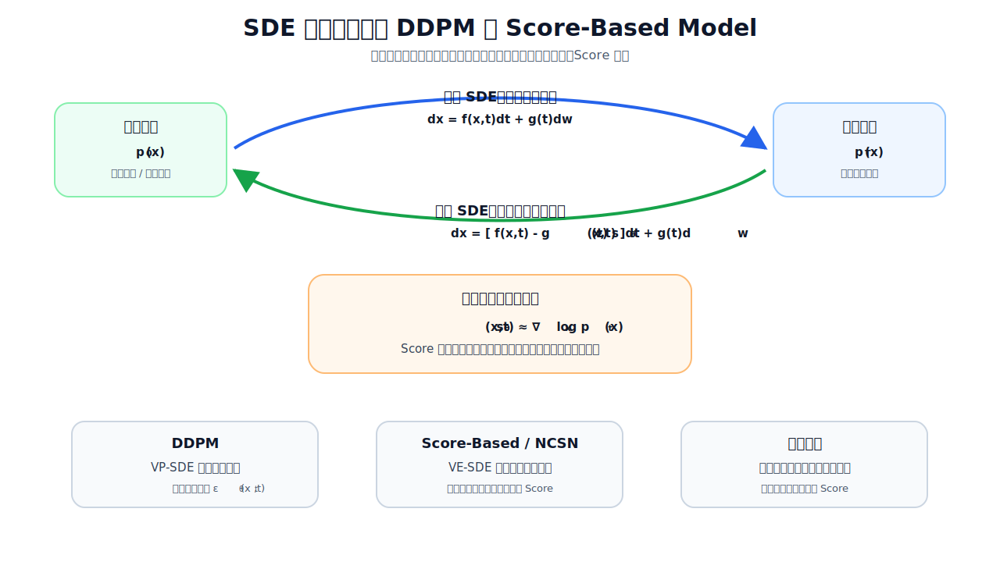

</div>


### 1. SDE生成框架的核心原理

#### 1. 正向SDE：数据到噪声的平滑演化

SDE框架定义了一个连续时间的正向扩散过程，将任意数据分布 $p_0(x)$ 转化为已知的简单先验分布 $p_T(x)$ （通常是标准正态分布）：

```math
dx = f(x, t)dt + g(t)dw
```

- $f(x,t)$ ：漂移系数，控制数据的确定性演化
- $g(t)$ ：扩散系数，控制噪声的添加强度
- $dw$ ：标准布朗运动的增量

**核心特性**：正向过程由人工设计，无需训练。通过选择不同的 $f$ 和 $g$ ，可以得到不同的扩散变体：

- **VP-SDE（方差保持SDE）**：对应DDPM的连续时间极限，信号逐渐衰减、噪声逐渐增加，总方差保持稳定
- **VE-SDE（方差爆炸SDE）**：对应NCSN的多尺度噪声扰动，噪声方差随时间爆炸式增长
- **sub-VP SDE**：VP的一个变体，常用于讨论似然估计和连续时间理论性质

#### 2. 反向SDE：噪声到数据的生成过程

SDE框架最核心的理论突破是**反向SDE定理**：在满足一定正则条件时，正向SDE存在对应的反向时间SDE，其形式为：

```math
dx = \left[ f(x, t) - g^2(t) \nabla_x \log p_t(x) \right] dt + g(t)d\bar{w}
```

其中 $\nabla_x \log p_t(x)$ 是时刻 $t$ 噪声扰动数据分布的**Score函数**（对数概率密度的梯度）。

**关键洞察**：正向过程的 $f$ 和 $g$ 是人为设计的，生成时真正需要学习的是Score函数。只要能较好估计 $\nabla_x \log p_t(x)$ ，就可以通过数值求解反向SDE生成样本。

<div align="center">

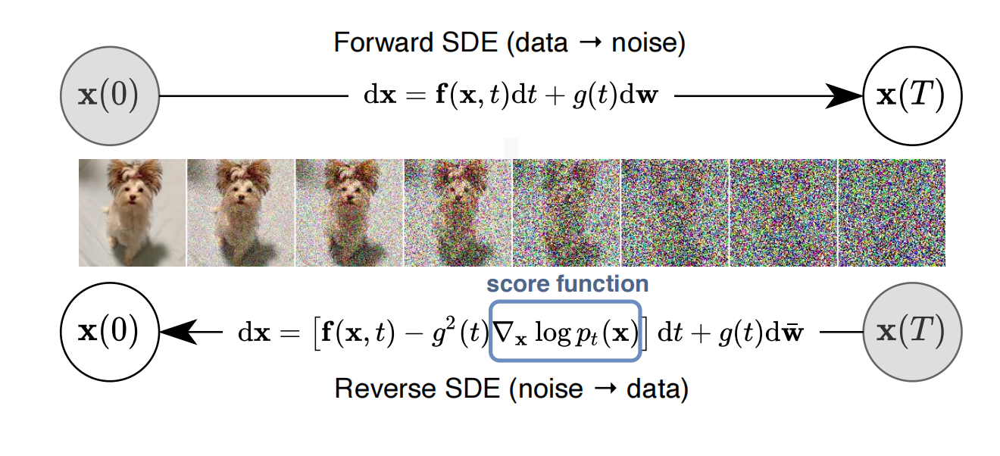

</div>


#### 3. 训练与采样

**训练目标**：训练一个时间依赖的Score网络 $s_\theta(x, t)$ ，通过**加权Fisher散度**（实际中常用去噪Score匹配形式）近似真实Score函数：

```math
\mathcal{L} = \mathbb{E}_{t \sim \mathcal{U}(0,T), x \sim p_t(x)} \left[ \lambda(t) \left\| s_\theta(x, t) - \nabla_x \log p_t(x) \right\|_2^2 \right]
```

其中 $\lambda(t)$ 是时间权重函数，不同的权重对应不同的模型变体。

**采样方法**：

- **随机采样**：用Euler-Maruyama等数值方法求解反向SDE，结果具有多样性
- **确定性采样**：求解对应的**概率流ODE**，给定相同初始噪声和数值配置时结果可复现，并可用于似然估计
- **预测-校正采样**：结合SDE求解器（预测）和Langevin动力学（校正），在计算成本增加的前提下提升采样质量

### 2. SDE框架统一DDPM与Score-Based模型的本质原因

#### 1. 数学本质：两者都是SDE的离散化

<div align="center">

| 模型 | 对应SDE类型 | 离散化方式 |
|------|-------------|------------|
| **DDPM** | VP-SDE（方差保持SDE） | 时间步均匀离散，每步添加固定方差的高斯噪声 |
| **NCSN（Score-Based）** | VE-SDE（方差爆炸SDE） | 噪声尺度几何离散，多尺度噪声扰动 |

</div>

**连续极限视角**：当离散时间步长 $\Delta t \to 0$ 时，DDPM的离散马尔可夫链可以看作VP-SDE的离散化；NCSN的多尺度噪声过程可以看作VE-SDE相关过程的离散化。

#### 2. 训练目标：都是加权Score匹配的特例

**DDPM的噪声预测损失**：DDPM训练目标是预测添加的噪声 $\epsilon$ ，可以数学等价于：

```math
\mathcal{L}_{\text{DDPM}} = \mathbb{E}_{t, x_0, \epsilon} \left\| \epsilon - \epsilon_\theta(x_t, t) \right\|_2^2
```

这可以对应到SDE框架中的加权Score匹配目标。对于高斯扰动核，条件Score与噪声满足关系：

```math
\nabla_{x_t} \log p(x_t|x_0) = -\frac{\epsilon}{\sigma_t}
```

**NCSN的多尺度Score匹配损失**：NCSN训练目标是估计每个噪声尺度下的Score函数，对应SDE框架中权重 $\lambda(t) = \sigma_t^2$ 的加权Fisher散度。

**结论**：DDPM和NCSN的训练目标都可以放进Score匹配框架下理解，只是噪声过程、参数化方式和时间步权重不同。

#### 3. 采样方法：思想互通

SDE框架说明，许多采样方法可以在统一的Score/噪声预测视角下迁移或改写：

- VP类模型可以使用反向SDE、概率流ODE、DDIM/DPM-Solver等采样思路
- VE类模型可以使用退火Langevin动力学、Euler-Maruyama、概率流ODE等采样思路
- Predictor-Corrector等方法本质上是在同一个Score网络上组合不同数值更新方式

### 3. 核心统一关系表

<div align="center">

| 概念 | DDPM | NCSN（Score-Based） | SDE框架统一表述 |
|------|------|---------------------|-----------------|
| 正向过程 | 离散马尔可夫链 | 多尺度噪声扰动 | 连续SDE |
| 核心估计目标 | 噪声 $\epsilon$ | Score函数 $\nabla \log p_t(x)$ | Score函数 $\nabla \log p_t(x)$ |
| 训练目标 | 噪声预测MSE | 多尺度Fisher散度 | 加权Fisher散度 |
| 采样基础 | 反向马尔可夫链 | 退火Langevin动力学 | 反向SDE/概率流ODE |
| 确定性采样 | DDIM | 概率流ODE | 概率流ODE |

</div>


<h2 id="q-017b">面试问题：SDE 视角下 VP/VE/sub-VP 三类噪声过程的差异是什么？</h2>

**难度评分：⭐⭐⭐⭐⭐ (5/5)  |  考察频率：⭐⭐ (2/5)**

**VP、VE、sub-VP是SDE框架中三种经典的正向噪声演化设计，本质差异在于信号如何衰减、噪声方差如何增长**。VP让信号逐渐衰减并把分布推向标准正态，VE基本不衰减信号而是不断放大噪声尺度，sub-VP则是在VP基础上调整扩散强度，常用于连续时间似然分析。理解三者的区别，有助于判断模型的训练稳定性、采样轨迹、似然估计和少步采样表现。

<div align="center">

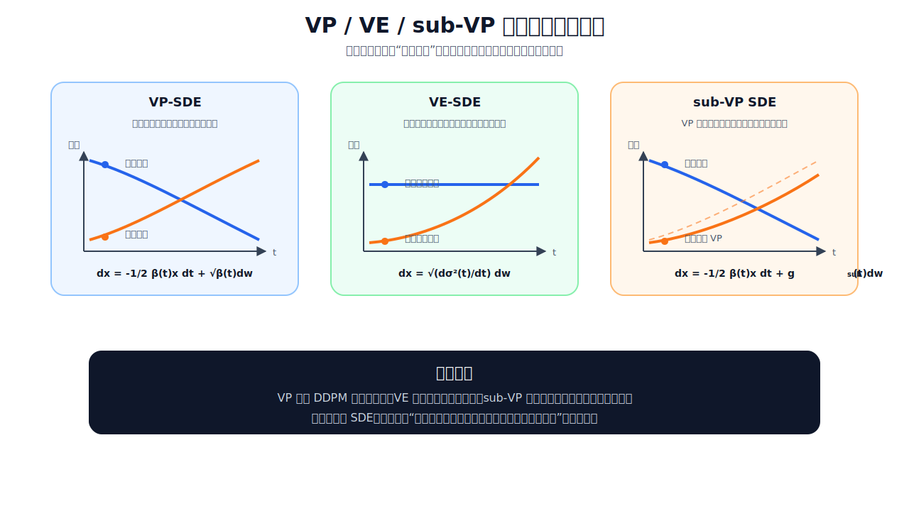

</div>


### 1. 三类SDE的核心定义与特性

#### 1. VP-SDE（Variance Preserving，方差保持SDE）

```math
dx = -\frac{1}{2}\beta(t)x dt + \sqrt{\beta(t)}dw
```

- 漂移项： $-\frac{1}{2}\beta(t)x$ ，负责衰减信号幅度
- 扩散项： $\sqrt{\beta(t)}$ ，负责添加高斯噪声

通过**信号衰减与噪声添加的配合**，VP-SDE对应DDPM中“逐步削弱原图、逐步加入高斯噪声”的连续时间形式。若数据已做标准化并且噪声调度合适，边缘分布的尺度会保持相对稳定；当 $t\rightarrow1$ 时，分布逐渐接近标准正态分布 $\mathcal{N}(0,I)$ 。

关键特性：

- **对应关系**：经典DDPM可看作VP-SDE的离散化；DDIM和许多离散采样器也常在VP/ $\bar{\alpha}_t$ 体系下表述
- **优点**：与DDPM符号体系衔接自然，训练和实现成熟，概率流ODE轨迹通常较平滑
- **缺点**：高噪声区域（ $t\approx1$ ）中原始信号很弱，Score或噪声预测更依赖模型泛化；少步采样时离散化误差更明显
- **适用场景**：需要沿用DDPM训练框架、重视稳定训练和成熟工程实现的场景

#### 2. VE-SDE（Variance Exploding，方差爆炸SDE）

```math
dx = \sqrt{\frac{d\sigma^2(t)}{dt}}dw
```

- 漂移项：恒为0，信号均值始终保持不变
- 扩散项：由噪声尺度 $\sigma(t)$ 的增长率决定，常用指数增长形式（如 $\sigma(t)=\sigma_{\text{min}} \cdot (\sigma_{\text{max}}/\sigma_{\text{min}})^t$ ）

VE-SDE不主动衰减原始信号，而是通过不断增大噪声尺度来淹没数据结构。当 $t\rightarrow1$ 时，扰动分布会接近大方差高斯分布，通常可理解为 $x_t \approx x_0+\sigma_{\text{max}}\epsilon$ 。这里的 $\sigma_{\text{max}}$ 需要足够大，使数据本身相对噪声可以忽略。

关键特性：

- **对应关系**：NCSN/NCSNv2的多尺度噪声扰动与VE思想关系密切；EDM/Karras等噪声参数化也常借鉴VE式噪声尺度视角
- **优点**：噪声尺度解释直观，适合多尺度Score建模；在高噪声范围内覆盖分布模式的能力较强
- **缺点**：大噪声尺度会带来更大的动态范围，数值求解和似然估计通常更有挑战；少步采样时对调度和求解器更敏感
- **适用场景**：Score-Based模型理论研究、多尺度噪声建模、需要强调分布覆盖的生成任务

#### 3. sub-VP SDE（sub-Variance Preserving，次方差保持SDE）

```math
dx = -\frac{1}{2}\beta(t)x dt + \sqrt{\beta(t)\left(1-e^{-2\int_0^t \beta(s)ds}\right)}dw
```

- 漂移项：与VP相同，负责衰减信号
- 扩散项：比VP弱，确保总方差随时间增长但不超过1

sub-VP可以理解为VP-SDE的一个连续时间变体：漂移项仍然衰减信号，但扩散项被重新设计，使得反向概率流ODE在似然相关分析中更有利。它不是简单意义上“VP和VE的平均”，而是为了某些理论性质和似然表现引入的特定SDE形式。

关键特性：

- **对应关系**：常见于Score SDE理论框架中，尤其用于讨论连续时间模型的似然估计
- **优点**：保留VP的信号衰减形式，同时在概率流ODE和似然计算上有一定优势
- **缺点**：工程实现和调度设计更依赖具体设定，不一定比VP/VE在所有任务上更优
- **适用场景**：需要从连续时间SDE角度分析似然、ODE轨迹和理论性质的场景

### 2. 核心对比表

<div align="center">

| 维度 | VP-SDE | VE-SDE | sub-VP SDE |
|------|--------|--------|------------|
| **信号变化** | 信号逐渐衰减 | 信号均值不主动衰减 | 信号逐渐衰减 |
| **噪声变化** | 噪声逐渐增大，尺度较稳定 | 噪声尺度快速增大 | 扩散强度经过重新设计 |
| **末端分布** | 通常接近 $\mathcal{N}(0,I)$ | 接近大方差高斯噪声 | 依具体调度而定，常用于理论分析 |
| **典型来源** | DDPM连续时间极限 | NCSN多尺度噪声扰动 | Score SDE中的似然友好变体 |
| **训练特点** | 工程成熟、稳定性好 | 多尺度Score建模直观 | 理论分析更方便 |
| **采样特点** | 与DDPM/DDIM体系衔接自然 | 对噪声尺度和求解器较敏感 | 常和概率流ODE、似然估计一起讨论 |
| **适用重点** | 离散扩散模型、稳定训练 | Score-Based理论、多样性探索 | 连续时间似然与ODE分析 |

</div>


<h2 id="q-017c">面试问题：Probability Flow ODE 与 reverse-time SDE 的关系是什么？各自适用场景是什么？</h2>

**难度评分：⭐⭐⭐⭐⭐ (5/5)  |  考察频率：⭐⭐ (2/5)**

**Probability Flow ODE（PF-ODE）与reverse-time SDE是SDE生成框架下由同一个Score函数导出的两种反向生成过程。** 在精确Score和理想连续时间条件下，它们具有相同的边缘分布，但轨迹性质不同：reverse-time SDE是带随机噪声的反向演化，PF-ODE是确定性的反向演化。前者更强调随机采样和多样性，后者更强调可复现性、数值求解和似然估计。

<div align="center">

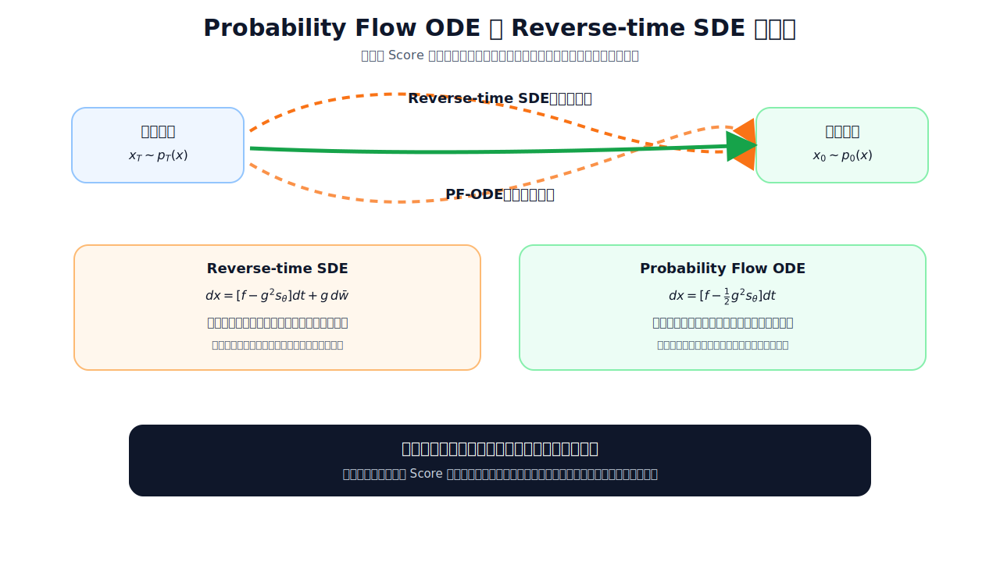

</div>


### 1. 两者的核心数学关系

#### 1. 边缘分布等价性

这是最根本的理论结论：在满足正则条件且Score函数精确的情况下，给定一个正向SDE，可以构造对应的概率流ODE，使它与反向SDE在每个时刻 $t$ 具有相同的边缘分布 $p_t(x)$ 。

需要注意，这里的等价是**分布层面的等价**，不是说两条轨迹逐点相同。reverse-time SDE会在采样过程中持续注入随机性，PF-ODE则由初始噪声和数值求解器确定一条固定轨迹；在真实模型和有限步采样中，两者的样本质量还会受到Score误差、步长和求解器的影响。

#### 2. 推导关系：PF-ODE不是简单丢掉随机项

从reverse-time SDE的标准形式出发：

```math
dx = \left[ f(x, t) - g^2(t) \nabla_x \log p_t(x) \right] dt + g(t) d\bar{w}
```

PF-ODE不是直接把随机项 $g(t)d\bar{w}$ 删掉，而是通过调整漂移项，把随机扩散项对边缘分布的影响吸收到确定性速度场中：

```math
dx = \left[ f(x, t) - \frac{1}{2} g^2(t) \nabla_x \log p_t(x) \right] dt
```

**关键洞察**：PF-ODE不是“少加噪声的近似采样器”，而是在精确Score条件下保持同一边缘分布的确定性过程；它描述的是另一类轨迹，而不是同一条随机轨迹的平均结果。

#### 3. 共享核心Score网络

两者都依赖同一个训练好的时间依赖Score网络 $s_\theta(x, t)$ ，通常不需要额外训练。同一个扩散模型可以在反向SDE采样和PF-ODE采样之间切换，但实际效果仍取决于噪声调度、时间离散方式和数值求解器配置。

### 2. 各自的本质特性与适用场景

#### 1. Reverse-time SDE：随机采样，强调多样性

保留了反向过程中的布朗运动随机项，生成轨迹是随机的。如果采样过程中随机数不同，即使初始噪声相同，也可能得到略有不同的结果；若固定所有随机种子和数值配置，则工程上仍可以复现实验结果。

关键特性：

- **优点**：采样过程保留随机性，有利于多样性和分布探索；多步采样下细节通常更自然；天然支持MCMC校正（Predictor-Corrector框架）
- **缺点**：随机项会增加方差，少步采样时数值误差可能更明显；似然计算不如PF-ODE直接

最佳适用场景：

- 艺术创作、图像生成、内容创作等需要高多样性的任务
- 数据增强，生成多样化的训练样本
- 理论研究中探索数据分布的模式覆盖
- 结合MCMC的高精度采样（如医学图像生成、科学模拟）

#### 2. Probability Flow ODE：确定性采样，强调可控性

PF-ODE没有随机扩散项，生成轨迹由初始噪声 $x_T$ 、Score网络、时间调度和ODE求解器共同决定。给定相同初始噪声和完全相同的数值配置，结果通常可以稳定复现。

关键特性：

- **优点**：可复现性强；可结合瞬时变量替换公式进行似然估计；便于使用成熟ODE求解器，也更适合反演和逆问题
- **缺点**：随机探索能力较弱；少步采样下可能出现过平滑或伪影；对Score网络误差和求解器设置较敏感

最佳适用场景：

- 工业级部署，要求结果可复现和一致性
- 模型评估与比较，通过似然估计量化模型性能
- 逆问题求解（图像修复、超分辨率、医学影像重建），需要确定性的重建结果
- 快速采样场景，如实时生成、批量处理
- 特征提取与表示学习，利用ODE的可逆性

### 3. 核心对比表

<div align="center">

| 维度 | Reverse-time SDE | Probability Flow ODE |
|------|------------------|----------------------|
| 过程性质 | 随机过程 | 确定性过程 |
| 结果可复现性 | 依赖随机种子 | 较强 |
| 样本多样性 | 较强 | 取决于初始噪声与求解器 |
| 似然估计 | 不直接 | 更方便 |
| 少步采样质量 | 对步长较敏感 | 依赖ODE求解器 |
| 逆问题适配性 | 一般 | 较好 |
| 数值稳定性 | 受随机项影响 | 通常更稳定 |
| 典型采样器 | Euler-Maruyama、Predictor-Corrector | DDIM、DPM-Solver、Euler ODE |
| 核心优势 | 多样性、模式覆盖 | 可控性、速度、可解释性 |

</div>


<h2 id="q-017d">面试问题：基于 SDE 的 predictor-corrector 采样为什么能提升质量？代价是什么？</h2>

**难度评分：⭐⭐⭐⭐ (4/5)  |  考察频率：⭐⭐ (2/5)**

**Predictor-Corrector（PC）采样的核心思想是：先用数值求解器快速沿反向过程推进一步，再用基于Score的局部随机校正把样本拉回当前时间步更合理的分布区域。** 它可以缓解有限步采样带来的离散化误差和局部偏差，通常以额外的Score网络前向计算、更多超参数和更强随机性为代价。

<div align="center">

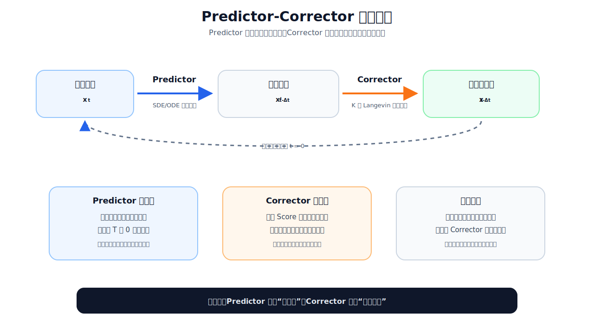

</div>


### 1. Predictor-Corrector的核心工作原理

它是一个**逐时间步的双阶段循环**，贯穿从 t=T 到 t=0 的整个生成过程：

**1. Predictor阶段**：使用数值 SDE/ODE 求解器（如 Euler-Maruyama），从当前样本 $x_t$ 预测下一个时间步的粗略样本 $x^{\prime}_{t-\Delta t}$ ，负责沿反向生成方向快速推进。

**2. Corrector阶段**：运行 $K$ 步基于 Score 函数的 MCMC 方法（常用 Langevin 动力学），对 $x^{\prime}_{t-\Delta t}$ 进行局部调整，使其更接近当前时间步的目标边缘分布 $p_{t-\Delta t}(x)$ 。

**关键洞察**：Predictor负责“走到下一个时间层”，Corrector负责“在这个时间层附近修正位置”。两者共享同一个训练好的Score网络，通常不需要额外训练。

### 2. 质量提升的三大本质原因

#### 1. 缓解数值求解器的离散化误差

这是最核心的提升来源：

- 任何数值SDE/ODE求解器都存在**截断误差**和**离散化误差**。采样步数越少，每一步跨越的时间区间越大，误差越容易表现为过平滑、伪影或细节丢失
- Corrector利用当前时间步的Score方向做Langevin更新：Score项把样本推向高概率区域，随机噪声项保留局部探索能力
- 当Score估计较准确、步长和校正步数设置合理时，Corrector可以把Predictor产生的局部偏差往目标边缘分布附近拉回

#### 2. 针对性强化低噪声区域的细节质量

- 低噪声区域更接近最终图像，边缘、纹理、局部结构都会在这一阶段定型，因此这里的误差对最终观感影响很大
- Predictor在低噪声区域如果步长过大，可能产生模糊边缘、纹理漂移等问题；Corrector能利用当前Score方向进行局部细化
- 对医学图像、工业缺陷检测等细节敏感任务，适当增加Corrector步数有时能换来更稳的局部质量，但收益取决于模型和采样配置

#### 3. 显著改善模式覆盖，减少模式崩溃

- 纯确定性采样（如PF-ODE类采样）给定初始噪声后轨迹固定，随机探索主要来自初始噪声本身
- Corrector中的Langevin噪声会在每个时间层引入局部随机探索，有助于覆盖更多局部模式
- 但它不是万能的多样性开关：如果Score网络本身没有学到某些模式，Corrector通常无法凭空恢复这些模式

### 3. 不可避免的核心代价与权衡

#### 1. 计算成本线性增加（最主要代价）

- 每个Corrector步通常都需要额外调用一次Score网络/UNet
- 如果每个时间步做 $K$ 次Corrector，计算量大约会增加 $K$ 倍左右，具体取决于Predictor本身是否也需要网络评估
- Corrector步数过多会显著拖慢采样速度，甚至抵消少步求解器带来的加速收益

#### 2. 随机性和可复现性权衡

- Corrector的Langevin动力学引入了额外的随机噪声项
- 如果不固定Corrector阶段的随机种子，同一个初始噪声也可能得到不同细节
- 固定所有随机种子可以提高复现性，但会减少随机探索带来的多样性

#### 3. 超参数调优复杂度增加

- 需要平衡三个关键超参数：Predictor步长、Corrector步数、Langevin步长/信噪比
- Predictor步长过大：预测误差可能超过Corrector的修正能力，质量反而下降
- Corrector步数或步长过大：可能引入额外噪声，导致细节抖动或采样变慢
- Predictor步长过小：速度优势下降，整体采样效率变低
- 不同SDE类型（VP/VE/sub-VP）需要不同的超参数配置

### 4. 核心对比表

<div align="center">

| 采样方法 | 速度 | 少步质量 | 细节精度 | 模式覆盖 | 可复现性 | 计算成本 |
|---------|------|----------|----------|----------|----------|----------|
| 纯ODE（如PF-ODE求解） | 快 | 依赖求解器 | 中等到较好 | 主要依赖初始噪声 | 强 | 较低 |
| 纯SDE（Euler-Maruyama） | 中等 | 对步长敏感 | 较好 | 较好 | 依赖随机种子 | 中等 |
| Predictor-Corrector | 中等偏慢 | 通常更稳 | 通常更好 | 较好 | 依赖随机种子 | 较高 |
| 纯Langevin MCMC | 慢 | 依赖步数 | 可较好 | 较好 | 依赖随机种子 | 很高 |

</div>


<h1 id="q-016">4.介绍一下扩散模型中Classifier Guidance和Classifier-Free Guidance的原理，两者有哪些区别？</h1>

<h2 id="q-016a">面试问题：介绍一下Classifier Guidance的原理</h2>

**难度评分：⭐⭐⭐⭐ (4/5)  |  考察频率：⭐⭐⭐⭐ (4/5)**

**Classifier Guidance是2021年在扩散模型中使用的条件生成增强技术，核心思想是**在扩散采样过程中额外加入一个带噪声分类器的梯度，让样本朝目标类别概率更高的方向移动。它不需要重训扩散模型，但需要训练一个能识别不同噪声水平样本的分类器；通过调节梯度缩放因子，可以在样本保真度和多样性之间做连续权衡。

### 1. 核心数学原理

#### 1. 贝叶斯分数分解（最核心公式）

条件生成的目标是从 $p_t(x_t|y)$ 采样。为了先看清本质，先省略时间步下标，根据贝叶斯定理：

```math
p(x|y) = \frac{p(x)p(y|x)}{p(y)}
```

两边取对数并对 $x$ 求梯度，得到**贝叶斯分数法则**：

```math
\nabla_x \log p(x|y) = \nabla_x \log p(x) + \nabla_x \log p(y|x)
```

**关键洞察**：从Score-Based的角度看，条件分布的Score = 无条件分布的Score + 分类器对数概率的梯度。在扩散模型里，这个关系要在每个噪声水平 $t$ 上成立，因此分类器也必须接收带噪样本 $x_t$ 和时间步 $t$ 。

#### 2. 融入扩散采样过程

上面的贝叶斯分数法则是在 **Score 空间** 中写的，而DDPM工程实现里，网络通常输出的是噪声 $\epsilon_\theta(x_t,t)$ ，不是直接输出Score。因此还需要把“Score修正”换算成“噪声预测修正”。

扩散模型的采样通常通过逐步预测噪声 $\epsilon_\theta(x_t, t)$ 来实现。对于DDPM常用的高斯扰动形式：

```math
x_t = \sqrt{\bar{\alpha}_t}x_0 + \sqrt{1-\bar{\alpha}_t}\epsilon
```

在固定 $x_0$ 的条件高斯分布中，Score和噪声之间近似满足：

```math
\nabla_{x_t} \log p_t(x_t) \approx -\frac{\epsilon_\theta(x_t, t)}{\sqrt{1-\bar{\alpha}_t}}
```

所以，分类器引导的逻辑可以分成两步：

1. 先在Score空间加入类别方向：

```math
\nabla_{x_t}\log p_t(x_t|y)
\approx
\nabla_{x_t}\log p_t(x_t)
+ s\nabla_{x_t}\log p_\phi(y|x_t,t)
```

2. 再利用噪声预测与 Score 的近似关系（见下式），把它换回噪声预测形式，得到条件噪声预测：

```math
\epsilon_\theta \approx -\sqrt{1-\bar{\alpha}_t}\nabla_{x_t}\log p_t(x_t)
```

据此写出条件噪声预测：

```math
\hat{\epsilon}_\theta(x_t, t) = \epsilon_\theta(x_t, t) - \sqrt{1-\bar{\alpha}_t} \cdot s \cdot \nabla_x \log p_\phi(y|x_t, t)
```

其中：

- $p_\phi(y|x_t, t)$ 是在带噪声图像上训练的时间依赖分类器
- $s$ 是采样时的**梯度缩放因子**，控制分类器引导强度

#### 3. 梯度缩放因子 $s$ 的作用

这是Classifier Guidance最有用的设计之一：

- $s=0$ ：退化为无条件采样，多样性最高，保真度最低
- $s=1$ ：在理想分类器和无条件Score准确时，对应标准贝叶斯条件采样
- $s>1$ ：放大分类器梯度，让采样更偏向分类器认为"高置信度"的区域，**保真度提升，多样性下降**
- 实践中 $s$ 需要调参：过小引导不够，过大可能损失多样性，甚至被分类器的偏差带偏

### 2. 完整工作流程

#### 1. 训练阶段（扩散模型与分类器解耦）

1. **训练扩散模型**：通常先训练一个无条件或弱条件扩散模型，训练过程可以不为分类器引导做特殊修改
2. **训练时间依赖分类器**：
   - 输入：带噪声的图像 $x_t$ 和对应的时间步 $t$
   - 输出：类别概率 $p_\phi(y|x_t, t)$
   - 关键：需要覆盖采样过程中会遇到的噪声水平，否则分类器梯度在高噪声或低噪声阶段都可能失真
   - 计算成本：分类器通常小于扩散模型，但仍然是额外训练和维护成本

#### 2. 采样阶段（逐时间步引导）

对于每个时间步 $t$ 从 $T$ 到 $1$ ：

1. 扩散模型预测无条件噪声 $\epsilon_\theta(x_t, t)$
2. 分类器计算当前样本的类别梯度 $\nabla_x \log p_\phi(y|x_t, t)$
3. 按公式计算条件噪声 $\hat{\epsilon}_\theta(x_t, t)$
4. 使用条件噪声生成下一个时间步的样本 $x_{t-1}$

**核心优势**：引导过程主要发生在采样阶段，同一个扩散模型可以配合不同分类器实现不同类别或属性的引导；但前提是分类器在对应噪声分布上可靠。

<div align="center">

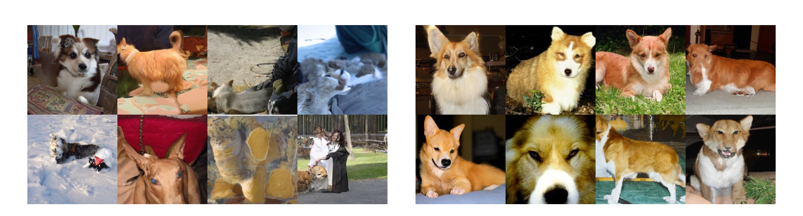

</div>


### 3. 关键特性与技术贡献

#### 1. 连续可调的保真度-多样性权衡

- 这是Classifier Guidance的重要价值：通过一个连续参数控制条件强度
- 与GAN中的截断技巧相比，它直接作用在扩散采样方向上，调节更细粒度
- 应用上可以根据需求调节 $s$ ：低 $s$ 更重多样性，高 $s$ 更重类别/条件对齐

#### 2. 不需要重训扩散模型

- 不需要重新训练扩散模型，但需要额外训练一个时间依赖分类器
- 可以为已有的预训练扩散模型快速添加条件引导能力
- 在分类器和扩散模型分布接近时，可以尝试跨模型或跨任务引导；分布差异过大时，梯度可能不可靠

#### 3. 与其他技术的兼容性

- 可与DDPM、DDIM等多种采样器结合，但具体效果取决于采样器如何使用Score/噪声预测
- 可以与上采样扩散模型结合，进一步提升高分辨率图像质量
- 论文中通过结合Classifier Guidance和上采样模型，将ImageNet 512×512的FID从8.43降低到3.85

### 4. 核心对比与局限性

#### 与传统条件扩散的对比

<div align="center">

| 方法 | 训练成本 | 灵活性 | 保真度-多样性权衡 | 样本质量 |
|------|----------|--------|-------------------|----------|
| 传统条件扩散 | 高（需重新训练） | 受训练条件限制 | 通常不显式可调 | 取决于模型 |
| Classifier Guidance | 中（需额外训练分类器） | 可切换分类器 | 连续可调 | 取决于分类器与扩散模型匹配程度 |

</div>

#### 主要局限性

1. **依赖标注数据**：需要大量带标签的数据训练分类器，无法直接应用于无标注场景
2. **采样速度下降**：每个时间步需要额外计算分类器梯度，带来额外前向/反向开销
3. **高 $s$ 下的模式崩塌风险**：当 $s$ 过大时，会过度聚焦于分类器的高置信度模式，导致多样性下降


<h2 id="q-016b">面试问题：介绍一下Classifier-Free Guidance的原理，和Classifier Guidance有哪些区别？</h2>

**难度评分：⭐⭐⭐⭐ (4/5)  |  考察频率：⭐⭐⭐⭐⭐ (5/5)**

**Classifier-Free Guidance（CFG）是2021年提出的无分类器引导技术，核心是**让同一个扩散模型同时学习条件分数和无条件分数，采样时通过线性组合两者来增强条件对齐。它省去了Classifier Guidance中额外训练带噪分类器的步骤，因此**成为文生图扩散模型中主流常见的引导方式**。

### 1. Classifier-Free Guidance核心原理

#### 1. 数学本质：隐式分类器的梯度替代

CFG的核心洞察是：条件Score和无条件Score的差值，可以近似替代Classifier Guidance里的分类器梯度，因此不需要额外训练外部分类器。

根据贝叶斯定理，隐式分类器的概率满足：

```math
p(c|z_\lambda) \propto \frac{p(z_\lambda|c)}{p(z_\lambda)}
```

两边取对数并对 $z_\lambda$ 求梯度，得到隐式分类器的梯度：

```math
\nabla_{z_\lambda} \log p(c|z_\lambda) = \nabla_{z_\lambda} \log p(z_\lambda|c) - \nabla_{z_\lambda} \log p(z_\lambda)
```

结合扩散模型噪声预测与分数函数的对应关系（见下式），代入Classifier Guidance的引导思想，可以得到CFG常用的噪声预测公式：

```math
\epsilon_\theta(z_\lambda, c) \approx -\sigma_\lambda \nabla_{z_\lambda} \log p(z_\lambda|c)
```

由此得到常用的 CFG 噪声预测公式：

```math
\tilde{\epsilon}_\theta(z_\lambda, c) = \epsilon_\theta(z_\lambda, \emptyset) + s \cdot \left[\epsilon_\theta(z_\lambda, c) - \epsilon_\theta(z_\lambda, \emptyset)\right]
```

其中：

- $\epsilon_\theta(z_\lambda, c)$ ：条件噪声预测（给定条件 $c$ 时的去噪方向）
- $\epsilon_\theta(z_\lambda, \emptyset)$ ：无条件噪声预测（条件被置为空标记时的去噪方向）
- $s$ ：CFG scale，引导强度参数

有些论文中也会写成 $(1+w)\epsilon_\theta(z_\lambda,c)-w\epsilon_\theta(z_\lambda,\emptyset)$ ，两者等价关系是 $s=1+w$ 。本节后文统一使用 $s$ ，这样 $s=1$ 表示标准条件采样， $s>1$ 表示增强条件引导。

#### 2. 完整工作流程

训练阶段：

1. 训练一个标准的条件扩散模型，输入为带噪声图像 $z_\lambda$ 和条件信息 $c$ （如类别标签、文本描述）
2. 以固定概率 $p_{uncond}$ （通常0.1-0.2）随机将条件 $c$ 替换为空标记 $\emptyset$
3. 模型同时学习两种模式：当 $c \neq \emptyset$ 时预测条件噪声，当 $c = \emptyset$ 时预测无条件噪声

**关键优势**：无需额外分类器，也通常不增加主干网络参数；但它要求训练时加入条件丢弃机制，让模型真的学会“有条件”和“无条件”两种去噪方向。

采样阶段：

对于每个时间步 $\lambda$ 从 $\lambda_{min}$ 到 $\lambda_{max}$ ，依次执行下列步骤。

**1.** 同时计算条件噪声 $\epsilon_\theta(z_\lambda, c)$ 和无条件噪声 $\epsilon_\theta(z_\lambda,\emptyset)$ 。

**2.** 按上文给出的 CFG 核心公式计算引导噪声 $\tilde{\epsilon}_\theta(z_\lambda, c)$ 。

**3.** 使用 $\tilde{\epsilon}_\theta(z_\lambda, c)$ 代入本步去噪更新，得到下一个时间步的样本 $z_{\lambda+1}$ 。

#### 3. 引导强度 $s$ 的作用

- $s=1$ ：退化为标准条件采样，不额外放大条件差值
- $s>1$ ：放大条件与无条件预测的差值，通常会提升条件对齐度，但降低多样性
- 常见文生图模型的经验区间多在 $s=5-10$ 附近，但最优值依模型、采样器、步数和任务而变
- $s$ 过大时容易出现颜色过饱和、细节失真、纹理重复或模式收缩

<div align="center">


</div>


### 2. 与Classifier Guidance的核心区别

<div align="center">

| 维度 | Classifier Guidance（CG） | Classifier-Free Guidance（CFG） |
|------|---------------------------|--------------------------------|
| **引导信号来源** | 独立训练的**显式分类器**梯度 | 扩散模型自身的**条件-无条件分数差（隐式分类器）** |
| **额外模型需求** | ✅ 需要单独训练时间依赖分类器 | ❌ 无需额外模型，同一网络完成 |
| **训练复杂度** | 较高（需训练扩散模型和带噪分类器） | 较低（主要增加条件丢弃逻辑） |
| **标注依赖** | 额外需要分类器的标注数据 | 仅需条件扩散本身的标注 |
| **采样速度** | 需额外分类器梯度 | 通常每步需两次扩散模型前向 |
| **风险来源** | 分类器偏差、分布外梯度、对抗性方向 | 高CFG下的过饱和、失真、模式收缩 |
| **跨域引导能力** | 强（可使用外部预训练分类器） | 弱（只能引导训练时见过的条件类型） |
| **实现难度** | 中等（需处理带噪声分类器训练） | 较低（训练和采样都要支持空条件） |
| **典型应用** | 类别条件生成、研究对比 | AIGC图像创作领域的主流基石技术之一 |

</div>

### 3. 关键特性与技术贡献

1. **实现简洁**：相比CG，不需要额外训练带噪分类器，只要在条件扩散训练中加入条件丢弃
2. **端到端一致**：条件和无条件方向由同一个生成模型给出，减少了外部分类器分布偏移的问题
3. **兼容性强**：可用于U-Net、DiT、Transformer等扩散模型架构，也能配合DDPM、DDIM、DPM-Solver等采样器
4. **连续可控**：通过单一参数 $s$ 在提示词对齐度、真实性和多样性之间调节


<h2 id="q-016c">面试问题：CFG scale 为什么过大会导致过饱和/失真？如何在可控性与真实性之间调参？</h2>

**难度评分：⭐⭐⭐⭐ (4/5)  |  考察频率：⭐⭐⭐⭐ (4/5)**

**CFG scale过大导致过饱和/失真的核心是**过度放大了条件与无条件去噪方向的差值，使采样轨迹偏离模型训练时更熟悉的数据流形，进入“条件置信度更高但视觉上不自然”的区域。调参的本质是在**条件对齐度、真实性和多样性**之间做权衡：提示词越强，越容易牺牲自然度；引导越弱，又可能不听提示词。

<div align="center">

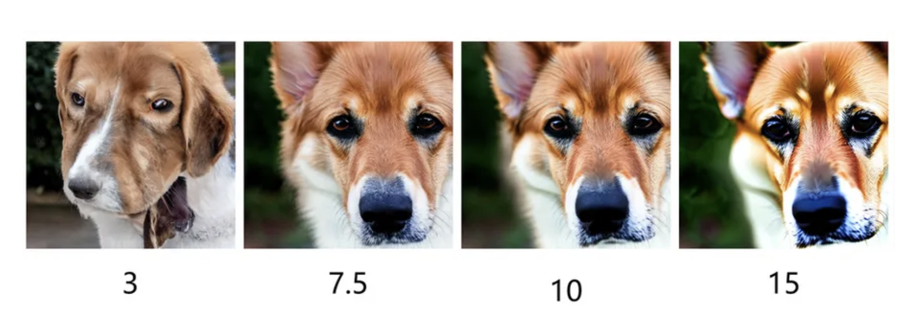

</div>


### 1. CFG scale过大导致失真的三大本质原因

#### 1. 分数差的非线性放大与误差累积（最直接原因）

CFG的核心公式是：

```math
\tilde{\epsilon}_\theta(z_t, c) = \epsilon_\theta(z_t,\emptyset) + s \cdot \left[\epsilon_\theta(z_t,c) - \epsilon_\theta(z_t,\emptyset)\right]
```

其中 $\epsilon_\theta(z_t,c)$ 是条件噪声预测， $\epsilon_\theta(z_t,\emptyset)$ 是无条件噪声预测。

- 当 $s$ 增大时，**条件与无条件预测的差值被线性放大**，其中有用的条件信号会被放大，模型误差和条件偏差也会一起被放大
- 在低噪声阶段，图像细节已经接近成型，过强的引导更容易表现为颜色溢出、纹理重复、边缘异常等可见失真
- 因此，高CFG不是单纯“更听话”，而是把条件方向推得更远；推过头后，采样点可能离真实图像分布越来越远

#### 2. 突破真实数据分布的统计边界

真实自然图像的颜色饱和度、对比度、纹理频率都有常见统计范围，而扩散模型在训练分布外区域的Score估计通常不可靠。

- 高CFG scale可以理解为对“目标条件相对基准条件”的方向做强放大，迫使采样器向模型认为更符合提示词的区域移动
- 这些区域可能位于真实数据分布的尾部甚至外部，不一定符合自然图像的统计规律
- 典型表现：颜色过饱和（RGB值接近0或255）、纹理重复、边缘锯齿化、结构扭曲

#### 3. 隐式分类器的"典型性偏见"

条件与无条件分数差可以看成一种“隐式分类器方向”。这个方向往往强化训练数据中最容易被条件识别的典型特征，而不一定保留自然多样性。

- 例如：模型学到的"蓝天"是最蓝的天空，"红花"是最红的花，"皮肤"是最光滑的皮肤
- 当 $s$ 过大时，这些典型特征会被过度强化，导致生成图像失去真实感，变得像"卡通画"或"海报"
- 同时，稀有模式更容易被压制，导致样本多样性下降

### 2. 可控性与真实性的科学调参策略

#### 1. 静态基准调参：先确定任务最优区间

不同任务和模型的合适CFG scale差异很大，下面是常见经验区间，实际应以具体模型和采样器为准：

<div align="center">

| 任务类型 | 推荐CFG范围 | 说明 |
|---------|-------------|------|
| 通用文生图（写实） | 6-9 | 平衡真实性和提示词对齐度 |
| 通用文生图（艺术/抽象） | 9-12 | 允许更高的风格化程度 |
| 图像修复/局部重绘 | 10-15 | 需要更强的条件约束来匹配上下文 |
| 图像超分辨率/增强 | 4-7 | 优先保证原始图像的真实性 |
| 风格迁移 | 3-6 | 避免过度风格化导致内容丢失 |

</div>

**调参方法**：从经验区间的中间值开始，每次小幅调整，同时观察两个方向：

- **提示词对齐度**：可以看CLIP分数，也可以人工检查主体、属性、风格是否符合要求
- **真实性与多样性**：可以看FID、审美模型、人审结果，也要观察是否出现过饱和、重复纹理和模式收缩
- 更实用的判断是：在满足提示词的前提下，选择不会明显破坏自然度的最低CFG scale

#### 2. 动态CFG调度：按噪声阶段调整引导强度

固定CFG scale的问题是：不同噪声阶段需要的引导强度并不相同。高噪声阶段更影响全局布局和语义，低噪声阶段更影响纹理、颜色和局部细节；同一个 $s$ 可能在某些阶段太弱，在另一些阶段太强。

**核心思想**：让 $s$ 随时间变化，而不是整个采样过程固定不变。具体是高噪声阶段强一点还是弱一点，并没有放之四海皆准的答案，需要结合模型训练方式和采样器调参。

常见调度策略：

1. **线性调度**：从 $s_{\text{start}}$ 平滑变化到 $s_{\text{end}}$
2. **余弦调度**：让引导强度在采样前后变化更平滑，减少突然跳变
3. **分段调度**：高噪声、中噪声、低噪声阶段分别设置不同的 $s$

**注意**：动态CFG可以缓解固定CFG在某些阶段过强或过弱的问题，但不是所有模型的默认配置，也不保证一定优于静态CFG；它更适合在高CFG失真明显、但又需要较强条件控制时尝试。

#### 3. 辅助优化技术：减少对高CFG的依赖

很多时候不需要盲目提高 $s$ ，通过以下技术可以在较低CFG下获得更好的可控性：

1. **负提示词**：明确指定不需要的特征，相当于把基准条件从“空条件”替换为“不想要的内容”
2. **CFG截断/重缩放**：限制或重标定条件差值的幅度，减少极端方向
3. **采样器选择**：不同采样器对高CFG的鲁棒性不同，需要和CFG一起调
4. **模型微调**：用更高质量、更多样化的数据微调模型，提升隐式分类器的准确性，减少对高引导强度的需求


<h2 id="q-016d">面试问题：负提示词（Negative Prompt）在CFG中的数学作用是什么？</h2>

**难度评分：⭐⭐⭐⭐ (4/5)  |  考察频率：⭐⭐⭐⭐⭐ (5/5)**

负提示词是**Classifier-Free Guidance（CFG）的一个直接扩展**：原始CFG把“空提示词”当作基准条件，负提示词则把“不想要的内容”当作基准条件。这样，采样方向不仅趋近正提示词，也会远离负提示词描述的特征。

### 1. 标准数学公式

带负提示词的CFG噪声预测公式为：

```math
\tilde{\epsilon} = \epsilon(c^-) + s \cdot \left[ \epsilon(c^+) - \epsilon(c^-) \right]
```

其中：

- $\epsilon(c)$ ：扩散模型在条件 $c$ 下预测的噪声
- $c^+$ ：正提示词（想要生成的内容）
- $c^-$ ：负提示词（想要避免的内容）
- $s$ ：CFG引导强度。常见设置下 $s=1$ 时退化为纯正条件预测， $s>1$ 时才会显式放大正负提示词差异

**原始CFG的退化关系**：当负提示词为空（ $c^-=\emptyset$ ，无条件），公式退化为基础CFG：

```math
\tilde{\epsilon} = \epsilon(\emptyset) + s \cdot \left[ \epsilon(c^+) - \epsilon(\emptyset) \right]
```

<div align="center">

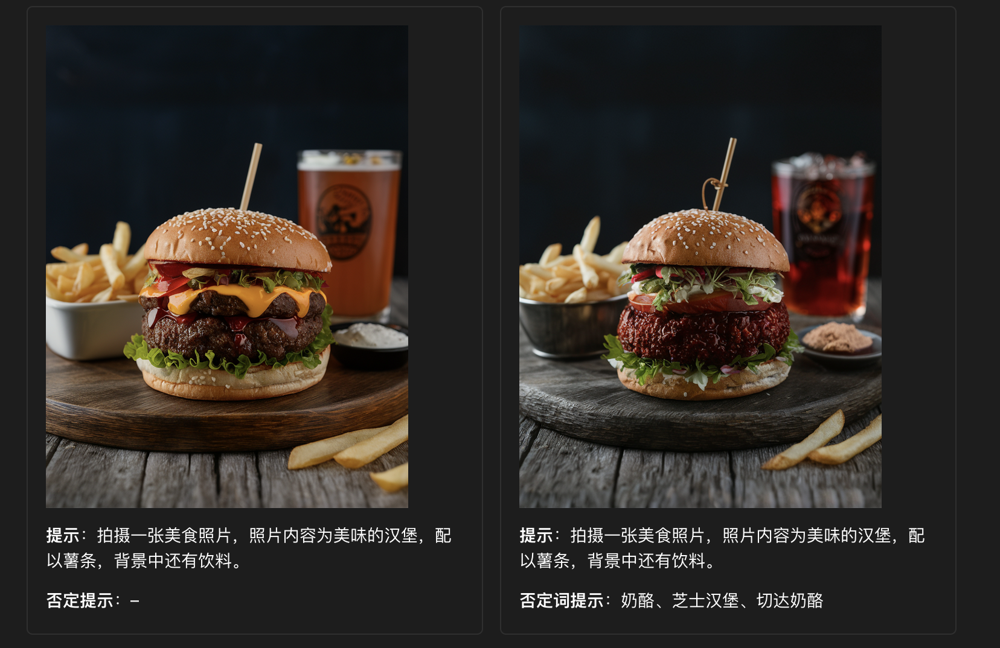

</div>


### 2. 核心数学本质

**1. 基准替换**：将CFG的“生成基准”从**空提示词/无条件分布**替换为**负提示词对应的条件分布**。

**2. 差值放大**：放大"正条件噪声预测"与"负条件噪声预测"的差异，让生成过程同时**趋近正提示词特征**和**远离负提示词特征**。

**3. 隐式二分类梯度**：从score函数视角（ $\nabla \log p(z) = -\epsilon/\sigma$ ），等价于沿着**正/负条件的对数似然比梯度**更新：

```math
\nabla \log \frac{p(z|c^+)}{p(z|c^-)} = \nabla \log p(z|c^+) - \nabla \log p(z|c^-)
```

引导强度 $s$ 控制该方向的放大倍数，越大则正/负区分越强，但也越容易带来过度约束和失真。

#### 3. 关键结论

- 当 $s=1$ 时，公式退化为纯正条件预测，负提示词不再产生“远离负条件”的差值引导作用。
- 负提示词的有效性依赖于模型对负条件的建模能力：模型需要能理解并区分这些负特征。
- 负提示词不是“删除器”，而是改变采样方向；如果负提示词过多或过强，也可能压掉正常细节。
- 它仍然属于CFG式生成引导，不需要额外分类器。

<h2 id="q-016e">面试问题：CFG在文生图、多模态条件生成中是否有统一解释框架？</h2>

**难度评分：⭐⭐⭐⭐⭐ (5/5)  |  考察频率：⭐⭐ (2/5)**

**可以用“目标条件相对基准条件的差值放大”来统一理解很多CFG类引导方法。** 这个框架来自Classifier-Free Guidance的核心思想：模型同时给出目标条件和基准条件下的去噪方向，采样时放大两者差值，让结果更靠近目标条件。

### 1. 统一框架的核心数学形式

许多CFG类方法都可以抽象为**基准条件预测 + 引导强度 × (目标条件预测 - 基准条件预测)**：

```math
\tilde{\epsilon} = \epsilon(c_{\text{base}}) + s \cdot \left[ \epsilon(c_{\text{target}}) - \epsilon(c_{\text{base}}) \right]
```

其中：

- $\epsilon(c)$ ：扩散模型在条件 $c$ 下预测的噪声（等价于负的score函数： $\epsilon \approx -\sigma \nabla \log p(z|c)$ ）
- $c_{\text{base}}$ ：**基准条件**（原始CFG为空token $\emptyset$ ，多模态下可扩展为任意参考条件）
- $c_{\text{target}}$ ：**目标条件**（文本、图像、深度、姿态、音频等任意模态）
- $s$ ：引导强度。 $s=1$ 时等于目标条件预测， $s>1$ 时进一步放大目标条件相对基准条件的差异

**原始CFG退化关系**：当 $c_{\text{base}}=\emptyset$ （无条件），公式退化为原始论文的标准形式：

```math
\tilde{\epsilon} = \epsilon(\emptyset) + s \cdot \left[ \epsilon(c_{\text{target}}) - \epsilon(\emptyset) \right]
```

### 2. 统一框架的本质

CFG的本质是**沿着"目标条件与基准条件的对数似然比梯度"方向更新采样过程**：

```math
\nabla \log \frac{p(z|c_{\text{target}})}{p(z|c_{\text{base}})} = \nabla \log p(z|c_{\text{target}}) - \nabla \log p(z|c_{\text{base}})
```

引导强度 $s$ 控制该方向的放大倍数，最终实现 **“趋近目标条件，同时相对远离基准条件”** 的效果。

### 3. 文生图与多模态生成的统一解释

<div align="center">

| 生成场景 | 目标条件 $c_{\text{target}}$ | 基准条件 $c_{\text{base}}$ | 本质 |
|---------|---------------------------|-------------------------|------|
| 原始类条件生成 | 图像类别标签 | 空token $\emptyset$ | 从无条件生成转向指定类别 |
| 标准文生图 | 文本嵌入 | 空白文本嵌入 | 从弱文本约束转向更强文本对齐 |
| 负提示词 | 正提示词 $c^+$ | 负提示词 $c^-$ | 趋近正提示词，同时远离负提示词 |
| 多条件CFG | 文本+图像/结构等条件 | 空条件或参考条件 | 多个条件方向的加权组合 |

</div>

**关键结论**：

- 文生图CFG可以看作把原始CFG中的类别标签换成文本嵌入，核心仍是“条件预测 - 基准预测”的差值放大
- 负提示词是这个统一框架的直接实例：它把基准条件从空提示词换成负提示词
- ControlNet、IP-Adapter等更多是**结构或特征注入模块**，不应简单等同于CFG；只有当它们也使用条件/基准预测差值放大时，才可以放入这个CFG式解释框架
- 训练上通常需要让模型见过基准条件，例如通过条件dropout学习空条件，或通过特定训练方式学习参考条件


<h1 id="q-018">5.介绍一下扩散模型中Rectified Flow的原理</h1>

<h2 id="q-018a">面试问题：介绍一下Flow Matching （FM）的原理</h2>

**难度评分：⭐⭐⭐⭐ (4/5)  |  考察频率：⭐⭐⭐⭐ (4/5)**

Flow Matching（流匹配）是一类基于连续时间向量场的生成模型训练方法。它把生成过程写成从简单分布到数据分布的**确定性ODE流**，训练目标不再直接依赖似然中的散度项，而是让神经网络去匹配预先构造路径上的速度场。它与扩散模型、连续归一化流（CNF）和Rectified Flow都有紧密关系，是理解SD3、FLUX等新一代文生图模型的重要基础。

<div align="center">

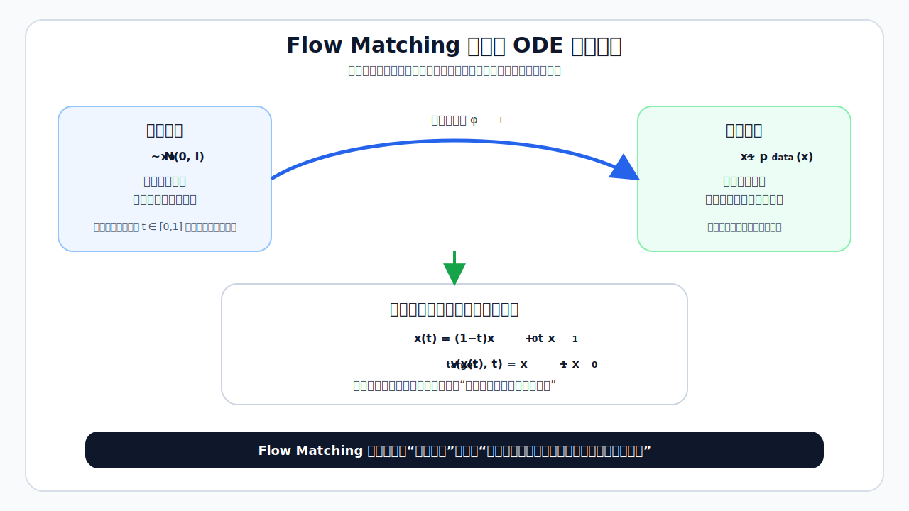

</div>


### 1. 核心思想：从"噪声到数据"的确定性流

传统扩散模型（以DDPM为代表）通常把生成过程看成逐步反向去噪：从高斯噪声开始，沿着很多离散时间步一步步回到数据分布。这种方法非常成功，但也带来一些工程和理论上的挑战：

- 经典DDPM的理论起点是ELBO下界，实际训练又常用简化噪声预测损失，训练目标与最终采样质量之间存在代理目标差异
- 采样通常需要多步数值积分，虽然DDIM、DPM-Solver等方法已经能明显加速，但少步采样仍然依赖求解器和调度设计
- 连续时间视角下会涉及SDE、Probability Flow ODE和Score函数，数学链条较长

Flow Matching的核心洞察是：**生成过程可以被建模为一个确定性的常微分方程（ODE）**，该ODE描述了从简单分布（如标准正态分布）到复杂数据分布的连续变换。我们的目标是**学习这个ODE的速度场**，使得沿着这个速度场积分，就能从噪声生成数据。

更准确地说：

- 我们定义一个**时间依赖的向量场** $v(x,t)$ ，其中 $t \in [0,1]$
- 生成过程是求解 ODE： $\dfrac{\mathrm{d}x}{\mathrm{d}t} = v(x,t)$
- 初始条件 $x(0) \sim p_0(x)$ （简单分布，如高斯噪声）
- 最终条件 $x(1) \sim p_1(x)$ （真实数据分布）

Flow Matching的任务就是：学习一个向量场 $v(x,t)$ ，使得从 $p_0$ 采样初始点并沿着 $v$ 积分到 $t=1$ 后，终点分布尽可能接近真实数据分布 $p_1$ 。

### 2. 数学基础：连续归一化流（CNF）

Flow Matching建立在 **连续归一化流（Continuous Normalizing Flows, CNF）** 的基础上。CNF是归一化流的连续版本，它通过一个连续的可逆变换将简单分布映射到复杂分布。

**变量替换公式（连续版本）**

对于一个由 ODE $\dfrac{\mathrm{d}x}{\mathrm{d}t} = v(x,t)$ 定义的连续变换 $x(t) = \phi_t(x_0)$ ，其中 $\phi_t$ 是从 $t=0$ 到 $t$ 的流映射，沿着轨迹有以下**对数概率密度的演化方程**：

```math
\frac{d \log p_t(x(t))}{dt} = -\nabla \cdot v(x(t),t)
```

其中 $p_t(x)$ 是时间 $t$ 时的分布， $\nabla \cdot v$ 是向量场 $v$ 的散度。这里的导数是沿着ODE轨迹的全导数；如果写成固定位置 $x$ 上的偏微分形式，还会包含 $v\cdot\nabla \log p_t(x)$ 项。

这个方程告诉我们：沿着ODE轨迹看，**样本点处对数密度的变化率等于向量场散度的负值**。如果向量场在局部扩张，密度会下降；如果向量场在局部收缩，密度会上升。

**传统CNF的训练问题**

传统 CNF 的训练目标是最大化数据的对数似然：

```math
\max\ \mathbb{E}_{x_1\sim p_1}\left[\log p_1(x_1)\right]
```

根据变量替换公式，我们可以将 $\log p_1(x_1)$ 表示为：

```math
\log p_1(x_1) = \log p_0(x_0) - \int_0^1 \nabla \cdot v\bigl(\phi_t(x_0),t\bigr)\,dt
```

其中 $x_0 = \phi_0(x_1)$ 是逆流映射。

然而，这个目标函数有一个重要难点：需要在训练和似然计算中处理散度 $\nabla \cdot v$ 。对于高维数据（如图像），精确计算散度代价很高；传统CNF常用Hutchinson估计器近似散度，但会引入额外随机性和计算开销。

### 3. Flow Matching的突破：避开散度计算

Flow Matching的关键贡献在于：训练时不直接最大化CNF似然，而是用**速度场匹配目标**来学习生成流，从而避开训练阶段的散度计算。

**1. 条件路径构造**

Flow Matching的关键思想是：**我们不需要直接学习从 $p_0$ 到 $p_1$ 的任意流，而是可以构造一个条件流，然后通过边缘化得到无条件流**。

具体来说：
1. 对于每一个真实数据点 $x_1 \sim p_1$ ，我们构造一个**条件路径** $x(t\mid x_1)$ ，它从某个初始点 $x_0$ 出发，在 $t=1$ 时到达 $x_1$
2. 我们定义**条件速度场** $v(x,t\mid x_1)$ ，它是条件路径的时间导数： $v(x,t\mid x_1) = \dfrac{\mathrm{d}}{\mathrm{d}t}x(t\mid x_1)$
3. 我们的目标是学习一个无条件速度场 $v(x,t)$ ，使得它在所有条件路径上都与条件速度场匹配

**2. Flow Matching目标函数**

Flow Matching的目标函数是**最小化无条件速度场与条件速度场之间的均方误差**：

```math
\mathcal{L}_{\mathrm{FM}} = \mathbb{E}_{t\sim U(0,1),\, x_1\sim p_1,\, x_0\sim p_0(x_0\mid x_1)}\left[ \left\| v\bigl(x(t\mid x_1),t\bigr) - v\bigl(x(t\mid x_1),t\mid x_1\bigr) \right\|^{2} \right]
```

这个目标函数有几个重要性质：

- **训练时无散度计算**：不需要像传统CNF那样在训练目标里计算 $\nabla\cdot v$
- **监督信号直接**：网络回归的是路径上的速度，而不是通过似然下界间接优化
- **理论保证有条件**：在路径构造、模型容量和优化足够理想时，匹配到正确速度场可以把 $p_0$ 推到 $p_1$

**3. 线性路径特例（最常用）**

在很多图像生成应用中，常用的是**线性插值路径**：

```math
x(t\mid x_1) = (1-t)\,x_0 + t\,x_1
```

其中 $x_0 \sim \mathcal{N}(0, I)$ 是标准正态分布。

对应的条件速度场非常简单：

```math
v\bigl(x(t\mid x_1),t\mid x_1\bigr) = \frac{\mathrm{d}}{\mathrm{d}t}\left[(1-t)x_0 + t x_1\right] = x_1 - x_0
```

将其代入Flow Matching目标函数，我们得到：

```math
\mathcal{L}_{\mathrm{FM}} = \mathbb{E}_{t\sim U(0,1),\, x_1\sim p_1,\, x_0\sim\mathcal{N}(0,I)}\left[ \left\| v\bigl((1-t)x_0 + t x_1, t\bigr) - (x_1 - x_0) \right\|^{2} \right]
```

这就是**标准Flow Matching**的训练目标。

### 4. 条件Flow Matching（CFM）：可控生成的基础

Flow Matching可以自然扩展到条件生成任务（如图像生成、文本到图像生成），这就是**条件Flow Matching（Conditional Flow Matching, CFM）**。

在CFM中，我们学习一个**条件速度场** $v(x,t\mid c)$ ，其中 $c$ 是条件信息（如文本嵌入、类别标签）。训练目标函数变为：

```math
\mathcal{L}_{\mathrm{CFM}} = \mathbb{E}_{t\sim U(0,1),\, (x_1,c)\sim p_1(x_1,c),\, x_0\sim\mathcal{N}(0,I)}\left[ \left\| v\bigl((1-t)x_0 + t x_1, t\mid c\bigr) - (x_1 - x_0) \right\|^{2} \right]
```

生成过程是求解条件 ODE：

```math
\frac{\mathrm{d}x}{\mathrm{d}t} = v(x,t\mid c)
```

SD3、FLUX等模型都采用了Flow Matching/Rectified Flow相关思想来建模从噪声到数据的生成过程。相比经典DDPM式训练，它们更强调速度场学习和少步ODE采样，但最终可控性和速度仍取决于模型结构、训练数据、时间步采样和求解器设计。

### 5. 训练与采样过程

**1. 训练过程**

Flow Matching的训练过程和扩散模型有相似的“采样时间步、构造带噪/中间样本、预测目标、MSE训练”形式：

1. 从数据集中采样一个真实数据点 $x_1$
2. 从标准正态分布采样一个噪声点 $x_0$
3. 随机采样一个时间步 $t \sim U(0,1)$
4. 计算插值点 $x(t) = (1-t)x_0 + t x_1$
5. 将 $x(t)$ 和 $t$ 输入神经网络，预测速度场 $v_{\mathrm{pred}}(x(t),t)$
6. 计算损失 $\mathcal{L} = \left\| v_{\mathrm{pred}} - (x_1 - x_0) \right\|^{2}$
7. 反向传播更新神经网络参数

**2. 采样过程**

采样过程就是求解 ODE $\dfrac{\mathrm{d}x}{\mathrm{d}t} = v(x,t)$ 。我们可以使用任何数值 ODE 求解器，如：

- **欧拉法**：最简单，步数少时代价低，但一阶误差较大
- **龙格-库塔法（RK4）**：精度更高，但每一步需要更多函数评估
- **自适应步长法**：自动调整步长，平衡速度和精度

**采样速度对比**：

- 传统扩散模型：常见高质量采样需要十几到几十步，具体取决于模型和采样器
- Flow Matching / Rectified Flow类模型：通常更适合少步ODE采样，但实际步数仍取决于训练方式和求解器
- Consistency Model/蒸馏类方法：可以面向1步或极少步采样优化，但通常要在速度和质量之间再做权衡

### 6. Flow Matching vs 扩散模型（DDPM）：全面对比

<div align="center">

| 特性 | Flow Matching | 扩散模型（DDPM） |
|------|---------------|------------------|
| 数学基础 | 常微分方程（ODE） | 随机微分方程（SDE） |
| 生成过程 | 确定性 | 随机性 |
| 训练目标 | 速度场匹配MSE | ELBO或简化噪声预测MSE |
| 预测目标 | 速度场（或干净数据） | 噪声 |
| 采样步数 | 更适合少步ODE采样 | 通常需要更多步，现代采样器可加速 |
| 1步采样 | 需专门蒸馏或一致性训练 | 需专门蒸馏或一致性训练 |
| 训练稳定性 | 目标较直接 | 工程经验成熟 |
| 理论框架 | ODE速度场视角 | Score/SDE/ODE视角 |
| 可控性 | 取决于条件建模方式 | 取决于条件建模方式 |

</div>

### 7. 关键优势与局限性

**1. 核心优势**

- **适合少步采样**：ODE速度场视角更方便使用少步数值求解器
- **训练监督直接**：直接回归路径速度，不需要在训练目标中计算CNF散度
- **数学表达清晰**：基于ODE流，便于和CNF、最优传输、扩散概率流ODE联系起来
- **条件扩展自然**：可以把类别、文本、图像等条件输入速度场

**2. 局限性**

- **理论上的分布匹配保证仅在无限数据和无限模型容量下成立**
- 对于某些复杂分布，可能需要更复杂的路径设计
- 目前在高分辨率图像生成上的表现与最先进的扩散模型相当，但没有明显优势
- 相比经典扩散生态，部分采样器、蒸馏和工程调参经验仍在快速发展中

Flow Matching可以看作生成模型从“预测噪声/Score”走向“学习连续速度场”的一条重要路线。它没有让扩散模型的所有问题自动消失，但提供了一个更直接的ODE训练视角，也解释了为什么RF、SD3、FLUX等模型能在少步采样上表现突出。

**核心结论**：

- Flow Matching的核心是学习一个将简单分布映射到数据分布的ODE速度场
- 它通过构造条件路径并匹配条件速度场来训练，避开了训练阶段的散度计算
- Rectified Flow是Flow Matching的一个特例，使用线性路径和特定的速度场参数化
- Flow Matching具有采样路径清晰、训练目标直接、适合少步ODE采样等优势，是当前生成模型的重要发展方向之一


<h2 id="q-018b">面试问题：介绍一下Rectified Flow的原理，与 Flow Matching、Consistency Model 是什么样的联系与区别？</h2>

**难度评分：⭐⭐⭐⭐⭐ (5/5)  |  考察频率：⭐⭐⭐⭐ (4/5)**

Rectified Flow、Flow Matching和Consistency Model都可以放在“连续时间生成流”的视角下理解，但三者定位不同：**Flow Matching更像通用训练框架，Rectified Flow是其中常用的线性路径/终点预测形式，Consistency Model则关注把多步生成过程压缩成一步或少步的一致性映射**。理解它们的关系，关键是分清：谁在定义训练目标，谁在规定路径形式，谁在做采样加速。

<div align="center">

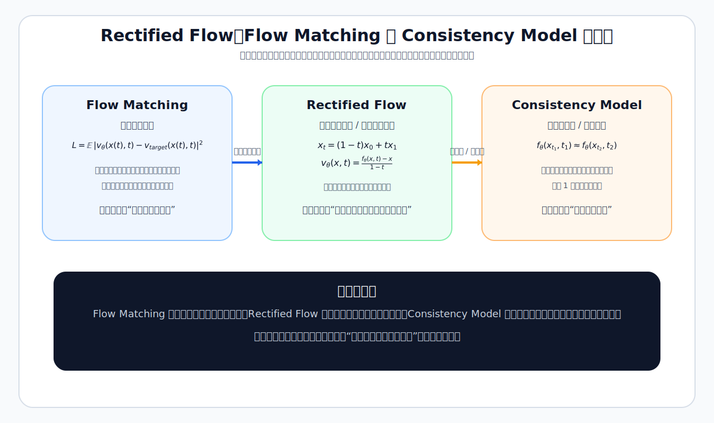

</div>


### 1. Rectified Flow核心原理（线性路径与终点预测）

Rectified Flow的核心想法是：先把噪声样本 $x_0$ 和数据样本 $x_1$ 配成一对，然后用线性插值构造中间点：

```math
x_t = (1-t)x_0 + t x_1
```

如果模型能在任意中间点上预测出合理的速度或终点，就可以通过ODE从噪声逐步走到数据。这里的“rectified”可以直观理解为：希望学习到更接近直线、少弯曲的生成轨迹，从而降低少步积分时的误差。

Rectified Flow将生成过程建模为一个确定性的常微分方程：

```math
\frac{dx(t)}{dt} = v(x(t), t), \quad t \in [0,1]
```

一种常见参数化是让网络 $f_\theta(x,t)$ 预测最终数据点，再由当前点和预测终点构造速度：

```math
v_\theta(x, t) = \frac{f_\theta(x,t) - x}{1-t}
```

这个参数化的直观含义是：在时刻 $t$ ，模型先估计最终干净数据点 $f_\theta(x,t)$ ，再让速度方向指向这个估计终点；剩余时间越短，速度尺度越大。训练时真实终点是 $x_1$ ，推理时终点由模型预测。

Rectified Flow的训练目标极其简单，就是最小化预测数据点与真实数据点之间的均方误差：

```math
\mathcal{L}_{\text{RF}} = \mathbb{E}_{t\sim\mathcal{U}(0,1),\, x_1\sim p_1,\, x_0\sim p_0} \left\| f_\theta\big((1-t)x_0 + tx_1,\ t\big) - x_1 \right\|_2^2
```

其中 $f_\theta(x,t)$ 是神经网络，直接预测干净数据点 $x_1$ 。

生成时，我们可以使用欧拉法求解ODE：

```math
x_{t+\Delta t} = x_t + \Delta t \cdot \frac{f_\theta(x_t, t) - x_t}{1-t}
```

实际采样步数取决于模型规模、训练方式、时间步调度和ODE求解器；RF类模型通常更适合少步采样，但不是说任何RF模型都天然只需2-4步。

### 2. 三者的本质联系

**1. Rectified Flow可以看作Flow Matching的一种常用特例**

Flow Matching允许选择不同条件路径和速度场参数化。当我们选择线性路径，并用“预测终点再换算速度”的方式参数化速度场时，就得到和Rectified Flow非常接近的训练形式。

**条件1：使用线性插值路径**

```math
x(t\mid x_1) = (1-t)x_0 + tx_1
```

**条件2：使用"指向终点"的速度场参数化**

```math
v(x, t) = \frac{f_\theta(x,t) - x}{1-t}
```

**关系推导**：

将上述两个条件代入Flow Matching的通用损失函数：

```math
\mathcal{L}_{\text{FM}} = \mathbb{E} \left\| v(x(t), t) - (x_1 - x_0) \right\|_2^2
```

由于 $x(t) = (1-t)x_0 + tx_1$ ，所以 $x_1 - x_0 = \frac{x_1 - x(t)}{1-t}$ 。代入得：

```math
\mathcal{L}_{\text{FM}} = \mathbb{E} \left\| \frac{f_\theta(x(t),t) - x(t)}{1-t} - \frac{x_1 - x(t)}{1-t} \right\|_2^2
```

```math
= \mathbb{E} \left\| \frac{f_\theta(x(t),t) - x_1}{1-t} \right\|_2^2
```

```math
= \mathbb{E} \left( \frac{1}{(1-t)^2} \cdot \left\| f_\theta(x(t),t) - x_1 \right\|_2^2 \right)
```

这说明线性路径下的速度匹配目标，可以转写成一个带时间权重的终点预测目标。实际训练中常通过时间采样、损失加权或目标参数化来处理这个权重，而不是简单认为两者在所有设置下完全等价。

**2. Consistency Model关注“同一轨迹上的点应映射到同一终点”**

Consistency Model（CM）的核心是学习一个一致性函数：同一条生成轨迹上的不同时间点，都应该映射到同一个数据端点。它可以从已有扩散/Flow模型蒸馏而来，也可以通过一致性训练从头学习；因此它和FM/RF有密切联系，但不应简单说成FM的子集。

一致性条件的数学表达，设 $\phi_{t_1 \to t_2}(x)$ 表示从时刻 $t_1$ 到 $t_2$ 的流映射，那么一致性条件可以表示为：

```math
f_\theta(x, t_1) = f_\theta(\phi_{t_1 \to t_2}(x), t_2), \quad \forall 0 \leq t_1 < t_2 \leq 1
```

其中 $f_\theta(x,t)$ 是模型预测的最终数据点。

CM的训练目标就是最小化一致性损失：

```math
\mathcal{L}_{\text{CM}} = \mathbb{E}_{t_1 < t_2,\, x_1,\, x_0} \left\| f_\theta(x(t_1), t_1) - f_\theta(x(t_2), t_2) \right\|_2^2
```

当模型较好满足一致性条件时，可以直接从某个噪声时刻的点预测数据端点，而不必完整积分整条ODE轨迹。这意味着：

```math
x_1 = f_\theta(x_0, 0)
```

理论上可以做1步采样；实践中通常会根据质量要求选择1步或少步采样。

### 3. 三者的本质区别

<div align="center">

| 维度 | Flow Matching | Rectified Flow | Consistency Model |
|------|---------------|----------------|-------------------|
| **定位** | 通用训练框架 | 常用线性路径/终点预测形式 | 一致性映射/蒸馏或训练方法 |
| **核心思想** | 匹配条件路径的速度场 | 学习从噪声到数据的较直轨迹 | 让同一轨迹上的点映射到同一端点 |
| **速度场参数化** | 可灵活选择 | 常用"指向预测终点"形式 | 可基于不同教师或轨迹构造 |
| **训练目标** | 匹配真实速度 | 预测干净数据点 | 最小化一致性损失 |
| **采样方式** | ODE数值积分 | ODE数值积分 | 直接预测终点 |
| **少步采样能力** | 较强，依赖求解器 | 较强，依赖训练与调度 | 面向1步或少步优化 |
| **训练方式** | 单阶段 | 单阶段 | 两阶段（蒸馏/从头训练） |
| **生成质量** | 取决于路径、模型和求解器 | 取决于训练和调度 | 速度快，但可能有蒸馏质量损失 |
| **灵活性** | 高（支持多种路径） | 中等（常用线性路径） | 取决于一致性训练设定 |

</div>


<h2 id="q-018c">面试问题：Stable Diffusion/FLUX对Rectified Flow的采样方法做了哪些优化？</h2>

**难度评分：⭐⭐⭐⭐⭐ (5/5)  |  考察频率：⭐⭐⭐ (3/5)**

Stable Diffusion 3和FLUX都采用了Flow Matching/Rectified Flow相关路线，但落地到高分辨率文生图时，不能只靠“线性路径 + 欧拉法”这个最简版本。工程上通常还要优化时间步采样、损失权重、噪声/时间调度、ODE求解器以及模型结构。可以把这些优化理解为：**在保持RF/FM主体思想的同时，让模型把学习能力用在更关键的时间区域，并让少步积分更稳定**。

<div align="center">

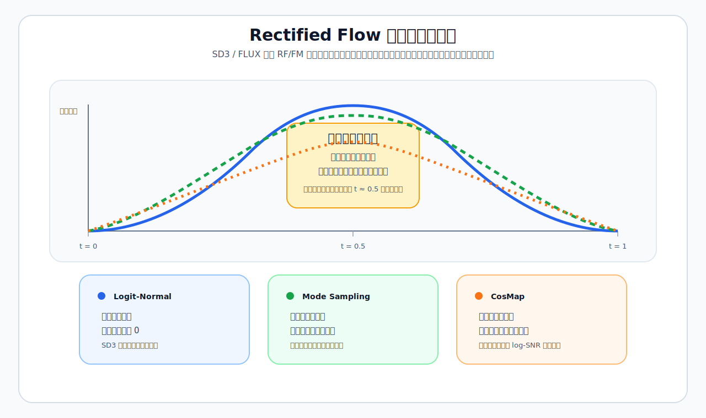

</div>


常见痛点包括：

1. 均匀时间步训练未必匹配不同时间区域的学习难度
2. 简单欧拉法在少步数下仍会有数值积分误差
3. 高分辨率、强文本条件和复杂数据分布会让实际生成轨迹比理想直线更复杂

因此，SD3/FLUX这类模型的优势不是来自某一个单点技巧，而是来自**训练时间分布、目标参数化、模型结构和采样器配置**的组合优化。

### 1. 标准Rectified Flow落地时的三类挑战

在讲解优化之前，需要先明确最简RF设置的问题所在：

**（1）均匀时间步训练的"中间难、两边易"问题**

最简RF常用 $t \sim \mathcal{U}(0,1)$ 均匀采样时间步，但：

- $t \to 0$ ： $x(t) \approx x_0$ ，模型几乎只看到噪声，主要判断全局方向
- $t \to 1$ ： $x(t) \approx x_1$ ，模型几乎只看到干净数据，细节预测相对容易
- $t \approx 0.5$ ：信号与噪声各占一半，是预测最困难的区域

均匀训练导致模型在中间区域的精度不足，少步数采样时误差主要来自这里。

**（2）简单欧拉法的一阶误差累积**

最简RF可以使用欧拉法求解ODE：

```math
x_{t+\Delta t} = x_t + \Delta t \cdot v(x_t, t)
```

这是一阶方法，每一步都有 $O(\Delta t^2)$ 的局部误差，总误差为 $O(\Delta t)$ 。当步数减少时，误差会急剧累积。

**（3）高分辨率下的轨迹弯曲问题**

线性路径给了模型一个较直的训练目标，但真实模型学到的速度场、条件控制和有限步数值解并不一定严格沿直线运动。分辨率越高、条件越复杂，对轨迹和求解器的要求越高。

### 2. Logit-Normal时间步采样

SD3论文中一个重要经验是：训练时不要简单均匀采样时间步，而是提高中间难点区域的采样概率。

SD3抛弃了均匀时间步采样，转而使用**Logit-Normal分布**采样时间步：

```math
\text{logit}(t) = \log\left(\frac{t}{1-t}\right) \sim \mathcal{N}(\mu, \sigma^2)
```

其中 $\mu=0$ ， $\sigma=1.0$ 是SD3论文中重点报告的设置之一。

这个分布的特点是：在 $t=0.5$ 附近概率密度较高，向两边逐渐降低，比较符合“中间混合区域更难学”的直觉。

### 3. Mode Sampling with Heavy Tails（重尾模式采样）

Logit-Normal分布在 $t=0$ 和 $t=1$ 端点处密度趋近于0，这意味着端点附近采样概率较低，可能带来：

- $t\to0$ 时（接近纯噪声）的全局结构预测不准确
- $t\to1$ 时（接近干净数据）的细节恢复能力不足

Mode Sampling的设计目标就是**在保持中间区域高权重的同时，确保端点区域有非零的采样概率**。

SD3论文还讨论了Mode Sampling with Heavy Tails。它通过一个单调变换函数 $f_{\mathrm{mode}}(u; s)$ 将均匀分布的 $u \in [0,1]$ 映射到时间步 $t$ ：

```math
f_{\text{mode}}(u; s) = 1 - u - s \cdot \left( \cos^2\left(\frac{\pi}{2} u\right) - 1 + u \right)
```

其中 $s$ 是**模式控制参数**，取值范围为 $-1 \leq s \leq \frac{2}{\pi-2} \approx 1.75$ 。时间步 $t$ 就是这个函数的输出：

```math
t = f_{\text{mode}}(u; s)
```

对应的概率密度函数为：

```math
\pi_{\text{mode}}(t; s) = \left| \frac{d}{dt} f_{\text{mode}}^{-1}(t) \right|
```

参数s决定了分布的形状：

- **s=0**：退化为标准均匀分布 $\pi_{\text{mode}}(t; 0) = \mathcal{U}(0,1)$
- **s>0**：概率密度向中间区域t=0.5集中，s越大，中间区域权重越高
- **s<0**：概率密度向两端点t=0和t=1集中

SD3论文中测试了多个 $s$ 值，用来比较不同时间步分布对采样质量的影响。

<div align="center">

| 模型变体 | 全局平均排名 | 5步采样排名 | 50步采样排名 |
|---------|-------------|-------------|-------------|
| rf/mode(1.29) | 2.75 | 3.25 | 3.00 |
| rf/mode(1.75) | 3.33 | **2.75** | 2.75 |
| rf/lognorm(0.00,1.00) | **1.54** | 1.25 | 1.50 |
| 标准RF（均匀采样） | 5.67 | 6.50 | 5.75 |

</div>

**可以这样理解实验结论**：

- Mode Sampling能提高中间区域权重，同时保留端点附近的非零密度
- 在少步采样下，重尾设计有助于缓解端点区域学习不足的问题
- 在SD3报告的设置中，Logit-Normal整体表现更稳，Mode Sampling是一个有竞争力的备选

**Mode Sampling with Heavy Tails优势与局限性**：

**优势**：

- 在整个 $[0,1]$ 区间上都有正密度，有助于缓解端点区域学习不足
- 参数控制简单直观，一个参数即可调整分布形状
- 在少步数采样下表现优异

**局限性**：

- 整体性能略逊于Logit-Normal
- 当s>1.75时，变换函数不再单调，无法使用

### 4. CosMap时间映射

余弦调度（Cosine Schedule）是扩散模型中常见的噪声调度。CosMap的设计目标是：让Rectified Flow线性路径的log-SNR形式与传统余弦调度的log-SNR对应起来，从而把扩散模型中的调度经验迁移到RF时间轴上。

传统扩散模型的余弦调度定义为：

```math
z_t = \cos\left(\frac{\pi}{2} u\right) x_0 + \sin\left(\frac{\pi}{2} u\right) \epsilon
```

对应的log-SNR为：

```math
\lambda_u = 2 \log \frac{\cos\left(\frac{\pi}{2} u\right)}{\sin\left(\frac{\pi}{2} u\right)}
```

对于Rectified Flow，线性插值路径的log-SNR为：

```math
\lambda_t = 2 \log \frac{1-t}{t}
```

为了让两者的log-SNR匹配，我们需要找到一个映射 $f(u)=t$ ，使得：

```math
2 \log \frac{\cos\left(\frac{\pi}{2} u\right)}{\sin\left(\frac{\pi}{2} u\right)} = 2 \log \frac{1-f(u)}{f(u)}
```

解这个方程得到：

```math
t = f(u) = 1 - \frac{1}{\tan\left(\frac{\pi}{2} u\right) + 1}
```

这就是CosMap采样器的映射函数。对应的概率密度函数为：

```math
\pi_{\text{CosMap}}(t) = \left| \frac{d}{dt} f^{-1}(t) \right| = \frac{2}{\pi - 2\pi t + 2\pi t^2}
```

CosMap分布的特点是：

- 在t=0.5附近有一个峰值，与Logit-Normal类似
- 两端的下降速度比Logit-Normal慢，有更重的尾部
- 在整个 $[0,1]$ 区间上都有正密度

<div align="center">

| 模型变体 | 全局平均排名 | 5步采样排名 | 50步采样排名 |
|---------|-------------|-------------|-------------|
| rf/cosmap | 4.13 | 3.75 | 4.00 |
| rf/mode(1.29) | 2.75 | 3.25 | 3.00 |
| rf/lognorm(0.00,1.00) | **1.54** | **1.25** | **1.50** |

</div>

**可以这样理解实验结论**：

- CosMap提供了一个和传统余弦调度对应的时间映射
- 它的分布更平滑、尾部更重，端点覆盖比Logit-Normal更充分
- 在SD3报告的设置中，它不是最优选择，但有助于理解RF时间轴和扩散log-SNR之间的关系

**CosMap优势与局限性**：

**优势**：

- 与传统扩散模型的余弦调度兼容，便于迁移经验
- 分布形状平滑，训练过程稳定
- 在SD3报告的设置中，不同步数下表现相对均衡

**局限性**：

- 整体性能略逊于Logit-Normal和Mode Sampling
- 没有可调整的参数，灵活性较差

### 5. 三类时间步分布对比

**1. 核心特性对比表**

<div align="center">

| 特性 | Logit-Normal | Mode Sampling | CosMap |
|------|--------------|---------------|--------|
| **设计目标** | 强化中间难点区域 | 兼顾中间区域与端点覆盖 | 对齐传统余弦log-SNR |
| **端点密度** | 零 | 非零 | 非零 |
| **可调参数** | 2个（位置m，尺度s） | 1个（模式s） | 0个 |
| **经验表现** | SD3报告中整体较稳 | 少步和端点覆盖有优势 | 表现均衡但不一定最优 |
| **是否可调** | 可调 | 可调 | 固定映射 |

</div>

**2. 分布形状对比**

- **Logit-Normal**：最尖锐的中间峰值，两端快速下降到零
- **Mode Sampling(s=1.29)**：中间峰值略低，两端有非零密度
- **CosMap**：中间峰值最低，两端下降最慢，尾部最重

**3. 适用场景**

- **Logit-Normal**：通用训练设置，重点提升中间时间区域学习
- **Mode Sampling**：希望兼顾中间区域和端点覆盖时可以尝试
- **CosMap**：希望把扩散模型余弦调度经验迁移到RF时间轴时有参考价值

### 6. 为什么SD3最终选择了Logit-Normal？

SD3论文中的实验显示， `rf/lognorm(0.00,1.00)` 在其比较设置下整体表现较好，原因可以概括为三点：

1. **中间区域权重更高**：它把更多训练样本放在信号和噪声混合最难的区域。

2. **不同采样步数下较稳定**：相比只偏向端点或只偏向某个局部区域的分布，它在多种设置下更均衡。

3. **参数调整灵活**：Logit-Normal有位置和尺度参数，可以调整分布的位置和形状，适应不同任务和数据集。例如：
   - m>0：偏向高噪声区域，适合低分辨率生成
   - m<0：偏向低噪声区域，适合高分辨率生成
   - s越小：分布越集中在中间区域


<h2 id="q-018d">面试问题：Rectified Flow 与传统扩散模型（score matching）的训练目标本质差异是什么？</h2>

**难度评分：⭐⭐⭐⭐⭐ (5/5)  |  考察频率：⭐⭐⭐ (3/5)**

**传统扩散模型通常学习带噪样本处的Score/噪声预测方向，而Rectified Flow更常学习从噪声到数据路径上的速度或终点预测。** 两者都可以用MSE训练，但监督信号的含义不同：扩散模型强调“当前噪声水平下该如何去噪”，Rectified Flow强调“沿着从噪声到数据的连续路径该如何移动”。

<div align="center">

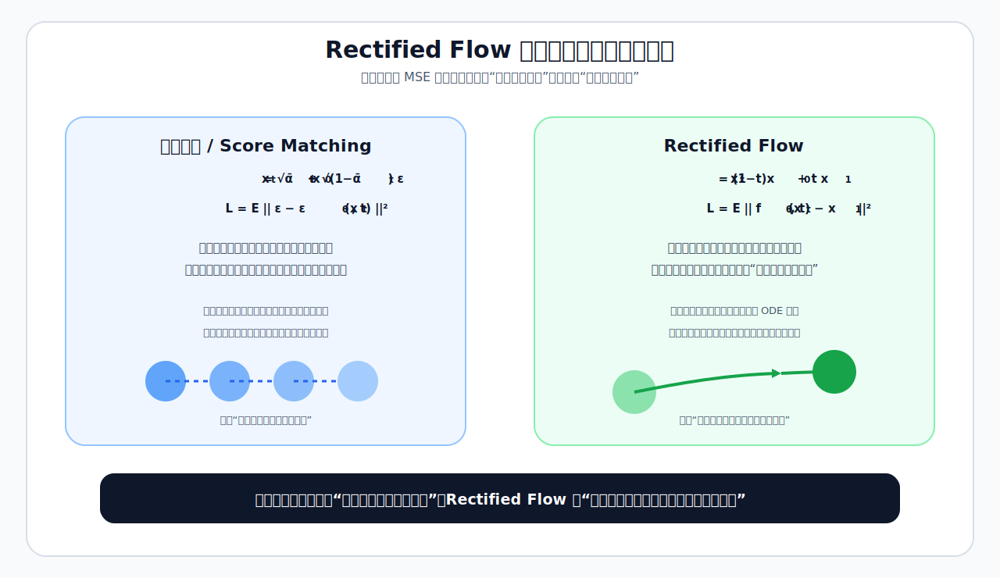

</div>


### 1. 三大核心本质差异

**1. 数学范式与目标性质差异**

- **传统扩散/Score Matching**：
  - 数学基础：可从离散马尔可夫链、SDE或概率流ODE视角理解
  - 训练目标：常见形式是噪声预测MSE，也可以从ELBO/Score Matching推导
  - 本质：学习不同噪声水平下的局部去噪方向

- **Rectified Flow**：
  - 数学基础：常微分方程（ODE）定义的连续生成流
  - 训练目标：最小化路径速度或终点预测的MSE
  - 本质：学习从噪声分布到数据分布的连续传输方向

**2. 监督信号的时空范围差异**

- **传统扩散/Score Matching**：
  - 监督信号：**单步添加的高斯噪声**
  - 时空范围：**局部单步**，每一步的预测只依赖当前时刻的状态
  - 问题：采样时需要沿着时间轴多步积分，少步时更依赖采样器和调度设计

- **Rectified Flow**：
  - 监督信号：**从噪声到数据的整个轨迹的瞬时速度**
  - 时空范围：**全局轨迹**，每一步的预测都指向最终的干净数据点
  - 优势：监督信号直接来自噪声点和数据点之间的路径，更适合少步ODE采样

**3. 模型预测的物理意义差异**

- **传统扩散/Score Matching**：
  - 预测目标：**数据分布的对数概率梯度(Score)**
  - 物理意义：告诉模型"在当前位置，应该往哪个方向走一小步来降低噪声"
  - 局限性：少步采样时，局部方向的数值积分误差更明显

- **Rectified Flow**：
  - 预测目标：**最终的干净数据点(或指向该点的速度场)**
  - 物理意义：告诉模型"在当前位置，应该以多大速度往哪个最终目的地走"
  - 优势：终点预测/速度预测让采样方向更具全局性，因此少步时更容易保持语义和结构

### 2. 核心对比表

<div align="center">

| 维度 | 传统扩散模型(Score Matching) | Rectified Flow |
|------|-----------------------------|----------------|
| 数学基础 | 随机SDE | 确定性ODE |
| 训练目标 | 噪声/Score预测MSE，或ELBO相关目标 | 速度/终点预测MSE |
| 监督信号 | 当前噪声水平的去噪方向 | 路径上的速度或终点 |
| 预测目标 | 局部梯度(Score) | 全局终点(或速度) |
| 少步采样难点 | 依赖求解器和噪声调度 | 依赖路径直线性和速度场精度 |
| 常见采样步数 | 十几到几十步，也可通过求解器/蒸馏加速 | 通常更适合少步ODE采样 |
| 理论视角 | Score/SDE/概率流ODE | ODE速度场/传输路径 |

</div>

**面试回答时可以这样概括**：扩散模型更像“每个噪声水平学一个局部去噪方向”，Rectified Flow更像“学习一条从噪声到数据的连续传输路径”。这就是为什么RF类模型天然更适合少步ODE采样，但最终质量仍取决于训练路径、模型容量、数据质量和采样器。


<h2 id="q-018e">面试问题：为什么 Rectified Flow 常被认为在少步采样下更有优势？</h2>

**难度评分：⭐⭐⭐⭐ (4/5)  |  考察频率：⭐⭐⭐⭐ (4/5)**

**Rectified Flow常被认为更适合少步采样，主要是因为它的训练路径通常更接近直线，预测目标也更具全局性。** 这会降低少步ODE积分的难度，但并不意味着RF在任何模型、任何数据、任何步数下都必然优于扩散采样器；实际效果仍取决于路径设计、时间步采样、模型能力和求解器。

### 1. 线性路径让少步积分更容易

- **传统扩散模型**：概率流ODE轨迹是**高度弯曲的曲线**
  - 欧拉法每一步只能沿着当前点的切线方向前进
  - 少步时步长 $\Delta t$ 很大，切线与真实曲线的偏差会急剧放大
  - 因此需要更依赖多步求解器、噪声调度和高阶数值方法

- **Rectified Flow**：训练时常用噪声点到数据点的线性路径
  - 线性路径的曲率更低，少步积分时更不容易偏离目标轨迹
  - 如果模型学到的速度场足够接近理想线性路径，欧拉法也能取得不错效果
  - 但真实模型存在预测误差和条件控制误差，因此实践中仍常使用多步采样

### 2. 全局终点预测：从根源上消除误差累积

- **传统扩散模型**：训练目标是**预测单步添加的噪声**
  - 每一步的预测只依赖当前时刻的状态，与最终终点无关
  - 前一步的误差会影响后续状态，形成链式影响
  - 步数越少，每一步误差越难被后续小步修正

- **Rectified Flow**：训练目标是**预测最终的干净数据点**
  - 任意时刻 $t$ 的预测都直接指向全局终点 $x_1$
  - 每一步都带有更强的全局目标信息，有助于保持语义和结构
  - 但预测终点也可能出错，因此仍需要合适的时间步和求解器来降低误差

### 3. 训练目标更贴近生成路径

- **传统扩散模型**：训练目标是**对数似然的变分下界(ELBO)**
  - 实际常用简化噪声预测损失，优化目标和最终感知质量之间存在代理关系
  - 少步采样时，训练时间步和采样时间步不完全一致，容易出现分布或调度错配
  - 生成结果可能出现模糊、伪影和语义错误

- **Rectified Flow**：训练目标直接回归路径速度或终点
  - 训练监督和ODE采样路径的关系更直接
  - 少步采样时主要挑战来自速度场预测误差和数值积分误差
  - 如果训练时间分布和采样时间分布设计得好，质量随步数减少通常更平缓


<h1 id="q-019">6.扩散模型有哪些常见的采样方法？介绍它们的原理</h1>

<h2 id="q-019a">面试问题：扩散模型主流的采样方法有哪些？不同采样方法的优缺点是什么？各自适合什么步数区间？</h2>

**难度评分：⭐⭐⭐⭐ (4/5)  |  考察频率：⭐⭐⭐⭐⭐ (5/5)**

<div align="center">

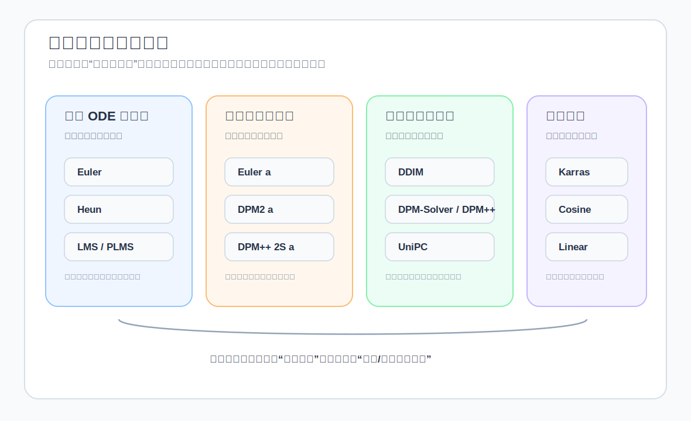

</div>


**扩散模型的采样本质是求解反向SDE或概率流ODE的数值过程。采样器决定“怎么走一步”，噪声调度器决定“在哪些噪声水平上走”；不同组合本质上是在速度、质量、稳定性和多样性之间取舍。常见方法可以按传统ODE求解器、祖先随机采样器、扩散专属求解器和噪声调度增强来理解。**

常见采样器包括：Euler、Euler a、DDIM、LMS、LMS Karras、Heun、DPM、DPM++、DPM++ SDE、UniPC、PLMS等。需要注意：Karras通常指噪声/时间步调度，不是一个独立采样算法，因此更准确的写法是“DPM++ 2M + Karras调度”。

### 1. 传统ODE求解器（确定性、实现简单）

#### Euler（欧拉法）

- **本质**：一阶显式欧拉法，最简单的数值求解器，每步仅1次模型前向传播
- **优点**：速度快、确定性强，固定初始噪声和配置时结果可复现
- **缺点**：一阶方法精度有限，少步（ $<15$ 步）误差较大，细节容易偏糊
- **适用步数**：20-50步，常作为简单可靠的基准

#### Heun（休恩法）

- **本质**：二阶预测-校正法，每步2次前向传播（先预测再校正）
- **优点**：精度通常高于Euler，收敛性好
- **缺点**：速度是Euler的1/2
- **适用步数**：15-30步；在相同步数下通常比Euler保留更多细节

#### LMS（线性多步法）

- **本质**：利用前4步历史信息的一阶多步求解器
- **优点**：速度与Euler相同，精度略高于Euler
- **缺点**：对步长和历史状态较敏感，高步数下可能出现伪影
- **适用步数**：20-40步；在新系统中较常被DPM++等方法替代

#### PLMS（伪线性多步法）

- **本质**：SD v1时代的默认采样器，基于线性多步的改进
- **优点**：速度与Euler相同
- **缺点**：精度一般，细节表现力有限
- **适用步数**：20-30步；更多见于早期Stable Diffusion流程

### 2. 祖先采样器（随机、多样性好）

这类方法的核心是：在每步去噪之后，根据当前噪声水平再注入一定随机噪声。它更接近反向SDE采样，优点是多样性强，缺点是结果不再随步数单调收敛到同一个确定解。

#### Euler a（欧拉祖先法）

- **本质**：Euler法+每步噪声注入
- **优点**：少步（10-15步）时风格更丰富、色彩更鲜明
- **缺点**：步数增加后图像仍可能持续变化；固定随机种子可复现，但不会像确定性ODE采样器那样收敛到唯一轨迹
- **适用步数**：10-20步；过多步数可能带来风格漂移或伪影

#### DPM2 a / DPM++ 2S a

- **本质**：二阶DPM法+每步噪声注入
- **优点**：少步质量通常较好，多样性更强
- **缺点**：速度约为Euler的1/2，结果不按确定性轨迹收敛
- **适用步数**：8-15步

### 3. 扩散专属求解器（专为扩散模型设计，少步精度较好）

#### DDIM（去噪扩散隐式模型）

- **本质**：早期常用的确定性采样器，可看作在DDPM训练目标下构造非马尔可夫的反向生成路径
- **优点**：10-15步即可生成可用图像，支持确定性插值
- **缺点**：细节模糊，容易产生过平滑效果
- **适用步数**：10-20步（多用于快速预览）

#### DPM-Solver系列

- **DPM2**：二阶扩散专属求解器，每步2次前向，精度高、收敛快
- **DPM++**：DPM-Solver的改进系列，针对扩散模型的噪声参数化和高噪声区误差做了优化
  - **DPM++ 2M**：多步二阶求解器，速度与Euler相同，精度接近Heun
  - **DPM++ SDE**：随机微分方程版本，加入少量噪声，可能提升多样性和细节，但属于随机轨迹
- **优点**：专为扩散模型优化，少步质量和收敛效率通常优于通用一阶方法
- **缺点**：DPM++ SDE带随机性；adaptive类方法质量高但计算开销较大
- **适用步数**：
  - DPM++ 2M：15-30步，常用于稳定高质量生成
  - DPM++ SDE：10-20步，常用于希望保留一定随机多样性的生成

#### UniPC（统一预测校正法）

- **本质**：统一预测-校正框架，通过预测器和校正器减少少步采样误差
- **优点**：少步效果较好，确定性强，单步开销通常接近Euler类方法
- **缺点**：极低步（ $<5$ 步）时仍依赖模型本身是否经过少步训练或蒸馏
- **适用步数**：5-25步，常用于少步快速生成

### 4. Karras增强变体（噪声调度优化，非独立采样器）

带"Karras"后缀的采样器，本质是**采样器使用了Karras等人提出的噪声调度**，而非独立算法。

- **核心改进**：将更多采样步数分配给对最终细节影响更大的低噪声区域
- **优点**：中高步数下常能提升细节质量和稳定性
- **缺点**：少步（<10步）优势不明显
- **适用场景**：常与DPM++、Euler、LMS等采样器组合，用于追求质量和稳定性的生成

### 主流采样器核心对比表

<div align="center">

| 采样器 | 类型 | 阶数 | 相对速度 | 收敛性 | 少步质量 | 多步质量 | 常见步数区间 |
|--------|------|------|----------|--------|----------|----------|--------------|
| Euler | 传统ODE | 1 | 1x | ✅ 好 | ⭕ 一般 | ✅ 好 | 20-50 |
| Heun | 传统ODE | 2 | 0.5x | ✅ 好 | ⭕ 一般 | ✅ 好 | 15-30 |
| LMS Karras | 传统ODE | 1 | 1x | ⭕ 一般 | ⭕ 一般 | ⭕ 一般 | 20-40 |
| Euler a | 祖先采样 | 1 | 1x | ⭕ 随机轨迹 | ✅ 好 | ⭕ 一般 | 10-20 |
| DDIM | 扩散专属 | 1 | 1x | ✅ 好 | ⭕ 一般 | ⭕ 一般 | 10-20 |
| DPM++ 2M Karras | 扩散专属 | 2 | 1x | ✅ 好 | ✅ 好 | ✅ 好 | 15-30 |
| DPM++ SDE Karras | 扩散专属 | 2 | 0.5x | ⭕ 随机轨迹 | ✅ 好 | ✅ 好 | 10-20 |
| UniPC | 扩散专属 | 可变 | 1x | ✅ 好 | ✅ 好 | ✅ 好 | 5-25 |
| PLMS | 传统ODE | 1 | 1x | ✅ 好 | ❌ 差 | ⭕ 一般 | 20-30 |

</div>


<h2 id="q-019b">面试问题：介绍一下扩散模型中噪声调度策略的设计原理，采样器（sampler）与噪声调度器（scheduler）如何配套选择，“错配”会导致什么问题？</h2>

**难度评分：⭐⭐⭐⭐⭐ (5/5)  |  考察频率：⭐⭐⭐⭐ (4/5)**

<div align="center">

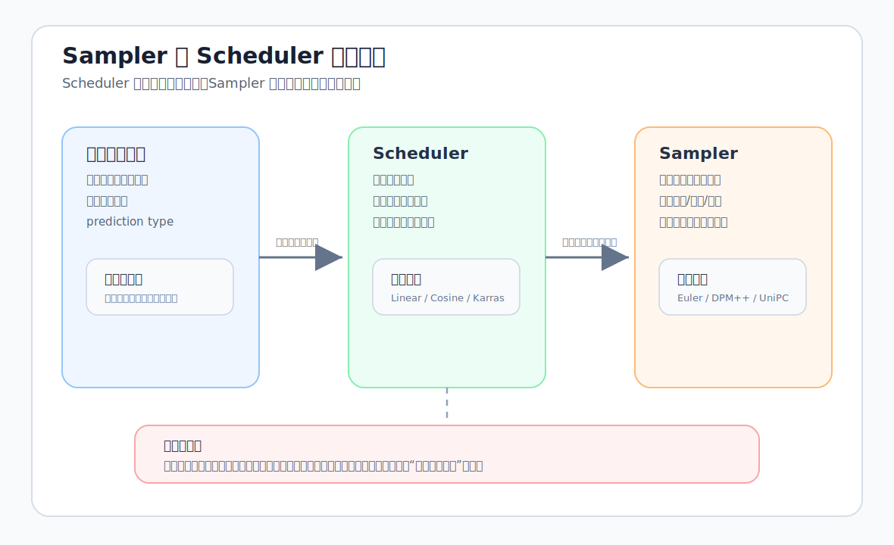

</div>


**噪声调度是扩散模型的"时间轴设计"，核心是控制训练和采样过程中每个时间步的信号/噪声比例；采样器是"数值积分器"，负责沿着调度定义的路径求解ODE/SDE。两者需要匹配模型训练时见过的噪声范围和参数化方式，否则容易出现分布偏移，表现为模糊、伪影、过饱和或语义结构不稳定。**

### 1. 噪声调度策略的核心设计原理

#### 1. 本质定义

噪声调度（Noise Schedule）描述了从干净数据到纯噪声的过程中，信号系数和噪声系数如何变化。不同论文会使用不同记法，例如DDPM常写成 $\bar{\alpha}_t$ ，EDM常用 $\sigma(t)$ 表示噪声强度；它决定了：

- 训练时每个时间步添加多少噪声
- 采样时每个时间步需要去除多少噪声

#### 2. 两大核心设计原则

原则1：信噪比（SNR）单调递减

信噪比定义为信号功率与噪声功率的比值。以常见的VP形式为例：

```math
x_t = \alpha(t)x_0 + \sigma(t)\epsilon,\qquad
\text{SNR}(t) = \frac{\alpha(t)^2}{\sigma(t)^2}
```

- 接近干净数据时， $\text{SNR}$ 较高，模型主要处理细节修复
- 接近纯噪声时， $\text{SNR}$ 较低，模型主要恢复全局结构
- 合理调度通常要求 $\text{SNR}$ 随扩散加噪过程整体下降，避免模型在训练和采样时遇到混乱的噪声顺序

原则2：噪声分布匹配学习难度

不同时间步的学习难度差异巨大：

- $t\approx 0$ （低噪声）：预测细节，难度相对低但对最终纹理影响大
- $t\approx 0.5$ （中等噪声）：预测全局结构+细节，难度最高
- $t\approx 1$ （高噪声）：预测整体轮廓，难度中等

**优秀调度的核心目标**：让训练采样分布覆盖模型真正难学、且对最终质量影响大的噪声区间。不同模型会根据训练目标、数据分辨率和采样步数选择不同侧重。

### 2. 主流噪声调度策略对比

<div align="center">

| 调度策略 | 核心特点 | 优点 | 缺点 | 代表模型 |
|---------|---------|------|------|---------|
| **线性调度** | $\beta_t$ 或噪声水平按简单规则变化 | 简单直观，训练稳定 | 低噪声区域分配可能不足，少步采样细节有限 | 早期DDPM/SD v1系列 |
| **余弦调度** | 通过余弦函数控制 $\bar{\alpha}_t$ 衰减 | SNR变化更平滑，中间区域覆盖更合理 | 少步时仍可能有离散化误差 | Improved DDPM等 |
| **Karras调度** | 在采样时按 $\sigma$ 重新分配离散步点 | 常能强化低噪声细节，提升中高步数质量 | 极少步时优势不一定明显 | EDM采样、SDXL常用采样配置 |
| **Logit-Normal时间采样** | 训练时更多采样中间时间步 | 更关注中等噪声难点区域 | 需要和模型参数化、训练目标配套 | SD3/Rectified Flow相关模型 |

</div>

#### 关键突破：Karras调度的本质

Karras调度关注的是采样阶段的离散步点怎么分布。扩散采样前期负责从高噪声中建立大致结构，后期负责修正纹理、边缘、颜色等可见细节；如果后期低噪声区域步点太少，整体结构可能已经对了，但图像会显得糊、脏或边缘不稳。

Karras调度通过指数分布重新分配步数：

```math
\sigma_i = \left( \sigma_{\text{max}}^{1/\rho} + \frac{i}{N-1} \left( \sigma_{\text{min}}^{1/\rho} - \sigma_{\text{max}}^{1/\rho} \right) \right)^\rho
```

其中 $\rho$ 控制步点向低噪声区域集中的程度，常见经验值为 $\rho=7$ 。它不是“换一个模型”，而是在同一个采样器上换一组更合适的噪声离散点，因此经常写作“DPM++ 2M Karras”“Euler Karras”。

### 3. 采样器与噪声调度器的配套选择原则

#### 1. 第一原则：训练与采样噪声范围要匹配

这是最核心、最容易被忽视的原则。模型是在特定噪声范围、时间分布和参数化方式下训练的，采样时可以重新选择离散步点，但不能让模型长期处在训练中很少见或从未见过的噪声区间。

- 错误示例：用线性调度训练的SD v1.5模型，采样时使用Logit-Normal调度
- 后果：可能出现图像模糊、色彩失真、语义结构不稳定

#### 2. 第二原则：采样器阶数与调度步长匹配

- **一阶采样器**（Euler、Euler a、LMS）：实现简单，对步长变化相对不敏感
- **二阶采样器**（Heun、DPM2、DPM++ 2M）：更依赖步长平滑性，通常适合Karras、余弦等较平滑的离散方式
- **预测-校正/高阶采样器**（UniPC）：少步效率高，但更需要合理的时间步分布和模型参数化配合

#### 3. 第三原则：采样器类型与调度特性匹配

<div align="center">

| 采样器类型 | 常见配套调度 | 原因 |
|-----------|-------------|------|
| 传统ODE求解器（Euler、Heun） | 线性、余弦、Karras | 一阶/二阶通用求解器适应性较强，Karras常用于提升低噪声细节 |
| 祖先采样器（Euler a、DPM2 a） | 线性、Karras | 随机噪声注入带来多样性，调度会影响风格漂移和细节稳定性 |
| 扩散专属求解器（DPM++、UniPC） | Karras、模型默认调度 | 这些求解器对扩散方程形式做了专门优化，通常要配合模型推荐调度 |
| DDIM/PLMS | 线性、余弦、模型默认调度 | 早期方法通常与DDPM/DDIM式时间步配套，少步时更适合作快速预览 |

</div>

#### 4. 常见实用组合

- **通用高质量生成**：DPM++ 2M + Karras（15-30步）
- **快速预览**：UniPC + Karras或模型默认调度（5-12步）
- **追求多样性**：DPM++ SDE + Karras（10-20步）
- **批量生成/基准对比**：Euler或Heun + 模型默认调度

### 4. 调度器与采样器错配的典型后果

这里的“错配”不是说某个组合一定不能用，而是指**采样时的噪声范围、时间参数化、离散步点分布与模型训练分布差异过大**。差异越大，模型越容易在不熟悉的噪声水平上做预测，数值误差和分布偏移就越明显。

#### 1. 轻度错配：质量下降

- **现象**：图像模糊、细节丢失、色彩暗淡
- **典型原因**：低噪声区域步数不足，后期细节修复不充分
- **理解方式**：整体语义可能是对的，但纹理、边缘和色彩不够干净

#### 2. 中度错配：伪影与失真

- **现象**：出现棋盘格伪影、边缘锯齿、过饱和色彩
- **典型原因**：采样器的更新假设与离散步点分布不协调，局部数值误差被放大
- **理解方式**：模型仍在去噪，但每一步修正方向不够稳定，容易积累成可见伪影

#### 3. 重度错配：语义破坏

- **现象**：生成图像完全不符合提示词，出现随机物体或扭曲结构
- **典型原因**：采样噪声水平或时间编码明显偏离训练分布，模型无法正确理解当前 $x_t$ 的噪声程度
- **理解方式**：早期高噪声阶段的结构判断出错，后期细节修复也难以补回来

#### 4. 极端错配：无法生成

- **现象**：输出纯噪声或纯黑色图像
- **典型原因**：噪声尺度、时间输入或参数化方式配置错误，例如 $\sigma$ 范围、prediction type、scheduler配置与模型不一致
- **理解方式**：模型预测的去噪方向与实际需要去除的噪声方向严重不匹配


<h2 id="q-019c">面试问题：增加采样步数有什么影响?为什么同样步数下，不同采样器的细节保真与风格偏好差异明显？</h2>

**难度评分：⭐⭐⭐⭐ (4/5)  |  考察频率：⭐⭐⭐⭐ (4/5)**

<div align="center">

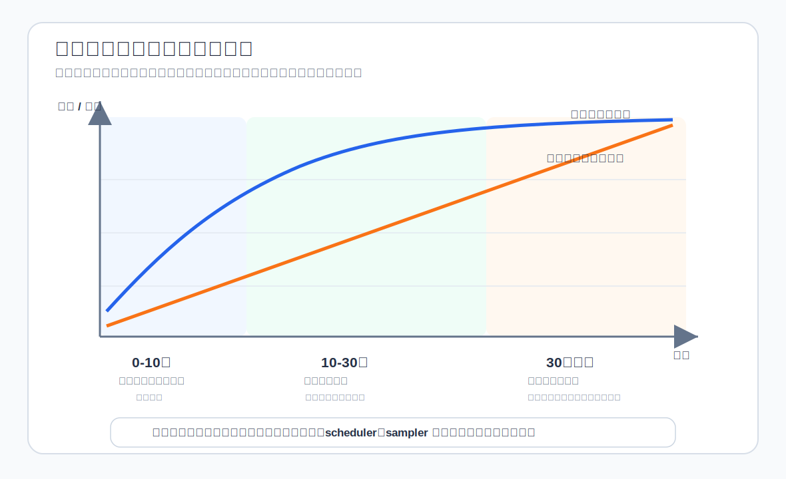

</div>


**增加采样步数本质是减小数值积分的步长，降低ODE/SDE的求解误差，但并非越多越好；不同采样器的差异源于数值积分阶数、求解方程类型、噪声注入策略和历史信息利用方式的不同，这直接决定了它们在相同步数下的细节保真度和风格偏好。**

### 1. 增加采样步数的核心影响

#### 1. 本质：数值积分误差的收敛过程

采样是求解高维概率流方程的数值积分过程：

- 步数 $N$ → 步长 $\Delta t = 1/N$
- 一阶方法（Euler）：全局误差 $O(\Delta t)$ ，误差随步数线性下降
- 二阶方法（Heun、DPM++）：全局误差 $O(\Delta t^2)$ ，误差随步数平方下降

#### 2. 三大核心影响

（1）生成质量：先快速提升，后趋于饱和

- **0-10步**：误差急剧下降，质量提升最明显，从纯噪声到可识别的语义结构
- **10-30步**：细节逐步丰富，质量稳步提升，是工业界的主流区间
- **30步以上**：很多模型已接近收益递减区间，质量提升有限，计算成本继续增加

（2）收敛性：确定性与随机采样器表现完全不同

- **确定性采样器**（Euler、Heun、DPM++ 2M、UniPC）：
  - 步数增加→结果逐渐收敛到固定值
  - 超过收敛步数后，图像不再发生明显变化
- **随机采样器**（祖先采样器、DPM++ SDE）：
  - 步数增加→不会单调收敛到同一条确定轨迹
  - 过多步数可能带来过饱和、伪影或风格漂移

（3）计算成本：线性增长

多数采样器每增加一步，就需要多执行一次或多次神经网络前向传播。整体成本大致随步数线性增长，但Heun、部分二阶/SDE方法可能每步需要2次模型评估。

#### 3. 不同采样器的常见步数区间

<div align="center">

| 采样器类型 | 常见步数区间 | 超过后的表现 |
|-----------|-------------|-------------|
| 一阶确定性（Euler） | 20-50步 | 质量缓慢提升 |
| 二阶确定性（Heun、DPM++ 2M） | 15-30步 | 基本收敛 |
| 少步专属（UniPC） | 5-25步 | 质量提升有限 |
| 祖先采样器（Euler a） | 10-20步 | 可能风格漂移或出现伪影 |
| SDE采样器（DPM++ SDE） | 10-20步 | 可能过饱和或随机细节变化 |

</div>

### 2. 相同步数下采样器差异的四大本质原因

#### 1. 数值积分阶数不同：决定同样步数下的近似误差

- **一阶方法**（Euler、Euler a、LMS）：
  - 每步仅使用当前点的梯度信息
  - 局部误差 $O(\Delta t^2)$ ，全局误差 $O(\Delta t)$
  - 相同步数下误差通常更大，细节更容易偏糊
- **二阶方法**（Heun、DPM2、DPM++ 2M）：
  - 每步使用两个点的梯度信息（预测+校正）
  - 局部误差 $O(\Delta t^3)$ ，全局误差 $O(\Delta t^2)$
  - 相同步数下通常比一阶方法更稳，边缘和纹理保留更好
- **预测-校正/可变阶方法**（UniPC）：
  - 自动调整积分阶数，结合多步历史信息
  - 少步效率较高，适合在有限步数下快速逼近较好结果

**例子**：在同一模型和调度下，20步Heun通常会比20步Euler保留更多边缘和纹理；这就是二阶方法用额外模型评估换精度的原因。

#### 2. 求解方程类型不同：风格差异的根本来源

- **ODE求解器**（所有确定性采样器）：
  - 求解概率流常微分方程
  - 固定初始噪声、提示词和配置时结果确定，风格通常更稳定
  - 细节准确但相对保守
- **SDE求解器**（祖先采样器、DPM++ SDE）：
  - 求解逆随机微分方程
  - 每步注入随机噪声，结果具有随机性
  - 风格可能更丰富，色彩和纹理变化更大，但细节稳定性相对弱

**例子**：同样15步，Euler生成的猫往往更稳定、可控；Euler a可能带来更强的风格变化，但也更容易出现结构漂移。

#### 3. 噪声注入策略不同：多样性与保真度的权衡

- **无噪声注入**（确定性采样器）：
  - 严格沿着概率流ODE的轨迹前进
  - 保真度高，多样性低
- **每步噪声注入**（祖先采样器）：
  - 每步减去预测噪声后，再添加新的高斯噪声
  - 多样性高，保真度低，不收敛
- **受控噪声注入**（DPM++ SDE）：
  - 仅在高噪声区域注入少量噪声
  - 在多样性和保真度之间折中，是常见的高质量随机采样方案之一

#### 4. 历史信息利用方式不同：收敛速度的差异

- **单步方法**（Euler、Heun）：
  - 仅使用当前步的信息
  - 收敛速度慢，需要更多步数
- **多步方法**（LMS、DPM++ 2M、UniPC）：
  - 利用前3-4步的历史信息来预测当前步的梯度
  - 收敛速度快，相同步数下精度更高

**例子**：DPM++ 2M利用前两步的信息，15步即可达到Euler 30步的收敛程度。

### 3. 相同步数下差异速记表

<div align="center">

| 差异来源 | 影响什么 | 典型表现 |
|---------|---------|---------|
| 积分阶数 | 数值误差与细节保真 | 阶数越高，通常越能在少步下保留边缘和纹理 |
| ODE/SDE类型 | 稳定性与多样性 | ODE更确定，SDE/祖先采样更随机、更有风格变化 |
| 噪声注入方式 | 多样性与保真度权衡 | 注入噪声越多，多样性越强，但结构稳定性更难保证 |
| 历史信息利用 | 收敛速度 | 多步方法利用历史梯度，常能用更少步数达到较好效果 |

</div>


<h2 id="q-019d">面试问题：在实际部署中，如何做好“速度-质量-稳定性”三目标平衡的采样策略？</h2>

**难度评分：⭐⭐⭐⭐ (4/5)  |  考察频率：⭐⭐⭐⭐ (4/5)**

<div align="center">

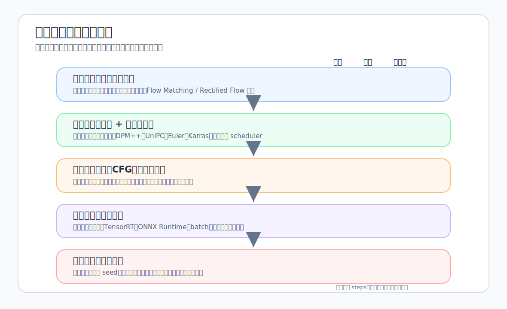

</div>


**部署中的采样策略平衡本质是"分层分级的资源分配"：先根据业务SLA选择基础模型或蒸馏模型，再选择匹配的采样器-调度器组合，最后通过工程化加速和稳定性设计降低成本。核心不是追求某个固定“最优采样器”，而是在可接受质量下找到可复现、可监控、可扩展的配置。**

### 1. 三目标的核心矛盾与优先级排序

#### 1. 三目标之间的典型张力

- **速度**：与采样步数、模型大小、计算量成反比
- **质量**：与采样步数、模型精度成正比
- **稳定性**：与采样随机性、数值误差、模型鲁棒性和工程实现有关

#### 2. 常见优先级原则

多数生产场景可以按 **稳定性 > 质量 > 速度** 排序，但创意探索或离线批量生成可以适当降低稳定性优先级，换取更强多样性或更高质量。

- 稳定性是底线：生产场景通常要求同配置可复现、异常可定位、质量可回滚
- 质量是核心：速度再快，生成结果不可用也没有意义
- 速度是优化目标：在满足前两者的前提下尽可能提升

### 2. 分层平衡策略（从基础到高级）

#### 第一层：模型选型与蒸馏（最根本的优化）

模型选型决定了采样策略的上限。经过少步训练或蒸馏的模型，可以在更少步数下保持可用质量；普通扩散模型如果直接压到极少步，往往会出现语义不稳和细节残留。

1. 基础模型选择

- **优先评估少步友好的模型**：例如经过蒸馏或采用Flow Matching/Rectified Flow路线的模型，通常更适合低步数推理
- **保留基线模型对照**：SD v1.5、SDXL等传统模型在20-30步仍有稳定价值，蒸馏模型则更适合快速预览或低延迟场景

2. 针对性蒸馏技术

<div align="center">

| 蒸馏技术 | 速度提升 | 质量损失 | 适用场景 |
|---------|---------|---------|-------------|
| **LCM蒸馏** | 明显提升 | 小到中等 | 实时预览、快速迭代 |
| **Turbo蒸馏** | 很高 | 中等 | 实时生成、移动端部署 |
| **指引蒸馏** | 中等 | 较小 | 通用高质量生成 |
| **Consistency蒸馏** | 很高 | 取决于蒸馏质量 | 极低延迟场景 |

</div>

**核心原则**：优先使用经过充分验证的蒸馏模型；自行蒸馏需要建立质量评估集，否则很容易在速度提升的同时牺牲细节、提示词遵循或风格一致性。

#### 第二层：采样器-调度器组合选择（最关键的平衡）

这是部署中最灵活、最需要根据业务调整的部分。

1. 实用组合矩阵

<div align="center">

| 业务场景 | 速度要求 | 质量要求 | 稳定性要求 | 常见组合 | 参考步数 |
|---------|---------|---------|-----------|---------|---------|
| **实时生成** | 极高 | 中等 | 高 | 蒸馏模型 + 少步采样器 | 2-8步 |
| **快速生成** | 高 | 高 | 高 | UniPC / DPM++ 2M + Karras | 8-15步 |
| **标准生成** | 中等 | 高 | 高 | DPM++ 2M + Karras | 15-25步 |
| **高质量生成** | 低 | 高 | 高 | DPM++ 2M / Heun + 模型推荐调度 | 25-40步 |
| **创意生成** | 中等 | 高 | 中等 | DPM++ SDE / Euler a + Karras | 10-20步 |

</div>

2. 需要谨慎使用的组合

- 祖先采样器（Euler a、DPM2 a）：适合创意发散，不适合作为要求严格复现的默认生产配置
- 随机SDE采样器：可通过固定种子复现，但质量波动和调参复杂度更高
- 采样器与调度器错配：容易导致质量下降、过饱和或伪影，部署前需要用固定评测集验证

3. 调度器选择

Karras调度是很多Stable Diffusion推理工作流中的强基线，尤其适合中高步数和低噪声细节修复。但实际部署仍应优先参考模型作者推荐的scheduler，并用业务数据验证：有些新模型的默认时间分布、Flow Matching时间采样或蒸馏设置，未必适合直接套用传统Karras配置。

#### 第三层：步数与参数精细化调优（局部调参）

在确定了采样器-调度器组合后，再微调步数、CFG和分辨率策略。这里的调整通常是局部收益，不能替代模型选型和采样器/scheduler选择。

1. 步数的参考区间

- **极少步**：通常需要蒸馏模型或少步训练支持，否则容易语义不稳
- **中等步数**：12-25步常是质量和速度的实用平衡区间
- **高步数**：30步以上常进入收益递减区间，是否值得取决于具体模型、分辨率和业务质量门槛

2. CFG（无分类器引导）的优化

- CFG与步数、模型训练方式和提示词复杂度相关。步数很少时，有时需要更强引导才能维持语义，但过高CFG也会放大伪影。
- 参考配置：
  - 4-6步：CFG=5-7
  - 8-12步：CFG=3-5
  - 15-20步：CFG=2-4
- 不要使用过高的CFG（>7）：会导致过饱和、伪影和色彩失真

3. 分辨率与步数的关系

- 分辨率越高，细节修复压力越大，通常需要更谨慎地调步数、CFG和高分辨率修复策略
- 例如： $512\times 512$ 可用较少步数快速预览， $1024\times 1024$ 及以上更依赖模型原生分辨率、VAE质量和后处理流程

#### 第四层：工程化加速（降低延迟与成本）

工程化加速不改变采样数学本身，但会影响吞吐、延迟和显存占用。实际收益取决于GPU、算子支持、batch大小和模型结构。

1. 推理框架优化

- **TensorRT**：在NVIDIA GPU上常有较好加速效果，但需要处理算子兼容和精度校准
- **ONNX Runtime**：跨平台兼容性较好，适合标准化部署
- **PyTorch/Eager或编译模式**：适合研发、灰度和快速迭代，生产中可根据稳定性和性能再迁移

2. 批量处理优化

- 批量生成可以显著提高GPU利用率
- 参考批量大小：根据GPU显存调整，常见为4-8
- 批量生成的单张图片速度比单张生成快2-3倍

3. 缓存优化

- 缓存文本编码器的输出：相同提示词可以重复使用，节省30%的时间
- 缓存/常驻VAE权重和中间配置：减少重复加载和初始化开销
- 预计算噪声调度：提前计算好所有时间步的噪声水平，节省推理时间

#### 第五层：稳定性保障（最基础的底线）

所有优化都必须在保障稳定性的前提下进行。

1. 确定性设计

- **默认使用确定性采样器**：Euler、Heun、DPM++ 2M、UniPC更适合作为稳定生产基线
- **固定随机种子**：相同的输入必须得到相同的输出
- **记录完整生成配置**：包括模型版本、VAE、scheduler、采样步数、CFG、分辨率、seed和后处理版本

2. 异常处理

- 设置最大生成时间：避免生成过程卡住
- 增加结果校验：过滤掉明显异常的生成结果
- 提供降级方案：当高质量生成失败时，自动降级为快速生成


<h1 id="q-024">7.扩散模型和VAE、GAN之间有哪些联系和区别？（进阶）</h1>

<h2 id="q-024a">面试问题：从似然建模角度看，Diffusion、VAE、GAN 的优化目标有何本质差异？</h2>

**难度评分：⭐⭐⭐⭐⭐ (5/5)  |  考察频率：⭐⭐⭐ (3/5)**

三者的本质差异在于对数据分布 $p_{\text{data}}(x)$ 的建模方式：**VAE通过隐变量和ELBO做变分近似显式建模**，**Diffusion通过逐步加噪/去噪做显式概率建模或score matching**，**GAN通过对抗训练做隐式分布匹配**。不同的建模方式会进一步影响不同模型的训练稳定性、样本多样性、生成质量和推理速度。

### 1. 三大模型的建模本质

#### 1. VAE：变分近似的显式概率模型

VAE基于**概率图模型**，通过引入隐变量 $z$ 将数据似然分解为：

```math
\log p(x) = \log \int p(x\mid z)\,p(z)\,dz
```

由于积分无法直接计算，VAE引入近似后验 $q_\phi(z\mid x)$ ，通过最大化**对数似然的变分下界(ELBO)**来间接优化似然：

```math
\mathcal{L}_{\text{VAE}} = \mathbb{E}_{q_\phi(z\mid x)}[\log p_\theta(x\mid z)] - \text{KL}\bigl(q_\phi(z\mid x) \parallel p(z)\bigr)
```

本质解读：

- **显式概率模型**：可以优化并估计对数似然下界（ELBO），但通常不是精确对数似然
- **变分近似**：用相对简单的后验分布近似复杂真实后验，会引入近似误差
- **双向优化**：同时优化编码器（推断 $z$ ）和解码器（生成 $x$ ）

核心缺陷：

- **后验塌缩**：KL散度正则项过强，导致隐变量 $z$ 失去信息
- **生成偏平滑**：如果重构损失以像素级MSE为主，结果容易偏平均化；现代VAE常通过感知损失、对抗损失或VQ机制缓解

#### 2. Diffusion：逐步分解的显式概率建模

Diffusion通过**马尔可夫加噪过程**将复杂的数据分布逐步推向简单高斯分布，再学习反向去噪过程：

1. **前向过程**：逐步向数据添加高斯噪声，最终得到纯噪声
2. **逆过程**：学习逐步去除噪声，从纯噪声生成数据

DDPM的完整训练目标可以写成变分下界（ELBO）的分解；在常用简化训练中，主要优化噪声预测损失：

```math
\mathcal{L}_{\text{DDPM}} = \mathbb{E}_{t,x_0,\epsilon} \left\| \epsilon - \epsilon_\theta(x_t, t) \right\|_2^2
```

本质解读：

- **显式概率建模**：可以优化ELBO，并在特定设置下估计似然；常用简化损失更偏向score matching/去噪回归
- **逐步分解**：将复杂的高维分布建模转化为许多简单的单步去噪任务
- **单向优化**：只需要优化一个去噪网络，不需要编码器

核心优势：

- **训练较稳定**：常用去噪/噪声预测目标接近回归任务，没有GAN式博弈不稳定问题
- **模式覆盖较好**：相比GAN更不容易出现严重模式崩溃，样本多样性通常更稳定

#### 3. GAN：隐式分布匹配

GAN不直接写出数据似然 $p(x)$ ，而是通过**生成器 $G$ 和判别器 $D$ 的极小极大博弈**来学习数据分布：

```math
\min_G \max_D\ \mathbb{E}_{x\sim p_{\text{data}}}[\log D(x)] + \mathbb{E}_{z\sim p(z)}[\log(1 - D(G(z)))]
```

本质解读：

- **隐式似然**：无法写出 $p_G(x)$ 的显式表达式，也无法计算数据的对数似然，只能通过采样得到样本
- **分布匹配**：通过最小化生成分布与真实分布之间的散度（原始GAN是JS散度）来学习分布
- **对抗优化**：生成器和判别器相互博弈，共同提升

核心缺陷：

- **训练不稳定**：极小极大博弈难以平衡，容易出现梯度消失或爆炸
- **模式崩溃**：生成器容易只学习到数据分布的少数模式，生成结果缺乏多样性

### 2. 核心对比表

<div align="center">

| 维度 | VAE | Diffusion | GAN |
|------|-----|-----------|-----|
| **似然类型** | 变分近似显式似然 | 显式概率建模/score matching | 隐式分布匹配 |
| **优化目标** | 最大化ELBO下界 | 优化ELBO或去噪/score目标 | 最小化分布差异 |
| **数学本质** | 变分推断 | 马尔可夫链逆过程 | 极小极大博弈 |
| **训练稳定性** | 通常稳定 | 通常稳定 | 相对不稳定 |
| **模式覆盖** | 较好 | 通常较好 | 可能模式崩溃 |
| **生成质量** | 一般（偏模糊） | 高 | 高（偏锐利，但可能失真） |
| **对数似然可计算** | 可估计下界 | 可估计ELBO/似然，简化训练不直接给精确似然 | 通常不可计算 |
| **代表模型** | VAE、VQ-VAE | DDPM、SD、Flux | GAN、StyleGAN |

</div>

### 3. 深层本质差异

#### 1. 对"生成"的理解不同

- **VAE**：生成是"从隐变量解码"的过程，核心是学习数据的压缩表示
- **Diffusion**：生成是"逐步去噪"的过程，核心是学习数据分布的梯度场
- **GAN**：生成是"欺骗判别器"的过程，核心是学习数据分布的边界

#### 2. 误差来源不同

- **VAE**：误差主要来自**变分近似**（用简单分布近似复杂后验）
- **Diffusion**：误差主要来自**数值积分**（采样时的ODE/SDE求解误差）
- **GAN**：误差主要来自**博弈不平衡**（生成器和判别器的能力不匹配）


<h2 id="q-024b">面试问题：在工业落地中，何时优先选择 Diffusion，何时选择 GAN 或 VAE？</h2>

**难度评分：⭐⭐⭐⭐ (4/5)  |  考察频率：⭐⭐⭐⭐ (4/5)**

核心结论：**没有一个绝对的“更好”，三者是不同技术路线的产物，各有优劣。选择哪一个取决于业务对质量、速度、成本、可控性和稳定性的优先级。**

**三者的选型本质是根据业务对"生成质量、推理速度、训练成本、可控性、多样性"五个核心指标的优先级排序：Diffusion更适合高质量、高可控性场景；GAN更适合实时性要求高、任务边界清晰的场景；VAE更适合资源受限、压缩重建或需要连续隐空间表示的场景。**

### 1. 三大模型的核心工业特性与适用场景

#### 1. 优先选择Diffusion的场景（高质量可控生成）

工程优势

- **生成质量上限高**：细节丰富、纹理自然，是当前高质量文生图/图像编辑的重要路线
- **可控性强**：支持文本引导、图像引导、条件控制、局部编辑等多种控制方式
- **生态成熟**：围绕文生图、图像编辑、视频生成、3D生成等任务已经形成丰富的模型和工具链

更适合场景

- **文生图/文生视频**：许多主流高质量生成系统采用Diffusion、Flow Matching或相关连续生成模型路线
- **图像编辑与修复**：Inpainting、Outpainting、风格迁移、背景替换
- **高精度内容生成**：电商产品图、广告素材、数字人、3D资产生成
- **多模态生成**：文本到音频、文本到3D、多模态理解与生成

典型落地方向

- 文生图和图片编辑产品
- 文生视频和视频编辑工具
- 广告、电商、游戏美术、数字人等内容生产流程

不适合的场景

- 要求单步实时生成（<100ms）且无法接受蒸馏质量损失
- 极端资源受限设备（如MCU、低端嵌入式设备）
- 仅需要简单的特征提取或压缩任务

#### 2. 优先选择GAN的场景（实时与特定领域生成）

核心优势

- **推理速度快**：通常单步生成，延迟低于未蒸馏的多步Diffusion
- **生成结果锐利**：边缘清晰、对比度高，适合人脸、文字等精细结构生成
- **模型可做得较轻量**：在任务边界清晰的数据域中，GAN可以用较小模型获得不错效果

更适合场景

- **实时生成与渲染**：游戏内AI生成、实时视频通话美颜、AR/VR内容生成
- **边缘设备部署**：手机端、嵌入式设备上的离线生成任务
- **高帧率视频生成**：需要30fps以上的实时视频生成
- **特定领域的高精度生成**：人脸生成（StyleGAN）、文字生成、医学图像生成

典型落地方向

- 人脸生成与编辑
- 实时美颜、换脸、视频增强
- 游戏、AR/VR和边缘端的窄域实时生成

不适合的场景

- 需要多样化生成结果（GAN易模式崩溃）
- 需要复杂的文本引导或条件控制
- 大规模通用生成任务（训练成本高、泛化能力差）

#### 3. 优先选择VAE的场景（压缩、重建与表示学习）

核心优势

- **轻量高效**：训练和推理成本低，适合压缩和重建任务
- **有明确的连续隐空间**：支持隐空间插值、编辑、特征提取
- **天生支持压缩与重建**：可以同时完成生成和压缩任务

更适合场景

- **图像/视频压缩**：VAE/VQ-VAE类模型常作为神经压缩和生成模型前端
- **异常检测**：利用重建误差检测异常，广泛应用于工业质检、医疗诊断
- **特征提取与表示学习**：作为其他模型的前置编码器
- **轻量级生成任务**：对质量要求不高，但对速度和资源要求极高的场景
- **混合模型的基础组件**：许多Latent Diffusion模型会使用VAE或类似自编码器作为编码器和解码器

典型落地方向

- Latent Diffusion中的图像潜空间压缩
- 神经压缩和特征表示学习
- 工业视觉、医疗影像中的重建式异常检测

不适合的场景

- 需要高质量、高细节的生成结果（VAE生成结果偏模糊）
- 需要复杂的条件控制
- 需要多样化的生成结果

### 2. 三者核心工业特性对比表

<div align="center">

| 维度 | Diffusion | GAN | VAE |
|------|-----------|-----|-----|
| **生成质量** | 高，上限强 | 锐利，但可能失真 | 常偏平滑 |
| **训练稳定性** | 通常稳定 | 相对困难 | 通常稳定 |
| **推理速度** | 原始多步较慢，可蒸馏加速 | 快 | 快 |
| **可控性** | 强，条件控制生态成熟 | 依赖任务设计 | 中等，适合隐空间操作 |
| **模式覆盖** | 通常较好 | 可能模式崩溃 | 较好 |
| **资源消耗** | 较高 | 中等 | 较低 |
| **泛化能力** | 强，适合通用生成 | 更适合窄域 | 中等 |
| **训练成本** | 高 | 中等到高 | 较低 |

</div>

**未来展望**：随着Flow Matching、Consistency Model和各类蒸馏方法的发展，Diffusion相关路线正在缓解推理速度慢的问题；GAN在实时窄域生成中仍有价值，VAE则会继续作为压缩、表示学习和Latent Diffusion前端组件存在。


<h1 id="q-025">8.Stable Diffusion、Latent Diffusion以及Pixel Diffusion之间有哪些区别?</h1>

<h2 id="q-025a">面试问题：Latent Diffusion与Pixel Diffusion有哪些区别？为什么Latent Diffusion能显著降低训练与推理成本？代价是什么？</h2>

**难度评分：⭐⭐⭐⭐ (4/5)  |  考察频率：⭐⭐⭐⭐⭐ (5/5)**

**Latent Diffusion（LDM）与Pixel Diffusion的本质区别是工作空间不同：Pixel Diffusion直接在高维像素空间扩散，而Latent Diffusion先用预训练自编码器把图像压到低维潜空间（Latent Space），再在潜空间中扩散。这样可以显著降低训练和推理成本，代价是引入自编码器的压缩与重建误差。**

<div align="center">

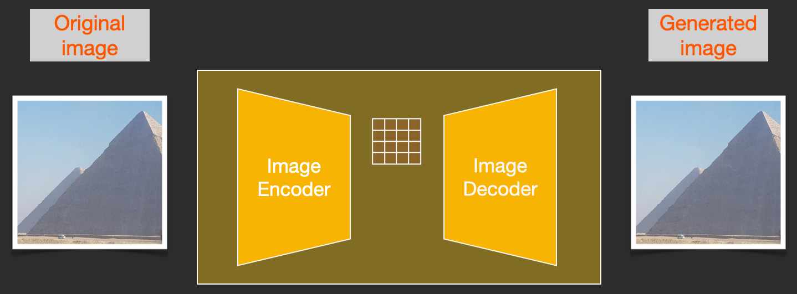

</div>


### 1. 核心区别对比表

<div align="center">

| 维度 | Pixel Diffusion | Latent Diffusion |
|------|-----------------------------|-------------------------------|
| **工作空间** | 原始RGB像素空间（ $H \times W \times 3$ ） | 自编码器学习的隐空间（ $(H/f) \times (W/f) \times c$ ） |
| **常见压缩率 $f$** | 1（无压缩） | 4 或 8，取决于自编码器设计 |
| **计算复杂度** | 卷积成本约随像素数增长，注意力成本可随token数平方增长 | 空间token减少到约 $1/f^2$ ，注意力成本可降到约 $1/f^4$ |
| **学习内容** | 同时学习像素细节和语义结构 | 主要学习潜空间分布，部分感知细节由自编码器处理 |
| **架构设计** | 单阶段U-Net/DiT/Transformer | 两阶段：预训练自编码器 + 隐空间U-Net/DiT/Transformer |
| **高分辨率支持** | 成本高，分辨率上升时显存和计算压力很大 | 更适合高分辨率生成，成本显著低于像素空间扩散 |
| **训练扩展性** | 高分辨率下显存和计算压力更大 | 工程上更容易扩展到高分辨率，但仍依赖自编码器质量 |
| **代表模型** | 原始DDPM/DDIM、DALL-E、Imagen等 | Stable Diffusion、FLUX、Seedream等 |

</div>

### 2. LDM显著降低成本的三大本质原因

#### 1. 维度爆炸问题的根本性缓解

Pixel Diffusion直接处理 $H\times W$ 个空间位置，这是像素扩散成本高昂的根本原因：

- 以 $f=4$ 为例，潜空间的token数约为像素空间的 $1/16$
- 以 $f=8$ 为例，潜空间的token数约为像素空间的 $1/64$

#### 2. 感知压缩与语义压缩的科学分离（LDM最核心的创新洞察）

LDM的关键洞察是：图像中有大量像素级高频变化并不都对语义生成同等重要。先用自编码器做感知压缩，可以把“看起来相似”的图像映射到更紧凑的潜表示中。

- Pixel Diffusion需要同时学习语义结构和像素级细节，任务更重
- LDM先用预训练自编码器完成感知压缩，弱化部分人眼不敏感的高频变化
- 扩散模型主要在语义更集中的低维空间学习数据分布，效率大幅提升

#### 3. 第一阶段自编码器的可复用性

- 自编码器训练完成后，可以复用于同一数据模态和相近分辨率/分布下的多个扩散任务
- 文生图、图生图、图像编辑等任务可以共享同类自编码器设计
- 这极大降低了多任务开发的成本，是LDM扩散模型能够大规模工业应用的关键

### 3. LDM的固有代价与局限性

#### 1. 重建误差瓶颈（最核心的代价）

- 生成质量的上限会受到自编码器重建能力限制，而不只取决于扩散模型本身
- 自编码器可能丢失部分精细细节，特别是文字、细线和复杂纹理
- 压缩率过高时，重建误差会明显增大，生成质量也会受影响
- 这也是早期LDM类模型生成文字和细线结构较困难的重要原因之一

#### 2. 隐空间分布偏移问题

自编码器的训练数据分布与扩散模型的生成数据分布可能不一致，这会导致扩散模型采样时生成的隐向量超出自编码器的分布范围，具体表现为生成图像出现伪影、色彩失真或结构错误。

#### 3. 对像素级精度任务的天然限制

对于需要亚像素级精度的任务（如医学图像分析、工业缺陷检测），自编码器的压缩过程会丢失关键的细节信息，这类任务仍然需要使用Pixel Diffusion或其他专用方法。


<h2 id="q-025b">面试问题：Pixel Diffusion 在哪些任务上仍有优势？</h2>

**难度评分：⭐⭐⭐⭐ (4/5)  |  考察频率：⭐⭐⭐ (3/5)**

**Pixel Diffusion的优势源于其"无自编码器压缩、无重建误差"的原生特性。对于像素级精度、数值准确性、细节保真度要求很高，或者数据模态暂时缺少高质量自编码器的任务，Pixel Diffusion仍然有重要价值。**

### 1. 五类更适合Pixel Diffusion的任务

#### 1. 像素级精度要求很高的任务（核心优势）

Latent Diffusion的自编码器可能丢失**亚像素级细节、高频纹理和精确边缘信息**，而Pixel Diffusion直接在原始像素空间操作，不会额外引入自编码器重建误差。

典型任务：
- **医学图像生成与分析**
  - 病理切片生成、CT/MRI图像合成、医学影像增强
  - 要求：尽量精确保留细胞形态、病灶边界和组织结构
  - 例子：医学图像分割、重建和增强任务中，像素空间扩散常用于避免压缩损伤关键细节

- **工业缺陷检测与生成**
  - 微小划痕、裂纹、色差等缺陷的生成与检测
  - 要求：缺陷的大小、形状、位置需要接近像素级精度
  - 自编码器的压缩会模糊微小缺陷，导致检测模型失效

- **文字与精细图形生成**
  - 条形码、二维码、工程图纸、电路图生成
  - 要求：线条连续、文字清晰可辨
  - 这类任务对自编码器重建质量非常敏感，早期Latent Diffusion类模型在文字和细线结构上经常表现不稳

#### 2. 科学计算与物理模拟任务

科学计算通常要求**数值准确性和物理一致性**，而自编码器的压缩过程可能引入额外数值误差，使物理约束更难直接施加。

典型任务：
- **流体动力学模拟**：气流、水流、火焰、烟雾的生成
- **分子动力学模拟**：蛋白质结构预测、分子构象生成
- **气候与天气模拟**：降水、温度、风场的预测与生成
- **材料科学模拟**：晶体结构、材料缺陷的生成

关键优势：
Pixel Diffusion可以更直接地在原始物理量或网格上施加约束；而LDM的隐空间未必有明确物理意义，需要额外设计才能保证约束传递到解码后的结果。

#### 3. 低分辨率小尺寸生成任务

当图像分辨率较低时，Latent Diffusion的压缩收益会变小，而Pixel Diffusion实现更简单，也没有重建误差。

典型任务：
- **头像生成**：64×64、128×128分辨率的人脸、动漫头像
- **图标生成**：32×32、64×64分辨率的应用图标、符号
- **缩略图生成**：网站缩略图、商品缩略图

直观理解：
如果原始图像本来只有 $64\times 64$ 或 $128\times 128$ ，再压到潜空间后节省的算力有限，反而可能因为自编码器损失细节。

#### 4. 理论研究与基础算法开发

Pixel Diffusion没有自编码器引入的额外变量和重建误差，更适合作为研究扩散模型基本性质的简洁平台。

典型应用：
- **新采样算法的验证**：许多采样器会先在标准像素空间基准上验证，再迁移到LDM
- **新训练目标的研究**：Score Matching、Flow Matching、Consistency Model等理论常用像素空间或简化数据集作为分析平台
- **模型架构的探索**：UNet改进、注意力机制优化等基础研究通常先在像素扩散上进行
- **基准对比**：学术论文中通常使用像素扩散作为基准模型，以排除自编码器的影响

#### 5. 特殊数据模态的生成

对于某些非图像数据模态，如果暂时缺少高质量自编码器，直接在原始表示上做扩散会更直接。

典型任务：
- **音频生成**：语音、音乐、环境音的生成
- **点云生成**：3D点云、三维模型的生成
- **视频生成**：早期的视频扩散模型大多是像素级的
- **多光谱图像生成**：红外、紫外、雷达等多光谱数据的生成

### 2. 核心对比表

<div align="center">

| 任务类型 | Pixel Diffusion优势 | Latent Diffusion潜在劣势 | 代表方向 |
|---------|---------------------|-----------------------|---------|
| 医学图像生成 | 保留病灶和组织结构细节 | 自编码器可能模糊医学细节 | 医学扩散重建/分割 |
| 工业缺陷检测 | 生成和检测微小缺陷 | 压缩可能导致缺陷丢失 | 缺陷生成与增强 |
| 物理模拟 | 便于直接施加物理约束 | 隐空间约束传递困难 | 科学机器学习 |
| 低分辨率生成 | 实现简单、无重建误差 | 压缩收益有限 | 低分辨率基准 |
| 算法研究 | 简洁、无自编码器误差 | 自编码器可能干扰分析 | DDPM、Score-based |
| 特殊模态生成 | 直接处理原始表示 | 需要额外训练专用自编码器 | DiffWave |

</div>


<h2 id="q-025d">面试问题：从信息压缩角度看，VAE 潜空间会如何影响最终可生成细节上限？</h2>

**难度评分：⭐⭐⭐⭐⭐ (5/5)  |  考察频率：⭐⭐⭐ (3/5)**

**从信息压缩角度看，VAE本质上是一个感知有损压缩器。潜空间的信息容量、压缩率和解码器能力，会限制Latent Diffusion最终能够表达的细节范围。扩散模型负责在潜空间中生成合理的 latent特征，但最终图像仍要经过VAE解码；如果某类细节在编码阶段产生压缩损失，后续扩散模型就很难稳定恢复。**

### 1. 核心理论基础：率失真权衡

VAE的压缩过程可以用信息论中的**率失真理论**来理解：

- **率（ $R$ ）**：潜空间能够承载的最大信息量，单位为比特
- **失真（ $D$ ）**：重建图像与原始图像之间的感知差异
- **率失真权衡**：压缩率越高，潜空间越省算力，但重建失真通常越大

这意味着：潜空间不是越小越好。压缩率提高会降低扩散模型成本，但也会增加文字、细线、纹理、微小结构等信息丢失的风险。

### 2. 影响细节上限的四大关键因素

#### 1. 潜空间维度与压缩率（最核心因素）

压缩率 $f$ 定义为原始图像尺寸与潜空间尺寸的比值：

```math
f = \frac{H}{h} = \frac{W}{w}
```

潜空间的总信息容量可以粗略理解为：

```math
C = h \times w \times c \times b
```

其中 $c$ 是潜空间通道数， $b$ 是每个维度的平均比特数。

- **压缩率越高，潜空间越小**： $f=8$ 的空间token数约为 $f=4$ 的1/4，计算更省，但细节承载压力更大
- **压缩率越低，细节保留越好**：但扩散模型部分的训练和推理成本会上升
- **实际选择要折中**：常见LDM会在 $f=4$ 或 $f=8$ 一类配置中权衡细节、成本和训练稳定性

#### 2. KL散度正则项强度

KL散度项迫使潜空间分布接近标准正态分布，本质是一种**信息正则化机制**：

```math
\mathcal{L}_{\text{KL}} = \text{KL}\bigl(q(z\mid x) \parallel p(z)\bigr)
```

- KL权重越大，对潜空间的约束越强，VAE会丢弃越多"不重要"的信息
- 当KL权重过大时，可能出现**后验塌缩**，潜空间承载的信息显著减少，生成结果质量下降
- 实际LDM的自编码器通常会使用较弱的KL正则或VQ/感知约束，在潜空间可建模性与重建质量之间折中

#### 3. 自编码器的模型容量

解码器的能力决定了它能从潜空间中恢复多少细节：

- 解码器参数量不足时，即使潜空间有足够的信息，也无法重建出精细的纹理和边缘
- 现代VAE普遍使用残差块和注意力层来提升解码器容量
- 新一代模型通常会改进自编码器容量、训练数据和损失设计，以提升文字、边缘和纹理重建能力

#### 4. 训练目标与损失函数

VAE的训练目标直接决定了它会优先保留哪些信息：

- **MSE损失**：倾向于生成平均化的平滑图像，容易削弱高频细节
- **感知损失**：基于感知特征，优先保留对人类感知重要的语义信息
- **对抗损失**：提升图像的真实感，使重建结果更锐利

现代VAE通常使用**感知损失+对抗损失**的组合，这会让VAE优先保留语义信息，而丢弃人眼不敏感的高频噪声。

### 3. VAE信息瓶颈的本质

扩散模型的作用是在潜空间中采样出符合数据分布的向量，但它不能稳定生成解码器无法表达的信息。可以这样理解：

- 如果VAE在压缩过程中经常丢失文字的笔画信息，那么扩散模型就很难稳定生成清晰文字
- 如果VAE削弱了皮肤的毛孔纹理信息，那么生成的人脸细节可能偏平滑
- 如果VAE削弱了金属的反光细节，那么生成的金属质感可能不够真实

这也是为什么改进自编码器常常能提升Latent Diffusion的文字、线条和细节表现：问题不一定只在扩散模型部分或文本编码器，也可能来自VAE的信息瓶颈。

### 4. 压缩率、细节与计算成本的关系

<div align="center">

| 设计选择 | 潜空间容量 | 计算成本 | 细节保留 | 适用场景 |
|----------|-------------|---------|---------|---------|
| 低压缩率（如 $f=2/4$ ） | 高 | 高 | 更好 | 高细节、高分辨率、文字线条敏感任务 |
| 中等压缩率（如 $f=4/8$ ） | 中等 | 中等 | 成本与质量较均衡 | 通用文生图、图像编辑 |
| 高压缩率（如 $f\geq 16$ ） | 低 | 低 | 更容易丢细节 | 快速预览、低成本生成、对细节不敏感任务 |

</div>


<h2 id="q-027">面试问题：Stable Diffusion与Latent Diffusion有哪些区别？</h2>

**难度评分：⭐⭐⭐ (3/5)  |  考察频率：⭐⭐⭐⭐⭐ (5/5)**

这里需要先澄清：**Latent Diffusion** 是一种“在潜空间做扩散”的通用框架；**Stable Diffusion** 是这一框架在开放文生图场景中的代表性模型家族。

**二者不是完全并列的两个算法，前者更像方法论，后者更像具体模型实现。**

<div align="center">

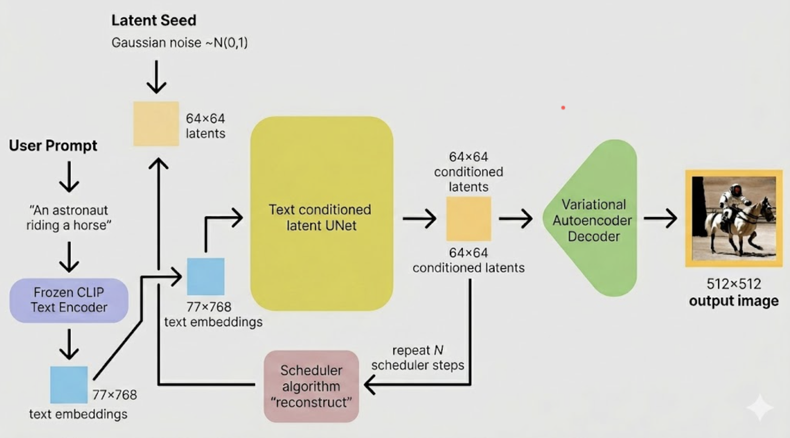

</div>


若把Stable Diffusion与Latent Diffusion原论文中的文生图基准模型相比，差异主要体现在以下三个维度：

1.  **训练数据集的迭代升级**

    Latent Diffusion原论文中的文生图实验主要基于较早期、较小规模的图文数据集完成训练；Stable Diffusion则使用了规模更大的LAION系列图文数据，并配合数据清洗、分辨率过滤、美学评分等筛选策略来提升训练样本质量。这里的关键不是某个固定数据集名字，而是**数据规模、数据质量和筛选策略都更工程化**。

2.  **文本编码器的方案优化**

    Latent Diffusion原论文中的文本条件编码方案相对早期；Stable Diffusion v1系列则采用预训练CLIP文本编码器作为文本特征提取模块。相较于从零开始训练或较弱的文本编码方案，在大规模图文配对数据上完成预训练的文本编码器，通常具备更强的文本语义理解和图文对齐能力。

3.  **训练分辨率与策略的优化**

    Latent Diffusion原论文中的文生图基准更偏研究验证；Stable Diffusion更强调可用的开放文生图生成能力，采用分阶段训练和更高分辨率微调等工程策略，以适配 $512\times 512$ 及后续更高分辨率的生成需求。

综上，Stable Diffusion可以理解为Latent Diffusion框架的一次工程化放大：更强的文本编码器、更大规模的数据、更系统的数据筛选和更面向实际生成的训练策略，共同提升了文生图质量和可用性。

需要特别说明的是，从技术架构本质来看，Stable Diffusion本身也归属于Latent Diffusion架构体系。


---
<h1 id="ch-02">第二章 Stable Diffusion 系列核心高频考点</h1>

<h1 id="q-028">1.介绍一下Stable Diffusion的原理</h1>

<h2 id="q-029">面试问题：Stable-Diffusion相比经典Diffusion的核心优化是什么？</h2>

Rocky认为我们可以将Latent Diffusion Models（LDM）当作是一个开创性的通用算法模型框架，而Stable Diffusion是在此框架基础上，通过一系列工程技术优化后形成的、在开源社区大规模落地应用的成熟算法技术即产品的模型产品。

Stable Diffusion对原始LDM框架的具体改进主要体现在以下几个方面：

**工程化与稳定性优化**

1. 训练稳定性：通过改进噪声调度、梯度裁剪等训练技巧，减少了训练过程中出现模式崩溃或不稳定的风险，使模型更容易在大规模数据集上收敛。
2. 推理速度：在继承潜在空间高效性的基础上，持续优化去噪采样器的效率，并出现了像DeepCache、ToMe-SD、Xformer等专为SD设计的加速技术，进一步提升生成速度。

**模型架构与能力的增强**

1. 条件控制：虽然LDM框架能够支持文本条件作为输入，但编码文本信息的部分是一个随机初始化的Transformer模型；而Stable Diffusion通过一个预训练好的CLIP Text Encoder来编码文本信息，预训练过的模型往往要优于从零开始训练的模型，这个优化极大地提升了文本到图像的生成能力和语义遵循度。后续更衍生出LoRA、ControlNet等辅助模型，实现了对生成内容（如构图、姿态）的精细控制。
2. 生成质量与分辨率：通过在更大规模高质量数据上训练（Latent Diffusion Model是采用laion-400M数据训练的，而Stable Diffusion是在laion-2B-en数据集上训练的），同时Stable Diffusion的训练分辨率也更大（Latent Diffusion Model只是在256x256分辨率上训练，而Stable Diffusion先在256x256分辨率上预训练，然后再在512x512分辨率上进行微调训练），以及架构的持续迭代（如SDXL、SD3、FLUX.1、FLUX.2等），在图像细节、光影和分辨率上不断突破。

**开源生态与易用性**

这是Stable Diffusion产生巨大影响的关键。其开源策略催生了如ComfyUI、AUTOMATIC1111 WebUI等图形化界面工具，让普通用户也能轻松使用。庞大的开源社区贡献了海量的定制化模型、风格LoRA和实用AI绘画插件，使其从一个模型演变成一个功能极其丰富的AIGC图像创作生态系统。

简单来说，两者的关系可以概括为：Latent Diffusion Models (LDM) 是奠定核心思想的“论文”与“蓝图”；而Stable Diffusion (SD) 则是基于这张蓝图建造出的、不断升级的“摩天大楼”及围绕它形成的“繁荣城市”。


<h2 id="q-030">面试问题：介绍一下Stable Diffusion的训练/推理过程（正向扩散过程和反向去噪过程）</h2>


<h2 id="q-031">面试问题：Stable Diffusion每一轮训练样本是选择一个随机时间步长吗？</h2>


<h2 id="q-032">面试问题：在Stable Diffusion 1.5的经典失败案例中，生成图像中的猫出现头部缺失的问题的本质原因及优化方案？</h2>

我们可以使用长宽比分桶训练策略（AspectRatioBucketing）进行优化。

目前AI绘画开源社区中很多的LoRA模型和Stable Diffusion模型都是基于**单一图像分辨率**（比如1:1）进行训练的，这就导致当我们想要**生成不同尺寸分辨率的图像**（比如1:2、3:4、4:3、9:16、16:9等）时，**非常容易生成结构崩坏的图像内容**。
如下图所示，**为了让所有的数据满足特定的训练分辨率，会进行中心裁剪和随机裁剪等操作，这就导致图像中人物的重要特征缺失**：

<div align="center"></div>

这上面这种情况下，我们训练的LoRA模型和Stable Diffusion模型在生成骑士图像的时候，就会出现缺失的骑士特征。

与此同时，**裁剪后的图像还会导致图像内容与标签内容的不匹配**，比如原本描述图像的标签中含有“皇冠”，但是显然裁剪后的图像中已经不包含皇冠的内容了。

长宽比分桶训练策略（Aspect Ratio Bucketing）就是为了解决上面的问题孕育而生。**长宽比分桶训练策略的本质是多分辨率训练**，就是在LoRA模型的训练过程中采用多分辨率而不是单一分辨率，多分辨率训练技术在传统深度学习时代的目标检测、图像分割、图像分类等领域非常有效，在AIGC时代终于有了新的内涵，在AI绘画领域重新繁荣。


#### 长宽比分桶训练策略（AspectRatioBucketing）的具体流程

**AI绘画领域中的长宽比分桶训练策略主要通过数据分桶+多分辨率训练两者结合来实现**。我们设计多个存储桶（Bucket），每个存储桶代表不同的分辨率（比如512x512、768x768、1024x1024等），并将数据存入对应的桶中。在Stable Diffusion模型和LoRA模型训练时，随机选择一个桶，从中采样Batch大小的数据用于多分辨率训练。下面Rocky详细介绍一下完整的流程。

我们先介绍如何对训练数据进行分桶，这里包含**存储桶设计**和**数据存储**两个部分。

首先我们需要设置存储桶（Bucket）的数量和每个存储桶代表的分辨率。我们定义最大的整体图像像素为1024x1024，最大的单边分辨率为1024。

这时我们以64像素为标准，设置长度为1024不变，宽度以1024为起点，根据数据集中的最小宽度设计存储桶（假设为512），具体流程如下所示：

```
设置长度为 1024，设置宽度为 1024
设置桶数量为 0
当宽度大于数据集最小宽度 512 时:
    宽度 = 宽度 - 64 （ 960 ）
    那么 （ 960 ， 1024 ）作为一个存储桶的分辨率
    以此类推设计出长度不变，宽度持续自适应的存储桶
```

按照上面的流程，我们可以获得如下的存储桶：

```
bucket 0 (512, 1024)
bucket 1 (576, 1024)
bucket 2 (640, 1024)
bucket 3 (704, 1024)
bucket 4 (768, 1024)
bucket 5 (832, 1024)
bucket 6 (896, 1024)
bucket 7 (960, 1024)
```

接着我们再以64像素为标准，设置宽度为1024不变，长度以1024为起点，根据数据集中的最小长度设计存储桶（假设为512），按照上面相同的规则，设计对应的存储桶：

```
bucket 8 (1024, 512)
bucket 9 (1024, 576)
bucket 10 (1024, 640)
bucket 11 (1024, 704)
bucket 12 (1024, 768)
bucket 13 (1024, 832)
bucket 14 (1024, 896)
bucket 15 (1024, 960)
```

最后我们再将1024x1024分辨率作为一个存储桶添加到分桶列表中，从而获得完整的分桶列表：

```
bucket 0 (512, 1024)
bucket 1 (576, 1024)
bucket 2 (640, 1024)
bucket 3 (704, 1024)
bucket 4 (768, 1024)
bucket 5 (832, 1024)
bucket 6 (896, 1024)
bucket 7 (960, 1024)
bucket 8 (1024, 512)
bucket 9 (1024, 576)
bucket 10 (1024, 640)
bucket 11 (1024, 704)
bucket 12 (1024, 768)
bucket 13 (1024, 832)
bucket 14 (1024, 896)
bucket 15 (1024, 960)
bucket 16 (1024, 1024)
```

完成了分桶的数量与分辨率设计，我们接下来要做的是**将数据集中的图片存储到对应的存储桶中**。

那么，具体是如何将不同分辨率的图片放入对应的桶中呢？

我们首先计算存储桶分辨率的长宽比，对于数据集中的每个图像，我们也计算其长宽比。这时我们将长宽比最接近的数据与存储桶进行匹配，并将图像存入对应的存储桶中，下面的计算过程代表寻找与数据长宽比最接近的存储桶：

```math
\text{image-bucket} = \arg\min \bigl( \lvert \text{bucket-aspects} - \text{image-aspect} \rvert \bigr)
```

**如果图像的长宽比与最匹配的存储桶的长宽比差异依然非常大，则从数据集中删除该图像。所以我们最好在数据分桶前将数据进行精细化筛选，增加数据的利用率。**

当image_aspect与bucket_aspects完全一致时，可以直接将图片放入对应的存储桶中；当image_aspect与bucket_aspects不一致时，需要对图片进行中心裁剪，获得与存储桶一致的长宽比，再放入存储桶中。中心裁剪的过程如下图所示：

<div align="center"></div>

由于我们以经做了精细化的存储桶设计，所以**出现长宽比不匹配时的图像裁剪比例一般小于0.033，只去除了小于32像素的实际图像内容，所以对训练影响不大**。

在完成数据的分桶存储后，**接下来Rocky再讲解一下在训练过程中如何基于存储桶实现多分辨率训练过程**。

在Stable Diffusion模型和LoRA模型的训练过程中，我们需要从刚才设计的16个存储桶中**随机采样一个存储桶**，并且**确保每次能够提供一个完整的Batch数据**。当遇到选择的存储桶中数据数量不够Batch大小的情况，需要进行**特定的数据补充策略**。

为了解决上述的问题，我们需要维护一个**公共桶**（remaining bucket），其他存储桶中的数据量不足Batch大小时，将剩余的数据全部放到这个公共桶中。在每次迭代的时候，如果是从常规存储桶中取出数据，则训练分辨率调整成存储桶对应的分辨率。如果是从公共桶中取出，则训练分辨率调整成设计分桶时的基础分辨率，也就是1024x1024。

**同时我们将所有的存储桶根据桶中数据量进行权重设置，具体的权重计算方式为这个存储桶的数据量除以所有剩余存储桶的数据量总和**。如果不通过权重来选择存储存储桶，数据量小的存储桶会在训练过程的早期就被用完，而数据量最大的存储桶会在训练结束时仍然存在，**这就会导致存储桶在整个训练周期中采样不均衡问题**。通过按数据量加权选择桶可以避免这种情况。

<h2 id="q-033">面试问题：介绍一下针对Stable Diffusion的模型融合技术</h2>

Stable Diffusion的模型融合主要通过 **Merge Block Weight（块权重融合）** 这种精细化的模型参数整合技术实现，通过分层处理U-Net/Transformer内部不同功能模块层的权重，实现多个Stable Diffusion模型特点优势的定向组合。

#### 一、核心原理：分层权重插值

模型融合的目标是合并多个训练好的Stable Diffusion模型（如风格模型+主体模型），生成兼具各方优势的新模型。Merge Block Weight的核心创新在于**分块处理U-Net/Transformer结构**，而非整体融合：

**1. U-Net结构解构**

Stable Diffusion的U-Net包含多个功能模块：

- **ResBlock**：负责基础特征提取与残差连接
- **Spatial Transformer（Cross-Attention）**：融合文本与图像语义
- **DownSample/UpSample**：控制特征图分辨率变换

**2. 分块独立融合**

对每个模块的权重独立计算插值，公式为：

```math
W_{\text{merged}}^{(i)} = \alpha \cdot W_A^{(i)} + (1 - \alpha) \cdot W_B^{(i)}
```

其中 $W_A^{(i)}$ 和 $W_B^{(i)}$ 是待融合模型在模块 $i$ 的权重， $\alpha$ 为该模块的融合系数（0~1）。

#### 二、技术实现流程

##### 1. 权重归一化（关键预处理）

- 目的：解决不同模型参数分布差异导致的融合冲突
- 方法：对每个模型的权重进行LayerNorm或Min-Max缩放，使其处于相近数值范围

##### 2. 插值算法选择

<div align="center">

| **算法** | 适用场景 | 优势 | 缺点 |
|----------|----------|------|------|
| **线性插值（LERP）** | 简单融合、硬件资源有限 | 计算效率高 | 可能丢失非线性特征 |
| **球面线性插值（SLERP）** | 高质量风格融合（如艺术风格） | 保持权重向量方向一致性，避免特征坍缩 | 计算复杂度高 |

</div>

##### 3. 分层系数配置

不同模块需设置差异化融合系数，例如：

- **ResBlock**： $\alpha=0.5$ （平衡底层特征）
- **Spatial Transformer**： $\alpha=0.8$ （侧重模型A的文本控制力）
- **UpSample层**： $\alpha=0.3$ （侧重模型B的细节生成能力）

#### 总结

Merge Block Weight通过解构U-Net并分层融合权重，实现了模型能力的精准嫁接，成为解决单一模型局限性问题的关键技术。随着Stable Diffusion 3等新架构对多模态权重的分离设计（如MMDiT），模型融合将进一步向**模态感知融合**（Modality-Aware Merging）演进，在艺术创作、工业设计等领域释放更大潜力。

<h2 id="q-034">面试问题：Stable Diffusion进行模型融合的技巧有哪些？</h2>

我们在进行几个Stable Diffusion的融合时，可以调整U-Net架构中每一层模型的融合权重，从而能够进行模型融合的进阶整合：

在MBW插件中，将U-Net分层了25个可调层，开源社区将其分为:
IN区：有12层
M区：有1层
OUT区：有12层

IN区影响下采样过程对特征的提取，层数从00到11，感受野越来越大，影响的程度越来越大。IN区块负责平面构成的相关工作（构图元素以及生成图像背景），特别是6-11层，总的来说层数越高影响效果越明显，更改层数越多影响效果越明显。比如：各个物体的大小、位置以及基本轮廓。其中在画面中占比越小的物体受到越浅层的参数控制，占比大的物体受到更深层的参数控制。浅层权重越高，小物体的表现效果就越向该模型靠拢；深层权重越高，较大物体的表现效果就越向该模型靠拢。

OUT区影响上采样过程对特征进行还原，层数从00到11，感受野越来越小，影响的程度越来越小。OUT区块负责色彩构成和画风的相关工作，主要是0-4层起核心作用，同时如果是人物图像，2-7层可以控制脸部的微调。

在IN区中编号越高，对平面构成的影响就越偏向大体。在OUT区中，编号越高，对细化过程的影响就越局域化，对上色过程的影响就越大体化。比如：基本色调，色彩丰富或单一，皮肤质感，光影，线条。深层参数负责大区域的色彩，比如基本色调、色彩丰富度与光影；浅层参数负责细节的色彩，比如线条是否清晰，通过浅层可以调整手指；深层与浅层之间的中层则负责区域的色彩，区域内色彩的不同变化程度可以体现出不同的皮肤质感和区域光影效果。

同时如果IN层和OUT层只改变其中的某一层，几乎不会产生影响效果。

M区：影响最大的一层，甚至比IN11层的影响更大，起到了类似IN层的作用，可以看作IN12层，但也只能起到一层的作用，不如IN层中多层叠加后的影响大。该层越大，构图越向该模型靠拢。


<h2 id="q-035">面试问题：Stable Diffusion中是如何添加时间步timestep信息的?</h2>


<h2 id="q-036">面试问题：Stable Diffusion模型训练时需要设置timesteps=1000，在推理时却只用几十步就可以生成图片？</h2>

目前扩散模型训练一般使用DDPM（Denoising Diffusion Probabilistic Models）采样方法，但推理时可以使用DDIM（Denoising Diffusion Implicit Models）采样方法，DDIM通过去马尔可夫化，大大减少了扩散模型在推理时的步数。


<h2 id="q-037">面试问题：Stable Diffusion模型中的(negative-prompt)反向提示词如何加入的？</h2>

#### 1. 假想方案

容易想到的一个方案是 unet 输出 3 个噪声，分别对应无prompt，positive prompt 和 negative prompt 三种情况，那么最终的噪声就是

<div align="center"></div>

理由也很直接，因为 negative prompt 要反方向起作用，所以加个负的系数。

#### 2. 真正实现方法

stable diffusion webui 文档中看到了 negative prompt 真正的[实现方法](https://github.com/AUTOMATIC1111/stable-diffusion-webui/wiki/Negative-prompt)。一句话概况：将无 prompt 的情形替换为 negative prompt，公式则是

<div align="center"></div>

就是这么简单，其实也很说得通，虽说设计上预期是无 prompt 的，但是没有人拦着你加上 prompt（反向的），公式上可以看出在正向强化positive prompt的同时也反方向强化——也就是弱化了 negative prompt。同时这个方法相对于我想的那个方法还有一个优势就是只需预测 2 个而不是 3 个噪声。可以减少时间复杂度。

<h2 id="q-038">面试问题：Stable Diffusion文本信息是如何控制图像生成的</h2>

1.文本编码：CLIP Text Encoder模型将输入的文本Prompt进行编码，转换成Text Embeddings（文本的语义信息），由于预训练后CLIP模型输入配对的图片和标签文本，Text Encoder和Image Encoder可以输出相似的embedding向量，所以这里的Text Embeddings可以近似表示所要生成图像的image embedding。

2.CrossAttention模块：在U-net的corssAttention模块中Text Embeddings用来生成K和V，Latent Feature用来生成Q。因为需要文本信息注入到图像信息中里，所以用图片token对文本信息做 Attention实现逐步的文本特征提取和耦合。


<h2 id="q-039">面试问题：介绍Stable Diffusion核心网络结构</h2>

1.CLIP：CLIP模型是一个基于对比学习的多模态模型，主要包含Text Encoder和Image Encoder两个模型。在Stable Diffusion中主要使用了Text Encoder部分。CLIP Text Encoder模型将输入的文本Prompt进行编码，转换成Text Embeddings（文本的语义信息），通过的U-Net网络的CrossAttention模块嵌入Stable Diffusion中作为Condition条件，对生成图像的内容进行一定程度上的控制与引导。

2.VAE：基于Encoder-Decoder架构的生成模型。VAE的Encoder（编码器）结构能将输入图像转换为低维Latent特征，并作为U-Net的输入。VAE的Decoder（解码器）结构能将低维Latent特征重建还原成像素级图像。在Latent空间进行diffusion过程可以大大减少模型的计算量。
U-Net

3.U-net:进行Stable Diffusion模型训练时，VAE部分和CLIP部分都是冻结的，主要是训练U-net的模型参数。U-net结构能够预测噪声残差，并结合Sampling method对输入的特征进行重构，逐步将其从随机高斯噪声转化成图像的Latent Feature。训练损失函数与DDPM一致：

<div align="center"></div>

<h2 id="q-040">面试问题：Stable Diffusion中的Inpaint和Outpaint分别是什么?</h2>

- **Inpaint（局部修复）** 指对图像中指定区域进行内容修复或替换的技术。用户可通过遮罩（Mask）标记需修改的区域，并输入文本提示（如“草地”或“删除物体”），模型将根据上下文生成与周围环境协调的新内容。典型应用包括移除水印、修复破损图像或替换特定对象。
- **Outpaint（边界扩展）** 则用于扩展图像边界，生成超出原图范围的合理内容。例如，将一幅风景画的左右两侧延伸，生成连贯的山脉或天空。其核心挑战在于保持扩展区域与原始图像在风格、光照和语义上的一致性。

两者均基于 Stable Diffusion 的潜在扩散模型，但目标不同：Inpaint 聚焦于“内部修正”，而 Outpaint 致力于“外部延展”，共同拓展了生成式 AI 在图像编辑中的灵活性。


<h1 id="q-041">2.介绍一下Stable Diffusiuon中VAE的架构、原理和作用</h1>

<h2 id="q-042">面试问题：VAE为什么会导致图像变模糊？</h2>


<h2 id="q-043">面试问题：为什么VAE的图像生成效果不好，但是VAE+Diffusion的图像生成效果就很好？</h2>

**这个问题最本质的回答是：传统深度学习时代的VAE是单独作为生成模型；而在AIGC时代，VAE只是作为特征编码器，提供特征给Diffusion用于图像的生成。其实两者的本质作用已经发生改变。**

同时传统深度学习时代的VAE的重构损失只使用了平方误差，而Stable Diffusion中的VAE使用了平方误差 + Perceptual损失 + 对抗损失。在正则项方面，传统深度学习时代的VAE使用了完整的KL散度项，而Stable Diffusion中的VAE使用了弱化的KL散度项。同时传统深度学习时代的VAE将图像压缩成单个向量，而Stable Diffusion中的VAE则将图像压缩成一个 $N \times M$ 的特征矩阵。

上述的差别都导致了传统深度学习时代的VAE生成效果不佳。


<h2 id="q-044">面试问题：Stable Diffusiuon模型中的VAE和单纯的VAE生成模型的区别是什么？</h2>

#### 传统VAE生成模型

- **完整的生成系统**：从噪声直接生成数据
- **核心机制**：变分推断 + 重参数化技巧
- **目标**：学习数据分布，实现无条件生成
- **挑战**：生成质量与多样性的平衡

#### Stable Diffusiuon模型中的VAE

- **功能组件**：数据压缩器和重建器
- **核心作用**：将图像压缩到潜在空间，降低计算成本
- **目标**：高保真度重建，为扩散过程提供高效空间
- **优势**：专注重建质量，与扩散模型协同工作


<h1 id="q-045">3.介绍一下Stable Diffusiuon中Backbone的架构、原理和作用</h1>

<h2 id="q-046">面试问题：Stable Diffusion种如何将文本与图像的语义信息进行Attention机制？</h2>


<h2 id="q-047">面试问题：介绍一下Stable Diffusion中的交叉注意力机制</h2>

#### 1. 简介

属于Transformer常见Attention机制，用于合并两个不同的sequence embedding。两个sequence是：Query、Key/Value。

<div align="center"></div>

Cross-Attention和Self-Attention的计算过程一致，区别在于输入的差别，通过上图可以看出，两个embedding的sequence length 和embedding_dim都不一样，故具备更好的扩展性，能够融合两个不同的维度向量，进行信息的计算交互。而Self-Attention的输入仅为一个。

#### 2. 作用

Cross-Attention可以用于将图像与文本之间的关联建立，在stable-diffusion中的Unet部分使用Cross-Attention将文本prompt和图像信息融合交互，控制U-Net把噪声矩阵的某一块与文本里的特定信息相对应。


<h2 id="q-048">面试问题：Stable Diffusion中cross_attention的qkv分别是什么？为什么图像隐变量作为q，文本prompt作为kv？</h2>


<h2 id="q-049">面试问题：为什么使用U-Net作为Stable Diffusion模型的核心架构？介绍一下U-Net架构</h2>

#### 1. U-Net的结构具有以下特点

- **整体结构**：U-Net由多个大层组成。在每个大层中，特征首先通过下采样变为更小尺寸的特征，然后通过上采样恢复到原来的尺寸，形成一个U形的结构。
- **特征通道变化**：在下采样过程中，特征图的尺寸减半，但通道数翻倍；上采样过程则相反。
- **信息保留机制**：为了防止在下采样过程中丢失信息，UNet的每个大层在下采样前的输出会被拼接到相应的大层上采样时的输入上，这类似于ResNet中的"shortcut"。

<div align="center"></div>

U-Net 具有编码器部分和解码器部分，均由 ResNet 块组成。编码器将图像表示压缩为较低分辨率图像表示，并且解码器将较低分辨率图像表示解码回据称噪声较小的原始较高分辨率图像表示。更具体地说，U-Net 输出预测噪声残差，该噪声残差可用于计算预测的去噪图像表示。为了防止U-Net在下采样时丢失重要信息，通常在编码器的下采样ResNet和解码器的上采样ResNet之间添加快捷连接。

Stable Diffusion的U-Net 能够通过交叉注意力层在文本嵌入上调节其输出。交叉注意力层被添加到 U-Net 的编码器和解码器部分，通常位于 ResNet 块之间。

<div align="center"></div>


<h1 id="q-050">4.介绍一下Stable Diffusiuon中Text Encoder的架构、原理和作用</h1>

<h2 id="q-051">面试问题：举例介绍一下Stable Diffusion模型进行文本编码的全过程</h2>


<h2 id="q-052">面试问题：Stable Diffusion如何通过文本来实现对图像生成内容的控制?Stable Diffusion中是如何注入文本信息的?</h2>


<h2 id="q-053">面试问题：Negative Prompt实现的原理是什么?</h2>


<h2 id="q-054">面试问题：如何处理Prompt和生成的图像不对齐的问题？</h2>


<h2 id="q-055">面试问题：扩散模型是如何引入控制条件的？</h2>

在现代扩散模型中，引入控制条件的方式主要分为两大类：**采样阶段的引导（Guidance）与网络结构级的条件融合（Architectural Conditioning）**。前者通过调整去噪过程中的梯度方向，在不改动模型参数的前提下实现条件控制；后者则在模型内部直接注入额外信息，包括跨注意力（Cross‐Attention）和时间嵌入（Time Embedding）的多路拼接。下面我们将从这两大类出发，详细介绍包括交叉注意力注入、时间步嵌入拼接、类别嵌入拼接以及 ControlNet 等多种常见的条件引入技术。

#### 一、采样阶段的引导方法

##### 1.1 分类器引导（Classifier Guidance）

- **原理**：额外训练一个图像分类器，对去噪过程中的中间图像计算类别概率梯度 $\nabla\log p(y\mid x)$ ，并将其与扩散模型的去噪梯度相加，以朝着目标类别 $y$ 的方向更强地去噪。
- **特点**：无需改变原扩散模型结构，可后期直接应用；但需额外训练分类器，且计算开销较大。

##### 1.2 无分类器引导（Classifier-Free Guidance）

- **原理**：在同一模型中联合训练"有条件"（带 $y$ 输入）与"无条件"（不带 $y$ ）的分支，采样时按比例 $s$ 调整两者的去噪预测：

```math
\hat{\epsilon}=(1+s)\epsilon_{\mathrm{cond}}-s\,\epsilon_{\mathrm{uncond}}
```

通过增大 $s$ ，可在样本质量与多样性间权衡。

- **优势**：无需单独训练分类器，已成为文本到图像任务的主流引导策略。

#### 二、网络结构级的条件融合

##### 2.1 跨注意力（Cross-Attention）注入

- **文本到图像**：在每个 U-Net 模块的中间，使用跨注意力层将文本嵌入（如 CLIP 编码）作为键/值，图像特征作为查询，实现与自然语言条件的交互。
- **多模态扩展**：可将其它概念 token（如布局、分割图等）也作为条件序列，通过相同机制注入，支持更灵活的条件输入。

##### 2.2 时间步嵌入（Time Embedding）拼接

- **位置编码**：采用类似 Transformer 的正余弦编码映射时间步 $t$ 到向量 $\text{pos}(t)$ ，然后通过线性层得到时间嵌入。
- **融合方式**：除常见的**加法融合**外，也可将时间嵌入与其它条件（如类别 embedding 或空间特征）在通道维度上**拼接**，再一起输入至卷积层或注意力模块中。

##### 2.3 类别嵌入（Class Embedding）拼接

- **方法**：将类别 embedding（CEN）在每层噪声估计器（noise estimator）中与特征张量**串联**（concatenate），使得扩散的重建过程同时感知图像内容与类别信息。
- **效果**：在多类别生成任务中，可显著提升类别一致性，同时保持图像质量。

##### 2.4 ControlNet：条件分支并行注入

- **原理**：在预训练 U-Net 的每个编码器层复制一份"可训练"分支，并通过零初始化卷积（ZeroConv）接收额外条件（如边缘图、深度图），其输出再**加回**主干层，确保不破坏原模型能力。
- **应用**：广泛用于 Stable Diffusion，为图像生成提供细粒度空间控制，如姿态、分割或布局指令。

#### 三、其他控制技术

- **Cross-Attention Score 调整**：在生成时对跨注意力分数进行训练无关的修改，以强化局部概念在图像中的表现，同时避免语义混合（concept bleeding）。
- **CFG++等高级引导**：在无分类器引导基础上优化 off-manifold 轨迹，提升高引导尺度下的可逆性与样本质量。


<h1 id="q-056">5.Stable Diffusiuon XL有哪些创新点？</h1>

<h2 id="q-057">面试问题：与Stable Diffusion相比，Stable Diffusion XL的核心优化有哪些？</h2>

1、模型参数更大。SDXL 基础模型所使用的 Unet 包含了2.6B（26亿）的参数，对比 SD1.5的 860M（8600万），相差超过三倍。因此从模型参数来看，SDXL 相比 SD 有显著优势。

2、语义理解能力更强。使用了两个 CLIP 模型的组合，包括 OpenClip 最大的模型 ViT-G/14 和在 SD v1 中使用的 CLIP ViT-L，既保证了对旧提示词的兼容，也提高了 SDXL 对语言的理解能力

3、训练数据库更大。由于 SDXL 将图片尺寸也作为指导参数，因此可以使用更低分辨率的图片作为训练数据，比如小于256x256分辨率的图片。如果没有这项改进，数据库中高达39%的图片都不能用来训练 SDXL，原因是其分辨率过低。但通过改进训练方法，将图片尺寸也作为训练参数，大大扩展了训练 SDXL 的图片数量，这样训练出来的模型具有更强的性能表现。

4、生图流程改进。SDXL 采用的是两阶段生图，第一阶段使用 base model（基础模型）生成，第二阶段则使用 refiner model（细化模型）进一步提升画面的细节表现。当然只使用 SDXL 基础模型进行绘图也是可以的。

<h2 id="q-058">面试问题：Stable Diffusion XL的VAE部分有哪些创新？详细分析改进意图</h2>


<h2 id="q-059">面试问题：Stable Diffusion XL的Backbone部分有哪些创新？详细分析改进意图</h2>


<h2 id="q-060">面试问题：Stable Diffusion XL的Text Encoder部分有哪些创新？详细分析改进意图</h2>


<h2 id="q-061">面试问题：Stable Diffusion XL中使用的训练方法有哪些创新点？</h2>


<h2 id="q-062">面试问题：训练Stable Diffusion XL时为什么要使用offset Noise？</h2>


<h2 id="q-063">面试问题：介绍一下Stable Diffusion XL Turbo的原理</h2>


<h2 id="q-064">面试问题：SDXL-Turbo用的蒸馏方法是什么？</h2>

论文链接：[adversarial_diffusion_distillation.pdf](https://static1.squarespace.com/static/6213c340453c3f502425776e/t/65663480a92fba51d0e1023f/1701197769659/adversarial_diffusion_distillation.pdf)

#### 方法结构

ADD 模型的结构包括三个核心组件：

1. **ADD 学生模型 (Student Model)**：这是一个预训练的扩散模型，负责生成图像样本。
2. **判别器 (Discriminator)**：用来区分生成的样本和真实图像，通过对抗性训练来提升生成图像的真实感。
3. **DM 教师模型 (Teacher Model)**：这是一个冻结权重的扩散模型，作为知识的教师，为学生模型提供目标图像来实现知识蒸馏。

<div align="center"></div>

#### 核心原理

ADD 的核心原理是通过两个损失函数的结合实现蒸馏过程：

1. **对抗性损失 (Adversarial Loss)**：学生模型生成的样本被输入判别器，判别器尝试将生成的样本与真实图像区分开。学生模型则优化生成图像，使其更难被判别器检测到为假，从而提升图像的细节和逼真度。
2. **蒸馏损失 (Distillation Loss)**：ADD 使用另一个扩散模型作为教师模型，并通过蒸馏损失指导学生模型生成与教师模型相似的图像。教师模型对学生生成的噪声数据进行去噪，从而提供高质量的生成目标。这样，学生模型能够利用教师模型的大量知识来保持生成图像的质量和一致性

ADD 模型具有以下优势：

- **高速生成**：仅需 1-4 步采样即可生成高质量图像，显著减少了生成时间，适用于实时应用。
- **高质量图像**：通过结合对抗性损失和蒸馏损失，生成的图像在细节和逼真度上优于现有的快速生成模型，如单步 GAN 和一些少步扩散模型。
- **灵活性**：支持进一步的多步采样，从而在单步生成的基础上通过迭代增强图像细节。


<h2 id="q-065">面试问题：什么是SDXL Refiner？</h2>

SDXL Refiner是Stability AI推出的图像精细化模型，作为SDXL生态系统的第二阶段，专门负责提升图像细节质量。它采用了"专家集成"的设计理念：Base模型生成基础结构，Refiner模型优化细节表现。

<div align="center"></div>

#### 核心工作原理

##### 两种使用方式

1. **标准流程**：Base模型完成80%去噪 → Refiner完成剩余20%精细化
2. **SDEdit流程**：Base生成完整图像 → Refiner使用img2img技术优化

#### 技术特点

- **双文本编码器**：OpenCLIP-ViT/G + CLIP-ViT/L，提供更好的语义理解
- **专门优化**：针对低噪声水平的去噪过程进行特殊训练
- **参数规模**：6.06B参数，专注于细节增强

#### 性能提升

根据官方评测，SDXL Base + Refiner的组合相比之前版本：

- 用户偏好度达到91%（远超SD 1.5/2.1）

- 细节清晰度提升约20-30%

- 整体图像质量显著改善

- SDXL Refiner通过专门的精细化设计，成功解决了AI图像生成中的细节问题。它与Base模型的配合使用，让SDXL成为目前最优秀的开源图像生成方案之一。对于追求高质量图像输出的用户，Refiner是不可或缺的工具。


<h1 id="q-066">6.Stable Diffusiuon 3有哪些创新点？</h1>

<h2 id="q-067">面试问题：介绍一下Stable Diffusion 3的整体架构。与Stable Diffusion XL相比，Stable Diffusion 3的核心架构优化有哪些？详细分析改进意图（VAE、Backbone、Text Encoder）</h2>

Rocky认为Stable Diffusion 3的价值和传统深度学习时代的“YOLOv4”一样，在AIGC时代的工业界、应用界、竞赛界以及学术界，都有非常大的学习借鉴价值，以下是SD 3相比之前系列的改进点汇总：

1. 使用多模态DiT作为扩散模型核心：多模态DiT（MM-DiT）将图像的Latent tokens和文本的tokens拼接在一起，并采用两套独立的权重处理，但是在进行Attention机制时统一处理。
2. 改进VAE：通过增加VAE通道数来提升图像的重建质量。
3. 3个文本编码器：SD 3中使用了三个文本编码器，分别是CLIP ViT-L（参数量约124M）、OpenCLIP ViT-bigG（参数量约695M）和T5-XXL encoder（参数量约4.7B）。
4. 采用优化的Rectified Flow：采用Rectified Flow来作为SD 3的采样方法，并在此基础上通过对中间时间步加权能进一步提升效果。
5. 采用QK-Normalization：当模型变大，而且在高分辨率图像上训练时，attention层的attention-logit（Q和K的矩阵乘）会变得不稳定，导致训练出现NAN，为了提升混合精度训练的稳定性，MM-DiT的self-attention层采用了QK-Normalization。
6. 多尺寸位置编码：SD 3会先在256x256尺寸下预训练，再以1024x1024为中心的多尺度上进行微调，这就需要MM-DiT的位置编码需要支持多尺度。
7. timestep schedule进行shift：对高分辨率的图像，如果采用和低分辨率图像的一样的noise schedule，会出现对图像的破坏不够的情况，所以SD 3中对noise schedule进行了偏移。
8. 强大的模型Scaling能力：SD 3中因为核心使用了transformer架构，所以有很强的scaling能力，当模型变大后，性能稳步提升。
9. 训练细节：数据预处理（去除离群点数据、去除低质量数据、去除NSFW数据）、图像Caption精细化、预计算图像和文本特征、Classifier-Free Guidance技术、DPO（Direct Preference Optimization）技术


#### Stable Diffusion 3的VAE部分的创新

**VAE（变分自编码器，Variational Auto-Encoder）模型在Stable Diffusion 3（SD 3）中依旧是不可或缺的组成部分**，Rocky相信不仅在SD 3模型中，在AIGC时代的未来发展中VAE模型也会持续发挥价值。

到目前为止，在AI绘画领域中关于VAE模型我们可以明确的得出以下经验：

1. VAE作为Stable Diffusion 3的组成部分在AI绘画领域持续繁荣，是VAE模型在AIGC时代中最合适的位置。
2. VAE在AI绘画领域的主要作用，不再是生成能力，而是辅助SD 3等AI绘画大模型的**压缩和重建能力**。
3. **VAE的编码和解码功能，在以SD 3为核心的AI绘画工作流中有很强的兼容性、灵活性与扩展性**，也为Stable Diffusion系列模型增添了几分优雅。

和之前的系列一样，在SD 3中，VAE模型依旧是将像素级图像编码成Latent特征，不过由于SD 3的扩散模型部分全部由Transformer架构组成，所以还需要将Latent特征转换成Patches特征，再送入扩散模型部分进行处理。

之前SD系列中使用的VAE模型是将一个 $H \times W \times 3$ 的图像编码为 $\frac{H}{8} \times \frac{W}{8} \times d$ 的Latent特征，在8倍下采样的同时设置 $d=4$ （通道数），这种情况存在一定的压缩损失，产生的直接影响是对Latent特征重建时容易产生小物体畸变（比如人眼崩溃、文字畸变等）。

所以SD 3模型通过提升 $d$ 来增强VAE的重建能力，提高重建后的图像质量。下图是SD 3技术报告中对不同 $d$ 的对比实验：

<div align="center"></div>

我们可以看到，当设置 $d=16$ 时，VAE模型的整体性能（FID指标降低、Perceptual Similarity指标降低、SSIM指标提升、PSNR指标提升）比 $d=4$ 时有较大的提升，所以SD 3确定使用了 $d=16$ （16通道）的VAE模型。

与此同时，随着VAE的通道数增加到16，扩散模型部分（U-Net或者DiT）的通道数也需要跟着修改（修改扩散模型与VAE Encoder衔接的第一层和与VAE Decoder衔接的最后一层的通道数），虽然不会对整体参数量带来大的影响，但是会增加任务整体的训练难度。**因为当通道数从4增加到16，SD 3要学习拟合的内容也增加了4倍**，我们需要增加整体参数量级来提升**模型容量（model capacity）**。下图是SD 3论文中模型通道数与模型容量的对比实验结果：

<div align="center"></div>

当模型参数量小时，16通道VAE的重建效果并没有比4通道VAE的要更好，当模型参数量逐步增加后，16通道VAE的重建性能优势开始展现出来，**当模型的深度（depth）增加到22时，16通道的VAE的性能明显优于4通道的VAE**。

不过上图中展示了8通道VAE在FID指标上和16通道VAE也有差不多的效果，Rocky认为在生成领域，只使用一个指标来评价模型整体效果是不够全面的，并且FID只是图像质量的一个间接评价指标，并不能反映图像细节的差异。从重建效果上看，16通道VAE应该有更强的重建性能，而且当模型参数量级增大后，SD 3模型的整体性能上限也大幅提升了，带来了更多潜在的优化空间。

**下面是Rocky梳理的Stable Diffusion 3 VAE完整结构图**，大家可以感受一下其魅力。希望能让大家对这个在Stable DIffusion系列中持续繁荣的模型有一个更直观的认识，在学习时也更加的得心应手：

<div align="center"></div>

#### Stable Diffusion 3的Text Encoder部分的创新

作为当前最强的AI绘画大模型之一，Stable Diffusion 3模型都是AIGC算法岗面试中的必考内容。接下来，Rocky将带着大家深入浅出讲解Stable Diffusion 3模型的Text Encoder部分是如何改进的。

Stable Diffusion 3的文字渲染能力很强，同时遵循文本Prompts的图像生成一致性也非常好，**这些能力主要得益于SD 3采用了三个Text Encoder模型**，它们分别是：

1. CLIP ViT-L（参数量约124M）
2. OpenCLIP ViT-bigG（参数量约695M）
3. T5-XXL Encoder（参数量约4.76B）

在SD系列模型的版本迭代中，Text Encoder部分一直在优化增强。一开始SD 1.x系列的Text Encoder部分使用了CLIP ViT-L，在SD 2.x系列中换成了OpenCLIP ViT-H，到了SDXL则使用CLIP ViT-L + OpenCLIP ViT-bigG的组合作为Text Encoder。有了之前的优化经验，SD 3更进一步增加Text Encoder的数量，加入了一个参数量更大的T5-XXL Encoder模型。

与SD模型的结合其实不是T5-XXL与AI绘画领域第一次结缘，早在2022年谷歌发布Imagen时，就使用了T5-XXL Encoder作为Imagen模型的Text Encoder，**并证明了预训练好的纯文本大模型能够给AI绘画大模型提供更优良的文本特征**。接着OpenAI发布的DALL-E 3也采用了T5-XXL Encoder来提取文本（Prompts）的特征信息，足以说明T5-XXL Encoder模型在AI绘画领域已经久经考验。

**这次SD 3加入T5-XXL Encoder也是其在文本理解能力和文字渲染能力大幅提升的关键一招**。Rocky认为在AIGC时代，随着各细分领域大模型技术的持续繁荣，很多灵感创新都可以在AI绘画领域中迁移借鉴与应用，从而推动AI绘画大模型的持续发展与升级！

总的来说，**SD 3一共需要提取输入文本的全局语义和文本细粒度两个层面的信息特征**。

首先需要**提取CLIP ViT-L和OpenCLIP ViT-bigG的Pooled Text Embeddings，它们代表了输入文本的全局语义特征**，维度大小分别是768和1280，两个embeddings拼接（concat操作）得到2048的embeddings，然后经过一个MLP网络并和Timestep Embeddings相加（add操作）。

接着我们需要**提取输入文本的细粒度特征**。这里首先分别提取CLIP ViT-L和OpenCLIP ViT-bigG的倒数第二层的特征，拼接在一起得到77x2048维度的CLIP Text Embeddings；再从T5-XXL Encoder中提取最后一层的T5 Text Embeddings特征，维度大小是77x4096（这里也限制token长度为77）。紧接着对CLIP Text Embeddings使用zero-padding得到和T5 Text Embeddings相同维度的编码特征。最后，将padding后的CLIP Text Embeddings和T5 Text Embeddings在token维度上拼接在一起，得到154x4096维度的混合Text Embeddings。这个混合Text Embeddings将通过一个linear层映射到与图像Latent的Patch Embeddings特征相同的维度大小，最终和Patch Embeddings拼接在一起送入MM-DiT中。具体流程如下图所示：

<div align="center"></div>

虽然SD 3采用CLIP ViT-L + OpenCLIP ViT-bigG + T5-XXL Encoder的组合带来了文字渲染和文本一致性等方面的效果增益，但是也限制了T5-XXL Encoder的能力。因为CLIP ViT-L和OpenCLIP ViT-bigG都只能默认编码77 tokens长度的文本，这让原本能够编码512 tokens的T5-XXL Encoder在SD 3中也只能处理77 tokens长度的文本。而SD系列的“友商”模型DALL-E 3由于只使用了T5-XXL Encoder一个语言模型作为Text Encoder模块，所以可以输入512 tokens的文本，从而发挥T5-XXL Encoder的全部能力。

更多详细内容，大家可以查阅：[深入浅出完整解析Stable Diffusion 3（SD 3）和FLUX.1系列核心基础知识](https://zhuanlan.zhihu.com/p/684068402)


<h2 id="q-068">面试问题：Stable Diffusion 3中使用的训练方法有哪些创新点？</h2>


<h2 id="q-069">面试问题：训练Stable Diffusion过程中官方使用了哪些训练技巧？</h2>


<h2 id="q-070">面试问题：介绍一下Stable Diffusion 3.5系列的原理</h2>


<h2 id="q-071">面试问题：为什么Stable Diffusion 3使用三个文本编码器?</h2>

Stable Diffusion 3作为一款先进的文本到图像模型,采用了三重文本编码器的方法。这一设计选择显著提升了模型的性能和灵活性。

<div align="center"></div>

#### 1. 三个文本编码器

Stable Diffusion 3使用以下三个文本编码器:

1. CLIP-L/14
2. CLIP-G/14
3. T5 XXL

#### 2. 使用多个文本编码器的原因

##### 2.1 提升性能

使用多个文本编码器的主要动机是提高整体模型性能。通过组合不同的编码器,模型能够捕捉更广泛的文本细微差别和语义信息,从而实现更准确和多样化的图像生成。

##### 2.2 推理时的灵活性

多个文本编码器的使用在推理阶段提供了更大的灵活性。模型可以使用三个编码器的任意子集,从而在性能和计算效率之间进行权衡。

##### 2.3 通过dropout增强鲁棒性

在训练过程中,每个编码器都有46.3%的独立dropout率。这种高dropout率鼓励模型从不同的编码器组合中学习,使其更加鲁棒和适应性强。

#### 3. 各个编码器的影响

##### 3.1 CLIP编码器(CLIP-L/14和OpenCLIP-G/14)

- 这些编码器对大多数文本到图像任务至关重要。
- 它们在广泛的提示范围内提供强大的性能。

##### 3.2 T5 XXL编码器

- 虽然对复杂提示很重要,但其移除的影响较小:
  - 对美学质量评分没有影响(人类偏好评估中50%的胜率)
  
  - 对提示遵循性有轻微影响(46%的胜率)
  
  - 对生成书面文本的能力有显著贡献(38%的胜率)
  
    （胜率是完整版对比其他模型的效果，下图是对比其他模型以及不使用T5的sd3的胜率图）
  
    <div align="center"></div>

#### 3.3 实际应用

1. **内存效率**: 用户可以在大多数提示中选择排除T5 XXL编码器(拥有47亿参数),而不会造成显著的性能损失,从而节省大量显存。

2. **任务特定优化**: 对于涉及复杂描述或大量书面文本的任务,包含T5 XXL编码器可以提供明显的改进。

3. **可扩展性**: 多编码器方法允许在模型的未来迭代中轻松集成新的或改进的文本编码器。


<h2 id="q-072">面试问题：Stable Diffusion 3中数据标签工程的具体流程是什么样的？</h2>

**目前AI绘画大模型存在一个很大的问题是模型的文本理解能力不强**，主要是指AI绘画大模型生成的图像和输入文本Prompt的一致性不高。举个例子，如果说输入的文本Prompt非常精细复杂，那么生成的图像内容可能会缺失这些精细的信息，导致图像与文本的内容不一致。这也是AI绘画大模型Prompt Following能力的体现。

产生这个问题归根结底还是由训练数据集本身所造成的，**更本质说就是图像Caption标注太过粗糙**。

SD 3借鉴了DALL-E 3的数据标注方法，使用**多模态大模型CogVLM**来对训练数据集中的图像生成高质量的Caption标签。

**目前来说，DALL-E 3的数据标注方法已经成为AI绘画领域的主流标注方法，很多先进的AI绘画大模型都使用了这套标签精细化的方法**。

这套数据标签精细化方法的主要流程如下：

1. 首先整理数据集和对应的原始标签。
2. 接着使用CogVLM多模态大模型对原始标签进行优化扩写，获得长Caption标签。
3. 在SD 3的训练中使用50%的长Caption标签+50%的原始标签混合训练的方式，提升SD 3模型的整体性能，同时标签的混合使用也是对模型进行正则的一种方式。

具体效果如下所示：

<div align="center"></div>


<h2 id="q-073">面试问题：SD3-Turbo用的蒸馏方法是什么？</h2>

论文链接:[2403.12015](https://arxiv.org/pdf/2403.12015)

#### 方法结构

论文提出了一种新的蒸馏方法——**潜在对抗扩散蒸馏（Latent Adversarial Diffusion Distillation, LADD）**，用于将大规模的扩散模型高效地蒸馏成快速生成高分辨率图像的模型。该方法主要用于基于**Stable Diffusion 3**的优化，目标是生成多比例、高分辨率的图像。与传统的对抗扩散蒸馏（ADD）方法不同，LADD直接在潜在空间（latent space）中进行训练，从而减少了内存需求，并避免了从潜在空间解码到像素空间的昂贵操作。其整体架构包括以下几个关键组件：

1. **生成器（Teacher Model）**：用于生成潜在空间的表示，以进行合成数据的生成。
2. **学生模型（Student Model）**：学习生成器在潜在空间中的分布，以实现快速生成。
3. **判别器（Discriminator）**：用于区分学生模型生成的图像和真实图像的潜在表示，通过对抗训练优化学生模型。

<div align="center"></div>

LADD（潜在对抗扩散蒸馏）与ADD（对抗扩散蒸馏）有几个关键区别，主要体现在训练方式、判别器的使用以及生成流程的简化上：

1. **潜在空间训练**：LADD直接在潜在空间（latent space）进行蒸馏，而ADD则需要将图像解码到像素空间，以便判别器进行判别。这种在潜在空间中训练的方式，使得LADD的计算需求更少，因为它避免了从潜在空间到像素空间的解码过程，大幅降低了内存和计算成本。
2. **生成器特征作为判别特征**：ADD使用预训练的DINOv2网络来提取判别特征，但这种方式限制了分辨率（最高518×518像素），且不能灵活调整判别器的反馈层次。LADD则直接利用生成器的潜在特征作为判别器的输入，通过控制生成特征中的噪声水平，可以在高噪声时侧重全局结构，在低噪声时侧重细节，达到了更灵活的判别效果。
3. **判别器和生成器的统一**：在LADD中，生成器和判别器是通过生成特征集成的，避免了额外的判别网络。这种方式不仅降低了系统的复杂度，还可以通过调整噪声分布，直接控制图像生成的全局和局部特征。
4. **多长宽比支持**：LADD能够直接支持多长宽比的训练，而ADD由于解码和判别过程的限制，不易实现这一点。因此，LADD生成的图像在各种长宽比下具有较好的适应性。


<h2 id="q-074">面试问题：Stable Diffusion 3的图像特征和文本特征在训练前缓存策略有哪些优缺点？</h2>

SD 3与之前的版本相比，整体的参数量级大幅增加，这无疑也增加了训练成本，所以官方的技术报告中也**对SD 3训练时冻结（frozen）部分进行了分析**，主要评估了VAE、CLIP-L、CLIP-G以及T5-XXL的显存占用（Mem）、推理耗时（FP）、存储成本（Storage）、训练成本（Delta），如下图所示，T5-XXL的整体成本是最大的：

<div align="center"></div>

**为了减少训练过程中SD 3所需显存和特征处理耗时，SD 3设计了图像特征和文本特征的预计算策略**：由于VAE、CLIP-L、CLIP-G、T5-XXL都是预训练好且在SD 3微调过程中权重被冻结的结构，所以**在训练前可以将整个数据集预计算一次图像的Latent特征和文本的Text Embeddings，并将这些特征缓存下来**，这样在整个SD 3的训练过程中就无需再次计算。同时上述冻结的模型参数也无需加载到显卡中，可以节省约20GB的显存占用。

但是根据机器学习领域经典的“没有免费的午餐”定理，**预计算策略虽然为我们大幅减少了SD 3的训练成本，但是也存在其他方面的代价**。第一点是训练数据不能在训练过程中做数据增强了，所有的数据增强操作都要在训练前预处理好。第二点是预处理好的图像特征和文本特征需要一定的存储空间。第三点是训练时加载这些预处理好的特征需要一定的时间。

整体上看，**其实SD 3的预计算策略是一个空间换时间的技术**。


<h2 id="q-075">面试问题：Stable Diffusion 3.5的改进在哪里？</h2>

1、**引入 Query-Key 归一化（QK normalization）**：在训练大型 Transformer 模型时，QK 归一化已成为标准实践。SD3.5 也采用了这一技术，以增强模型训练的稳定性并简化后续的微调和开发。

**2、双注意力层设计**：在 MMDiT 结构中，文本和图像两个模态通常共享同一个注意力层。然而，SD3.5 采用了两个独立的注意力层，以更好地处理多模态信息（MMDiT-X）。

<div align="center"></div>


<h1 id="q-076">7.面试中必考的AIGC图像创作/AI绘画技术脉络是什么样的？</h1>

在进入AIGC时代后，大家在面试AIGC算法工程师时，面试官对于AIGC图像创作/AI绘画技术的考察是面试的重中之重，因此Rocky总结梳理了AIGC图像创作/AI绘画技术在工业界、投资界、学术界、竞赛界以及应用界的核心技术脉络，让大家能够有目标的进行AIGC技术学习与面试准备：

1. AIGC图像创作核心大模型：以Z-Image系列、FLUX.2系列、GLM-Image、FLUX.1系列和Stable Diffusion系列模型的知识为主，再加上GPT-4o、Nano Banana、Seedream等主流AIGC图像生成大模型的考察。
2. AIGC图像创作领域中的LoRA模型：LoRA模型相关知识的考察，包括SD LoRA模型、FLUX.1 LoRA、Dreambooth LoRA、Textual Inversion等。
3. AIGC图像生成可控模型：ControlNet系列模型、IP-Adapter模型、PULID模型、SeedEdit等。
4. AI绘画框架：ComfyUI、Stable Diffusion WebUI等。
5. AIGC图像创作辅助模型：GAN、ResNet、U-Net、YOLO、SAM、DINO、InsightFace、Low-Level技术等。

Rcoky也在持续撰写与沉淀AIGC图像创作技术系列的相关干货文章，力求给大家全网最详细的讲解与分析：

[手把手教你成为AIGC算法工程师，斩获AIGC算法offer！](https://zhuanlan.zhihu.com/p/651076114)

[深入浅出完整解析扩散模型DDPM、DDIM、SDE、Classifier/Classifier-Free Guidance、Rectified Flow核心基础知识](https://zhuanlan.zhihu.com/p/1964029619658261252)

[深入浅出完整解析FLUX.1 Kontext和FLUX.1 Krea核心基础知识](https://zhuanlan.zhihu.com/p/1921872100358076199)

[深入浅出完整解析Stable Diffusion 3（SD 3）和FLUX.1系列核心基础知识](https://zhuanlan.zhihu.com/p/684068402)

[深入浅出完整解析Stable Diffusion XL（SDXL）核心基础知识](https://zhuanlan.zhihu.com/p/643420260)

[深入浅出完整解析Stable Diffusion（SD）核心基础知识](https://zhuanlan.zhihu.com/p/632809634)

[深入浅出完整解析Stable Diffusion中U-Net的前世今生与核心知识](https://zhuanlan.zhihu.com/p/642354007)

[深入浅出完整解析LoRA（Low-Rank Adaptation）模型核心基础知识](https://zhuanlan.zhihu.com/p/639229126)

[深入浅出完整解析ControlNet核心基础知识](https://zhuanlan.zhihu.com/p/660924126)

[深入浅出完整解析主流AI绘画框架（Stable Diffusion WebUI、ComfyUI）核心基础知识](https://zhuanlan.zhihu.com/p/673439761)

[深入浅出完整解析AIGC时代中GAN（Generative Adversarial Network）系列模型核心基础知识](https://zhuanlan.zhihu.com/p/663157306)


---
