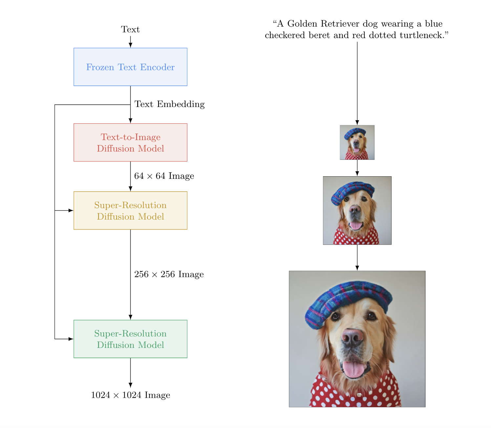
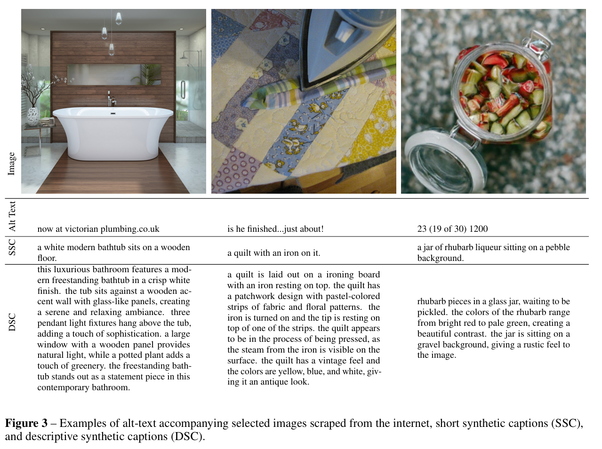

# 目录

[1.主流的AIGC图像生成大模型有哪些？AIGC图像创作领域未来的技术发展趋势是什么样的？](#q-001)
  - [面试问题：AIGC图像创作领域未来的技术发展趋势是什么样的？](#q-002)
  - [面试问题：AIGC时代图像生成大模型的主流技术范式有哪些？分别涵盖哪些主流的AIGC图像生成大模型？](#q-003)
  - [面试问题：图像编辑模型涵盖哪些细粒度任务？（进阶）](#q-004)
  - [面试问题：AIGC图像创作领域的关键训练与优化趋势是什么？](#q-005)
  - [面试问题：AIGC图像生成大模型的效果应该如何评估？](#q-006)

[2.Google公司在AIGC图像创作领域有哪些核心成果和跨周期价值？](#q-007)
  - [面试问题：Google在AIGC图像创作领域形成了怎样的技术演进主线？这些模型分别是扩散模型还是自回归模型？](#q-008)
  - [面试问题：Imagen系列模型有什么跨周期技术价值？Imagen 3延续了哪些本质价值？](#q-009)
  - [面试问题：Nano Banana Pro有哪些优秀特点？](#q-010)

[3.OpenAI公司在AIGC图像创作领域有哪些核心成果和跨周期价值？](#q-011)
  - [面试问题：OpenAI在AIGC图像创作领域形成了怎样的技术演进主线？](#q-012)
  - [面试问题：DALL-E系列模型跨周期的创新点是什么？](#q-013)
  - [面试问题：GPT-4o图像生成系统和GPT-Image-1.5/2的优秀特点是什么？](#q-014)

[4.介绍一下Seedream系列的技术原理和模型架构](#q-015)
  - [面试问题：Seedream系列的技术演进主线是什么？](#q-016)
  - [面试问题：Seedream系列的模型架构和关键创新点是什么？](#q-017)
  - [面试问题：SeedEdit系列模型解决了什么问题？](#q-018)
  - [面试问题：Seedream系列的完整训练流程包括哪些阶段？](#q-019)

[5.其他主流AIGC图像创作大模型有哪些核心特点和跨周期价值？](#q-020)
  - [面试问题：这些其他主流AIGC图像创作模型应该如何整体分类？](#q-021)
  - [面试问题：Midjourney系列模型有哪些优秀特点？](#q-022)
  - [面试问题：HiDream-I1的技术原理和模型架构是什么？](#q-023)
  - [面试问题：GLM-Image的创新点有哪些？](#q-024)
  - [面试问题：Qwen-Image系列的创新点有哪些？](#q-025)
  - [面试问题：Z-Image系列的创新点有哪些？](#q-026)
  - [面试问题：这些模型有哪些共同的跨周期创新点？](#q-027)

---

<h1 id="q-001">1.主流的AIGC图像生成大模型有哪些？AIGC图像创作领域未来的技术发展趋势是什么样的？</h1>

<h2 id="q-002">面试问题：AIGC图像创作领域未来的技术发展趋势是什么样的？</h2>

Rocky认为，2026年是AIGC图像创作领域的“中场时刻”。很多2026年前曾经非常热闹的单点AIGC图像生成技术，会因为新一代原生多模态模型、统一图像生成编辑模型、后训练体系和智能体工作流的发展而被快速淘汰；能够留下的则是继续繁荣的跨周期技术，**比如扩散模型的数学&物理本质原理、Flow Matching框架、自回归视觉token、强文本编码器、参考特征控制、图像编辑、文字渲染、多轮一致性、偏好对齐和推理式视觉创作等核心技术**。

Rocky认为，AIGC图像创作领域的未来趋势可以从五个能力层级理解：

| 能力层级 | 核心定义 | 代表能力 | 典型模型/方法 | 主要挑战 |
|---|---|---|---|---|
| L1：原子生成（Atomic Generation） | 推理过程直接从文本直接生成图像 | 文生图、照片基础审美/真实感 | DDPM、Stable Diffusion、DiT、DALL-E 1、VAR | 不可控性强，空间关系、数量、身份和布局容易错 |
| L2：额外条件生成（Conditional Generation） | 在文本之外加入各种显式条件信息 | 身份一致性、姿态一致性、布局一致性、文字渲染一致性等特征控制 | Stable Diffusion/FLUX生态 + ControlNet/IP-Adapter/PULID/InstantID等控制技术 | 属性绑定、空间精度、局部控制等仍不稳定 |
| L3：上下文生成（In-Context Generation ） | 生成推理过程中吸收多参考图、多条件、多轮历史或多图上下文的信息 | 多图融合、多轮编辑、角色一致、风格一致、跨图叙事等 | FLUX.1 Kontext/FLUX.2、GPT-4o/GPT Image-2、Gemini/Nano Banana pro、Qwen-Image、Seedream 4.0、Z-Image | 需要在多轮漂移、身份保持、未编辑区域保真、长上下文一致性方向持续优化 |
| L4：智能体式生成（Agentic Generation） | 图像生成成为智能体闭环中的一个动作，系统会规划、调用工具、验证、重试 | 视觉规划、检索增强、工具调用、自动修图、生成-验证-再生成 | GEMS、Gen-Searcher、JarvisArt、MIRA等；X-Planner更偏规划式图像编辑，属于L3-L4过渡方法 | 验证器可靠性、工具选择、成本延迟、错误累积 |
| L5：世界建模生成（World-Modeling Generation） | 尝试建模物理、因果、材料、交互和领域规则，能够预测行动后的世界状态变化 | 物理推演、可交互世界、机器人预测、游戏世界模型 | Genie 2/Genie 3等通用交互世界模型，GameNGen/Oasis等神经游戏引擎，UniSim等机器人交互仿真，GAIA-1等自动驾驶世界模型 | 因果忠实性、长期状态一致、真实物理可执行性 |

因此，未来AIGC图像创作不是简单从“更高质量、更高审美”维度发展，而是从**外观生成**走向**智能视觉生成**：模型需要理解结构、记住上下文、遵守物理规则、调用外部工具、验证自身结果，并服务于真实的AIGC图像创作领域各方向的应用场景。

 过去文生图、图生图、局部重绘、图像编辑、文字渲染、身份特征保持、虚拟试装常常需要不同的模型组合工作；而现在的前沿大模型越来越倾向于用同一个backbone处理文本、源图像、参考图、mask、布局、历史编辑和目标图像。这种合并背后有三个底层原因：

1. **各任务本质统一。** 文生图是从文本条件生成新图；图像编辑是从文本 + 源图像 + 条件控制生成目标图。二者本质都是条件生成。
2. **输入条件统一。** 本质上文本、图像、mask、depth、pose、layout、reference image、历史编辑等信息都可以编码成统一上下文，再由同一基础模型生成图像。
3. **产品工作流统一。** 真实创作不是“一次生成一张图”，而是生成、修改、扩图、局部修复、换风格、换文字、多轮迭代。因此生成和编辑必须统一。

未来最有价值的AIGC图像创作大模型，一定不是只会文生图，而是能同时完成：**文字生成/渲染/重绘、参考条件生成、局部编辑、全局风格迁移、身份特征保持、多主体一致、跨轮次编辑和多图融合。**

根据当前主流基础大模型的演进趋势，Rocky认为未来最值得关注的方向包括：

1. **Visual Chain-of-Thought：先思考再创作。** 模型在生成最终图像前，先生成布局草图、区域计划、文字排版、推理步骤或编辑程序，用于检查复杂约束。
2. **原生多模态统一模型。** 文本理解、图像理解、图像生成、图像编辑、多图输入、多轮对话逐渐统一到同一模型和同一上下文中。
3. **AR + Diffusion/Flow混合架构。** 自回归模型负责语义规划、长上下文和推理，扩散/Flow模型负责高保真视觉渲染，这是非常有跨周期价值的架构方向。
4. **Agentic Visual Generation。** 图像生成会成为智能体动作之一，系统会检索资料、调用OCR/布局/图表/分割/修图工具、验证输出并自动重试。
5. **World-Modeling Generation。** 图像和视频模型将不只生成漂亮画面，而要预测行动后场景如何变化，应用场景包括服务机器人、自动驾驶、游戏世界和交互式仿真等。
6. **高质量数据与后训练工程。** VLM标注、合成数据、SFT、DPO、GRPO、奖励模型、偏好优化、自动质检和安全对齐等技术的组合运用，会比单纯模型参数量更决定产品表现。
7. **实时化和低成本部署。** Turbo、少步采样、蒸馏、量化、缓存、端侧推理和视频级实时生成等部署加速技术会决定商业落地上限。

<h2 id="q-003">面试问题：AIGC时代图像生成大模型的主流技术范式有哪些？分别涵盖哪些主流的AIGC图像生成大模型？</h2>

当前主流的AIGC图像生成大模型不再只有一种路线，而是多种范式并行演进：

| 技术范式 | 核心思想 | 代表模型/系列 | 主要定位 | 能力层级理解 |
|---|---|---|---|---|
| 经典扩散模型 | 从噪声逐步去噪生成图像，通常在像素空间或潜空间中完成生成 | DDPM、Stable Diffusion 1.x/2.x/XL等 | 高质量文生图、开源工作流、本地部署 | L1/L2为主，借助插件扩展到L3 |
| 级联扩散模型 | 先低分辨率生成语义图，再通过超分扩散模型逐级增强细节 | Imagen、DALL-E 2、GLIDE等 | 强语言理解文生图、高分辨率生成 | L1/L2，跨周期价值在“语义生成 + 细节增强” |
| Flow Matching / Rectified Flow扩散模型 | 学习从噪声到数据的连续向量场，追求更直、更高效的生成路径 | FLUX.1/FLUX.2、SD 3/3.5、Seedream 3.0/4.0、Qwen-Image、Z-Image、HiDream-I1 | 高质量图像生成、上下文原生编辑、少步数生成潜力 | L2/L3，逐渐成为新一代扩散模型主流 |
| 自回归视觉生成 AR | 将图像编码为离散视觉token或多尺度token map，通过next-token/next-scale prediction生成图像 | DALL-E 1、Parti、LlamaGen、VAR、Emu3、Janus-Pro等 | 统一序列建模、LLM架构复用、多模态上下文建模 | L1/L2研究价值高，正在向L3演进 |
| AR + Diffusion/Flow混合模型 | 融合AR的语义推理/序列建模能力与扩散/Flow的高保真视觉生成能力 | GLM-Image、Transfusion、Show-o、JanusFlow、BLIP3o-NEXT | 复杂指令遵循、知识密集图像、文字渲染、多模态理解生成统一 | Hybrid路线（混合架构），L3潜力强 |
| 原生多模态统一生成编辑系统 | 从产品和能力层统一文本理解、图像理解、图像生成、图像编辑、多图输入和多轮上下文；底层架构可能是扩散、Flow、AR或混合模型，闭源系统通常未完全公开 | GPT-4o、GPT Image-1.5/2、Nano Banana Pro、Seedream 4.0、Qwen-Image-Edit、Z-Image-Edit、Midjourney V6/V7、Ideogram等 | 对话式图像生成、图像编辑、参考图生成、API化视觉生产 | L3为主，向L4智能体工作流延伸 |

**OpenAI和Google代表原生多模态闭源前沿，Stable Diffusion/FLUX代表开放生态路线，Midjourney代表ToC审美产品，Qwen-Image/Seedream/Z-Image/GLM-Image等代表国产图像创作大模型向统一多模态、文字渲染和混合架构演进。**

总的来说，**2022-2024年主线是扩散模型规模化和开源生态爆发；2024-2026年主线转向Flow Matching、DiT、自回归视觉token、AR+扩散混合架构，以及理解-生成-编辑统一的原生多模态大模型。**

<h2 id="q-004">面试问题：图像编辑模型涵盖哪些细粒度任务？（进阶）</h2>

图像编辑模型涵盖了多种细粒度任务，主要包括以下几类：

| 任务类别 | 具体内容 |
|---|---|
| 内容编辑 | 对象添加、删除、替换、扩图、局部重绘 |
| 外观修改 | 颜色改变、材质修改、肖像美化、属性增强 |
| 场景转换 | 背景替换、季节转换、去雾、去雨、光照调整、色彩分级 |
| 文本编辑 | 图像中文字修改、文字重绘、Logo/品牌替换，支持中英文和多语言 |
| 风格迁移 | 线描、水彩、浮世绘、赛博朋克、胶片感、电商风等风格迁移 |
| 姿态与运动变换 | 姿态操控、人物动作变化、新颖视角合成、视频一致性编辑 |
| 结构变换 | 几何结构调整、比例变化、身体/面部结构修改、局部形状改变 |
| 换装与商品编辑 | 修改服饰款式、替换面料、SKU合成、产品精修、电商背景统一 |
| 人脸与身份编辑 | 表情增强、五官调整、身份保持、人脸一致性、多角色一致性 |
| 光影与质感增强 | 调整光源、制造戏剧光、提升皮肤/金属/玻璃/木材等材质质感 |
| 分辨率增强 | 超分、去噪、压缩损坏修复、细节补全 |
| 多轮次编辑 | 多次编辑指令叠加、保持历史一致性、避免身份漂移和画质退化 |
| 跨图一致性 | 角色设定图、漫画分镜、产品系列图、品牌视觉延展 |
| 专业图示生成 | 信息图、PPT、UI、地图、图表、科学图解、数学/物理示意图 |

<h2 id="q-005">面试问题：AIGC图像创作领域的关键训练与优化趋势是什么？</h2>

2026年前后，模型能力提升已经不再只靠扩大参数量。AIGC图像创作大模型的性能增益越来越来自**数据密度、VLM重标注、合成数据、继续训练、SFT、偏好对齐、奖励模型和推理加速**。

核心趋势包括：

1. **从网页爬取走向主动构造数据。** 早期图像创作大模型大量依赖网页图文对；现在更强调高质量筛选、去重、审美过滤、版权过滤、任务均衡和领域覆盖。
2. **VLM驱动的高质量caption和重标注。** DALL-E 3、Qwen-Image、Seedream、Z-Image等主流模型都说明，详细、准确、多粒度的图像描述能显著提升prompt following和属性绑定。
3. **合成数据和蒸馏成为核心引擎。** 强模型生成训练样本、编辑对、偏好对和失败案例，再用于训练更小更快模型，是图像创作大模型工程化的重要方式。
4. **后训练成为能力跃迁关键。** SFT、DPO、GRPO、奖励模型、VLM-as-a-Judge等后训练方法正在进入图像生成编辑领域，用于提升审美、文字渲染、指令遵循和编辑保真等。
5. **推理加速决定产品可用性。** 少步采样、蒸馏、Turbo模型、对抗式加速、缓存复用、并行推理和低NFE Flow生成等，会决定图像创作大模型能否进入实时创作和大规模商业服务。
6. **视觉自我博弈和闭环训练会变重要。** 未来图像创作大模型可能通过“生成器-评估器-修正器”循环，针对空间、物理、身份、文字等失败模式主动构造训练数据并进行针对性优化训练。

<h2 id="q-006">面试问题：AIGC图像生成大模型的效果应该如何评估？</h2>

过去很多评估指标过度重视感知质量，也就是“看起来漂不漂亮”。在进入图像创作领域的“中场时刻”后，需要对新一代图像创作大模型进行更全面的能力评估。

| 评估维度 | 关注问题 | 典型指标/方法 |
|---|---|---|
| 感知质量 | 图像是否自然、清晰、美观、少伪影 | 人类偏好、Aesthetic Score、FID类指标 |
| 指令遵循 | 是否真正按prompt生成 | VIEScore、VLM-as-a-Judge、人工评测 |
| 语义一致性 | 主体、属性、风格、关系是否一致 | CLIPScore、VQA评测、对象/属性检查 |
| 空间推理 | 左右、上下、数量、遮挡、布局是否正确 | Spatial benchmark、布局任务、压力测试 |
| 文本渲染 | 图中文字是否准确、可读、排版合理 | OCR准确率、字符级准确率、多语言文字基准 |
| 编辑保真 | 未编辑区域是否保持，目标区域是否正确变化 | LPIPS、DINO/CLIP相似度、mask区域评估 |
| 身份一致性 | 人物、产品、角色、品牌是否稳定 | Face/ID similarity、多图一致性评测 |
| 多轮一致性 | 多轮编辑后是否身份漂移、画质退化 | 长链编辑测试、restore-to-original测试 |
| 世界知识与物理 | 是否符合事实、常识、物理因果 | PhyBench、WISE、专家评测、工具验证 |
| 工程可用性 | 速度、成本、稳定性、安全性 | 延迟、吞吐、失败率、审核通过率 |

**Rocky认为，未来AIGC图像创作大模型的评估会从“审美打分”升级为“结构、文字、身份、物理、因果、编辑保真、长期一致性和生产可用性”的综合评估。**

<h1 id="q-007">2.Google公司在AIGC图像创作领域有哪些核心成果和跨周期价值？</h1>

参考资料：

- [Imagen: Photorealistic Text-to-Image Diffusion Models with Deep Language Understanding](https://imagen.research.google/)
- [Imagen 3 Technical Report](https://arxiv.org/abs/2408.07009)
- [Imagen 3 | Google DeepMind](https://deepmind.google/models/imagen/)
- [Introducing Nano Banana Pro | Google Blog](https://blog.google/technology/ai/nano-banana-pro/)
- [Gemini 3 Pro Image Preview | Google AI for Developers](https://ai.google.dev/gemini-api/docs/image-generation)

<h2 id="q-008">面试问题：Google在AIGC图像创作领域形成了怎样的技术演进主线？这些模型分别是扩散模型还是自回归模型？</h2>

Rocky认为，Google在AIGC图像创作领域的核心贡献，可以用一条主线概括：**从“强语言理解驱动的级联扩散模型”走向“Gemini原生多模态推理驱动的图像生成与编辑系统”。**

这条主线大致经历了四个阶段：

1. **Imagen阶段：大文本编码器 + 级联扩散模型。** Imagen使用T5-XXL作为文本编码器，再通过一个低分辨率文本到图像扩散模型和多个超分扩散模型逐级生成高分辨率图像。Imagen证明了文本编码器规模和语言理解能力对图像生成质量非常关键。
2. **Imagen Video / Parti / Muse等研究阶段：多路线并行探索。** Google不仅探索扩散模型，也探索自回归图像token生成、masked token建模和视频生成。比如Parti就是Google自回归文生图路线的代表，而Imagen是扩散路线代表。这说明Google的图像生成技术储备不是单一路线，而是扩散、自回归、多模态编码、视频生成等方向并行推进。
3. **Imagen 2 / Imagen 3阶段：高质量文生图模型产品化。** Imagen 2在2023年12月发布，Google官方明确称Imagen 2是由Google DeepMind最新text-to-image进展驱动的diffusion-based model，但没有像Imagen 1那样公开完整technical report/arXiv论文。Imagen 3的技术报告明确称其为latent diffusion model，默认生成1024 × 1024图像，并可接2×、4×或8×超分；但报告重点披露的是数据、评测、安全与产品化治理，仍没有像Imagen 1那样完整公开可复现的底层backbone、文本编码器和采样细节。
4. **Nano Banana / Nano Banana Pro阶段：Gemini驱动的原生多模态图像创作系统。** Nano Banana Pro基于Gemini 3 Pro Image能力，强调推理、世界知识、文字渲染、多图融合、角色一致性、多轮编辑和实时知识，让图像生成从“画图模型”升级为“视觉创作伙伴”。官方强调其底层的Gemini原生多模态能力和产品形态，但底层图像生成架构未公开。

从技术范式上，可以这样严谨区分：

| 模型/系统 | 公开技术路线 | 是否扩散模型 | 是否自回归模型 | 核心技术定位 |
|---|---|---|---|---|
| Imagen | T5-XXL文本编码器 + base text-to-image diffusion + super-resolution diffusion | 是 | 否 | 强语言理解驱动的级联扩散文生图模型 |
| Imagen 2 | Google官方明确称其为diffusion-based model，但未公开像Imagen 1级别的完整技术报告 | 是 | 否 | 产品化的高质量文生图模型，重点提升prompt对齐、手/脸、文字、Logo等生成能力 |
| Imagen 3 | 官方技术报告明确称其为latent diffusion model，默认1024 × 1024生成，可接2×/4×/8×超分；完整backbone、文本编码器和采样细节未完全公开 | 是 | 否 | 产品化高质量文生图模型，重点在数据、评测、安全和生态可用性 |
| Nano Banana Pro / Gemini 3 Pro Image | Google官方强调由Gemini 3 Pro支持，具备推理、世界知识、多图融合、多轮编辑和高质量图像生成能力 | 未公开 | 未公开 | 原生多模态图像创作与编辑系统 |

**Google图像创作大模型的演进，不只是Imagen到Imagen 3的扩散模型升级，而是从强文本编码器、级联扩散、高质量图像生成，进一步走向由Gemini多模态推理和世界知识驱动的图像创作系统。**

<h2 id="q-009">面试问题：Imagen系列模型有什么跨周期技术价值？Imagen 3延续了哪些本质价值？</h2>

Imagen系列是AIGC图像生成领域非常重要的大模型，但它的跨周期价值不能简单理解成“画质更好”“照片更真”“审美更强”，其本质是：**Imagen把文生图从图像生成问题，推进成了语言理解、扩散生成、超分增强、数据工程共同组成的系统工程。**

**Imagen 1是AIGC时代图像生成领域早期的多阶段级联大模型，由一个Text Encoder（T5-XXL）、一个文生图Pixel Diffusion、两个图生图超分Pixel Diffusion共同组成。** 这说明在传统深度学习时代就有的多模型级联架构是跨周期的，是可以在AIGC时代继续成为算法解决方案构建的重要一招。

同时，Imagen 3基于Imagen 1进行了更多的扩展优化：

| 维度 | Imagen 1的跨周期价值 | Imagen 3的延续与升级 |
|---|---|---|
| 模型范式 | T5-XXL + cascaded pixel diffusion，证明强文本编码器和扩散生成的组合价值 | 官方明确为latent diffusion model，从像素级级联路线演进到更适合高分辨率生成和产品化部署的潜空间扩散路线 |
| 分辨率策略 | base model生成低分辨率图像，再通过超分扩散逐级增强 | 默认1024 × 1024生成，并可接2×/4×/8×超分，说明“生成 + 放大/增强”的多阶段思想仍然有效 |
| 语言与caption | 强调大语言模型文本编码器对图文一致性的作用 | 使用Gemini生成合成caption，提升图像细节描述和语言多样性；但这不等于运行时一定用Gemini作为文本编码器 |
| 数据治理 | 早期重视图文数据质量和评估 | 更系统地披露质量过滤、安全过滤、去重、AI生成图像移除、隐私与有害内容治理 |

从跨周期视角看，**Imagen系列真正留下来的跨周期价值包括：**

1. **强语言理解在图像生成中非常重要。** Imagen论文最重要的结论之一，是扩大预训练语言模型比单纯扩大图像扩散模型更能提升图文一致性和生成质量。这背后的本质是：文生图不是“关键词贴图”，而是把自然语言中的主体、属性、关系、风格、空间约束和隐含常识映射成视觉结构。后来主流模型普遍重视文本编码器规模、文本理解能力和多语言语义表示，DALL-E 3、Qwen-Image、Seedream、Z-Image、FLUX、GPT Image等模型都在强化prompt理解、长描述对齐和高质量caption，本质上都在延续这个方向。
2. **“语义生成 + 细节增强”的多阶段思想有长期生命力。** Imagen 1采用低分辨率base diffusion生成主体语义，再用超分diffusion逐级提升分辨率。今天主流模型不一定照搬Imagen 1的pixel cascaded U-Net结构，但“先解决全局语义和布局，再解决高频纹理与分辨率”的思想仍然存在于超分、高清修复、局部重绘、视频生成、商品图精修和多阶段创作工作流中。
3. **高质量caption和数据工程是图像模型能力的底座。** Imagen 3技术报告里最值得关注的不是“画面更好看”，而是它对训练数据进行多阶段质量与安全过滤、去重或降低相似图像权重、移除AI生成图像，并使用Gemini生成多样化synthetic captions。这说明新一代图像创作大模型的能力跃迁，越来越依赖数据密度、描述粒度、过滤策略和合成标注，而不是只靠更大的模型参数量。

<h2 id="q-010">面试问题：Nano Banana Pro有哪些优秀特点？</h2>

Nano Banana Pro可以理解为Google把Gemini 3 Pro的多模态推理能力、世界知识和图像生成编辑能力结合起来之后的原生多模态图像创作大模型。它和Imagen系列最大的区别是：**Imagen系列更像强文本条件驱动的图像生成大模型，Nano Banana Pro更像具备推理、知识、上下文记忆和多图编辑能力的视觉创作系统。**

| 特点维度 | 核心提升 | 关键表现 |
| :--- | :--- | :--- |
| **图像质量与控制力** | 支持更高质量输出和多种长宽比控制。 | 作品更适合专业印刷、社交媒体、广告物料和设计草案。 |
| **世界知识与逻辑推理** | 深度融合Gemini 3 Pro的推理能力和Google搜索/知识生态。 | 能生成符合现实逻辑和最新信息的图像，如科普图解、实时信息图、结构化说明图。 |
| **文字渲染与多语言支持** | 强化图像中文字生成、排版和翻译能力。 | 更适合菜单、海报、教学图、PPT、信息图和多语言营销素材。 |
| **多图像融合与一致性** | 支持多张参考图输入，并在生成中保持人物、产品、风格和场景一致。 | 适合漫画创作、系列产品设计、多角色海报、电商图和品牌视觉延展。 |
| **对话式编辑与上下文记忆** | 支持多轮自然语言编辑，并复用历史上下文。 | 用户可以持续要求换衣服、改背景、替换文案、调整构图，同时尽量保持主体一致。 |

Nano Banana Pro的跨周期价值在于：**它把AIGC图像创作从“提示词驱动的图像生成”推进到“推理、知识、参考图、多轮编辑和视觉设计的融合系统”的阶段。**

<h1 id="q-011">3.OpenAI公司在AIGC图像创作领域有哪些核心成果和跨周期价值？</h1>

参考资料：

- [DALL-E: Creating Images from Text | OpenAI](https://openai.com/index/dall-e/)
- [Hierarchical Text-Conditional Image Generation with CLIP Latents](https://cdn.openai.com/papers/dall-e-2.pdf)
- [DALL-E 3 Technical Report](https://cdn.openai.com/papers/dall-e-3.pdf)
- [Introducing 4o Image Generation | OpenAI](https://openai.com/index/introducing-4o-image-generation/)
- [GPT-4o Model](https://developers.openai.com/api/docs/models/gpt-4o)
- [GPT Image 1.5 Model](https://developers.openai.com/api/docs/models/gpt-image-1.5)
- [GPT Image 2 Model](https://developers.openai.com/api/docs/models/gpt-image-2)
- [Image Generation Guide](https://developers.openai.com/api/docs/guides/image-generation)

<h2 id="q-012">面试问题：OpenAI在AIGC图像创作领域形成了怎样的技术演进主线？</h2>

Rocky认为，OpenAI在AIGC图像创作领域的价值不只是推出了DALL-E系列、GPT-4o图像生成系统和GPT Image系列模型，更重要的是它持续推动了一个领域核心趋势：**图像生成从“孤立的文生图模型”演进为“由语言理解、多模态推理、图像生成、图像编辑等共同组成的视觉创作基础设施系统”。**

这条演进主线可以分成五个阶段，同时也对应了OpenAI图像模型从“自回归图像token生成”到“扩散式图像生成”，再到“架构未公开的原生多模态图像模型”的路线变化。

| 模型/系统 | 发布时间或阶段 | 公开技术路线 | 是否自回归 | 是否扩散模型 | 核心技术定位 |
|---|---|---|---|---|---|
| DALL-E 1 | 2021 | dVAE离散图像token + Transformer序列建模 | 是 | 否 | 文本token和图像token统一自回归生成 |
| DALL-E 2 / unCLIP | 2022 | CLIP图文表征 + prior + diffusion decoder | 部分组件可为自回归或扩散prior，图像生成核心是扩散解码器 | 是 | 在CLIP语义空间中做文本到图像生成 |
| DALL-E 3 | 2023 | 官方重点披露caption改进和训练数据重标注策略，底层模型架构细节没有像DALL-E 2论文那样完整公开 | 未公开 | 未公开 | 强prompt following、文字渲染、ChatGPT提示词协同 |
| GPT-4o图像生成 | 2025 | 官方称其为原生多模态大模型，并强调图像生成被集成到GPT-4o中；底层生成细节未完全公开 | 未公开 | 未公开 | 多模态对话、图像理解、生成与编辑统一体验 |
| GPT Image 1.5 | 2025/2026阶段 | 官方API模型页披露为图像生成模型，未公开完整架构 | 未公开 | 未公开 | GPT Image系列经典的图像生成编辑模型 |
| GPT Image 2 | 2026阶段 | 官方API模型页披露为state-of-the-art image generation model，未公开完整架构 | 未公开 | 未公开 | 2026年主力图像生成编辑大模型 |

Rocky认为，OpenAI在AIGC图像创作领域的贡献价值具体来说：

1. **DALL-E 1阶段：自回归Transformer生成离散图像Token。** DALL-E 1证明了大规模Transformer可以把文本和图像离散token放在同一序列中建模，从而完成文本到图像生成。这是“语言模型范式进入图像生成”的早期代表。
2. **DALL-E 2阶段：CLIP语义空间 + 扩散解码器。** DALL-E 2使用CLIP图文表征空间作为桥梁，再通过扩散模型生成图像，推动了“图文对齐表征 + 生成模型”的路线。它对后来的图像条件生成、参考图编辑、图文检索和多模态对齐都有启发。
3. **DALL-E 3阶段：用高质量描述提升文本到图像对齐。** DALL-E 3的技术报告重点强调caption质量，指出训练图像生成模型时，图像-文本配对中的文本描述质量会显著影响prompt following能力。**这一思想后来被业界广泛吸收，形成“使用强视觉语言模型生成高质量合成标注/重标注数据”的主流训练策略**。
4. **GPT-4o阶段：原生多模态对话式图像创作系统。** GPT-4o图像生成系统的意义在于把图像生成放入多模态对话上下文，强化文字渲染、多轮编辑、参考图理解、世界知识和复杂指令遵循。它更像是把图像生成纳入原生多模态模型能力，而不是一个孤立的传统文生图模型。
5. **GPT Image 1.5/2阶段：图像生成编辑能力进一步优化，同时工程化和产品化。** GPT Image系列把OpenAI图像能力进一步做成面向开发者的生产级模型入口，服务于快速、高质量图像生成、编辑、对话工作流和应用集成。

总的来说，**OpenAI图像模型演进不是单纯从DALL-E 1升级到DALL-E 3，也不是单纯画质提升，而是从自回归文生图、CLIP扩散生成、高质量caption训练、多模态对话生成，逐步走向生产级图像生成编辑解决方案。** 

<h2 id="q-013">面试问题：DALL-E系列模型跨周期的创新点是什么？</h2>

DALL-E系列不是简单的三代产品迭代，而是OpenAI在AIGC图像生成上连续推动回答了三类关键问题：**DALL-E 1回答“图像能不能像语言一样被token化和自回归建模”，DALL-E 2回答“图文语义对齐和扩散生成能不能组合成高质量文生图系统”，DALL-E 3回答“图像生成的上限是否取决于更好的文本描述、指令遵循和产品交互”。**

因此，DALL-E系列的跨周期价值，不应该只按“画质越来越好”来理解，而应该看它在三个层面留下的技术遗产。

1. **DALL-E 1的创新：把图像生成拉入“大模型序列建模”范式。** DALL-E 1使用dVAE把图像压缩成离散视觉token，再让Transformer学习文本token到图像token的联合分布。**它最核心的价值是证明了：图像可以被离散化成token，然后像语言一样被Transformer建模**。这一思路后来在VQGAN、VQ-VAE、Parti、CogView、Muse、Emu、Lumina-mGPT、Janus、Show-o、GLM-Image等图像token或多模态token路线中持续出现。虽然DALL-E 1的图像质量、分辨率、文字渲染和生成效率不如后来的扩散模型，但它打开了“自然语言直接生成复杂图像”的产品认知想象，也让行业开始认真看待“统一序列建模 + 多模态生成”的长期价值。

2. **DALL-E 2的创新：把CLIP语义空间和扩散生成组合起来。** DALL-E 2的核心是OpenAI的unCLIP路线：先用CLIP建立强图文语义空间，再从文本生成图像表征，最后用扩散解码器生成图像。它的跨周期价值在于把“图文对齐能力”转化为“图像生成能力”：图像生成不再只是像素层面的采样，而是先在语义空间中理解用户意图，再用生成模型渲染视觉结果。DALL-E 2同时推动了CLIP语义空间、扩散解码器、图像variation、inpainting等能力进入主流文生图系统。它和GLIDE、Imagen、Stable Diffusion一起，让扩散模型成为2022-2024年高质量图像生成的核心路线。

3. **DALL-E 3的创新：把高质量caption、prompt following和产品协同推到核心位置。** DALL-E 3最值得记住的不是单纯画质提升，而是它强调：图像生成模型的上限，不只取决于模型架构，也高度取决于训练数据中的文本描述质量。很多图文数据集的原始caption太短、太噪、太偏关键词，不能充分描述图像中的主体、属性、空间关系、文字、风格和细节。DALL-E 3通过更高质量、更详细的合成caption训练图像生成模型，从而显著提升prompt following能力。这一思想后来被大量主流图像模型吸收，高质量图像描述、多粒度caption、VLM自动标注、人工偏好筛选都成为常规训练环节。

DALL-E 3中不同长度质量的文本caption对比：

所以，Rocky认为，如果面试中被问到“DALL-E系列模型跨周期的创新点是什么”，最好的回答不是逐代罗列参数和效果，而是总结成一句话：**DALL-E 1开创了图像token化与自回归多模态生成的想象，DALL-E 2奠定了CLIP语义对齐与扩散生成结合的高质量文生图框架，DALL-E 3则把行业竞争从画质推向数据质量、指令遵循、文字渲染、对话式创作和安全对齐。**

<h2 id="q-014">面试问题：GPT-4o图像生成系统和GPT-Image-1.5/2的优秀特点是什么？</h2>

**GPT-4o图像生成系统的核心意义在于，它把图像生成放进原生多模态大模型和多轮对话上下文中**。OpenAI在2025年3月发布4o图像生成时，将其定位为能够生成精确、准确、写实输出的原生多模态模型能力。

它的优秀特点包括：

1. **原生多模态能力。** GPT-4o可以在统一上下文中处理文本、图像、用户上传参考图、聊天历史和生成目标，让图像生成从prompt-to-image变成conversation-to-image。
2. **更强文字渲染。** GPT-4o图像生成强化了图像中文字的准确性，适合海报、白板、教学图、菜单、邀请函、漫画分镜和信息图。
3. **多轮对话编辑。** 用户可以先生成一版，再继续要求改变比例、替换背景、保持角色、增加文案、修改局部内容。模型可以利用历史上下文持续迭代。
4. **复杂指令遵循。** GPT-4o更适合处理多对象、属性绑定、空间关系和风格约束，例如指定多个物体的位置、颜色、材质和文本内容。
5. **图像上下文学习。** 用户上传参考图后，模型可以利用其中的角色、产品、构图、风格和视觉元素继续创作。
6. **世界知识整合。** GPT-4o背后是具备知识和推理能力的多模态模型，因此更适合生成科普图、流程图、菜谱图、代码可视化、旅游路线图、天气信息图等信息密集型视觉内容。
7. **自然语言交互门槛低。** 普通用户不需要理解采样器、CFG、seed等参数，也能通过自然语言完成图像创作。

GPT-4o的跨周期价值在于：**它让图像生成不再只是一个独立AI绘画工具，而是成为多模态大模型对话、理解、推理和行动能力的重要组成部分。**

GPT-Image系列可以理解为OpenAI把图像生成和图像编辑能力进一步模型化、API化和生产化之后的专用图像模型家族。

1. **GPT Image 1.5是GPT Image系列的经典图像生成模型。** 输入支持文本和图像，输出支持图像和文本，并强调更好的指令遵循和提示词贴合能力。
2. **GPT Image 2是当前主力GPT Image图像生成编辑模型。** 支持文本、图像输入和图像输出，面向快速、高质量图像生成与编辑，支持灵活图像尺寸和高保真图像输入。
3. **GPT Image系列是更明确的图像生成/编辑模型入口。** OpenAI可直接使用`gpt-image-2`进行文生图和图像编辑。
4. **从工程价值看，GPT Image 2更适合进入生产系统。** 它支持文本/图像输入、图像生成、图像编辑、灵活尺寸、质量参数和版本快照，更容易嵌入营销素材生成、电商图设计、教育图示、产品图编辑等业务。

一句话总结：**GPT-4o代表原生多模态图像创作体验，GPT Image 1.5/2代表面向API和生产场景的图像生成编辑专用模型，其中GPT Image 2是当前主力版本。**

<h1 id="q-015">4.介绍一下Seedream系列的技术原理和模型架构</h1>

参考资料：

- `Seedream 2.0: A Native Chinese-English Bilingual Image Generation Foundation Model`
- `Seedream 3.0 Technical Report`
- `Seedream 4.0: Toward Next-generation Multimodal Image Generation`
- `SeedEdit: Align Image Re-Generation to Image Editing`
- `SeedEdit 3.0: Fast and High-Quality Generative Image Editing`

<h2 id="q-016">面试问题：Seedream系列的技术演进主线是什么？</h2>

Seedream系列可以理解为字节/即梦生态在AIGC图像生成编辑领域的系统化演进：**从中英双语文生图基础模型，逐步升级为高分辨率、高质量、可编辑、多图参考、多图输出和高效推理的统一多模态图像生成编辑系统。**

Seedream系列的图像生成主干应归类为**扩散/Flow Matching范式下的Diffusion Transformer图像生成大模型**。Seedream 4.0里有VLM/PE模块负责理解输入、任务路由、prompt rewriting、auto-thinking和长宽比估计，但这部分是多模态理解与提示工程模块；真正生成图像的主干仍然是DiT/扩散/Flow路线。

| 模型/模块 | 公开技术路线 | 是否扩散/Flow | 是否自回归 | 核心定位 |
|---|---|---|---|---|
| Seedream 2.0 | 中英双语图像生成基础模型，后续的Seedream 3.0继承其MMDiT架构 | 是 | 否 | 双语文生图基础能力 |
| Seedream 3.0 | MMDiT + Flow Matching + REPA表征对齐 + 混合分辨率训练 | 是 | 否 | 高质量、高分辨率文生图 |
| SeedEdit / SeedEdit 3.0 | VLM + causal diffusion / rectified flow matching + reward models | 是 | 否 | 指令式图像编辑和高保真重生成 |
| Seedream 4.0 | 高效DiT + 高压缩VAE + causal diffusion后训练 + VLM/PE模块 | 是 | 否，但使用VLM/PE做理解、路由和提示工程 | 统一T2I、编辑、多图参考、多图合成和多图输出 |

从技术发展脉络看，这条主线可以分为四个阶段：

1. **Seedream 2.0：中英双语图像生成基础模型。** 重点解决中英文prompt理解、图文对齐、基础画质和商业生成能力，为后续高分辨率和编辑能力打底。
2. **Seedream 3.0：高分辨率Flow Matching/DiT文生图模型。** 它把MMDiT、Flow Matching、混合分辨率训练、跨模态RoPE、REPA表征对齐、分辨率感知时间步采样和VLM奖励模型组合起来，核心目标是提升复杂prompt遵循、文字渲染、审美质量、结构稳定性和原生高分辨率输出。
3. **SeedEdit / SeedEdit 3.0：从图像重生成到高质量指令编辑。** 它解决的不是“能不能局部重绘”，而是“能不能按自然语言指令改图，同时保持身份、结构、风格和未编辑区域稳定”。技术重点是把VLM理解、因果扩散、多粒度编辑数据、元信息标注和奖励模型对齐结合起来。
4. **Seedream 4.0：统一多模态图像生成编辑系统。** 它不再只是文生图模型，而是统一T2I、单图编辑、多图参考、多图合成和多图输出。核心升级是高效Diffusion Transformer、高压缩VAE、VLM/PE模块、T2I与编辑联合后训练，以及对抗蒸馏、分布匹配、量化、推测解码等推理加速技术。

Seedream系列最有跨周期价值的地方，不是某个版本的榜单分数，而是它把未来图像大模型会长期依赖的几类能力放进了同一套系统：

1. **DiT/MMDiT + Flow Matching成为主干。** 这条路线兼顾Transformer可扩展性和连续生成路径建模，是2024-2026年高性能图像模型的重要方向。
2. **数据工程成为模型能力的一部分。** 高质量caption、多粒度标注、缺陷感知训练、图文对齐检索、语义和低层视觉去重，不再是训练前的杂活，而是直接决定prompt following、文字渲染和高分辨率质量。
3. **原生高分辨率和专业内容生成。** Seedream 3.0/4.0持续强化1K、2K、4K生成能力，并补充知识类图像、公式图像、教学图表、设计素材等专业数据，说明图像模型正在从“画好看图”走向“生产可用视觉内容”。
4. **VLM进入生成闭环。** VLM不只是评估器，而是参与caption、任务路由、prompt改写、参考图理解、目标图预测、奖励建模和人类偏好对齐。
5. **生成和编辑逐渐统一。** Seedream 4.0与SeedEdit共同体现一个趋势：T2I、图像编辑、多图参考和多图输出会被放进同一个模型体系，而不是靠一堆割裂工具拼接。
6. **系统级加速决定产品体验。** 对抗蒸馏、分布匹配、少步采样、量化、推测解码和算子优化，让高质量图像模型从“能生成”走向“能实时交互”。

总的来说，**Seedream系列的技术主线，是从双语文生图基础大模型，沿着Flow Matching DiT、高质量数据工程、原生高分辨率、VLM参与后训练、图像编辑统一化和推理加速这几条线，逐步走向一个生产级多模态图像生成编辑系统。**

<h2 id="q-017">面试问题：Seedream系列的模型架构和关键创新点是什么？</h2>

Rocky认为，Seedream系列的架构演进，可以概括为一条非常清晰的主线：**Seedream 2.0先解决中英双语文生图和文字渲染的基础能力，Seedream 3.0把MMDiT升级为Flow Matching DiT高分辨率生成方案，Seedream 4.0再用高效DiT、高压缩VAE和VLM/PE模块，把文生图、编辑、多图参考和多图输出统一到一个多模态图像生成系统里。**

### Seedream 2.0：双语文生图基础模型，重点是“中文/英文都能理解和渲染”

Seedream 2.0在论文中被定义为native Chinese-English bilingual image generation foundation model，本质上是一个面向中英双语场景优化的扩散式文生图基础大模型。它的架构核心包括自研VAE、MMDiT式DiT block、自研双语LLM text encoder、Glyph-Aligned ByT5和Scaled RoPE。

- **自研双语LLM text encoder。** 传统CLIP或T5文本编码器对中文语义、中文文化细节和长文本理解有限。Seedream 2.0用双语LLM作为文本编码器，并通过图文对训练进行对齐，使模型能直接从中英文原始数据中学习语义、文化细节和审美表达。作用是提升中文prompt理解、中英文复杂指令遵循和文化语境生成能力。
- **MMDiT式图文交互主干。** Seedream 2.0的DiT blocks主要遵循Stable Diffusion 3中MMDiT的设计思想，用Transformer在latent图像token和文本条件之间进行交互。作用是把扩散模型从U-Net时代推进到更可扩展的Transformer生成主干。
- **Glyph-Aligned ByT5文字渲染。** 中文字符复杂，单靠普通文本编码很难稳定生成准确字形。Seedream 2.0引入Glyph-Aligned ByT5，强化字符级文本渲染能力。作用是让模型更能处理中文招牌、海报、标语、长文本和跨语言视觉文字。
- **Scaled RoPE分辨率泛化。** 通过按分辨率配置位置编码缩放，让不同分辨率下图像中心区域的位置ID更一致。作用是提升模型对未训练分辨率和长宽比的泛化能力。
- **SFT/RLHF后训练。** Seedream 2.0通过继续训练、SFT和RLHF提升审美、图文对齐、结构正确性和文字渲染。作用是把基础扩散模型对齐到真实用户偏好，而不是只追求预训练损失下降。

### Seedream 3.0：Flow Matching DiT高分辨率生成，重点是“更强、更清晰、更稳定”

Seedream 3.0继承Seedream 2.0的MMDiT架构，同时把训练、数据和对齐体系系统升级。它不只是画质增强版，而是把模型从双语文生图基础能力推进到原生高分辨率、高审美、强prompt following和高质量文字排版。

- **Flow Matching训练目标。** Seedream 3.0明确采用Flow Matching目标，相比传统逐步去噪，更强调学习从噪声到数据的连续速度场。作用是让DiT学到更平滑、更可扩展的生成动力学，便于高质量生成和少步采样。
- **混合分辨率训练。** 论文描述其先在较低平均分辨率预训练，再在512到2048等更高分辨率图像上继续训练，并加入size embedding。作用是让模型原生理解不同分辨率和长宽比，而不是依赖后处理超分。
- **Cross-modality RoPE。** Seedream 2.0有Scaled RoPE，Seedream 3.0进一步把文本token也当作二维token处理，并把文本位置和图像位置编码放到统一空间。作用是提升文本token和图像token之间的位置对齐，尤其有利于文字渲染、属性绑定和空间关系。
- **REPA表征对齐。** Seedream 3.0把MMDiT中间特征与DINOv2-L等预训练视觉编码器特征对齐。作用是加速收敛，让生成模型内部表征更接近强视觉语义空间，从而提升结构、语义和审美稳定性。
- **分辨率感知时间步采样。** 高分辨率训练时，时间步分布需要适配不同SNR区域。Seedream 3.0根据训练分辨率调整时间步采样。作用是提升高分辨率生成稳定性和训练效率。
- **VLM奖励模型。** 相比Seedream 2.0主要使用CLIP类奖励，Seedream 3.0升级到VLM-based reward model，并探索奖励模型规模化。作用是让评价更关注复杂指令、布局、文字、审美和细节，而不是只看粗粒度图文相似。

### Seedream 4.0：统一多模态图像生成系统，重点是“生成、编辑、参考、多图和速度统一”

Seedream 4.0的关键升级，是把Seedream从强文生图模型推进为统一多模态图像生成编辑系统。它统一的不只是接口，而是把T2I、image editing、multi-image composition、多图参考和多图输出放进同一套模型和后训练体系。

   - **高效Diffusion Transformer。** Seedream 4.0使用更高效、可扩展的DiT backbone，在提升模型容量的同时降低训练和推理FLOPs。论文中表示相比Seedream 3.0在compute FLOPs口径下实现超过10倍训练和推理加速。作用是让高分辨率、多图、多任务生成具备产品级成本基础。
   - **高压缩VAE。** 高分辨率图像在latent空间中token越多，DiT计算成本越高。Seedream 4.0通过高压缩VAE显著减少image tokens。作用是支撑1K到4K原生高分辨率生成、高清编辑和秒级交互。
   - **大规模原生高分辨率预训练。** Seedream 4.0在1K到4K原生分辨率上训练，并补充知识图像、公式图像、图表、设计材料等专业数据。作用是让模型从“艺术图片生成”扩展到海报、电商、教育、办公和专业视觉内容生产。
   - **VLM/PE模块。** 基于Seed1.5-VL训练端到端Prompt Engineering模型，输入可以是文本、单图或多图，输出参考图caption、目标图caption、任务路由、prompt rewriting、auto-thinking和长宽比估计。作用是把用户粗糙、多模态、上下文式需求转成DiT更容易执行的生成条件。
   - **T2I与编辑联合后训练。** Seedream 4.0通过CT、SFT、RLHF和PE模块，对T2I、单图编辑、多图参考、多图输出等任务做联合后训练。作用是让生成和编辑不再割裂，提升参考一致性、身份保持、局部修改和多图上下文生成能力。
   - **推理加速系统。** Seedream 4.0集成adversarial distillation、distribution matching、quantization和speculative decoding。作用是减少采样步数、降低显存和延迟，把高质量生成从离线能力变成可交互产品体验。

总的来说，**Seedream系列的架构创新不是单点堆积，而是一个连续升级过程：2.0建立双语LLM文本编码、MMDiT、文字渲染和人类偏好对齐的基础；3.0用Flow Matching、高分辨率训练、Cross-modality RoPE、REPA和VLM奖励模型提升生成质量；4.0再用高效DiT、高压缩VAE、VLM/PE和联合后训练，把图像模型升级成统一的多模态视觉创作基础设施。**

<h2 id="q-018">面试问题：SeedEdit系列模型解决了什么问题？</h2>

SeedEdit系列解决的是图像生成模型进入真实创作工作流时最关键的问题：**如何根据用户指令编辑图像，同时保持未编辑区域、身份、风格、结构和文字细节的稳定。**

传统图像编辑常见的问题是：改得动但保不住原图，保得住原图但不听指令，或者能局部重绘但身份、文字、结构和风格容易漂移。SeedEdit系列的价值，就是把图像编辑从“依赖反演、mask和局部重绘技巧”推进到“重新训练一个懂指令、懂图像、会保持内容的编辑模型”。

1. **VLM负责理解，扩散模型负责生成。** VLM读取输入图像和编辑指令，抽取高层语义；causal diffusion / rectified flow模型负责在视觉空间中完成修改。作用是把“语言意图”和“图像细节”接起来，避免编辑模型只会改像素、不懂任务。
2. **多源编辑数据解决“真实编辑场景太复杂”。** SeedEdit 3.0使用合成数据、真实图像对、视频帧、商品和设计等数据，让模型见到更多替换、增删、风格迁移、文字修改、身份保持和局部保真任务。作用是提升泛化，而不是只适配少数玩具编辑样例。
3. **多粒度元信息解决“模型不知道这是什么编辑任务”。** data-level task label、text-level recaption、pixel-level tagging让模型知道数据来源、编辑类型、修改区域和文本描述。作用是降低训练噪声，让模型更清楚“哪里该变、哪里不该变”。
4. **奖励模型解决“编辑质量需要多目标权衡”。** 人脸保持、文本渲染、细节保真、结构一致和指令遵循往往会互相冲突。reward models联合训练的作用，是让模型在“改得准”和“保得稳”之间学到更好的平衡。
5. **T2I与编辑联合训练解决“编辑模型画质不够”。** 高质量T2I数据提升视觉质量和高分辨率能力，编辑数据提升指令修改和局部保持能力。作用是让编辑结果既听话，又像自然生成的高质量图片。

一句话概括：**SeedEdit系列的核心创新，是用VLM理解、因果扩散生成、多粒度编辑数据和奖励模型对齐，把图像编辑从局部技巧升级成可训练、可泛化、可产品化的指令式图像编辑系统。**

<h2 id="q-019">面试问题：Seedream系列的完整训练流程包括哪些阶段？</h2>

以Seedream 3.0/4.0为代表，Seedream系列训练流程可以概括为：

1. **数据构建与清洗。** 包括大规模图文对、多语言数据、知识类图像、公式图像、教学图表、自然图像、艺术图像、编辑数据和多图参考数据。
2. **缺陷感知与质量控制。** 使用低质量分类器、文本质量分类器、缺陷检测器、去重系统、图文对齐检索系统，对图像和caption进行过滤与增强。
3. **模型预训练。** 使用DiT/MMDiT + Flow Matching，在大规模图文对上学习通用文本到图像映射能力。
4. **高分辨率继续训练。** 从低分辨率逐步到1K、2K甚至4K训练，并用分辨率/长宽比条件提升原生高分辨率生成能力。
5. **Continuing Training。** 加入知识类数据、复杂指令、多任务数据、图像编辑数据、多图参考数据，增强模型多任务熟练度。
6. **Supervised Fine-Tuning。** 使用高质量美学caption、人工筛选样本和专业风格数据，提升审美、构图、色彩、材质和文字渲染。
7. **RLHF/偏好对齐。** 使用VLM奖励模型、人类偏好、专业奖励模型，让模型输出更符合人类审美和业务需求。
8. **Prompt Engineering模型训练。** 训练VLM/PE模块进行任务路由、prompt改写、auto-thinking、参考图描述、目标图预测和长宽比估计。
9. **推理加速与部署优化。** 使用对抗蒸馏、分布匹配、少步采样、量化、推测解码、算子融合和硬件感知优化，降低延迟和成本。

Rocky认为这套流程体现了一个重要趋势：**AIGC图像创作大模型训练已经从“单纯预训练”变成“数据工程 + 预训练 + 继续训练 + SFT + RLHF + PE + 加速部署”的完整系统工程。**

<h1 id="q-020">5.其他主流AIGC图像创作大模型有哪些核心特点和跨周期价值？</h1>

Midjourney、HiDream-I1、GLM-Image、Qwen-Image和Z-Image分别代表了几个非常重要的方向：**ToC审美产品、稀疏DiT高效开源模型、AR+扩散混合架构、中文/复杂文字渲染、轻量高效Single-Stream DiT和统一图像编辑。**

参考资料：

- [Midjourney Version官方文档](https://docs.midjourney.com/hc/en-us/articles/32199405667853-Version)
- `HiDream-I1: A High-Efficient Image Generative Foundation Model with Sparse Diffusion Transformer`
- [GLM-Image Diffusers文档](https://huggingface.co/docs/diffusers/api/pipelines/glm_image)
- `Qwen-Image Technical Report`
- `Z-Image: An Efficient Image Generation Foundation Model with Single-Stream Diffusion Transformer`

<h2 id="q-021">面试问题：这些其他主流AIGC图像创作模型应该如何整体分类？</h2>

| 模型/系列 | 公司/生态 | 主要定位 | 技术路线判断 | 跨周期关键词 |
|---|---|---|---|---|
| Midjourney | Midjourney闭源产品 | ToC审美、艺术风格、默认出片率 | 官方未公开完整底层架构，产品侧重点是生成质量和工作流体验 | 审美对齐、Prompt产品化、风格控制、个性化、快速草稿 |
| HiDream-I1 | HiDream/开源生态 | 高效图像生成基础模型 | Sparse Diffusion Transformer，双流到单流稀疏DiT + dynamic MoE | MoE/稀疏激活、高效推理、开源可用、DiT扩展 |
| GLM-Image | 智谱/GLM生态 | 知识密集型图像生成、中文文本渲染、编辑 | 9B自回归生成器 + 7B扩散解码器的混合架构 | AR负责语义规划，扩散负责细节渲染，GRPO解耦后训练 |
| Qwen-Image | 阿里/Qwen生态 | 中文/英文文字渲染、图像生成编辑 | 双流MMDiT + Flow Matching + Qwen2.5-VL语义编码 + 专用VAE | 文字渲染、MSRoPE、VAE重建、DPO/GRPO后训练 |
| Z-Image | 阿里/开源图像生态 | 高效图像生成、图像编辑、Turbo和Omni能力 | 6B Scalable Single-Stream Diffusion Transformer，扩散/Flow类路线 | 小而强、单流DiT、任意分辨率、T2I/I2I联合预训练 |

从能力层级看，Midjourney和HiDream更偏L1/L2的高质量生成与条件控制；GLM-Image、Qwen-Image和Z-Image则明显向L3 In-Context Generation靠拢，因为它们更强调图像编辑、多条件输入、文字渲染、参考图保持和生成编辑统一。

<h2 id="q-022">面试问题：Midjourney系列模型有哪些优秀特点？</h2>

Midjourney是AIGC时代AI绘画ToC产品的一个重要标杆。它的价值不只是模型本身，而是把模型、审美偏好、提示词产品化、默认参数、图像增强和用户社区组合成了一套高出片率产品系统。

Midjourney的核心特点包括：

1. **默认审美强。** Midjourney长期在构图、光影、色彩、材质、人物氛围和艺术风格上保持很强的默认出片率，降低普通用户创作门槛。
2. **风格表达能力强。** 它非常适合摄影、插画、概念设计、电影感画面、产品视觉和艺术风格探索。
3. **提示词产品化成熟。** 用户不需要理解复杂模型参数，也可以通过简短prompt、风格词、比例参数、参考图和变体操作获得较好结果。
4. **V7强化prompt和图像提示理解。** Midjourney官方文档中，V7在文本提示、图像提示、纹理、身体、手部和物体细节一致性上都有明显增强，并在2025年6月成为默认模型。
5. **个性化成为默认能力。** V7把personalization放到默认工作流中，说明图像生成产品正在从“同一个模型服务所有人”走向“根据用户审美偏好动态调整输出”。
6. **Draft Mode提升迭代效率。** Draft Mode强调用更低成本、更高速度快速探索构图和方向，再将满意草稿升级到高质量结果，体现了创意工作流里“先快速探索，再精修”的产品逻辑。
7. **Omni Reference强化一致性。** Omni Reference体现的是角色、对象、风格和参考图一致性方向，这与L3 In-Context Generation中的跨图一致、多图参考高度相关。
8. **辅助功能形成闭环。** 超分、变体、局部重绘、扩图、风格参考、角色参考等功能，使它更像创意工作台，而不是单次文生图接口。
9. **产品系统价值高。** Midjourney背后通常会有prompt扩写、默认美学策略、候选图排序、图像增强和社区反馈等配套机制。

面试中可以这样评价：**Midjourney的跨周期价值在于证明AIGC图像模型的商业成功不只取决于底层架构，还取决于审美对齐、交互设计、默认参数、后处理和社区工作流。**

<h2 id="q-023">面试问题：HiDream-I1的技术原理和模型架构是什么？</h2>

HiDream-I1可以放在“高效DiT基础模型”这个方向理解。它的论文标题强调`High-Efficient Image Generative Foundation Model with Sparse Diffusion Transformer`，说明其核心关键词是**稀疏Diffusion Transformer**。

HiDream-I1的关键点包括：

1. **属于扩散/DiT路线。** HiDream-I1不是纯自回归图像token模型，而是基于Diffusion Transformer的图像生成基础模型。
2. **17B稀疏DiT基础模型。** 论文将HiDream-I1定位为17B参数开源图像生成基础模型，重点解决高质量图像生成中的计算复杂度和推理延迟问题。
3. **双流解耦 + 单流交互。** 架构先用双流结构分别处理图像token和文本token，再进入单流稀疏DiT进行跨模态交互，兼顾条件理解和生成效率。
4. **dynamic MoE稀疏激活。** MoE并不是为了简单堆参数，而是让每次推理只激活部分专家，从而在模型容量和实际计算成本之间取得平衡。
5. **Full/Dev/Fast多版本策略。** HiDream-I1提供Full、Dev、Fast等版本，体现了产业模型常见的质量、速度、成本分层部署思路。
6. **从T2I扩展到编辑和Agent。** HiDream-E1面向指令式图像编辑，HiDream-A1则把文生图和编辑能力组合成更完整的交互式图像创作系统。
7. **面向开源生态。** HiDream-I1进入Hugging Face、Diffusers、ComfyUI等生态后，可以被LoRA微调、工作流编排和推理加速工具继续放大价值。
8. **跨周期价值在于高效化。** 当图像模型越来越大，高效Transformer、稀疏激活、缓存、蒸馏、量化和少步采样会成为长期方向。

面试中可以这样回答：**HiDream-I1代表开源图像生成模型中“高效DiT/稀疏Transformer”的路线，它的重点不是AR语义规划，而是让扩散/DiT模型在质量、成本和可部署性之间取得更好平衡。**

<h2 id="q-024">面试问题：GLM-Image的创新点有哪些？</h2>

GLM-Image代表的是另一条很重要的混合路线：**自回归模块负责低频语义规划，扩散解码器负责高频视觉细节。** 这与前面综述中提到的“AR plans, diffusion renders”高度一致。

#### 一、模型架构核心设计思想

1. **整体架构：9B自回归生成器 + 7B扩散解码器。**  
   自回归模块基于GLM-4-9B类语言模型初始化，扩展词表以支持视觉token，主要负责文本理解、布局规划、知识密集内容和语义token生成；扩散解码器采用单流DiT类结构，在latent空间中负责生成纹理、光影、笔画、材质等高频细节。

2. **为什么要混合AR和扩散？**  
   自回归模型擅长语义理解、知识推理和复杂指令遵循，但直接生成高保真像素细节较弱；扩散模型擅长高质量视觉细节和训练稳定性，但复杂语义、文字和知识密集任务容易语义对齐不足。GLM-Image通过两者分工，把语义和细节拆开处理。

3. **语义VQ token的价值。**  
   语义VQ token比传统VQVAE视觉token更强调语义相关性，能更好承载布局、对象关系、文本内容和知识逻辑，为扩散解码器提供可靠语义条件。

4. **扩散解码器可移除prompt输入。**  
   当语义token已经包含足够语义信息时，扩散解码器无需再加载大文本编码器重复理解prompt，可以降低内存和推理延迟，使扩散部分专注高频细节。

5. **语义VQ token与VAE latent融合。**  
   语义VQ token提供低频语义，VAE latent提供底层视觉特征，二者沿通道维度融合，可以在不显著增加序列长度的情况下兼顾语义和细节。

6. **支持文生图和图生图统一。**  
   GLM-Image不仅支持文本到图像，也支持图像编辑、风格迁移、多主体一致性和身份保持等图生图任务，说明混合架构可以进入真实创作工作流。

7. **图像编辑中的block-causal attention。**  
   相比全注意力，block-causal attention通过KV cache减少参考图像token重复计算，在细节保留和计算开销之间取得平衡。

8. **中文文本渲染辅助。**  
   通过Glyph-byT5等字符级字形模型，强化中文笔画、排版和文字区域编码，解决中文文本渲染易畸变的问题。

#### 二、训练与优化技术设计

1. **自回归模块预训练。** 冻结部分文本嵌入，新增视觉词嵌入和视觉LM头，使用MRoPE适配文本-图像交织输入。
2. **渐进式生成策略。** 先生成低分辨率语义token确定布局，再让扩散解码器逐步生成高分辨率细节，避免高分辨率阶段布局紊乱。
3. **解耦强化学习。** 对自回归模块和扩散解码器采用不同奖励，并可使用GRPO类策略：AR侧偏语义、美学、OCR、VLM正确性；扩散侧偏LPIPS、OCR笔画、手部细节等高频质量。
4. **知识密集场景优化。** GLM-Image适合垃圾分类口诀、实验步骤、咖啡公式、地图标注、水循环原理等文本和知识密集型图像。

GLM-Image的跨周期价值是：**它证明图像生成不一定只能走纯扩散或纯自回归，AR+扩散混合架构可以把语言模型的语义推理能力和扩散模型的视觉细节能力结合起来。**

<h2 id="q-025">面试问题：Qwen-Image系列的创新点有哪些？</h2>

Qwen-Image代表的是中文图像生成编辑模型中非常重要的一条路线：**用强多模态语言模型提升语义理解，用MMDiT/Flow Matching生成图像，并通过专门VAE和数据工程解决中文及复杂文字渲染。**

Qwen-Image的核心特点包括：

1. **卓越的文本渲染能力。** Qwen-Image特别强调复杂文本渲染，包括中文、英文、多行长文本、段落级语义、海报/PPT/菜单/UI中的小字和排版。
2. **专门优化VAE。** 它没有简单使用通用VAE，而是基于Wan-2.1-VAE类图像/视频兼容架构，冻结共享编码器，并在大量富文本图像上微调或重训图像解码器，提升细小文字和纹理重建质量。
3. **双流MMDiT架构。** 文本和图像分别走不同处理流，再进行跨模态联合建模，适合复杂语义和图像潜空间生成。
4. **Qwen2.5-VL语义编码。** 文本和视觉语义由强多模态模型解析，使模型具备更强prompt理解和中文语义能力。
5. **MSRoPE多模态位置编码。** 将文本位置和图像空间位置更自然地融合，改善文本和图像在空间语义上的对齐。
6. **Flow Matching训练目标。** 预训练阶段采用流匹配目标，配合MMDiT实现稳定大规模训练。
7. **文本数据工程。** 数据清洗特别重视文本图像：中英文拆分、其他语言拆分、非文本拆分、合成文本渲染、密集文本过滤、小字符过滤等。
8. **结构化标注和合成数据。** 使用Qwen2.5-VL进行caption和元数据提取，生成包含OCR、物体属性、空间关系、水印、风格等结构化信息；合成数据包括纯渲染、组合渲染和复杂模板渲染。
9. **后训练强化。** SFT提升真实感和细节，DPO/GRPO进一步对齐人类偏好、文本渲染和指令遵循。
10. **Qwen-Image-Edit。** 编辑版将输入图像同时送入Qwen2.5-VL和VAE Encoder，分别获得视觉语义控制和视觉外观控制，从而支持low-level外观编辑、high-level语义编辑和精准文字编辑。

面试中可以这样总结：**Qwen-Image的跨周期价值在于把中文/复杂文字渲染从一个附属能力提升为核心训练目标，并证明VAE重建、富文本数据、结构化OCR标注、多模态位置编码和后训练对齐会共同决定文本渲染上限。**

<h2 id="q-026">面试问题：Z-Image系列的创新点有哪些？</h2>

Z-Image代表的是“高效、轻量、统一、可编辑”的新一代扩散Transformer路线。它的核心不是一味堆大参数，而是通过6B级Single-Stream DiT、数据设计和统一预训练，让模型在有限算力下获得较强的生成和编辑能力。

#### 一、Z-Image的预训练阶段如何设计？

Z-Image的预训练可以分为两个关键阶段：

1. **Pretraining阶段。**  
   目标是快速获得基础视觉-语义对齐和图像合成知识。该阶段主要在低分辨率如256x256上做文生图训练，虽然分辨率低，但消耗大量预训练计算量，模型会在这个阶段学习基础视觉知识、中文文本渲染能力和语义合成能力。训练中采用动态时间偏移策略，以适应不同分辨率下的SNR变化。

2. **Omni-pretraining阶段。**  
   这是统一多任务阶段，核心包括任意分辨率训练、文生图与图生图联合训练、多级别双语标注训练。模型通过分桶策略学习跨尺度视觉信息，并利用自然弱对齐图像对学习生成和编辑能力。Z-Captioner生成长、中、短描述、标签、模拟用户prompt和成对差异标注。

#### 二、Z-Image如何构建图像编辑训练对？

1. **混合编辑与专家模型。** 利用任务专家模型合成高质量编辑数据，并将多个编辑动作整合到一个复合编辑对中。
2. **高效图形化表示。** 对同一输入图像的不同编辑版本任意配对组合，几乎零成本扩充编辑对，并可生成逆向对。
3. **视频帧配对图像。** 从视频帧中抽取具有天然相关性的图像对，利用CN-CLIP等嵌入相似度筛选，提供可扩展、多样化编辑数据。
4. **文本编辑渲染系统。** 针对真实世界文本编辑数据稀缺的问题，通过可控字体、颜色、大小、位置生成高质量文本编辑对。

#### 三、Z-Image架构如何支持图像编辑？

1. **S3-DiT / Single-Stream DiT。** 相比传统双流结构，单流DiT把文本、视觉语义token和VAE图像token放到统一序列中建模，提高参数效率。
2. **SigLIP 2语义增强。** 从参考图像中提取抽象视觉语义，增强编辑任务中的参考理解。
3. **统一输入设计。** 在序列层面连接文本、视觉语义token和VAE token，使生成和编辑共享同一架构。
4. **时序区分源图与目标图。** 源图像和目标图像token可使用对齐空间RoPE坐标，同时通过时间维度偏移区分干净图像和带噪目标图像。

#### 四、Z-Image如何为编辑任务生成caption？

Z-Captioner采用三步CoT流程：

1. **详细标注。** 分别为源图像和目标图像生成包含OCR信息的完整caption。
2. **差异分析。** 比较两张图像，识别物体、文字、风格、位置、颜色等差异。
3. **指令合成。** 根据差异生成简洁编辑指令，如“把红色裙子换成蓝色裙子，删除左肩背包，背景换成悉尼歌剧院”。

这样可以让训练指令与编辑图像对严格对应，提升细粒度局部编辑和混合编辑能力。

#### 五、Z-Image-Edit如何训练？

1. **编辑预训练。** 在Z-Image基础模型上继续训练，混合编辑对数据和T2I SFT数据，先在512分辨率适应编辑任务，再提高到1024分辨率提升生成质量。为避免编辑数据多样性不足导致文生图能力退化，T2I和I2I数据需要保持较高比例。
2. **SFT阶段。** 手动构建任务平衡的高质量子集，进一步提高指令遵循、局部编辑和真实世界分布适配能力。对于远离真实用户分布的合成数据，需要适当降采样。
3. **Prompt Enhancer。** 使用固定预训练LLM/VLM处理歧义、补充世界知识和推理能力，并在SFT阶段使用增强后的prompt训练，使模型适配PE后的输入分布。
4. **Turbo蒸馏与少步生成。** Z-Image-Turbo体现的是高质量模型向低NFE、低延迟部署迁移的方向。少步蒸馏、奖励后训练和推理优化会直接决定开源模型能否进入实时交互场景。

Z-Image的跨周期价值是：**它证明图像生成编辑模型不一定只能走巨型闭源路线，Single-Stream DiT、任意分辨率训练、T2I/I2I联合预训练、Z-Captioner和可扩展编辑数据构造，可以在有限算力下形成很强的生成编辑统一能力。**

<h2 id="q-027">面试问题：这些模型有哪些共同的跨周期创新点？</h2>

1. **审美和产品系统同样重要。** Midjourney说明默认审美、交互、提示词、候选图排序和后处理会显著影响用户感知。
2. **扩散/Flow/DiT仍是高质量图像生成主力。** HiDream、Qwen-Image、Z-Image都围绕DiT、Flow Matching、VAE和高效推理展开。
3. **AR+扩散混合架构会长期存在。** GLM-Image说明语言模型负责语义规划、扩散模型负责细节渲染，是非常有潜力的统一路线。
4. **文字渲染成为生产级模型分水岭。** Qwen-Image、GLM-Image、Z-Image都把OCR、字形、文本数据和富文本合成作为重要能力。
5. **生成和编辑正在统一。** Qwen-Image-Edit、Z-Image-Edit、GLM-Image编辑都说明文生图和图像编辑会越来越共享同一backbone和数据体系。
6. **高效化是长期主题。** Sparse DiT、Single-Stream DiT、高压缩VAE、量化、蒸馏、少步采样和算子优化会持续影响产业落地。
7. **数据工程决定上限。** 高质量caption、结构化OCR、编辑差异标注、多图参考数据、视频帧配对、合成文本渲染，是模型能力的底层燃料。
8. **L3能力成为新分水岭。** 未来主流模型不能只会单张文生图，还要支持多图参考、局部编辑、角色一致、文本编辑、多轮上下文和专业图示。
