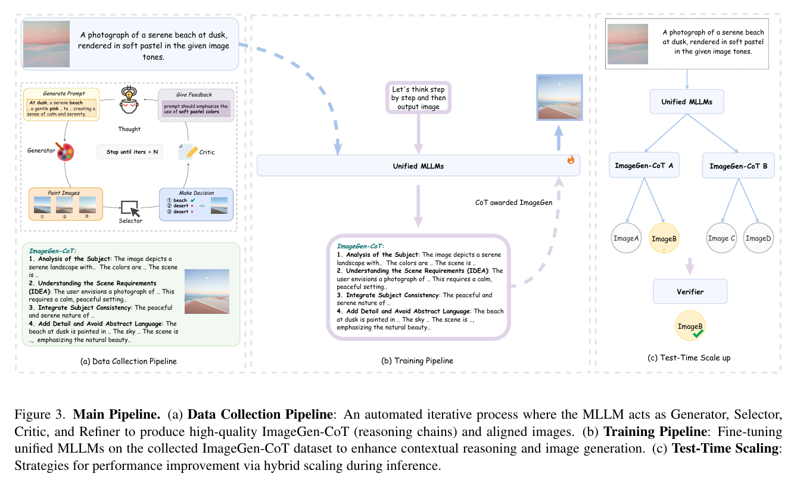
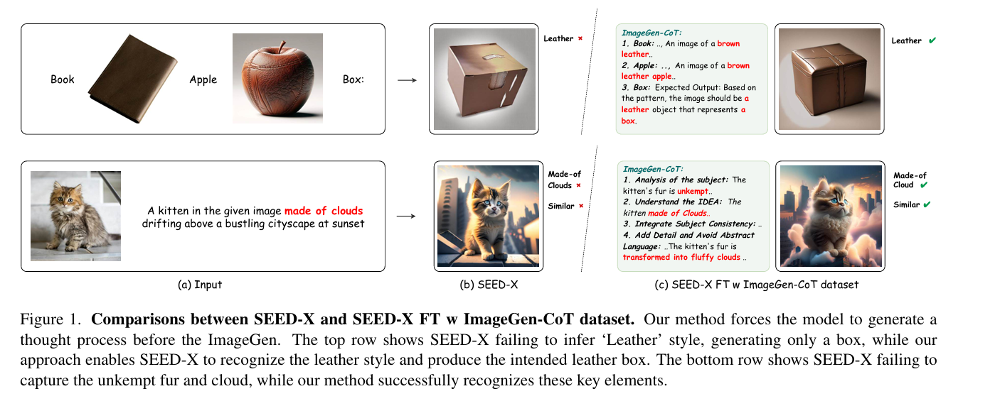
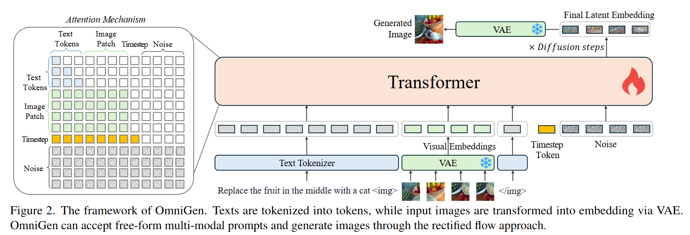

# 目录

## 第一章 其他主流AI绘画大模型高频考点

- [1.Playground V2模型有哪些特点？](#1.Playground-V2模型有哪些特点？)
- [2.Imagen模型有什么特点?](#2.Imagen模型有什么特点?)
- [3.PlaygroundV3模型有哪些特点？](#3.PlaygroundV3模型有哪些特点？)
- [4.目前主流的AIGC图像生成大模型有哪些？](#4.目前主流的AIGC图像生成大模型有哪些？)
- [5.什么是DALL-E 2及其主要功能？](#5.什么是DALL-E2及其主要功能？)
- [6.什么是DALL-E 3及其主要功能？](#6.什么是DALL-E3及其主要功能？)
- [7.关于GPT4O生成的看法（技术路线未公布）](#7.关于GPT4O生成的看法（技术路线未公布）)
- [8.介绍一下Kandinsky 2.1](#8.介绍一下Kandinsky-2.1)
- [9.介绍一下Kandinsky 2.2](#9.介绍一下Kandinsky-2.2)
- [10.介绍一下Kandinsky3](#10.介绍一下Kandinsky3)
- [11.什么是ImageGen-CoT（思维链条）？](#11.什么是ImageGen-CoT（思维链条）？)
- [12.什么是OminGen？](#12.什么是OminGen？)
- [13.Midjourney系列模型迭代至今有哪些优秀的特点？](#13.Midjourney系列模型迭代至今有哪些优秀的特点？)
- [14.介绍一下Seedream系列模型的原理](#14.介绍一下Seedream系列模型的原理)
- [15.Seedream和Stable Diffusion相比有哪些异同？](#15.Seedream和Stable-Diffusion相比有哪些异同？)
- [16.Seedream每个版本都有哪些创新？](#16.Seedream每个版本都有哪些创新？)
- [17.介绍一下HiDream-I1模型的原理](#17.介绍一下HiDream-I1模型的原理)
- [18.HiDream-l1和Stable Diffusion相比有哪些异同？](#18.HiDream-l1和Stable-Diffusion相比有哪些异同？)
- [19.DALL-E和Stable Diffusion相比有哪些异同？](#19.DALL-E和Stable-Diffusion相比有哪些异同？)
- [20.从DALL-E 1到DALL-E 3，都有哪些创新？](#20.从DALL-E-1到DALL-E-3，都有哪些创新？)
- [21.介绍一下可图大模型的原理](#21.介绍一下可图大模型的原理)
- [22.可图大模型和Stable Diffusion相比有哪些异同？](#22.可图大模型和Stable-Diffusion相比有哪些异同？)
- [23.介绍一下混元DiT模型的原理](#23.介绍一下混元DiT模型的原理)
- [24.混元DiT和Stable Diffusion相比有哪些异同？](#24.混元DiT和Stable-Diffusion相比有哪些异同？)
- [25.介绍一下PixArt系列模型的原理](#25.介绍一下PixArt系列模型的原理)
- [26.PixArt系列每个版本都有哪些创新？](#26.PixArt系列每个版本都有哪些创新？)
- [27.PixArt和Stable Diffusion相比有哪些异同？](#27.PixArt和Stable-Diffusion相比有哪些异同？)
- [28.Playground系列每个版本都有哪些创新？](#28.Playground系列每个版本都有哪些创新？)
- [29.Playground和Stable Diffusion相比有哪些异同？](#29.Playground和Stable-Diffusion相比有哪些异同？)
- [30.介绍一下Midjourney系列模型的原理](#30.介绍一下Midjourney系列模型的原理)
- [31.介绍一下Imagen系列模型的原理](#31.介绍一下Imagen系列模型的原理)
- [32.Imagen系列每个版本都有哪些创新？](#32.Imagen系列每个版本都有哪些创新？)
- [33.Imagen和Stable Diffusion相比有哪些异同？](#33.Imagen和Stable-Diffusion相比有哪些异同？)
- [34.介绍一下Nano Banana Pro的特点](#34.介绍一下Nano-Banana-Pro的特点)
- [35.站在2026年的视角，AIGC图像生成领域未来的技术发展趋势是什么样的？](#35.站在2026年的视角，AIGC图像生成领域未来的技术发展趋势是什么样的？)

## 第一章 其他主流AI绘画大模型高频考点正文

<h2 id="1.Playground-V2模型有哪些特点？">1.Playground V2模型有哪些特点？</h2>

Playground系列AI绘画大模型到目前已经发展到第三个版本，也就是Playground V2.5，其特点主要有：
1. 与SDXL相同模型架构。
2. 与SDXL相比，增强了色彩和对比度（EDM框架），改善了跨多种长宽比的生成（均衡分桶策略），以及改善了中心人物的细节（SFT策略）。
3. 其中EDM框架能在扩散模型的扩散过程最终“时间步长”上表现出接近零的信噪比。这消除了对偏移噪声的需求，让Playground V2.5能够生成背景是纯黑色或纯白色的图像。
4. 其中SFT策略主要使用一个高质量的小数据集对预训练的扩散模型进行微调训练。而这个数据集通过用户评级自动策划。
5. 从头开始训练（trained from scratch）。
6. 设计MJHQ-30K测试集用于评估AI绘画大模型，主要是在高质量数据集上计算FID来衡量美学质量。MJHQ-30K是从Midjourney上收集的30000个高质量数据集，共包含10个常见的类别，每个类别包含3000个样本。

<h2 id="2.Imagen模型有什么特点?">2.Imagen模型有什么特点?</h2>

**Imagen是AIGC时代AI绘画领域的第一个多阶段级联大模型，由一个Text Encoder（T5-XXL）、一个文生图 Pixel Diffusion、两个图生图超分Pixel Diffusion共同组成，让Rocky想起了传统深度学习时代的二阶段目标检测模型，这也说明多模型级联架构是跨周期的，是有价值的，是可以在AIGC时代继续成为算法解决方案构建的重要一招。**

同时Imagen是AI绘画领域第一个使用大语料预训练语言模型T5-XXL作为Text Encoder的AI绘画大模型。论文中认为在文本编码器部分下功夫比在生成模型上下功夫效果要好，即使文本编码器部分的T5-XXL是纯文本语言模型，也比加大加深生成模型参数效果要好。

不过Imagen也有他的局限性，在扩散模型部分还是选用经典的64x64分辨率的U-Net结构。选择小模型可以缓解Diffusion迭代耗时太长，导致生成过慢的问题，生成小图像再超分确实是加速生成最直观的方法。但是也注定了无法生成比较复杂内容和空间关系的大图像。

---

<h2 id="3.PlaygroundV3模型有哪些特点？">3.PlaygroundV3模型有哪些特点？</h2>

### 技术架构创新

1. **深度融合大型语言模型**：不同于传统文本到图像模型使用T5或CLIP等预训练语言模型，Playground v3采用创新结构完全集成大型语言模型，专门从解码器型LLM获取文本条件
2. **内置高质量字幕器**：团队开发了专有字幕生成器，增强图像字幕质量

### 性能与能力

1. **超越人类的图形设计能力**：在电子书封面、艺术海报、社交媒体帖子等多种设计场景中，用户偏好研究显示其设计能力受到高度评价
2. **强大的提示遵循和推理能力**：模型能够准确理解并执行文本提示，展现出强大的推理能力和文本渲染能力

<h2 id="4.目前主流的AIGC图像生成大模型有哪些？">4.目前主流的AIGC图像生成大模型有哪些？</h2>

目前，AIGC时代主流的AI绘画大模型（文生图大模型）包括：

1. FLUX.1系列文生图大模型（pro、dev、schnell）
2. Stable Diffusion系列文生图大模型（1.x、2.x、XL、3、3.5）
3. Seedream系列文生图大模型（Seedream 3.0、2.0）
4. Midjourney系列文生图大模型（V5、V6、V7）
5. 可图系列文生图大模型
6. Ideogram系列文生图大模型
7. DaLL·E系列文生图大模型（2-3）
8. PixArt系列文生图大模型（α、Σ）
9. Playground系列文生图大模型（v2.5-v3）
10. Imagen系列文生图大模型（1、2、3）
11. PixArt系列文生图大模型
12. 混元系列文生图大模型
13. NovelAI系列文生图大模型

- [点击查看详细答案](https://articles.zsxq.com/id_bkt6vb2dw655.html)

Rocky会根据AIGC时代的AI绘画大模型技术更新来持续补充完善详细答案和本答案！

<h2 id="5.什么是DALL-E2及其主要功能？">5.什么是DALL-E 2及其主要功能？</h2>

论文链接：[dall-e-2.pdf](https://cdn.openai.com/papers/dall-e-2.pdf)

DALL-E 2是OpenAI于2022年4月推出的AI图像生成系统，它能将文字描述转化为高质量图像。其三大核心功能包括：从文本创建原创逼真图像、编辑现有图像(添加或删除元素)、以及生成图像变体。它结合CLIP和扩散模型技术，使艺术家、设计师和内容创作者能快速将创意可视化。2022年9月向公众开放后，DALL-E 2已广泛应用于设计、营销和艺术创作领域，用户对生成的图像拥有完整版权。虽然2023年9月被DALL-E 3取代，但它在AI辅助视觉创作史上仍是重要里程碑

<h2 id="6.什么是DALL-E3及其主要功能？">6.什么是DALL-E 3及其主要功能？</h2>

技术报告链接：[dall-e-3.pdf](https://cdn.openai.com/papers/dall-e-3.pdf)

 DALL-E 3是OpenAI于2023年9月推出的革命性AI图像生成系统，代表了文本到图像转换技术的重大飞跃。与DALL-E 2相比，它具有更强大的自然语言理解能力，能精确解读复杂、微妙的文本描述，包括抽象概念和多层次指令。生成的图像质量显著提升，呈现出更高分辨率、更丰富细节和更自然的光影效果。DALL-E 3彻底解决了前代产品处理文字的局限性，能在图像中准确呈现各种字体和文本布局。其与ChatGPT的创新集成使用户能通过对话式体验逐步完善创意，获得提示词优化建议。在艺术表现方面，它能更精准地模拟从古典油画到现代数字艺术的各种风格和媒介。安全性也得到加强，内置更严格的保护机制防止生成不当内容。用户可通过ChatGPT Plus订阅、OpenAI API或Microsoft的Bing Image Creator和Designer工具使用DALL-E 3，已广泛应用于广告、出版、产品设计、游戏开发和建筑可视化等专业领域，为创意工作流程带来前所未有的效率和可能性。

不同文本对比：

<h2 id="7.关于GPT4O生成的看法（技术路线未公布）">7.关于GPT4O生成的看法（技术路线未公布）</h2>

根据OpenAI的报告，GPT-4o模型现在集成了图像生成功能。这是一项重要的技术进步，但我们也应该保持客观的认识。

技术报告地址：[Introducing 4o Image Generation | OpenAI](https://openai.com/index/introducing-4o-image-generation/)

## 主要特点与功能

GPT-4o的图像生成功能有几个值得注意的特点：

1. **文本渲染能力**：模型能够在图像中准确呈现文本，这解决了之前AI生成图像中文字常常模糊不清的问题。
2. **多轮对话生成**：用户可以通过自然对话方式逐步调整图像，使创作过程更加灵活。
3. **指令遵循能力**：能够处理较为复杂的提示，按照用户要求生成包含多个元素的图像。
4. **上下文学习能力**：能分析用户上传的图片，并将这些元素整合到新生成的图像中。
5. **知识整合**：将文本理解和图像生成能力结合起来，例如能够将代码可视化或创建基于配方的图示。

## 实际局限性

然而，这项技术仍有局限性：

1. **裁剪问题**：长图像容易被过度裁剪，特别是底部部分。
2. **幻觉现象**：在低上下文提示时仍会生成虚构内容。
3. **复杂度限制**：处理超过10-20个概念的复杂图像时容易出错。
4. **非拉丁文字渲染不稳定**：多语言文本渲染存在困难。
5. **编辑精度不足**：精确编辑图像特定部分时可能导致其他部分也发生变化。

## 与专业工具的比较

重要的是，尽管GPT-4o的图像生成功能令人印象深刻，但它**目前无法替代专业的图像生成流程**。专业设计师和艺术家使用的工具(如Photoshop、Illustrator或专门的AI工具如Midjourney、Stable Diffusion)提供了更精细的控制和更高质量的输出。

对于需要精确控制细节、专业品质和特定风格一致性的商业项目，专业工具和工作流程仍然是不可替代的。GPT-4o的图像生成更适合快速原型设计、概念探索或非专业用途。

## 实用价值

GPT-4o的图像生成功能最大的价值在于其便捷性和多模态整合能力。它使普通用户能够在对话中轻松创建视觉内容，而不必切换到专门的图像生成工具。这对于日常交流、简单创意表达和教育用途特别有用。这是AI技术向前迈进的重要一步，但我们应该保持对其能力的客观认识，理解它是对专业图像创作工具的补充，而非替代。在可预见的未来，复杂的设计任务和专业视觉创作仍将需要专门的工具和人类专业知识。

<h2 id="8.介绍一下Kandinsky-2.1">8.介绍一下Kandinsky 2.1</h2>

Kandinsky 2.1 是由俄罗斯 AI 团队 AI Forever 开发的开源文本到图像生成模型，继承了 DALL·E 2 和 Latent Diffusion 的最佳实践，并引入了新的架构创新，显著提升了图像生成质量和多语言支持能力。[Kandinsky 2.1](https://huggingface.co/docs/diffusers/api/pipelines/kandinsky) 更改了体系结构，以包括图像先验模型 （[`CLIP`](https://huggingface.co/docs/transformers/model_doc/clip)），以生成文本和图像嵌入之间的映射。该映射提供了更好的文本-图像对齐，并在训练期间与文本嵌入一起使用，从而获得更高质量的结果。最后，Kandinsky 2.1 使用[调制量子化向量 （MoVQ）](https://huggingface.co/papers/2209.09002) 解码器（它添加了空间条件归一化层以提高照片级真实感）将潜在因素解码为图像。

### 核心架构与技术亮点

Kandinsky 2.1 采用了两阶段生成架构，核心组件包括：

- **文本编码器**：使用 XLM-Roberta-Large-ViT-L-14 模型，具有 5.6 亿参数，支持多语言文本输入。
- **图像编码器**：采用 CLIP ViT-L/14 模型，参数量为 4.27 亿，用于生成图像嵌入。
- **扩散图像先验模型**：参数量为 10 亿，负责在文本和图像嵌入之间建立映射。
- **潜在扩散 U-Net**：参数量为 12.2 亿，负责从图像嵌入生成潜在表示。
- **MoVQ 编码器/解码器**：参数量为 6700 万，用于将潜在表示解码为最终图像。

这种架构结合了 CLIP 模型的文本和图像编码能力，以及扩散模型在图像生成中的优势，实现了高质量的图像生成。

### 功能特性

Kandinsky 2.1 支持多种图像生成和编辑功能，包括：

- **文本到图像生成**：根据文本描述生成全新的图像。
- **图像融合**：将多个图像或文本描述融合，创造出新的复合图像。
- **图像修复**：根据提供的蒙版和提示，修复或替换图像中的特定区域。
- **图像到图像转换**：在保留原始图像结构的同时，根据文本提示修改图像风格或内容。

<h2 id="9.介绍一下Kandinsky-2.2">9.介绍一下Kandinsky 2.2</h2>

[Kandinsky 2.2](https://huggingface.co/docs/diffusers/api/pipelines/kandinsky_v22) 对以前的模型进行了改进，将图像先验模型的图像编码器替换为更大的 CLIP-ViT-G 模型以提高质量。图像先验模型还在具有不同分辨率和纵横比的图像上进行了重新训练，以生成更高分辨率的图像和不同的图像尺寸。

### 技术架构升级

Kandinsky 2.2 的核心技术亮点包括：

- **CLIP-ViT-G 图像编码器**：相较于前代使用的 CLIP 模型，CLIP-ViT-G 提供了更强大的图像编码能力，使得模型能够生成更具美感的图片，并更好地理解文本描述。
- **ControlNet 机制**：这一机制的引入使得模型在生成图像的过程中能够更精确地控制图像的生成过程，从而实现更高质量的输出。

模型的架构细节如下：

- **文本编码器**：XLM-Roberta-Large-Vit-L-14（560M 参数）
- **扩散图像先验**：1B 参数
- **CLIP 图像编码器**：ViT-bigG-14-laion2B-39B-b160k（1.8B 参数）
- **潜在扩散 U-Net**：1.22B 参数
- **MoVQ 编码器/解码器**：67M 参数

### 功能增强

Kandinsky 2.2 在功能上也进行了增强，包括：

- **高分辨率图像生成**：支持生成 1024x1024 分辨率的图像，满足更高质量的视觉需求。

- **多任务支持**：模型支持文本到图像生成、图像融合和图像修复等多种任务，满足不同应用需求。

- **精确控制**：ControlNet 机制使得图像生成过程更加可控，能够根据需求调整生成结果。

  

<h2 id="10.介绍一下Kandinsky3">10.介绍一下Kandinsky3</h2>

[Kandinsky 3](https://huggingface.co/docs/diffusers/api/pipelines/kandinsky3) 简化了架构，并摆脱了涉及先验模型和扩散模型的两阶段生成过程。相反，Kandinsky 3 使用 [Flan-UL2](https://huggingface.co/google/flan-ul2) 对文本进行编码，使用具有 [BigGan 深度](https://hf.co/papers/1809.11096)块的 UNet，并使用 [Sber-MoVQGAN](https://github.com/ai-forever/MoVQGAN) 将潜在数据解码为图像。文本理解和生成的图像质量主要是通过使用更大的文本编码器和 UNet 来实现的。

### 架构创新

Kandinsky 3.0 的主要技术特点包括：

- **超大文本编码器**：使用谷歌的 Flan-UL2 模型，encoder 部分参数量高达 8.6B，是目前文生图模型中最大的文本编码器之一。
- **高分辨率图像生成**：支持直接生成 1024×1024 分辨率的图像，满足更高

<h2 id="11.什么是ImageGen-CoT（思维链条）？">11.什么是ImageGen-CoT（思维链条）？</h2>

### ImageGen-CoT框架

ImageGen-CoT框架在图像生成之前引入了结构化思维过程，帮助MLLMs更好地理解多模态上下文。该框架包含两阶段推理协议：

1. **推理链生成**：模型首先基于输入上下文生成ImageGen-CoT推理链。该链包括主题分析、场景需求理解、主题一致性整合，以及在避免抽象语言的同时添加细节。
2. **图像生成**：生成的推理链随后与原始输入结合，在更好理解所需属性和关系的基础上生成目标图像。

推理链遵循结构化格式，通常包含四个组成部分：

- 主题分析
- 场景需求理解
- 主题一致性整合
- 使用具体语言添加细节

这种显式推理过程帮助模型分解复杂需求，并关注成功图像生成所需的关键属性。

思维链数据集：

<h2 id="12.什么是OminGen？">12.什么是OminGen？</h2>

### 1. 输入表示 —— 灵活的多模态串联

- **文本输入**：借用Phi-3（MS大语言模型）的Tokenizer，将文本分词为token。
- **图像输入**：采用SDXL同款VAE，转化为潜变量（latent code），切分为patch，经线性层Embedding后，和文本token拼接。
- **多模态融合**：序列中引入特殊token `` 和 `</img>`，将图像块“嵌入”到token串中，实现**任意交错、自由组合的文本/图像条件输入**。

### 2. Transformer主干——双向注意力机制

- ·**主模型**：以Transformer为骨干，Phi-3初始化。
- **注意力设计**：
  - 文本token之间采用传统的“因果”注意力（Causal Attention）。
  - **图像内部patch采用双向注意力（Bidirectional Attention）**：一个图像的所有patch可互相查看整体内容，提升空间一致性。
  - 图像间/文本与图像之间仍受因果掩码限制，防止信息泄露。
- ·**优势**：这种混合注意力机制使得输入序列既具备LLM推理逻辑，又能原生处理复杂的图像空间关系。

### 3. 生成流程——流程匹配式扩散

- **训练和推理主干**：借鉴最新`Rectified Flow`，摒弃传统DDPM的随机采样，用线性内插在噪声与数据之间“流动”。
- **目标**：模型学习在任意条件下，给定噪声和条件token，预测还原到高质量图像的“速度向量”。
- **解码**：最终用VAE解码latent，输出图片。

### 4. 无需插件的任务泛化

- 支持端到端理解复杂文本指令、同时处理多张参考图像、自动识别图像中需要编辑的目标区域……
- 不用调用任何条件检测器/分割器/风格编解码器/人脸识别器等外部模块，真正实现**用户输入->模型一把梭->直接出图**。

<h2 id="13.Midjourney系列模型迭代至今有哪些优秀的特点？">13.Midjourney系列模型迭代至今有哪些优秀的特点？</h2>

Rocky认为Midjourney系列是AIGC时代AI绘画ToC产品的一个非常有价值的标杆，我们需要持续研究挖掘其价值与优秀特点：

1. 图像生成整体性能持续提升。
2. 图像细节持续提升，包括图像背景、内容层次、整体光影、人物结构、手部特征、皮肤质感、整体构图等。
3. 语义理解持续增强，生成的图像内容与输入提示词更加一致。
4. 文字渲染能力持续提升。
5. 更多辅助功能支持：超分、可控生成、人物一致性、风格参考等。
6. 用户易用性持续提升：用户输入更加简洁的提示词就能生成高质量的图片，更加符合用户的使用习惯。

<h2 id="14.介绍一下Seedream系列模型的原理">14.介绍一下Seedream系列模型的原理</h2>

<h2 id="15.Seedream和Stable-Diffusion相比有哪些异同？">15.Seedream和Stable Diffusion相比有哪些异同？</h2>

<h2 id="16.Seedream每个版本都有哪些创新？">16.Seedream每个版本都有哪些创新？</h2>

<h2 id="17.介绍一下HiDream-I1模型的原理">17.介绍一下HiDream-I1模型的原理</h2>

<h2 id="18.HiDream-l1和Stable-Diffusion相比有哪些异同？">18.HiDream-l1和Stable Diffusion相比有哪些异同？</h2>

<h2 id="19.DALL-E和Stable-Diffusion相比有哪些异同？">19.DALL-E和Stable Diffusion相比有哪些异同？</h2>

<h2 id="20.从DALL-E-1到DALL-E-3，都有哪些创新？">20.从DALL-E 1到DALL-E 3，都有哪些创新？</h2>

<h2 id="21.介绍一下可图大模型的原理">21.介绍一下可图大模型的原理</h2>

<h2 id="22.可图大模型和Stable-Diffusion相比有哪些异同？">22.可图大模型和Stable Diffusion相比有哪些异同？</h2>

<h2 id="23.介绍一下混元DiT模型的原理">23.介绍一下混元DiT模型的原理</h2>

<h2 id="24.混元DiT和Stable-Diffusion相比有哪些异同？">24.混元DiT和Stable Diffusion相比有哪些异同？</h2>

<h2 id="25.介绍一下PixArt系列模型的原理">25.介绍一下PixArt系列模型的原理</h2>

<h2 id="26.PixArt系列每个版本都有哪些创新？">26.PixArt系列每个版本都有哪些创新？</h2>

<h2 id="27.PixArt和Stable-Diffusion相比有哪些异同？">27.PixArt和Stable Diffusion相比有哪些异同？</h2>

<h2 id="28.Playground系列每个版本都有哪些创新？">28.Playground系列每个版本都有哪些创新？</h2>

<h2 id="29.Playground和Stable-Diffusion相比有哪些异同？">29.Playground和Stable Diffusion相比有哪些异同？</h2>

<h2 id="30.介绍一下Midjourney系列模型的原理">30.介绍一下Midjourney系列模型的原理</h2>

<h2 id="31.介绍一下Imagen系列模型的原理">31.介绍一下Imagen系列模型的原理</h2>

<h2 id="32.Imagen系列每个版本都有哪些创新？">32.Imagen系列每个版本都有哪些创新？</h2>

<h2 id="33.Imagen和Stable-Diffusion相比有哪些异同？">33.Imagen和Stable Diffusion相比有哪些异同？</h2>

<h2 id="34.介绍一下Nano-Banana-Pro的特点">34.介绍一下Nano Banana Pro的特点</h2>

Nano Banana Pro作为当前全球最强的原生多模态图像生成大模型，有如下的核心特点：

| 特点维度 | 核心提升 | 关键表现 |
| :--- | :--- | :--- |
| **图像质量与控制力** | 支持最高4K分辨率及多种自定义长宽比，提供前所未有的控制精度。 | 作品可直接用于专业印刷或社交媒体，解决了前代模型比例控制不佳的痛点。 |
| **世界知识与逻辑推理** | 深度融合 Gemini 3 Pro 的推理能力和谷歌搜索的实时知识库。 | 能生成符合现实物理逻辑和最新信息的图像，如实时天气信息图、精确的科普图解等。 |
| **文字渲染与多语言支持** | 实现了革命性的精准文本渲染，支持多语言生成和翻译。 | 中文排版清晰准确，可将图像中的文字一键翻译成另一种语言并保持原有版式。 |
| **多图像融合与一致性** | 可一次性融合多达14张参考图像，并保持最多5个人物的高度一致性。 | 极大地简化了漫画创作、系列产品设计、多角色海报制作等需要高度一致性的工作流程。 |
| **对话式编辑与上下文记忆** | 支持多轮对话编辑，能记住之前对话的上下文（如角色、设计风格）并进行精准修改。 | 用户可以通过自然语言指令（如“给主角换件红衣服”）持续优化图像，大幅提升创作效率。 |

总的来说，Nano Banana Pro 的强大之处在于它不仅仅是一个“画图工具”，更是一个具备深度思考能力和广阔世界知识的“视觉创造伙伴”。它通过提升图像质量、增强逻辑推理、解决文字渲染和角色一致性等核心难题，正在将AI图像生成技术推向一个全新的高度。

<h2 id="35.站在2026年的视角，AIGC图像生成领域未来的技术发展趋势是什么样的？">35.站在2026年的视角，AIGC图像生成领域未来的技术发展趋势是什么样的？</h2>

Rocky认为，2026年是AIGC图像生成领域的“中场时刻”，很多原有的AIGC图像生成技术受到重大考验，2026年前的80%的AIGC技术成为历史长河中的数字尘埃，而剩下20%左右的AIGC技术则跨越周期继续繁荣。

同时，这些跨周期AIGC技术也在不断发展革新，与新技术、新趋势不断交融，形成全新的AIGC图像生成技术体系与核心。

Rocky在这里也总结了AIGC图像生成领域的技术未来发展趋势，希望能给大家带来帮助：

1. AIGC核心大模型的架构逐渐向自回归+扩散模型演变。
2. AIGC核心大模型的功能趋向图像生成、图像编辑、风格迁移、身份保持生成及多主体一致性等集综合功能于一身。
3. AIGC核心大模型趋向与演变成原生多模态大模型，这样的趋势十分优雅。
4. AIGC图像生成技术和对应的配套AIGC技术的迭代周期和迭代烈度前所未有，是传统深度学习时代无法比拟的，所以我们需要更好的对AIGC技术的核心价值与跨周期价值进行预判，减少沉没成本。

---
