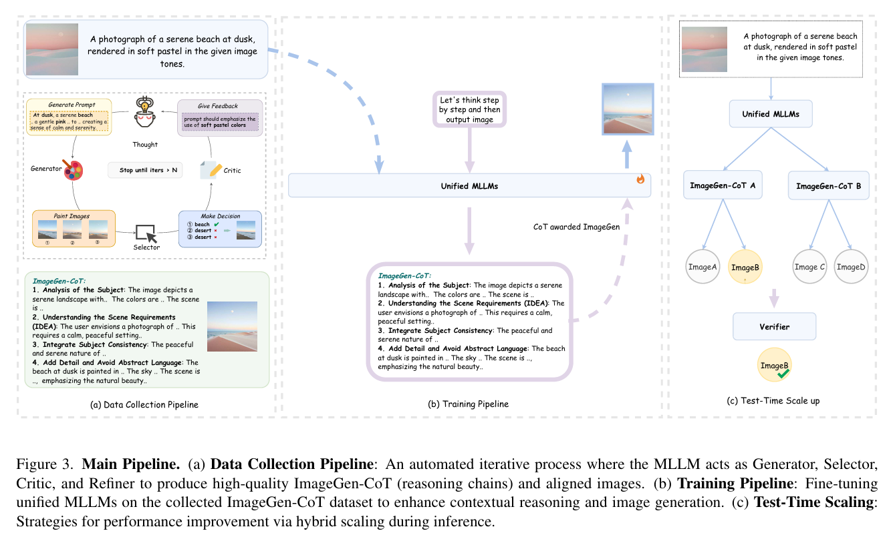
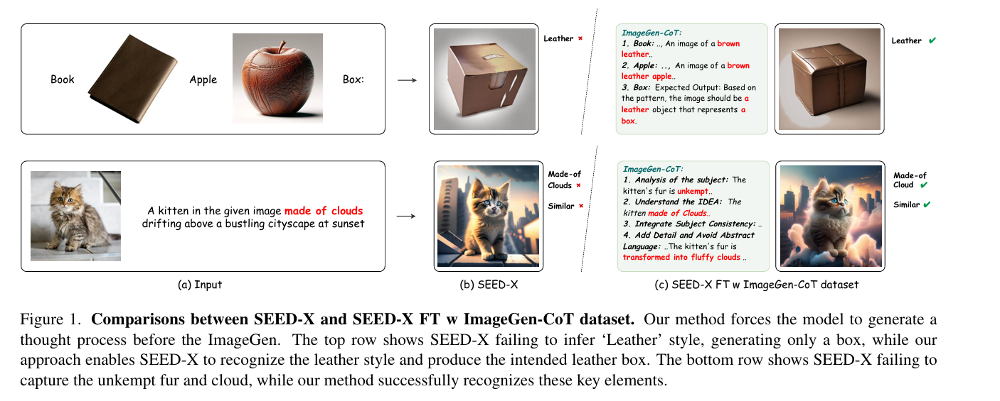

# 目录

## 第一章 Diffusion Model核心基础知识高频考点

### 【一】Diffusion Model核心高频考点

- [1.介绍一下Diffusion Model的原理和本质](#1.介绍一下Diffusion-Model的原理和本质)
- [2.介绍一下Disco Diffusion的原理](#2.介绍一下Disco-Diffusion的原理)
- [3.经典的Pixel Diffusion有哪些？](#3.经典的Pixel-Diffusion有哪些？)
- [4.Diffusion Models和VAE之间有哪些联系和区别？](#4.Diffusion-Models和VAE之间有哪些联系和区别？)
- [5.Diffusion和GAN的区别有哪些？](#5.Diffusion和GAN的区别有哪些？)
- [6.Latent Diffusion相比DDPM有哪些改进?](#6.Latent-Diffusion相比DDPM有哪些改进?)
- [7.介绍一下什么是马尔可夫链](#7.介绍一下什么是马尔可夫链)
- [8.扩散模型中添加的是高斯噪声，能否使用其他噪声的加噪方式？](#8.扩散模型中添加的是高斯噪声，能否使用其他噪声的加噪方式？)
- [9.在Diffusion中常见的条件注入的方法有哪些?Diffusion是如何添加timestep信息的?](#9.在Diffusion中常见的条件注入的方法有哪些?Diffusion是如何添加timestep信息的?)
- [10.训练Diffusion Models的时候，当Loss收敛后是否意味着训练应该结束？](#10.训练Diffusion-Models的时候，当Loss收敛后是否意味着训练应该结束？)
- [11.VAE和Diffusion Models中的变分推断是什么?](#11.VAE和Diffusion-Models中的变分推断是什么?)

### 【二】Diffusion Model的采样（Sample）高频考点

- [1.什么是DDPM，推导公式，实现DDPM需要什么条件？为什么DDPM加噪声的幅度是不一致的？](#1.什么是DDPM，推导公式，实现DDPM需要什么条件？为什么DDPM加噪声的幅度是不一致的？)
- [2.什么是马尔可夫过程?DDPM中的马尔可夫链是如何定义的?](#2.什么是马尔可夫过程?DDPM中的马尔可夫链是如何定义的?)
- [3.DDPM是预测噪声还是预测当前分布？](#3.DDPM是预测噪声还是预测当前分布？)
- [4.为什么DDPM前向过程中前期加噪少,后期加噪多?](#4.为什么DDPM前向过程中前期加噪少,后期加噪多?)
- [5.DDPM存在什么问题？](#5.DDPM存在什么问题？)
- [6.介绍一下DDIM的核心原理](#6.介绍一下DDIM的核心原理)
- [7.DDPM和DDIM的之间的关系？DDIM是怎样加速采样的(简述DDIM的原理)?](#7.DDPM和DDIM的之间的关系？DDIM是怎样加速采样的(简述DDIM的原理)?)
- [8.DDIM是不是确定性生成？为什么？](#8.DDIM是不是确定性生成？为什么？)
- [9.扩散模型有哪些常见的采样方式？其原理是什么样的？（DDPM、DDIM、DPM++、lcm turbo等）](#9.扩散模型有哪些常见的采样方式？其原理是什么样的？（DDPM、DDIM、DPM++、lcm-turbo等）)
- [10.classifier-free guidance和classifier guidance有哪些区别？](#10.classifier-free-guidance和classifier-guidance有哪些区别？)
- [11.什么是noisescheduler?Cos Noisescheduler有什么优点?](#11.什么是noisescheduler?Cos-Noisescheduler有什么优点?)
- [12.为什么扩散模型要对X0步加上的噪声算L2损失？这和Xt-1步的状态有什么联系？](#12.为什么扩散模型要对X0步加上的噪声算L2损失？这和Xt-1步的状态有什么联系？)
- [13.为什么Q_forward过程能够一步写出表达式？重参数化的前提是什么？](#13.为什么Q_forward过程能够一步写出表达式？重参数化的前提是什么？)
- [14.GuidanceScale较大为什么会破坏噪声预测分布?](#14.GuidanceScale较大为什么会破坏噪声预测分布?)
- [15.增加采样步数有什么影响?](#15.增加采样步数有什么影响?)
- [16.常见的采样器有哪些?（Euler、Euler a、DDIM、LMS、LMS Karras、Heun、DPM、UniPC、Karras、PLMS、UniPC、UniPC variant等）](#16.常见的采样器有哪些?（Euler、Euler-a、DDIM、LMS、LMS-Karras、Heun、DPM、UniPC、Karras、PLMS、UniPC、UniPC-variant等）)
- [17.不同采样器之间的区别是什么？如何选择合适的采样器？](#17.不同采样器之间的区别是什么？如何选择合适的采样器？)
- [18.不同采样方法的优缺点是什么？](#18.不同采样方法的优缺点是什么？)
- [19.扩散模型中噪声调度策略的设计原理？](#19.扩散模型中噪声调度策略的设计原理？)

## 第二章 Stable Diffusion 1.5系列核心高频考点

### 【一】Stable Diffusion 1.5基础高频考点

- [1.Stable Diffusion相比Diffusion主要解决的问题是什么？](#1.Stable-Diffusion相比Diffusion主要解决的问题是什么？)
- [2.Stable Diffusion比起经典Diffusion的核心优化是什么？](#2.Stable-Diffusion比起经典Diffusion的核心优化是什么？)
- [3.介绍一下Stable Diffusion的训练/推理过程（正向扩散过程和反向扩散过程）](#3.介绍一下Stable-Diffusion的训练/推理过程（正向扩散过程和反向扩散过程）)
- [4.Stable Diffusion每一轮训练样本选择一个随机时间步长？](#4.Stable-Diffusion每一轮训练样本选择一个随机时间步长？)
- [5.为什么Stable Diffusion可能会出现细节信息失真?](#5.为什么Stable-Diffusion可能会出现细节信息失真?)
- [6.在Stable Diffusion 1.5的经典失败案例中，生成图像中的猫出现头部缺失的问题的本质原因及优化方案？](#6.在Stable-Diffusion-1.5的经典失败案例中，生成图像中的猫出现头部缺失的问题的本质原因及优化方案？)
- [7.介绍一下针对Stable Diffusion的模型融合技术](#7.介绍一下针对Stable-Diffusion的模型融合技术)
- [8.Stable Diffusion中是如何添加时间步timestep信息的?](#8.Stable-Diffusion中是如何添加时间步timestep信息的?)
- [9.为什么Stable Diffusion训练时用DDPM，而采样时用DDIM呢?](#9.为什么Stable-Diffusion训练时用DDPM，而采样时用DDIM呢?)
- [10.SD模型训练时需要设置timesteps=1000，在推理时却只用几十步就可以生成图片？](#10.SD模型训练时需要设置timesteps=1000，在推理时却只用几十步就可以生成图片？)
- [11.SD模型中的CFGClassifier-Free-Guidance的原理？](#11.SD模型中的CFG(Classifier-Free-Guidance)的原理？)
- [12.SD模型中的（negative-prompt）反向提示词如何加入的？](#12.SD模型中的(negative-prompt)反向提示词如何加入的？)
- [13.Stable_Diffusion文本信息是如何控制图像生成的](#13.Stable_Diffusion文本信息是如何控制图像生成的)
- [14.简述Stable_Diffusion核心网络结构](#14.简述Stable_Diffusion核心网络结构)
- [15.文生图和图生图的区别是什么?](#15.文生图和图生图的区别是什么?)
- [16.长宽比分桶训练策略（Aspect Ratio Bucketing）有什么作用?](#16.长宽比分桶训练策略（AspectRatioBucketing）有什么作用?)
- [17.介绍一下长宽比分桶训练策略（Aspect Ratio Bucketing）的具体流程](#17.介绍一下长宽比分桶训练策略（AspectRatioBucketing）的具体流程)
- [18.Stable Diffusion进行模型融合的技巧有哪些？](#18.Stable-Diffusion进行模型融合的技巧有哪些？)


### 【二】Stable Diffusion VAE高频考点

- [1.VAE在Stable Diffusiuon中的作用](#1.VAE在Stable-Diffusiuon中的作用)
- [2.VAE为什么会导致图像变模糊？](#2.VAE为什么会导致图像变模糊？)
- [3.为什么VAE的图像生成效果不好，但是VAE+Diffusion的图像生成效果就很好？](#3.为什么VAE的图像生成效果不好，但是VAE+Diffusion的图像生成效果就很好？)
- [4.SD模型中的VAE和单纯的VAE生成模型的区别是什么？](#4.SD模型中的VAE和单纯的VAE生成模型的区别是什么？)

### 【三】Stable Diffusion Backbone高频考点

- [1.如何将文本与图像的语义信息进行Attention机制，因为Text Condition是三维的，而Latent Feature是四维的？](#1.如何将文本与图像的语义信息进行Attention机制，因为Text-Condition是三维的，而Latent-Feature是四维的？)
- [2.介绍一下Stable Diffusion中的交叉注意力机制](#2.介绍一下Stable-Diffusion中的交叉注意力机制)
- [3.Stable Diffusion中cross_attention的qkv分别是什么？为什么图像隐变量作为q，文本prompt作为kv](#3.Stable-Diffusion中cross_attention的qkv分别是什么？为什么图像隐变量作为q，文本prompt作为kv)
- [4.为什么使用U-Net作为扩散模型的核心架构？](#4.为什么使用U-Net作为扩散模型的核心架构？)
- [5.介绍一下Stable Diffusion中U-Net的架构](#5.介绍一下Stable-Diffusion中U-Net的架构)
- [6.扩散U-Net中的免费午餐（FreeU）是什么？](#6.扩散U-Net中的免费午餐（FreeU）是什么？)


### 【四】Stable Diffusion Text Encoder高频考点

- [1.举例介绍一下Stable Diffusion模型进行文本编码的全过程](#1.举例介绍一下Stable-Diffusion模型进行文本编码的全过程)
- [2.Stable Diffusion如何通过文本来实现对图像生成内容的控制?Stable Diffusion中是如何注入文本信息的?](#2.Stable-Diffusion如何通过文本来实现对图像生成内容的控制?Stable-Diffusion中是如何注入文本信息的?)
- [3.Negative Prompt实现的原理是什么?](#3.Negative-Prompt实现的原理是什么?)
- [4.如何处理Prompt和生成的图像不对齐的问题？](#4.如何处理Prompt和生成的图像不对齐的问题？)
- [5.文本编码器和扩散模型，哪一个模型容量变化对生成的结果影响更大？](#5.文本编码器和扩散模型，哪一个模型容量变化对生成的结果影响更大？)
- [6.扩散模型是如何引入控制条件的？](#6.扩散模型是如何引入控制条件的？)


## 第三章 Stable Diffusion XL核心高频考点

- [1.与Stable Diffusion相比，Stable Diffusion XL的核心优化有哪些？](#1.与Stable-Diffusion相比，Stable-Diffusion-XL的核心优化有哪些？)
- [2.Stable Diffusion XL的VAE部分有哪些创新？详细分析改进意图](#2.Stable-Diffusion-XL的VAE部分有哪些创新？详细分析改进意图)
- [3.Stable Diffusion XL的Backbone部分有哪些创新？详细分析改进意图](#3.Stable-Diffusion-XL的Backbone部分有哪些创新？详细分析改进意图)
- [4.Stable Diffusion XL的Text Encoder部分有哪些创新？详细分析改进意图](#4.Stable-Diffusion-XL的Text-Encoder部分有哪些创新？详细分析改进意图)
- [5.Stable Diffusion XL中使用的训练方法有哪些创新点？](#5.Stable-Diffusion-XL中使用的训练方法有哪些创新点？)
- [6.训练Stable Diffusion XL时为什么要使用offset Noise？](#6.训练Stable-Diffusion-XL时为什么要使用offset-Noise？)
- [7.介绍一下Stable Diffusion XL Turbo的原理](#7.介绍一下Stable-Diffusion-XL-Turbo的原理)
- [8.SDXL-Turbo用的蒸馏方法是什么？](#8.SDXL-Turbo用的蒸馏方法是什么？)
- [9.什么是SDXL Refiner？](#9.什么是SDXL-Refiner？)


## 第四章 Stable Diffusion 3系列核心高频考点

- [1.介绍一下Stable Diffusion 3的整体架构](#1.介绍一下Stable-Diffusion-3的整体架构)
- [2.与Stable Diffusion XL相比，Stable Diffusion 3的核心优化有哪些？](#2.与Stable-Diffusion-XL相比，Stable-Diffusion-3的核心优化有哪些？)
- [3.Stable Diffusion 3的VAE部分有哪些创新？详细分析改进意图](#3.Stable-Diffusion-3的VAE部分有哪些创新？详细分析改进意图)
- [4.Stable Diffusion 3中使用的训练方法有哪些创新点？](#4.Stable-Diffusion-3中使用的训练方法有哪些创新点？)
- [5.Stable Diffusion 3的Backbone部分有哪些创新？详细分析改进意图](#5.Stable-Diffusion-3的Backbone部分有哪些创新？详细分析改进意图)
- [6.Stable Diffusion 3的Text Encoder部分有哪些创新？详细分析改进意图](#6.Stable-Diffusion-3的Text-Encoder部分有哪些创新？详细分析改进意图)
- [7.训练Stable Diffusion过程中官方使用了哪些训练技巧？](#7.训练Stable-Diffusion过程中官方使用了哪些训练技巧？)
- [8.介绍一下Stable Diffusion 3.5系列的原理](#8.介绍一下Stable-Diffusion-3.5系列的原理)
- [9.为什么Stable Diffusion 3使用三个文本编码器?](#9.为什么Stable-Diffusion-3使用三个文本编码器?)
- [10.Stable Diffusion 3中数据标签工程的具体流程是什么样的？](#10.Stable-Diffusion-3中数据标签工程的具体流程是什么样的？)

### 【三】Stable Diffusion VAE高频考点

- [5.SD中潜在一致性模型LCM、LCM-lora加速原理](#5.SD中潜在一致性模型LCM、LCM-lora加速原理)
- [6.正则化技术在AI绘画模型中的作用？](#6.正则化技术在AI绘画模型中的作用？)
- [7.AI生成图像的常用评价指标](#7.AI生成图像的常用评价指标)
- [12.cfg参数的介绍](#12.cfg参数的介绍)
- [21.介绍一下DiT模型的基本概念](#21.介绍一下DiT模型的基本概念)
- [22.DiT输入图像的Patch化过程是什么样的？](#22.DiT输入图像的Patch化过程是什么样的？)
- [23.AI绘画大模型的数据预处理都包含哪些步骤？](#23.AI绘画大模型的数据预处理都包含哪些步骤？)
- [24.AI绘画大模型的训练流程都包含哪些步骤？](#24.AI绘画大模型的训练流程都包含哪些步骤？)
- [25.Scaling Law在AI绘画领域成立吗？](#25.Scaling_Law在AI绘画领域成立吗？)
- [26.Prompt-to-Prompt是什么方法？](#26.Prompt-to-Prompt是什么方法？)
- [27.InstructPix2Pix的训练和推理流程是什么样的？](#27.InstructPix2Pix的训练和推理流程是什么样的？)
- [29.SD3-Turbo用的蒸馏方法是什么？](#29.SD3-Turbo用的蒸馏方法是什么？)
- [30.介绍一下Stable Diffusion 3中的VAE模型](#30.介绍一下Stable-Diffusion-3中的VAE模型)
- [32.AIGC面试中必考的Stable Diffusion系列模型版本有哪些？](#32.AIGC面试中必考的Stable-Diffusion系列模型版本有哪些？)
- [33.AIGC面试中必考的AI绘画技术框架脉络是什么样的？](#33.AIGC面试中必考的AI绘画技术框架脉络是什么样的？)
- [34.Stable Diffusion 3的Text Encoder有哪些改进？](#34.Stable-Diffusion-3的Text-Encoder有哪些改进？)
- [35.Stable Diffusion 3的图像特征和文本特征在训练前缓存策略有哪些优缺点？](#35.Stable-Diffusion-3的图像特征和文本特征在训练前缓存策略有哪些优缺点？)
- [36.Stable Diffusion中的Inpaint和Outpaint分别是什么?](#36.Stable-Diffusion中的Inpaint（局部修复）和Outpaint（边界扩展）分别是什么？)
- [38.Stable Diffusion3.5的改进在哪里？](#38.Stable-Diffusion3.5的改进在哪里?)
- [39.介绍一下FasterDiT(DiT加速版本)](#39.介绍一下FasterDiT)
- [40.介绍一下SiT(DiT加速版本)](#40.介绍一下SiT)
- [41.介绍一下LightningDiT(DiT加速版本)](#41.介绍一下LightningDiT)
- [42.Stable Diffusion中的safety_checker是什么?](#42.StableDiffusion中的safetychecker是什么?)
- [46.什么是REAL（新的评价基准）？](#46.什么是REAL（新的评价基准）？)
- [47.什么是ImageGen-CoT（思维链条）？](#47.什么是ImageGen-CoT（思维链条）？)
- [50.什么是OminGen？](#50.什么是OminGen？)
- [51.介绍一下PAG（Perturbed-Attention Guidance）](#51.介绍一下PAG（Perturbed-Attention-Guidance）)
- [58.主流AI绘画大模型的完整训练流程是什么样的？](#58.主流AI绘画大模型的完整训练流程是什么样的？)
- [62.StableDiffusion的一些加速方法](#62.StableDiffusion的一些加速方法)
- [63.VAE和AE的区别是什么？](#63.VAE和AE的区别是什么？)
- [65.什么是风格漂移？](#65.什么是风格漂移？)
- [68.DMD2蒸馏是怎么做的？](#68.DMD2蒸馏是怎么做的？)

---


## 第一章 Diffusion Model核心基础知识高频考点

### 【一】Diffusion Model核心高频考点

<h2 id="1.介绍一下Diffusion-Model的原理和本质">1.介绍一下Diffusion Model的原理和本质</h2>


<h2 id="2.介绍一下Disco-Diffusion的原理">2.介绍一下Disco Diffusion的原理</h2>


<h2 id="3.经典的Pixel-Diffusion有哪些？">3.经典的Pixel Diffusion有哪些？</h2>


<h2 id="4.Diffusion-Models和VAE之间有哪些联系和区别？">4.Diffusion Models和VAE之间有哪些联系和区别？</h2>


<h2 id="5.Diffusion和GAN的区别有哪些？">5.Diffusion和GAN的区别有哪些？</h2>


<h2 id="6.Latent-Diffusion相比DDPM有哪些改进?">6.Latent Diffusion相比DDPM有哪些改进?</h2>


<h2 id="7.介绍一下什么是马尔可夫链">7.介绍一下什么是马尔可夫链</h2>


<h2 id="8.扩散模型中添加的是高斯噪声，能否使用其他噪声的加噪方式？">8.扩散模型中添加的是高斯噪声，能否使用其他噪声的加噪方式？</h2>


<h2 id="9.在Diffusion中常见的条件注入的方法有哪些?Diffusion是如何添加timestep信息的?">9.在Diffusion中常见的条件注入的方法有哪些?Diffusion是如何添加timestep信息的?</h2>


<h2 id="10.训练Diffusion-Models的时候，当Loss收敛后是否意味着训练应该结束？">10.训练Diffusion-Models的时候，当Loss收敛后是否意味着训练应该结束？</h2>


<h2 id="11.VAE和Diffusion-Models中的变分推断是什么?">11.VAE和Diffusion-Models中的变分推断是什么?</h2>


### 【二】Diffusion Model的采样（Sample）高频考点

<h2 id="1.什么是DDPM，推导公式，实现DDPM需要什么条件？为什么DDPM加噪声的幅度是不一致的？">1.什么是DDPM，推导公式，实现DDPM需要什么条件？为什么DDPM加噪声的幅度是不一致的？</h2>


<h2 id="2.什么是马尔可夫过程?DDPM中的马尔可夫链是如何定义的?">2.什么是马尔可夫过程?DDPM中的马尔可夫链是如何定义的?</h2>


<h2 id="3.DDPM是预测噪声还是预测当前分布？">3.DDPM是预测噪声还是预测当前分布？</h2>


<h2 id="4.为什么DDPM前向过程中前期加噪少,后期加噪多?">4.为什么DDPM前向过程中前期加噪少,后期加噪多?</h2>


<h2 id="5.DDPM存在什么问题？">5.DDPM存在什么问题？</h2>


<h2 id="6.介绍一下DDIM的核心原理">6.介绍一下DDIM的核心原理</h2>

论文链接：https://arxiv.org/pdf/2010.02502.pdf

### 1. 概述

Denoising Diffusion Implicit Models（DDIM）是一种基于Denoising Diffusion Probabilistic Models（DDPM）的改进模型，通过引入非马尔可夫（Non-Markovian）扩散过程来实现更快的样本生成。DDIM在训练过程与DDPM相同，但通过简化生成过程，大大加速了样本的产生速度。


### 2. DDPM与DDIM的对比

DDPM通过模拟马尔可夫链来逐步生成样本，这一过程虽然可以生成高质量的图像，但需要较长的时间。DDIM通过以下方式改进了这一过程：

- **非马尔可夫扩散过程**：DDIM采用非马尔可夫扩散过程，使得生成过程可以是确定性的，而非随机。
- **加速样本生成**：DDIM能够在更短的时间内生成高质量的样本，与DDPM相比，生成速度提升了10倍到50倍。
- **计算与样本质量的权衡**：DDIM允许在计算资源和样本质量之间进行权衡，用户可以根据需要调整生成速度和质量。
- **语义图像插值与重建**：DDIM支持在潜在空间中进行语义有意义的图像插值，并且能够以极低的误差重建观察结果。


<h2 id="7.DDPM和DDIM的之间的关系？DDIM是怎样加速采样的(简述DDIM的原理)?">7.DDPM和DDIM的之间的关系？DDIM是怎样加速采样的(简述DDIM的原理)?</h2>


<h2 id="8.DDIM是不是确定性生成？为什么？">8.DDIM是不是确定性生成？为什么？</h2>


<h2 id="9.扩散模型有哪些常见的采样方式？其原理是什么样的？（DDPM、DDIM、DPM++、lcm-turbo等）">9.扩散模型有哪些常见的采样方式？其原理是什么样的？（DDPM、DDIM、DPM++、lcm turbo等）</h2>


<h2 id="10.classifier-free-guidance和classifier-guidance有哪些区别？">10.classifier-free guidance和classifier guidance有哪些区别？</h2>

在扩散模型的逆向过程中，引导技术被广泛应用于可控生成。目前主要有两种引导技术：分类器引导（Classifier Guidance, CG）和无分类器引导（Classifier-Free Guidance, CFG）。

### 1. 分类器引导（CG）

1. **定义**：CG额外训练一个分类器（如类别标签分类器）来引导逆向过程。

2. **工作原理**：
   
   - 在每个时间步使用类别标签对数似然的梯度来引导：∇xt log pφ(y|xt)
   - 产生条件分数估计
   
3. **公式**：

$$
CG :\tilde{\epsilon}_{\theta}(x_{t},t)\leftarrow\epsilon_{\theta}(x_{t},t)-\sqrt{1-\bar{\alpha}_{t}}\gamma\nabla_{x_{t}}\log p_{\phi}(y|x_{t})
$$

   其中γ是CG比例。

5. **优势**：
   
   - 能够引导生成样本的任何所需属性，前提是有真实标签
   - 在V2A设置中，所需属性指的是音频语义和时间对齐
   
6. **应用示例**：
   如果想从预训练的图像扩散模型生成具有特定属性的图像（如黄发女孩），只需训练一个"黄发女孩"分类器来引导生成过程。

### 2. 无分类器引导（CFG）

1. **定义**：CFG不需要额外的分类器，而是使用条件和无条件分数估计的线性组合来引导逆向过程。

2. **工作原理**：
   - 使用条件c和引导比例ω
   - 在稳定扩散中实现

3. **公式**：

$$
CFG:\quad\tilde{\epsilon}_\theta(x_t,t,c)\leftarrow\omega\epsilon_\theta(x_t,t,c)+(1-\omega)\epsilon_\theta(x_t,t,\varnothing)
$$

   其中ω是CFG比例，c是条件。

5. **特点**：
   - 当ω = 1时，CFG退化为条件分数估计
   - 目前是扩散模型中的主流方法

6. **优势**：
   
   - 不需要训练额外的分类器，实现更简单

### 3. 比较

- CFG是当前扩散模型中的主流方法
- CG提供了根据真实标签引导生成样本特定属性的优势
- 两种方法并不相互排斥，可以结合使用以获得更好的效果

<h2 id="11.什么是noisescheduler?Cos-Noisescheduler有什么优点?">11.什么是noisescheduler?Cos Noisescheduler有什么优点?</h2>


<h2 id="12.为什么扩散模型要对X0步加上的噪声算L2损失？这和Xt-1步的状态有什么联系？">12.为什么扩散模型要对X0步加上的噪声算L2损失？这和Xt-1步的状态有什么联系？</h2>


<h2 id="13.为什么Q_forward过程能够一步写出表达式？重参数化的前提是什么？">13.为什么Q_forward过程能够一步写出表达式？重参数化的前提是什么？</h2>


<h2 id="14.GuidanceScale较大为什么会破坏噪声预测分布?">14.GuidanceScale较大为什么会破坏噪声预测分布?</h2>


<h2 id="15.增加采样步数有什么影响?">15.增加采样步数有什么影响?</h2>


<h2 id="16.常见的采样器有哪些?（Euler、Euler-a、DDIM、LMS、LMS-Karras、Heun、DPM、UniPC、Karras、PLMS、UniPC、UniPC-variant等）">16.常见的采样器有哪些?（Euler、Euler a、DDIM、LMS、LMS Karras、Heun、DPM、UniPC、Karras、PLMS、UniPC、UniPC variant等）</h2>


<h2 id="17.不同采样器之间的区别是什么？如何选择合适的采样器？">17.不同采样器之间的区别是什么？如何选择合适的采样器？</h2>

**主要采样器类型**：

**1. DDPM（原始采样器）**

- 严格遵循训练时的马尔可夫过程
- 需要1000步采样，速度最慢但理论上质量最高

**2. DDIM（确定性采样）**

- 引入确定性采样过程，支持加速
- 20-50步即可获得良好效果
- 同样seed产生相同结果，便于调试

**3. DPM++系列**

- DPM++ 2M：基于二阶求解器，收敛速度快
- DPM++ SDE：引入随机性，增加多样性
- 通常15-25步效果较好

**4. Euler系列**

- Euler a：自适应步长，生成效果富有创意
- Euler：固定步长，结果更稳定
- 适合快速预览，10-20步即可

**5. Heun**

- 基于Heun方法的改进算法
- 在相同步数下通常质量更高，但计算量稍大

**选择建议**：

- **快速预览**：Euler a (10-15步)
- **高质量生成**：DPM++ 2M (20-25步)
- **稳定复现**：DDIM (20-30步)
- **创意探索**：Euler a 或 DPM++ SDE

<h2 id="18.不同采样方法的优缺点是什么？">18.不同采样方法的优缺点是什么？</h2>


<h2 id="19.扩散模型中噪声调度策略的设计原理？">19.扩散模型中噪声调度策略的设计原理？</h2>

**基本概念**：

- **前向过程**：β_t控制每个时间步的噪声添加量
- **方差调度**：定义了从纯数据到纯噪声的渐变过程
- **信噪比**：决定了每个时间步的信息保留程度

**常见调度策略**：

**1. 线性调度（Linear Schedule）**

- β_t从β_1到β_T线性增长
- 简单但在两端过于激进

**2. 余弦调度（Cosine Schedule）**

- 基于余弦函数的平滑变化
- 在数据和噪声端都有更好的平衡
- 公式：α̅_t = cos²(π/2 · t/T)

**3. 平方根调度（Sqrt Schedule）**

- 适用于高分辨率图像生成
- 在早期时间步保留更多信息

**4. 可学习调度**

- 将调度参数作为可训练变量
- 根据数据特性自适应优化

**设计原则**：

- **信息保留**：避免过早丢失关键信息
- **训练稳定性**：确保梯度传播的有效性
- **生成质量**：平衡细节保真度和多样性

不同的噪声调度策略适用于不同类型的数据和应用场景。


## 第二章 Stable Diffusion 1.5系列核心高频考点

### 【一】Stable Diffusion 1.5基础高频考点

<h2 id="1.Stable-Diffusion相比Diffusion主要解决的问题是什么？">1.Stable Diffusion相比Diffusion主要解决的问题是什么？</h2>


<h2 id="2.Stable-Diffusion比起经典Diffusion的核心优化是什么？">2.Stable Diffusion比起经典Diffusion的核心优化是什么？</h2>


<h2 id="3.介绍一下Stable-Diffusion的训练/推理过程（正向扩散过程和反向扩散过程）">3.介绍一下Stable Diffusion的训练/推理过程（正向扩散过程和反向扩散过程）</h2>


<h2 id="4.Stable-Diffusion每一轮训练样本选择一个随机时间步长？">4.Stable Diffusion每一轮训练样本选择一个随机时间步长？</h2>


<h2 id="5.为什么Stable-Diffusion可能会出现细节信息失真?">5.为什么Stable Diffusion可能会出现细节信息失真?</h2>


<h2 id="6.在Stable-Diffusion-1.5的经典失败案例中，生成图像中的猫出现头部缺失的问题的本质原因及优化方案？">6.在Stable Diffusion 1.5的经典失败案例中，生成图像中的猫出现头部缺失的问题的本质原因及优化方案？</h2>


<h2 id="7.介绍一下针对Stable-Diffusion的模型融合技术">7.介绍一下针对Stable Diffusion的模型融合技术</h2>

Stable Diffusion的模型融合主要通过 **Merge Block Weight（块权重融合）** 这种精细化的模型参数整合技术实现，通过分层处理U-Net/Transformer内部不同功能模块层的权重，实现多个Stable Diffusion模型特点优势的定向组合。

### 🔧 一、**核心原理：分层权重插值**

模型融合的目标是合并多个训练好的Stable Diffusion模型（如风格模型+主体模型），生成兼具各方优势的新模型。Merge Block Weight的核心创新在于**分块处理U-Net/Transformer结构**，而非整体融合：
1. **U-Net结构解构**  
   Stable Diffusion的U-Net包含多个功能模块：
   - **ResBlock**：负责基础特征提取与残差连接
   - **Spatial Transformer（Cross-Attention）**：融合文本与图像语义
   - **DownSample/UpSample**：控制特征图分辨率变换
2. **分块独立融合**  
   对每个模块的权重独立计算插值，公式为：
    
   $$
   W_{\text{merged}}^{(i)} = \alpha \cdot W_A^{(i)} + (1 - \alpha) \cdot W_B^{(i)}
   $$
   
   其中 $W_A^{(i)}$ 和 $W_B^{(i)}$ 是待融合模型在模块 $i$ 的权重，$\alpha$ 为该模块的融合系数（0~1）。

### ⚙️ 二、**技术实现流程**
#### 1. **权重归一化（关键预处理）**
   - 目的：解决不同模型参数分布差异导致的融合冲突
   - 方法：对每个模型的权重进行LayerNorm或Min-Max缩放，使其处于相近数值范围

#### 2. **插值算法选择**
   | **算法**       | 适用场景                  | 优势                          | 缺点               |
   |----------------|-------------------------|-----------------------------|-------------------|
   | **线性插值（LERP）** | 简单融合、硬件资源有限     | 计算效率高                    | 可能丢失非线性特征  |
   | **球面线性插值（SLERP）** | 高质量风格融合（如艺术风格） | 保持权重向量方向一致性，避免特征坍缩 | 计算复杂度高 | 

#### 3. **分层系数配置**
   不同模块需设置差异化融合系数，例如：
   - **ResBlock**：$\alpha=0.5$（平衡底层特征）
   - **Spatial Transformer**：$\alpha=0.8$（侧重模型A的文本控制力）
   - **UpSample层**：$\alpha=0.3$（侧重模型B的细节生成能力）

### 💎 总结
Merge Block Weight通过解构U-Net并分层融合权重，实现了模型能力的精准嫁接，成为解决单一模型局限性问题的关键技术。随着Stable Diffusion 3等新架构对多模态权重的分离设计（如MMDiT），模型融合将进一步向**模态感知融合**（Modality-Aware Merging）演进，在艺术创作、工业设计等领域释放更大潜力。


<h2 id="8.Stable-Diffusion中是如何添加时间步timestep信息的?">8.Stable Diffusion中是如何添加时间步timestep信息的?</h2>


<h2 id="9.为什么Stable-Diffusion训练时用DDPM，而采样时用DDIM呢?">9.为什么Stable Diffusion训练时用DDPM，而采样时用DDIM呢?</h2>


<h2 id="10.SD模型训练时需要设置timesteps=1000，在推理时却只用几十步就可以生成图片？">10.SD模型训练时需要设置timesteps=1000，在推理时却只用几十步就可以生成图片？</h2>

目前扩散模型训练一般使用DDPM（Denoising Diffusion Probabilistic Models）采样方法，但推理时可以使用DDIM（Denoising Diffusion Implicit Models）采样方法，DDIM通过去马尔可夫化，大大减少了扩散模型在推理时的步数。


<h2 id="11.SD模型中的CFG(Classifier-Free-Guidance)的原理？">11.SD模型中的CFG(Classifier-Free-Guidance)的原理？ </h2>

### 1. Classifier Guidance：
条件生成只需额外添加一个classifier的梯度来引导。Classifier Guidance 需要训练噪声数据版本的classifier网络，推理时每一步都需要额外计算classifier的梯度。

Classifier Guidance 使用显式的分类器引导条件生成有几个问题：①是需要额外训练一个噪声版本的图像分类器。②是该分类器的质量会影响按类别生成的效果。③是通过梯度更新图像会导致对抗攻击效应，生成图像可能会通过人眼不可察觉的细节欺骗分类器，实际上并没有按条件生成。

### 2. Classifier-Free Guidance:
核心是通过一个隐式分类器来替代显示分类器，而无需直接计算显式分类器及其梯度。根据贝叶斯公式，分类器的梯度可以用条件生成概率和无条件生成概率表示.

把上面的分类器梯度代入到classifier guidance的分类器梯度中可得：

训练时，Classifier-Free Guidance需要训练两个模型，一个是无条件生成模型，另一个是条件生成模型。但这两个模型可以用同一个模型表示，训练时只需要以一定概率将条件置空即可。推理时，最终结果可以由条件生成和无条件生成的线性外推获得，生成效果可以引导系数可以调节，控制生成样本的逼真性和多样性的平衡。


<h2 id="12.SD模型中的(negative-prompt)反向提示词如何加入的？">12.SD模型中的(negative-prompt)反向提示词如何加入的？ </h2>

### 1. 假想方案
容易想到的一个方案是 unet 输出 3 个噪声，分别对应无prompt，positive prompt 和 negative prompt 三种情况，那么最终的噪声就是


理由也很直接，因为 negative prompt 要反方向起作用，所以加个负的系数.

### 2. 真正实现方法

 stable diffusion webui 文档中看到了 negative prompt 真正的[实现方法](https://github.com/AUTOMATIC1111/stable-diffusion-webui/wiki/Negative-prompt)。一句话概况：将无 prompt 的情形替换为 negative prompt，公式则是

 

就是这么简单，其实也很说得通，虽说设计上预期是无 prompt 的，但是没有人拦着你加上 prompt（反向的），公式上可以看出在正向强化positive prompt的同时也反方向强化——也就是弱化了 negative prompt。同时这个方法相对于我想的那个方法还有一个优势就是只需预测 2 个而不是 3 个噪声。可以减少时间复杂度。


<h2 id="13.Stable_Diffusion文本信息是如何控制图像生成的">13.Stable Diffusion文本信息是如何控制图像生成的</h2>

1.文本编码：CLIP Text Encoder模型将输入的文本Prompt进行编码，转换成Text Embeddings（文本的语义信息），由于预训练后CLIP模型输入配对的图片和标签文本，Text Encoder和Image Encoder可以输出相似的embedding向量，所以这里的Text Embeddings可以近似表示所要生成图像的image embedding。

2.CrossAttention模块：在U-net的corssAttention模块中Text Embeddings用来生成K和V，Latent Feature用来生成Q。因为需要文本信息注入到图像信息中里，所以用图片token对文本信息做 Attention实现逐步的文本特征提取和耦合。


<h2 id="14.简述Stable_Diffusion核心网络结构">14.简述Stable Diffusion核心网络结构</h2>

1.CLIP：CLIP模型是一个基于对比学习的多模态模型，主要包含Text Encoder和Image Encoder两个模型。在Stable Diffusion中主要使用了Text Encoder部分。CLIP Text Encoder模型将输入的文本Prompt进行编码，转换成Text Embeddings（文本的语义信息），通过的U-Net网络的CrossAttention模块嵌入Stable Diffusion中作为Condition条件，对生成图像的内容进行一定程度上的控制与引导。

2.VAE：基于Encoder-Decoder架构的生成模型。VAE的Encoder（编码器）结构能将输入图像转换为低维Latent特征，并作为U-Net的输入。VAE的Decoder（解码器）结构能将低维Latent特征重建还原成像素级图像。在Latent空间进行diffusion过程可以大大减少模型的计算量。
U-Net

3.U-net:进行Stable Diffusion模型训练时，VAE部分和CLIP部分都是冻结的，主要是训练U-net的模型参数。U-net结构能够预测噪声残差，并结合Sampling method对输入的特征进行重构，逐步将其从随机高斯噪声转化成图像的Latent Feature.训练损失函数与DDPM一致:
 


<h2 id="15.文生图和图生图的区别是什么?">15.文生图和图生图的区别是什么?</h2>

### 1. 文生图（Text2Image）

文生图是根据文本描述来生成相应图像的过程。这项技术通常用于搜索引擎、图像识别和自然语言处理等领域。在文本到图像的生成流程中，输入是一段描述图像的文本，输出是与文本描述相对应的图像。例如，给定描述“一只可爱的猫咪在玩耍”，模型需要生成一张符合描述的猫咪玩耍的图像。

### 2. 图生图（**image2image**）

图生图则是将一张图像转换为另一张图像的过程,广泛应用于图像修复、风格转换和语义分割等领域。输入为带有特定标注或属性的图像,输出为与输入对应的转换后图像。

### 3. 对比在SD模型中这两种流程的区别

在Stable Diffusion等模型中,图生图是在文生图的基础上增加了图片信息来指导生成,增加了可控性,但减少了多样性。它们虽然都依赖扩散过程,但针对的输入类型不同(文本vs图像)。

图生图生成的初始潜在表示不是随机噪声,而是将初始图像通过自动编码器编码后的潜在表示,再加入高斯噪声。该加噪过程实际是扩散过程,使潜在表示包含随机性,为后续图像转换提供更多可能性。

它们在技术使用上有所重叠,但应用场景有别。文生图更注重多样性和创造力,而图生图则侧重于对现有图像的编辑和转换。


<h2 id="16.长宽比分桶训练策略（AspectRatioBucketing）有什么作用?">16.长宽比分桶训练策略（Aspect Ratio Bucketing）有什么作用?</h2>

目前AI绘画开源社区中很多的LoRA模型和Stable Diffusion模型都是基于**单一图像分辨率**（比如1:1）进行训练的，这就导致当我们想要**生成不同尺寸分辨率的图像**（比如1:2、3:4、4:3、9:16、16:9等）时，**非常容易生成结构崩坏的图像内容**。
如下图所示，**为了让所有的数据满足特定的训练分辨率，会进行中心裁剪和随机裁剪等操作，这就导致图像中人物的重要特征缺失**：


这上面这种情况下，我们训练的LoRA模型和Stable Diffusion模型在生成骑士图像的时候，就会出现缺失的骑士特征。

与此同时，**裁剪后的图像还会导致图像内容与标签内容的不匹配**，比如原本描述图像的标签中含有“皇冠”，但是显然裁剪后的图像中已经不包含皇冠的内容了。

长宽比分桶训练策略（Aspect Ratio Bucketing）就是为了解决上面的问题孕育而生。**长宽比分桶训练策略的本质是多分辨率训练**，就是在LoRA模型的训练过程中采用多分辨率而不是单一分辨率，多分辨率训练技术在传统深度学习时代的目标检测、图像分割、图像分类等领域非常有效，在AIGC时代终于有了新的内涵，在AI绘画领域重新繁荣。


<h2 id="17.介绍一下长宽比分桶训练策略（AspectRatioBucketing）的具体流程">17.介绍一下长宽比分桶训练策略（Aspect Ratio Bucketing）的具体流程</h2>

**AI绘画领域中的长宽比分桶训练策略主要通过数据分桶+多分辨率训练两者结合来实现**。我们设计多个存储桶（Bucket），每个存储桶代表不同的分辨率（比如512x512、768x768、1024x1024等），并将数据存入对应的桶中。在Stable Diffusion模型和LoRA模型训练时，随机选择一个桶，从中采样Batch大小的数据用于多分辨率训练。下面Rocky详细介绍一下完整的流程。

我们先介绍如何对训练数据进行分桶，这里包含**存储桶设计**和**数据存储**两个部分。

首先我们需要设置存储桶（Bucket）的数量和每个存储桶代表的分辨率。我们定义最大的整体图像像素为1024x1024，最大的单边分辨率为1024。

这时我们以64像素为标准，设置长度为1024不变，宽度以1024为起点，根据数据集中的最小宽度设计存储桶（假设为512），具体流程如下所示：

```
设置长度为 1024，设置宽度为 1024
设置桶数量为 0
当宽度大于数据集最小宽度 512 时:
    宽度 = 宽度 - 64 （ 960 ）
    那么 （ 960 ， 1024 ）作为一个存储桶的分辨率
    以此类推设计出长度不变，宽度持续自适应的存储桶
```

按照上面的流程，我们可以获得如下的存储桶：

```
bucket 0 (512, 1024)
bucket 1 (576, 1024)
bucket 2 (640, 1024)
bucket 3 (704, 1024)
bucket 4 (768, 1024)
bucket 5 (832, 1024)
bucket 6 (896, 1024)
bucket 7 (960, 1024)
```

接着我们再以64像素为标准，设置宽度为1024不变，长度以1024为起点，根据数据集中的最小长度设计存储桶（假设为512），按照上面相同的规则，设计对应的存储桶：

```
bucket 8 (1024, 512)
bucket 9 (1024, 576)
bucket 10 (1024, 640)
bucket 11 (1024, 704)
bucket 12 (1024, 768)
bucket 13 (1024, 832)
bucket 14 (1024, 896)
bucket 15 (1024, 960)
```

最后我们再将1024x1024分辨率作为一个存储桶添加到分桶列表中，从而获得完整的分桶列表：

```
bucket 0 (512, 1024)
bucket 1 (576, 1024)
bucket 2 (640, 1024)
bucket 3 (704, 1024)
bucket 4 (768, 1024)
bucket 5 (832, 1024)
bucket 6 (896, 1024)
bucket 7 (960, 1024)
bucket 8 (1024, 512)
bucket 9 (1024, 576)
bucket 10 (1024, 640)
bucket 11 (1024, 704)
bucket 12 (1024, 768)
bucket 13 (1024, 832)
bucket 14 (1024, 896)
bucket 15 (1024, 960)
bucket 16 (1024, 1024)
```

完成了分桶的数量与分辨率设计，我们接下来要做的是**将数据集中的图片存储到对应的存储桶中**。

那么，具体是如何将不同分辨率的图片放入对应的桶中呢？

我们首先计算存储桶分辨率的长宽比，对于数据集中的每个图像，我们也计算其长宽比。这时我们将长宽比最接近的数据与存储桶进行匹配，并将图像存入对应的存储桶中，下面的计算过程代表寻找与数据长宽比最接近的存储桶：

$$ \text{image-bucket} = argmin(abs(\text{bucket-aspects} — \text{image-aspect})) $$

**如果图像的长宽比与最匹配的存储桶的长宽比差异依然非常大，则从数据集中删除该图像。所以我们最好在数据分桶前将数据进行精细化筛选，增加数据的利用率。**

当image_aspect与bucket_aspects完全一致时，可以直接将图片放入对应的存储桶中；当image_aspect与bucket_aspects不一致时，需要对图片进行中心裁剪，获得与存储桶一致的长宽比，再放入存储桶中。中心裁剪的过程如下图所示：


由于我们以经做了精细化的存储桶设计，所以**出现长宽比不匹配时的图像裁剪比例一般小于0.033，只去除了小于32像素的实际图像内容，所以对训练影响不大**。

在完成数据的分桶存储后，**接下来Rocky再讲解一下在训练过程中如何基于存储桶实现多分辨率训练过程**。

在Stable Diffusion模型和LoRA模型的训练过程中，我们需要从刚才设计的16个存储桶中**随机采样一个存储桶**，并且**确保每次能够提供一个完整的Batch数据**。当遇到选择的存储桶中数据数量不够Batch大小的情况，需要进行**特定的数据补充策略**。

为了解决上述的问题，我们需要维护一个**公共桶**（remaining bucket），其他存储桶中的数据量不足Batch大小时，将剩余的数据全部放到这个公共桶中。在每次迭代的时候，如果是从常规存储桶中取出数据，则训练分辨率调整成存储桶对应的分辨率。如果是从公共桶中取出，则训练分辨率调整成设计分桶时的基础分辨率，也就是1024x1024。

**同时我们将所有的存储桶根据桶中数据量进行权重设置，具体的权重计算方式为这个存储桶的数据量除以所有剩余存储桶的数据量总和**。如果不通过权重来选择存储存储桶，数据量小的存储桶会在训练过程的早期就被用完，而数据量最大的存储桶会在训练结束时仍然存在，**这就会导致存储桶在整个训练周期中采样不均衡问题**。通过按数据量加权选择桶可以避免这种情况。


<h2 id="18.Stable-Diffusion进行模型融合的技巧有哪些？">18.Stable Diffusion进行模型融合的技巧有哪些？</h2>

我们在进行几个Stable Diffusion的融合时，可以调整U-Net架构中每一层模型的融合权重，从而能够进行模型融合的进阶整合：

在MBW插件中，将U-Net分层了25个可调层，开源社区将其分为:
IN区：有12层
M区：有1层
OUT区：有12层

IN区影响下采样过程对特征的提取，层数从00到11，感受野越来越大，影响的程度越来越大。IN区块负责平面构成的相关工作（构图元素以及生成图像背景），特别是6-11层，总的来说层数越高影响效果越明显，更改层数越多影响效果越明显。比如：各个物体的大小、位置以及基本轮廓。其中在画面中占比越小的物体受到越浅层的参数控制，占比大的物体受到更深层的参数控制。浅层权重越高，小物体的表现效果就越向该模型靠拢；深层权重越高，较大物体的表现效果就越向该模型靠拢。

OUT区影响上采样过程对特征进行还原，层数从00到11，感受野越来越小，影响的程度越来越小。OUT区块负责色彩构成和画风的相关工作，主要是0-4层起核心作用，同时如果是人物图像，2-7层可以控制脸部的微调。

在IN区中编号越高，对平面构成的影响就越偏向大体。在OUT区中，编号越高，对细化过程的影响就越局域化，对上色过程的影响就越大体化。比如：基本色调，色彩丰富或单一，皮肤质感，光影，线条。深层参数负责大区域的色彩，比如基本色调、色彩丰富度与光影；浅层参数负责细节的色彩，比如线条是否清晰，通过浅层可以调整手指；深层与浅层之间的中层则负责区域的色彩，区域内色彩的不同变化程度可以体现出不同的皮肤质感和区域光影效果。

同时如果IN层和OUT层只改变其中的某一层，几乎不会产生影响效果。

M区：影响最大的一层，甚至比IN11层的影响更大，起到了类似IN层的作用，可以看作IN12层，但也只能起到一层的作用，不如IN层中多层叠加后的影响大。该层越大，构图越向该模型靠拢。


### 【二】Stable Diffusion VAE高频考点

<h2 id="1.VAE在Stable-Diffusiuon中的作用">1.VAE在Stable Diffusiuon中的作用</h2>


<h2 id="2.VAE为什么会导致图像变模糊？">2.VAE为什么会导致图像变模糊？</h2>


<h2 id="3.为什么VAE的图像生成效果不好，但是VAE+Diffusion的图像生成效果就很好？">3.为什么VAE的图像生成效果不好，但是VAE+Diffusion的图像生成效果就很好？</h2>

**这个问题最本质的回答是：传统深度学习时代的VAE是单独作为生成模型；而在AIGC时代，VAE只是作为特征编码器，提供特征给Diffusion用于图像的生成。其实两者的本质作用已经发生改变。**

同时传统深度学习时代的VAE的重构损失只使用了平方误差，而Stable Diffusion中的VAE使用了平方误差 + Perceptual损失 + 对抗损失。在正则项方面，传统深度学习时代的VAE使用了完整的KL散度项，而Stable Diffusion中的VAE使用了弱化的KL散度项。同时传统深度学习时代的VAE将图像压缩成单个向量，而Stable Diffusion中的VAE则将图像压缩成一个 $N\times M$ 的特征矩阵。

上述的差别都导致了传统深度学习时代的VAE生成效果不佳。

<h2 id="4.SD模型中的VAE和单纯的VAE生成模型的区别是什么？">4.SD模型中的VAE和单纯的VAE生成模型的区别是什么？</h2>

### 传统VAE生成模型

- **完整的生成系统**：从噪声直接生成数据
- **核心机制**：变分推断 + 重参数化技巧
- **目标**：学习数据分布，实现无条件生成
- **挑战**：生成质量与多样性的平衡

### SD模型中的VAE

- **功能组件**：数据压缩器和重建器
- **核心作用**：将图像压缩到潜在空间，降低计算成本
- **目标**：高保真度重建，为扩散过程提供高效空间
- **优势**：专注重建质量，与扩散模型协同工作


### 【三】Stable Diffusion Backbone高频考点

<h2 id="1.如何将文本与图像的语义信息进行Attention机制，因为Text-Condition是三维的，而Latent-Feature是四维的？">1.如何将文本与图像的语义信息进行Attention机制，因为Text Condition是三维的，而Latent Feature是四维的？ </h2>


<h2 id="2.介绍一下Stable-Diffusion中的交叉注意力机制">2.介绍一下Stable Diffusion中的交叉注意力机制 </h2>

### 1. 简介
属于Transformer常见Attention机制，用于合并两个不同的sequence embedding。两个sequence是：Query、Key/Value。
Cross-Attention和Self-Attention的计算过程一致，区别在于输入的差别，通过上图可以看出，两个embedding的sequence length 和embedding_dim都不一样，故具备更好的扩展性，能够融合两个不同的维度向量，进行信息的计算交互。而Self-Attention的输入仅为一个。

### 2. 作用
Cross-Attention可以用于将图像与文本之间的关联建立，在stable-diffusion中的Unet部分使用Cross-Attention将文本prompt和图像信息融合交互，控制U-Net把噪声矩阵的某一块与文本里的特定信息相对应。


<h2 id="3.Stable-Diffusion中cross_attention的qkv分别是什么？为什么图像隐变量作为q，文本prompt作为kv">3.Stable Diffusion中cross_attention的qkv分别是什么？为什么图像隐变量作为q，文本prompt作为kv </h2>


<h2 id="4.为什么使用U-Net作为扩散模型的核心架构？">4.为什么使用U-Net作为扩散模型的核心架构？ </h2>


<h2 id="5.介绍一下Stable-Diffusion中U-Net的架构">5.介绍一下Stable Diffusion中U-Net的架构 </h2>

### 1. U-Net的结构具有以下特点：

- **整体结构**：U-Net由多个大层组成。在每个大层中，特征首先通过下采样变为更小尺寸的特征，然后通过上采样恢复到原来的尺寸，形成一个U形的结构。
- **特征通道变化**：在下采样过程中，特征图的尺寸减半，但通道数翻倍；上采样过程则相反。
- **信息保留机制**：为了防止在下采样过程中丢失信息，UNet的每个大层在下采样前的输出会被拼接到相应的大层上采样时的输入上，这类似于ResNet中的“shortcut”.


​	U-Net 具有编码器部分和解码器部分，均由 ResNet 块组成。编码器将图像表示压缩为较低分辨率图像表示，并且解码器将较低分辨率图像表示解码回据称噪声较小的原始较高分辨率图像表示。更具体地说，U-Net 输出预测噪声残差，该噪声残差可用于计算预测的去噪图像表示。为了防止U-Net在下采样时丢失重要信息，通常在编码器的下采样ResNet和解码器的上采样ResNet之间添加快捷连接。

​	Stable Diffusion的U-Net 能够通过交叉注意力层在文本嵌入上调节其输出。交叉注意力层被添加到 U-Net 的编码器和解码器部分，通常位于 ResNet 块之间。


<h2 id="6.扩散U-Net中的免费午餐（FreeU）是什么？">6.扩散U-Net中的免费午餐（FreeU）是什么？</h2>

论文链接：[[2309.11497\] FreeU: Free Lunch in Diffusion U-Net](https://arxiv.org/abs/2309.11497)

FreeU (Free Lunch in Diffusion U-Net) 是一种针对扩散模型中U-Net架构的增强方法，旨在提升生成质量而无需额外训练或计算成本。其核心原理通过对U-Net的主干网络与跳跃连接的特征贡献进行动态平衡，优化去噪过程。

### 框架设计


**核心问题**

作者通过分析U-Net在扩散模型中的作用，发现：

- **主干网络（Backbone）**：主要负责去噪任务，但可能因权重分配问题未能完全发挥潜力 。
- **跳跃连接（Skip Connections）**：主要向解码器引入高频特征（如细节纹理），但在某些情况下会干扰主干网络的去噪能力 。

**改进策略**
 FreeU通过引入两个可调节的缩放因子：

- **主干特征缩放因子**：增强主干网络输出的特征，强化去噪能力。
- **跳跃特征缩放因子**：抑制跳跃连接引入的高频噪声，同时保留必要的细节 。

### 原理分析

1. **频域视角**
   通过傅里叶分析发现：
   - 扩散模型的去噪过程中，高频成分波动更剧烈，可能导致噪声残留 。
   - FreeU通过调整跳跃连接的特征权重，显著减少了去噪过程中的高频干扰 。
2. **特征图可视化**
   实验表明：
   - 使用FreeU的特征图包含更清晰的结构信息，表明主干网络的去噪有效性提升 。
   - 高放大倍率下，模型能同步保留细节与整体结构（如毛发纹理和物体轮廓）。
3. **兼容性设计**
    FreeU不修改模型参数，可直接集成至Stable Diffusion、ControlNet等主流框架，且在图像/视频生成、微调模型（如Dreambooth）中均有效，无额外计算开销。


### 【四】Stable Diffusion Text Encoder高频考点

<h2 id="1.举例介绍一下Stable-Diffusion模型进行文本编码的全过程">1.举例介绍一下Stable Diffusion模型进行文本编码的全过程</h2>


<h2 id="2.Stable-Diffusion如何通过文本来实现对图像生成内容的控制?Stable-Diffusion中是如何注入文本信息的?">2.Stable Diffusion如何通过文本来实现对图像生成内容的控制?Stable Diffusion中是如何注入文本信息的?</h2>


<h2 id="3.Negative-Prompt实现的原理是什么?">3.Negative Prompt实现的原理是什么?</h2>


<h2 id="4.如何处理Prompt和生成的图像不对齐的问题？">4.如何处理Prompt和生成的图像不对齐的问题？</h2>


<h2 id="4.如何处理Prompt和生成的图像不对齐的问题？">4.如何处理Prompt和生成的图像不对齐的问题？</h2>


<h2 id="5.文本编码器和扩散模型，哪一个模型容量变化对生成的结果影响更大？">5.文本编码器和扩散模型，哪一个模型容量变化对生成的结果影响更大？</h2>


<h2 id="6.扩散模型是如何引入控制条件的？">6.扩散模型是如何引入控制条件的？</h2>

在现代扩散模型中，引入控制条件的方式主要分为两大类：**采样阶段的引导（Guidance）与网络结构级的条件融合（Architectural Conditioning）**。前者通过调整去噪过程中的梯度方向，在不改动模型参数的前提下实现条件控制；后者则在模型内部直接注入额外信息，包括跨注意力（Cross‐Attention）和时间嵌入（Time Embedding）的多路拼接。下面我们将从这两大类出发，详细介绍包括交叉注意力注入、时间步嵌入拼接、类别嵌入拼接以及 ControlNet 等多种常见的条件引入技术。

### 一、采样阶段的引导方法

#### 1.1 分类器引导（Classifier Guidance）

- **原理**：额外训练一个图像分类器，对去噪过程中的中间图像计算类别概率梯度 ∇log p(y|x)，并将其与扩散模型的去噪梯度相加，以朝着目标类别 y 的方向更强地去噪。
- **特点**：无需改变原扩散模型结构，可后期直接应用；但需额外训练分类器，且计算开销较大。

#### 1.2 无分类器引导（Classifier‐Free Guidance）

- **原理**：在同一模型中联合训练“有条件”（带 y 输入）与“无条件”（不带 y）的分支，采样时按比例 s 调整两者的去噪预测：
  $$
  \hat{\epsilon}=\left(1+s\right)\epsilon_{\mathrm{cond}}-s\:\epsilon_{\mathrm{uncond}}.
  $$
  通过增大 s，可在样本质量与多样性间权衡。

- **优势**：无需单独训练分类器，已成为文本到图像任务的主流引导策略。

### 二、网络结构级的条件融合

#### 2.1 跨注意力（Cross‐Attention）注入

- **文本到图像**：在每个 U-Net 模块的中间，使用跨注意力层将文本嵌入（如 CLIP 编码）作为键/值，图像特征作为查询，实现与自然语言条件的交互。
- **多模态扩展**：可将其它概念 token（如布局、分割图等）也作为条件序列，通过相同机制注入，支持更灵活的条件输入。

#### 2.2 时间步嵌入（Time Embedding）拼接

- **位置编码**：采用类似 Transformer 的正余弦编码映射时间步 t 到向量 pos(t)，然后通过线性层得到时间嵌入。
- **融合方式**：除常见的**加法融合**外，也可将时间嵌入与其它条件（如类别 embedding 或空间特征）在通道维度上**拼接**，再一起输入至卷积层或注意力模块中。

#### 2.3 类别嵌入（Class Embedding）拼接

- **方法**：将类别 embedding（CEN）在每层噪声估计器（noise estimator）中与特征张量**串联**（concatenate），使得扩散的重建过程同时感知图像内容与类别信息。
- **效果**：在多类别生成任务中，可显著提升类别一致性，同时保持图像质量。

#### 2.4 ControlNet：条件分支并行注入

- **原理**：在预训练 U-Net 的每个编码器层复制一份“可训练”分支，并通过零初始化卷积（ZeroConv）接收额外条件（如边缘图、深度图），其输出再**加回**主干层，确保不破坏原模型能力。
- **应用**：广泛用于 Stable Diffusion，为图像生成提供细粒度空间控制，如姿态、分割或布局指令。

### 三、其他控制技术

- **Cross‐Attention Score 调整**：在生成时对跨注意力分数进行训练无关的修改，以强化局部概念在图像中的表现，同时避免语义混合（concept bleeding）。
- **CFG++等高级引导**：在无分类器引导基础上优化 off-manifold 轨迹，提升高引导尺度下的可逆性与样本质量。


## 第三章 Stable Diffusion XL核心高频考点

<h2 id="1.与Stable-Diffusion相比，Stable-Diffusion-XL的核心优化有哪些？">1.与Stable Diffusion相比，Stable Diffusion XL的核心优化有哪些？ </h2>

1、模型参数更大。SDXL 基础模型所使用的 Unet 包含了2.6B（26亿）的参数，对比 SD1.5的 860M（8600万），相差超过三倍。因此从模型参数来看，SDXL 相比 SD 有显著优势。

2、语义理解能力更强。使用了两个 CLIP 模型的组合，包括 OpenClip 最大的模型 ViT-G/14 和在 SD v1 中使用的 CLIP ViT-L，既保证了对旧提示词的兼容，也提高了 SDXL 对语言的理解能力

3、训练数据库更大。由于 SDXL 将图片尺寸也作为指导参数，因此可以使用更低分辨率的图片作为训练数据，比如小于256x256分辨率的图片。如果没有这项改进，数据库中高达39%的图片都不能用来训练 SDXL，原因是其分辨率过低。但通过改进训练方法，将图片尺寸也作为训练参数，大大扩展了训练 SDXL 的图片数量，这样训练出来的模型具有更强的性能表现。

4、生图流程改进。SDXL 采用的是两阶段生图，第一阶段使用 base model（基础模型）生成，第二阶段则使用 refiner model（细化模型）进一步提升画面的细节表现。当然只使用 SDXL 基础模型进行绘图也是可以的。


<h2 id="2.Stable-Diffusion-XL的VAE部分有哪些创新？详细分析改进意图">2.Stable Diffusion XL的VAE部分有哪些创新？详细分析改进意图 </h2>


<h2 id="3.Stable-Diffusion-XL的Backbone部分有哪些创新？详细分析改进意图">3.Stable Diffusion XL的Backbone部分有哪些创新？详细分析改进意图 </h2>


<h2 id="4.Stable-Diffusion-XL的Text-Encoder部分有哪些创新？详细分析改进意图">4.Stable Diffusion XL的Text Encoder部分有哪些创新？详细分析改进意图 </h2>


<h2 id="5.Stable-Diffusion-XL中使用的训练方法有哪些创新点？">5.Stable Diffusion XL中使用的训练方法有哪些创新点？ </h2>


<h2 id="6.训练Stable-Diffusion-XL时为什么要使用offset-Noise？">6.训练Stable Diffusion XL时为什么要使用offset Noise？ </h2>


<h2 id="7.介绍一下Stable-Diffusion-XL-Turbo的原理">7.介绍一下Stable Diffusion XL Turbo的原理 </h2>


<h2 id="8.SDXL-Turbo用的蒸馏方法是什么？">8.SDXL-Turbo用的蒸馏方法是什么？</h2>

论文链接：[adversarial_diffusion_distillation.pdf](https://static1.squarespace.com/static/6213c340453c3f502425776e/t/65663480a92fba51d0e1023f/1701197769659/adversarial_diffusion_distillation.pdf)

### 方法结构

ADD 模型的结构包括三个核心组件：

1. **ADD 学生模型 (Student Model)**：这是一个预训练的扩散模型，负责生成图像样本。
2. **判别器 (Discriminator)**：用来区分生成的样本和真实图像，通过对抗性训练来提升生成图像的真实感。
3. **DM 教师模型 (Teacher Model)**：这是一个冻结权重的扩散模型，作为知识的教师，为学生模型提供目标图像来实现知识蒸馏。


### 核心原理

ADD 的核心原理是通过两个损失函数的结合实现蒸馏过程：

1. **对抗性损失 (Adversarial Loss)**：学生模型生成的样本被输入判别器，判别器尝试将生成的样本与真实图像区分开。学生模型则优化生成图像，使其更难被判别器检测到为假，从而提升图像的细节和逼真度。
2. **蒸馏损失 (Distillation Loss)**：ADD 使用另一个扩散模型作为教师模型，并通过蒸馏损失指导学生模型生成与教师模型相似的图像。教师模型对学生生成的噪声数据进行去噪，从而提供高质量的生成目标。这样，学生模型能够利用教师模型的大量知识来保持生成图像的质量和一致性

ADD 模型具有以下优势：

- **高速生成**：仅需 1-4 步采样即可生成高质量图像，显著减少了生成时间，适用于实时应用。
- **高质量图像**：通过结合对抗性损失和蒸馏损失，生成的图像在细节和逼真度上优于现有的快速生成模型，如单步 GAN 和一些少步扩散模型。
- **灵活性**：支持进一步的多步采样，从而在单步生成的基础上通过迭代增强图像细节。


<h2 id="9.什么是SDXL-Refiner？">9.什么是SDXL Refiner？</h2>

SDXL Refiner是Stability AI推出的图像精细化模型，作为SDXL生态系统的第二阶段，专门负责提升图像细节质量。它采用了"专家集成"的设计理念：Base模型生成基础结构，Refiner模型优化细节表现。


### 核心工作原理

#### 两种使用方式

1. **标准流程**：Base模型完成80%去噪 → Refiner完成剩余20%精细化
2. **SDEdit流程**：Base生成完整图像 → Refiner使用img2img技术优化

### 技术特点

- **双文本编码器**：OpenCLIP-ViT/G + CLIP-ViT/L，提供更好的语义理解
- **专门优化**：针对低噪声水平的去噪过程进行特殊训练
- **参数规模**：6.06B参数，专注于细节增强

### 性能提升

根据官方评测，SDXL Base + Refiner的组合相比之前版本：

- 用户偏好度达到91%（远超SD 1.5/2.1）

- 细节清晰度提升约20-30%

- 整体图像质量显著改善

- 

  SDXL Refiner通过专门的精细化设计，成功解决了AI图像生成中的细节问题。它与Base模型的配合使用，让SDXL成为目前最优秀的开源图像生成方案之一。对于追求高质量图像输出的用户，Refiner是不可或缺的工具。


## 第四章 Stable Diffusion 3系列核心高频考点

<h2 id="1.介绍一下Stable-Diffusion-3的整体架构">1.介绍一下Stable Diffusion 3的整体架构 </h2>


<h2 id="2.与Stable-Diffusion-XL相比，Stable-Diffusion-3的核心优化有哪些？">2.与Stable Diffusion XL相比，Stable Diffusion 3的核心优化有哪些？ </h2>

Rocky认为Stable Diffusion 3的价值和传统深度学习时代的“YOLOv4”一样，在AIGC时代的工业界、应用界、竞赛界以及学术界，都有非常大的学习借鉴价值，以下是SD 3相比之前系列的改进点汇总：

1. 使用多模态DiT作为扩散模型核心：多模态DiT（MM-DiT）将图像的Latent tokens和文本的tokens拼接在一起，并采用两套独立的权重处理，但是在进行Attention机制时统一处理。
2. 改进VAE：通过增加VAE通道数来提升图像的重建质量。
3. 3个文本编码器：SD 3中使用了三个文本编码器，分别是CLIP ViT-L（参数量约124M）、OpenCLIP ViT-bigG（参数量约695M）和T5-XXL encoder（参数量约4.7B）。
4. 采用优化的Rectified Flow：采用Rectified Flow来作为SD 3的采样方法，并在此基础上通过对中间时间步加权能进一步提升效果。
5. 采用QK-Normalization：当模型变大，而且在高分辨率图像上训练时，attention层的attention-logit（Q和K的矩阵乘）会变得不稳定，导致训练出现NAN，为了提升混合精度训练的稳定性，MM-DiT的self-attention层采用了QK-Normalization。
6. 多尺寸位置编码：SD 3会先在256x256尺寸下预训练，再以1024x1024为中心的多尺度上进行微调，这就需要MM-DiT的位置编码需要支持多尺度。
7. timestep schedule进行shift：对高分辨率的图像，如果采用和低分辨率图像的一样的noise schedule，会出现对图像的破坏不够的情况，所以SD 3中对noise schedule进行了偏移。
8. 强大的模型Scaling能力：SD 3中因为核心使用了transformer架构，所以有很强的scaling能力，当模型变大后，性能稳步提升。
9. 训练细节：数据预处理（去除离群点数据、去除低质量数据、去除NSFW数据）、图像Caption精细化、预计算图像和文本特征、Classifier-Free Guidance技术、DPO（Direct Preference Optimization）技术


<h2 id="3.Stable-Diffusion-3的VAE部分有哪些创新？详细分析改进意图">3.Stable Diffusion 3的VAE部分有哪些创新？详细分析改进意图 </h2>


<h2 id="4.Stable-Diffusion-3中使用的训练方法有哪些创新点？">4.Stable Diffusion 3中使用的训练方法有哪些创新点？ </h2>


<h2 id="5.Stable-Diffusion-3的Backbone部分有哪些创新？详细分析改进意图">5.Stable Diffusion 3的Backbone部分有哪些创新？详细分析改进意图 </h2>


<h2 id="6.Stable-Diffusion-3的Text-Encoder部分有哪些创新？详细分析改进意图">6.Stable Diffusion 3的Text Encoder部分有哪些创新？详细分析改进意图 </h2>


<h2 id="7.训练Stable-Diffusion过程中官方使用了哪些训练技巧？">7.训练Stable Diffusion过程中官方使用了哪些训练技巧？ </h2>


<h2 id="8.介绍一下Stable-Diffusion-3.5系列的原理">8.介绍一下Stable Diffusion 3.5系列的原理 </h2>


<h2 id="9.为什么Stable-Diffusion-3使用三个文本编码器?">9.为什么Stable Diffusion 3使用三个文本编码器?</h2>

Stable Diffusion 3作为一款先进的文本到图像模型,采用了三重文本编码器的方法。这一设计选择显著提升了模型的性能和灵活性。


### 1. 三个文本编码器

Stable Diffusion 3使用以下三个文本编码器:

1. CLIP-L/14
2. CLIP-G/14
3. T5 XXL

### 2. 使用多个文本编码器的原因

#### 2.1 提升性能

使用多个文本编码器的主要动机是提高整体模型性能。通过组合不同的编码器,模型能够捕捉更广泛的文本细微差别和语义信息,从而实现更准确和多样化的图像生成。

#### 2.2 推理时的灵活性

多个文本编码器的使用在推理阶段提供了更大的灵活性。模型可以使用三个编码器的任意子集,从而在性能和计算效率之间进行权衡。

#### 2.3 通过dropout增强鲁棒性

在训练过程中,每个编码器都有46.3%的独立dropout率。这种高dropout率鼓励模型从不同的编码器组合中学习,使其更加鲁棒和适应性强。

### 3. 各个编码器的影响

#### 3.1 CLIP编码器(CLIP-L/14和OpenCLIP-G/14)

- 这些编码器对大多数文本到图像任务至关重要。
- 它们在广泛的提示范围内提供强大的性能。

#### 3.2 T5 XXL编码器

- 虽然对复杂提示很重要,但其移除的影响较小:
  - 对美学质量评分没有影响(人类偏好评估中50%的胜率)
  
  - 对提示遵循性有轻微影响(46%的胜率)
  
  - 对生成书面文本的能力有显著贡献(38%的胜率)
  
    （胜率是完整版对比其他模型的效果，下图是对比其他模型以及不使用T5的sd3的胜率图）
  
    

### 3.3 实际应用

1. **内存效率**: 用户可以在大多数提示中选择排除T5 XXL编码器(拥有47亿参数),而不会造成显著的性能损失,从而节省大量显存。

2. **任务特定优化**: 对于涉及复杂描述或大量书面文本的任务,包含T5 XXL编码器可以提供明显的改进。

3. **可扩展性**: 多编码器方法允许在模型的未来迭代中轻松集成新的或改进的文本编码器。


<h2 id="10.Stable-Diffusion-3中数据标签工程的具体流程是什么样的？">10.Stable Diffusion 3中数据标签工程的具体流程是什么样的？</h2>

**目前AI绘画大模型存在一个很大的问题是模型的文本理解能力不强**，主要是指AI绘画大模型生成的图像和输入文本Prompt的一致性不高。举个例子，如果说输入的文本Prompt非常精细复杂，那么生成的图像内容可能会缺失这些精细的信息，导致图像与文本的内容不一致。这也是AI绘画大模型Prompt Following能力的体现。

产生这个问题归根结底还是由训练数据集本身所造成的，**更本质说就是图像Caption标注太过粗糙**。

SD 3借鉴了DALL-E 3的数据标注方法，使用**多模态大模型CogVLM**来对训练数据集中的图像生成高质量的Caption标签。

**目前来说，DALL-E 3的数据标注方法已经成为AI绘画领域的主流标注方法，很多先进的AI绘画大模型都使用了这套标签精细化的方法**。

这套数据标签精细化方法的主要流程如下：

1. 首先整理数据集和对应的原始标签。
2. 接着使用CogVLM多模态大模型对原始标签进行优化扩写，获得长Caption标签。
3. 在SD 3的训练中使用50%的长Caption标签+50%的原始标签混合训练的方式，提升SD 3模型的整体性能，同时标签的混合使用也是对模型进行正则的一种方式。

具体效果如下所示：


### 【三】Stable Diffusion VAE高频考点

<h2 id="5.SD中潜在一致性模型LCM、LCM-lora加速原理">5.SD中潜在一致性模型LCM、LCM-lora加速原理 </h2>

### 1. CM模型：
OpenAI 的宋飏博士提出的一致性模型（Consistency Model，CM）为解决多步采样问题提供了一个思路。一致性模型并不依赖于预训练的扩散模型，是一种独立的新型生成模型。一致性函数f的核心为这样一个性质：对于任意一个输入xt，经过f输出后，其输出是一致的。


缺点：一致性模型局限于无条件图片生成，导致包括文生图、图生图等在内的许多实际应用还难以享受这一模型的潜在优势。

### 2. LCM模型
关键技术点：

（1）使用预训练的自动编码器将原始图片编码到潜在空间，在压缩图片中冗余信息的同时让图片在语义上具有更好的一致性；

（2）将无分类器引导（CFG）作为模型的一个输入参数蒸馏进潜在一致性模型中，在享受无分类器引导带来的更好的图片 - 文本的一致性的同时，由于无分类器引导幅度被作为输入参数蒸馏进了潜在一致性模型，从而能够减少推理时的所需要的计算开销；

（3）使用跳步策略来计算一致性损失，大大加快了潜在一致性模型的蒸馏过程。
潜在一致性模型的蒸馏算法的伪代码见下图。


<h2 id="6.正则化技术在AI绘画模型中的作用？">6.正则化技术在AI绘画模型中的作用？ </h2>

在生成式模型的训练中，正则化技术是一种常用的方法，用于增强模型的泛化能力，防止过拟合，以及在一些情况下，帮助模型更稳定和可靠地训练。正则化对生成式模型的主要作用包括：

### 1. 防止过拟合
生成式模型，特别是参数众多的模型（如Stable Diffusion、GAN和VAE），容易在训练数据上过度拟合，从而导致模型在未见过的数据上性能下降。通过使用正则化技术，如L1或L2正则化（权重衰减），可以惩罚模型权重的大值，从而限制模型复杂度，帮助模型在保留训练数据重要特性的同时，防止过分依赖特定训练样本的噪声或非代表性特征。

### 2. 提高模型的稳定性
在生成对抗网络（GAN）等生成式模型中，训练过程中的稳定性是一个重要问题。正则化技术，如梯度惩罚（gradient penalty）和梯度裁剪（gradient clipping），可以防止梯度爆炸或消失，从而帮助模型更稳定地训练。这些技术通过控制权重更新的幅度，确保训练过程中的数值稳定性。

### 3. 改善收敛性
正则化技术有助于改善生成式模型的收敛性，特别是在对抗性的训练环境中。例如，在GANs中，使用梯度惩罚或Batch Normalization可以帮助生成器和判别器更均衡地训练，避免一方过早地主导训练过程，从而促进整个模型的稳健收敛。

### 4. 增加输出的多样性
尤其在GAN中，模式坍塌（mode collapse）是一个常见的问题，其中生成器倾向于生成非常相似的输出样本，忽视输入的多样性。这意味着生成器无法覆盖到数据分布的多样性，仅在潜在空间中的某个点或几个点上“坍塌”。通过应用正则化技术，如Mini-batch discrimination或使用dropout，可以鼓励生成器探索更多的数据分布，从而提高生成样本的多样性。

### 5. 防止梯度消失或爆炸
在视觉大模型中，梯度消失或爆炸（Gradient Vanishing/Exploding）是常见问题，特别是在训练复杂的生成式模型时。正则化技术，如Batch Normalization和Layer Normalization，通过规范化中间层的输出，帮助控制梯度的规模，从而避免这两种问题，使训练过程更加稳定。

### 6. 减少训练过程中的噪声敏感性
生成式模型可能对训练数据中的噪声过于敏感，导致生成的图像或数据质量低下。通过应用正则化，如Dropout或添加一定量的噪声，模型可以对不重要的输入变化更鲁棒，从而提高生成数据的质量和稳健性。

正则化技术在生成式模型中的运用有助于优化模型性能，提高模型的泛化能力和输出质量，同时确保训练过程的稳定性和效率。这些技术是设计和训练高效、可靠生成式模型的重要组成部分。


<h2 id="7.AI生成图像的常用评价指标">7.AI生成图像的常用评价指标 </h2>

随着图像生成AI的发展，如Stable Diffusion和Midjourney，能够根据自然语言生成“高品质”的图像。然而，“高品质”图像的定义和评价并不简单，目前有多种评价指标来衡量图像的质量和相关性。

#### 1. FID（Frechet Inception Distance）

FID是用于评估生成图像与真实图像相似度的量化指标。它使用Inception网络将生成图像和真实图像转换为特征向量，假设这些特征向量的分布为高斯分布，并计算其均值和协方差矩阵。通过测量这两个高斯分布之间的“距离”来评估相似性，值越小，图像质量越高。

#### 2. CLIP Score

CLIP Score通过学习自然语言和图像对之间的语义关系来评估图像和文本的匹配度。它将自然语言和图像分别转换为特征向量，然后计算它们之间的余弦相似度。CLIP Score越高，图像和文本对之间的相关性越高。

#### 3. Inception Score（IS）

Inception Score评估生成图像的质量和多样性。它使用Inception网络对生成图像进行分类，正确分类结果越集中，质量越高。同时，当生成图像被分类为不同标签时，多样性越大。IS综合考虑了图像的质量和多样性，得分越高表示质量和多样性越好。


<h2 id="12.cfg参数的介绍">12.cfg参数的介绍</h2>

Classifier Guidance，使得扩散模型可以按图像、按文本和多模态条件来生成。Classifier Guidance 需要训练噪声数据版本的classifier网络，推理时每一步都需要额外计算classifier的梯度

Classifier Guidance 使用显式的分类器引导条件生成有几个问题：一是需要额外训练一个噪声版本的图像分类器。二是该分类器的质量会影响按类别生成的效果。三是通过梯度更新图像会导致对抗攻击效应，生成图像可能会通过人眼不可察觉的细节欺骗分类器，实际上并没有按条件生成。

Classifier-Free Guidance方案，可以规避上述问题，而且可以通过调节引导权重，控制生成图像的逼真性和多样性的平衡。Classifier-Free Guidance的核心是通过一个隐式分类器来替代显示分类器，而无需直接计算显式分类器及其梯度。

训练时，Classifier-Free Guidance需要训练两个模型，一个是无条件生成模型，另一个是条件生成模型。但这两个模型可以用同一个模型表示，训练时只需要以一定概率将条件置空即可。

推理时，最终结果可以由条件生成和无条件生成的线性外推获得，生成效果可以引导系数可以调节，控制生成样本的逼真性和多样性的平衡。

在Stable Diffusion模型中，CFG Scale参数用于控制CFG模型捕捉上下文信息的能力。该参数决定了上下文信息的提取范围，对生成文本的质量具有重要影响。当CFG Scale参数设置较高时，模型会更注重捕捉全局信息，从而在生成文本时考虑到更多的上下文关联；而当CFG Scale参数设置较低时，模型更倾向于关注局部信息，可能导致生成文本的上下文连贯性降低。

简单说：通过cfg参数控制图像生成内容和文本之间的关联性


<h2 id="21.介绍一下DiT模型的基本概念">21.介绍一下DiT模型的基本概念</h2>

DiT（Diffusion Transformer）模型由Meta在2022年首次提出，**其主要是在ViT（Vision Transformer）的架构上进行了优化设计得到的**。**DiT是基于Transformer架构的扩散模型，将扩散模型中经典的U-Net架构完全替换成了Transformer架构**。

同时DiT是一个可扩展的架构，**DiT不仅证明了Transformer思想与扩散模型结合的有效性，并且还验证了Transformer架构在扩散模型上具备较强的Scaling能力**，在稳步增大DiT模型参数量与增强数据质量时，DiT的生成性能稳步提升。其中最大的DiT-XL/2模型在ImageNet 256x256的类别条件生成上达到了当时的SOTA（FID为2.27）性能。

DiT的整体框架并没有采用常规的Pixel Diffusion（像素扩散）架构，而是使用和Stable Diffusion相同的Latent Diffusion（潜变量扩散）架构。

为了获得图像的Latent Feature，所以DiT使用了和SD一样的VAE（基于KL-f8）模型。当我们输入512x512x3的图像时，通过VAE能够压缩生成64x64x4分辨率的Latent特征，这极大地降低了扩散模型的计算复杂度（减少Transformer的token的数量）。

同时，DiT扩散过程的nosie scheduler采用简单的Linear scheduler（timesteps=1000，beta_start=0.0001，beta_end=0.02），这与SD模型是不同的。在SD模型中，所采用的noise scheduler通常是Scaled Linear scheduler。


<h2 id="22.DiT输入图像的Patch化过程是什么样的？">22.DiT输入图像的Patch化过程是什么样的？</h2>

DiT和ViT一样，首先采用一个Patch Embedding来**将输入图像Patch化，主要作用是将VAE编码后的二维特征转化为一维序列，从而得到一系列的图像tokens**，具体如下图所示：


同时，DiT在这个图像Patch化的过程中，设计了patch size这个超参数，它直接决定了图像tokens的大小和数量，从而影响DiT模型的整体计算量。DiT论文中共设置了三种patch size，分别是 $p = 2,4,8$ 。同时和其他Transformers模型一样，在得到图像tokens后，还要加上Positional Embeddings进行位置标记，DiT中采用经典的非学习sin&cosine位置编码技术。具体流程如下图所示：


输入图像在经过VAE编码器处理后，生成一个Latent特征，我们假设其尺寸为 $I \times I \times C$，其中 $I$ 是Latent特征的宽度或高度， $C$ 是Latent特征的通道数。

接下来，用我们设定的patch size来将Latent特征进行Patch化，假设我们设定 $p = 16$ ，那么这时每个patch的尺寸为 $p \times p$ 。

由于Latent特征的尺寸是 $I \times I$ ，因此在宽度和高度方向可以分别划分出 $\frac{I}{P}$ 个patch。因此，整个Latent特征可以被分成 $\frac{I}{P}$ 个patch。

最后我们将生成的每个尺寸为 $p \times p$ 的patch展平（flatten）成一个向量，其尺寸为 $[1,p\times p\times C]$ ，这些向量就构成了DiT模型的输入tokens，总的来说，生成的token数量为：

$$T = \left(\frac{I}{p}\right)^2 $$

同时每个token的维度为 $d$ ，这是DiT输入的Latent空间维度。

如果我们设置的patch大小较小，那么生成的tokens数量就会较多，这时DiT的输入序列长度会变长，这会增加整体的计算复杂度。


<h2 id="23.AI绘画大模型的数据预处理都包含哪些步骤？">23.AI绘画大模型的数据预处理都包含哪些步骤？</h2>

我们都知道，在AIGC时代，训练数据质量决定了AI绘画大模型的性能上限，所以Rocky也帮大家总结归纳了一套完整的数据预处理流程，希望能给大家带来帮助：

1. 数据采集：针对特定领域，采集获取相应的数据集。
2. 数据质量评估：对采集的数据进行质量评估，确保数据集分布与AI项目要求一致。
3. 行业标签梳理：针对AI项目所处的领域，设计对应的特殊标签。
4. 数据清洗：删除质量不合格的数据、对分辨率较小的数据进行超分、对数据中的水印进行去除等。
5. 数据标注：使用人工标注、模型自动标注（img2tag、img2caption）等方式，生成数据标签。
6. 标签清洗：对数据标签中的错误、描述不一致等问题，进行修改优化。
7. 数据增强：使用数据增强技术，扩增数据集规模。


<h2 id="24.AI绘画大模型的训练流程都包含哪些步骤？">24.AI绘画大模型的训练流程都包含哪些步骤？</h2>

Rocky为大家总结了AI绘画大模型的主要训练流程，其中包括：

1. 训练数据预处理：数据采集、数据质量评估、行业标签梳理、数据清洗、数据标注、标签清洗、数据增强等。
2. 训练资源配置：底模型选择、算力资源配置、训练环境搭建、训练参数设置等。
3. 模型微调训练：运行AI绘画大模型训练脚本，使用TensorBoard等技术监控模型训练过程，阶段性验证模型的训练效果。
4. 模型测试与优化：将训练好的AI绘画大模型用于效果评估与消融实验，根据bad case和实际需求进行迭代优化。


<h2 id="25.Scaling_Law在AI绘画领域成立吗？">25.Scaling Law在AI绘画领域成立吗？</h2>

**在SD 3发布后，AI绘画领域也正式进入了Transformer时代。**

基于Transformer架构与基于U-Net（CNN）架构相比，一个较大的优势是具备很强的Scaling能力，通过增加模型参数量、训练数据量以及计算资源可以稳定的提升AI绘画大模型的生成能力和泛化性能。SD 3论文中也选择了不同参数规模（设置网络深度为15、18、21、30、38，当网络深度为38时，也就是SD 3的8B参数量模型）的MM-DiT架构进行实验。

经过实验后，整体上的结论是MM-DiT架构表现出了比较好的Scaling能力，当模型参数量持续增加时，模型性能稳步提升。

总的来说，SD 3论文中的整个实验过程也完全证明了Scaling Law在AI绘画领域依旧成立，特别是在基于DiT架构的AI绘画大模型上。**Rocky判断未来在工业界、学术界、应用界以及竞赛界，AI绘画领域的Scaling Law的价值会持续凸显与放大**。


<h2 id="26.Prompt-to-Prompt是什么方法？">26.Prompt-to-Prompt是什么方法？</h2>

### 1. 方法概述

**Prompt-to-Prompt (P2P)**是一种基于文本的图像编辑方法，通过操控跨注意力机制，实现仅通过文本提示即可进行精细化图像编辑，而无需额外的用户输入（如遮罩或手动编辑）。核心思想在于利用扩散模型中的**跨注意力层**，操控像素与文本标记之间的交互关系，从而在生成过程中保留原始图像的结构和布局。

### 2. 方法细节

1. **跨注意力机制的作用**:
    - 在图像生成过程中，扩散模型通过跨注意力层将文本嵌入和视觉特征融合，每个文本标记会生成对应的空间注意力图，决定了文本中每个词汇对图像不同区域的影响。
    - 通过控制这些跨注意力图，研究人员能够保留图像的原始结构，同时在不同的生成步骤中调整文本对生成结果的影响。

2. **编辑策略**:
    - **单词替换**: 通过将跨注意力图从原始提示转移到新的文本提示，方法能够在替换部分内容（如“狗”替换为“猫”）的同时保持场景的整体布局。
    - **添加新短语**: 当用户在原始提示上增加描述（如增加风格或颜色），方法会将未改变的部分的注意力图保持一致，使新元素自然融入图像。
    - **调整单词权重**: 方法允许调整某个词的影响程度，实现类似“滑块控制”的效果，使得用户可以增强或减弱某些特定词汇对图像生成的作用。

3. **编辑流程**:
    - 编辑的核心步骤是通过注入原始图像的跨注意力图，将其与新提示中的注意力图结合，并在扩散过程的不同阶段应用这些调整。
    - 通过**时间戳参数**，方法还能调节注意力图的影响范围，从而控制生成图像的保真度和平滑度。

### 3. 应用示例

1. **局部编辑**:
    - 通过调整文本提示中的单词，可以局部替换图像中的特定对象，如将“柠檬蛋糕”变成“南瓜蛋糕”。
    - 这种方法无需用户提供遮罩，能够自然地改变图像中的纹理和物体形状。

2. **全局编辑**:
    - 添加新描述词语使得可以实现全局风格转换或环境变化，例如为图像添加“雪”或改变光照效果。
    - 方法能够保留图像的整体构图，确保新的风格或背景不会破坏原有的视觉结构。

3. **风格化**:
    - 通过在提示中添加风格描述，方法可以将草图转换为照片真实感图像，或生成各种艺术风格的图像。

### 4. 方法优势

- **仅需文本控制**: 不依赖用户手动输入的遮罩或结构化标记，仅通过修改提示文本即可实现多样化和精细化的图像编辑。
- **高保真度**: 方法能够在保持原始图像结构和布局的同时，准确生成与修改提示相符的图像。
- **实时性**: 相比于传统的训练或微调模型，这种基于扩散模型内部跨注意力的操控方法不需要额外的数据或优化步骤。

本文的方法展示了通过文本操控生成模型内部机制来实现图像编辑的新可能性，为未来更加智能、直观的图像生成和编辑工具奠定了基础。


<h2 id="27.InstructPix2Pix的训练和推理流程是什么样的？">27.InstructPix2Pix的训练和推理流程是什么样的？</h2>

论文链接：[2211.09800](https://arxiv.org/pdf/2211.09800)


### 1. 训练流程

1. **生成训练数据**：
   - 使用 **GPT-3** 生成文本三元组，包括输入图像描述、编辑指令、编辑后的图像描述。
   - 利用 **Stable Diffusion** 和 **Prompt-to-Prompt** 方法，根据文本生成配对的图像（编辑前和编辑后），并通过 **CLIP** 过滤确保图像质量和一致性。
2. **训练 InstructPix2Pix 模型**：
   - 使用 **Stable Diffusion** 的预训练权重进行初始化。
   - 输入原始图像、编辑指令和目标编辑后的图像。
   - 训练目标是最小化潜在扩散目标函数，应用无分类器引导技术以平衡图像和文本指令的影响。

### 2. 推理流程

1. **输入**：
   - 一张待编辑的真实图像和一条人类编写的编辑指令。

2. **处理**：
   - 将输入图像编码到潜在空间。
   - 应用条件扩散模型，根据输入图像和文本指令生成编辑后的潜在表示。
   - 使用无分类器引导，通过调整两个引导尺度（s_I 和 s_T）平衡图像和指令的影响。

3. **输出**：
   - 将生成的潜在表示解码为编辑后的图像，通常生成 **512x512** 分辨率的结果。
   - 每张图像的编辑过程在 **A100 GPU** 上大约需要 **9 秒**，使用 **100** 个去噪步骤。


<h2 id="29.SD3-Turbo如何用的蒸馏方法是什么？">29.SD3-Turbo用的蒸馏方法是什么？</h2>

论文链接:[2403.12015](https://arxiv.org/pdf/2403.12015)

### 方法结构

论文提出了一种新的蒸馏方法——**潜在对抗扩散蒸馏（Latent Adversarial Diffusion Distillation, LADD）**，用于将大规模的扩散模型高效地蒸馏成快速生成高分辨率图像的模型。该方法主要用于基于**Stable Diffusion 3**的优化，目标是生成多比例、高分辨率的图像。与传统的对抗扩散蒸馏（ADD）方法不同，LADD直接在潜在空间（latent space）中进行训练，从而减少了内存需求，并避免了从潜在空间解码到像素空间的昂贵操作。其整体架构包括以下几个关键组件：

1. **生成器（Teacher Model）**：用于生成潜在空间的表示，以进行合成数据的生成。
2. **学生模型（Student Model）**：学习生成器在潜在空间中的分布，以实现快速生成。
3. **判别器（Discriminator）**：用于区分学生模型生成的图像和真实图像的潜在表示，通过对抗训练优化学生模型。


LADD（潜在对抗扩散蒸馏）与ADD（对抗扩散蒸馏）有几个关键区别，主要体现在训练方式、判别器的使用以及生成流程的简化上：

1. **潜在空间训练**：LADD直接在潜在空间（latent space）进行蒸馏，而ADD则需要将图像解码到像素空间，以便判别器进行判别。这种在潜在空间中训练的方式，使得LADD的计算需求更少，因为它避免了从潜在空间到像素空间的解码过程，大幅降低了内存和计算成本。
2. **生成器特征作为判别特征**：ADD使用预训练的DINOv2网络来提取判别特征，但这种方式限制了分辨率（最高518×518像素），且不能灵活调整判别器的反馈层次。LADD则直接利用生成器的潜在特征作为判别器的输入，通过控制生成特征中的噪声水平，可以在高噪声时侧重全局结构，在低噪声时侧重细节，达到了更灵活的判别效果。
3. **判别器和生成器的统一**：在LADD中，生成器和判别器是通过生成特征集成的，避免了额外的判别网络。这种方式不仅降低了系统的复杂度，还可以通过调整噪声分布，直接控制图像生成的全局和局部特征。
4. **多长宽比支持**：LADD能够直接支持多长宽比的训练，而ADD由于解码和判别过程的限制，不易实现这一点。因此，LADD生成的图像在各种长宽比下具有较好的适应性。


<h2 id="30.介绍一下Stable-Diffusion-3中的VAE模型">30.介绍一下Stable Diffusion 3中的VAE模型</h2>

**VAE（变分自编码器，Variational Auto-Encoder）模型在Stable Diffusion 3（SD 3）中依旧是不可或缺的组成部分**，Rocky相信不仅在SD 3模型中，在AIGC时代的未来发展中VAE模型也会持续发挥价值。

到目前为止，在AI绘画领域中关于VAE模型我们可以明确的得出以下经验：

1. VAE作为Stable Diffusion 3的组成部分在AI绘画领域持续繁荣，是VAE模型在AIGC时代中最合适的位置。
2. VAE在AI绘画领域的主要作用，不再是生成能力，而是辅助SD 3等AI绘画大模型的**压缩和重建能力**。
3. **VAE的编码和解码功能，在以SD 3为核心的AI绘画工作流中有很强的兼容性、灵活性与扩展性**，也为Stable Diffusion系列模型增添了几分优雅。

和之前的系列一样，在SD 3中，VAE模型依旧是将像素级图像编码成Latent特征，不过由于SD 3的扩散模型部分全部由Transformer架构组成，所以还需要将Latent特征转换成Patches特征，再送入扩散模型部分进行处理。

之前SD系列中使用的VAE模型是将一个 $H\times W\times 3$ 的图像编码为 $\frac{H}{8}\times \frac{W}{8} \times d$ 的Latent特征，在8倍下采样的同时设置 $d=4$ （通道数），这种情况存在一定的压缩损失，产生的直接影响是对Latent特征重建时容易产生小物体畸变（比如人眼崩溃、文字畸变等）。

所以SD 3模型通过提升 $d$ 来增强VAE的重建能力，提高重建后的图像质量。下图是SD 3技术报告中对不同 $d$ 的对比实验：


我们可以看到，当设置 $d=16$ 时，VAE模型的整体性能（FID指标降低、Perceptual Similarity指标降低、SSIM指标提升、PSNR指标提升）比 $d=4$ 时有较大的提升，所以SD 3确定使用了 $d=16$ （16通道）的VAE模型。

与此同时，随着VAE的通道数增加到16，扩散模型部分（U-Net或者DiT）的通道数也需要跟着修改（修改扩散模型与VAE Encoder衔接的第一层和与VAE Decoder衔接的最后一层的通道数），虽然不会对整体参数量带来大的影响，但是会增加任务整体的训练难度。**因为当通道数从4增加到16，SD 3要学习拟合的内容也增加了4倍**，我们需要增加整体参数量级来提升**模型容量（model capacity）**。下图是SD 3论文中模型通道数与模型容量的对比实验结果：


当模型参数量小时，16通道VAE的重建效果并没有比4通道VAE的要更好，当模型参数量逐步增加后，16通道VAE的重建性能优势开始展现出来，**当模型的深度（depth）增加到22时，16通道的VAE的性能明显优于4通道的VAE**。

不过上图中展示了8通道VAE在FID指标上和16通道VAE也有差不多的效果，Rocky认为在生成领域，只使用一个指标来评价模型整体效果是不够全面的，并且FID只是图像质量的一个间接评价指标，并不能反映图像细节的差异。从重建效果上看，16通道VAE应该有更强的重建性能，而且当模型参数量级增大后，SD 3模型的整体性能上限也大幅提升了，带来了更多潜在的优化空间。

**下面是Rocky梳理的Stable Diffusion 3 VAE完整结构图**，大家可以感受一下其魅力。希望能让大家对这个在Stable DIffusion系列中持续繁荣的模型有一个更直观的认识，在学习时也更加的得心应手：


<h2 id="32.AIGC面试中必考的Stable-Diffusion系列模型版本有哪些？">32.AIGC面试中必考的Stable Diffusion系列模型版本有哪些？</h2>

当前AIGC时代的AI算法面试中，Stable Diffusion系列模型是一个必考模型，Rocky在这里为大家梳理其中的必考版本，大家需要深入了解：

1. Stable Diffusion 1.x版本，必考！
2. Stable Diffusion 2.x版本，可能考
3. Stable Diffusion XL版本，必考！
4. Stable Diffusion 3.x版本，必考！
5. FLUX.1版本，必考！


<h2 id="33.AIGC面试中必考的AI绘画技术框架脉络是什么样的？">33.AIGC面试中必考的AI绘画技术框架脉络是什么样的？</h2>

在进入AIGC时代后，大家在面试AIGC算法工程师时，面试官对于AI绘画技术的考察是面试的重中之重，因此Rocky总结梳理了AI绘画技术在工业界、投资界、学术界、竞赛界以及应用界的核心框架脉络，让大家能够有目标的进行技术学习与面试准备：

1. AI绘画核心大模型：以FLUX.1系列和Stable Diffusion系列模型的知识为主，再加上DaLL-E、Imagen、Playgrond等主流AI绘画大模型的考察。
2. AI绘画中的LoRA模型：LoRA模型相关知识的考察，包括SD LoRA模型、FLUX.1 LoRA、Dreambooth LoRA、Textual Inversion等。
3. AI绘画生成可控模型：ControlNet系列模型、IP-Adapter模型等。
4. AI绘画框架：ComfyUI、Stable Diffusion WebUI、Fooocus等。
5. AI绘画辅助模型：GAN、U-Net、SAM、Dino等。

Rcoky也在撰写与沉淀AI绘画技术框架脉络的相关干货文章，力求给大家全网最详细的讲解与分析：

[深入浅出完整解析Stable Diffusion 3（SD 3）和FLUX.1系列核心基础知识](https://zhuanlan.zhihu.com/p/684068402)

[深入浅出完整解析Stable Diffusion XL（SDXL）核心基础知识](https://zhuanlan.zhihu.com/p/643420260)

[深入浅出完整解析Stable Diffusion（SD）核心基础知识](https://zhuanlan.zhihu.com/p/632809634)

[深入浅出完整解析Stable Diffusion中U-Net的前世今生与核心知识](https://zhuanlan.zhihu.com/p/642354007)

[深入浅出完整解析LoRA（Low-Rank Adaptation）模型核心基础知识](https://zhuanlan.zhihu.com/p/639229126)

[深入浅出完整解析ControlNet核心基础知识](https://zhuanlan.zhihu.com/p/660924126)

[深入浅出完整解析主流AI绘画框架（Stable Diffusion WebUI、ComfyUI、Fooocus）核心基础知识](https://zhuanlan.zhihu.com/p/673439761)

[深入浅出完整解析AIGC时代中GAN（Generative Adversarial Network）系列模型核心基础知识](https://zhuanlan.zhihu.com/p/663157306)

<h2 id="34.Stable-Diffusion-3的Text-Encoder有哪些改进？">34.Stable Diffusion 3的Text Encoder有哪些改进？</h2>

作为当前最强的AI绘画大模型之一，Stable Diffusion 3模型都是AIGC算法岗面试中的必考内容。接下来，Rocky将带着大家深入浅出讲解Stable Diffusion 3模型的Text Encoder部分是如何改进的。

Stable Diffusion 3的文字渲染能力很强，同时遵循文本Prompts的图像生成一致性也非常好，**这些能力主要得益于SD 3采用了三个Text Encoder模型**，它们分别是：

1. CLIP ViT-L（参数量约124M）
2. OpenCLIP ViT-bigG（参数量约695M）
3. T5-XXL Encoder（参数量约4.76B）

在SD系列模型的版本迭代中，Text Encoder部分一直在优化增强。一开始SD 1.x系列的Text Encoder部分使用了CLIP ViT-L，在SD 2.x系列中换成了OpenCLIP ViT-H，到了SDXL则使用CLIP ViT-L + OpenCLIP ViT-bigG的组合作为Text Encoder。有了之前的优化经验，SD 3更进一步增加Text Encoder的数量，加入了一个参数量更大的T5-XXL Encoder模型。

与SD模型的结合其实不是T5-XXL与AI绘画领域第一次结缘，早在2022年谷歌发布Imagen时，就使用了T5-XXL Encoder作为Imagen模型的Text Encoder，**并证明了预训练好的纯文本大模型能够给AI绘画大模型提供更优良的文本特征**。接着OpenAI发布的DALL-E 3也采用了T5-XXL Encoder来提取文本（Prompts）的特征信息，足以说明T5-XXL Encoder模型在AI绘画领域已经久经考验。

**这次SD 3加入T5-XXL Encoder也是其在文本理解能力和文字渲染能力大幅提升的关键一招**。Rocky认为在AIGC时代，随着各细分领域大模型技术的持续繁荣，很多灵感创新都可以在AI绘画领域中迁移借鉴与应用，从而推动AI绘画大模型的持续发展与升级！

总的来说，**SD 3一共需要提取输入文本的全局语义和文本细粒度两个层面的信息特征**。

首先需要**提取CLIP ViT-L和OpenCLIP ViT-bigG的Pooled Text Embeddings，它们代表了输入文本的全局语义特征**，维度大小分别是768和1280，两个embeddings拼接（concat操作）得到2048的embeddings，然后经过一个MLP网络并和Timestep Embeddings相加（add操作）。

接着我们需要**提取输入文本的细粒度特征**。这里首先分别提取CLIP ViT-L和OpenCLIP ViT-bigG的倒数第二层的特征，拼接在一起得到77x2048维度的CLIP Text Embeddings；再从T5-XXL Encoder中提取最后一层的T5 Text Embeddings特征，维度大小是77x4096（这里也限制token长度为77）。紧接着对CLIP Text Embeddings使用zero-padding得到和T5 Text Embeddings相同维度的编码特征。最后，将padding后的CLIP Text Embeddings和T5 Text Embeddings在token维度上拼接在一起，得到154x4096维度的混合Text Embeddings。这个混合Text Embeddings将通过一个linear层映射到与图像Latent的Patch Embeddings特征相同的维度大小，最终和Patch Embeddings拼接在一起送入MM-DiT中。具体流程如下图所示：


虽然SD 3采用CLIP ViT-L + OpenCLIP ViT-bigG + T5-XXL Encoder的组合带来了文字渲染和文本一致性等方面的效果增益，但是也限制了T5-XXL Encoder的能力。因为CLIP ViT-L和OpenCLIP ViT-bigG都只能默认编码77 tokens长度的文本，这让原本能够编码512 tokens的T5-XXL Encoder在SD 3中也只能处理77 tokens长度的文本。而SD系列的“友商”模型DALL-E 3由于只使用了T5-XXL Encoder一个语言模型作为Text Encoder模块，所以可以输入512 tokens的文本，从而发挥T5-XXL Encoder的全部能力。

更多详细内容，大家可以查阅：[深入浅出完整解析Stable Diffusion 3（SD 3）和FLUX.1系列核心基础知识](https://zhuanlan.zhihu.com/p/684068402)


<h2 id="35.Stable-Diffusion-3的图像特征和文本特征在训练前缓存策略有哪些优缺点？">35.Stable Diffusion 3的图像特征和文本特征在训练前缓存策略有哪些优缺点？</h2>

SD 3与之前的版本相比，整体的参数量级大幅增加，这无疑也增加了训练成本，所以官方的技术报告中也**对SD 3训练时冻结（frozen）部分进行了分析**，主要评估了VAE、CLIP-L、CLIP-G以及T5-XXL的显存占用（Mem）、推理耗时（FP）、存储成本（Storage）、训练成本（Delta），如下图所示，T5-XXL的整体成本是最大的：


**为了减少训练过程中SD 3所需显存和特征处理耗时，SD 3设计了图像特征和文本特征的预计算策略**：由于VAE、CLIP-L、CLIP-G、T5-XXL都是预训练好且在SD 3微调过程中权重被冻结的结构，所以**在训练前可以将整个数据集预计算一次图像的Latent特征和文本的Text Embeddings，并将这些特征缓存下来**，这样在整个SD 3的训练过程中就无需再次计算。同时上述冻结的模型参数也无需加载到显卡中，可以节省约20GB的显存占用。

但是根据机器学习领域经典的“没有免费的午餐”定理，**预计算策略虽然为我们大幅减少了SD 3的训练成本，但是也存在其他方面的代价**。第一点是训练数据不能在训练过程中做数据增强了，所有的数据增强操作都要在训练前预处理好。第二点是预处理好的图像特征和文本特征需要一定的存储空间。第三点是训练时加载这些预处理好的特征需要一定的时间。

整体上看，**其实SD 3的预计算策略是一个空间换时间的技术**。

<h2 id="36.Stable-Diffusion中的Inpaint（局部修复）和Outpaint（边界扩展）分别是什么？">36.Stable Diffusion中的Inpaint和Outpaint分别是什么?</h2>

- **Inpaint（局部修复）** 指对图像中指定区域进行内容修复或替换的技术。用户可通过遮罩（Mask）标记需修改的区域，并输入文本提示（如“草地”或“删除物体”），模型将根据上下文生成与周围环境协调的新内容。典型应用包括移除水印、修复破损图像或替换特定对象。
- **Outpaint（边界扩展）** 则用于扩展图像边界，生成超出原图范围的合理内容。例如，将一幅风景画的左右两侧延伸，生成连贯的山脉或天空。其核心挑战在于保持扩展区域与原始图像在风格、光照和语义上的一致性。

两者均基于 Stable Diffusion 的潜在扩散模型，但目标不同：Inpaint 聚焦于“内部修正”，而 Outpaint 致力于“外部延展”，共同拓展了生成式 AI 在图像编辑中的灵活性。


<h2 id="38.Stable-Diffusion3.5的改进在哪里?">38.Stable Diffusion3.5的改进在哪里？</h2>

1、**引入 Query-Key 归一化（QK normalization）**：在训练大型 Transformer 模型时，QK 归一化已成为标准实践。SD3.5 也采用了这一技术，以增强模型训练的稳定性并简化后续的微调和开发。

**2、双注意力层设计**：在 MMDiT 结构中，文本和图像两个模态通常共享同一个注意力层。然而，SD3.5 采用了两个独立的注意力层，以更好地处理多模态信息（MMDiT-X）。


<h2 id="39.介绍一下FasterDiT">39.介绍一下FasterDiT</h2>

FasterDiT 通过两个主要贡献显著加速了扩散变换器（DiT）的训练过程：

1. **SNR 概率密度函数 (PDF) 视角**：FasterDiT 扩展了传统的信号噪声比（SNR）定义，提出通过 SNR 的概率密度函数来分析训练中的数据稳健性。通过对不同训练策略下的 SNR 分布进行分析，可以更直观地理解哪些策略更适合不同的数据，从而优化训练过程，提高训练效率。

2. **新的监督方法**：FasterDiT 引入了结合速度预测和方向监督的监督方法。与传统的噪声预测不同，FasterDiT 预测噪声到数据转化的速度，并且通过余弦相似度监督速度的方向。这种方法加速了模型的训练，使其更快地收敛，并提高了生成效果。

   

<h2 id="40.介绍一下SiT">40.介绍一下SiT</h2>

SiT (Scalable Interpolant Transformers) 是一种新型生成模型框架，建立在扩散变换器 (DiT) 的基础上，但引入了更灵活的插值架构，使其在生成高质量图像方面表现更佳。

## 核心特点

1. SiT的核心创新在于重新思考了生成模型中的插值过程。传统扩散模型通常使用固定的前向过程，将数据分布逐步转化为高斯噪声，而SiT则提出了更为灵活的插值框架：

   1. 模块化的设计选择：SiT系统地研究了四个关键组件对生成质量的影响：
      - 时间离散化策略（连续或离散时间）
      - 模型预测方式（速度场或分数预测）
      - 插值函数选择（如Linear或GVP）
      - 采样方法（确定性ODE或随机SDE）
   2. **解耦的扩散系数**：SiT创新性地将扩散系数从前向过程中分离出来，使其可以在推理阶段独立调整，从而更精确地控制KL散度上界，提高生成质量。
   3. **降低传输成本**：实验表明，SiT的插值方式显著降低了路径长度（传输成本），减少了ODE轨迹的曲率，从而减轻了采样过程中的离散化误差。

   

   <h2 id="41.介绍一下LightningDiT">41.介绍一下LightningDiT</h2>

​	LightningDiT解决了潜在扩散模型中的一个根本性矛盾：高维视觉分词器(tokenizer)改善了重建质量，但会显著降低生成性能。这个"优化困境"(optimization dilemma)使现有系统常常在两者之间做出次优妥协。

## 改进方案

1. 视觉基础模型引导的VAE优化
   - 提出VA-VAE(Vision foundation model Aligned VAE)，通过与预训练视觉基础模型对齐来规范高维潜在空间
   - 引入VF Loss(视觉基础模型对齐损失)，包括边际余弦相似度损失和边际距离矩阵相似度损失
   - 为防止过度正则化，在相似度损失中使用边际(margin)机制
   - 通过自适应权重机制平衡不同损失的贡献
2. 扩散模型训练策略优化
   - 计算层面：使用更大批量、调整优化器超参数
   - 扩散优化：整合整流流(Rectified Flow)、对数正态分布采样、速度方向损失
   - 并行训练：实现多节点训练以加速实验验证
3. 架构改进
   - 采用现代Transformer优化：RMSNorm、SwiGLU、旋转位置嵌入(RoPE)
   - 优化patch size策略，确保系统一致性
   - 结合VA-VAE优势，使DiT能更有效地处理高维潜在空间


<h2 id="42.StableDiffusion中的safetychecker是什么?">42.StableDiffusion中的safety-checker是什么?</h2>

Stable Diffusion中的safety_checker是一个开源的图像内容审核工具，主要用于识别和过滤不适宜的内容。这个组件是Stable Diffusion模型的重要部分，具有以下特点和功能：

安全检查器利用CLIP模型技术实现内容审核，专注于识别可能不适宜的图像内容。实际的概念嵌入来自与Stable Diffusion一起发布的safety checker模型检查点，这个模型可以在HuggingFace Hub上找到，路径为CompVis/stable-diffusion-safety-checker。

除了图像过滤功能外，safety_checker还有助于研究计算机视觉模型的性能，并能揭示潜在的偏见问题。这一点很重要，因为研究表明语言模型（包括用于文本到图像生成的模型）可能包含有害的刻板印象，涉及受保护类别、身份特征以及敏感的社会和职业群体。

需要注意的是，虽然safety_checker在某些分类任务中表现优异，但它仍存在局限性。因此，推荐将其主要应用于学术研究，在实际使用时需要谨慎评估相关风险。

这个安全检查器是由CompVis、Stability AI和LAION共同开发的Stable Diffusion生态系统的一部分，旨在使文本到图像的生成过程更加安全可控。


<h2 id="46.什么是REAL（新的评价基准）？">46.什么是REAL（新的评价基准）？</h2>

论文链接：[2502.10663v1](https://arxiv.org/pdf/2502.10663v1)

文本到图像 (T2I) 生成模型在根据文本描述创建多样化、高质量图像的能力方面发展迅速。这些模型在机器学习应用中具有数据增强的巨大潜力，特别是在收集真实世界数据成本高昂或不切实际的情况下。然而，合成数据用于训练的有效性关键取决于其真实性。REAL 框架

REAL 框架通过三个互补维度评估 T2I 生成图像中的真实性：

### 1. 视觉属性评估

此维度侧重于对象细粒度视觉属性（例如颜色、纹理和形状）的正确性。该框架通过以下方式验证这些属性是否符合现实世界的预期：

- 从知识来源（例如，维基百科）提取对象属性
- 提出关于这些属性的具体问题（例如，“尾巴是棕色到黑色，边缘是淡黄色吗？”）
- 使用视觉问题回答 (VQA) 模型来检查属性是否被正确描绘

例如，在评估“金背地松鼠”的图像时，该框架会检查描绘的松鼠是否具有正确的颜色模式、身体比例以及权威来源中描述的独特特征。

### 2. 视觉关系评估

此维度评估图像中对象之间关系的自然主义质量。该框架：

- 从文本提示中识别主体、关系和对象
- 形成问题以验证关系的呈现和真实性
- 使用 VQA 模型来回答这些问题

例如，在评估“狗拉马”时，该框架首先会检查狗和马是否都存在，然后验证它们的关系是否被真实地描绘出来。

### 3. 视觉风格评估

此维度确定生成的图像是否符合所请求的视觉风格，特别是区分照片写实风格和插图风格。该方法包括：

- 在照片和插图的数据集上微调 CLIP 模型
- 使用此模型对生成的图像的视觉风格进行分类
- 将分类的风格与提示中要求的风格进行比较


REAL 框架代表了 T2I 生成模型评估方面的一项重大进步，它将焦点从单纯的文本-图像对齐转移到图像现实主义的关键维度。通过提供与人类判断非常吻合的现实主义的多维度评估，REAL 能够实现更有效的数据增强策略，并为模型选择和改进提供有价值的见解。


<h2 id="47.什么是ImageGen-CoT（思维链条）？">47.什么是ImageGen-CoT（思维链条）？</h2>

### ImageGen-CoT框架

ImageGen-CoT框架在图像生成之前引入了结构化思维过程，帮助MLLMs更好地理解多模态上下文。该框架包含两阶段推理协议：

1. **推理链生成**：模型首先基于输入上下文生成ImageGen-CoT推理链。该链包括主题分析、场景需求理解、主题一致性整合，以及在避免抽象语言的同时添加细节。
2. **图像生成**：生成的推理链随后与原始输入结合，在更好理解所需属性和关系的基础上生成目标图像。

推理链遵循结构化格式，通常包含四个组成部分：

- 主题分析
- 场景需求理解
- 主题一致性整合
- 使用具体语言添加细节

这种显式推理过程帮助模型分解复杂需求，并关注成功图像生成所需的关键属性。



思维链数据集：




<h2 id="50.什么是OminGen？">50.什么是OminGen？</h2>


### 1. 输入表示 —— 灵活的多模态串联

- **文本输入**：借用Phi-3（MS大语言模型）的Tokenizer，将文本分词为token。
- **图像输入**：采用SDXL同款VAE，转化为潜变量（latent code），切分为patch，经线性层Embedding后，和文本token拼接。
- **多模态融合**：序列中引入特殊token `` 和 `</img>`，将图像块“嵌入”到token串中，实现**任意交错、自由组合的文本/图像条件输入**。

### 2. Transformer主干——双向注意力机制

- ·**主模型**：以Transformer为骨干，Phi-3初始化。
- **注意力设计**：
  - 文本token之间采用传统的“因果”注意力（Causal Attention）。
  - **图像内部patch采用双向注意力（Bidirectional Attention）**：一个图像的所有patch可互相查看整体内容，提升空间一致性。
  - 图像间/文本与图像之间仍受因果掩码限制，防止信息泄露。
- ·**优势**：这种混合注意力机制使得输入序列既具备LLM推理逻辑，又能原生处理复杂的图像空间关系。

### 3. 生成流程——流程匹配式扩散

- **训练和推理主干**：借鉴最新`Rectified Flow`，摒弃传统DDPM的随机采样，用线性内插在噪声与数据之间“流动”。
- **目标**：模型学习在任意条件下，给定噪声和条件token，预测还原到高质量图像的“速度向量”。
- **解码**：最终用VAE解码latent，输出图片。

### 4. 无需插件的任务泛化

- 支持端到端理解复杂文本指令、同时处理多张参考图像、自动识别图像中需要编辑的目标区域……
- 不用调用任何条件检测器/分割器/风格编解码器/人脸识别器等外部模块，真正实现**用户输入->模型一把梭->直接出图**。


<h2 id="51.介绍一下PAG（Perturbed-Attention-Guidance）">51.介绍一下PAG（Perturbed-Attention Guidance）</h2>

[Perturbed-Attention Guidance (PAG)](https://ku-cvlab.github.io/Perturbed-Attention-Guidance/) 是一种新的扩散采样指南，可提高无条件和有条件设置的样本质量，无需进一步培训或集成外部模块即可实现这一目标。PAG 旨在通过考虑自注意力机制捕获结构信息的能力，在整个去噪过程中逐步增强合成样本的结构。它涉及通过用单位矩阵替换扩散 U-Net 中选定的自注意力图来生成具有降解结构的中间样品，并引导去噪过程远离这些降解的样品。

PAG 的核心思想是在扩散模型的去噪过程中，逐步增强生成图像的结构。具体来说，它巧妙地利用了扩散 U-Net 中的自注意力机制，因为自注意力机制能够捕捉图像的结构信息。

PAG 的工作流程大致如下：

1. **生成“不良”样本：** 通过扰动自注意力图（具体做法是用单位矩阵替换），生成结构退化的“不良”样本。
2. **引导去噪过程：** 引导去噪过程远离这些结构退化的样本。 这种引导有助于避免结构崩塌，而结构崩塌是无引导生成中常见的问题。

简而言之，PAG 就像一个隐形的“纠错器”，它会识别生成过程中可能出现的结构问题，并引导模型朝着更合理、更逼真的方向前进。

### PAG 的优势

- **无需额外训练或外部模块：** PAG 可以直接应用于预训练的扩散模型，无需进行额外的训练或集成外部模块。
- **通用性强：** PAG 既可以用于有条件生成，也可以用于无条件生成，应用场景广泛。
- **效果显著：** 在现有引导技术难以充分利用的下游任务中，PAG 也能显著提升性能，例如：使用空提示的 ControlNet、图像修复和图像去模糊。

### PAG 与 CFG 的联系

作者还将 PAG 与 CFG 进行了类比，指出 PAG 同样可以被视为一种隐式分类器，用于区分理想样本和不良样本，并引导生成过程朝着理想的方向发展。

### 为什么要扰动自注意力？

PAG 选择扰动扩散 U-Net 中的自注意力图，是因为自注意力机制负责捕捉结构信息，而“值（Value）”分量负责捕捉外观信息。 通过只扰动自注意力图，PAG 旨在最大限度地减少对原始样本外观的改变，并避免出现超出分布（out-of-distribution）的问题。


<h2 id="58.主流AI绘画大模型的完整训练流程是什么样的？">58.主流AI绘画大模型的完整训练流程是什么样的？</h2>

理解主流AI绘画大模型的完整训练流程，在AIGC时代种是非常关键的，不管是算法、研发、产品、运营还是其他工种，都需要学习了解。

下面Rocky将以Seedream 3.0为例，详细讲解一下主流AI绘画大模型的完整训练流程，给大家一个参考，大家可以在这个框架中增删改减不同的策略，来实现适合自己需求的训练框架：

### 数据层面：
1. 采用缺陷感知训练范式：自动识别并修复低质量训练样本。
2. 构建双轴协作数据采样框架：X轴设置语义复杂度（从简单描述到复杂场景），Y轴设置视觉质量（从基础到专业级图像），再进行动态平衡采样比例。

### 预训练层面：
1. 混合分辨率训练：同时处理多种分辨率数据(256px-2048px)，提升模型分辨率泛化能力。
2. 模块创新设计：采用跨模态RoPE（旋转位置编码），将文本位置编码扩展到视觉特征空间，增强图文位置对应关系。
3. 表示对齐损失：约束文本CLS token与图像特征的距离，改善提示-图像一致性。
4. 分辨率感知时间步采样：根据目标分辨率动态调整扩散步数，优化高分辨率生成质量。

### 后训练层面：
1. 监督微调(SFT)使用多样化美学标注：专业摄影师标注体系。
2. 基于视觉语言模型(VLM)的可扩展奖励模型：使用CLIP+VQA架构，人工偏好数据训练（百万级pairwise比较），动态缩放机制适应不同质量要求。

### 模型性能优化部署层面：
1. 一致噪声期望：预测噪声分布，减少迭代。
2. 重要性感知时间步采样：聚焦关键扩散步，跳过非关键步。


<h2 id="62.StableDiffusion的一些加速方法">62.StableDiffusion的一些加速方法</h2>

Stable Diffusion 推理优化主要通过以下几种技术实现加速：

### 1. 基础优化（立即见效）

#### FP16 半精度

```python
pipe = StableDiffusionPipeline.from_pretrained(
    "stable-diffusion-v1-5/stable-diffusion-v1-5",
    torch_dtype=torch.float16
).to("cuda")
```

- **效果**：速度提升 2-3 倍，显存减半

#### 高效调度器

```python
from diffusers import DPMSolverMultistepScheduler
pipe.scheduler = DPMSolverMultistepScheduler.from_config(pipe.scheduler.config)
# 从 50 步减少到 20 步
```

- **效果**：推理步数减少 60%

### 2. 注意力优化

#### PyTorch 2.0 SDPA（推荐）

- PyTorch 2.0 自动启用，无需额外配置
- 性能与 xFormers 相当

#### xFormers（备选）

```python
pipe.enable_xformers_memory_efficient_attention()
```

- **效果**：速度提升 20-100%，显存显著降低

### 3. 高级优化

#### torch.compile

```python
pipe.unet = torch.compile(pipe.unet, mode="reduce-overhead", fullgraph=True)
```

- **效果**：额外 5-50% 提升（A100）
- **注意**：首次编译需要时间

#### 模型蒸馏

```python
# 使用轻量级模型
pipe = StableDiffusionPipeline.from_pretrained("nota-ai/bk-sdm-small", torch_dtype=torch.float16)
```

- **效果**：模型大小减少 51%，速度提升 43%

### 4. 最佳实践组合

```python
# 1. FP16 + 2. 高效调度器 + 3. PyTorch 2.0
pipe = StableDiffusionPipeline.from_pretrained(
    "stable-diffusion-v1-5/stable-diffusion-v1-5",
    torch_dtype=torch.float16
).to("cuda")

pipe.scheduler = DPMSolverMultistepScheduler.from_config(pipe.scheduler.config)

# 生成图像
image = pipe("astronaut on mars", num_inference_steps=20).images[0]
```


<h2 id="63.VAE和AE的区别是什么？">63.VAE和AE的区别是什么？</h2

### 一、AE 与 VAE 基本概念

#### 1. 自编码器（AE）

- **结构**：AE 由编码器（Encoder）和解码器（Decoder）两部分组成，用于将高维输入压缩到低维潜在空间再重构回原始输入。
- **损失函数**：仅包含重构误差（如均方误差或二元交叉熵），训练目标是最小化输入与重构输出间的差距。
- **潜在空间**：映射为确定性向量，编码空间未做正则化，难以从未见向量生成合理样本。

#### 2. 变分自编码器（VAE）

- **结构**：在编码器末端输出潜在分布参数（均值 μ 和对数方差 log σ²），并通过重参数化技巧采样得到隐变量 z，再输入解码器。
- **损失函数**：由重构损失与 KL 散度两部分组成，其中 KL 项度量 q(z|x) 与先验 p(z)（标准正态分布）之差，并对潜在分布进行正则化。
- **潜在空间**：学习到的连续正态分布保证任何从先验采样的 z 都能解码出合理样本，具备随机生成与插值能力。

### 二、核心区别对比

| 特性     | AE                                 | VAE                                |
| -------- | ---------------------------------- | ---------------------------------- |
| 编码方式 | 确定性映射：x → z                  | 概率映射：x → (μ, σ)，z ~ N(μ, σ²) |
| 损失函数 | 仅重构损失                         | 重构损失 + KL 散度                 |
| 潜在空间 | 非正则化、可能出现不连续或稀疏分布 | 正则化为连续正态分布，更易插值     |
| 生成能力 | 对未见向量难以生成合理样本         | 可直接从先验分布采样生成新样本     |

#### 三、应用场景与选型建议

- **AE 适用场景**：
  - 特征提取与降维，如 PCA 替代；
  - 信号或图像去噪，通过重构抑制噪声；
  - 当只需稳定重构，无需从先验生成新样本时，AE 简单高效。
- **VAE 适用场景**：
  - 数据生成与图像插值，利用连续潜在空间在属性间平滑过渡；
  - 属性操作与风格迁移，可在潜在空间中对特征进行加减；
  - 异常检测，通过潜在分布概率评估样本是否偏离训练分布


<h2 id="65.什么是风格漂移？">65.什么是风格漂移？</h2

在使用 AI 模型生成图像时，如果输出的风格与用户在提示词中指定的风格（如“油画风”“日系”“赛博朋克”）不符，就会出现**风格漂移**。表现为色调、笔触、构图等关键元素与预期风格相去甚远，影响作品的整体一致性和艺术效果。

------

### 风格漂移的主要原因

1. **风格概念理解模糊**
    模型预训练时，风格标签分布不均，导致对“赛博朋克”“写实风”“水彩画”等概念把握不够准确。
2. **提示词引导不足**
    Prompt 中缺少高关联关键词，未能强烈指引模型聚焦目标风格，往往退化为“中性”或“默认”风格。
3. **生成过程信息稀释**
    多阶段采样、超分放大、去噪等流程中，风格特征会逐步被平滑或丢失。
4. **多风格训练干扰**
    同一模型兼顾多种风格任务时，风格表示易互相干扰，导致输出不稳定。

------

### 通俗示例

> **输入**：「一只赛博朋克风格的猫」
>  **预期**：金属质感外骨骼、霓虹灯反射、高对比强光。
>  **结果**：卡通风格萌猫，背景模糊，缺少科技感。

典型的风格漂移，原本的“赛博朋克”标签被弱化或丢失。

------

### 应对策略

1. **强化 Prompt 引导**

   - 使用丰富、稳定的风格关键词：

     > “cyberpunk、neon light、synthwave background、80s retro”

   - 参考高质量案例，构建 Prompt 模板，并通过 A/B 测试不断微调。

2. **风格微调（LoRA / DreamBooth）**

   - 收集少量高质量示例图像，针对目标风格进行 LoRA 或 DreamBooth 微调，增强模型风格识别与表达能力。

3. **风格引导网络（ControlNet / Style Adapter）**

   - 同时输入结构引导图（草图、分割图）与风格参考图，实现局部内容与整体风格的双重一致。

4. **风格监督与重排**

   - 训练风格分类器，对生成结果打分并反馈（style loss），或对多次采样结果按风格相似度重排，保留最佳成品。

5. **多阶段风格保持**

   - 在超分辨率放大、去噪等后处理环节，引入风格保持模块，避免“抹平”原有风格细节。


<h2 id="68.DMD2蒸馏是怎么做的？">68.DMD2蒸馏是怎么做的？</h2

DMD2（Improved Distribution Matching Distillation）是针对扩散模型蒸馏的一种改进方法，通过一系列技术提升了原始分布匹配蒸馏（DMD）的稳定性和效率，同时能在极少步数下生成高质量图像。相较于原始DMD，DMD2取消了昂贵的回归损失和数据集构建，**引入双时间尺度更新规则**以稳定训练，并**整合GAN损失**以增强分布匹配，最终实现一步或少步生成器的高效训练和推理。

------

### DMD2 核心技术

#### 1. 去除回归损失

DMD2完全取消了原DMD中基于大量噪声-图像对的回归损失，从而**简化训练流程**，减少对昂贵数据集构建的依赖。

#### 2. 双时间尺度更新规则

为了解决由于“fake critic”无法准确估计生成样本分布而导致的训练不稳定问题，DMD2提出了**双时间尺度更新（two time-scale update）**：在每次迭代中，以不同步长分别更新生成器和伪评分网络，保证评分网络能够更快地追踪生成器输出分布，从而实现**训练稳定性**的显著提升。

#### 3. 整合GAN损失

为了增强学生模型对真实分布的学习能力，DMD2在蒸馏过程中**引入GAN损失**，通过判别器区分生成样本与真实图像，将对抗训练信号与分布匹配目标相结合，显著**提升生成图像的质量**和多样性。

#### 4. 模拟多步采样的训练流程

针对训练和推理之间的差异，DMD2设计了新的训练流程，**模拟多步采样**以减少训练-推理不匹配。在训练中，学生生成器不仅学习一步生成，还在隐式目标下感知多步路径信息，从而提高少步生成时的表现。

------

### 算法流程

DMD2的总体训练流程如下：

1. **生成器优化**：利用隐式分布匹配梯度和GAN对抗损失，更新一步或少步生成器。
2. **伪评分网络 & 判别器训练**：在不同时间尺度下，快速更新评分网络以估计生成样本分布，同时训练GAN判别器以区分真假图像。
3. **交替迭代**：重复上述两步，使生成器和评分网络协同进化，直至收敛。

整体流程如图所示，红色箭头表示分布匹配梯度，绿色箭头表示GAN损失，蓝色箭头表示评分网络更新([tianweiy.github.io](https://tianweiy.github.io/dmd2/?ref=aiartweekly&utm_source=chatgpt.com))。


---
