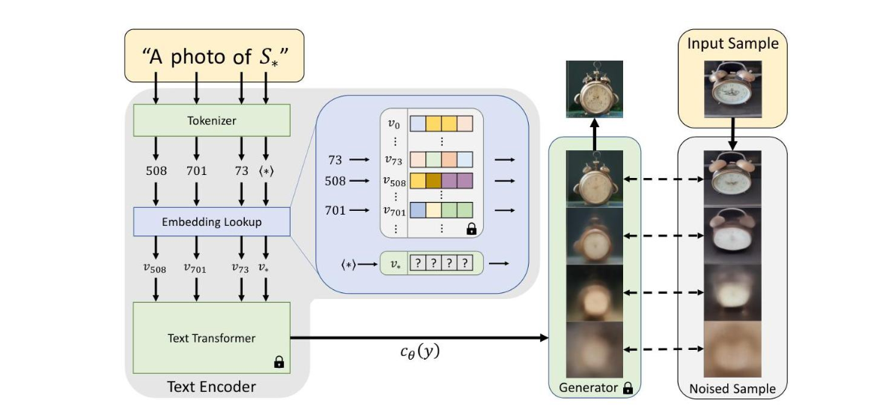

# 目录

- [1.使用lora微调Stable Diffusion模型](#1.使用lora微调Stable_Diffusion模型)
- [2.用于图像生成的多lora组合](#2.用于图像生成的多lora组合)
- [3.Hypernetwork是什么？](#3.Hypernetwork是什么？)
- [4.HyperDreamBooth是什么？](#4.HyperDreamBooth是什么？)
- [5.DiffLoRA是什么？](#5.DiffLoRA是什么？)
- [6.AutoLoRA是什么？](#6.AutoLoRA是什么？)
- [7.LoRA of Change是什么？](#7.LoRAofChange是什么？)
- [8.什么是Textual Inversion(文本反演)？](#8.什么是Textual-Inversion(文本反演)？)
- [9.什么是DreamBooth技术？](#9.什么是DreamBooth技术？)
- [10.LoRA和DreamBooth对比](#10.LoRA和DreamBooth对比)
- [11.介绍一下LoRA技术的原理](#11.介绍一下LoRA技术的原理)
- [12.Stable Diffusion直接微调训练和LoRA微调训练有哪些区别？](#12.Stable-Diffusion直接微调训练和LoRA微调训练有哪些区别？)
- [13.LoRA训练过程是什么样的？推理过程中有额外计算吗？](#13.LoRA训练过程是什么样的？推理过程中有额外计算吗？)
- [14.LoRA模型的微调训练流程一般包含哪几部分核心内容？](#14.LoRA模型的微调训练流程一般包含哪几部分核心内容？)
- [15.LoRA模型的微调训练流程中有哪些关键参数？](#15.LoRA模型的微调训练流程中有哪些关键参数？)
- [16.LoRA模型有哪些特性？](#16.LoRA模型有哪些特性？)
- [17.LoRA模型有哪些高阶用法？](#17.LoRA模型有哪些高阶用法？)
- [18.LoRA模型的融合方式有哪些？](#18.LoRA模型的融合方式有哪些？)
- [19.LoRA模型的融合方式有哪些？](#19.LoRA模型的融合方式有哪些？)
- [20.Dreambooth的微调训练流程一般包含哪几部分核心内容？](#20.Dreambooth的微调训练流程一般包含哪几部分核心内容？)
- [21.Dreambooth的微调训练流程中有哪些关键参数？](#21.Dreambooth的微调训练流程中有哪些关键参数？)
- [22.介绍一下Textual Inversion技术的原理](#22.介绍一下Textual-Inversion技术的原理)
- [23.LoRA和Dreambooth/Textual Inversion/Hypernetworks之间的差异有哪些？](#23.LoRA和Dreambooth/Textual-Inversion/Hypernetworks之间的差异有哪些？)
- [24.LoRA有哪些主流的变体模型？](#24.LoRA有哪些主流的变体模型？)
- [25.介绍一下LCM LoRA的原理](#25.介绍一下LCM-LoRA的原理)
- [26.介绍一下LoCon的原理](#26.介绍一下LoCon的原理)
- [27.介绍一下LoHa的原理](#27.介绍一下LoHa的原理)
- [28.介绍一下B-LoRA的原理](#28.介绍一下B-LoRA的原理)

<h2 id="1.使用lora微调Stable_Diffusion模型">1.使用lora微调Stable Diffusion模型</h2>

[LoRA: Low-Rank Adaptation of Large Language Models](https://arxiv.org/abs/2106.09685) 是微软研究员引入的一项新技术，主要用于处理大模型微调的问题。目前超过数十亿以上参数的具有强能力的大模型 (例如 GPT-3) 通常在为了适应其下游任务的微调中会呈现出巨大开销。LoRA 建议冻结预训练模型的权重并在每个 Transformer 块中注入可训练层 (*秩-分解矩阵*)。因为不需要为大多数模型权重计算梯度，所以大大减少了需要训练参数的数量并且降低了 GPU 的内存要求。研究人员发现，通过聚焦大模型的 Transformer 注意力块，使用 LoRA 进行的微调质量与全模型微调相当，同时速度更快且需要更少的计算。

LoRA也是一种微调 Stable Diffusion 模型的技术，其可用于对关键的图像/提示交叉注意力层进行微调。其效果与全模型微调相当，但速度更快且所需计算量更小。

训练代码可参考以下链接：

[全世界 LoRA 训练脚本，联合起来! (huggingface.co)](https://huggingface.co/blog/zh/sdxl_lora_advanced_script)


<h2 id="2.用于图像生成的多lora组合">2.用于图像生成的多lora组合</h2>

论文链接:https://arxiv.org/abs/2402.16843.pdf


### **LoRA Merge**:

- 这种方法通过线性组合多个LoRAs来合成一个统一的LoRA，进而整合到文本到图像的模型中。
- 主要优点是能够统一多个元素，但它的一个缺点是没有考虑到生成过程中与扩散模型的交互，可能导致像汉堡包和手指这样的元素在图像中变形。

### **LoRA Switch (LoRA-S)**:

- LoRA Switch旨在每个去噪步骤中激活单个LoRA，通过在解码过程中定时激活各个LoRA，引入了一种动态适应机制。
- 图中用独特的颜色表示每个LoRA，每个步骤中只激活一个LoRA。
- 这种方法允许在扩散模型的不同解码步骤中精确控制元素的影响，提高了生成图像的灵活性和控制精度。

### **LoRA Composite (LoRA-C)**:

- LoRA Composite探索在每个时间步骤中整合所有LoRA，而不是合并权重矩阵。
- 它通过汇总每个LoRA在每一步的无条件和条件评分估计来实现，从而在图像生成过程中提供平衡的指导。
- 这种方法有助于保持所有不同LoRA代表的元素的连贯整合，增强了图像的整体一致性和质量。


<h2 id="3.Hypernetwork是什么？">3.Hypernetwork是什么？</h2>

Hypernetwork，也被称为“超网络”，是一种附加到 Stable Diffusion 模型的小型神经网络。它的主要作用是通过插入到噪声预测器 UNet 的交叉注意力模块中，从而改变模型的风格表现。

#### 2. Hypernetwork 与其他模型的区别

##### Hypernetwork VS Checkpoint（大模型）

- **Checkpoint 模型**：包含生成图像的所有必要信息，文件体积较大，通常在 2 GB 到 7 GB 之间。
- **Hypernetwork**：文件体积较小，通常低于 200 MB，但不能单独使用，必须与 Checkpoint 模型配合才能生成图像。

##### Hypernetwork VS LoRA 模型

- **相似性**：Hypernetwork 和 LoRA 模型在文件大小上相似，通常都在 200 MB 以下，比 Checkpoint 模型要小。
- **效果对比**：LoRA 模型一般能产生更好的效果，因此逐渐取代了 Hypernetwork 的位置。

##### Hypernetwork VS Embeddings

- **Embeddings**：通过“文本反转”（Textual Inversion）技术生成，它定义新的关键词来实现特定风格，不会改变模型结构。Embeddings 创建新的嵌入在文本编码器中。
- **Hypernetwork**：通过将一个小型网络插入到噪声预测器的交叉注意力模块中来改变模型的输出风格。

#### 3. Hypernetwork 的现状

- **使用减少**：由于 LoRA 和 Embeddings 的出现，Hypernetwork 的使用频率逐渐下降。在一些社区资源库中，Hypernetwork 文件数量非常有限。
- **效果有限**：虽然 Hypernetwork 的文件体积较大，但其效果往往不如更小的 Embeddings 文件，而这些效果可以通过其他方式实现，例如使用 Embeddings 或 LoRA 模型。


<h2 id="4.HyperDreamBooth是什么？">4.HyperDreamBooth是什么？</h2>

论文链接：https://arxiv.org/pdf/2307.06949

这篇论文提出了一种名为 HyperDreamBooth 的新方法,用于快速和轻量级的主体驱动个性化文本到图像扩散模型。主要内容包括:

1. **轻量级 DreamBooth (LiDB)**: 提出了一种新的低维权重空间,用于模型个性化,可以将个性化模型的大小减少到原始 DreamBooth 的 0.01%。

2. **超网络架构**: 设计了一个超网络,可以从单个图像生成 LiDB 参数。超网络由 ViT 编码器和 Transformer 解码器组成。

3. **rank-relaxed 快速微调**: 提出了一种技术,可以在几秒钟内显著提高输出主体的保真度。

4. 性能

   : 与 DreamBooth 和 Textual Inversion 等方法相比,HyperDreamBooth 在速度和质量上都有显著提升:

   - 速度提高了 25 倍
   - 模型大小减少了 10000 倍
   - 在主体保真度和风格多样性方面取得了相当或更好的结果

整体框架如下图：


Lightweight DreamBooth结构如下：


HyperDreamBooth 实现了快速、轻量级和高质量的文本到图像模型个性化,为创意应用开辟了新的可能性。


<h2 id="5.DiffLoRA是什么？">5.DiffLoRA是什么？</h2>

论文链接：https://arxiv.org/pdf/2408.06740

DiffLoRA框架包含以下关键组成部分:

1. LoRA权重自动编码器(LAE):将LoRA权重压缩到隐空间并进行重构。LAE采用1D卷积层作为主要压缩层,并引入权重保留损失来提高重构精度。
2. 混合图像特征(MIF):利用MoE启发的门控网络,将人脸特征和图像特征相结合,更好地提取身份信息。
3. 去噪过程:使用DiT架构和条件集成,通过迭代去噪生成LoRA隐表示。
4. LoRA权重数据集构建:自动化流程生成多身份LoRA权重数据集,用于训练DiffLoRA。

整体框架如下图：


MIF结构图:


这是一种利用扩散模型作为超网络来根据参考图像预测个性化低秩适应（LoRA）权重的方法。通过将这些 LoRA 权重集成到文本到图像模型中，DiffLoRA 无需进一步训练即可在推理过程中实现个性化。这是第一个利用扩散模型来生成面向身份的 LoRA 权重的模型。


<h2 id="6.AutoLoRA是什么？">6.AutoLoRA是什么？</h2>

论文链接：[2410.03941](https://arxiv.org/pdf/2410.03941)

### 1. **方法概述**

AutoLoRA 是一种提升扩散模型生成图像多样性和质量的新方法，主要结合了 **LoRA (低秩适应)** 和 **AutoGuidance** 技术：

- **LoRA**：通过对大模型进行低秩微调，使其能够适应特定风格或领域，但通常由于训练数据有限，模型容易过拟合，导致生成图像的多样性不足。
- **AutoGuidance**：通过让训练不足的模型版本指导完全训练的模型，从而在生成过程中引入更多多样性。

AutoLoRA 结合了这两者的思路，通过让基础模型与 LoRA 微调模型共同指导图像生成，从而实现了在一致性和多样性之间的平衡。

### 2. **核心机制**

- **指导机制**：AutoLoRA 通过在每一步生成中，将基础模型 `ϵ(xt, y)` 和 LoRA 微调后的模型 `ϵLoRA(xt, y)` 的输出结合起来，控制生成的多样性：
  $$
  \epsilon_{\mathrm{\Lambda utoLoRA}}^{\gamma}(\mathbf{x}_t,y)=\epsilon(\mathbf{x}_t,y)+\gamma\cdot(\epsilon_{\mathrm{LoR\Lambda}}(\mathbf{x}_t,y)-\epsilon(\mathbf{x}_t,y)),
  $$
  其中 `γ` 是调节参数，决定了生成图像中基础模型多样性和 LoRA 模型适应性之间的平衡。

- **无分类器指导 (CFG)**：AutoLoRA 为基础模型和 LoRA 微调模型分别应用 CFG，进一步提升生成过程中的控制力和多样性。


### 3. **关键思想**

- **多样性与一致性的平衡**：通过结合基础和微调模型的输出，AutoLoRA 能在保留特定风格一致性的同时引入更多多样性。这解决了 LoRA 模型因小数据集训练导致的过拟合问题。
- **双重指导**：单独为基础和微调模型应用 CFG，有助于增加生成图像的细节和质量，同时维持对输入提示的良好响应。
- **探索与利用**：AutoLoRA 的设计类似于在探索（生成多样性）和利用（保持风格一致性）之间寻找最优点，使得生成的图像既符合预期风格，又能展示丰富的细节变化。

---

<h2 id="7.LoRAofChange是什么？">7.LoRA of Change是什么？</h2>

论文链接：[arxiv.org/pdf/2411.19156](https://arxiv.org/pdf/2411.19156)

**LoRA of Change (LoC)** 是一种基于视觉指令（前后图像对）的图像编辑框架，通过学习动态生成的指令特定LoRA（Low-Rank Adaptation）编码图像变化，从而解决传统基于文本指令的模糊性问题。


### **一、框架设计**

1. **双重核心组件**

   1. 超网络（Hypernetwork `H`）：负责根据输入的“前后图像对 `<A, A'>`生成对应的LoRA权重 `Δ`，捕捉两者间的编辑指令。超网络结构包含：

      - **Vision Transformer编码器**：提取图像特征。
        - **Transformer解码器**：通过多层交叉注意力机制融合特征，输出LoRA的权重矩阵。

      

   2. **生成模型（InstructPix2Pix ）**：基于预训练的扩散模型，利用LoRA `Δ` 对图像进行可控生成，如将原始图像 `B` 编辑为目标图像 `B'`。

2. **训练阶段设计**

   - 两阶段训练：
     - **预训练（Stage 1）**：在大规模混合数据集（如SEED-Data-Edit）上预训练超网络和生成模型。
     - **微调（Stage 2）**：在高质量数据集（如MagicBrush）上进一步优化，提高视觉CLIP分数（实验表明从0.193提升至0.214）。

3. **推理流程**
    在推理阶段，输入原始图像 `B` 和由 `<A, A'>` 生成的LoRA `Δ`，生成模型输出编辑后的图像 `B'`，同时确保与前后图像对的编辑逻辑一致。

### **二、核心原理**

1. **LoRA动态生成**
   - 超网络通过视觉Transformer编码器提取前后图像对的隐层特征，并通过解码器生成低秩矩阵 `Δ`，直接注入生成模型的注意力层，精准编码“变化”指令。
   - 相比文本倒置（Textual Inversion），LoRA的权重空间更适合捕捉细粒度视觉变化。
2. **反向一致性训练（LoRA Reverse Training）**
   - **双向重建**：通过 `B → B'` 和 `B' → B` 的双向重建损失，强制模型在不同编辑方向下保持一致性。
   - **随机交换操作**：在训练中随机交换前后图像对顺序，增强模型对输入顺序的鲁棒性，防止信息泄漏。
3. **解耦编辑指令与图像内容**
   - LoRA `Δ` 封装了脱离原始图像内容的抽象编辑指令，可通过复用同一Δ实现跨图像的相同编辑效果，增强模型的泛化性.


<h2 id="8.什么是Textual-Inversion(文本反演)？">8.什么是Textual Inversion(文本反演)？</h2>

### 理解 Textual Inversion 的核心思想

Textual Inversion（文本反演）是一种新颖且高效的方法，用于让文本到图像生成模型（例如 Stable Diffusion）快速学习和生成全新的视觉概念，而无需重新训练整个模型。具体来说，这种方法通过优化特殊的文本嵌入来代表新概念，使得模型能够生成包含用户个性化元素的图像。



### Textual Inversion 的实现流程

具体过程包括以下几个步骤：

1. **收集输入图像** 用户提供3-5张代表某个新概念的图片，例如特定的雕塑、玩具或独特的艺术风格。这些图像作为模型的学习基础。

2. **创建伪词** 为了表示这个新概念，方法会引入一个全新的伪词（在论文中通常标记为S*）。例如，如果你想要教会模型一个特定的雕塑，你可能引入一个词如“雕塑X”。

3. **优化词嵌入** 与重新训练整个模型不同，文本反演只优化这个新伪词在文本嵌入空间中的位置。具体优化过程包括最小化两个方面的差异：

   - 模型使用包含伪词的文本提示生成的图像
   - 用户提供的实际参考图像

   通过优化，这个伪词的嵌入向量最终能准确表示新的视觉概念。

4. **集成应用** 一旦伪词优化完成，就可以和已有的自然语言提示结合使用，让模型生成包含这个个性化元素的新图像。例如，你可以输入“一个戴着‘雕塑X’风格帽子的女孩”，模型就能生成符合你定制需求的图片。

### 为什么 Textual Inversion 如此高效？

Textual Inversion 的最大创新点在于它无需修改文本到图像模型的架构或全面重新训练，而是巧妙地利用了模型已有的嵌入空间。具体来说，模型本身包括两个关键组件：

- **文本编码器**：将自然语言提示转化为嵌入向量。
- **扩散模型**：根据嵌入向量生成或逐步优化图像。

Textual Inversion 通过优化特定概念对应的嵌入向量，精准地将新概念融入模型已有的知识体系中。

### 数学原理解析

- 从数学上讲，该方法可以描述为：

  1. 对于由占位符 S* 表示的新概念，目标是找到一个最佳嵌入向量 v*，它在文本嵌入空间中表示该概念。
  2. 这被形式化为一个优化问题：

  ```
  v* = argmin_v L(v, {I_1, I_2, ..., I_n})
  ```

  其中 L 是损失函数，用于衡量使用嵌入 v 生成的图像与参考图像 {I_1, I_2, ..., I_n} 的匹配程度。

使用扩散损失作为优化指标，可以确保学习到的嵌入既准确捕捉新概念的视觉特征，又保持与原模型良好的兼容性。


OmniGen的设计目标可用两个关键词概括：**统一（Unification）与简洁（Simplicity）**。

- **统一**：无论是文本生成图像、图像编辑、条件控制生成还是主客体泛化，OmniGen都能用一个模型、一套流程完成，无需任何额外插件或中间步骤。
- **简洁**：彻底抛弃了冗余的输入编码器（如CLIP、检测器等），仅保留**两个“组件”**：`VAE(图像变分自编码器)` 和 `Transformer(大模型)`。

<h2 id="9.什么是DreamBooth技术？">9.什么是DreamBooth技术？ </h2>

### 1. 基本原理

DreamBooth是由Google于2022年发布的一种通过将自定义主题注入扩散模型的微调训练技术，它通过少量数据集微调Stable Diffusion系列模型，让其学习到稀有或个性化的图像特征。DreamBooth技术使得SD系列模型能够在生成图像时，更加精确地反映特定的主题、对象或风格。

DreamBooth首先为特定的概念寻找一个特定的描述词[V]，这个特定的描述词一般需要是稀有的，DreamBooth需要对SD系列模型的U-Net部分进行微调训练，同时DreamBooth技术也可以和LoRA模型结合，用于训练DreamBooth_LoRA模型。

在微调训练完成后，Stable Diffusion系列模型或者LoRA模型能够在生成图片时更好地响应特定的描述词（prompts），这些描述词与自定义主题相关联。这种方法可以被视为在视觉大模型的知识库中添加或强化特定的“记忆”。

同时为了防止过拟合，DreamBooth技术在训练时增加了一个class-specific prior preservation loss（基于SD模型生成相同class的图像加入batch里面一起训练）来进行正则化。


### 2. 微调训练过程

DreamBooth技术在微调训练过程中，主要涉及以下几个关键步骤：

1. **选择目标实体**：在开始训练之前，首先需要明确要生成的目标实体或主题。这通常是一组代表性强、特征明显的图像，可以是人物、宠物、艺术品等。例如，如果目标是生成特定人物的图像，那么这些参考图像应该从不同角度捕捉该人物。

2. **训练数据准备**：收集与目标实体相关的图像。这些图像不需要非常多，但应该从多个角度展示目标实体，以便模型能够学习到尽可能多的细节。此外，还需要收集一些通用图像作为负样本，帮助模型理解哪些特征是独特的，哪些是普遍存在的。

3. **数据标注**：为了帮助模型更好地识别和学习特定的目标实体，DreamBooth技术使用特定的描述词[V]来标注当前训练任务的数据。这些标注将与目标实体的图像一起输入模型，以此强调这些图像中包含的特定特征。

4. **模型微调**：使用这些特定的训练样本，对Stable Diffusion模型或者LoRA模型进行微调训练，并在微调训练过程中增加class-specific prior preservation loss来进行正则化。

5. **验证测试**：微调完成后，使用不同于训练时的文本提示词（但是包含特定的描述词[V]），验证模型是否能够根据新的文本提示词生成带有目标实体特征的图像。这一步骤是检验微调效果的重要环节。

6. **调整和迭代**：基于生成的图像进行评估，如果生成结果未达到预期，可能需要调整微调策略，如调整学习率、增加训练图像数量或进一步优化特殊标签的使用。

DreamBooth技术的关键在于通过微调Stable Diffusion模型，令其能够在不失去原有生成能力的同时，添加一定程度的个性化特征。

### 3. 应用

DreamBooth技术的应用非常广泛，包括但不限于：

- **个性化内容创作**：为特定个体或品牌创建独特的视觉内容。
- **艺术创作**：艺术家可以使用这种技术来探索新的视觉风格或加深特定主题的表达。

总体来说，DreamBooth 是一项令人兴奋的技术，它扩展了生成模型的应用范围，使得个性化和定制化的图像生成成为可能。这种技术的发展有望在多个领域带来创新的应用。


<h2 id="10.LoRA和DreamBooth对比">10.LoRA和DreamBooth对比</h2>

#### 核心原理

DreamBooth通过在整个模型上进行微调来学习新概念：

python

```python
# DreamBooth的损失函数
L_dreambooth = E[||ε - ε_θ(x_t, t, c_text)||²] + λ * E[||ε - ε_θ(x_pr, t, c_pr)||²]
```

其中第二项是**先验保留损失（Prior Preservation Loss）**，防止模型遗忘原有知识。

#### 技术特点

1. **全模型微调**：更新UNet的所有参数
2. **类别特定标识符**：使用独特的标识词（如"sks"）
3. **先验保留**：生成类别图像以保持模型的泛化能力

#### 训练流程

python

```python
# 简化的DreamBooth训练流程
def train_dreambooth(model, images, class_prompt, instance_prompt):
    # 1. 生成先验图像
    prior_images = generate_class_images(model, class_prompt, num=100)
    
    # 2. 准备训练数据
    dataset = combine_datasets(
        instance_data=(images, instance_prompt),
        class_data=(prior_images, class_prompt)
    )
    
    # 3. 微调整个模型
    for batch in dataset:
        loss = compute_dreambooth_loss(model, batch)
        optimizer.step(loss)
```

### LoRA：

#### 核心原理

LoRA通过低秩矩阵分解来高效地适配预训练模型：

python

```python
# LoRA的核心公式
W' = W + ΔW = W + B·A
# 其中 B ∈ R^(d×r), A ∈ R^(r×k), r << min(d,k)
```

#### 技术特点

1. **参数高效**：只训练额外的低秩矩阵
2. **模块化设计**：可以轻松切换和组合不同的LoRA
3. **训练速度快**：参数量大幅减少

#### 实现细节

python

```python
class LoRALayer(nn.Module):
    def __init__(self, in_features, out_features, rank=4):
        super().__init__()
        self.A = nn.Parameter(torch.randn(rank, in_features))
        self.B = nn.Parameter(torch.zeros(out_features, rank))
        self.scale = 1.0
        
    def forward(self, x, original_weight):
        # 原始输出 + LoRA调整
        return F.linear(x, original_weight) + self.scale * (x @ self.A.T @ self.B.T)
```

### 详细对比分析

#### 1. 学习能力对比

**DreamBooth的优势**：

- 能够学习复杂的新概念
- 对细节的捕捉更精确
- 适合需要大幅改变模型行为的场景

**LoRA的优势**：

- 快速适配新风格
- 可以组合多个LoRA实现复合效果
- 保持原模型能力的同时添加新特性

#### 2. 实际应用场景

**DreamBooth适用于**：

- 人物/宠物的个性化定制
- 需要精确还原特定对象
- 商业级的定制化需求

**LoRA适用于**：

- 艺术风格迁移
- 快速原型开发
- 需要频繁切换不同适配的场景


<h2 id="11.介绍一下LoRA技术的原理">11.介绍一下LoRA技术的原理</h2>


<h2 id="12.Stable-Diffusion直接微调训练和LoRA微调训练有哪些区别？">12.Stable Diffusion直接微调训练和LoRA微调训练有哪些区别？</h2>


<h2 id="13.LoRA训练过程是什么样的？推理过程中有额外计算吗？">13.LoRA训练过程是什么样的？推理过程中有额外计算吗？</h2>


<h2 id="14.LoRA模型的微调训练流程一般包含哪几部分核心内容？">14.LoRA模型的微调训练流程一般包含哪几部分核心内容？</h2>


<h2 id="15.LoRA模型的微调训练流程中有哪些关键参数？">15.LoRA模型的微调训练流程中有哪些关键参数？</h2>


<h2 id="16.LoRA模型有哪些特性？">16.LoRA模型有哪些特性？</h2>


<h2 id="17.LoRA模型有哪些高阶用法？">17.LoRA模型有哪些高阶用法？</h2>


<h2 id="18.LoRA模型的融合方式有哪些？">18.LoRA模型的融合方式有哪些？</h2>


<h2 id="19.LoRA模型的融合方式有哪些？">19.LoRA模型的融合方式有哪些？</h2>


<h2 id="20.Dreambooth的微调训练流程一般包含哪几部分核心内容？">20.Dreambooth的微调训练流程一般包含哪几部分核心内容？</h2>


<h2 id="21.Dreambooth的微调训练流程中有哪些关键参数？">21.Dreambooth的微调训练流程中有哪些关键参数？</h2>


<h2 id="22.介绍一下Textual-Inversion技术的原理">22.介绍一下Textual Inversion技术的原理</h2>


<h2 id="23.LoRA和Dreambooth/Textual-Inversion/Hypernetworks之间的差异有哪些？">23.LoRA和Dreambooth/Textual Inversion/Hypernetworks之间的差异有哪些？</h2>


<h2 id="24.LoRA有哪些主流的变体模型？">24.LoRA有哪些主流的变体模型？</h2>


<h2 id="25.介绍一下LCM-LoRA的原理">25.介绍一下LCM LoRA的原理</h2>


<h2 id="26.介绍一下LoCon的原理">26.介绍一下LoCon的原理</h2>


<h2 id="27.介绍一下LoHa的原理">27.介绍一下LoHa的原理</h2>


<h2 id="28.介绍一下B-LoRA的原理">28.介绍一下B-LoRA的原理</h2>

