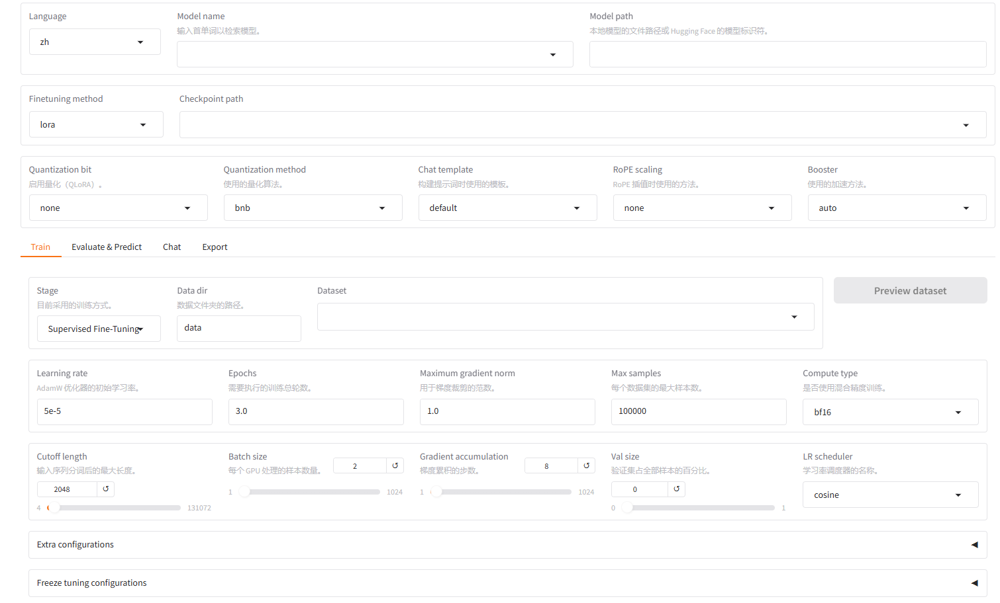
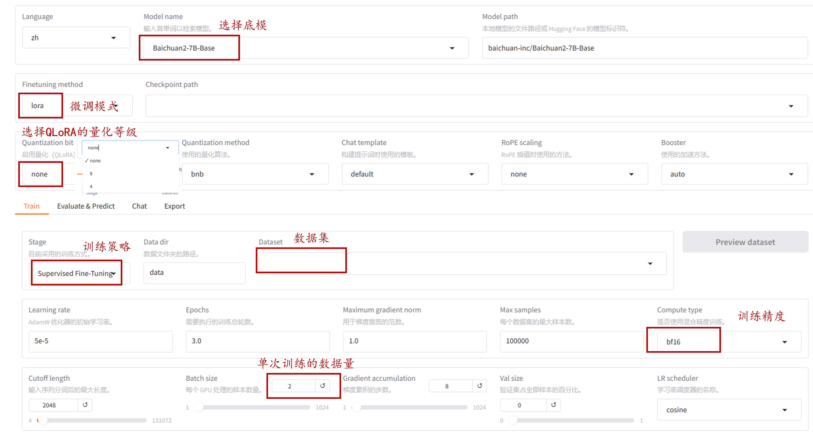
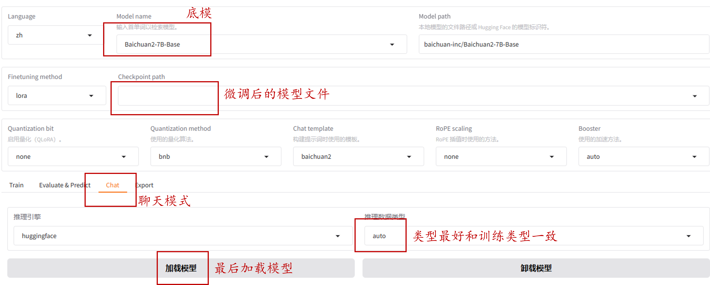
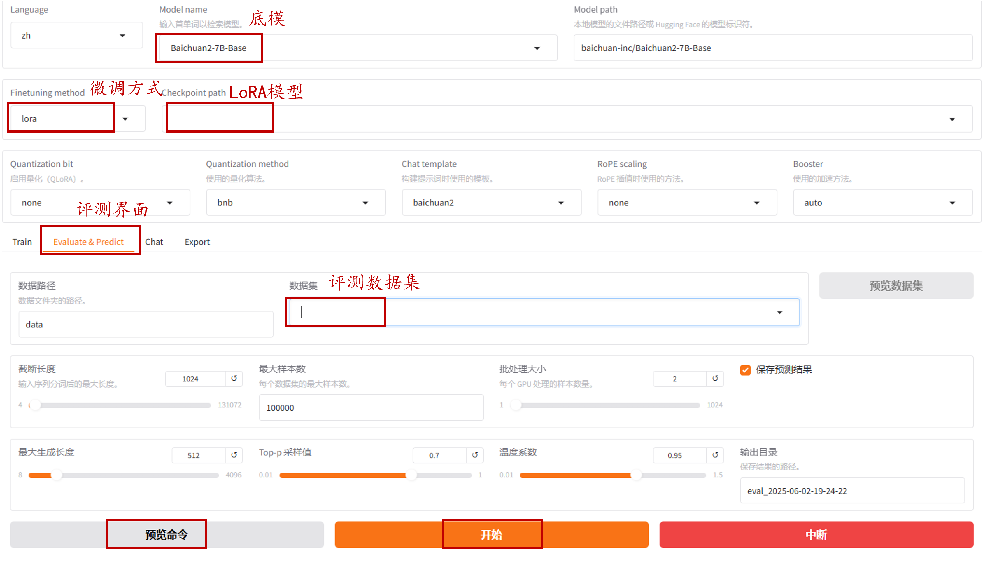
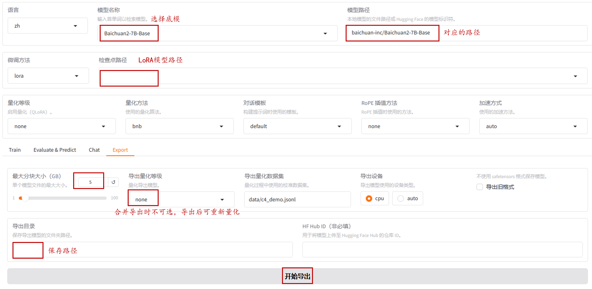
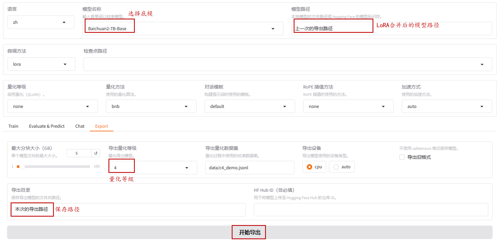
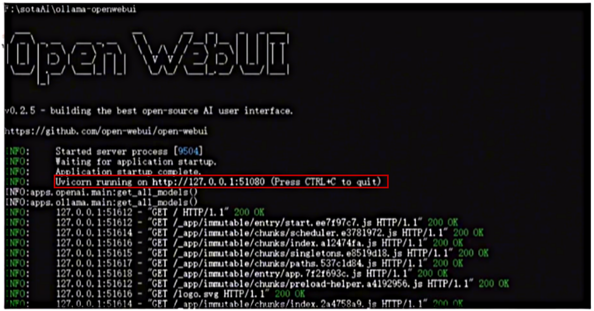
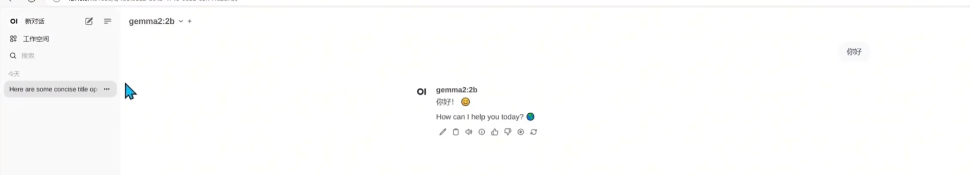
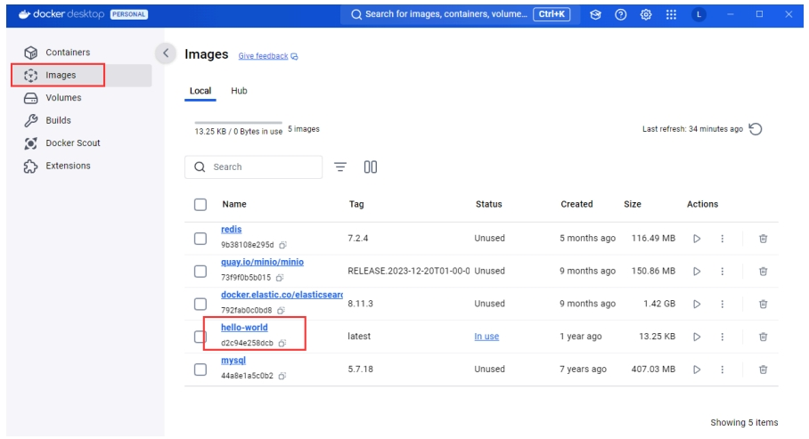
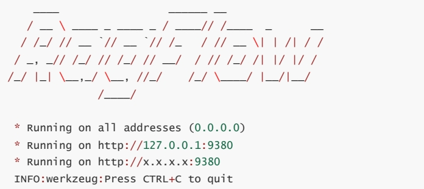

# 目录

## 第一章 Llama Factory 微调

- [1.什么是llama-factory？](#1.什么是llama-factory？)
- [2.怎么下载模型文件？](#2.怎么下载模型文件？)
- [3.怎么准备训练数据集？](#3.怎么准备训练数据集？)
- [4.怎么使用llama-factory进行LoRA和QLoRA微调？](#4.怎么使用llama-factory进行LoRA和QLoRA微调？)
- [5.怎么使用训练后的模型进行推理？](#5.怎么使用训练后的模型进行推理？)
- [6.模型评测中常见的报错处理手段？](#6.模型评测中常见的报错处理手段？)
- [7.怎么合并LoRA模型并导出？](#7.怎么合并LoRA模型并导出？)
- [8.怎么量化模型并导出？](#8.怎么量化模型并导出？)
- [9.怎么把safetensors格式转化为GGUF格式？](#9.怎么把safetensors格式转化为GGUF格式？)
- [10.怎么安装Ollama框架？](#10.怎么安装Ollama框架？)
- [11.怎么启动ollama框架？](#11.怎么启动ollama框架？)

## 第二章 Rag 技术
---

## 第一章 Langraph基础知识

<h2 id="1.什么是llama-factory？">1.什么是llama-factory？</h2>

#### 1.基础定义与核心功能：

**（1） 基础定义**

[**LLaMA Factory**](https://llamafactory.readthedocs.io/zh-cn/latest/index.html) 是一个专为大型语言模型（LLM）设计的高效、易用的**训练与微调平台**。其核心目标是通过简化的流程，让用户无需编写代码即可在本地完成多种模型的微调与训练任务，支持丰富的模型类型、训练方法和优化技术。

**（2）核心功能**

- **模型种类**：LLaMA、LLaVA、Mistral、Mixtral-MoE、Qwen、Yi、Gemma、Baichuan、ChatGLM、Phi 等等。

- **训练算法**：（增量）预训练、（多模态）指令监督微调、奖励模型训练、PPO 训练、DPO 训练、KTO 训练、ORPO 训练等等。

- **运算精度**：16 比特全参数微调、冻结微调、LoRA 微调和基于 AQLM/AWQ/GPTQ/LLM.int8/HQQ/EETQ 的 2/3/4/5/6/8 比特 QLoRA 微调。

- **优化算法**：GaLore、BAdam、DoRA、LongLoRA、LLaMA Pro、Mixture-of-Depths、LoRA+、LoftQ 和 PiSSA。

- **加速算子**：FlashAttention-2 和 Unsloth。

- **推理引擎**：Transformers 和 vLLM。

- **实验监控**：LlamaBoard、TensorBoard、Wandb、MLflow、SwanLab 等等。

**（3）LLaMA Factory安装**

- **硬件环境校验**：

安装[显卡驱动](https://www.nvidia.cn/Download/index.aspx?lang=c)和[CUDA](https://developer.nvidia.com/cuda-12-2-0-download-archive/)，并使用**nvidia-smi**命令检验。

- **软件环境准备**：

安装[conda](https://www.anaconda.com/download)或者[miniconda](https://www.anaconda.com/docs/getting-started/miniconda/main)，并创建虚拟环境。

```bash
# 创建名为 llama_factory 的 Python 3.10 虚拟环境
conda create -n llama_factory python=3.10

# 激活虚拟环境
conda activate llama_factory

# 安装 PyTorch 2.3.1 + CUDA 12.1 版本（确保显卡驱动支持 CUDA 12.1）
conda install pytorch==2.3.1 torchvision==0.18.1 torchaudio==2.3.1 pytorch cuda=12.1 -c pytorch -c nvidia
```

拉取[LLaMA Factory代码](https://github.com/hiyouga/LLaMA-Factory.git)并安装。

```bash
git clone --depth 1 https://github.com/hiyouga/LLaMA-Factory.git
cd LLaMA-Factorypip install -e ".[torch,metrics]"
```

安装[模型量化](https://llamafactory.readthedocs.io/zh-cn/latest/getting_started/installation.html)的所需资源。

```bash
# QLoRA
pip install https://github.com/jllllll/bitsandbytes-windows-webui/releases/download/wheels/bitsandbytes-0.41.2.post2-py3-none-win_amd64.whl

# awq量化
pip install autoawq
```

**启动LLaMA Factory**：

```bash
# 命令行目录查看
llamafactory-cli train -h

# Web唤醒 or CUDA_VISIBLE_DEVICES=0 llamafactory-cli web
llamafactory-cli webui
```



<h2 id="2.怎么下载模型文件？">2.怎么下载模型文件？</h2>

#### 1.手动下载模型：

通过[Hugging Face](https://huggingface.co/models)下载或者魔搭社区[ModelScope](https://modelscope.cn/?from=baidu_sem)下载。以Meta-Llama3-8B-Instruct为例。

```bash
# Hugging Face
git clone https://huggingface.co/meta-llama/Meta-Llama-3-8B-Instruct

# Model Scope
git clone https://www.modelscope.cn/LLM-Research/Meta-Llama-3-8B-Instruct.git
```

#### 2.代码下载模型：

（1）Hugging Face更多的[下载方式](https://huggingface.co/meta-llama/Meta-Llama-3-8B-Instruct)

```bash
# Hugging Face下载
from transformers import AutoTokenizer, AutoModelForCausalLM
import torch

model_id = "meta-llama/Meta-Llama-3-8B-Instruct"

tokenizer = AutoTokenizer.from_pretrained(model_id)
model = AutoModelForCausalLM.from_pretrained(
    model_id,
    torch_dtype=torch.bfloat16,
    device_map="auto",
)
```

（2）魔搭社区更多的[下载方式](https://www.modelscope.cn/docs/models/download)

```bash
# 魔搭社区下载
from modelscope import snapshot_download
local_dir = ""
model_dir = snapshot_download('LLM-Research/Meta-Llama-3-8B-Instruct',local_dir=local_dir)
```

#### 3.模型验证：

（1）更多的模型推理方式：[魔搭社区](https://www.modelscope.cn/models/LLM-Research/Meta-Llama-3-8B-Instruct)，[Hugging Face](https://huggingface.co/meta-llama/Meta-Llama-3-8B-Instruct)

```bash
import transformers
import torch

model_id = "LLM-Research/Meta-Llama-3-8B-Instruct"

# 通过模型是否能正常推理验证模型是否下载成功。
pipeline = transformers.pipeline(
    "text-generation",
    model=model_id,
    model_kwargs={"torch_dtype": torch.bfloat16},
    device_map="auto",
)

messages = [
    {"role": "system", "content": "You are a pirate chatbot who always responds in pirate speak!"},
    {"role": "user", "content": "Who are you?"},
]

terminators = [
    pipeline.tokenizer.eos_token_id,
    pipeline.tokenizer.convert_tokens_to_ids("<|eot_id|>")
]

outputs = pipeline(
    messages,
    max_new_tokens=256,
    eos_token_id=terminators,
    do_sample=True,
    temperature=0.6,
    top_p=0.9,
)
print(outputs[0]["generated_text"][-1])
```


<h2 id="3.怎么准备训练数据集？">3.怎么准备训练数据集？</h2>

#### 1.训练数据集的格式：

（1）（增量）预训练数据集

```bash
# Alpaca格式
[
  {"text": "预训练文本"},
  {"text": "预训练文本"}
]
```

（2）监督微调数据集

- **Alpaca格式**：在模型微调时，instruction对应的内容会与input对应的内容拼接后作为人类指令，而output对应的内容作为模型回答。如有，system对应的内容为系统提示词，而history分别代表历史消息中每轮对话的指令和回答。

```bash
# Alpaca格式
[
  {"instruction": "人类指令（必填）"，
  "input": "人类输入（必填）"，
  "output": "模型回答（必填）"，
  "system": "系统提示词（选填）"，
  "history": [
  	["第一轮指令（选填）", "第一轮回答（选填）"],
  	["第二轮指令（选填）", "第二轮回答（选填）"]]
  }
]
```

- **sharegpt格式**：sharegpt格式支持更多的角色种类，比如human，gpt，observation，function等。其中human和observation必须出现在奇数位置，gpt和function必须出现在偶数位置。

```bash
[
	{
	"conversations":[
		{
		"from": "human",
		"value": "人类指令"，
		}，
		{
		"from": "function_call",
		"value": "工具参数"，
		}，
        {
		"from": "observation",
		"value": "工具结果"，
		}，
		{
		"from": "gpt",
		"value": "模型回答"，
		}，
	],
	"system": "系统提示词（选填）",
	"tools": "工具描述（选填）"
	}
]
```

（3）偏好数据

- **Alpaca格式**：

```bash
[
  {
    "instruction": "人类指令（必填）",
    "input": "人类输入（选填）",
    "chosen": "优质回答（必填）",
    "rejected": "劣质回答（必填）"
  }
]
```

- **sharegpt格式**

```bash
{
  "conversations": [
    {
      "from": "human",
      "value": "人类指令"
    }
  ],
  "chosen": {
    "from": "gpt",
    "value": "模型回答！"
  },
  "rejected": {
    "from": "gpt",
    "value": "模型回答"
  }
}
```

#### 2.训练数据集的配置文件：

LLaMA Factory中的文件中包含了所有可用的数据集。如果使用自定义数据集，需要在**dataset_info.json**文件中添加数据集的描述。 dataset_info.json文件位于LLaMA Factory根目录的data文件下，即**LLaMA-Factory\data**。


（1）（增量）预训练数据集

```bash
"数据集名称": {
  "file_name": "data.json",
  "columns": {
    "prompt": "text"
  }
}
```

（2）监督微调数据集

- **Alpaca格式**：

```bash
"数据集名称": {
  "file_name": "data.json",
  "columns": {
    "prompt": "instruction",
    "query": "input",
    "response": "output",
    "system": "system",
    "history": "history"
  }
}
```

- **sharegpt格式**

```bash
"数据集名称": {
  "file_name": "data.json",
  "formatting": "sharegpt",
  "columns": {
    "messages": "conversations",
    "system": "system",
    "tools": "tools"
  }
}
```

（3）偏好微调

- **Alpaca格式**：

```bash
"数据集名称": {
  "file_name": "data.json",
  "ranking": true,
  "columns": {
    "prompt": "instruction",
    "query": "input",
    "chosen": "chosen",
    "rejected": "rejected"
  }
}
```

- **sharegpt格式**

```bash
"数据集名称": {
  "file_name": "data.json",
  "formatting": "sharegpt",
  "ranking": true,
  "columns": {
    "messages": "conversations",
    "chosen": "chosen",
    "rejected": "rejected"
  }
}
```

一般只需要修改**数据集名称**和**file_name**，其他参数为默认，可以写明。更多的[训练数据格式和配置文件](https://llamafactory.readthedocs.io/zh-cn/latest/getting_started/data_preparation.html#id4)


<h2 id="4.怎么使用llama-factory进行LoRA和QLoRA微调？">4.怎么使用llama-factory进行LoRA和QLoRA微调？</h2>

#### 1.简单介绍：

LoRA：训练参数大约占完全参数的1%，非破坏性微调，可以任意切换或者组合。

QLoRA：相较于LoRA节省30%的训练内存，但多约30%的训练时长。

#### 2.Web版示例和修改事项：



#### 3.命令流示例和修改事项：

```bash
llamafactory-cli train \
--stage sft \  # 训练阶段/策略，可选：rm，pt，sft，PPO，DPO，KTO...
--do_train True \  # True用于训练，False用于评测
--model_name_or_path baichuan-inc/<model_name> \  # 模型名称/路径
--preprocessing_num_workers 16 \  # 用于数据预处理的工作线程数
--finetuning_type lora \  # 微调方法，可选：freeze，LoRA，full
--template <model_name> \  # 数据集模板，与模型一一对应
--flash_attn auto \  
--dataset_dir llama-factory/data/<dataset_folder> \  # 数据集所在目录 
--dataset <dataset_name> \  # 数据集名称，多个数据集用","隔开
--cutoff_len 1024 \  # 截断长度，表示输入序列的最大长度
--learning_rate 5e-05 \  # 学习率
--num_train_epochs 3.0 \  # 训练周期数
--max_samples 100000 \  # 用于训练的最大样本数
--per_device_train_batch_size 2 \  # 每个设备上训练的批次大小
--gradient_accumulation_steps 8 \  # 梯度累计步数
--lr_scheduler_type cosine \  # 学习率调度曲线，可选“linear”，“consince”...
--max_grad_norm 1.0 \ 
--logging_steps 5 \  # 日志保存步数
--save_steps 100 \ 
--warmup_steps 0 \
--optim adamw_torch \  # 优化器
--packing False \  # 是否启动数据打包
--report_to none \
--output_dir saves/<model_name>/lora/train \  # 保存路径
--fp16 True \  # True使用fp16
--plot_loss True \  # 是否绘制损失图
--ddp_timeout 180000000 \ 
--include_num_input_tokens_seen True \
--lora_rank 8 \   # LoRA的秩
--lora_alpha 16 \  # LoRA的alpha值，值越大，新数据对权重的影响越大。
--lora_dropout 0 \  # LoRA的dropout率，防止模型过拟合。
--lora_target all \  # 采用LoRA的目标模块，一般为all
--deepspeed cache/ds_z3_config.json   # 使用deepspeed加速训练
```

#### 4.中断后继续训练：

**只有命令行格式**

```bash
# 如果通过命令行控制，则模型为继续训练，训练集为从头训练（一般适配新数据叠加训练）
--resume_from_checkpoint /workspace/checkpoint/<model_name>/checkpoint-4000  # 不设置，脚本会自动到workspace里面寻找最新的checkpoint
--output_dir new_dir  # 不设置，默认原来的output_dir
# 其他参数同训练
```

#### 5.训练后的结果：

训练结束后，在output_dir下，

（1）adaptor开头的就是LoRA保存的结果（**主要结果**）。

（2）training_loss和training_log等记录了训练的过程。

（3）其他是训练的其他备份。


<h2 id="5.怎么使用训练后的模型进行推理？">5.怎么使用训练后的模型进行推理？</h2>

#### 1.常见推理模板：

（1）**0-shot评测**是指在没有任何针对特定任务的训练或者实例的情况下，直接评估模型在任务上的表现。

（2）**5-shot评测**是指在prompt中为模型提供几个示例，以增强模型的泛化能力。

#### 2.聊天/单次推理模式：



#### 2.批量推理模式：

（1）主流benchmark测评

llama-factory可以通过**yaml文件**和**命令流**两种方式进行测评

- [**yaml**文件](https://github.com/hiyouga/LLaMA-Factory/blob/main/examples/train_lora/llama3_lora_eval.yaml)

```bash
### model
model_name_or_path: meta-llama/Meta-Llama-3-8B-Instruct
adapter_name_or_path: saves/llama3-8b/lora/sft
trust_remote_code: true

### method
finetuning_type: lora

### dataset
task: mmlu_test  # choices: [mmlu_test, ceval_validation, cmmlu_test]
template: fewshot
lang: en
n_shot: 5

### output
save_dir: saves/llama3-8b/lora/eval

### eval
batch_size: 4
```

```bash
# YAML命令流
llamafactory-cli evalexamples/train_lora/llama3_lora_eval.yaml
```

- **命令流**

```bash
# chat模型
llamafactory-cli eval \  # eval表示评测  CUDA_VISIBLE_DEVICES=0 
--model_name_or_path /llama3/Meta-Llama-3-8B-Instruct \  # 基础模型路径
--template llama3 \  # 提示词模版
--task mmlu_test \  # 评测任务集
--lang en \  # 语言
--n_shot 5 \  # 0shot，5shot等
--batch_size 1  # 评测是的batch size

# base模型
llamafactory-cli eval \  # eval表示评测  CUDA_VISIBLE_DEVICES=0 
--model_name_or_path /llama3/Meta-Llama-3-8B-Instruct \  # 基础模型路径
--template fewshot \  # 提示词模版
--task mmlu_test \  # 评测任务集
--split validation \
--lang en \  # 语言
--n_shot 5 \  # 0shot，5shot等
--batch_size 1  # 评测是的batch size
```

- 其他更多的**开源评测项目**：[opencompass](https://github.com/open-compass/opencompass)，[EleutherAI](https://github.com/EleutherAI/lm-evaluation-harness/tree/main)

（2）垂直数据集测评

- **环境安装**
- 
``` bash
pip install jieba #中文文本分词库
pip install rouge-chinesepip install nltk #自然语言处理工具包（Natural Language Toolkit）
```

- **批量推理**

``` bash
llamafactory-cli train \  # CUDA_VISIBLE_DEVICES=0 
--stage sft \  # 监督微调
--do_predict \  # 现在是预测模式
--model_name_or_path /llama3/Meta-Llama-3-8B-Instruct \  # 底模路径
--adapter_name_or_path ./saves/LLaMA3-8B/lora/sft \  # lora路径
--eval_dataset alpaca_gpt4_zh,identity,adgen_local \  # 评测数据集
--dataset_dir ./data \  # 数据集路径
--template llama3 \  # 提示词模版，比如llama3 ,qwen 和训练微调一样
--finetuning_type lora \ #  微调方式 lora
--output_dir ./saves/LLaMA3-8B/lora/predict \  # 评估预测输出文件夹
--overwrite_cache \
--overwrite_output_dir \
--cutoff_len 1024 \  # 提示词截断长度
--preprocessing_num_workers 16 \  # 预处理数据的线程数量
--per_device_eval_batch_size 1 \  # 每个设备评估时的batch size
--max_samples 20 \  # 每个数据集采样多少用于预测对比
--predict_with_generate True  # 现在用于生成文本
```

- **批量评测**

``` bash
# 采用blue和rouge分数进行评测
llamafactory-cli train \
--stage sft \
--model_name_or_path Qwen/Qwen2-7B-Instruct-AWQ \
--preprocessing_num_workers 16 \
--finetuning_type lora \
--quantization_method bitsandbytes \  # 量化
--template qwen \
--flash_attn auto \
--dataset_dir data \
--eval_dataset huanhuan_chat,ruozhiba_gpt4 \
--cutoff_len 1024 \  # 提示词截断长度
--max_samples 100000 \
--per_device_eval_batch_size 2 \
--predict_with_generate True \
--max_new_tokens 512 \
--top_p 0.7 \
--temperature 0.95 \
--output_dir saves\Qwen2-7B-int4-Chat\lora\eval_2024-08-24-10-42-52 \
--do_predict True \
--adapter_name_or_path saves\Qwen2-7B-int4-Chat\lora\train_2024-08-18-14-43-59 \
--quantization_bit 4
```



- **测评后结果**

在output_dir下，存在：

``` bash
all_results.json # 评测结果
generated_predictions.jsonl  # 输入-输出
llamaboard_config.yaml  # 评测的参数配置
trainer_log.jsonl  # 训练日志
training_args.yaml  # 训练的参数配置
```


<h2 id="6.模型评测中常见的报错处理手段？">6.模型评测中常见的报错处理手段？</h2>

#### 1.OOM？

设置--eval_accumulation_steps=1（累计梯度）以及--per_device_eval_batch_size=1（批量大小）

#### 2.自定义评价指标？

比如F1score，recall，precision。需要在llama-factory根目录下，修改**src\llamafactory\train\sft\metric.py**和**src\llamafactory\train\sft\workflow.py**文件。

#### 3.如何得到各个评测样本单独的blue和rouge？

每个样本分开评测，一起评测得到的是平均分数。

#### 4. 模型对话/测评的时候对话不停止？

检查提示词模板是否是对应的模板，如果仍然有问题选择default模板再次尝试。


<h2 id="7.怎么合并LoRA模型并导出？">7.怎么合并LoRA模型并导出？</h2>

如果想把训练的LoRA和原始大模型进行融合并输出一个完整的模型文件，可以使用以下命令。

#### 1.命令行：

```bash
llamafactory-cli export \  # CUDA_VISIBLE_DEVICES=0是一个环境变量，设定使用第一张GPU卡
--model_name_or_path /llama3/Meta-Llama-3-8B-Instruct \  # 底模路径
--adapter_name_or_path ./saves/LLaMA3-8B/lora/sft \  # lora路径
--template llama3 \  # 提示词模版
--finetuning_type lora \  # 微调方式lora
--export_dir megred-model-path \  # 导出路径
--export_size 2 \  # 导出每个分文件大小，2表示2G，比如一个4B权重的float16的模型，模型权重8G，就会分成4个文件保存
--export_device cpu \  # 使用cpu导出模型，而非模型后面是用cpu还是gpu运行
--export_legacy_format False  # 是否使用旧格式导出，新格式默认是safetensors，旧格式就是pt，bin等格式
```

- 其他可选参数

```bash
--export_quantization_bit: 量化位数，全精度导出时，不用填写
--export_quantization_dataset: 量化校准数据集
```

#### 2.Web界面：




<h2 id="8.怎么量化模型并导出？">8.怎么量化模型并导出？</h2>

#### 1.全精度导出：

（参见Q7）“模型路径”，“检查点路径”，“最大分块大小”，“导出目录”设置成功后开始导出。注意：**”导出量化等级“**设置为None，否则无法导出。

#### 2.量化导出：

”模型路径“：改成合并后的模型路径；

”检查点路径“：取消选择；

”导出量化等级“：设置成需要的量化等级；

”导出路径“：新的保存路径。




<h2 id="9.怎么把safetensors格式转化为GGUF格式？">9.怎么把safetensors格式转化为GGUF格式？</h2>

Ollama框架可以帮助用户快速地使用本地的大语言模型，但只支持GGUF文件格式。其中，GGUF是llama cpp设计的大模型储存格式，可以对模型进行高效的压缩。

#### 1.安装GGUF库：

直接 pip 安装GGUF不是最新的版本，可能导致和最新的转换脚本会不兼容。建议直接从源码安装llama.cpp

```bash
# conda创建python=3.10版本的虚拟环境
conda create -n llama_cpp python=3.10

# 激活llama_cpp虚拟环境
conda activate llama_cpp

# torch和cuda安装等等（注意版本问题）
conda install pytorch==2.3.1 torchvision==0.18.1 torchaudio==2.3.1 pytorch-cuda=12.1 -c pytorch -c nvidia

# 拉取代码
git clone https://github.com/ggerganov/llama.cpp.git
cd llama.cpppip install --editable .
```

#### 2.格式转换：

返回llama.cpp项目根目录，会有一个官方提供的convert-hf-to-gguf.py脚本，用于完成huggingface格式（safetensors）到gguf格式的转换。

```bash
python convert_hf_to_gguf.py <需要转换的模型所在的路径> # 需要转换的模型路径
# 转化后的模型保存在同一路径下。
```

<h2 id="10.怎么安装Ollama框架？">10.怎么安装Ollama框架？</h2>

我们以ollama为例，下载地址：https://ollama.com/

ollama是go语言开发的开源项目，github地址：https://github.com/ollama/ollama

ollama文档参考：https://github.com/ollama/ollama/tree/main/docs

ollama支持的是GGUF文件格式，如果是其他文件格式需要转换成GGUF文件格式

#### 1.Linux安装：
```bash
# 注意驱动程序已经安装完成！

# 方法1：使用官方安装脚本（推荐）
curl -fsSL https://ollama.com/install.sh | sh
# curl -fsSL：安全下载脚本（-f 失败时静默，-s 静默模式，-S 显示错误，-L 跟随重定向）；管道 | sh：直接执行下载的安装脚本

# 方法2：手动安装
sudo curl -L https://ollama.com/download/ollama-linux-amd64 -o /usr/bin/ollama
sudo chmod +x /usr/bin/ollama
#下载二进制文件到系统路径 /usr/bin/ollama
# 添加可执行权限

# 创建专用系统用户
sudo useradd -r -s /bin/false -m -d /usr/share/ollama ollama

# 创建 systemd 服务文件
cat > /etc/systemd/system/ollama.service <<EOF

[Unit]
Description=Ollama Service
After=network-online.target  # 确保网络就绪后启动

[Service]
ExecStart=/usr/bin/ollama serve  # 启动命令
User=ollama  # 指定运行用户
Group=ollama  # 指定用户组
Restart=always  # 崩溃时自动重启
RestartSec=3  # 重启等待时间

[Install]
WantedBy=default.target  # 关联到默认启动组
EOF

# 启动服务
sudo systemctl daemon-reload  # 重新加载服务配置
sudo systemctl enable ollama  # 设置开机自启
sudo systemctl start ollama   # 立即启动服务

# 移除 ollama 服务
sudo systemctl stop ollama     # 停止服务
sudo systemctl disable ollama  # 禁用开机启动
sudo rm /etc/systemd/system/ollama.service  # 删除服务文件
```

#### 2.Windows安装：

不再需要Windows Subsystem for Linux！Ollama可以直接通过[下载地址](https://ollama.com/download)进行安装。

推荐系统的配置应包括windows 10及其以上版本，[NVIDIA](https://www.nvidia.cn/Download/index.aspx?lang=cn)/[AMD Radeon](https://www.amd.com/en/support)驱动程序。

```bash
# 下载好的ollama文件目录
# 程序文件目录
C:\Users\Administrator\AppData\Local\Programs\Ollama

#日志文件夹
C:\Users\Administrator\AppData\Local\Ollama

# 模型和数据文件夹，可以通过设置OLLAMA_MODELS环境变量更改
C:\Users\Administrator\.ollama
```


<h2 id="11.怎么启动ollama框架？">11.怎么启动ollama框架？</h2>

安装 Ollama Windows 预览版后，Ollama 将在后台运行， ollama 命令行可以在 cmd/powershell 等终端中使用。

```bash
# 可以设置的环境变量：模型目录和ollama api服务的url
OLLAMA_MODELS <model folder>  # 可以自定义模型目录

OLLAMA_BASE_URL http://127.0.0.1:11434  # 可以自定义端口，方便api调用
```

```bash
# 启动ollama服务
./ollama serve

# 指定模型的版本。如果模型没有下载，会自动下OLLAMA_MODELS目录中。
./ollama run gemma2:2b
```


<h2 id="12.常见的Ollama命令有哪些？">12.常见的Ollama命令有哪些？</h2>

#### 1.官方支持的模型：

Ollama支持的模型列表：https://ollama.com/library

```bash
llama pull <model name>  # 下载模型

ollama rm <model name>  # 删除模型

ollama show <model name>  # 显示模型信息
ollama list  # 列出下载好的模型
```

#### 2.自定义的模型：

（1）llama支持的是**GGUF**文件格式，如果是其他文件格式需要转换成**GGUF**文件格式

（2）构建ModelFile文件（不同的模型建议搜索对应的ModelFile文件参照）

```bash
FROM llama3.1 # 官方支持的模型
# FROM <模型路径> # 必要参数：自定义支持的模型，路径加模型文件名

#非必要参数：温度参数，参数越大，分布曲线压的越平
PARAMETER temperature 1

# 非必要参数：设置系统提示词
SYSTEM """You are Mario from Super Mario Bros. Answer as Mario, the assistant, only."""
```

（3）注册模型

```bash
ollama create huanhuan -f <ModelFile文件的路径>  # -f 后面接ModelFile文件的路径
```

（4） 命令聊天示例

```bash
ollama run huanhuan  # 运行模型就可以输入命令

>>> <聊天命令>
```


<h2 id="13.怎么大模型的UI项目？">13.怎么大模型的UI项目？</h2>

- Open-webui项目：方便本地部署大模型并且带UI界面，可以管理文档资料，也可以作为聊天AI使用。项目下载地址：https://github.com/open-webui/open-webui



- 访问连接后，可以通过设置更改模型和下载模型




<h2 id="14.怎么调用Llama-factory的api服务？">14.怎么调用Llama-factory的api服务？</h2>

#### 1.api激活：

训练好的模型想通过api调用，接入到langchain或者其他下游业务中，可以采用llama-factory的api服务。该服务采用**OpenAI的标准**，基于**uvicorn服务框架**开发。

```bash
CUDA_VISIBLE_DEVICES=0 API_PORT=8000 llamafactory-cli api \
--model_name_or_path /llama3/Meta-Llama-3-8B-Instruct \
--adapter_name_or_path ./saves/LLaMA3-8B/lora/sft \
--template llama3 \
--finetuning_type lora
``` 

#### 2.模型推理加速：

如果要加速推理可以采用[vllm推理后端](https://github.com/vllm-project/vllm)，不过vllm只支持linux系统，不支持windows系统。如果使用vllm推理框架，需要提前将LoRA模型进行merge，使用融合后的完整模型或者训练前的基座模型。

```bash
CUDA_VISIBLE_DEVICES=0 API_PORT=8000 llamafactory-cli api \
--model_name_or_path <模型目录> \  # 修改为融合后模型或者基座模型的目录
--template llama3 \
--infer_backend vllm \  # 新添加命令
--vllm_enforce_eager  # 新添加命令
``` 

#### 3.api调用：

服务启动后，按照openai 的API 进行远程访问（替换其中的base_url，指向所部署的机器url和端口号）。

```python
# 基本调用代码
import os
from openai import OpenAI
from transformers.utils.versions import require_version

if __name__ == '__main__':
    # 更换端口号
    port = 8000
    client = OpenAI(
    api_key="0",
    base_url="http://localhost:{}/v1".format(os.environ.get("API_PORT",8000)),
    )
    
    messages = []
    messages.append({"role": "user", "content": "hello!"})
    
    result = client.chat.completions.create(
    messages=messages, 
    model="test"
    )
    
    print(result.choices[0].message)
```


<h2 id="15.怎么调用ollama本身的api服务？">15.怎么调用ollama本身的api服务？</h2>


启动ollama服务后，可以通过api调用来进行推理。 api url可以通过环境变量OLLAMA_BASE_URL来指定，也可以直接使用默认 http://127.0.0.1:11434

该api端口支持在终端流式生成和非流式生成，详细api文档参见[官网](https://github.com/ollama/ollama/blob/main/docs/api.md)

（1）**Generation complication**：POST /api/generate

```bash
# 流式生成 
curl http://localhost:11434/api/generate -d '{
  "model": "llama3.2",
  "prompt": "Why is the sky blue?"
}'

# 输出
{
  "model": "llama3.2",
  "created_at": "2023-08-04T08:52:19.385406455-07:00",
  "response": "The",
  "done": false
}
```

```bash
# 非流式生成
curl http://localhost:11434/api/generate -d '{
  "model": "llama3.2",
  "prompt": "Why is the sky blue?",
  "stream": false
}'

# 输出
{
  "model": "llama3.2",
  "created_at": "2023-08-04T19:22:45.499127Z",
  "response": "The sky is blue because it is the color of the sky.",
  "done": true,
  "context": [1, 2, 3],
  "total_duration": 5043500667,
  "load_duration": 5025959,
  "prompt_eval_count": 26,
  "prompt_eval_duration": 325953000,
  "eval_count": 290,
  "eval_duration": 4709213000
}
```

（2） **Chat**：POST /api/chat

```bash
# 流式生成
curl http://localhost:11434/api/chat -d '{
  "model": "llama3.2",
  "messages": [
    {
      "role": "user",
      "content": "why is the sky blue?"
    }
  ]
}'
```

```bash
# 非流式生成
curl http://localhost:11434/api/chat -d '{
  "model": "llama3.2",
  "messages": [
    {
      "role": "user",
      "content": "why is the sky blue?"
    }
  ],
  "stream": false
}'
```

<h2 id="16.怎么让ollama生成兼容openai的api？">16.怎么让ollama生成兼容openai的api？</h2>

大多项目需要采用openai兼容的api进行搭建，因此ollama框架也开发了对应的api服务。只需要在原有python代码上更换模型和api的url地址即可。详情参加[官网](https://github.com/ollama/ollama/blob/main/docs/openai.md)，以下是一个简单的案例

```bash
from openai import OpenAI

client = OpenAI(
    base_url='http://localhost:11434/v1/',

    # 必要参数，但是不会有用
    api_key='ollama',
)

chat_completion = client.chat.completions.create(
    messages=[
        {
            'role': 'user',
            'content': 'Say this is a test',
        }
    ],
    model='llama3.2',
)

response = client.chat.completions.create(
    model="llava",
    messages=[
        {
            "role": "user",
            "content": [
                {"type": "text", "text": "What's in this image?"},
                {
                    "type": "image_url",
                    "image_url": "data:image/png;base64,iVBORw0KGgoAAAANSUhEUgAAAG0AAABmCAYAAADBPx+VAAAACXBIWXMAAAsTAAALEwEAmpwYAAAAAXNSR0IArs4c6QAAAARnQU1BAACxjwv8YQUAAA3VSURBVHgB7Z27r0zdG8fX743i1bi1ikMoFMQloXRpKFFIqI7LH4BEQ+NWIkjQuSWCRIEoULk0gsK1kCBI0IhrQVT7tz/7zZo888yz1r7MnDl7z5xvsjkzs2fP3uu71nNfa7lkAsm7d++Sffv2JbNmzUqcc8m0adOSzZs3Z+/XES4ZckAWJEGWPiCxjsQNLWmQsWjRIpMseaxcuTKpG/7HP27I8P79e7dq1ars/yL4/v27S0ejqwv+cUOGEGGpKHR37tzJCEpHV9tnT58+dXXCJDdECBE2Ojrqjh071hpNECjx4cMHVycM1Uhbv359B2F79+51586daxN/+pyRkRFXKyRDAqxEp4yMlDDzXG1NPnnyJKkThoK0VFd1ELZu3TrzXKxKfW7dMBQ6bcuWLW2v0VlHjx41z717927ba22U9APcw7Nnz1oGEPeL3m3p2mTAYYnFmMOMXybPPXv2bNIPpFZr1NHn4HMw0KRBjg9NuRw95s8PEcz/6DZELQd/09C9QGq5RsmSRybqkwHGjh07OsJSsYYm3ijPpyHzoiacg35MLdDSIS/O1yM778jOTwYUkKNHWUzUWaOsylE00MyI0fcnOwIdjvtNdW/HZwNLGg+sR1kMepSNJXmIwxBZiG8tDTpEZzKg0GItNsosY8USkxDhD0Rinuiko2gfL/RbiD2LZAjU9zKQJj8RDR0vJBR1/Phx9+PHj9Z7REF4nTZkxzX4LCXHrV271qXkBAPGfP/atWvu/PnzHe4C97F48eIsRLZ9+3a3f/9+87dwP1JxaF7/3r17ba+5l4EcaVo0lj3SBq5kGTJSQmLWMjgYNei2GPT1MuMqGTDEFHzeQSP2wi/jGnkmPJ/nhccs44jvDAxpVcxnq0F6eT8h4ni/iIWpR5lPyA6ETkNXoSukvpJAD3AsXLiwpZs49+fPn5ke4j10TqYvegSfn0OnafC+Tv9ooA/JPkgQysqQNBzagXY55nO/oa1F7qvIPWkRL12WRpMWUvpVDYmxAPehxWSe8ZEXL20sadYIozfmNch4QJPAfeJgW3rNsnzphBKNJM2KKODo1rVOMRYik5ETy3ix4qWNI81qAAirizgMIc+yhTytx0JWZuNI03qsrgWlGtwjoS9XwgUhWGyhUaRZZQNNIEwCiXD16tXcAHUs79co0vSD8rrJCIW98pzvxpAWyyo3HYwqS0+H0BjStClcZJT5coMm6D2LOF8TolGJtK9fvyZpyiC5ePFi9nc/oJU4eiEP0jVoAnHa9wyJycITMP78+eMeP37sXrx44d6+fdt6f82aNdkx1pg9e3Zb5W+RSRE+n+VjksQWifvVaTKFhn5O8my63K8Qabdv33b379/PiAP//vuvW7BggZszZ072/+TJk91YgkafPn166zXB1rQHFvouAWHq9z3SEevSUerqCn2/dDCeta2jxYbr69evk4MHDyY7d+7MjhMnTiTPnz9Pfv/+nfQT2ggpO2dMF8cghuoM7Ygj5iWCqRlGFml0QC/ftGmTmzt3rmsaKDsgBSPh0/8yPeLLBihLkOKJc0jp8H8vUzcxIA1k6QJ/c78tWEyj5P3o4u9+jywNPdJi5rAH9x0KHcl4Hg570eQp3+vHXGyrmEeigzQsQsjavXt38ujRo44LQuDDhw+TW7duRS1HGgMxhNXHgflaNTOsHyKvHK5Ijo2jbFjJBQK9YwFd6RVMzfgRBmEfP37suBBm/p49e1qjEP2mwTViNRo0VJWH1deMXcNK08uUjVUu7s/zRaL+oLNxz1bpANco4npUgX4G2eFbpDFyQoQxojBCpEGSytmOH8qrH5Q9vuzD6ofQylkCUmh8DBAr+q8JCyVNtWQIidKQE9wNtLSQnS4jDSsxNHogzFuQBw4cyM61UKVsjfr3ooBkPSqqQHesUPWVtzi9/vQi1T+rJj7WiTz4Pt/l3LxUkr5P2VYZaZ4URpsE+st/dujQoaBBYokbrz/8TJNQYLSonrPS9kUaSkPeZyj1AWSj+d+VBoy1pIWVNed8P0Ll/ee5HdGRhrHhR5GGN0r4LGZBaj8oFDJitBTJzIZgFcmU0Y8ytWMZMzJOaXUSrUs5RxKnrxmbb5YXO9VGUhtpXldhEUogFr3IzIsvlpmdosVcGVGXFWp2oU9kLFL3dEkSz6NHEY1sjSRdIuDFWEhd8KxFqsRi1uM/nz9/zpxnwlESONdg6dKlbsaMGS4EHFHtjFIDHwKOo46l4TxSuxgDzi+rE2jg+BaFruOX4HXa0Nnf1lwAPufZeF8/r6zD97WK2qFnGjBxTw5qNGPxT+5T/r7/7RawFC3j4vTp09koCxkeHjqbHJqArmH5UrFKKksnxrK7FuRIs8STfBZv+luugXZ2pR/pP9Ois4z+TiMzUUkUjD0iEi1fzX8GmXyuxUBRcaUfykV0YZnlJGKQpOiGB76x5GeWkWWJc3mOrK6S7xdND+W5N6XyaRgtWJFe13GkaZnKOsYqGdOVVVbGupsyA/l7emTLHi7vwTdirNEt0qxnzAvBFcnQF16xh/TMpUuXHDowhlA9vQVraQhkudRdzOnK+04ZSP3DUhVSP61YsaLtd/ks7ZgtPcXqPqEafHkdqa84X6aCeL7YWlv6edGFHb+ZFICPlljHhg0bKuk0CSvVznWsotRu433alNdFrqG45ejoaPCaUkWERpLXjzFL2Rpllp7PJU2a/v7Ab8N05/9t27Z16KUqoFGsxnI9EosS2niSYg9SpU6B4JgTrvVW1flt1sT+0ADIJU2maXzcUTraGCRaL1Wp9rUMk16PMom8QhruxzvZIegJjFU7LLCePfS8uaQdPny4jTTL0dbee5mYokQsXTIWNY46kuMbnt8Kmec+LGWtOVIl9cT1rCB0V8WqkjAsRwta93TbwNYoGKsUSChN44lgBNCoHLHzquYKrU6qZ8lolCIN0Rh6cP0Q3U6I6IXILYOQI513hJaSKAorFpuHXJNfVlpRtmYBk1Su1obZr5dnKAO+L10Hrj3WZW+E3qh6IszE37F6EB+68mGpvKm4eb9bFrlzrok7fvr0Kfv727dvWRmdVTJHw0qiiCUSZ6wCK+7XL/AcsgNyL74DQQ730sv78Su7+t/A36MdY0sW5o40ahslXr58aZ5HtZB8GH64m9EmMZ7FpYw4T6QnrZfgenrhFxaSiSGXtPnz57e9TkNZLvTjeqhr734CNtrK41L40sUQckmj1lGKQ0rC37x544r8eNXRpnVE3ZZY7zXo8NomiO0ZUCj2uHz58rbXoZ6gc0uA+F6ZeKS/jhRDUq8MKrTho9fEkihMmhxtBI1DxKFY9XLpVcSkfoi8JGnToZO5sU5aiDQIW716ddt7ZLYtMQlhECdBGXZZMWldY5BHm5xgAroWj4C0hbYkSc/jBmggIrXJWlZM6pSETsEPGqZOndr2uuuR5rF169a2HoHPdurUKZM4CO1WTPqaDaAd+GFGKdIQkxAn9RuEWcTRyN2KSUgiSgF5aWzPTeA/lN5rZubMmR2bE4SIC4nJoltgAV/dVefZm72AtctUCJU2CMJ327hxY9t7EHbkyJFseq+EJSY16RPo3Dkq1kkr7+q0bNmyDuLQcZBEPYmHVdOBiJyIlrRDq41YPWfXOxUysi5fvtyaj+2BpcnsUV/oSoEMOk2CQGlr4ckhBwaetBhjCwH0ZHtJROPJkyc7UjcYLDjmrH7ADTEBXFfOYmB0k9oYBOjJ8b4aOYSe7QkKcYhFlq3QYLQhSidNmtS2RATwy8YOM3EQJsUjKiaWZ+vZToUQgzhkHXudb/PW5YMHD9yZM2faPsMwoc7RciYJXbGuBqJ1UIGKKLv915jsvgtJxCZDubdXr165mzdvtr1Hz5LONA8jrUwKPqsmVesKa49S3Q4WxmRPUEYdTjgiUcfUwLx589ySJUva3oMkP6IYddq6HMS4o55xBJBUeRjzfa4Zdeg56QZ43LhxoyPo7Lf1kNt7oO8wWAbNwaYjIv5lhyS7kRf96dvm5Jah8vfvX3flyhX35cuX6HfzFHOToS1H4BenCaHvO8pr8iDuwoUL7tevX+b5ZdbBair0xkFIlFDlW4ZknEClsp/TzXyAKVOmmHWFVSbDNw1l1+4f90U6IY/q4V27dpnE9bJ+v87QEydjqx/UamVVPRG+mwkNTYN+9tjkwzEx+atCm/X9WvWtDtAb68Wy9LXa1UmvCDDIpPkyOQ5ZwSzJ4jMrvFcr0rSjOUh+GcT4LSg5ugkW1Io0/SCDQBojh0hPlaJdah+tkVYrnTZowP8iq1F1TgMBBauufyB33x1v+NWFYmT5KmppgHC+NkAgbmRkpD3yn9QIseXymoTQFGQmIOKTxiZIWpvAatenVqRVXf2nTrAWMsPnKrMZHz6bJq5jvce6QK8J1cQNgKxlJapMPdZSR64/UivS9NztpkVEdKcrs5alhhWP9NeqlfWopzhZScI6QxseegZRGeg5a8C3Re1Mfl1ScP36ddcUaMuv24iOJtz7sbUjTS4qBvKmstYJoUauiuD3k5qhyr7QdUHMeCgLa1Ear9NquemdXgmum4fvJ6w1lqsuDhNrg1qSpleJK7K3TF0Q2jSd94uSZ60kK1e3qyVpQK6PVWXp2/FC3mp6jBhKKOiY2h3gtUV64TWM6wDETRPLDfSakXmH3w8g9Jlug8ZtTt4kVF0kLUYYmCCtD/DrQ5YhMGbA9L3ucdjh0y8kOHW5gU/VEEmJTcL4Pz/f7mgoAbYkAAAAAElFTkSuQmCC",
                },
            ],
        }
    ],
    max_tokens=300,
)

completion = client.completions.create(
    model="llama3.2",
    prompt="Say this is a test",
)

list_completion = client.models.list()

model = client.models.retrieve("llama3.2")

embeddings = client.embeddings.create(
    model="all-minilm",
    input=["why is the sky blue?", "why is the grass green?"],
)
```


## 第二章 Rag 技术

<h2 id="1.怎么部署RAGFlow项目？">1.怎么部署RAGFlow项目？</h2>

#### 1.环境安装

安装WSL文档（windows系统需要）：https://learn.microsoft.com/zh-cn/windows/wsl/install

常见的WSL命令：https://learn.microsoft.com/zh-cn/windows/wsl/basic-commands

（1）以管理权限打开**powershell**（也可以手动选择）

```bash
# Windows10及以上版本
# 启动wsl子系统
dism.exe /online /enable-feature /featurename:Microsoft-Windows-Subsystem-Linux /all /norestart

# 启用虚拟机平台支持
dism.exe /online /enable-feature /featurename:VirtualMachinePlatform /all /norestart

# 设置wsl2wsl 
--set-default-version 2
```

（2）安装**docker环境**

- 下载安装路径：https://docs.docker.com/engine/install/

- 设置镜像本地路径：默认会将大模型拉取到本地后会保存在c:盘，我们设置到其它路径（一般在setting->Resources->Advanced->Disk image location）

- 设置镜像源：国外镜像源拉取比较慢，更新成国内镜像源。（一般在setting->Docker engine->registry-mirrors）

- 测试docker是否正常

```bash
# cmd 运行命令
docker run hello-world # 会拉取下来一个测试的hello-world镜像
```



#### 2.部署RAGFlow项目

RAGFlow项目地址：https://github.com/infiniflow/ragflow

（1） 部署命令

```bash
# 拉取项目代码
git clone https://github.com/infiniflow/ragflow.git

# cmd命令行切换到ragflow\docker下
# 运行下面命令，一键自动下载项目的依赖镜像和环境
docker compose -f docker-compose-CN.yml up -d # 运行该命令会自动下载 RAGFlow 的开发版本 docker 镜像。如果你想下载并运行特定版本的 docker 镜像，请在 docker/.env 文件中找到 RAGFLOW_VERSION 变量，将其改为对应版本。
```

（2） 测试命令

``` bash
# 测试是否部署完成
docker logs -f ragflow-server
```

如果成果会出现以下界面



