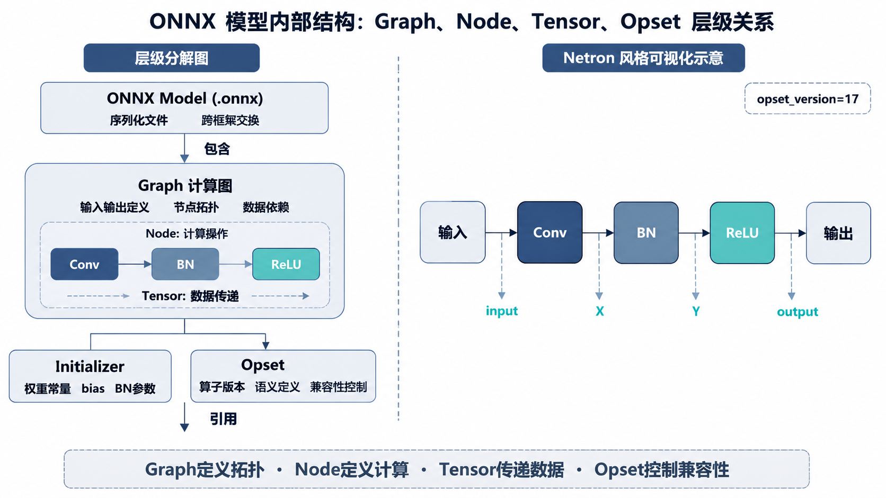
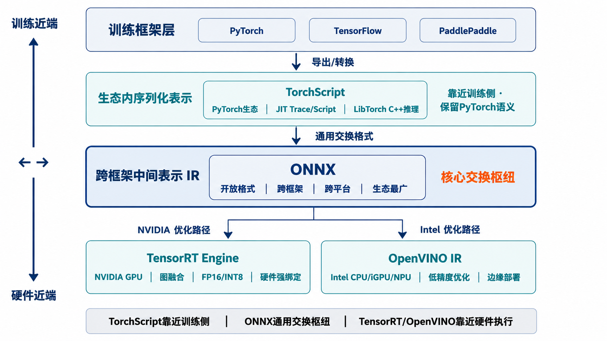
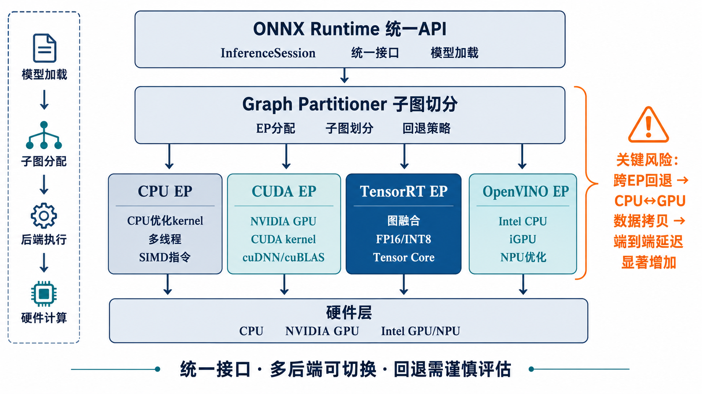
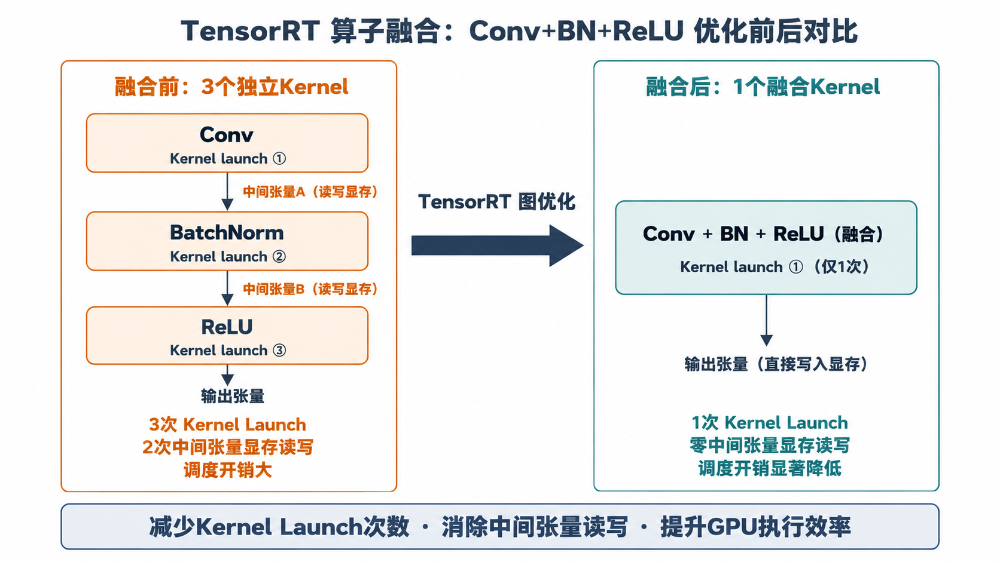
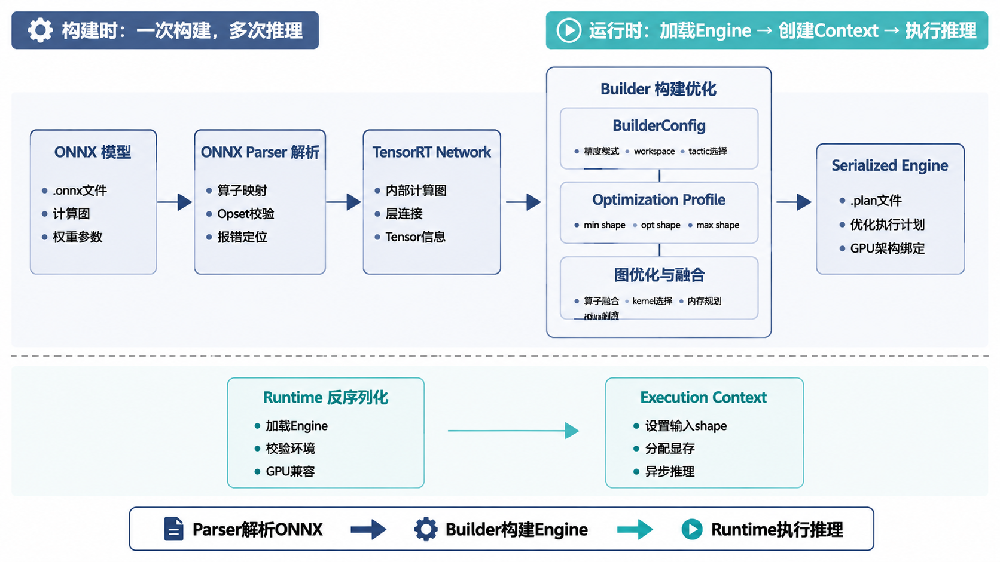
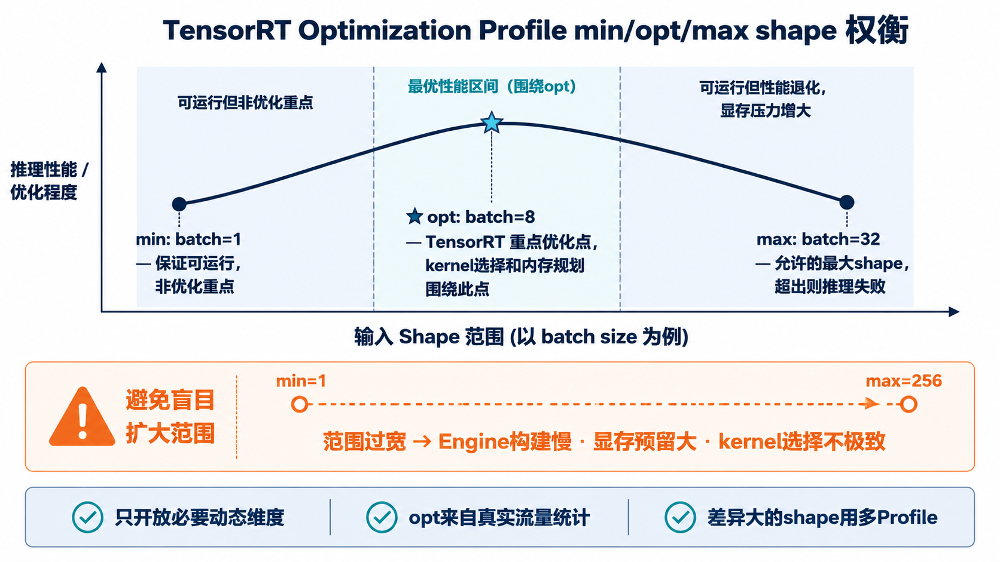
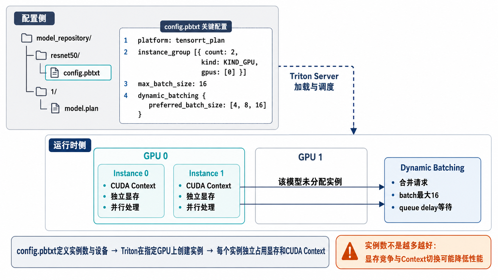
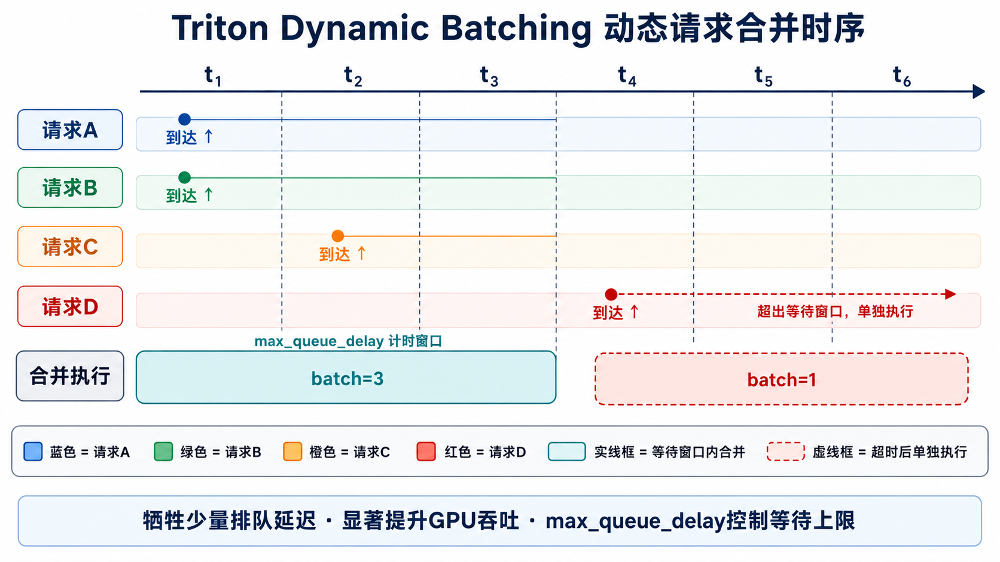

# 目录

> 本节围绕传统深度学习模型的推理部署展开，以ONNX和TensorRT这两大核心技术为主线，覆盖ONNX导出流程、中间表示原理、ONNX Runtime推理引擎、TensorRT高性能推理以及Triton Inference Server模型服务化部署等内容。读完本节后，读者可以系统理解PyTorch模型如何通过ONNX进行跨平台部署，掌握TensorRT的图优化、kernel选择、低精度推理和Engine构建流程，并能够从模型导出、推理加速、服务化部署等角度分析和解决传统模型部署中的常见问题。

[1.什么是ONNX？它有什么作用？](#1.什么是ONNX？它有什么作用？)
  - [面试问题：ONNX为什么能作为不同训练框架和推理框架之间的桥梁？](#面试问题-onnx为什么能作为不同训练框架和推理框架之间的桥梁)
  - [面试问题：ONNX由哪些核心组件组成？Graph、Node、Tensor和Opset分别表示什么？](#面试问题-onnx由哪些核心组件组成graph-node-tensor和opset分别表示什么)
  - [面试问题（进阶）：ONNX的Opset版本为什么会影响模型部署兼容性？](#面试问题-onnx的opset版本为什么会影响模型部署兼容性)

[2.模型中间表示在部署中有何优势？](#2.模型中间表示在部署中有何优势？)
  - [面试问题：为什么模型部署中常用中间表示而不是直接使用训练框架模型？](#面试问题-为什么模型部署中常用中间表示而不是直接使用训练框架模型)
  - [面试问题：中间表示如何帮助推理框架做图优化、硬件适配和跨平台部署？](#面试问题-中间表示如何帮助推理框架做图优化-硬件适配和跨平台部署)
  - [面试问题（进阶）：ONNX、TorchScript、TensorRT Engine和OpenVINO IR有什么区别？](#面试问题-onnx-torchscript-tensorrt-engine和openvino-ir有什么区别)

[3.PyTorch模型导出ONNX流程是怎样的？](#3.PyTorch模型导出ONNX流程是怎样的？)
  - [面试问题：PyTorch模型导出ONNX的基本流程是什么？](#面试问题-pytorch模型导出onnx的基本流程是什么)
  - [面试问题：导出ONNX时dynamic_axes、opset_version和input_names/output_names分别有什么作用？](#面试问题-导出onnx时dynamic_axes-opset_version和input_namesoutput_names分别有什么作用)
  - [面试问题（进阶）：如何验证导出的ONNX模型与PyTorch原模型输出一致？](#面试问题-如何验证导出的onnx模型与pytorch原模型输出一致)

[4.ONNX Runtime推理引擎相关高频问题](#4.ONNX-Runtime推理引擎相关高频问题)
  - [面试问题：ONNX Runtime的Execution Provider是什么？常见EP有哪些？](#面试问题-onnx-runtime的execution-provider是什么常见ep有哪些)
  - [面试问题：ONNX Runtime如何通过图优化、算子库和内存管理提升推理性能？](#面试问题-onnx-runtime如何通过图优化-算子库和内存管理提升推理性能)
  - [面试问题（进阶）：ONNX Runtime、TensorRT和OpenVINO在传统模型部署中如何选型？](#面试问题-onnx-runtime-tensorrt和openvino在传统模型部署中如何选型)

[5.ONNX实战中会遇到哪些问题？](#5.ONNX实战中会遇到哪些问题？)
  - [面试问题：ONNX导出失败或算子不支持时通常如何排查？](#面试问题-onnx导出失败或算子不支持时通常如何排查)
  - [面试问题：动态Shape、控制流和自定义算子为什么容易导致ONNX部署问题？](#面试问题-动态shape-控制流和自定义算子为什么容易导致onnx部署问题)
  - [面试问题（进阶）：ONNX模型推理结果与训练框架不一致时如何定位问题？](#面试问题-onnx模型推理结果与训练框架不一致时如何定位问题)

[6.TensorRT推理引擎相关高频问题](#6.TensorRT推理引擎相关高频问题)
  - [面试问题：TensorRT的核心优化能力有哪些？为什么在NVIDIA GPU上性能好？](#面试问题-tensorrt的核心优化能力有哪些为什么在nvidia-gpu上性能好)
  - [面试问题：TensorRT从ONNX到Engine的构建流程是怎样的？](#面试问题-tensorrt从onnx到engine的构建流程是怎样的)
  - [面试问题（进阶）：TensorRT中的Builder、Network、Parser、Optimization Profile和Engine分别是什么？](#面试问题-tensorrt中的builder-network-parser-optimization-profile和engine分别是什么)

[7.TensorRT实战中会遇到哪些问题？](#7.TensorRT实战中会遇到哪些问题？)
  - [面试问题：TensorRT部署中遇到不支持算子或插件算子时如何处理？](#面试问题-tensorrt部署中遇到不支持算子或插件算子时如何处理)
  - [面试问题：TensorRT动态Shape和Optimization Profile应该如何设置？](#面试问题-tensorrt动态shape和optimization-profile应该如何设置)
  - [面试问题（进阶）：TensorRT精度从FP32切到FP16/INT8后如何评估性能收益和精度损失？](#面试问题-tensorrt精度从fp32切到fp16int8后如何评估性能收益和精度损失)

[8.Triton-Inference-Server推理框架高频考点有哪些？](#8.Triton-Inference-Server推理框架高频考点有哪些？)
  - [面试问题：Triton Inference Server解决了模型服务化部署中的哪些问题？](#面试问题-triton-inference-server解决了模型服务化部署中的哪些问题)
  - [面试问题：Triton的模型仓库、Backend、Instance Group和Dynamic Batching分别是什么？](#面试问题-triton的模型仓库-backend-instance-group和dynamic-batching分别是什么)
  - [面试问题（进阶）：Triton如何支持多模型部署、并发调度和GPU资源利用优化？](#面试问题-triton如何支持多模型部署-并发调度和gpu资源利用优化)

---

<h1 id="1.什么是ONNX？它有什么作用？">1.什么是ONNX？它有什么作用？</h1>

> ONNX是一种开放的模型中间表示格式，用来描述神经网络的计算图、算子、参数和输入输出信息。它的核心作用是在PyTorch、TensorFlow等训练框架和ONNX Runtime、TensorRT、OpenVINO等推理框架之间建立统一交换格式，降低模型迁移和部署成本。

<h2 id="面试问题-onnx为什么能作为不同训练框架和推理框架之间的桥梁">面试问题：ONNX为什么能作为不同训练框架和推理框架之间的桥梁？</h2>

**难度评分：⭐⭐⭐ (3/5)  |  考察频率：⭐⭐⭐⭐⭐ (5/5)**

### 一、ONNX是什么？

ONNX全称是 Open Neural Network Exchange，可以理解为一种**神经网络模型的通用中间格式**。

训练框架通常有自己的模型表达方式，例如：

- PyTorch使用动态图和 `state_dict`
- TensorFlow使用GraphDef、SavedModel等格式
- 不同推理引擎又有自己的运行时格式，例如TensorRT Engine、OpenVINO IR

如果每个训练框架都要直接适配每个推理框架，工程复杂度会非常高。ONNX的作用就是在中间定义一套相对统一的模型表达方式，让训练框架可以把模型导出成ONNX，推理框架再读取ONNX进行优化和执行。

### 二、ONNX为什么能作为桥梁？

ONNX能作为桥梁，核心原因是它统一描述了模型推理所需的关键信息：

1. **计算图结构**：描述模型中有哪些节点、节点之间的数据依赖关系
2. **算子类型**：描述每个节点执行什么操作，例如Conv、MatMul、Relu、Softmax
3. **模型参数**：保存权重、bias等常量张量
4. **输入输出信息**：描述输入输出名称、shape和数据类型
5. **算子版本规范**：通过Opset定义不同算子的语义和版本

这样，训练框架只需要负责“导出ONNX”，推理框架只需要负责“解析ONNX并执行”，两边通过统一格式解耦。

### 三、ONNX在部署中的作用

ONNX在传统模型部署中主要有三个作用：

1. **模型交换**：把PyTorch、TensorFlow等训练产物转换成推理框架更容易接收的格式
2. **跨平台部署**：同一个ONNX模型可以尝试部署到CPU、GPU、NPU等不同硬件后端
3. **推理优化入口**：ONNX Runtime、TensorRT、OpenVINO等框架可以基于ONNX计算图做图优化、算子融合、常量折叠、低精度推理等优化

例如，一个PyTorch训练好的ResNet模型可以先导出为ONNX，再分别交给ONNX Runtime在CPU上推理，或交给TensorRT在NVIDIA GPU上构建Engine。

### 四、ONNX不是万能格式

ONNX解决的是模型表达和交换问题，但并不保证所有模型都能无痛部署。实际使用中仍然可能遇到：

- 训练框架中的某些算子无法导出
- 导出的算子目标推理框架不支持
- 动态shape、控制流、自定义算子支持不完整
- 不同Opset版本导致算子语义不一致
- 推理结果和原始框架存在细微数值差异

可以总结为：**ONNX的价值在于把训练框架和推理框架解耦，是模型部署中的通用交换格式；但真正能否高效稳定部署，还取决于算子支持、Opset版本、shape约束、目标推理框架和硬件后端。**

<h2 id="面试问题-onnx由哪些核心组件组成graph-node-tensor和opset分别表示什么">面试问题：ONNX由哪些核心组件组成？Graph、Node、Tensor和Opset分别表示什么？</h2>

**难度评分：⭐⭐⭐⭐ (4/5)  |  考察频率：⭐⭐⭐⭐ (4/5)**

### 一、ONNX模型的整体结构

一个ONNX模型本质上是一个序列化后的计算图，通常保存为 `.onnx` 文件。它主要包含：

1. **Graph**：模型的计算图
2. **Node**：计算图中的算子节点
3. **Tensor**：模型中的数据，包括输入、输出、中间张量和权重
4. **Initializer**：保存模型权重等常量参数
5. **Opset**：定义算子集合和算子版本



可以简单理解为：**Graph定义整体结构，Node定义具体计算，Tensor在节点之间传递数据，Initializer保存权重，Opset规定算子语义。**

### 二、Graph：计算图

Graph表示整个模型的前向计算流程。它描述：

- 模型有哪些输入
- 模型有哪些输出
- 中间有哪些计算节点
- 节点之间如何连接
- 哪些张量是常量权重

例如一个简单的神经网络可以表示成：输入Tensor经过Conv节点，再经过Relu节点，最后输出结果Tensor。

### 三、Node：算子节点

Node表示计算图中的一个计算操作。每个Node通常包含：

- 算子类型，例如Conv、Add、MatMul、Gemm
- 输入张量名称
- 输出张量名称
- 算子属性，例如卷积的kernel size、stride、padding

Node只描述“做什么计算”，真正怎么高效执行由ONNX Runtime、TensorRT等推理引擎决定。

### 四、Tensor和Initializer

Tensor是ONNX中数据传递的基本对象，可以表示：

- 模型输入
- 模型输出
- 中间激活
- 权重参数
- 常量数据

Initializer是一类特殊Tensor，通常用来保存训练好的权重、bias、BatchNorm参数等常量。推理时这些参数不会更新，只会被读取参与计算。

### 五、Opset：算子版本集合

Opset是ONNX中非常重要的概念。它定义了一组算子的版本和语义。

例如，同样是Resize、Slice、Pad这类算子，不同Opset版本中输入格式、属性字段或行为语义可能发生变化。导出ONNX时选择的Opset版本，会影响目标推理框架能否正确解析和执行模型。

可以总结为：**ONNX模型由计算图、算子节点、张量、权重和算子版本规范组成。面试中重点要说清楚Graph描述整体拓扑，Node描述具体算子，Tensor承载数据，Opset决定算子语义和兼容性。**

<h2 id="面试问题-onnx的opset版本为什么会影响模型部署兼容性">面试问题（进阶）：ONNX的Opset版本为什么会影响模型部署兼容性？</h2>

**难度评分：⭐⭐⭐⭐⭐ (5/5)  |  考察频率：⭐⭐⭐ (3/5)**

### 一、Opset是什么？

Opset可以理解为ONNX算子规范的版本号。ONNX不是只定义一个固定不变的算子集合，而是会随着深度学习框架和模型结构的发展不断更新算子定义。

每个Opset版本都会规定：

- 支持哪些算子
- 每个算子有哪些输入和输出
- 算子有哪些属性
- 算子的具体计算语义

因此，ONNX文件中不仅有模型结构，也会记录模型依赖的Opset版本。

### 二、为什么Opset会影响兼容性？

兼容性问题主要来自三个方面。

#### 1. 推理框架支持的Opset版本有限

不同推理引擎支持的Opset版本范围不同。如果导出的ONNX模型使用了较新的Opset，而目标推理框架版本较旧，就可能出现解析失败或算子不支持。

例如，ONNX Runtime通常对ONNX标准支持较全面，但某些硬件Execution Provider、TensorRT Parser或端侧推理框架可能只支持部分Opset和部分算子。

#### 2. 同一算子在不同Opset中语义可能变化

有些算子在不同Opset版本中输入格式、属性字段或行为细节会变化。例如Resize、Slice、Pad、Upsample等算子历史上就经历过多次定义调整。

如果训练框架导出和推理框架解析时对算子语义理解不一致，就可能导致推理结果不正确。

#### 3. 新模型结构可能依赖新算子

一些新模型结构会使用较新的算子或更复杂的组合。如果Opset版本过低，可能无法表达这些操作；如果Opset版本过高，目标推理框架又可能还没支持。

所以导出ONNX时不是Opset越新越好，而是要选择训练框架、模型结构和目标推理框架都支持的版本。

### 三、实际部署中如何选择Opset？

一般原则是：

1. **优先查看目标推理框架支持范围**：例如ONNX Runtime、TensorRT、OpenVINO分别支持哪些Opset和算子
2. **选择足够表达模型的最低稳定版本**：不要盲目追新
3. **导出后做模型检查**：使用ONNX checker、shape inference等工具验证模型合法性
4. **做端到端输出对齐**：比较ONNX模型与原始PyTorch/TensorFlow模型输出是否一致
5. **遇到不兼容时回退或升级Opset**：根据具体不支持的算子调整导出版本或改写模型结构

可以总结为：**Opset决定ONNX算子的版本和语义。不同推理框架支持的Opset范围不同，同一算子在不同Opset中也可能有输入、属性和行为差异，所以Opset会直接影响模型能否解析、能否正确执行以及结果是否一致。实际部署时要结合目标推理引擎选择合适Opset，并通过模型检查和输出对齐验证。**

<h1 id="2.模型中间表示在部署中有何优势？">2.模型中间表示在部署中有何优势？</h1>

> 模型中间表示是训练框架和推理运行时之间的标准化表达层，它把模型从具体训练代码中解耦出来，便于跨框架转换、图优化、硬件适配和生产部署。ONNX就是传统模型部署中最常见的中间表示之一。

<h2 id="面试问题-为什么模型部署中常用中间表示而不是直接使用训练框架模型">面试问题：为什么模型部署中常用中间表示而不是直接使用训练框架模型？</h2>

**难度评分：⭐⭐⭐ (3/5)  |  考察频率：⭐⭐⭐⭐⭐ (5/5)**

### 一、训练框架模型更适合研发，不一定适合部署

训练框架的模型表达通常服务于模型研发和训练，强调灵活性、可调试性和自动求导能力。例如PyTorch动态图非常适合实验和调试，但生产推理通常更关注：

- 执行路径是否稳定
- 是否容易做图优化
- 是否能脱离训练框架运行
- 是否能适配不同硬件后端
- 是否能降低线上依赖和部署复杂度

因此，直接把训练框架模型搬到线上虽然可行，但通常不是高性能、可维护部署的最佳方式。

### 二、中间表示可以解耦训练和推理

中间表示的核心价值是把模型从训练代码中抽离出来，只保留推理所需的信息：

1. **计算图结构**：模型前向计算怎么执行
2. **模型权重**：训练得到的参数
3. **输入输出签名**：输入输出名称、shape和类型
4. **算子语义**：每个节点对应什么计算操作

这样训练侧和部署侧就可以分工：训练框架负责训练和导出，推理框架负责加载、优化和执行。

### 三、中间表示更利于生产优化

推理框架拿到中间表示后，可以在计算图层面做很多训练框架不一定默认做的优化，例如：

- 常量折叠
- 死节点消除
- Conv + BN + ReLU融合
- MatMul + Bias + Activation融合
- 数据布局转换
- 静态内存规划
- 低精度量化
- 针对目标硬件选择高性能kernel

这些优化需要一个相对稳定、可分析的计算图，而不是任意Python动态图逻辑。

### 四、中间表示降低部署依赖

如果直接用训练框架上线，服务可能需要依赖完整PyTorch、TensorFlow、CUDA扩展、训练时代码结构和自定义Python逻辑。中间表示可以减少这类依赖，使部署包更轻、更稳定，也更容易在C++服务、边缘设备或专用推理平台中集成。

可以总结为：**模型中间表示的核心优势是解耦训练和推理，把灵活研发阶段的模型转换成更适合优化、迁移和上线的标准计算图。它让推理框架更容易做图优化、硬件适配和服务化部署。**

<h2 id="面试问题-中间表示如何帮助推理框架做图优化-硬件适配和跨平台部署">面试问题：中间表示如何帮助推理框架做图优化、硬件适配和跨平台部署？</h2>

**难度评分：⭐⭐⭐⭐ (4/5)  |  考察频率：⭐⭐⭐⭐ (4/5)**

### 一、帮助图优化：把模型变成可分析的计算图

中间表示通常会把模型前向过程表示成静态或半静态计算图。推理框架可以基于图结构分析节点依赖、张量生命周期和算子模式。

常见图优化包括：

1. **常量折叠**：提前计算编译期可确定的常量表达式
2. **死代码消除**：删除不影响输出的节点
3. **公共子表达式消除**：相同计算只保留一份
4. **算子融合**：把多个连续算子合并成更高效的执行单元
5. **布局转换**：根据硬件选择NCHW、NHWC或其他更高效格式

例如，推理框架可以识别Conv + BatchNorm + Relu模式，并将其融合为更少的kernel执行，从而减少中间张量读写和调度开销。

### 二、帮助硬件适配：让不同后端理解同一模型

不同硬件擅长的计算方式不同：

- CPU依赖SIMD、多线程和缓存友好布局
- NVIDIA GPU依赖CUDA、Tensor Core和高性能kernel
- Intel硬件可以使用OpenVINO进行图优化和低精度执行
- NPU通常依赖厂商编译器和专用算子格式

中间表示提供统一模型描述，推理框架再把同一个模型映射到不同硬件后端。例如ONNX Runtime可以通过不同Execution Provider把同一个ONNX模型交给CPU、CUDA、TensorRT、OpenVINO等后端执行。

### 三、帮助跨平台部署：减少重复转换成本

如果没有中间表示，每个训练框架和每个推理后端之间都要单独适配。中间表示相当于提供了统一接口：

```text
PyTorch / TensorFlow / Paddle
          ↓
        ONNX
          ↓
ONNX Runtime / TensorRT / OpenVINO / 端侧Runtime
```

这样可以减少模型迁移成本，也方便同一模型在不同平台上做性能对比和灰度验证。

### 四、需要注意中间表示不是最终性能保证

中间表示只是让优化和适配成为可能，不代表一定能获得最佳性能。实际效果还取决于：

- 目标推理框架的算子覆盖
- 硬件后端是否有高性能kernel
- 动态shape是否支持完善
- 是否能成功做算子融合和量化
- 输入大小、batch大小和精度策略是否合理

可以总结为：**中间表示通过标准计算图让推理框架能看懂模型、分析模型并重写模型，从而支持图优化、硬件后端映射和跨平台部署。但最终性能仍需要结合具体推理引擎、硬件和压测结果验证。**

<h2 id="面试问题-onnx-torchscript-tensorrt-engine和openvino-ir有什么区别">面试问题（进阶）：ONNX、TorchScript、TensorRT Engine和OpenVINO IR有什么区别？</h2>

**难度评分：⭐⭐⭐⭐⭐ (5/5)  |  考察频率：⭐⭐⭐ (3/5)**

### 一、它们都和模型部署有关，但定位不同

ONNX、TorchScript、TensorRT Engine和OpenVINO IR都可以用于模型部署，但它们的抽象层级、目标生态和硬件绑定程度不同。



简单来说：

- **ONNX**：更偏开放模型交换格式
- **TorchScript**：更偏PyTorch生态内的可序列化执行表示
- **TensorRT Engine**：更偏NVIDIA GPU上的高度优化执行计划
- **OpenVINO IR**：更偏Intel硬件上的优化中间表示

### 二、ONNX：通用开放中间表示

ONNX适合在不同训练框架和推理框架之间交换模型。它的优势是开放、生态广、跨平台能力强。

适合场景：

- PyTorch模型导出后交给ONNX Runtime推理
- PyTorch/TensorFlow模型转TensorRT前作为中间格式
- 需要跨CPU、GPU、不同推理框架进行部署验证

限制是：ONNX本身只是模型表示，不是最终高性能执行引擎；实际性能取决于后端推理框架。

### 三、TorchScript：PyTorch生态内的部署表示

TorchScript是PyTorch提供的模型序列化和图执行方式，通常通过trace或script得到。它能在一定程度上脱离原始Python代码，通过LibTorch在C++环境中运行。

适合场景：

- 团队主要使用PyTorch生态
- 希望保留较多PyTorch模型语义
- 使用C++ LibTorch部署

限制是跨框架能力不如ONNX，面向非PyTorch推理引擎的通用性较弱。另外，随着 PyTorch 2.x 引入 `torch.export` 和 `torch.compile`，TorchScript 在 PyTorch 生态内的定位正逐渐被取代，新项目建议优先评估 `torch.export` 导出的 ExportedProgram 而非 TorchScript。

### 四、TensorRT Engine：NVIDIA GPU上的优化产物

TensorRT Engine是TensorRT根据模型、输入shape范围、精度策略和目标GPU构建出的优化执行计划。它通常已经完成了图优化、kernel选择、算子融合、内存规划和低精度优化。

适合场景：

- NVIDIA GPU生产部署
- 对延迟和吞吐要求很高
- 模型结构和输入shape相对可控

限制是硬件绑定强、版本绑定强。Engine通常和GPU架构、TensorRT版本、CUDA环境强相关，可移植性弱。

### 五、OpenVINO IR：Intel硬件优化表示

OpenVINO IR是OpenVINO工具链使用的中间表示，通常面向Intel CPU、iGPU、NPU等硬件优化。它包含模型结构和权重，并可由OpenVINO Runtime进一步编译到目标设备。

适合场景：

- Intel CPU/iGPU/NPU部署
- 边缘设备、工业视觉、PC端AI
- CPU推理成本敏感场景

限制是主要服务Intel硬件生态，对NVIDIA GPU等非Intel硬件不是重点。

### 六、对比总结

| 表示形式 | 核心定位 | 硬件绑定 | 典型运行时 | 适合场景 |
|---|---|---|---|---|
| ONNX | 通用模型交换格式 | 弱 | ONNX Runtime、TensorRT Parser、OpenVINO | 跨框架、跨平台部署 |
| TorchScript | PyTorch可序列化执行表示 | 弱到中 | PyTorch / LibTorch | PyTorch生态部署 |
| TensorRT Engine | NVIDIA GPU优化执行计划 | 强 | TensorRT Runtime | NVIDIA GPU高性能推理 |
| OpenVINO IR | Intel生态优化中间表示 | 中到强 | OpenVINO Runtime | Intel CPU/iGPU/NPU推理 |

可以总结为：**ONNX更像通用交换格式，TorchScript更像PyTorch内部部署表示，TensorRT Engine是NVIDIA GPU上的最终优化执行计划，OpenVINO IR是Intel硬件生态的优化表示。选型时要看目标硬件、推理框架、性能要求和可移植性要求。**

<h1 id="3.PyTorch模型导出ONNX流程是怎样的？">3.PyTorch模型导出ONNX流程是怎样的？</h1>

> PyTorch模型导出ONNX的核心流程是：将模型切换到推理模式，准备符合真实输入形状的dummy input，调用ONNX导出接口生成ONNX文件，再通过ONNX checker、ONNX Runtime推理和输出对齐验证导出结果是否正确。

<h2 id="面试问题-pytorch模型导出onnx的基本流程是什么">面试问题：PyTorch模型导出ONNX的基本流程是什么？</h2>

**难度评分：⭐⭐⭐ (3/5)  |  考察频率：⭐⭐⭐⭐⭐ (5/5)**

### 一、导出前准备

PyTorch模型导出ONNX之前，通常需要先完成几件事：

1. **加载模型权重**：确保模型参数是训练完成后的目标版本
2. **切换到推理模式**：调用 `model.eval()`，关闭Dropout、固定BatchNorm行为
3. **准备示例输入**：构造一个与真实推理输入shape和dtype一致的dummy input
4. **确认模型前向逻辑稳定**：避免forward中包含无法导出的Python控制流、随机逻辑或外部依赖

其中 `model.eval()` 很关键，因为训练模式和推理模式下BatchNorm、Dropout等层的行为不同。如果忘记切换，导出的模型可能和线上推理期望不一致。

### 二、调用导出接口

常见导出方式是使用 `torch.onnx.export`，这是基于 trace 的传统方案。另外，PyTorch 2.1+ 提供了 `torch.onnx.dynamo_export`，基于 Dynamo 捕获计算图，对控制流、动态shape和 Python 数据结构的支持更好，适合复杂模型导出，是官方推荐的新方案。两者对比如下：

- `torch.onnx.export`（trace 模式）：成熟稳定，但遇到数据相关控制流会固化分支
- `torch.onnx.dynamo_export`（Dynamo 模式）：对动态控制流支持更好，导出的 ONNX 图通常更简洁

基本示例（传统方式）：

```python
import torch

model.eval()
dummy_input = torch.randn(1, 3, 224, 224)

torch.onnx.export(
    model,
    dummy_input,
    "model.onnx",
    input_names=["input"],
    output_names=["output"],
    opset_version=17,
    dynamic_axes={
        "input": {0: "batch_size"},
        "output": {0: "batch_size"},
    },
)
```

这里的dummy input不是训练数据，而是用来让导出器追踪模型前向计算路径和推断输入输出信息。

### 三、导出后检查

导出ONNX后，不能只看文件是否生成成功，还需要检查模型是否合法：

```python
import onnx

onnx_model = onnx.load("model.onnx")
onnx.checker.check_model(onnx_model)
```

常见还会做shape inference，检查中间张量shape是否能推断：

```python
onnx_model = onnx.shape_inference.infer_shapes(onnx_model)
onnx.save(onnx_model, "model_infer.onnx")
```

### 四、用ONNX Runtime验证推理

导出成功后，通常会用ONNX Runtime跑一次推理，并和PyTorch输出进行对齐。

核心检查包括：

- 输入名称是否正确
- 输入shape和dtype是否正确
- 输出数量和名称是否符合预期
- 输出数值是否与PyTorch接近

如果只是文件能打开，但输出差异很大，仍然不能认为导出成功。

### 五、整体流程总结

可以按下面流程回答：

```text
训练好的PyTorch模型
  ↓
model.eval()切换推理模式
  ↓
准备dummy input
  ↓
torch.onnx.export导出ONNX
  ↓
onnx.checker检查模型合法性
  ↓
ONNX Runtime运行推理
  ↓
与PyTorch输出对齐
```

可以总结为：**PyTorch导出ONNX不是简单保存文件，而是要保证推理模式正确、输入规格正确、Opset合适、模型检查通过，并通过ONNX Runtime和原模型输出对齐验证。**

<h2 id="面试问题-导出onnx时dynamic_axes-opset_version和input_namesoutput_names分别有什么作用">面试问题：导出ONNX时dynamic_axes、opset_version和input_names/output_names分别有什么作用？</h2>

**难度评分：⭐⭐⭐⭐ (4/5)  |  考察频率：⭐⭐⭐⭐ (4/5)**

### 一、opset_version：决定ONNX算子版本

`opset_version` 指定导出ONNX时使用的算子规范版本。它会影响模型中算子的表达方式和目标推理框架的兼容性。

选择时要考虑：

- 模型是否需要较新Opset才能表达
- ONNX Runtime、TensorRT、OpenVINO等目标后端是否支持该版本
- 某些算子在不同Opset中的语义是否变化

一般不建议盲目使用最新版本，而是选择目标推理框架稳定支持、同时能完整表达模型的版本。

### 二、input_names和output_names：定义输入输出名称

`input_names` 和 `output_names` 用来给ONNX模型的输入输出节点命名。

它们的作用是：

1. **方便推理调用**：ONNX Runtime推理时需要通过输入名传入数据
2. **方便调试和可视化**：Netron等工具中能看到清晰的输入输出名称
3. **方便服务化配置**：Triton等推理服务通常需要配置模型输入输出名称、shape和dtype

如果不显式指定，导出的名称可能比较难读，也不利于后续部署配置。

### 三、dynamic_axes：声明动态维度

`dynamic_axes` 用来告诉ONNX哪些维度不是固定值，而是运行时可以变化。

例如：

```python
dynamic_axes={
    "input": {0: "batch_size", 2: "height", 3: "width"},
    "output": {0: "batch_size"},
}
```

表示输入的batch、高度、宽度可以变化，输出的batch维也可以变化。

如果不设置dynamic_axes，导出的ONNX通常会把dummy input中的shape固化。例如dummy input是 `[1, 3, 224, 224]`，那么导出模型可能只接受固定batch和固定分辨率。

### 四、动态维度不是越多越好

虽然dynamic_axes可以提升灵活性，但动态shape也会增加部署和优化难度：

- TensorRT需要设置Optimization Profile
- 某些算子对动态shape支持不完整
- 动态shape可能降低图优化和内存规划效果
- 输入范围过宽会导致引擎构建和运行性能不稳定

所以工程中通常只开放必要的动态维度，例如batch维，或者为图像高宽设置有限范围。

可以总结为：**opset_version决定ONNX算子版本和兼容性；input_names/output_names定义模型输入输出接口，便于推理调用、调试和服务化配置；dynamic_axes声明哪些维度允许运行时变化，提升部署灵活性，但会增加后端优化和动态shape支持成本。**

<h2 id="面试问题-如何验证导出的onnx模型与pytorch原模型输出一致">面试问题（进阶）：如何验证导出的ONNX模型与PyTorch原模型输出一致？</h2>

**难度评分：⭐⭐⭐⭐⭐ (5/5)  |  考察频率：⭐⭐⭐ (3/5)**

### 一、为什么必须做输出对齐？

ONNX文件成功导出并不代表模型一定正确。导出过程中可能出现：

- 算子语义转换不一致
- 动态shape处理错误
- 控制流被trace成固定路径
- 数据预处理或输入dtype不一致
- 不同后端数值精度差异

因此，导出后必须比较ONNX模型和PyTorch原模型在相同输入下的输出是否接近。

### 二、基本验证流程

验证流程通常是：

1. 固定随机种子，准备一组或多组测试输入
2. PyTorch模型执行推理，得到基准输出
3. ONNX Runtime加载ONNX模型并执行推理
4. 比较两边输出的shape、dtype和数值误差
5. 用真实样本再做一次端到端验证

示例代码：

```python
import numpy as np
import onnxruntime as ort
import torch

model.eval()
x = torch.randn(2, 3, 224, 224)

with torch.no_grad():
    torch_out = model(x).detach().cpu().numpy()

session = ort.InferenceSession("model.onnx", providers=["CPUExecutionProvider"])
onnx_out = session.run(None, {"input": x.cpu().numpy()})[0]

np.testing.assert_allclose(torch_out, onnx_out, rtol=1e-3, atol=1e-5)
```

如果是FP16、INT8或TensorRT后端，误差阈值通常需要适当放宽，并结合任务指标评估。

### 三、需要对齐哪些内容？

输出对齐不只是比较最终数值，还要检查：

1. **输入对齐**：输入shape、dtype、layout、归一化方式一致
2. **模型状态对齐**：PyTorch必须是 `eval()` 模式，并关闭梯度
3. **输出结构对齐**：多输出模型要确认输出顺序和名称一致
4. **数值误差对齐**：使用合理的 `rtol` 和 `atol`
5. **任务指标对齐**：分类top-k、检测mAP、分割IoU等业务指标不能明显下降

### 四、如果输出不一致如何排查？

常见排查思路：

1. **先检查输入预处理**：很多不一致来自NCHW/NHWC、RGB/BGR、归一化参数不同
2. **检查训练/推理模式**：确认Dropout关闭、BatchNorm使用固定统计量
3. **降低后端复杂度**：先用ONNX Runtime CPU EP对齐，再切到CUDA/TensorRT
4. **检查导出方式**：trace可能固化分支，复杂控制流可考虑script或改写forward
5. **定位具体算子**：用中间层输出或简化模型定位是哪一段开始出现误差

可以总结为：**验证ONNX正确性要在相同输入、相同预处理和推理模式下，分别运行PyTorch和ONNX Runtime，比较输出shape、dtype和数值误差，并进一步用真实数据验证任务指标。如果不一致，应先排查输入预处理和模型模式，再逐步定位算子或后端差异。**

<h1 id="4.ONNX-Runtime推理引擎相关高频问题">4.ONNX Runtime推理引擎相关高频问题</h1>

> ONNX Runtime是一个跨平台推理运行时，它可以加载ONNX模型，并通过不同Execution Provider把计算分发到CPU、CUDA、TensorRT、OpenVINO等后端执行。它的核心优势是通用性强、生态成熟、后端可切换，适合传统模型的快速部署和跨硬件推理。

<h2 id="面试问题-onnx-runtime的execution-provider是什么常见ep有哪些">面试问题：ONNX Runtime的Execution Provider是什么？常见EP有哪些？</h2>

**难度评分：⭐⭐⭐⭐ (4/5)  |  考察频率：⭐⭐⭐⭐⭐ (5/5)**

### 一、Execution Provider是什么？

Execution Provider，简称EP，是ONNX Runtime中负责把ONNX计算图映射到具体硬件或推理后端执行的模块。

ONNX Runtime本身提供统一的模型加载、图优化和运行时接口，但真正执行算子时，可以交给不同EP完成。例如：

- CPU EP负责在CPU上执行算子
- CUDA EP负责在NVIDIA GPU上执行算子
- TensorRT EP负责把部分或全部图交给TensorRT优化执行
- OpenVINO EP负责在Intel硬件上执行

可以理解为：**ONNX Runtime是统一调度框架，Execution Provider是具体硬件后端。**



### 二、EP为什么重要？

同一个ONNX模型在不同EP上性能可能差异很大。原因是不同EP对应不同硬件和算子库：

1. **CPUExecutionProvider**：通用性强，适合验证正确性、小模型和CPU部署
2. **CUDAExecutionProvider**：直接使用GPU执行，适合NVIDIA GPU上的通用加速
3. **TensorrtExecutionProvider**：调用TensorRT做图优化、融合和低精度执行，适合追求更高GPU性能
4. **OpenVINOExecutionProvider**：针对Intel CPU、iGPU、NPU等硬件优化
5. **DirectMLExecutionProvider**：适合Windows平台上的DirectML后端
6. **CoreMLExecutionProvider**：适合Apple生态设备加速

因此，选择EP本质上就是选择ONNX Runtime的执行后端。

### 三、ONNX Runtime如何使用EP？

在Python中创建推理Session时，可以指定providers：

```python
import onnxruntime as ort

session = ort.InferenceSession(
    "model.onnx",
    providers=["CUDAExecutionProvider", "CPUExecutionProvider"],
)
```

这里表示优先使用CUDA EP，如果某些算子CUDA EP不支持，可能回退到CPU EP执行。实际是否回退、如何切图执行，取决于模型结构、算子支持和ONNX Runtime配置。

如果使用TensorRT EP，通常会写成：

```python
session = ort.InferenceSession(
    "model.onnx",
    providers=["TensorrtExecutionProvider", "CUDAExecutionProvider", "CPUExecutionProvider"],
)
```

这种顺序表示优先让TensorRT接管可支持的子图，其次CUDA，最后CPU。

### 四、EP回退需要谨慎

EP回退可以提升兼容性，但也可能带来性能问题。ORT 会根据 provider 列表顺序依次尝试分配算子：优先交给排在前面的 EP，该 EP 不支持的算子再交给下一个 EP。例如，若 TensorRT EP 不支持某个算子，ORT 会自动将该算子及其依赖的子图分配给 CUDA EP（若已配置）或 CPU EP 执行。但这种跨 EP 子图切换会引入 CPU ↔ GPU 数据拷贝和同步点，对端到端延迟影响较大。

所以生产部署时不能只看Session创建成功，还要确认：

- 关键算子是否都落在目标EP上，是否发生频繁跨EP回退
- 跨EP子图之间是否存在 CPU ↔ GPU 数据来回拷贝
- 可通过 ORT 日志或 profiler 查看各节点实际落在哪个 EP 上执行
- 端到端延迟和吞吐是否满足要求

可以总结为：**Execution Provider是ONNX Runtime连接不同硬件后端的机制。CPU EP通用，CUDA EP适合NVIDIA GPU，TensorRT EP适合进一步优化GPU推理，OpenVINO EP适合Intel硬件。实际部署时要关注算子是否真正落到目标EP，而不是只看模型能否运行。**

<h2 id="面试问题-onnx-runtime如何通过图优化-算子库和内存管理提升推理性能">面试问题：ONNX Runtime如何通过图优化、算子库和内存管理提升推理性能？</h2>

**难度评分：⭐⭐⭐⭐ (4/5)  |  考察频率：⭐⭐⭐⭐ (4/5)**

### 一、图优化：减少不必要计算和调度开销

ONNX Runtime加载模型后，会对ONNX计算图进行优化。常见优化包括：

1. **常量折叠**：把推理前就能确定的常量计算提前算好
2. **无效节点消除**：删除不影响输出的节点
3. **算子融合**：把连续算子合并成更高效的组合算子
4. **布局优化**：根据后端需要调整数据布局
5. **子图划分**：将不同子图分配给不同Execution Provider执行

例如，Conv + BatchNorm、MatMul + Add、Attention中的部分模式都有机会被融合，从而减少中间张量读写和kernel launch开销。

### 二、算子库：让单个算子执行更快

图优化解决“计算图怎么组织”，算子库解决“每个算子怎么执行”。ONNX Runtime会根据EP选择不同算子实现：

- CPU EP使用CPU优化kernel、多线程和SIMD指令
- CUDA EP使用CUDA kernel、cuDNN、cuBLAS等库
- TensorRT EP调用TensorRT构建优化子图
- OpenVINO EP调用OpenVINO后端优化Intel硬件执行

如果关键算子有高性能实现，推理速度会明显提升；如果关键算子只能走通用实现或回退CPU，性能可能不理想。

### 三、内存管理：减少分配开销和内存浪费

ONNX Runtime在运行时会做内存优化，常见包括：

1. **内存复用**：生命周期不重叠的中间张量复用同一块内存
2. **内存池**：减少频繁申请和释放内存的开销
3. **Arena Allocator**：为CPU/GPU内存分配做缓存和复用
4. **静态内存规划**：对shape稳定的模型提前规划中间张量内存

这些优化可以降低峰值内存、减少分配释放开销，并提升推理稳定性。

### 四、Session配置也会影响性能

ONNX Runtime推理性能还和Session配置有关，例如：

- `graph_optimization_level`：控制图优化级别
- `intra_op_num_threads`：单个算子内部并行线程数
- `inter_op_num_threads`：多个算子之间并行线程数
- providers顺序：决定优先使用哪个EP
- 是否开启TensorRT EP缓存、FP16、INT8等能力

示例：

```python
import onnxruntime as ort

options = ort.SessionOptions()
options.graph_optimization_level = ort.GraphOptimizationLevel.ORT_ENABLE_ALL
options.intra_op_num_threads = 8

session = ort.InferenceSession(
    "model.onnx",
    sess_options=options,
    providers=["CPUExecutionProvider"],
)
```

可以总结为：**ONNX Runtime通过图优化减少冗余计算和调度开销，通过不同Execution Provider调用高性能算子库，通过内存池和张量复用降低内存分配开销。实际性能取决于模型结构、EP选择、算子覆盖、线程配置、输入shape和batch大小，需要通过压测验证。**

<h2 id="面试问题-onnx-runtime-tensorrt和openvino在传统模型部署中如何选型">面试问题（进阶）：ONNX Runtime、TensorRT和OpenVINO在传统模型部署中如何选型？</h2>

**难度评分：⭐⭐⭐⭐⭐ (5/5)  |  考察频率：⭐⭐⭐ (3/5)**

### 一、三者定位不同

ONNX Runtime、TensorRT和OpenVINO都可以用于传统模型部署，但定位不同：

- **ONNX Runtime**：跨平台通用推理运行时，强调统一接口和多后端支持
- **TensorRT**：NVIDIA GPU上的高性能推理引擎，强调极致优化
- **OpenVINO**：Intel硬件生态的推理工具链，强调Intel CPU、iGPU、NPU上的优化

选型时首先看目标硬件，其次看模型结构、性能目标和工程成本。

### 二、优先按硬件选型

#### 1. NVIDIA GPU

如果目标硬件是NVIDIA GPU，通常优先评估TensorRT。TensorRT可以做图优化、kernel选择、算子融合、FP16/INT8推理和Engine构建，性能上限通常更高。

如果希望开发更快、接口更通用，也可以使用ONNX Runtime + CUDA EP或ONNX Runtime + TensorRT EP。

#### 2. Intel CPU / iGPU / NPU

如果目标硬件是Intel平台，优先评估OpenVINO。它对Intel CPU、集成GPU和部分NPU有更深入优化，也适合边缘工业视觉、PC端AI和CPU推理场景。

#### 3. 多硬件统一部署

如果同一个模型需要在不同硬件上部署，例如CPU、GPU、Windows、Linux、云端和边缘侧统一维护，ONNX Runtime通常更合适，因为它提供统一API和多EP支持。

### 三、再看性能和工程成本

选型不能只看benchmark，还要看工程落地成本：

| 维度 | ONNX Runtime | TensorRT | OpenVINO |
|---|---|---|---|
| 核心优势 | 跨平台、易集成、多EP | NVIDIA GPU性能强 | Intel硬件优化好 |
| 硬件绑定 | 弱 | 强 | 中到强 |
| 部署复杂度 | 低到中 | 中到高 | 中 |
| 动态shape | 支持较好，取决于EP | 需Optimization Profile | 支持较好，取决于模型 |
| 低精度推理 | 取决于EP | FP16/INT8成熟 | INT8/BF16等成熟 |
| 适合场景 | 快速部署、跨平台 | NVIDIA GPU极致性能 | Intel平台推理 |

### 四、实际项目中的常见策略

工程中常见做法是分阶段验证：

1. **先用ONNX Runtime CPU EP验证正确性**：确认ONNX导出没有问题
2. **再切换目标硬件后端**：例如CUDA EP、TensorRT EP或OpenVINO EP
3. **如果NVIDIA GPU性能不够，再构建TensorRT Engine**：追求更低延迟或更高吞吐
4. **如果Intel CPU部署，重点调OpenVINO**：关注线程数、NUMA、精度和batch
5. **最终用真实输入和线上负载压测**：比较P50/P95/P99延迟、吞吐、内存和稳定性

可以总结为：**如果追求跨平台和快速集成，优先ONNX Runtime；如果目标是NVIDIA GPU极致性能，优先TensorRT；如果部署在Intel CPU/iGPU/NPU，优先OpenVINO。实际选型必须结合模型算子支持、动态shape、精度策略、团队维护成本和真实压测结果。**

<h1 id="5.ONNX实战中会遇到哪些问题？">5.ONNX实战中会遇到哪些问题？</h1>

> ONNX实战中的问题通常集中在导出失败、算子不支持、动态Shape不兼容、控制流被错误固化、自定义算子无法解析以及推理结果不一致。排查时要区分问题发生在PyTorch导出阶段、ONNX模型检查阶段、推理引擎解析阶段，还是后端执行阶段。

<h2 id="面试问题-onnx导出失败或算子不支持时通常如何排查">面试问题：ONNX导出失败或算子不支持时通常如何排查？</h2>

**难度评分：⭐⭐⭐⭐ (4/5)  |  考察频率：⭐⭐⭐⭐⭐ (5/5)**

### 一、先判断失败发生在哪个阶段

ONNX相关问题不要一上来就改模型，应该先定位失败阶段：

1. **PyTorch导出阶段失败**：`torch.onnx.export` 报错，说明模型前向逻辑或某些PyTorch算子无法导出
2. **ONNX检查阶段失败**：`onnx.checker.check_model` 报错，说明生成的ONNX图不合法
3. **推理框架解析失败**：ONNX Runtime、TensorRT或OpenVINO加载时报错，说明目标后端不支持某些算子或属性
4. **运行阶段失败**：模型能加载，但推理时报shape、dtype、内存或后端执行错误
5. **结果不一致**：模型能跑，但ONNX输出和原框架输出差异明显

不同阶段对应不同解决办法。

### 二、导出失败的常见原因

PyTorch导出ONNX失败通常有几类原因：

- forward中包含无法追踪的Python逻辑
- 使用了ONNX不支持或当前Opset不支持的算子
- 输入类型不符合导出器要求
- 模型中存在依赖外部状态的分支或随机操作
- 自定义CUDA算子、自定义autograd函数无法直接导出
- trace导出时遇到数据相关控制流

例如，模型forward中如果根据输入tensor的值走不同Python分支，trace可能只能记录某一次输入走过的路径，导致导出不完整或语义错误。

### 三、算子不支持时怎么处理？

常见处理方式包括：

1. **调整Opset版本**：某些算子需要更高Opset才能表达，也可能需要降低Opset适配旧后端
2. **替换模型写法**：把不支持的PyTorch操作改写成ONNX更容易表达的基础算子组合
3. **拆分预处理或后处理**：将NMS、Tokenizer、复杂后处理等逻辑放到模型外部实现
4. **使用自定义算子**：为ONNX Runtime或TensorRT实现Custom Op / Plugin
5. **更换推理后端**：如果TensorRT不支持某些算子，可以先用ONNX Runtime CUDA EP验证
6. **简化模型定位问题**：逐步注释或拆分模型模块，找到具体不支持的层

工程中通常优先选择改写模型或拆出后处理，因为自定义算子和Plugin维护成本更高。

### 四、排查工具

常用工具包括：

- `onnx.checker`：检查ONNX模型是否合法
- `onnx.shape_inference`：推断并检查张量shape
- Netron：可视化ONNX计算图
- ONNX Runtime日志：查看算子执行和EP分配情况
- TensorRT parser日志：查看具体不支持的节点
- Polygraphy：常用于TensorRT/ONNX对比、调试和精度排查

可以总结为：**ONNX导出或算子不支持时，要先区分是导出失败、模型检查失败、后端解析失败还是运行失败。常见解决方法包括调整Opset、改写不支持算子、拆出复杂前后处理、使用Custom Op或TensorRT Plugin，并通过Netron、ONNX checker、ONNX Runtime和TensorRT日志定位具体问题节点。**

<h2 id="面试问题-动态shape-控制流和自定义算子为什么容易导致onnx部署问题">面试问题：动态Shape、控制流和自定义算子为什么容易导致ONNX部署问题？</h2>

**难度评分：⭐⭐⭐⭐ (4/5)  |  考察频率：⭐⭐⭐⭐ (4/5)**

### 一、动态Shape的问题

动态Shape指的是模型输入或中间张量的某些维度在运行时才确定，例如batch size、图像高宽、序列长度等。

动态Shape容易带来问题，原因是：

1. **图优化更难**：很多融合、内存规划和kernel选择依赖静态shape
2. **后端支持不一致**：ONNX Runtime支持相对灵活，但TensorRT需要Optimization Profile
3. **shape推断可能失败**：某些Reshape、Concat、Slice等操作依赖运行时shape
4. **性能不稳定**：不同shape可能走不同kernel或触发不同内存分配

因此，动态Shape虽然提升灵活性，但会增加部署和调优复杂度。实际工程中通常只开放必要维度，并限制输入范围。

### 二、控制流的问题

控制流包括if、for、while等分支和循环。训练框架中这些逻辑可以依赖Python运行时灵活执行，但ONNX导出后需要转换成静态图中的If、Loop等节点。

问题在于：

- trace导出可能只记录某一次输入经过的分支。例如，若 forward 中有 `if x.shape[2] > 512: ... else: ...` 这样的数据相关分支，trace 只会记录 dummy input 走过的那一条路径，另一条分支将完全丢失
- script虽然能保留部分控制流，但目标推理后端不一定支持 ONNX 的 If/Loop 节点
- TensorRT、端侧Runtime等对ONNX控制流支持可能有限
- 数据相关分支会让图优化和shape推断更复杂

所以部署模型时通常希望forward逻辑尽量稳定，把复杂业务分支放到模型外部处理。

### 三、自定义算子的问题

自定义算子包括自定义CUDA op、自定义C++ op、自定义autograd Function或训练框架中特有的算子。

它们容易出问题是因为ONNX标准并不知道这个算子的语义。即使导出成功，目标推理框架也可能不知道如何执行。

常见解决方式有：

1. **用标准ONNX算子重写**：优先推荐，部署最简单
2. **注册Symbolic导出规则**：告诉PyTorch如何把自定义操作导出成ONNX节点
3. **实现ONNX Runtime Custom Op**：让ORT知道如何执行该节点
4. **实现TensorRT Plugin**：让TensorRT在构建Engine时支持该算子

### 四、三类问题的共同本质

动态Shape、控制流和自定义算子的共同问题是：它们都削弱了模型图的静态可分析性和后端可移植性。

推理部署更喜欢规则、静态、标准算子组成的图，因为这样更容易做：

- 图优化
- 算子融合
- 内存规划
- 硬件kernel选择
- 低精度量化

可以总结为：**动态Shape会增加shape推断、内存规划和后端优化难度；控制流可能在trace导出时被固化，或在推理后端不被支持；自定义算子没有标准语义，目标引擎无法直接执行。实际部署中应尽量使用标准算子、限制动态维度范围、简化forward逻辑，并在必要时实现Custom Op或TensorRT Plugin。**

<h2 id="面试问题-onnx模型推理结果与训练框架不一致时如何定位问题">面试问题（进阶）：ONNX模型推理结果与训练框架不一致时如何定位问题？</h2>

**难度评分：⭐⭐⭐⭐⭐ (5/5)  |  考察频率：⭐⭐⭐ (3/5)**

### 一、先确认是不是输入和模式问题

很多ONNX输出不一致不是导出器的问题，而是输入预处理或模型状态没对齐。

首先检查：

1. **模型是否处于eval模式**：Dropout、BatchNorm在训练和推理下行为不同
2. **输入是否完全一致**：shape、dtype、layout、归一化、RGB/BGR顺序是否一致
3. **随机性是否关闭**：推理过程中不应有随机增强、随机采样或未固定行为
4. **输出是否取错**：多输出模型中输出顺序、名称是否对应正确

这一步能解决大量看似“ONNX不准”的问题。

### 二、先用最保守后端对齐

建议排查顺序是：

```text
PyTorch输出
  ↓ 对齐
ONNX Runtime CPU EP
  ↓ 对齐
ONNX Runtime CUDA EP
  ↓ 对齐
TensorRT / OpenVINO等优化后端
```

原因是CPU EP通常最接近ONNX标准语义，适合先验证导出是否正确。如果CPU EP和PyTorch都不一致，问题大概率在导出或输入对齐；如果CPU EP一致但TensorRT不一致，问题更可能在后端优化、精度或算子支持上。

### 三、比较数值误差要设置合理阈值

不同后端和精度下，数值完全一致不现实。通常要根据精度设置合理阈值：

- FP32：误差应较小，可以使用较严格 `rtol/atol`
- FP16/BF16：允许更大误差
- INT8/INT4：必须结合校准数据和任务指标看精度损失
- TensorRT融合后：可能因算子融合和计算顺序变化产生细微差异

因此，不要只看单个元素是否完全相同，而要看最大误差、平均误差、余弦相似度以及最终任务指标。

### 四、定位到具体层或算子

如果最终输出差异较大，需要缩小范围：

1. **导出中间层输出**：把关键中间节点临时作为模型输出
2. **二分定位模块**：逐段比较Backbone、Neck、Head等模块输出
3. **使用Netron查看图结构**：确认算子是否被错误转换或融合
4. **检查高风险算子**：Resize、Pad、Slice、Gather、NMS、TopK、LayerNorm等
5. **关闭部分优化**：降低图优化级别，判断是否由优化引入差异

对于TensorRT，还可以使用Polygraphy对比ONNX Runtime和TensorRT在各层输出上的差异。

### 五、常见问题来源

常见不一致来源包括：

- BatchNorm未切eval
- 输入预处理不一致
- Resize/Interpolate的align_corners或坐标变换模式不同
- trace导出固化了某个分支
- 动态shape下Reshape/Slice行为异常
- 后处理逻辑没有一起对齐
- FP16/INT8量化带来的数值误差
- TensorRT算子融合或Plugin实现不一致

可以总结为：**ONNX输出不一致时，应先排查eval模式、输入预处理、输出名称和dtype等基础问题；再按PyTorch、ONNX Runtime CPU、CUDA、TensorRT/OpenVINO的顺序逐级对齐；如果仍不一致，就通过中间层输出、图可视化、关闭优化和工具对比定位到具体算子。最终还要结合任务指标判断误差是否可接受。**

<h1 id="6.TensorRT推理引擎相关高频问题">6.TensorRT推理引擎相关高频问题</h1>

> TensorRT是NVIDIA面向GPU推理场景提供的高性能推理引擎，它通过图优化、算子融合、kernel自动选择、低精度推理、内存规划和Engine构建，把ONNX等模型转换成适合NVIDIA GPU高效执行的推理计划。

<h2 id="面试问题-tensorrt的核心优化能力有哪些为什么在nvidia-gpu上性能好">面试问题：TensorRT的核心优化能力有哪些？为什么在NVIDIA GPU上性能好？</h2>

**难度评分：⭐⭐⭐⭐ (4/5)  |  考察频率：⭐⭐⭐⭐⭐ (5/5)**

### 一、TensorRT是什么？

TensorRT是NVIDIA GPU上的高性能深度学习推理引擎。它通常用于把训练框架导出的模型，例如ONNX模型，转换成TensorRT Engine，并在NVIDIA GPU上执行推理。

它的目标不是重新训练模型，而是在保证精度可接受的前提下，让模型在NVIDIA GPU上跑得更快、占用更少显存、吞吐更高。

### 二、核心优化能力

TensorRT常见优化能力包括以下几类。

#### 1. 图优化

TensorRT会对计算图做常量折叠、无效节点删除、图结构简化等优化，减少不必要的计算。

#### 2. 算子融合

TensorRT会将多个连续算子融合成更少的kernel执行，例如：

- Conv + BatchNorm + ReLU
- MatMul + Bias + Activation
- Scale + ElementWise
- Transformer中的部分Attention子结构

融合可以减少中间张量读写、kernel launch次数和调度开销。



#### 3. Kernel自动选择

同一个卷积或矩阵乘法在GPU上可能有多种实现方式。TensorRT会根据输入shape、batch大小、数据类型和目标GPU，benchmark并选择更合适的kernel实现。

#### 4. 低精度推理

TensorRT支持FP32、TF32、FP16、BF16、INT8、FP8等不同精度，具体支持取决于GPU架构和TensorRT版本。

低精度推理可以：

- 减少显存占用
- 降低内存带宽压力
- 利用Tensor Core提升矩阵计算速度

#### 5. 内存优化

TensorRT会根据计算图和输入shape范围进行内存规划，复用中间张量buffer，减少峰值显存占用和分配释放开销。

### 三、为什么TensorRT在NVIDIA GPU上性能好？

原因在于TensorRT深度绑定NVIDIA GPU生态：

1. **能充分利用CUDA、cuDNN、cuBLAS和Tensor Core**
2. **针对不同GPU架构选择合适kernel**，例如Turing、Ampere、Hopper上的最优实现不同
3. **支持FP16、INT8、FP8等低精度硬件加速**
4. **构建Engine时提前完成大量优化**，减少运行时开销
5. **与NVIDIA驱动、CUDA和GPU内存体系结合紧密**

所以在NVIDIA GPU上，TensorRT通常比直接用训练框架推理或通用ONNX Runtime CPU推理更快。

### 四、TensorRT不是所有场景都最优

TensorRT也有使用限制：

- 主要面向NVIDIA GPU，跨硬件能力弱
- Engine和GPU架构、TensorRT版本、CUDA环境相关
- 动态shape需要设置Optimization Profile
- 不支持算子需要Plugin或改写模型
- INT8量化需要校准或Q/DQ图支持
- 构建Engine有额外耗时，调试成本较高

因此，TensorRT适合对NVIDIA GPU推理性能要求高、模型结构较稳定、团队具备一定部署调优能力的场景。

可以总结为：**TensorRT性能好的核心原因是它在NVIDIA GPU上做了深度图优化、算子融合、kernel选择、低精度Tensor Core加速和内存规划。它适合追求低延迟和高吞吐的NVIDIA GPU生产部署，但需要处理动态shape、算子支持、Engine兼容和精度校准等工程问题。**

<h2 id="面试问题-tensorrt从onnx到engine的构建流程是怎样的">面试问题：TensorRT从ONNX到Engine的构建流程是怎样的？</h2>

**难度评分：⭐⭐⭐⭐ (4/5)  |  考察频率：⭐⭐⭐⭐ (4/5)**

### 一、整体流程

TensorRT部署ONNX模型时，通常不是直接运行ONNX文件，而是先把ONNX解析成TensorRT网络，再构建成Engine。

基本流程如下：

```text
ONNX模型
  ↓
TensorRT Parser解析
  ↓
构建TensorRT Network
  ↓
设置Builder Config和Optimization Profile
  ↓
选择精度模式与workspace
  ↓
Build生成Serialized Engine
  ↓
Runtime反序列化Engine
  ↓
创建Execution Context执行推理
```

### 二、解析ONNX模型

TensorRT使用ONNX Parser读取ONNX模型，将ONNX计算图转换成TensorRT内部Network表示。

这一步常见问题是：

- 某些ONNX算子TensorRT不支持
- 某些属性或Opset版本不兼容
- 动态shape没有正确声明
- 自定义算子缺少Plugin实现

如果Parser报错，需要根据错误节点修改ONNX、调整Opset、改写模型或实现Plugin。

### 三、配置Builder

Builder负责根据Network和配置生成Engine。常见配置包括：

1. **最大workspace大小**：用于kernel选择和中间临时buffer
2. **精度模式**：FP32、FP16、INT8等
3. **Optimization Profile**：动态shape模型必须设置min/opt/max输入范围
4. **Tactic选择**：TensorRT会为算子选择不同实现策略
5. **Engine序列化**：构建完成后保存为 `.engine` 或 `.plan` 文件

如果是INT8推理，还需要提供校准器，或者使用带Q/DQ节点的量化ONNX模型。

### 四、构建和运行Engine

Engine是TensorRT构建后的优化执行计划，包含图优化结果、kernel选择、内存规划等信息。

注意，Engine 构建（Build）阶段涉及大量 kernel benchmark（tactic selection），对于 ResNet 等简单模型通常在秒到分钟级，但对于大模型（如 BERT-Large、ViT-Huge 等）构建时间可能达到数十分钟甚至小时级。因此生产环境中通常离线构建并缓存 Engine，避免线上首次加载时触发构建。

运行时流程通常是：

1. 加载序列化Engine
2. 创建Runtime并反序列化Engine
3. 创建Execution Context
4. 分配输入输出显存
5. 拷贝输入到GPU
6. 调用异步推理接口
7. 拷贝输出回CPU或交给后处理

在生产服务中，通常会提前构建并缓存Engine，避免每次启动或首次请求时重新构建导致延迟过高。

### 五、trtexec工具

TensorRT提供 `trtexec` 工具，可以快速从ONNX构建Engine并压测：

```bash
trtexec \
  --onnx=model.onnx \
  --saveEngine=model.engine \
  --fp16 \
  --minShapes=input:1x3x224x224 \
  --optShapes=input:8x3x224x224 \
  --maxShapes=input:16x3x224x224
```

它常用于验证ONNX是否能被TensorRT解析、构建Engine是否成功，以及初步评估延迟和吞吐。

可以总结为：**TensorRT从ONNX到Engine的流程是：Parser解析ONNX生成Network，Builder结合BuilderConfig、精度策略和Optimization Profile选择kernel并做图优化，最终生成序列化Engine；线上推理时Runtime反序列化Engine，创建Execution Context并执行推理。实际工程中通常会提前构建和缓存Engine。**

<h2 id="面试问题-tensorrt中的builder-network-parser-optimization-profile和engine分别是什么">面试问题（进阶）：TensorRT中的Builder、Network、Parser、Optimization Profile和Engine分别是什么？</h2>

**难度评分：⭐⭐⭐⭐⭐ (5/5)  |  考察频率：⭐⭐⭐ (3/5)**



### 一、Builder：负责构建优化后的Engine

Builder是TensorRT中负责模型编译和优化的对象。它会根据输入Network、BuilderConfig、精度策略和目标GPU，选择合适kernel、进行算子融合、内存规划，并最终构建Engine。

可以理解为：Builder负责“把模型编译成TensorRT可高效执行的形式”。

### 二、Network：TensorRT内部计算图

Network是TensorRT内部表示的模型计算图。它包含模型的层、输入输出Tensor、层之间的连接关系和部分shape信息。

Network可以通过两种方式得到：

- 使用ONNX Parser从ONNX模型解析得到
- 手动调用TensorRT API逐层构建

大多数工程中会选择从ONNX解析得到Network。

### 三、Parser：负责把ONNX转换成Network

Parser通常指ONNX Parser。它负责读取ONNX文件，并把ONNX中的Graph、Node、Tensor和Initializer转换成TensorRT内部Network。

Parser阶段常见错误包括：

- 不支持某个ONNX算子
- 不支持某个算子属性
- Opset版本不兼容
- Plugin没有注册

所以TensorRT部署中很多问题会首先暴露在Parser阶段。

### 四、Optimization Profile：描述动态shape范围

Optimization Profile用于动态shape模型。它告诉TensorRT每个动态输入维度的范围：

- **min shape**：最小输入shape
- **opt shape**：最常见或最希望优化的shape
- **max shape**：最大允许输入shape

例如图像模型可能设置：

```text
min: input = 1x3x224x224
opt: input = 8x3x224x224
max: input = 16x3x224x224
```

TensorRT会重点针对opt shape进行优化，同时保证min到max范围内的输入可以运行。

如果运行时输入shape超出Profile范围，推理会失败；如果范围设置过宽，可能影响Engine优化效果和显存占用。

### 五、Engine：构建后的优化执行计划

Engine是TensorRT构建出的最终优化产物。它包含：

- 优化后的网络结构
- 算子融合结果
- kernel/tactic选择结果
- 内存规划信息
- 支持的输入输出信息
- 精度策略相关信息

Engine可以序列化保存，生产环境通常直接加载Engine进行推理，而不是每次从ONNX重新构建。

需要注意，Engine不是通用模型格式，它通常与TensorRT版本、CUDA版本、GPU架构和构建配置相关，跨机器或跨版本迁移需要谨慎验证。

### 六、它们之间的关系

可以用下面流程理解：

```text
ONNX模型
  ↓ Parser
Network
  ↓ Builder + BuilderConfig + Optimization Profile
Engine
  ↓ Runtime反序列化
Execution Context
  ↓
执行推理
```

可以总结为：**Parser负责把ONNX解析成TensorRT内部Network，Network表示模型计算图，Builder负责根据配置优化并生成Engine，Optimization Profile用于描述动态shape范围，Engine是最终在TensorRT Runtime中执行的优化计划。理解这些对象的关系，是排查TensorRT构建和部署问题的基础。**

<h1 id="7.TensorRT实战中会遇到哪些问题？">7.TensorRT实战中会遇到哪些问题？</h1>

> TensorRT实战问题主要集中在不支持算子、Plugin开发、动态Shape配置、Optimization Profile设置、Engine兼容性、显存规划以及低精度推理带来的精度损失。面试中不仅要知道TensorRT性能好，还要能说明遇到部署失败、性能不达预期和精度下降时如何排查。

<h2 id="面试问题-tensorrt部署中遇到不支持算子或插件算子时如何处理">面试问题：TensorRT部署中遇到不支持算子或插件算子时如何处理？</h2>

**难度评分：⭐⭐⭐⭐ (4/5)  |  考察频率：⭐⭐⭐⭐⭐ (5/5)**

### 一、TensorRT为什么会遇到不支持算子？

TensorRT虽然支持大量常见深度学习算子，但它不是完整的训练框架运行时，也不是对ONNX所有算子的完全覆盖。

不支持算子常见原因包括：

1. **ONNX算子本身TensorRT不支持**
2. **算子支持但某些属性组合不支持**，例如特殊的Resize、Pad、Slice配置
3. **Opset版本过新或过旧**，导致Parser无法正确解析
4. **模型中存在自定义算子**，TensorRT不知道其计算语义
5. **动态Shape下某些算子无法静态推断输出维度**
6. **前处理或后处理被放进模型图中**，例如NMS、TopK变体、Decode逻辑等

因此，TensorRT部署不是简单“ONNX转Engine”，中间经常要处理算子兼容性问题。

### 二、先定位是哪一个节点不支持

遇到Parser报错时，第一步不是直接写Plugin，而是先定位具体失败节点。

常用方法包括：

- 查看TensorRT Parser日志
- 使用 `trtexec --verbose` 打印详细解析信息
- 用Netron查看ONNX图结构
- 用ONNX Runtime先验证ONNX模型本身是否可运行
- 用Polygraphy对比ONNX Runtime和TensorRT解析行为

例如可以先用：

```bash
trtexec \
  --onnx=model.onnx \
  --verbose \
  --saveEngine=model.engine
```

如果日志中明确指出某个节点或算子不支持，就围绕该节点处理。

### 三、处理不支持算子的常见方法

#### 1. 调整模型写法

这是最优先考虑的方法。将不支持的复杂操作改写为TensorRT支持的基础算子组合。

例如：

- 将复杂索引操作改成Gather、Slice、Concat等标准算子
- 将训练框架特有操作改成更通用的张量操作
- 避免在forward中写复杂Python逻辑

这种方式部署成本最低，也最容易维护。

#### 2. 调整ONNX导出配置

有些问题可以通过调整导出参数解决：

- 更换 `opset_version`
- 固定部分动态维度
- 修改 `dynamic_axes`
- 使用新的PyTorch ONNX导出器
- 对ONNX图做simplify或shape inference

例如某些算子在高版本Opset中表达更规范，但目标TensorRT版本可能尚未完全支持，因此需要结合TensorRT版本选择合适Opset。

#### 3. 将复杂前后处理移出模型

很多检测、分割、NLP模型会把后处理也导出到ONNX图中，例如：

- NMS
- bbox decode
- top-k筛选
- tokenizer相关逻辑
- 字符串处理
- 阈值过滤和业务规则

这些逻辑不一定适合放进TensorRT Engine。工程中常见做法是只让TensorRT负责神经网络主体，把复杂前后处理放在C++、Python或CUDA自定义代码中实现。

#### 4. 使用TensorRT Plugin

如果算子无法改写，又必须在Engine内部执行，就需要实现TensorRT Plugin。

Plugin的作用是告诉TensorRT：

- 这个自定义层输入输出shape是什么
- 支持哪些数据类型和format
- 运行时如何执行计算
- 是否支持FP16/INT8等低精度
- 如何序列化和反序列化参数

Plugin适合高频、性能敏感且无法用标准算子表达的操作。

### 四、Plugin的代价和风险

Plugin不是万能方案，它会增加工程复杂度：

- 需要C++/CUDA开发能力
- 需要适配TensorRT版本变化
- 需要处理动态shape和多精度支持
- 需要验证数值正确性
- 需要关注跨GPU架构兼容性
- 需要与Engine序列化、部署环境一起维护

所以面试中要强调：**优先改写模型或拆分前后处理，最后才考虑Plugin。**

### 五、常见排查顺序

实际工程中可以按下面顺序处理：

```text
确认ONNX模型本身可运行
  ↓
查看TensorRT Parser日志定位节点
  ↓
判断是否可通过Opset或导出配置解决
  ↓
尝试改写模型或简化ONNX图
  ↓
将复杂前后处理移出Engine
  ↓
仍无法解决时实现TensorRT Plugin
  ↓
对Plugin做精度、性能和稳定性验证
```

可以总结为：**TensorRT遇到不支持算子时，应先通过Parser日志、trtexec verbose、Netron和ONNX Runtime定位具体节点；然后优先调整Opset、改写模型、简化ONNX图或拆出复杂前后处理；只有当算子必须留在Engine内部且无法用标准算子表达时，才实现TensorRT Plugin。Plugin能力强但维护成本高，需要额外验证精度、性能和环境兼容性。**

<h2 id="面试问题-tensorrt动态shape和optimization-profile应该如何设置">面试问题：TensorRT动态Shape和Optimization Profile应该如何设置？</h2>

**难度评分：⭐⭐⭐⭐ (4/5)  |  考察频率：⭐⭐⭐⭐⭐ (5/5)**



### 一、TensorRT为什么需要Optimization Profile？

TensorRT构建Engine时需要提前做kernel选择、内存规划和图优化。如果输入shape完全固定，TensorRT可以针对这个shape做非常充分的优化。

但实际部署中经常存在动态输入，例如：

- batch size动态
- 图像高宽动态
- NLP序列长度动态
- 音频帧数动态
- 多模态输入长度动态

这时TensorRT需要知道输入shape的变化范围，才能在范围内构建可执行且可优化的Engine。Optimization Profile就是用来描述动态输入范围的。

一个Profile通常包含三组shape：

- **min shape**：允许的最小输入shape
- **opt shape**：最常见、最重点优化的输入shape
- **max shape**：允许的最大输入shape

### 二、min、opt、max分别怎么理解？

以图像分类模型为例：

```text
min shape: input = 1x3x224x224
opt shape: input = 8x3x224x224
max shape: input = 16x3x224x224
```

含义是：

- 运行时batch最小可以是1
- 最常见或希望重点优化的是batch 8
- 最大允许batch是16
- 超出这个范围的输入不能使用该Profile执行

TensorRT会重点围绕opt shape选择kernel和tactic，但要保证min到max之间的shape都能运行。

### 三、Profile范围不是越大越好

很多初学者会把Profile设置得非常宽，例如：

```text
min: 1x3x224x224
opt: 16x3x640x640
max: 128x3x2048x2048
```

这样虽然看起来灵活，但可能带来问题：

1. **Engine构建更慢**
2. **显存预留更大**
3. **kernel选择不够极致**
4. **opt shape以外的输入性能不稳定**
5. **某些算子在大范围动态shape下无法构建**

所以Profile应该根据真实线上流量设置，而不是盲目追求最大兼容范围。

### 四、如何设置合理的Optimization Profile？

合理设置Profile可以遵循几个原则：

#### 1. 只开放必要的动态维度

如果图像高宽固定，就只让batch动态；如果序列长度动态，就不要让无关维度也动态。

例如图像分类常见配置是：

```text
min: 1x3x224x224
opt: 8x3x224x224
max: 32x3x224x224
```

这样比同时开放H、W更容易优化。

#### 2. opt shape选择最常见输入

opt shape应该来自真实业务统计，例如线上最常见batch size、图像尺寸或序列长度。

如果大部分请求batch为8，那么opt设置为8通常比设置为最大batch更合理。

#### 3. 对差异很大的shape使用多个Profile

如果线上既有短序列，也有长序列，或者既有小图也有大图，可以设置多个Profile：

```text
Profile 0: 1x3x224x224  ~  8x3x224x224  ~  16x3x224x224
Profile 1: 1x3x512x512  ~  4x3x512x512  ~  8x3x512x512
Profile 2: 1x3x1024x1024 ~ 2x3x1024x1024 ~ 4x3x1024x1024
```

运行时根据输入shape选择合适Profile，可以获得更稳定的性能。

#### 4. 结合显存和吞吐测试

Profile设置最终要通过压测验证：

- 是否能成功构建Engine
- 最大shape下是否OOM
- opt shape延迟是否满足要求
- 不同shape下吞吐是否稳定
- 是否存在某些shape异常慢

### 五、运行时也要设置输入shape

动态shape Engine在运行时需要给Execution Context设置实际输入shape，然后才能执行推理。

如果运行时输入shape没有设置，或者超出Profile范围，推理会失败。

典型流程是：

```text
选择Optimization Profile
  ↓
设置当前输入shape
  ↓
检查输出shape和binding是否有效
  ↓
分配或复用输入输出buffer
  ↓
执行推理
```

这也是很多TensorRT动态shape模型“构建成功但运行失败”的原因。

可以总结为：**TensorRT的Optimization Profile用于描述动态输入的min、opt、max shape，其中opt shape是重点优化目标，min/max定义可运行范围。Profile范围不是越大越好，过宽会影响构建速度、显存占用和kernel选择效果。实际部署中应只开放必要动态维度，根据真实流量设置opt shape，对差异较大的输入使用多个Profile，并在运行时正确选择Profile和设置实际输入shape。**

<h2 id="面试问题-tensorrt精度从fp32切到fp16-int8后如何评估性能收益和精度损失">面试问题（进阶）：TensorRT精度从FP32切到FP16/INT8后如何评估性能收益和精度损失？</h2>

**难度评分：⭐⭐⭐⭐⭐ (5/5)  |  考察频率：⭐⭐⭐⭐ (4/5)**

### 一、为什么要从FP32切到FP16或INT8？

TensorRT低精度推理的主要目标是提升性能和降低资源占用。

相比FP32，FP16和INT8通常有以下优势：

- 计算吞吐更高，尤其能利用Tensor Core
- 显存占用更低
- 显存带宽压力更小
- batch更大时吞吐提升明显
- 部分模型延迟更低

但低精度也可能带来数值误差，尤其是INT8需要量化校准或量化感知训练支持。

### 二、评估不能只看延迟

从FP32切到FP16/INT8时，不能只看 `latency` 是否下降，还要系统评估：

| 维度 | 需要关注的问题 |
|---|---|
| 延迟 | 单请求平均延迟、P95/P99延迟是否下降 |
| 吞吐 | QPS、batch吞吐是否提升 |
| 显存 | Engine大小、运行时显存峰值是否下降 |
| 精度 | Top-1、mAP、F1、BLEU、困惑度等任务指标是否下降 |
| 稳定性 | 是否出现NaN、Inf、异常输出或长尾case退化 |
| 构建成本 | Engine构建时间、校准时间、部署复杂度是否可接受 |

生产部署中更关心端到端收益，而不是单个算子的理论加速。

### 三、FP16评估重点

FP16通常比INT8更容易落地，因为它不需要校准数据，TensorRT可以在支持FP16的GPU上自动选择FP16 kernel。

评估FP16时重点看：

1. **GPU是否支持FP16 Tensor Core加速**
2. **模型是否主要由Conv、MatMul、GEMM等计算密集算子组成**
3. **输出误差是否在可接受范围内**
4. **是否存在对数值范围敏感的算子**，例如Softmax、LayerNorm、归一化、指数运算等
5. **TensorRT是否保留部分层为FP32**，避免敏感层精度损失过大

FP16不一定总是大幅加速。如果模型瓶颈在数据搬运、前后处理、CPU调度或小算子launch开销，收益可能有限。

### 四、INT8评估重点

INT8的性能潜力更大，但风险也更高。INT8需要解决“浮点数如何映射到整数范围”的问题。

常见INT8路径有两类：

1. **PTQ**：Post Training Quantization，训练后量化，需要代表性校准数据
2. **QAT**：Quantization Aware Training，量化感知训练，训练中模拟量化误差

INT8评估要重点关注：

- 校准数据是否覆盖真实业务分布
- per-tensor还是per-channel量化
- 激活值是否存在长尾分布
- 敏感层是否需要保留FP16/FP32
- 任务指标是否明显下降
- 小样本case、边界case、长尾case是否退化

如果校准数据不代表线上分布，INT8模型即使在测试集上表现正常，也可能在线上出现明显精度问题。

### 五、如何做精度对齐？

建议按下面顺序对齐：

```text
FP32 PyTorch
  ↓
FP32 ONNX Runtime
  ↓
FP32 TensorRT
  ↓
FP16 TensorRT
  ↓
INT8 TensorRT
```

这样可以区分误差来源：

- PyTorch和ONNX不一致：可能是导出或输入预处理问题
- ONNX和FP32 TensorRT不一致：可能是Parser、算子实现或图优化问题
- FP32 TensorRT和FP16不一致：可能是半精度数值误差
- FP16和INT8差异大：通常与量化校准、敏感层或数据分布有关

对比指标可以包括：

- 最大绝对误差
- 平均绝对误差
- 相对误差
- 余弦相似度
- 中间层输出差异
- 最终任务指标

### 六、性能评估要看端到端链路

TensorRT Engine本身加速明显，不代表服务整体一定加速明显。还要看：

- 数据预处理是否仍在CPU上串行执行
- H2D / D2H拷贝是否成为瓶颈
- batch是否足够利用GPU
- 是否使用异步执行和CUDA Stream
- 后处理是否耗时过高
- 服务框架调度是否限制吞吐

例如检测模型中，如果NMS或后处理仍在CPU上耗时很高，那么仅将主干网络切到FP16，端到端延迟收益可能低于预期。

可以总结为：**TensorRT从FP32切到FP16/INT8时，要同时评估性能收益和精度损失。性能侧看延迟、吞吐、显存和端到端链路；精度侧按PyTorch FP32、ONNX FP32、TensorRT FP32、TensorRT FP16、TensorRT INT8逐级对齐，结合最大误差、余弦相似度和最终任务指标判断。FP16通常落地更简单，INT8收益更大但依赖代表性校准数据、敏感层处理和充分的长尾case验证。**

<h1 id="8.Triton-Inference-Server推理框架高频考点有哪些？">8.Triton-Inference-Server推理框架高频考点有哪些？</h1>

> Triton Inference Server是NVIDIA开源的模型推理服务框架，重点解决模型上线后的服务化、并发调度、多模型管理、动态Batch、异构Backend、模型热更新和GPU资源利用问题。它不是单个模型优化器，而是面向生产推理服务的统一服务框架。

<h2 id="面试问题-triton-inference-server解决了模型服务化部署中的哪些问题">面试问题：Triton Inference Server解决了模型服务化部署中的哪些问题？</h2>

**难度评分：⭐⭐⭐⭐ (4/5)  |  考察频率：⭐⭐⭐⭐ (4/5)**

### 一、Triton是什么？

Triton Inference Server是一个模型推理服务框架，用于把训练好的模型以服务形式对外提供推理能力。

它支持多种模型格式和后端，例如：

- TensorRT Engine
- ONNX Runtime
- PyTorch TorchScript
- TensorFlow SavedModel
- OpenVINO
- Python Backend
- 自定义Backend

Triton的核心价值不是替代TensorRT做底层算子优化，而是把不同类型的模型统一托管起来，提供稳定、高并发、可观测、易管理的推理服务。

### 二、为什么不能只用模型文件直接部署？

单个模型文件只能说明“模型怎么计算”，但生产推理还需要解决很多服务化问题：

1. **如何对外提供HTTP/gRPC接口**
2. **如何同时部署多个模型和多个版本**
3. **如何管理GPU上的多个模型实例**
4. **如何处理高并发请求**
5. **如何把小请求合并成batch提高吞吐**
6. **如何监控延迟、吞吐、错误率和GPU利用率**
7. **如何热加载、卸载或更新模型**
8. **如何在不同推理后端之间统一接口**

Triton就是为这些工程问题设计的。

### 三、Triton解决的核心问题

#### 1. 统一推理服务接口

Triton提供HTTP和gRPC接口，客户端不需要关心底层模型是TensorRT、ONNX Runtime还是PyTorch，只需要按约定传入输入Tensor并读取输出Tensor。

这降低了业务服务和模型运行时之间的耦合。

#### 2. 多模型和多版本管理

Triton通过模型仓库管理模型。一个服务进程可以同时加载多个模型，也可以为同一个模型保留多个版本。

这适合A/B测试、灰度发布和多任务推理服务。

#### 3. 并发调度

Triton可以同时处理多个客户端请求，并把请求分发到不同模型实例上执行。

如果一个模型配置了多个instance，Triton可以在多个实例之间调度请求，提高GPU利用率和吞吐。

#### 4. Dynamic Batching

很多线上请求是单条到达的，但GPU更适合批量计算。Triton可以在很短时间窗口内把多个小请求合并成一个batch执行。

这可以显著提升吞吐，但可能带来少量排队延迟。

#### 5. 监控和可观测性

Triton可以暴露推理服务相关指标，例如：

- 请求数量
- 推理延迟
- 队列延迟
- batch大小分布
- 模型执行时间
- GPU利用率相关指标

这些指标对线上性能调优和故障排查非常重要。

### 四、Triton和TensorRT是什么关系？

TensorRT主要负责把模型优化成适合NVIDIA GPU执行的Engine；Triton负责把这个Engine或其他模型格式托管成推理服务。

二者关系可以理解为：

```text
TensorRT：单模型、底层执行、性能优化
Triton：多模型、服务化、调度、并发、监控
```

在NVIDIA GPU生产部署中，常见组合是：

```text
PyTorch模型
  ↓ 导出ONNX
ONNX模型
  ↓ TensorRT构建
TensorRT Engine
  ↓ Triton托管
HTTP/gRPC推理服务
```

可以总结为：**Triton Inference Server主要解决模型上线后的服务化问题，包括统一HTTP/gRPC接口、多模型多版本管理、并发调度、Dynamic Batching、模型热加载和监控指标暴露。TensorRT偏向单模型底层优化，Triton偏向生产服务托管，两者经常组合使用：TensorRT负责生成高性能Engine，Triton负责对外提供高并发推理服务。**

<h2 id="面试问题-triton的模型仓库-backend-instance-group和dynamic-batching分别是什么">面试问题：Triton的模型仓库、Backend、Instance Group和Dynamic Batching分别是什么？</h2>

**难度评分：⭐⭐⭐⭐ (4/5)  |  考察频率：⭐⭐⭐⭐⭐ (5/5)**

### 一、模型仓库：Triton管理模型的目录结构

Triton通过模型仓库加载模型。模型仓库通常是一个目录，每个模型一个子目录，模型目录下再按版本号组织模型文件。

典型结构如下：

```text
model_repository/
  resnet50/
    config.pbtxt
    1/
      model.plan
  bert_onnx/
    config.pbtxt
    1/
      model.onnx
  preprocess/
    config.pbtxt
    1/
      model.py
```



其中：

- `resnet50`、`bert_onnx`、`preprocess` 是模型名
- `1` 表示模型版本
- `config.pbtxt` 是模型配置文件
- `model.plan`、`model.onnx`、`model.py` 是具体模型文件

模型仓库让Triton能够统一管理多个模型、多个版本和不同后端。

### 二、config.pbtxt：模型服务配置

`config.pbtxt` 用来描述模型的输入输出、batch策略、Backend、实例数量等信息。

常见配置包括：

```text
name: "resnet50"
platform: "tensorrt_plan"
max_batch_size: 16

input [
  {
    name: "input"
    data_type: TYPE_FP32
    dims: [3, 224, 224]
  }
]

output [
  {
    name: "output"
    data_type: TYPE_FP32
    dims: [1000]
  }
]
```

对于不同Backend，`platform` 或 `backend` 配置会不同。

### 三、Backend：模型由谁来执行

Backend表示Triton内部负责执行模型的运行时。不同模型格式会对应不同Backend。

常见Backend包括：

| Backend | 对应模型 | 典型场景 |
|---|---|---|
| TensorRT Backend | `.plan` / `.engine` | NVIDIA GPU高性能推理 |
| ONNX Runtime Backend | `.onnx` | 跨平台ONNX推理 |
| PyTorch Backend | TorchScript | PyTorch生态模型部署 |
| TensorFlow Backend | SavedModel / GraphDef | TensorFlow模型部署 |
| Python Backend | `model.py` | 前后处理、自定义逻辑、非标准模型 |
| Ensemble Backend | 多模型流水线 | 串联预处理、模型、后处理 |

Backend机制让Triton可以用统一服务接口管理不同类型的模型。

### 四、Instance Group：模型实例如何占用计算资源

Instance Group用于配置一个模型启动多少个实例，以及这些实例运行在哪些设备上。

例如：

```text
instance_group [
  {
    count: 2
    kind: KIND_GPU
    gpus: [0]
  }
]
```

表示在GPU 0上启动两个模型实例。

Instance Group的作用是：

- 提高并发处理能力
- 更充分利用GPU资源
- 控制模型实例分布在哪些GPU上
- 支持CPU实例或GPU实例部署
- 为不同模型分配不同资源

需要注意，实例数量不是越多越好。实例太多可能导致显存占用过高、上下文切换增加，反而降低性能。

### 五、Dynamic Batching：动态合并请求

Dynamic Batching是Triton非常重要的性能优化能力。

它的思想是：线上请求通常逐条到达，但GPU更适合batch计算。Triton可以在短时间内等待更多请求，把多个小请求合并成一个batch执行。



例如，4个独立请求：

```text
request1: batch=1
request2: batch=1
request3: batch=1
request4: batch=1
```

Triton可以合并成：

```text
merged batch = 4
```

这样GPU执行效率通常更高。

常见配置示例：

```text
dynamic_batching {
  preferred_batch_size: [4, 8, 16]
  max_queue_delay_microseconds: 1000
}
```

含义是：Triton优先尝试组成batch 4、8或16；最多等待1000微秒，如果等不到也会执行已有请求。

### 六、Dynamic Batching的权衡

Dynamic Batching可以提升吞吐，但也有代价：

- 等待合并请求会增加排队延迟
- batch过大可能导致显存压力上升
- 对低延迟场景不一定合适
- 请求shape差异较大时合并效果可能不好
- 后处理如果不能batch化，端到端收益会下降

因此，Dynamic Batching要结合业务目标调优。如果目标是高吞吐，可以适当增加等待时间和batch；如果目标是低延迟，就要控制queue delay。

可以总结为：**Triton的模型仓库用于按目录管理模型和版本；Backend决定模型由TensorRT、ONNX Runtime、PyTorch、Python等哪种运行时执行；Instance Group决定模型实例数量和设备分布；Dynamic Batching负责把短时间内到达的小请求合并成batch执行，以吞吐换取少量排队延迟。这几个概念共同构成了Triton生产推理服务的核心配置。**

<h2 id="面试问题-triton如何支持多模型部署-并发调度和gpu资源利用优化">面试问题（进阶）：Triton如何支持多模型部署、并发调度和GPU资源利用优化？</h2>

**难度评分：⭐⭐⭐⭐⭐ (5/5)  |  考察频率：⭐⭐⭐ (3/5)**

### 一、多模型部署能力

Triton可以在一个Server进程中同时加载多个模型，每个模型可以使用不同Backend、不同版本和不同实例配置。

例如一个完整视觉服务可能包含：

```text
preprocess模型：Python Backend
  ↓
detection模型：TensorRT Backend
  ↓
postprocess模型：Python Backend
```

也可以同时部署多个独立模型：

```text
resnet50
bert_classifier
yolo_detector
clip_encoder
ranker_model
```

这种能力适合模型平台、算法服务中台和多业务共享GPU资源的场景。

### 二、模型版本管理和热更新

Triton支持按版本目录管理模型。例如：

```text
model_repository/
  ranker/
    config.pbtxt
    1/
      model.onnx
    2/
      model.onnx
```

可以通过配置决定加载哪个版本，也可以在模型仓库更新后让Triton重新加载模型。

这对灰度发布、模型回滚和A/B实验很重要。

不过，生产中模型热更新仍需谨慎：

- 新版本输入输出必须兼容业务调用方
- 需要验证显存是否足够
- 需要关注加载新模型时的延迟抖动
- 需要保留回滚方案

### 三、并发调度机制

Triton面对多个客户端请求时，会根据模型配置将请求放入对应模型队列，然后调度到可用模型实例执行。

影响并发能力的关键配置包括：

1. **Instance Group数量**：同一模型启动几个实例
2. **Dynamic Batching配置**：是否合并多个请求
3. **模型Backend能力**：底层运行时是否支持高并发执行
4. **GPU数量和实例分布**：模型运行在哪些GPU上
5. **请求输入shape和batch大小**：是否容易合并和复用资源

如果一个模型只有一个实例，且单次推理耗时较长，其他请求可能会排队等待；增加实例或开启Dynamic Batching可以改善吞吐，但也会增加显存消耗。

### 四、GPU资源利用优化

Triton优化GPU资源利用通常从几个方向入手。

#### 1. 合理设置Instance Group

对于小模型，单个实例可能无法打满GPU，可以启动多个实例提高并发。

对于大模型，多个实例可能导致显存不足或竞争严重，此时应减少实例数量，重点优化batch和模型本身。

#### 2. 使用Dynamic Batching提高吞吐

当请求较碎、batch较小时，Dynamic Batching可以显著提升GPU利用率。

关键参数是：

- `preferred_batch_size`
- `max_queue_delay_microseconds`
- `max_batch_size`

它们共同决定吞吐和延迟之间的平衡。

#### 3. 使用TensorRT Engine提升单模型执行效率

如果模型运行在NVIDIA GPU上，通常可以先用TensorRT构建Engine，再由Triton托管。

这样可以同时获得：

- TensorRT的底层执行优化
- Triton的服务化和调度能力

#### 4. 使用Ensemble串联多阶段流程

Triton Ensemble可以把多个模型或处理阶段串成一个逻辑模型，例如：

```text
preprocess → inference → postprocess
```

这样客户端只需要请求一个服务，Triton内部完成多个阶段的调度。

但如果前后处理逻辑复杂或CPU耗时很高，仍需要单独压测端到端性能。

#### 5. 结合监控指标调优

Triton调优不能只凭经验，需要观察指标：

- 请求队列时间是否过高
- 模型推理时间是否过高
- batch大小是否达到预期
- GPU利用率是否偏低
- 显存是否接近上限
- P95/P99延迟是否满足SLA

如果GPU利用率低但队列时间高，可能是调度或CPU前后处理瓶颈；如果GPU利用率高且延迟高，可能需要扩容或优化模型。

### 五、常见调优思路

可以按下面顺序排查：

```text
确认单模型单请求延迟
  ↓
开启TensorRT或更高效Backend
  ↓
调整max_batch_size和Dynamic Batching
  ↓
调整Instance Group数量
  ↓
观察队列时间、推理时间、GPU利用率
  ↓
优化前处理、后处理和数据拷贝
  ↓
根据SLA决定扩容或拆分服务
```

这个过程的核心是区分瓶颈在模型执行、请求排队、CPU前后处理、数据拷贝还是GPU资源不足。

### 六、Triton部署的常见注意点

实际生产部署中还要注意：

- `config.pbtxt` 中输入输出名称、dtype、shape必须和模型一致
- `max_batch_size` 要和模型是否支持batch维度匹配
- Dynamic Batching可能提升吞吐但增加尾延迟
- 多实例会增加显存占用
- TensorRT Engine可能与GPU架构、TensorRT版本和CUDA版本相关
- Python Backend灵活但性能可能受GIL、CPU和数据拷贝影响
- Ensemble简化客户端调用，但不一定自动提升性能

可以总结为：**Triton通过模型仓库支持多模型多版本部署，通过Backend统一不同模型运行时，通过Instance Group和调度队列支持并发执行，通过Dynamic Batching把小请求合并成batch提高GPU吞吐，并通过监控指标指导资源调优。优化Triton服务时要同时关注模型执行时间、队列时间、batch大小、实例数量、GPU利用率和端到端SLA，而不是只看单次模型推理耗时。**