# 目录

> 本节围绕大模型推理部署展开，以 vLLM 和 SGLang 两大核心框架为主线，由浅入深覆盖大模型推理与传统的本质差异、主流框架选型、PagedAttention 与 RadixAttention 核心原理、连续批处理调度、量化技术（PTQ/QAT/AWQ/GPTQ/FP8）、FlashAttention 等通用优化、PD 分离与推测解码、性能评测指标体系、分布式部署以及实战排查等内容。读完本节后，读者可以系统地理解大模型推理从原理到上线的完整链路，掌握面试中高频考察的核心知识点。

[1.大模型推理与传统深度学习推理的核心差异是什么？](#1.大模型推理与传统深度学习推理的核心差异是什么？)
  - [面试问题：大模型推理和传统深度学习推理最本质的差异是什么？](#面试问题-大模型推理和传统深度学习推理最本质的差异是什么？)
  - [面试问题：Transformer自回归解码中Prefill阶段与Decode阶段有什么不同？](#面试问题-transformer自回归解码中prefill阶段与decode阶段有什么不同？)
  - [面试问题：大模型推理为什么会有"显存墙"问题？KV Cache为什么成为瓶颈？](#面试问题-大模型推理为什么会有显存墙问题kv-cache为什么成为瓶颈？)

[2.主流大模型推理框架如何对比与选型？](#2.主流大模型推理框架如何对比与选型？)
  - [面试问题：vLLM、SGLang、TensorRT-LLM、LMDeploy、Ollama各自的核心定位与优势是什么？](#面试问题-vllmsglangtensorrt-llmlmdeployollama各自的核心定位与优势是什么？)
  - [面试问题：实际项目中如何选择推理框架？请给出选型建议](#面试问题-实际项目中如何选择推理框架请给出选型建议)

[3.vLLM V1深度解析：EngineCore、PagedAttention、调度与KV Cache管理](#3.vllm-v1深度解析enginecorepagedattention调度与kv-cache管理)
  - [面试问题：PagedAttention的核心原理是什么？它如何解决KV Cache内存浪费问题？](#面试问题-pagedattention的核心原理是什么它如何解决kv-cache内存浪费问题？)
  - [面试问题：vLLM的连续批处理（Continuous Batching）是如何工作的？](#面试问题-vllm的连续批处理continuous-batching是如何工作的？)
  - [面试问题：vLLM V1的EngineCore架构如何理解？Scheduler如何调度请求？](#面试问题-vllm-v1的enginecore架构如何理解scheduler如何调度请求？)
  - [面试问题：vLLM V1部署时需要关注哪些关键参数？如何进行调优？](#面试问题-vllm-v1部署时需要关注哪些关键参数如何进行调优？)
  - [面试问题（进阶）：vLLM V1的Prefix Caching机制是如何实现的？](#面试问题-vllm-v1的prefix-caching机制是如何实现的？)

[4.SGLang深度解析：RadixAttention、结构化生成与后端执行](#4.sglang深度解析radixattention结构化生成与后端执行)
  - [面试问题：SGLang的RadixAttention与vLLM的PagedAttention有什么本质区别？](#面试问题-sglang的radixattention与vllm的pagedattention有什么本质区别？)
  - [面试问题：SGLang的前端DSL有何特点？gen、select、fork等语法解决了什么问题？](#面试问题-sglang的前端dsl有何特点genselectfork等语法解决了什么问题？)
  - [面试问题：SGLang的约束解码（Constrained Decoding）是如何实现的？](#面试问题-sglang的约束解码constrained-decoding是如何实现的？)
  - [面试问题：SGLang后端Runtime的执行流程是怎样的？与vLLM后端有何异同？](#面试问题-sglang后端runtime的执行流程是怎样的与vllm后端有何异同？)

[5.大模型量化技术详解：PTQ vs QAT、AWQ、GPTQ与FP8](#5.大模型量化技术详解ptq-vs-qatawqgptq与fp8)
  - [面试问题：PTQ和QAT有什么区别？各自适用于什么场景？](#面试问题-ptq和qat有什么区别各自适用于什么场景？)
  - [面试问题：AWQ的原理是什么？为什么"激活感知"很重要？](#面试问题-awq的原理是什么为什么激活感知很重要？)
  - [面试问题：GPTQ的原理是什么？逐层最优脑外科量化如何工作？](#面试问题-gptq的原理是什么逐层最优脑外科量化如何工作？)
  - [面试问题（进阶）：KV Cache量化和权重量化有什么不同？为什么要单独量化KV Cache？](#面试问题-kv-cache量化和权重量化有什么不同为什么要单独量化kv-cache？)
  - [面试问题：FP8量化有什么特点？与INT8/INT4量化相比有何优势？](#面试问题-fp8量化有什么特点与int8int4量化相比有何优势？)

[6.大模型推理底层性能优化：Attention、KV Cache与执行图](#6.大模型推理底层性能优化attentionkv-cache与执行图)
  - [面试问题：FlashAttention为什么能加速注意力计算？IO-aware具体指什么？](#面试问题-flashattention为什么能加速注意力计算io-aware具体指什么？)
  - [面试问题：MQA和GQA如何压缩KV Cache？会带来什么影响？](#面试问题-mqa和gqa如何压缩kv-cache会带来什么影响？)
  - [面试问题：什么是CUDA Graph？为什么它能降低大模型推理中的Launch Overhead？](#面试问题-什么是cuda-graph为什么它能降低大模型推理中的launch-overhead？)

[7.高级推理架构优化：PD分离、推测解码与多Token生成](#7.高级推理架构优化pd分离推测解码与多token生成)
  - [面试问题：Prefill和Decode阶段的瓶颈分别是什么？为什么需要分开优化？](#面试问题-prefill和decode阶段的瓶颈分别是什么为什么需要分开优化？)
  - [面试问题：什么是PD分离（Prefill-Decode Disaggregation）？它的架构是怎样的？](#面试问题-什么是pd分离prefill-decode-disaggregation它的架构是怎样的？)
  - [面试问题：什么是推测解码（Speculative Decoding）？Draft Model和Target Model如何协同？](#面试问题-什么是推测解码speculative-decodingdraft-model和target-model如何协同？)

[8.大模型推理服务评测、压测与容量规划](#8.大模型推理服务评测压测与容量规划)
  - [面试问题：大模型推理服务有哪些核心性能指标？TTFT、TPOT、Throughput分别衡量什么？](#面试问题-大模型推理服务有哪些核心性能指标ttfttpotthroughput分别衡量什么？)
  - [面试问题：如何进行大模型推理性能Benchmark？有哪些常用评测工具？](#面试问题-如何进行大模型推理性能benchmark有哪些常用评测工具？)

[9.大模型分布式推理部署：并行策略与多机多卡实践](#9.大模型分布式推理部署并行策略与多机多卡实践)
  - [面试问题：张量并行、流水线并行、数据并行在推理中各自适用什么场景？](#面试问题-张量并行流水线并行数据并行在推理中各自适用什么场景？)
  - [面试问题：vLLM如何配置多GPU分布式推理？关键并行参数如何选择？](#面试问题-vllm如何配置多gpu分布式推理关键并行参数如何选择？)

[10.大模型推理生产部署实践与常见问题排查](#10.大模型推理生产部署实践与常见问题排查)
  - [面试问题：使用Ollama本地部署大模型的流程是怎样的？有哪些常见问题？](#面试问题-使用ollama本地部署大模型的流程是怎样的有哪些常见问题？)
  - [面试问题：大模型推理中显存OOM如何排查和解决？](#面试问题-大模型推理中显存oom如何排查和解决？)
  - [面试问题：推理速度突然变慢或延迟抖动，通常从哪些方向排查？](#面试问题-推理速度突然变慢或延迟抖动通常从哪些方向排查？)

---

<h1 id="1.大模型推理与传统深度学习推理的核心差异是什么？">1.大模型推理与传统深度学习推理的核心差异是什么？</h1>

> 大模型推理与传统深度学习推理的本质差异在于：Transformer自回归解码引入的逐Token生成模式、KV Cache带来的巨大显存压力、以及Prefill/Decode两阶段截然不同的计算特征。这些差异导致传统推理框架（如ONNX Runtime、TensorRT）的直接经验无法简单移植到大模型场景。

<h2 id="面试问题-大模型推理和传统深度学习推理最本质的差异是什么？">面试问题：大模型推理和传统深度学习推理最本质的差异是什么？</h2>

**难度评分：⭐⭐⭐ (3/5)  |  考察频率：⭐⭐⭐⭐⭐ (5/5)**

### 一、传统深度学习推理的特点

传统深度学习推理（CV分类、检测、分割等）通常是一次性前向计算：

- 输入是固定或接近固定尺寸（如224×224图像、固定长度语音序列）
- 一次前向传播得到最终结果，不存在"自回归"迭代过程
- 显存占用主要是模型权重和中间激活，可在推理前准确预估
- 计算特征通常以计算密集型为主（卷积、全连接等大矩阵运算）

例如，ResNet-50推理流程：输入图像 → 一次前向 → 输出概率分布，流程简单直接。

### 二、大模型推理的独特特征

大模型（LLM）推理基于Transformer自回归解码，与传统推理有本质区别：

**1. 自回归生成模式**

大模型推理是一个"逐步生成"的过程：给定Prompt → 模型预测下一个Token → 将该Token拼接到输入 → 再次预测 → 循环直到遇到EOS或达到最大长度。

这意味着一次推理请求实际上要进行N次模型前向计算（N=生成Token数），每次的输入序列都更长一个 Token。

**2. KV Cache 机制**

在自回归生成过程中，已计算的Key和Value矩阵会被缓存复用，避免重复计算历史Token的注意力。KV Cache是保证推理效率的关键，但它会随着生成Token数线性增长，成为最大的显存消耗来源。

**3. 两阶段计算特征**

- Prefill阶段：一次性处理Prompt的所有Tokens，并行计算注意力，属于计算密集型
- Decode阶段：逐个生成Token，每次只处理一个新Token，注意力计算中大量访存KV Cache，属于访存密集型

**4. 动态性与不确定性**

- 输入Prompt长度可变（从几十到几万Tokens）
- 输出长度不确定（取决于模型生成和停止条件）
- 并发请求的到达时间、长度各不相同

### 三、本质差异总结

| 维度 | 传统推理 | 大模型推理 |
|------|---------|-----------|
| 推理模式 | 一次前向 | 自回归迭代生成 |
| 计算次数 | 固定1次 | 取决于输出长度（N次） |
| 输入尺寸 | 通常固定 | 可变长（几十~几万Token） |
| 输出尺寸 | 固定 | 可变长、不确定 |
| 显存瓶颈 | 权重+激活 | 权重+KV Cache（动态增长） |
| 计算瓶颈 | 计算密集为主 | Prefill计算密集/Decode访存密集 |
| 批处理 | Static/Dynamic Batching | Continuous Batching |

可以总结为：**大模型推理和传统推理最本质的差异在于自回归生成模式引入的KV Cache管理与两阶段计算特征。传统推理是"一次性计算"，大模型推理是"循环迭代+动态内存管理"。这一差异使得大模型需要全新的推理框架和调度策略。**

---

<h2 id="面试问题-transformer自回归解码中prefill阶段与decode阶段有什么不同？">面试问题：Transformer自回归解码中Prefill阶段与Decode阶段有什么不同？</h2>

**难度评分：⭐⭐⭐⭐ (4/5)  |  考察频率：⭐⭐⭐⭐⭐ (5/5)**

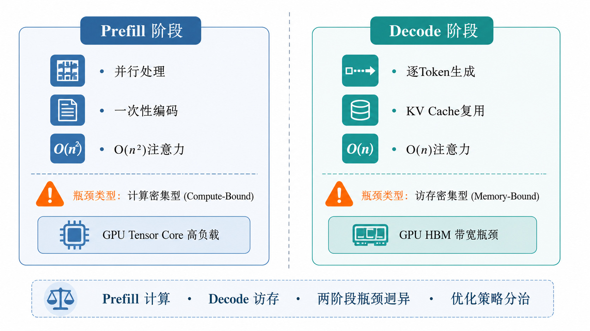

### 一、Prefill阶段

Prefill阶段处理输入的Prompt（提示词），一次性完成所有Prompt Token的编码：

**计算特征：**
- 一次性将所有Prompt Token输入模型，计算所有层的K、V矩阵
- 首次生成Token时，需要计算Prompt中所有Token之间的Attention（因果掩码下仍为O(n²)复杂度）
- K、V矩阵计算结果存入KV Cache供后续Decode复用
- 计算量大、并行度高，属于**计算密集型**（Compute-Bound）

**核心操作：**
```
给定 Prompt = [t1, t2, ..., tn]
→ 一次性前向计算所有n个Token的注意力
→ 生成第一个输出Token
→ 将n个Token的KV全部存入KV Cache
```

### 二、Decode阶段

Decode阶段是逐个Token生成的迭代过程：

**计算特征：**
- 每次只处理一个新生成的Token
- 该Token只需与所有历史Token（Prompt + 已生成的）计算注意力
- 历史Token的K、V直接从KV Cache读取，无需重计算
- 单Token的计算量很小，但需要访问大量KV Cache数据，属于**访存密集型**（Memory-Bound）
- GPU计算单元大量时间在等待HBM数据读取

**核心操作：**
```
每步迭代：
→ 输入当前最新Token
→ 从KV Cache读取所有历史K、V
→ 计算该Token与历史的Attention
→ 生成下一个Token
→ 将新Token的KV追加到KV Cache
```

### 三、两阶段对比总结

| 维度 | Prefill | Decode |
|------|---------|--------|
| 输入 | Prompt全部Token（并行） | 单个新Token（串行） |
| 计算量 | 大（O(n²)注意力） | 小（O(n)单Token注意力） |
| 访存量 | 相对低（权重一次加载） | 大（读取全部KV Cache） |
| 瓶颈类型 | 计算密集型（Compute-Bound） | 访存密集型（Memory-Bound） |
| 并行度 | 高（所有Token并行计算） | 低（只能逐个生成） |
| 延迟贡献 | TTFT的主要来源 | TPOT的主要来源 |
| KV Cache | 写入阶段 | 读写阶段 |

### 四、两阶段差异的工程意义

理解Prefill和Decode的差异，才能理解大模型推理优化的核心方向：

1. **Prefill优化方向**：利用并行计算能力，减少计算延迟。例如FlashAttention、算子融合、量化矩阵乘法
2. **Decode优化方向**：减少KV Cache读取量，提高HBM带宽利用率。例如MQA/GQA减少KV头数、KV Cache量化、FlashDecoding
3. **调度优化方向**：将Prefill和Decode分开调度（PD分离），避免Decode的访存密集特征拖慢Prefill的计算效率

可以总结为：**Prefill是一次性并行计算的"重"阶段，瓶颈在计算；Decode是逐个Token串行生成的"轻"阶段，瓶颈在访存。大模型推理优化的核心就是针对这两个截然不同的阶段采取不同的优化策略。**

---

<h2 id="面试问题-大模型推理为什么会有显存墙问题kv-cache为什么成为瓶颈？">面试问题：大模型推理为什么会有"显存墙"问题？KV Cache为什么成为瓶颈？</h2>

**难度评分：⭐⭐⭐⭐ (4/5)  |  考察频率：⭐⭐⭐⭐ (4/5)**

### 一、什么是"显存墙"？

"显存墙"指的是大模型推理中，GPU显存容量和带宽成为限制推理性能和模型规模的核心瓶颈。

对于一个70B参数的大模型：
- 模型权重：70B × 2字节（FP16）≈ 140GB
- 单个80GB的A100/H100 GPU无法完整存放，即使使用多卡张量并行，KV Cache的增量开销依然巨大

### 二、KV Cache的显存开销计算

KV Cache的显存占用公式为：

```
KV Cache大小 = 2 × 层数 × kv_heads × head_dim × 序列长度 × 精度字节数
```

> 注：对于 MHA（所有注意力头独立 K/V），`kv_heads = num_heads`，则 `kv_heads × head_dim = hidden_size`；对于 GQA（分组共享 K/V），`kv_heads` 为实际的 K/V 头数。

以 Llama-2-70B 为例（层数=80, num_heads=64, head_dim=128, FP16）：

- **MHA 下**（64个KV头）：单个Token的KV Cache = 2 × 80 × 64 × 128 × 1 × 2 = 2.6MB
- 如果上下文长度4096，单个请求的KV Cache：2.6MB × 4096 ≈ 10.7GB
- **GQA 下**（8个KV头）：单个Token的KV Cache = 2 × 80 × 8 × 128 × 1 × 2 = 0.33MB
- 上下文长度4096时，单个请求的KV Cache：0.33MB × 4096 ≈ 1.3GB（约为MHA的1/8）

当并发请求数增加时，KV Cache的显存占用线性增长，很快成为显存瓶颈。

### 三、为什么KV Cache是瓶颈？

**1. 动态增长、难以预分配**

与模型权重在启动时就确定不同，KV Cache随着每一个Decode步骤动态增长。传统推理框架固定的内存管理策略（一次分配、大小固定）无法高效适配这种动态性，容易造成严重的内存碎片和浪费。

**2. 离散化浪费**

如果继续采用传统的内存分配方式（为每个请求预先分配最大长度的KV Cache空间），即使实际只用了几百个Token，也要预留4096甚至更长的KV Cache空间。这造成大量显存"空占不用"，严重的显存利用率可能不到30%。

**3. 访存瓶颈**

Decode阶段每个Token的生成需要读取全部KV Cache。随着序列长度增长，每次Decode的访存量越来越大，而计算量不变，导致GPU计算单元大量空闲等待数据。这本质上是**显存带宽**瓶颈，而非计算瓶颈。

可以总结为：**大模型的"显存墙"核心在于KV Cache的动态增长与GPU有限显存的矛盾。传统固定内存分配导致大量浪费，KV Cache成为显存瓶颈的核心原因包括：动态增长难以预分配、离散化浪费严重、Decode阶段访存压力大。PagedAttention等技术的诞生正是为了解决这些问题。**

---

<h1 id="2.主流大模型推理框架如何对比与选型？">2.主流大模型推理框架如何对比与选型？</h1>

> 当前主流大模型推理框架各有侧重：vLLM以PagedAttention和连续批处理能力闻名，是高吞吐推理服务中常见的选择；SGLang以RadixAttention和结构化生成为差异化优势；TensorRT-LLM更偏向NVIDIA GPU上的低延迟和深度优化；LMDeploy注重端到端一站式部署；Ollama主打轻量易用。面试中不仅需要了解各框架特点，更需要能根据实际场景做出合理的选型判断。

<h2 id="面试问题-vllmsglangtensorrt-llmlmdeployollama各自的核心定位与优势是什么？">面试问题：vLLM、SGLang、TensorRT-LLM、LMDeploy、Ollama各自的核心定位与优势是什么？</h2>

**难度评分：⭐⭐⭐⭐ (4/5)  |  考察频率：⭐⭐⭐⭐⭐ (5/5)**

### 一、vLLM：高吞吐推理引擎

**核心定位**：开源高性能LLM推理引擎，面向企业级高并发在线服务场景。

**核心技术优势**：
- **PagedAttention**：将KV Cache分页管理，类似操作系统的虚拟内存，减少预留浪费和碎片化，提升显存利用率
- **Continuous Batching**：请求到达和完成时动态加入/移出批次，无需等待整批完成
- **高吞吐**：在合适的硬件、模型和负载条件下，吞吐量通常明显高于原生HuggingFace推理
- **Prefix Caching**：自动复用相同Prompt前缀的KV Cache
- **生态支持广**：覆盖Llama、Mistral、Qwen、DeepSeek等常见开源模型，具体兼容性仍需以版本和模型实现为准
- **多GPU支持**：内置张量并行和流水线并行

**局限性**：配置参数较多，初次部署调优有一定门槛；显存需求仍然较大，小显存GPU运行时不够灵活。

### 二、SGLang：结构化生成与高效前缀复用

**核心定位**：面向复杂交互逻辑和结构化生成的LLM推理框架，兼具高效的KV Cache前缀复用能力。

**核心技术优势**：
- **RadixAttention**：基于Radix Tree（基数树）的KV Cache前缀复用，自动匹配共享前缀，比PagedAttention更适合有大量共享Prompt的场景（如多轮对话、少样本提示）
- **前端DSL**：提供gen、select、fork等高级编程语法，简化复杂调用链的编写
- **约束解码**：支持JSON Schema、正则表达式等约束生成，保证输出格式符合要求
- **结构化输出**：原生支持Agent调用链、工具调用等复杂生成逻辑

**局限性**：社区规模较vLLM小，部分小众模型适配可能滞后（主流模型覆盖较好）；学习DSL语法有一定学习成本。

### 三、TensorRT-LLM：NVIDIA GPU极致性能

**核心定位**：NVIDIA官方LLM推理加速框架，侧重低延迟和GPU利用率优化。

**核心技术优势**：
- **In-Flight Batching**：类似Continuous Batching，支持动态批处理
- **极致优化**：与TensorRT生态深度集成，kernel融合、FP8量化、KV Cache压缩等极致优化
- **最低延迟**：TTFT和TPOT均能做到极低水平
- **Triton集成**：可与Triton Inference Server深度集成，支持多模型服务化管理
- **C++ Executor**：提供 C++ 语言运行时接口，进一步降低 Python 解释器开销，适合对延迟敏感的生产部署

**局限性**：模型转换流程复杂，需将HuggingFace模型编译为TensorRT Engine；只支持NVIDIA GPU；ONNX导出→TensorRT构建链路较长。

### 四、LMDeploy：一站式端到端部署

**核心定位**：上海人工智能实验室（Shanghai AI Lab）开源的端到端LLM部署工具链，注重工具链完整性和量化能力。

**核心技术优势**：
- **TurboMind推理引擎**：专用C++推理引擎，支持连续批处理
- **模型压缩能力突出**：支持W4A16量化（4-bit权重+16-bit激活）、KV Cache INT8/INT4量化
- **长上下文优化**：对长文本推理有专项优化
- **vLLM兼容**：支持vLLM推理后端，兼具两者优势
- **多框架兼容**：支持PyTorch后端和TurboMind后端灵活切换

**局限性**：社区生态相对较小，部分前沿模型适配可能滞后；英文文档相对不如vLLM丰富。

### 五、Ollama：轻量本地部署

**核心定位**：面向个人开发者和原型验证的轻量级LLM本地运行工具。

**核心技术优势**：
- **开箱即用**：一条命令`ollama run <model>`即可启动模型
- **跨平台**：支持Windows/macOS/Linux
- **模型管理方便**：内置模型下载、版本管理、Modelfile自定义
- **内存优化**：支持CPU+GPU混合推理，内存占用可控
- **离线运行**：无需联网，保障数据隐私

**局限性**：并发能力有限，不适合高吞吐生产环境；吞吐量和延迟不如vLLM/TensorRT-LLM。

### 六、框架对比总结表

| 维度 | vLLM | SGLang | TensorRT-LLM | LMDeploy | Ollama |
|------|------|--------|-------------|----------|--------|
| 吞吐量 | ⭐⭐⭐⭐⭐ | ⭐⭐⭐⭐ | ⭐⭐⭐⭐⭐ | ⭐⭐⭐⭐ | ⭐⭐ |
| 延迟 | ⭐⭐⭐⭐ | ⭐⭐⭐⭐ | ⭐⭐⭐⭐⭐ | ⭐⭐⭐⭐ | ⭐⭐⭐ |
| 易用性 | ⭐⭐⭐ | ⭐⭐⭐ | ⭐⭐ | ⭐⭐⭐ | ⭐⭐⭐⭐⭐ |
| 量化支持 | ⭐⭐⭐⭐ | ⭐⭐⭐ | ⭐⭐⭐⭐⭐ | ⭐⭐⭐⭐⭐ | ⭐⭐⭐ |
| GPU利用率 | ⭐⭐⭐⭐⭐ | ⭐⭐⭐⭐ | ⭐⭐⭐⭐⭐ | ⭐⭐⭐⭐ | ⭐⭐ |
| 前缀复用 | ⭐⭐⭐⭐ | ⭐⭐⭐⭐⭐ | ⭐⭐⭐⭐ | ⭐⭐⭐ | ⭐⭐ |
| 生态/模型支持 | ⭐⭐⭐⭐⭐ | ⭐⭐⭐⭐ | ⭐⭐⭐⭐ | ⭐⭐⭐ | ⭐⭐⭐⭐ |

---

<h2 id="面试问题-实际项目中如何选择推理框架请给出选型建议">面试问题：实际项目中如何选择推理框架？请给出选型建议</h2>

**难度评分：⭐⭐⭐⭐ (4/5)  |  考察频率：⭐⭐⭐⭐ (4/5)**

### 一、选型核心维度

在实际项目中选择推理框架，需要综合考量以下维度：

1. **性能需求**：关注高吞吐还是低延迟？QPS目标是多少？
2. **硬件资源**：有多少GPU显存？是否多卡？是否只能CPU推理？
3. **业务场景**：在线服务/离线批处理/本地开发？是否有大量共享Prompt？
4. **团队能力**：是否有专业MLOps团队？能接受多复杂的部署流程？
5. **模型生态**：使用的模型是否被框架原生支持？
6. **输出格式要求**：是否需要结构化输出（JSON）、约束解码？

### 二、场景化选型建议

**场景1：高并发在线服务（企业级）**
- 推荐：**vLLM**（主）+ **TensorRT-LLM**（延迟敏感型）
- 理由：vLLM的PagedAttention+Continuous Batching通常能提供较好的吞吐表现；对延迟敏感、且运行在NVIDIA生态内的模块可评估TensorRT-LLM进一步优化

**场景2：复杂交互逻辑（Agent/工具调用/多轮对话）**
- 推荐：**SGLang**
- 理由：RadixAttention对共享前缀的多轮对话场景特别高效；DSL语法让复杂调用链更易编写和维护；约束解码保证输出格式

**场景3：快速原型验证/本地开发**
- 推荐：**Ollama**（上手简单）+ **vLLM**（接近生产服务形态）
- 理由：Ollama启动链路短，适合本地验证；需要评估服务化吞吐和并发时可切换到vLLM

**场景4：边缘设备/端侧部署**
- 推荐：**LMDeploy**（量化能力强）或 **Ollama**（轻量）
- 理由：LMDeploy的W4A16量化和KV Cache量化在有限显存下尤为重要

**场景5：要求最低延迟（如自动驾驶、金融交易）**
- 推荐：**TensorRT-LLM**（NVIDIA GPU生态内优先评估）
- 理由：NVIDIA生态深度优化，适合对TTFT和TPOT要求很高、且能接受模型转换和编译成本的场景

### 三、选型决策矩阵

| 你的情况 | 推荐框架 | 次选 |
|---------|---------|------|
| GPU <= 8GB显存 | Ollama / LMDeploy | vLLM（小模型或量化后） |
| GPU >= 24GB，追求高吞吐 | vLLM | SGLang |
| 多轮对话/Agent场景 | SGLang | vLLM |
| 需要严格JSON输出 | SGLang（约束解码） | vLLM（guided decoding） |
| 非NVIDIA硬件 | vLLM（取决于后端支持） | LMDeploy / 其他硬件厂商方案 |
| 团队人力有限 | Ollama / vLLM | — |
| 已有Triton基础设施 | TensorRT-LLM | vLLM（可集成Triton） |

可以总结为：**框架选型没有"银弹"。高吞吐在线服务可优先评估vLLM，复杂交互和结构化生成可优先评估SGLang，NVIDIA生态内的低延迟深度优化可考虑TensorRT-LLM，一站式端到端部署可考虑LMDeploy，本地快速验证适合Ollama。实际项目中通常需要结合模型、硬件、并发、延迟SLO和团队运维能力综合选择。**

---

<h1 id="3.vllm-v1深度解析enginecorepagedattention调度与kv-cache管理">3.vLLM V1深度解析：EngineCore、PagedAttention、调度与KV Cache管理</h1>

> 本章以 vLLM V1 架构为基准，重点理解 PagedAttention、Continuous Batching、EngineCore/Scheduler/Executor 的分层协作，以及新版 KVCacheManager、BlockPool、Prefix Caching 和分布式部署参数。旧版资料中常见的 AsyncLLMEngine、BlockManager、waiting/running/swapped 三队列表述，在 V1 中需要按当前 Scheduler/KV Cache 组件重新理解。

<h2 id="面试问题-pagedattention的核心原理是什么它如何解决kv-cache内存浪费问题？">面试问题：PagedAttention的核心原理是什么？它如何解决KV Cache内存浪费问题？</h2>

**难度评分：⭐⭐⭐⭐⭐ (5/5)  |  考察频率：⭐⭐⭐⭐⭐ (5/5)**

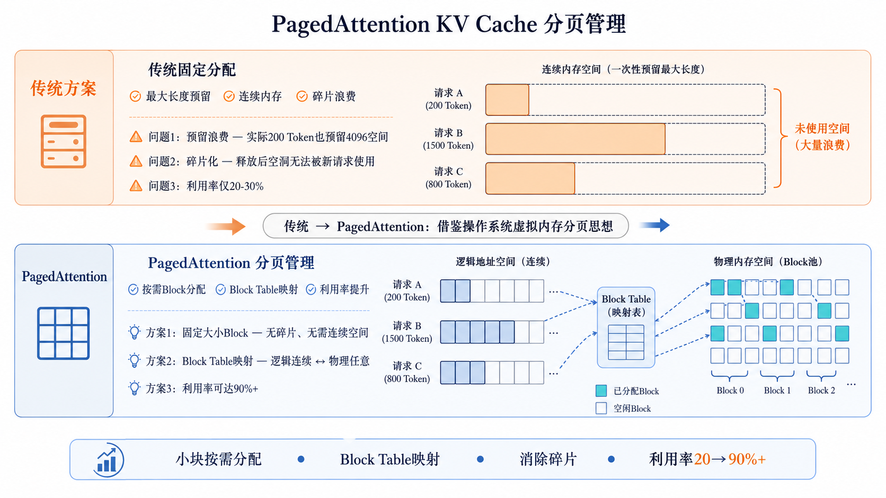

### 一、PagedAttention之前：KV Cache的三大浪费

传统KV Cache管理方式为每个请求预先分配一块**连续的、最大长度**的显存空间。这造成了三种严重浪费：

**1. 预留浪费（Reservation Waste）**
为每个请求预留最大长度（如4096 Token）的KV Cache空间，即使实际只用了200 Token。浪费率 = 可用但未用空间 / 总分配空间。

**2. 碎片化浪费（Fragmentation Waste）**
不同请求的KV Cache生命周期不同，先完成的请求释放空间后产生碎片，新的请求可能因为找不到足够大块的连续内存而无法调度。

**3. 整体利用率低**
综合前两种浪费，传统方式下的KV Cache实际利用率可能只有20%-30%。

### 二、PagedAttention的核心思想

PagedAttention借鉴了操作系统中**虚拟内存分页管理**的思想：

- **逻辑KV Cache**：每个请求的Token序列看作连续的"虚拟地址空间"
- **物理Block**：GPU显存被划分为固定大小的Block（如每Block容纳16个Token的KV Cache）
- **Block Table**：维护每个请求的逻辑Token位置到物理Block的映射关系
- **按需分配**：仅当Token被实际生成时才分配物理Block，不预先占用

类比理解：
- 操作系统中的虚拟内存 → 请求的逻辑KV Cache序列
- 物理内存页 → 显存中的物理Block
- 页表 → Block Table（记录逻辑位置→物理Block映射）
- 缺页中断 → 请求新Block时分配新的物理Block

### 三、PagedAttention的计算过程

在注意力计算时，PagedAttention的Kernel不再假设K和V是连续存储的，而是通过Block Table查找每个逻辑Block对应的物理Block地址：

```
对于Token i的注意力计算：
  对每个逻辑Block j（包含若干个历史Token）：
    1. 查Block Table获取物理Block地址
    2. 读取物理Block中的K[j]、V[j]
    3. 计算Token i对Block j中所有Token的注意力分数
  汇总所有Block的注意力结果，得到最终输出
```

PagedAttention高效的核函数设计使得这种分块读取的开销极小，同时解决了碎片化问题。

### 四、PagedAttention解决了什么？

| 问题 | PagedAttention的解决方案 |
|------|------------------------|
| 预留浪费 | 按需分配Block，不预先占用最大长度空间 |
| 碎片化浪费 | Block大小固定，不存在找不到足够连续内存的问题 |
| 利用率低 | 显存利用率从20-30%可提升到90%+（在典型负载下） |
| 并发能力弱 | 相同硬件下可容纳更多并发请求 |
| 无法共享 | Block为单位可实现KV Cache共享（Prefix Caching） |

### 五、Block Table与内存管理流程

**Block Table结构**：每个请求维护一个Block Table，记录该请求的第i个逻辑Block对应哪个物理Block编号。

```
请求A的Block Table：[P0, P3, P7, P12, ...]
  - 第0个逻辑Block → 物理Block P0
  - 第1个逻辑Block → 物理Block P3
  - ...
```

**内存管理流程**：
1. 新请求到达 → 分配第一个物理Block用于存放Prefill阶段的KV Cache
2. 每次Decode生成新Token → 如果当前物理Block未满则追加；已满则分配新的物理Block
3. 请求完成 → 释放该请求占用的所有物理Block回空闲池

可以总结为：**PagedAttention将KV Cache从"大块连续分配"变为"小块按需分配+Block Table映射"，类比操作系统的虚拟内存分页管理。它消除了预留浪费和碎片化浪费，在典型负载下可将KV Cache显存利用率从传统的20-30%提升到90%+，是vLLM实现高吞吐的核心基础。**

---

<h2 id="面试问题-vllm的连续批处理continuous-batching是如何工作的？">面试问题：vLLM的连续批处理（Continuous Batching）是如何工作的？</h2>

**难度评分：⭐⭐⭐⭐ (4/5)  |  考察频率：⭐⭐⭐⭐⭐ (5/5)**

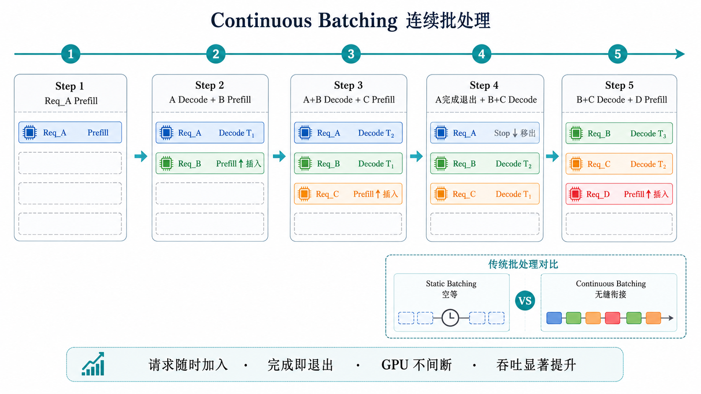

### 一、传统批处理的问题

**静态批处理（Static Batching）**：一批请求必须全部完成后才能处理下一批。
- 问题：短请求完成后需要等待长请求，GPU空闲等待，吞吐量低

**动态批处理（Dynamic Batching）**：等待一定时间窗口内的请求组成批次。
- 改进：增加了批次形成的灵活性
- 问题：仍然需要等待批次内所有请求完成才能进行下一批

这两种方式的共同问题：请求的生命周期（生成Token数）不同，有的请求3个Token就完成，有的需要300个Token。完成后等待其他请求的时间就是对GPU的浪费。

### 二、Continuous Batching的核心思想

Continuous Batching的核心原则：**每一步Decode都可以有不同的请求参与**。请求可以随时加入批次，完成的请求可以立即退出批次，无需等待批次中的其他请求。

工作流程：

```
Step 1: [Req_A(Prefill)                              ]  → A开始Prefill
Step 2: [Req_A(Decode_T1) + Req_B(Prefill)            ]  → A生成Token1，B加入Prefill
Step 3: [Req_A(Decode_T2) + Req_B(Decode_T1) + Req_C(Prefill)]  → C加入
Step 4: [Req_A(Decode_T3,Token:stop) + Req_B(Decode_T2) + Req_C(Decode_T1)]  → A完成退出
Step 5: [Req_B(Decode_T3) + Req_C(Decode_T2) + Req_D(Prefill)]  → D加入
...
```

### 三、vLLM V1 Scheduler如何实现Continuous Batching

在vLLM V1 Scheduler中，更准确的状态不是旧版”waiting/running/swapped三队列”，而是围绕`waiting`队列、`running`列表和若干阻塞/完成状态来调度：

- **waiting队列**：新到达、尚未进入执行，或被抢占后重新等待的请求
- **running列表**：当前已经进入调度循环、可继续Prefill或Decode的请求
- **blocked waiting状态**：暂时不能执行的请求，例如等待远端KV、等待结构化输出grammar、等待流式输入
- **finished集合**：已经完成、被中止或出错的请求

每个Step的调度逻辑：

1. 优先检查`running`请求，决定本轮继续Decode还是补充未完成的Prefill token
2. 对长Prompt执行Chunked Prefill，避免大Prefill长期占用本轮Token预算
3. 检查KV Cache Block是否足够；不足时可能触发preemption，把部分请求放回waiting
4. 从`waiting`队列选择新请求加入running，受Token预算、请求预算、KV Cache容量和结构化输出状态约束
5. 执行模型前向后，更新请求状态、KV Cache占用和输出流

### 四、Continuous Batching的工程意义

**吞吐量提升**：同等硬件下，Continuous Batching相比Static Batching通常能带来明显吞吐提升，具体幅度取决于请求长度分布、batch形态和硬件利用率。GPU利用率更高，空等时间更少。

**延迟感知更优**：短请求完成后可以及时返回，较少被长请求拖累。

**显存利用更高效**：请求完成后释放KV Cache，配合PagedAttention的小块分配，通常能减少显存碎片。

### 五、与其他批处理方式的对比

| 维度 | Static Batching | Dynamic Batching | Continuous Batching |
|------|----------------|------------------|---------------------|
| 请求加入 | 批次开始前 | 组批次时 | 任何Decode步骤 |
| 请求退出 | 整批一起结束 | 整批一起结束 | 完成即退出 |
| GPU空闲 | 严重 | 中等 | 通常较少 |
| 实现复杂度 | 低 | 中 | 高 |
| 典型框架 | 早期推理框架 | ONNX Runtime等 | vLLM、SGLang、TensorRT-LLM |

可以总结为：**Continuous Batching允许请求在每个Decode步骤动态加入和退出批次，减少了传统批处理中"短等长"的浪费。配合PagedAttention的精细内存管理，vLLM在合适负载下可以显著提升GPU利用率和服务吞吐，这也是它相比传统静态批处理框架更适合高并发推理的重要原因。**

---

<h2 id="面试问题-vllm-v1的enginecore架构如何理解scheduler如何调度请求？">面试问题：vLLM V1的EngineCore架构如何理解？Scheduler如何调度请求？</h2>

**难度评分：⭐⭐⭐⭐⭐ (5/5)  |  考察频率：⭐⭐⭐⭐ (4/5)**

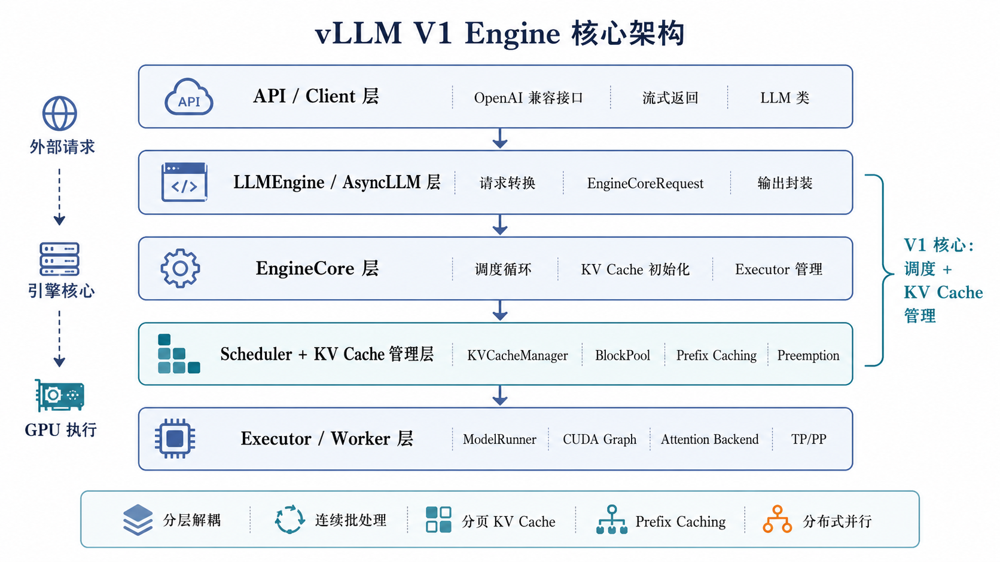

### 一、vLLM V1的核心架构层次

vLLM V1 以 EngineCore 为内层主循环，不能再简单套用早期”AsyncLLMEngine + BlockManager + swapped队列”的旧版表述。更准确的理解方式是：

**1. API / Client层**
- `vllm serve`提供OpenAI兼容接口
- 在线服务通常使用异步客户端形态，离线推理使用`LLM`接口
- 这一层负责请求解析、协议适配、流式返回和输入输出格式转换

**2. LLMEngine / AsyncLLM兼容层**
- `LLMEngine`保留为兼容入口，但内部已经转向V1实现
- `AsyncLLM`是异步在线服务的主要引擎客户端
- 这一层将外部请求转换为`EngineCoreRequest`，再把底层输出转换成用户可见的`RequestOutput`

**3. EngineCore层**
- EngineCore是V1的内层主循环
- 负责初始化Executor、Profile可用KV Cache显存、创建KV Cache配置、构造Scheduler
- 每轮执行“调度→模型执行→采样→更新请求状态”的闭环

**4. Scheduler + KV Cache管理层**
- Scheduler决定每一步哪些请求、哪些Token进入本轮执行
- KV Cache由`KVCacheManager`、`BlockPool`和KV Cache Coordinator管理
- Prefix Caching、抢占、远端KV等待、Chunked Prefill等逻辑都在这一层协同

**5. Executor / Worker / ModelRunner层**
- Executor负责单机或分布式执行后端
- Worker负责设备初始化、权重加载、KV Cache分配、CUDA Graph捕获和模型前向
- ModelRunner真正组织GPU侧执行、Attention Backend和采样相关计算

### 二、Scheduler不再适合用“waiting/running/swapped三队列”概括

在vLLM V1 Scheduler中，核心状态更接近：

```
waiting队列：尚未进入执行，或被抢占后重新等待的请求
running列表：当前可被调度执行的请求
blocked waiting状态：等待远端KV、等待结构化输出grammar、等待流式输入等
finished集合：已完成、被中止或出错的请求
```

旧版资料里常说的`swapped`队列更像早期BlockManager/CPU swap语境下的解释。V1中更应强调**preemption（抢占）**：当KV Cache资源不足时，Scheduler可以抢占低优先级或靠后的running请求，释放其KV Cache，将请求状态标记为`PREEMPTED`并放回waiting队列，后续资源足够时再重新调度。

### 三、每轮调度在做什么

Scheduler每轮调度主要受两个预算约束：

- **Token预算**：由`max_num_batched_tokens`等参数限制本轮最多处理多少Token
- **请求预算**：由`max_num_seqs`等参数限制同时运行多少请求

典型流程可以理解为：

1. 先处理已在`running`中的请求，决定每个请求本轮继续Decode还是补充Prefill token
2. 对长Prompt使用Chunked Prefill，把一次大Prefill拆成多个小块（chunk），每轮只做一部分Prefill计算，做完后立即"让步"给等待中的Decode请求——本质上是将大Prefill的计算量"分期付款"，避免某一轮因处理整个长Prompt而让所有Decode请求饥饿等待
3. 检查KV Cache是否有足够Block；不足时触发抢占，被抢占请求回到waiting
4. 从`waiting`中选择新请求加入running，受Token预算、请求预算、KV Cache容量和结构化输出状态约束
5. 生成`SchedulerOutput`交给Executor执行，执行结果再反向更新请求状态、KV Cache状态和输出流

### 四、KV Cache管理的新口径

vLLM V1中不应再把`BlockManager`作为核心术语。更准确的组件是：

- **KVCacheManager**：Scheduler和KV Cache内部结构之间的接口，负责查询命中、分配slot、释放请求占用的块
- **BlockPool**：维护物理KV Cache Block、空闲Block队列、可被Prefix Caching命中的Block哈希表
- **KV Cache Coordinator**：在不同KV Cache group、混合KV Cache结构、Prefix Caching等场景下协调Block分配与命中查询

可以总结为：**vLLM V1架构应按”API/AsyncLLM或LLMEngine兼容层→EngineCore→Scheduler/KVCacheManager→Executor/Worker/ModelRunner”理解。Scheduler的重点不是旧版三队列，而是围绕Token预算、请求预算和KV Cache容量，在running/waiting请求之间做连续批处理、Chunked Prefill和抢占调度。KV Cache管理也应从BlockManager表述更新为KVCacheManager、BlockPool和Coordinator体系。**

---

<h2 id="面试问题-vllm-v1部署时需要关注哪些关键参数如何进行调优？">面试问题：vLLM V1部署时需要关注哪些关键参数？如何进行调优？</h2>

**难度评分：⭐⭐⭐ (3/5)  |  考察频率：⭐⭐⭐⭐⭐ (5/5)**

### 一、核心参数分类

**1. 模型加载与上下文参数**

| 参数 | 含义 | 建议值 |
|------|------|--------|
| `--model` | 模型路径或HuggingFace模型名 | 生产环境固定到明确版本或本地路径 |
| `--tokenizer` | 分词器路径 | 默认同model，模型定制时单独指定 |
| `--dtype` | 权重与计算精度 | `auto` / `bfloat16` / `float16` |
| `--max-model-len` | 最大上下文长度 | 按业务P99输入+输出长度设置 |
| `--quantization` | 权重量化方法 | AWQ/GPTQ/FP8等，按模型支持选择 |

**2. 显存与KV Cache参数**

| 参数 | 含义 | 建议值 |
|------|------|--------|
| `--gpu-memory-utilization` | 按比例给vLLM预留可用显存 | 从0.9开始压测，OOM则下调 |
| `--kv-cache-memory-bytes` | 直接指定KV Cache显存大小 | 需要精确容量控制时优先使用 |
| `--max-num-seqs` | 同时运行的最大请求数 | 延迟敏感场景调小，吞吐场景调大 |
| `--max-num-batched-tokens` | 单步最多调度Token数 | 长Prompt/Chunked Prefill场景重点调优 |
| `--block-size` | KV Cache物理Block大小 | 通常保持默认，不作为首要调参项 |

**3. Prefix Caching与哈希参数**

| 参数 | 含义 | 建议值 |
|------|------|--------|
| `--enable-prefix-caching` | 启用前缀KV Cache复用 | 多轮对话、固定System Prompt、RAG模板场景建议开启 |
| `--prefix-caching-hash-algo` | Prefix Cache块哈希算法 | 默认即可；跨进程一致性要求高时选稳定哈希 |

**4. 并行与分布式参数**

| 参数 | 含义 | 建议值 |
|------|------|--------|
| `--tensor-parallel-size` | 张量并行度 | 单模型副本放不下时优先使用，尽量限制在节点内 |
| `--pipeline-parallel-size` | 流水线并行度 | 超大模型或跨节点时使用 |
| `--data-parallel-size` | 数据并行副本数 | 单副本可放下但吞吐不足时使用 |
| `--distributed-executor-backend` | 分布式执行后端 | 单机按默认；多机按环境选择`ray`等后端 |
| `--decode-context-parallel-size` | Decode上下文并行度 | 长上下文Decode压力大时评估 |
| `--prefill-context-parallel-size` | Prefill上下文并行度 | 超长Prompt Prefill压力大时评估 |

**5. PD分离与KV传输参数**

| 参数 | 含义 | 建议值 |
|------|------|--------|
| `--kv-transfer-config` | 配置Prefill/Decode分离或外部KV传输 | 只有做PD分离、KV Connector或远端KV复用时配置 |

### 二、关键参数深入分析

**gpu-memory-utilization / kv-cache-memory-bytes**：
- `gpu-memory-utilization`按比例控制vLLM可用显存，适合快速部署
- `kv-cache-memory-bytes`直接指定KV Cache池大小，适合生产环境做容量复现
- 两者的核心目标都是平衡“模型权重、KV Cache池、运行时峰值显存”
- 设得过高容易启动或Prefill峰值OOM，设得过低会减少并发容量

**max-num-seqs**：
- 限制同时处于running状态的最大请求数
- 过大：单步batch变重，TPOT和P99延迟可能上升
- 过小：GPU吃不满，吞吐量上不去
- 延迟优先服务通常保守设置；吞吐优先服务可以逐步增大压测

**max-num-batched-tokens**：
- 决定每个Scheduler step最多处理多少Token
- 对长Prompt、Chunked Prefill和Prefill/Decode混跑影响很大
- 过大：Prefill吞吐好，但可能拉高Decode抖动
- 过小：Decode更平滑，但长Prompt TTFT可能变差

**max-model-len**：
- 设置模型可接收的最大上下文长度
- 不是越大越好，因为长上下文会显著增加KV Cache容量需求
- 生产环境应按真实请求长度分布设置，而不是盲目打开到模型理论上限

**parallel-size组合**：
- `tensor-parallel-size`解决“单副本模型放不下”问题
- `data-parallel-size`解决“单副本吞吐不够”问题
- `pipeline-parallel-size`主要用于超大模型或跨节点切层
- 优先顺序通常是：单卡/单节点DP扩副本 → 节点内TP → 必要时TP+PP跨节点

### 三、调优实践流程

1. **先定业务画像**：统计P50/P95/P99输入长度、输出长度、并发和SLO
2. **确定模型副本形态**：能单卡放下则优先单卡+DP；放不下再上TP/PP
3. **配置上下文上限**：按业务长度设置`max-model-len`，避免无意义占用KV容量
4. **压测KV容量**：从`gpu-memory-utilization=0.9`或明确`kv-cache-memory-bytes`开始，观察KV Cache使用率和OOM
5. **调Scheduler预算**：用`max-num-seqs`和`max-num-batched-tokens`在TTFT、TPOT、吞吐之间折中
6. **启用前缀复用**：固定System Prompt、多轮对话、RAG模板场景开启Prefix Caching并观察命中率
7. **再考虑高级架构**：只有单体服务无法满足SLO/成本目标时，再引入PD分离和`kv-transfer-config`

### 四、常见部署命令示例

```bash
# 基础部署（单卡）
vllm serve Qwen/Qwen2-7B-Instruct \
    --dtype auto \
    --gpu-memory-utilization 0.9 \
    --max-model-len 8192 \
    --max-num-seqs 128

# 高复用Prompt场景：启用Prefix Caching
vllm serve Qwen/Qwen2-7B-Instruct \
    --enable-prefix-caching \
    --prefix-caching-hash-algo builtin \
    --max-model-len 8192

# 多卡张量并行部署
vllm serve Qwen/Qwen2-72B-Instruct \
    --tensor-parallel-size 4 \
    --gpu-memory-utilization 0.9 \
    --max-model-len 32768

# 单模型可放下但吞吐不足：增加数据并行副本
vllm serve Qwen/Qwen2-7B-Instruct \
    --data-parallel-size 4 \
    --max-num-seqs 128
```

可以总结为：**vLLM V1部署调优应围绕”上下文长度、KV Cache容量、Scheduler预算、并行副本形态、Prefix Caching和KV传输”六类参数展开。不要再把重点放在旧版`--worker-use-ray`或BlockManager口径上；生产环境更应关注`kv-cache-memory-bytes`、`max-num-batched-tokens`、`data-parallel-size`、`distributed-executor-backend`、Prefix Caching和`kv-transfer-config`等新口径参数。**

---

<h2 id="面试问题-vllm-v1的prefix-caching机制是如何实现的？">面试问题（进阶）：vLLM V1的Prefix Caching机制是如何实现的？</h2>

**难度评分：⭐⭐⭐⭐⭐ (5/5)  |  考察频率：⭐⭐⭐⭐ (4/5)**

### 一、什么是Prefix Caching？

在大模型服务场景中，多个请求经常共享相同的Prompt前缀：

- 共享System Prompt（如"你是一个有帮助的AI助手..."）
- Few-shot Prompt中共享前面的示例
- RAG场景中共享相同模板和部分上下文
- 多轮对话中复用历史对话前缀

如果每个请求都独立计算这部分共享前缀的KV Cache，会造成大量重复Prefill计算。Prefix Caching正是用来复用已计算前缀KV Cache、降低TTFT和Prefill开销的机制。

### 二、vLLM V1的Prefix Caching组件

vLLM V1中不应再用`BlockManager + CachedAllocator + Evictor`解释Prefix Caching。更准确的组件是：

**1. KVCacheManager**

Scheduler通过`KVCacheManager`查询某个请求有哪些前缀Block已经计算过，并为未命中的Token分配新的KV Cache slot。

**2. BlockPool**

`BlockPool`管理物理KV Cache Block、空闲Block队列和可缓存Block集合。启用Prefix Caching后，它会维护“block hash → block”的映射，用于快速查找可复用Block。

**3. KV Cache Coordinator**

Coordinator负责在不同KV Cache group、混合KV Cache结构和Prefix Caching场景下协调命中查询、Block分配和Block释放。

### 三、Block级哈希如何工作

Prefix Caching以Block为单位复用KV Cache。每个可缓存Block会计算一个Block Hash，通常由以下信息共同决定：

- 当前Block内的Token IDs
- 前一个Block的哈希值（保证前缀链路一致）
- LoRA、多模态输入或其他会影响KV结果的额外标识

这样可以避免“当前Block token相同，但前文不同”导致错误复用。

示例：

```
请求A: [System Prompt Block0][System Prompt Block1][User A Block2]
请求B: [System Prompt Block0][System Prompt Block1][User B Block3]

Block0、Block1哈希命中 → 直接复用已有KV Cache
Block2/Block3不同 → 分别计算并写入新Block
```

### 四、Prefix Caching的调度流程

```
新请求到达：
1. 按Block粒度计算Prompt前缀的Block Hash链
2. Scheduler通过KVCacheManager查询已计算Block
3. 对命中的完整Block，复用BlockPool中的物理KV Cache Block
4. 对未命中的部分，分配新Block并执行Prefill计算
5. 请求完成后释放引用；可缓存Block仍可留在BlockPool中等待后续命中
```

需要注意：Prefix Caching通常只复用完整Block。对于Block内部只匹配一部分Token的情况，vLLM的哈希式Prefix Caching不如SGLang RadixAttention细粒度。

### 五、Prefix Caching的性能收益

在典型的多轮对话/System Prompt/RAG模板场景中，Prefix Caching可以带来：

- **TTFT降低**：共享前缀无需重复Prefill，只计算新增Token
- **Prefill吞吐提升**：相同算力可处理更多请求
- **显存更高效**：多个请求共享已缓存Block，减少重复KV写入
- **长上下文更友好**：历史前缀越长、重复度越高，收益越明显

实际效果取决于前缀重复率、Block对齐程度和请求分布。如果大多数请求差异较大，Prefix Caching收益会很有限。

### 六、与SGLang RadixAttention的区别

vLLM V1的Prefix Caching基于哈希精确匹配，通常以Block为单位命中；SGLang的RadixAttention基于Radix Tree，可以做更细粒度的最长公共前缀匹配。

| 维度 | vLLM Prefix Caching | SGLang RadixAttention |
|------|---------------------|-----------------------|
| 索引结构 | Block Hash映射 | Radix Tree |
| 匹配粒度 | 完整Block为主 | Token级前缀路径 |
| 优势 | 简洁、通用、和PagedAttention天然结合 | 共享前缀多时匹配更灵活 |
| 典型场景 | 固定System Prompt、RAG模板、多轮对话 | Agent、多分支、多轮复杂共享前缀 |

可以总结为：**vLLM V1的Prefix Caching应按”KVCacheManager查询命中→BlockPool维护哈希Block→Coordinator协调分配与释放”理解。它通过Block级哈希复用已计算的KV Cache，降低共享前缀场景下的Prefill开销和TTFT；不要再用旧版CachedAllocator、UncachedAllocator、Evictor作为核心解释。**

---

<h1 id="4.sglang深度解析radixattention结构化生成与后端执行">4.SGLang深度解析：RadixAttention、结构化生成与后端执行</h1>

> SGLang是近年来快速崛起的大模型推理框架，它以RadixAttention（基于Radix Tree的KV Cache前缀复用）和结构化生成为核心差异化优势。与vLLM侧重高吞吐通用推理不同，SGLang在需要大量共享前缀的场景（多轮对话、Agent调用）和需要控制输出格式的场景中表现尤为突出。

<h2 id="面试问题-sglang的radixattention与vllm的pagedattention有什么本质区别？">面试问题：SGLang的RadixAttention与vLLM的PagedAttention有什么本质区别？</h2>

**难度评分：⭐⭐⭐⭐⭐ (5/5)  |  考察频率：⭐⭐⭐⭐⭐ (5/5)**

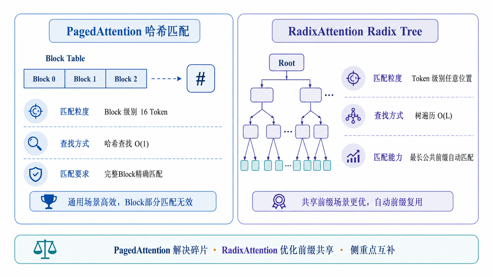

### 一、两者定位对比

PagedAttention和RadixAttention不是互相替代的关系，而是侧重点不同：

- **PagedAttention**：核心解决KV Cache的**内存碎片化**问题（精细分页管理）
- **RadixAttention**：在分页管理基础上，更进一步优化KV Cache的**前缀共享和查找**效率（Radix Tree索引）

可以理解为：RadixAttention包含了类似PagedAttention的分页内存管理思想，但用Radix Tree实现了更高效的前缀缓存复用。

### 二、Radix Tree管理KV Cache

Radix Tree（基数树/压缩前缀树）是一种高效的前缀匹配树结构。在SGLang中，Radix Tree用于管理所有请求的KV Cache：

**树结构：**
```
Root
├── "你是一个" (Block_0)
│   ├── "有帮助的AI助手\n" (Block_1)
│   │   ├── "用户：今天天气怎么样？" (Block_2)  ← 请求A的路径
│   │   └── "用户：帮我写首诗" (Block_3)        ← 请求B的路径
│   └── "知识渊博的专家\n" (Block_4)
│       └── "用户：解释相对论" (Block_5)         ← 请求C的路径
```

每个节点代表一个KV Cache数据块，从Root到叶子的路径代表一个完整的Token序列。

### 三、RadixAttention vs PagedAttention的前缀匹配

**vLLM的Prefix Caching（基于哈希匹配）：**
- 以Block为单位计算哈希，仅在Block边界进行精确匹配
- 如果两个请求的前缀只在Block内部分相同（如15个Token相同但Block不全一致），则无法复用
- 哈希查找复杂度O(1)，但当缓存Block数量巨大时需要维护大量哈希表条目

**SGLang的RadixAttention（基于Radix Tree）：**
- Token级别的匹配粒度，沿着Radix Tree向下匹配直到找到最长公共前缀
- 即使是部分匹配也能精确识别共享范围
- 树查找复杂度O(L)（L为前缀长度），但自动修剪和合并，管理更高效
- 请求完成时自动回收不再被引用的节点

### 四、RadixAttention的自动缓存管理

**请求到达时的匹配流程：**

1. 将请求的Token序列从Radix Tree的Root节点开始匹配
2. 沿着树向下遍历，找到最长匹配路径
3. 已匹配的节点：直接复用KV Cache（引用计数+1）
4. 未匹配的部分：创建新节点，分配新KV Cache Block
5. 新生成的Token也动态追加到树中

**请求完成时的回收流程：**
- 该请求路径上所有节点的引用计数-1
- 引用计数降为0的叶子节点：成为可驱逐候选；当缓存容量紧张时，按 LRU 策略从最久未访问的节点开始驱逐，整棵子树也会被递归回收
- 如果某个内部节点的子树全部被释放，该节点也被回收

### 五、RadixAttention的核心优势

1. **更细粒度的前缀匹配**：不像Block级别的哈希匹配，可以在任意Token位置匹配
2. **自动前缀共享**：无需显式配置，相同前缀自动复用
3. **多轮对话场景收益明显**：每一轮对话都是对历史路径的扩展，自然形成树结构
4. **内存效率**：LRU驱逐+引用计数+树修剪，自动控制缓存大小

### 六、对比总结

| 维度 | PagedAttention (vLLM) | RadixAttention (SGLang) |
|------|----------------------|------------------------|
| 核心创新 | 分页管理消除碎片 | Radix Tree前缀共享 |
| 前缀匹配粒度 | Block级别（16 Token） | 任意Token级别 |
| 查找方式 | 哈希查找，O(1) | 树遍历，O(L) |
| 内存管理 | Block Table映射 | Radix Tree节点+分页 |
| 适用场景 | 通用高吞吐推理 | 大量共享前缀场景 |
| 缓存回收 | BlockPool引用管理+缓存Block复用 | 引用计数+LRU+树修剪 |

可以总结为：**PagedAttention的核心价值在于"消除KV Cache内存碎片"，RadixAttention在此基础上更进一步，通过Radix Tree实现更细粒度的前缀匹配和更高效的共享前缀复用。在多轮对话、Agent调用等大量共享前缀的场景中，RadixAttention的前缀复用效率更高。**

---

<h2 id="面试问题-sglang的前端dsl有何特点genselectfork等语法解决了什么问题？">面试问题：SGLang的前端DSL有何特点？gen、select、fork等语法解决了什么问题？</h2>

**难度评分：⭐⭐⭐⭐ (4/5)  |  考察频率：⭐⭐⭐⭐ (4/5)**

### 一、为什么需要SGLang DSL？

传统大模型调用方式通常使用字符串拼接来构建Prompt，存在以下痛点：

- 复杂调用链（如在多个模型输出之间做选择、并行调用多个Prompt）代码冗长
- Prompt模板和调用逻辑分离，维护困难
- 多轮对话的状态管理复杂
- 结构化输出需要额外解析和后处理

SGLang的DSL（Domain Specific Language，领域特定语言）正是为解决这些问题设计的Python嵌入式DSL。

### 二、核心语法元素

**1. `gen()` — 生成**

最核心的生成操作，调用模型生成文本：

```python
import sglang as sgl

@sgl.function
def simple_qa(s, question):
    s += "问：" + question + "\n答："
    s += sgl.gen("answer", max_tokens=256)
```

`gen()`的参数包括：名称（用于后续引用）、max_tokens、temperature、stop等。

**2. `select()` — 选择（约束生成）**

在多选项中进行约束选择，保证输出必定在给定选项中：

```python
@sgl.function
def classify_sentiment(s, text):
    s += f"判断以下文本的情感：{text}\n情感："
    s += sgl.select("sentiment", ["正面", "负面", "中性"])
```

`select()`会将输出限制在给定选项范围内，减少后处理复杂度。

**3. `fork()` — 并行分支**

并行执行多个生成路径，用于同时尝试多种Prompt或策略。SGLang 的 `fork` 允许创建多个并行的生成分支，各分支独立生成、共享相同的 Prompt 前缀（通过 RadixAttention 复用 KV Cache），最终汇总结果：

```python
@sgl.function
def parallel_brainstorm(s, topic):
    s += f"为主题'{topic}'生成3个创意方向：\n"
    # 使用 sgl.fork 并行执行3个分支
    branches = sgl.fork(3)  # 创建3个并行分支
    for i, branch in enumerate(branches):
        branch += f"\n方向{i+1}："
        branch += sgl.gen(f"direction_{i}", max_tokens=100)
    # 各分支结果自动合并返回
```

> 注意：如果不使用 `fork` 而直接用 `for` 循环 + `sgl.gen()`，生成是**顺序**的（方向1→2→3依次完成），无法利用 Radix Tree 的并行前缀复用。但在多个请求共享前缀的场景中，即使顺序执行，RadixAttention 仍能通过自动缓存命中获得加速。

**4. `+=` 操作符 — 流式拼接**

SGLang重载了`+=`操作符，实现Prompt的流式拼接。`s += "text"`添加固定文本，`s += sgl.gen(...)`触发模型生成并将结果拼接回去。

**5. 控制流 — 原生Python**

SGLang DSL的优点之一是直接使用Python控制流（if/for/while），不需要学习新的语法：

```python
@sgl.function
def multi_turn_chat(s):
    s += sgl.system("你是一个有帮助的AI助手。")
    for turn in range(3):
        s += sgl.user(f"这是第{turn+1}轮问题")
        s += sgl.assistant(sgl.gen(f"answer_{turn}", max_tokens=200))
```

### 三、DSL的优势总结

1. **Prompt和逻辑一体化**：不需要在模板文件和处理代码之间切换
2. **结构化输出自然**：select保证输出在预定义集合中，gen赋值给命名变量便于后续提取
3. **并行调用简单**：fork让并行尝试多个生成路径变得直接
4. **复杂调用链可维护**：控制流用Python原生语法，学习成本低
5. **与后端解耦**：DSL定义的是"要做什么"，后端Runtime决定"怎么高效执行"

### 四、与LangChain等框架的区别

SGLang的DSL与LangChain定位不同：
- LangChain侧重：组件串联、工具调用、链式抽象
- SGLang侧重：模型调用的编程模型 + 后端高效执行（RadixAttention等）

SGLang的DSL更底层、更灵活，性能更可控。LangChain更多是一个应用层框架。

可以总结为：**SGLang DSL通过gen/select/fork等核心操作和Python原生控制流，将Prompt构建、模型调用和结果处理统一在一个编程模型中。它解决了传统方法中Prompt与逻辑分离、并行调用复杂、输出格式不可控等痛点，尤其适合需要复杂调用链和结构化输出的Agent、多轮对话等场景。**

---

<h2 id="面试问题-sglang的约束解码constrained-decoding是如何实现的？">面试问题：SGLang的约束解码（Constrained Decoding）是如何实现的？</h2>

**难度评分：⭐⭐⭐⭐ (4/5)  |  考察频率：⭐⭐⭐⭐ (4/5)**

### 一、什么是约束解码？

约束解码是指在生成过程中限制模型的输出，确保生成结果满足特定格式要求。例如：
- 输出需要是合法的JSON
- 输出需要匹配给定的正则表达式（如邮箱、电话号码格式）
- 输出需要限制在预定义的候选集中

这与传统的"先自由生成，再用正则/JSON解析后处理"不同，约束解码直接在生成阶段保证格式正确。

### 二、SGLang约束解码的实现原理

SGLang支持多种约束方式：

**1. JSON Schema约束**

通过JSON Schema定义输出结构，SGLang构建对应的有限状态自动机（FSM），在每一步Decode时只允许符合Schema的Token通过：

```python
@sgl.function
def extract_info(s, text):
    s += f"从以下文本中提取信息：{text}\n"
    s += sgl.gen("result", max_tokens=200, 
                 regex=r'\{"name": "[^"]+", "age": \d+, "city": "[^"]+"\}')
```

**2. 正则表达式约束**

将正则表达式编译为确定性有限自动机（DFA），Decode时只采样DFA允许的Token：

```python
s += sgl.gen("email", regex=r'[a-zA-Z0-9._%+-]+@[a-zA-Z0-9.-]+\.[a-zA-Z]{2,}')
```

**3. 选择约束（select）**

较简单也高效的约束方式是预先定义候选集，Decode时限制只能采样候选集中的Token或Token前缀：

```python
s += sgl.select("label", ["正面评价", "负面评价", "中性评价"])
```

### 三、约束解码的技术路线

SGLang实现约束解码的核心技术是**有限状态机引导的Token采样**：

1. **编译约束规则**：将JSON Schema/Regex编译为FSM/DFA
2. **构建Token级别的状态转移表**：将词表的每个Token与状态机中的转移关系建立映射
3. **每步Decode时应用约束**：
   - 根据当前状态，获取允许的Token集合
   - 将模型输出的logits中非允许Token的概率置为-inf
   - 在受限的候选集中采样
   - 更新状态机状态

### 四、约束解码的优势

- **零后处理失败**：100%保证输出格式合规，不需要try-catch解析
- **减少重试**：不再因为格式问题重试生成，节省Token和时间
- **降低延迟**：约束缩小了采样空间，有时还能轻微加速
- **适合Agent场景**：工具调用的参数通常需要是合法JSON，约束解码可以在生成阶段降低格式错误概率

### 五、与vLLM guided decoding的对比

vLLM也支持guided decoding（通过outlines/lm-format-enforcer等库），原理类似（基于FSM/正则约束），但SGLang在DSL层面做了更自然的集成（gen的regex参数、select语法等）。

可以总结为：**SGLang的约束解码通过将正则表达式/JSON Schema编译为有限状态机，在每步Token采样时限制候选集，确保生成结果100%符合格式要求。这在Agent工具调用、结构化信息提取等场景中极为实用，避免了传统"先自由生成再后处理解析"的脆弱性。**

---

<h2 id="面试问题-sglang后端runtime的执行流程是怎样的与vllm后端有何异同？">面试问题：SGLang后端Runtime的执行流程是怎样的？与vLLM后端有何异同？</h2>

**难度评分：⭐⭐⭐⭐ (4/5)  |  考察频率：⭐⭐⭐ (3/5)**

### 一、SGLang后端Runtime架构

SGLang的后端Runtime（SGLang Runtime, SR）是整个系统的执行引擎，负责接收DSL前端翻译后的执行计划并高效调度执行。

SGLang后端核心组件：

**1. Tokenizer**：将文本转换为Token序列，与前端交互

**2. Schedule Controller（调度控制器）**：
- 接收前端发来的执行计划（包含gen、select、fork等操作）
- 管理所有活跃请求的生命周期
- 通过Radix Tree管理KV Cache分配与回收

**3. Radix Cache（Radix Tree缓存管理器）**：
- 维护全局的Radix Tree
- 提供前缀匹配、节点插入、节点删除、LRU回收等功能
- 管理每个树节点对应的物理KV Cache Block

**4. Model Runner（模型执行器）**：
- 将调度的批次送入模型执行前向计算
- 支持多种Attention Backend（FlashAttention、FlashInfer等）
- 支持CUDA Graph加速Decode
- 支持张量并行（Tensor Parallelism）

### 二、执行流程详解

```
前端DSL函数调用
  ↓
编译为执行计划（Execution Plan）
  ↓  ↓  ↓
  gen   select   fork
  ↓
Schedule Controller接收执行计划
  ↓
对每个gen/select操作：
  1. 通过Radix Tree查找前缀匹配，复用已有KV Cache
  2. 不匹配的部分进行Prefill计算
  3. Prefill结果存入Radix Tree新节点
  ↓
对每个Decode步骤：
  1. 当前所有活跃请求组成批次
  2. 通过Radix Tree查找各自的KV Cache Block
  3. Model Runner执行一步Decode
  4. 新生成的Token追加到各自的Radix Tree路径
  5. 检查是否满足停止条件
  ↓
生成结果返回给前端
```

### 三、与vLLM后端的关键异同

| 维度 | vLLM | SGLang |
|------|------|--------|
| **KV Cache管理** | Block Table + 哈希匹配 | Radix Tree + 前缀遍历 |
| **前缀复用粒度** | Block级别（16 Token） | 任意Token级别 |
| **请求调度** | FCFS + 优先级 + 三队列 | 执行计划驱动 + Radix Tree |
| **批处理** | Continuous Batching | Continuous Batching（类似） |
| **内存管理** | PagedAttention Block分页 | 类似分页 + Radix Tree节点管理 |
| **模型执行** | Worker + CUDA Graph | Model Runner + CUDA Graph |
| **并行策略** | TP/PP | TP（主要） |
| **前端接口** | OpenAI兼容API | DSL + OpenAI兼容API |
| **Prefill优化** | Prefix Caching（哈希） | RadixAttention（树匹配） |

### 四、架构层面的本质差异

vLLM的架构哲学是"高效的内存管理和通用的推理服务"，SGLang的架构哲学是"高效的前缀复用+灵活的编程模型"。

这反映在技术上：
- vLLM的Block Table + 哈希方案在**通用场景**中简洁高效
- SGLang的Radix Tree方案在**有大量共享前缀**的场景中性能更优
- SGLang的DSL让复杂调用逻辑更简洁，vLLM的API更标准化

值得注意的是，两者在底层都使用了类似的分页KV Cache管理、Continuous Batching、CUDA Graph等技术，差异主要体现在**前缀复用的粒度和查找方式**以及**上层编程模型**。

可以总结为：**SGLang后端Runtime通过Radix Tree在前缀匹配粒度上优于vLLM的Block级别哈希匹配，在执行流程上由DSL编译的执行计划驱动而非简单的请求队列驱动。两者底层优化技术（CUDA Graph、FlashAttention等）类似，核心差异在于KV Cache的组织方式和前缀复用效率。**

---

<h1 id="5.大模型量化技术详解ptq-vs-qatawqgptq与fp8">5.大模型量化技术详解：PTQ vs QAT、AWQ、GPTQ与FP8</h1>

> 量化是大模型推理部署中常见且重要的模型压缩技术之一，通过降低数值精度来减小模型体积、降低显存占用，并在合适硬件和Kernel支持下提高推理速度。大模型量化有独特挑战：参数量巨大使得QAT成本较高，因此PTQ在大模型部署中更常见；此外不同层/通道对量化的敏感度差异明显，需要更精细的量化策略。本节系统梳理PTQ与QAT的区别、AWQ与GPTQ两类常见算法原理、FP8浮点数量化的特点与适用场景，以及KV Cache量化的特殊性。

<h2 id="面试问题-ptq和qat有什么区别各自适用于什么场景？">面试问题：PTQ和QAT有什么区别？各自适用于什么场景？</h2>

**难度评分：⭐⭐⭐ (3/5)  |  考察频率：⭐⭐⭐⭐⭐ (5/5)**

### 一、PTQ（Post-Training Quantization，训练后量化）

PTQ是指在模型训练完成后，无需重新训练或微调，直接对模型参数进行量化。

**核心流程：**
```
预训练模型（FP16/FP32）
  → 校准（Calibration）：使用少量校准数据统计激活值的分布范围
  → 量化参数计算：确定每层的scale和zero_point
  → 量化转换：将权重从浮点转为低精度（INT8/INT4/FP8）
  → 量化模型
```

**优点：**
- 不需要训练数据（或仅需极少校准数据）
- 不需要重新训练或微调
- 快速完成，计算成本低
- 部署简单

**缺点：**
- 精度可能明显下降，尤其在低位宽（INT4及以下）
- 对某些敏感层可能造成较大精度损失
- 无法通过训练补偿量化误差

**适用场景：**
- 大模型（>7B）部署：重新进行QAT成本过高
- 通用场景：对精度要求不是极致的在线服务
- 快速部署：需要尽快上线的场景
- 边缘设备：显存严格受限

### 二、QAT（Quantization-Aware Training，量化感知训练）

QAT是在训练/微调过程中模拟量化操作，让模型在训练时就"感知"到量化的影响，从而通过训练来补偿量化带来的精度损失。

**核心流程：**
```
预训练模型（FP16/FP32）
  → 插入伪量化节点（FakeQuant：前向时模拟量化-反量化，反向时通过STE估算梯度）
  → 使用训练数据微调若干步
  → 微调完成后去掉伪量化节点，做真实量化
  → 量化模型
```

**优点：**
- 量化精度损失小，尤其在低位宽时
- 可以通过训练补偿量化引入的误差
- 更适合对精度要求高的场景

**缺点：**
- 需要训练数据和GPU计算资源
- 需要额外的微调时间和成本
- 对大模型（>70B）来说QAT的成本极高

**适用场景：**
- 中小模型（<7B）的极低位宽量化（INT4以下）
- 对精度要求极高的业务场景
- 有充足训练数据和计算资源的情况

### 三、PTQ vs QAT 对比总结

| 维度 | PTQ | QAT |
|------|-----|-----|
| 是否需要训练 | 否（仅需少量校准数据） | 是（需要微调） |
| 计算成本 | 低（分钟级） | 高（小时→天级） |
| 精度保持 | 较高位宽（INT8）良好 | 低位宽（INT4）更佳 |
| 适用模型规模 | 大模型常用 | 适合中小模型 |
| 大模型中的角色 | 主流方案 | 较少使用（成本高） |
| 典型工具 | AWQ, GPTQ, bitsandbytes | PyTorch QAT, TensorRT QAT |

### 四、大模型为什么PTQ占主导？

对于大模型（尤其是7B以上模型），PTQ在工程部署中更常见，原因包括：
1. **成本考量**：对70B模型进行QAT需要相当于训练的成本，大多数团队无法承受
2. **PTQ精度已较可用**：INT8/FP8通常精度损失较小；INT4的AWQ/GPTQ在不少模型和任务上也能达到可接受效果
3. **大模型量化鲁棒性**：大模型参数冗余度高，对量化噪声的容忍度比小模型强
4. **快速迭代**：模型升级频繁，PTQ可以快速适配新版本

可以总结为：**PTQ在模型训练后直接量化，通常无需重新训练；QAT在训练过程中模拟量化并通过微调补偿误差。大模型场景中PTQ更常用于部署落地，因为其成本低、速度快，更适合参数量大、迭代频繁的模型；但在强精度约束或特定低比特场景下，QAT仍有价值。**

---

<h2 id="面试问题-awq的原理是什么为什么激活感知很重要？">面试问题：AWQ的原理是什么？为什么"激活感知"很重要？</h2>

**难度评分：⭐⭐⭐⭐⭐ (5/5)  |  考察频率：⭐⭐⭐⭐ (4/5)**

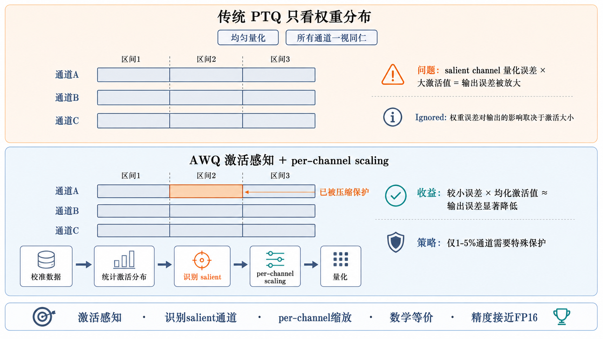

### 一、AWQ的核心发现

AWQ（Activation-aware Weight Quantization）是MIT等机构提出的针对大模型的PTQ方法，其核心发现是：

**并非所有权重通道（channel）对量化同等重要。** 某些权重通道对应的激活值（activations）特别大，这些通道对量化误差极为敏感。

具体而言，AWQ发现：
- 与较大激活值对应的权重通道（salient channels），即使很小的量化误差也会被放大
- 与较小激活值对应的权重通道，量化误差的影响相对较小
- 在1%-5%的salient channels上做保护，即可维持绝大部分的量化精度

### 二、Salient Channel的识别与保护

**如何识别salient channels？**

对每个权重通道，计算其对应激活的分布特征（通常是激活的绝对值平均值）：

```
salience[channel] = mean(|activation[:, channel]|)
```

在Transformer的线性层中，激活值通常指该层的输入（X），salience通过统计少量校准数据的输入激活得到。

**如何保护salient channels？**

AWQ的核心策略不是"保留salient channels为FP16"，而是通过**per-channel scaling**（逐通道缩放）来保护：

1. 确定每个通道的最佳缩放因子`s`
2. 对权重进行缩放：`W' = W * diag(s)`
3. 对对应激活进行反缩放：`X' = X * diag(s^{-1})`
4. 数学等价：`W'X' = W * diag(s) * diag(s^{-1}) * X = WX`

通过 per-channel scaling，salient channels 的数值范围被"压缩"，量化误差被减小，同时保持了计算的数学等价性。实际部署时，缩放因子 `s` 通常会被**吸收**到前一层的权重或后一层的权重/激活中，不会产生额外的运行时计算开销。

### 三、为什么"激活感知"很重要？

传统的PTQ方法（如MinMax量化、MSE量化）只关注权重本身的分布，而忽略了**权重如何与激活交互**：

```
量化误差被放大的过程：
量化误差 = (W_quantized - W_original) × X

对于salient channel（X值大）：
  即使W的量化误差很小，乘以大的X后误差也被放大
对于普通channel（X值小）：
  同样的W量化误差，乘以小的X后影响较小
```

这就是为什么只看权重的量化是不够的——真正影响输出精度的是**权重误差×激活值**的乘积。激活感知量化正是抓住了这一点，优先保护那些"激活大的通道"。

### 四、AWQ的量化流程

```
校准数据（少量样本）
  ↓
1. 统计每层输入激活的分布，计算每个channel的salience
2. 通过搜索或优化确定每层、每个channel的最佳缩放因子s
3. 应用缩放：W' = W × s, 激活反缩放：X' = X × s^{-1}
4. 对缩放后的W'进行标准量化（group-wise INT4量化）
5. 量化模型 = 缩放因子s + 量化后的W'
```

### 五、AWQ的性能表现

- 在Llama、OPT等模型的常见评测中，INT4 AWQ通常能保持较小的精度损失
- 推理速度在配合专用kernel时可能明显优于FP16，具体收益取决于硬件、batch和实现
- 量化过程通常只需少量校准数据（几十到几百个样本），耗时从数分钟到更长不等
- 与vLLM深度集成：`vllm serve model --quantization awq`

可以总结为：**AWQ的核心创新在于"激活感知"——通过分析激活分布发现少数salient channels，并利用per-channel scaling在不改变计算等价性的前提下保护这些敏感通道。这使得INT4量化在许多模型和任务上能保持较小精度损失，是当前大模型PTQ中常见且实用的方法之一。**

---

<h2 id="面试问题-gptq的原理是什么逐层最优脑外科量化如何工作？">面试问题：GPTQ的原理是什么？逐层最优脑外科量化如何工作？</h2>

**难度评分：⭐⭐⭐⭐⭐ (5/5)  |  考察频率：⭐⭐⭐⭐ (4/5)**

### 一、GPTQ的起源

GPTQ（GPT Post-Training Quantization）源于经典的**最优脑外科（Optimal Brain Surgeon, OBS）** 剪枝算法的思想，将"剪枝"改造成"量化"：

- OBS原思想：移除一个权重，并调整其他权重来补偿该权重的"贡献"，最小化输出误差
- GPTQ的创新：将一个权重"量化"（而非移除），并调整同一行内其他未量化的权重来补偿量化误差

### 二、逐层最优脑外科量化的核心原理

GPTQ采用了**逐层贪心量化 + 误差补偿**的策略：

**1. 逐层处理**
逐一处理模型的每一层，不进行端到端训练。对每一层，目标是：
```
min ||WX - W_quantized X||²
  ——即最小化量化前后该层输出的差异
```

**2. 逐列贪心量化**
对权重矩阵W的每一列（output channel）：
- 将该列的权重量化为低精度（如INT4）
- 计算量化误差对该列输出的影响
- 调整同一行中尚未量化的列来补偿误差

**3. Hessian矩阵的作用**
OBS/GPTQ使用Hessian矩阵的逆来精确计算补偿量：
```
H = 2XX^T （该层输入的Hessian矩阵）

量化第q列后的误差补偿：
δ = -(W_q - quant(W_q)) / [H^{-1}]_{qq} × H^{-1}_{:,q}
W_{remaining} += δ  （补偿未量化的列）
```

这样，每次量化一个通道后立即通过其他通道补偿，保证了"量化误差不累积"。

### 三、GPTQ的完整流程

```
对模型的每一层：
  ↓
1. 收集校准数据在该层的输入激活X
2. 计算Hessian矩阵 H = 2XX^T + λI（加λI保证可逆）
3. 计算H的逆 H^{-1}（Cholesky分解）
4. 对每一列（output channel）q：
   a. 量化W[:,q] → W_quantized[:,q]
   b. 计算误差 e = W[:,q] - W_quantized[:,q]
   c. 使用H^{-1}计算补偿量
   d. 将补偿加到所有未量化的列
5. 得到该层的量化权重
```

### 四、AWQ与GPTQ的对比

| 维度 | AWQ | GPTQ |
|------|-----|------|
| 核心思想 | 激活感知 + per-channel scaling | 逐层最优脑外科 + 误差补偿 |
| 量化策略 | 先缩放再量化（保护salient channels） | 边量化边补偿（贪心+误差修正） |
| 数学工具 | 激活统计（均值） | Hessian逆矩阵 |
| 量化速度 | 快（分钟级） | 较慢（7B模型约1-2小时/单A100，需Cholesky分解；时间随模型规模和校准数据量线性增长） |
| 精度表现 | 与GPTQ相当或略优 | 优秀的误差控制 |
| 对校准数据的需求 | 少量（几十到几百样本） | 较多（几百到几千样本更稳定） |
| 生态支持 | vLLM、HuggingFace | vLLM、HuggingFace、LMDeploy |

### 五、两种方法的互补关系

AWQ和GPTQ并非互相排斥，它们在思维上互补：
- GPTQ关注"量化后如何补偿误差"（事后修正）
- AWQ关注"量化前如何保护敏感通道"（事前预防）

在实际使用中，两者通常都能在INT4量化下取得较好的精度保持。选择哪种方法更多取决于：工具链支持（有些模型只有GPTQ版本）、校准数据充足性、量化时间要求等工程因素。

可以总结为：**GPTQ源于最优脑外科剪枝算法，采用逐层贪心量化+基于Hessian逆矩阵的误差补偿策略，尽量减小每一层量化前后的输出误差。与AWQ的"激活感知保护"思路不同，GPTQ是"量化→补偿"的迭代式方法。两者均是当前大模型INT4 PTQ中常见的方法，精度表现和使用场景有较多重叠。**

---

<h2 id="面试问题-kv-cache量化和权重量化有什么不同为什么要单独量化kv-cache？">面试问题（进阶）：KV Cache量化和权重量化有什么不同？为什么要单独量化KV Cache？</h2>

**难度评分：⭐⭐⭐⭐⭐ (5/5)  |  考察频率：⭐⭐⭐ (3/5)**

### 一、权重量化 vs KV Cache量化：核心区别

| 维度 | 权重量化 | KV Cache量化 |
|------|---------|-------------|
| 量化对象 | 模型参数（静态、恒定） | 推理中生成的K和V矩阵（动态、增长） |
| 量化时机 | 部署前离线完成 | 推理运行时逐Token写入 |
| 数据分布 | 训练后固定，分布可预知 | 每个请求不同，分布难以预知 |
| 对精度的敏感度 | 相对较低（大模型冗余度高） | 较高（直接参与注意力计算） |
| 主要收益 | 减少模型体积和加载时间 | 增大KV Cache容量，支持更长上下文/更多并发 |
| 量化位宽 | INT4/INT8/FP8 | INT8/FP8（INT4精度损失较大） |
| 反量化开销 | 权重加载时一次性 | 每次Decode读取时都需要反量化 |

### 二、为什么要单独量化KV Cache？

**1. KV Cache是显存的最大消耗者**

在长上下文或多并发场景中，KV Cache往往比模型权重占用更多显存。例如：
- 100个并发请求 × 4096上下文 × 7B模型的KV Cache ≈ 数十GB
- 同等条件下模型权重可能只有14GB

**2. K Cache和V Cache的量化敏感度不同**

研究发现K Cache和V Cache对量化的敏感度不同：
- V Cache通常对量化更鲁棒（可以量化到更低位宽）
- K Cache用于计算Attention Score，对精度更敏感（通常需要保留较高精度）

因此很多实现对K和V采用不同的量化策略：K→INT8，V→INT4或K→FP16，V→INT8。

**3. Decode阶段是访存瓶颈**

Decode阶段每次都需要读取全部KV Cache来与当前Token计算注意力。量化KV Cache可以：
- 减少每次Decode的访存量（如INT8查表比FP16少一半带宽）
- 提高有效HBM带宽利用率
- 间接提高Decode速度

### 三、KV Cache量化的实现方式

**方式1：在线统计量化（如LMDeploy）**
- 在Prefill阶段统计K和V的分布范围
- 根据统计的scale和zero_point在写入时量化
- 读取时反量化再参与注意力计算

**方式2：离线校准量化（如使用校准数据统计分布）**
- 使用代表性请求统计KV Cache的分布
- 离线确定量化参数
- 在线推理时直接使用预计算的量化参数

**方式3：混合精度KV Cache**
- K Cache保留FP16/INT8（保证Attention Score精度）
- V Cache量化到INT8/INT4（节省显存）

### 四、KV Cache量化的收益与风险

**收益：**
- 显存节省：INT8节省50%，INT4节省75%
- 支持更长上下文：同样的显存可以放更长的KV Cache
- 支持更多并发：同样的显存可以容纳更多请求

**风险：**
- 精度损失：尤其在长上下文场景中，每层的反量化误差可能累积
- 额外计算开销：每次读取需要反量化（有专门的快速反量化Kernel缓解）
- 分布漂移：不同请求的KV Cache分布差异大，固定量化参数不够适配

可以总结为：**KV Cache量化与权重量化的核心区别在于对象性质（动态vs静态）和量化目的（扩容vs瘦身）。KV Cache量化主要为了在有限显存下支持更长上下文和更多并发，需要特殊处理K Cache和V Cache对量化的不同敏感度。目前INT8 KV Cache量化已较为成熟，INT4则仍在探索中。**

---

<h2 id="面试问题-fp8量化有什么特点与int8int4量化相比有何优势？">面试问题：FP8量化有什么特点？与INT8/INT4量化相比有何优势？</h2>

**难度评分：⭐⭐⭐⭐ (4/5)  |  考察频率：⭐⭐⭐⭐ (4/5)**

### 一、什么是FP8？

FP8（8位浮点数）是一种低精度浮点数据格式，与 INT8（8位定点整数）不同，它保留了浮点数的指数+尾数结构，在有限的 8 位宽度内兼顾了动态范围和精度。

FP8 主要有两种格式（IEEE/OCP标准）：

| 格式 | 符号位 | 指数位 | 尾数位 | 动态范围 | 精度 | 典型用途 |
|------|--------|--------|--------|---------|------|---------|
| **E4M3** | 1 | 4 | 3 | ±448（较窄） | 较高 | 前向传播权重和激活 |
| **E5M2** | 1 | 5 | 2 | ±57344（较宽） | 较低 | 梯度（训练中更常用） |

- **E4M3**（4位指数+3位尾数）：精度更高，适合表示权重和前向激活
- **E5M2**（5位指数+2位尾数）：动态范围更大，适合表示梯度等可能出现大范围数值的量

在推理场景中，主要使用 **E4M3** 格式来量化权重和激活。

### 二、FP8与INT8的核心差异

| 维度 | INT8 | FP8（E4M3） |
|------|------|-------------|
| 数值类型 | 定点整数 | 浮点数（指数+尾数） |
| 量化方式 | scale × quantized_value | 直接存储浮点近似值 |
| 动态范围 | 取决于scale选择 | 天然大动态范围（指数位） |
| Outlier处理 | 需要clipping，outlier被截断 | 指数位可覆盖较大数值，outlier损失小 |
| 反量化开销 | 需要乘scale | 硬件原生支持，无需反量化 |
| 硬件要求 | 通用（Volta及以上） | Hopper（H100/H200）及更新架构 |

**关键区别**：INT8 是均匀量化的定点数，所有数值间隔相同；FP8 是非均匀的浮点数，数值间隔随大小自适应——小数值间距密（精度高），大数值间距疏（范围广）。这使得 FP8 对大模型中的 **outlier 特征**（显著偏离均值的激活值）比 INT8 更鲁棒。

### 三、为什么FP8对大模型推理很重要？

**1. 天然处理outlier，减少校准复杂度**

大模型的激活值中经常存在 outlier 通道（某些通道的数值比其他通道大 10-100 倍）。INT8 量化时，这些 outlier 要么被 clip 丢失信息，要么迫使 scale 拉大导致普通通道精度下降。FP8 的指数位可以直接覆盖数个数量级的数值范围，outlier 无需特殊处理就能保持精度。

**2. 硬件原生支持，零反量化开销**

NVIDIA Hopper 架构（H100/H200）的第四代 Tensor Core 原生支持 FP8 矩阵乘加（MMA），不需要像 INT8 那样先反量化到 FP16 再计算。减少了一次数据转换，延迟和功耗更低。

**3. Transformer 引擎的自动精度切换**

在 NVIDIA Transformer Engine 中，FP8 可以在不同层、不同矩阵乘法之间动态调整精度策略，对敏感层保留更高精度，非敏感层使用 FP8，在精度和性能之间自动平衡。

### 四、FP8 vs INT4 在推理中的定位

| 维度 | FP8 | INT4（AWQ/GPTQ） |
|------|-----|------------------|
| 压缩率 | 2×（相对FP16） | 4×（相对FP16） |
| 精度保持 | 通常极好，接近FP16 | 依赖算法，部分任务有可见损失 |
| 部署复杂度 | 低（硬件原生，vLLM/TensorRT-LLM直接支持） | 中（需要专用量化Kernel和算法） |
| 显存节省 | 50% | 75% |
| 硬件门槛 | H100/H200（Hopper架构） | 较通用（Volta及以上） |
| 推理速度 | 通常快于FP16（硬件加速），接近INT8 | 取决于Kernel优化，可能不如INT8/FP8 |

### 五、FP8在实际框架中的使用

**vLLM中启用FP8量化：**
```bash
# 使用FP8量化模型（需模型支持或提前量化）
vllm serve neuralmagic/Meta-Llama-3.1-70B-Instruct-FP8 \
    --quantization fp8 \
    --dtype auto
```

**TensorRT-LLM中FP8推理：**
```bash
# 构建FP8 TensorRT Engine（需在构建阶段指定FP8精度）
trtllm-build --checkpoint_dir ./model_ckpt \
    --output_dir ./trt_engines \
    --gemm_plugin fp8 \
    --use_fp8_context_fmha enable
```

### 六、FP8量化与大模型部署的选型建议

- **有 H100/H200**：优先评估 FP8，精度接近 FP16、部署简单、硬件加速
- **需要极致压缩（小显存/边缘设备）**：优先 INT4（AWQ/GPTQ），压缩率是关键
- **需要兼顾精度和压缩**：FP8 权重量化 + KV Cache INT8 量化，组合使用
- **训练场景**：FP8 E5M2 可用于梯度，FP8 E4M3 用于权重和激活的混合精度训练

可以总结为：**FP8 通过浮点数的指数+尾数结构，在 8 位宽度内实现了大动态范围和自适应精度，天然适合处理大模型中的 outlier 激活值。配合 Hopper 架构的硬件原生支持，FP8 在推理时通常接近 FP16 精度，比 INT4 部署更简单且精度风险更小。由于需要 Hopper 及以上 GPU，FP8 更适用于数据中心场景而非边缘端侧部署。FP8 的两种子格式（E4M3/E5M2）分别侧重精度和范围，推理中主要使用 E4M3。**

---

<h1 id="6.大模型推理底层性能优化attentionkv-cache与执行图">6.大模型推理底层性能优化：Attention、KV Cache与执行图</h1>

> 大模型推理的底层性能优化主要围绕三类瓶颈展开：Attention计算中的HBM读写、KV Cache带来的显存与带宽压力，以及Decode阶段大量小Kernel造成的Launch Overhead。FlashAttention从IO模式上优化注意力计算，MQA/GQA从模型结构上压缩KV Cache，CUDA Graph则从执行图层面降低调度开销。这些技术共同构成现代推理框架的底层性能基础。

<h2 id="面试问题-flashattention为什么能加速注意力计算io-aware具体指什么？">面试问题：FlashAttention为什么能加速注意力计算？IO-aware具体指什么？</h2>

**难度评分：⭐⭐⭐⭐⭐ (5/5)  |  考察频率：⭐⭐⭐⭐⭐ (5/5)**

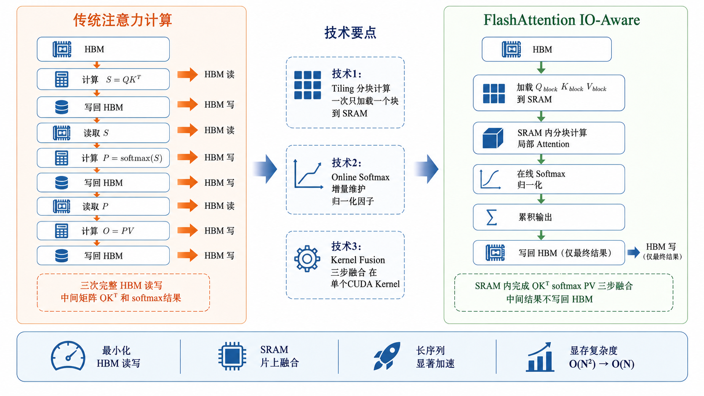

### 一、传统注意力计算的IO瓶颈

标准Transformer注意力计算公式为：

```
Attention(Q, K, V) = softmax(QK^T / √d) × V
```

以Q、K、V都存储在HBM（高带宽显存）为例：

**传统实现的问题：**
1. 先计算S = QK^T（大矩阵写入HBM）
2. 再读取S，计算P = softmax(S)（写入HBM）
3. 再读取P，计算O = PV（写入HBM）

每一步都涉及将中间结果写入HBM再读出，而HBM的带宽（~2TB/s for H100）虽然高，但远低于GPU片上SRAM的计算速度。这种**频繁的HBM读写带来的IO开销**成为注意力计算真正的瓶颈——本质上，注意力计算不是算不过来，是数据搬不过来。

### 二、FlashAttention的IO-aware设计

FlashAttention的核心思想是**分块计算 + 片上融合**：

**1. 分块（Tiling）**

将Q、K、V矩阵切分为小块（Block），每次只加载一个小块到快速SRAM中：

- 一个Q块 + 一个K块 → 局部Attention Score → softmax → ×V块
- 处理完一个K/V块后，再加载下一个K/V块
- 避免了QK^T整个矩阵的完整物化和HBM写入

**2. 在线Softmax（Online Softmax）**

传统softmax需要两次遍历（一次max、一次exp求和），而FlashAttention实现在分块计算中"在线"维护softmax的归一化因子：

```
对每个K/V块：
  - 计算局部Attention Score
  - 在线更新softmax的max和sum（使用numerically stable的增量算法）
  - 累积加权V结果
```

这样不需要等整个QK^T计算完再做softmax。

**3. 算子融合（Kernel Fusion）**

将Attention(Q, K, V)的三个步骤（QK^T、softmax、×V）融合在单个CUDA Kernel中完成，中间结果全部在SRAM中传递，不写回HBM。

### 三、FlashAttention的速度提升

以FP16精度、序列长度4096为例：

- FlashAttention-1：相比朴素标准实现通常有明显加速，显存占用可从O(N²)中间矩阵降到接近O(N)
- FlashAttention-2：通过改进任务划分和并行策略（让每个thread block处理不同的Q行），进一步提高GPU利用率
- FlashAttention-3：针对 Hopper 架构（H100/H200）深度优化，利用 TMA（Tensor Memory Accelerator）异步数据搬运和 **warp group 级别的 interleaved matmul-softmax 流水线**，将 softmax 延迟隐藏在矩阵乘法中。通过**生产者-消费者 warp 分工**（一部分 warp 负责 TMA 数据预取，另一部分 warp 负责计算），显著提升 SM 利用率，在 H100 上可达到 ~740 TFLOPS 的实际利用率（理论峰值的 75%）

### 四、IO-aware的内涵

**"IO-aware"** 是指算法设计时充分考虑了不同层级存储（HBM vs SRAM）的带宽和容量差异，通过分块计算最大化利用快速但容量小的SRAM，最小化慢速但容量大的HBM的访问。

| 存储层级 | 容量 | 带宽 | 延迟 |
|---------|------|------|------|
| GPU SRAM（Shared Memory） | ~228KB/SM | ~20TB/s | 极低 |
| GPU HBM（显存） | 80GB（A100） | ~2TB/s | 较高（数百cycle） |

FlashAttention正是通过**最小化HBM读写次数**来实现加速，这是"IO-aware"的精髓。

可以总结为：**FlashAttention通过分块计算（Tiling）、在线Softmax和Kernel融合三大技术，将注意力计算的中间结果尽量保持在GPU片上SRAM中，减少HBM读写次数。其核心思想"IO-aware"意味着算法设计时充分考虑不同存储层级的带宽差异，在长序列Attention中通常能改善性能和显存占用。FlashAttention-1/2/3代际演进持续结合新GPU架构优化，已成为主流推理框架中常用的Attention Backend。**

---

<h2 id="面试问题-mqa和gqa如何压缩kv-cache会带来什么影响？">面试问题：MQA和GQA如何压缩KV Cache？会带来什么影响？</h2>

**难度评分：⭐⭐⭐⭐ (4/5)  |  考察频率：⭐⭐⭐⭐⭐ (5/5)**

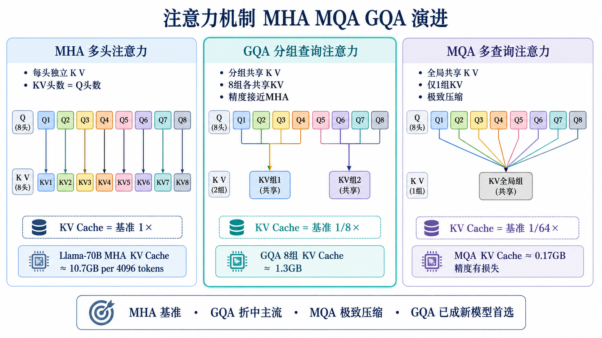

### 一、从MHA到MQA到GQA的演变

**MHA（Multi-Head Attention，多头注意力）**

标准Transformer中，每个注意力头都有独立的Q、K、V投影：

```
Q_i = X × W^Q_i      (每个头独立Q)
K_i = X × W^K_i      (每个头独立K)
V_i = X × W^V_i      (每个头独立V)
```

KV Cache大小 = 层数 × 头数 × 每个头的维度 × 序列长度 × 2(K+V)

**MQA（Multi-Query Attention，多查询注意力）**

所有Q头共享同一组K和V：

```
K_shared = X × W^K      (只有一组K)
V_shared = X × W^V      (只有一组V)
Q_i = X × W^Q_i         (Q仍然多头)
```

KV Cache缩小为原来的 1/头数。以32头为例，KV Cache减少到1/32。

**GQA（Grouped-Query Attention，分组查询注意力）**

将Q头分为若干组，每组共享一组K和V：

```
将H个头分为G组，每组H/G个头共享K、V
KV Cache = MHA的 (G/H)
```

例如Llama-2-70B使用8组：KV Cache从MHA的(H=64)缩减到8/64=1/8。

### 二、三者KV Cache消耗对比

以Llama-2-70B（层数=80, 64头, d_head=128, FP16）为例，4096上下文下：

| 方案 | KV头数 | 单请求KV Cache | 相对大小 |
|------|--------|---------------|----------|
| MHA | 64 | ~10.7GB | 1× |
| GQA (8组) | 8 | ~1.3GB | 1/8× |
| MQA | 1 | ~0.17GB | 1/64× |

### 三、GQA对模型质量的影响

GQA通过减少KV头数来压缩KV Cache，但这会带来模型表达能力的下降：

**正面影响：**
- KV Cache显存大幅减少，可支持更长上下文或更多并发
- Decode阶段访存量减少，推理速度提升
- 对小模型影响更小（因为小模型本身的头数较少）

**负面影响：**
- K和V的表达能力受限（多个Q头共享同一组K/V）
- 可能导致模型在某些任务上的精度略微下降
- 对需要精确注意力模式的任务（如信息检索）影响可能更大

**实验结论：**
- GQA（分组数≥4）在许多任务上可以接近MHA精度
- MQA在部分任务上可能有更明显的精度损失，新模型中通常更偏向采用GQA折中方案
- 当前主流大模型（Llama-2/3、Qwen-2等）广泛采用GQA

### 四、为什么GQA成为主流？

1. **KV Cache节省明显**：8分组意味着约8×的KV Cache压缩
2. **精度影响通常较小**：保留了分组级的K/V多样性，相比MQA的极端压缩更温和
3. **推理速度可能提升**：Decode阶段的访存量下降，在访存瓶颈明显时收益更突出
4. **训练兼容性较好**：GQA可以融入标准Transformer训练流程

可以总结为：**MQA将所有头的K/V合并为一组共享，GQA折中地按分组共享K/V。GQA通常能在较小精度影响下将KV Cache压缩数倍（典型为8×），降低大模型Decode阶段的显存和访存压力。当前不少主流大模型采用GQA，MQA则更多用于对吞吐和KV Cache压缩更敏感、且能接受潜在精度影响的场景。**

---

<h2 id="面试问题-什么是cuda-graph为什么它能降低大模型推理中的launch-overhead？">面试问题：什么是CUDA Graph？为什么它能降低大模型推理中的Launch Overhead？</h2>

**难度评分：⭐⭐⭐⭐ (4/5)  |  考察频率：⭐⭐⭐⭐ (4/5)**

### 一、大模型推理中的Launch Overhead问题

大模型推理（尤其是Decode阶段）涉及大量细碎的CUDA Kernel调用。以7B模型一次Decode为例：

- 几十个线性层（QKV投影、FFN等）
- 多个注意力计算Kernel
- LayerNorm、激活函数等小算子

每个Kernel从CPU端Launch到GPU执行，都涉及：
- CPU→GPU的命令队列写入
- GPU调度器解析命令
- Kernel启动前的准备工作

当每个Kernel的计算量很小时（如Decode阶段单Token的矩阵乘法），Kernel Launch的开销可能占据总延迟的明显比例。这就是**Launch Overhead**。

### 二、CUDA Graph的解决思路

CUDA Graph（CUDA图）允许将一系列CUDA操作**预先录制**为一个静态图，然后**一次性回放**：

**1. 捕获阶段（Capture）**
```
cudaStreamBeginCapture(stream)
// 执行一系列CUDA操作（Kernel launches, memcpy等）
kernel_A<<<...>>>(...)
kernel_B<<<...>>>(...)
kernel_C<<<...>>>(...)
cudaStreamEndCapture(stream, &graph)
// 得到一个cudaGraph对象
```

**2. 实例化阶段（Instantiate）**
```
cudaGraphInstantiate(&instance, graph)
// 编译图形为可执行的高效实例
```

**3. 执行阶段（Launch/Replay）**
```
cudaGraphLaunch(instance, stream)
// 一次性回放所有操作，只需要一次CPU→GPU提交
```

### 三、CUDA Graph在大模型推理中的应用

在Decode阶段，每次迭代的计算模式相对固定（主要是输入数据不同），因此适合评估CUDA Graph：

```
vLLM/SGLang的做法：
1. 预热Warmup阶段：执行几步Decode，同时捕获CUDA Graph
2. 日常推理阶段：直接Replay预录制的CUDA Graph
3. 每个Decode步骤 → 一次cudaGraphLaunch → 数百个Kernel一次性提交执行
```

**与直接Launch的对比：**
- 传统方式：100个Kernel → 100次CPU→GPU Launch提交 → 大量CPU开销和GPU调度延迟
- CUDA Graph：100个Kernel → 1次cudaGraphLaunch → 减少CPU提交开销，并让GPU调度更稳定

### 四、CUDA Graph的限制

1. **输入尺寸固定**：Graph的Kernel配置在捕获时确定，不能动态变化。因此适用于固定shape的Decode阶段，不太适合可变长输入的Prefill阶段
2. **动态控制流不支持**：不能在Graph中使用条件分支和循环
3. **调试困难**：Graph内的Kernel出错时难以定位具体位置
4. **内存地址固定**：KV Cache等数据的内存地址不能变化（这也是PagedAttention物理Block固定后配合CUDA Graph的重要原因）

### 五、实际收益

使用CUDA Graph后，Decode阶段每Token延迟通常会下降，尤其在batch size较小、Kernel Launch Overhead占比较高时更明显；具体收益取决于模型结构、batch形态、硬件和框架实现。

可以总结为：**CUDA Graph通过预录制→一次性回放的方式，减少Decode迭代中大量细小CUDA Kernel的Launch Overhead。它适合固定计算模式的Decode阶段，配合PagedAttention的固定物理Block地址，可在batch size较小时带来更稳定的延迟表现。vLLM和SGLang等框架都在合适场景中使用这类优化。**

---

<h1 id="7.高级推理架构优化pd分离推测解码与多token生成">7.高级推理架构优化：PD分离、推测解码与多Token生成</h1>

> 在底层算子和KV Cache优化之外，大模型推理还需要从服务架构和生成范式上突破瓶颈。Prefill/Decode的瓶颈差异催生了PD分离架构，推测解码则通过“多Token预测+大模型验证”缓解Decode串行生成问题。本章聚焦这些更偏系统架构层面的高级优化方法。

<h2 id="面试问题-prefill和decode阶段的瓶颈分别是什么为什么需要分开优化？">面试问题：Prefill和Decode阶段的瓶颈分别是什么？为什么需要分开优化？</h2>

**难度评分：⭐⭐⭐⭐ (4/5)  |  考察频率：⭐⭐⭐⭐ (4/5)**

### 一、两阶段瓶颈的本质差异

**Prefill阶段——计算密集型（Compute-Bound）**

Prefill一次性处理所有Prompt Token：
- 计算量：O(n²)注意力 + O(n) FFN（n = Prompt Token数）
- 瓶颈：GPU的FLOPS（计算能力），而非HBM带宽
- 优化方向：让GPU的Tensor Core"吃饱"——大batch、大矩阵运算
- 对硬件的要求：高FLOPS的GPU

**Decode阶段——访存密集型（Memory-Bound）**

Decode逐个Token生成：
- 计算量：O(n)注意力（单Token）+ O(1) FFN
- 瓶颈：HBM带宽，GPU等待数据从显存搬运到计算单元
- 优化方向：减少每步Decode的访存量——MQA/GQA、KV Cache量化、减少KV Cache尺寸
- 对硬件的要求：高HBM带宽的GPU

### 二、分开优化的必要性

将Prefill和Decode放在同一GPU上处理，会产生干扰：

1. **Prefill的"计算轰炸"会抢占Decode的计算资源**：当一个大Prompt的Prefill正在密集使用Tensor Core时，同时运行的Decode请求可能被"饿死"
2. **Decode的"带宽占用"会拖慢Prefill**：Decode需要持续读取KV Cache（占用大量HBM带宽），影响Prefill阶段的权重加载速度
3. **调度复杂度增加**：在同一个Scheduler中同时管理两种不同瓶颈的请求，调度策略更难兼顾TTFT、TPOT和吞吐

### 三、分开优化的方向

| 瓶颈 | 优化策略 |
|------|---------|
| Prefill（计算密集） | 增大batch（一次处理更多Token）、FlashAttention、FP8/INT8矩阵乘法、更多Tensor Core |
| Decode（访存密集） | 减少KV Cache大小（GQA/量化）、减少访问KV Cache的次数（多Token预测）、更高HBM带宽 |

### 四、为什么PD分离是顺势而为

既然两阶段瓶颈不同、对硬件的要求不同、优化方向不同，很自然的思路就是——把它们分开部署到不同的硬件上，各自使用最适合的配置。

可以总结为：**Prefill是计算密集型（瓶颈在FLOPS），Decode是访存密集型（瓶颈在HBM带宽）。两阶段放在一起会相互干扰，分开优化可以各取所需的硬件和策略。这就是PD分离架构的出发点。**

---

<h2 id="面试问题-什么是pd分离prefill-decode-disaggregation它的架构是怎样的？">面试问题：什么是PD分离（Prefill-Decode Disaggregation）？它的架构是怎样的？</h2>

**难度评分：⭐⭐⭐⭐⭐ (5/5)  |  考察频率：⭐⭐⭐⭐ (4/5)**

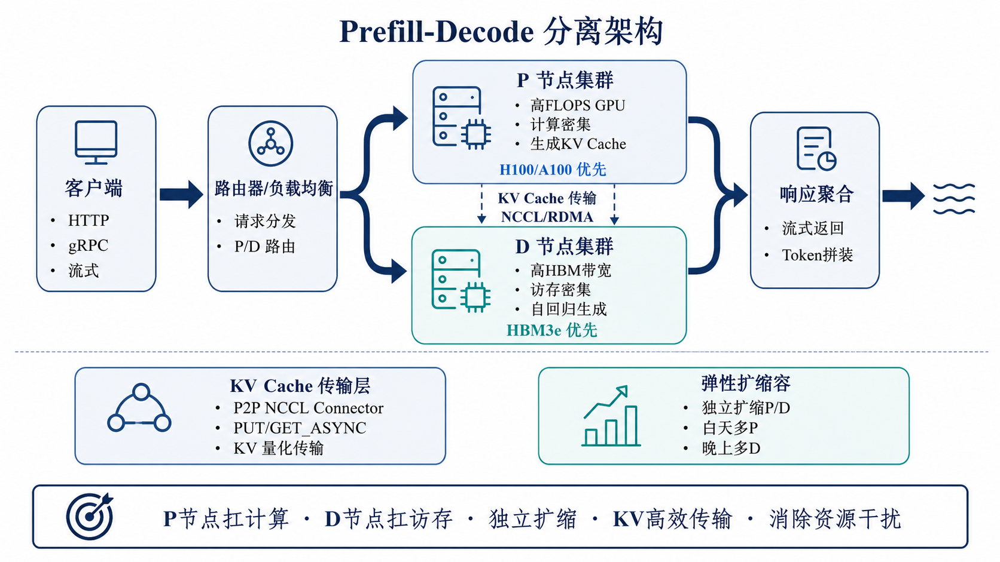

### 一、PD分离的核心思想

PD分离（Prefill-Decode Disaggregation）将推理服务的Prefill和Decode解耦到不同的GPU节点上：

- **Prefill节点（P节点）**：专门处理输入的Prompt，一次性计算所有Token的KV Cache
- **Decode节点（D节点）**：专门负责自回归生成，接收P节点传过来的KV Cache后逐Token生成

### 二、PD分离的架构设计

```
客户端请求
  ↓
路由器 / 负载均衡
  ↓          ↓
Prefill节点      Prefill节点
(P0, P1...)      (更多P节点)
  ↓ KV Cache传输   ↓
Decode节点       Decode节点
(D0, D1...)      (更多D节点)
  ↓
返回生成结果
```

**1. P节点（Prefill Node）**

职责：
- 接收完整的Prompt，进行Tokenization
- 一次性完成Prefill计算，生成初始KV Cache
- 将KV Cache通过高速网络（NCCL/RDMA）传输给D节点
- 生成第一个输出Token（可选，或由D节点生成）

硬件建议：
- 高FLOPS GPU（如H100、A100）
- 大batch处理能力
- 更多GPU（计算能力比带宽重要）

**2. D节点（Decode Node）**

职责：
- 接收P节点传来的KV Cache
- 执行自回归Decode循环（逐Token生成）
- 维护和更新KV Cache
- 检测停止条件（EOS/max_tokens）

硬件建议：
- 高HBM带宽GPU（HBM3e优先）
- 更大显存（容纳更多KV Cache = 更多并发）
- 可能配置更多节点（Decode耗时占比更大）

### 三、P节点到D节点的KV Cache传输

这是PD分离架构中最关键的技术挑战：

**传输量估算：** 以 Llama-2-7B 为例（32层, 32头, head_dim=128, FP16, MHA），4096 Prompt Token 的 KV Cache 传输量为：

```
2 × 32层 × 32头 × 128 × 4096 tokens × 2 bytes(FP16) × 2(K+V) ≈ 2GB
```

若使用 GQA（8组），则约为：2GB × (8/32) ≈ 0.5GB。可见传输量受模型架构（层数、头数、KV头数）和 Prompt 长度影响显著。超大模型（70B+）或超长 Prompt（32K+）场景下，KV Cache 传输量可能达到数十 GB。

**传输方式：**
- 使用NCCL RDMA实现GPU Direct传输（单节点内部NVLINK，跨节点InfiniBand/RoCE）
- 异步传输：P节点可以在发送KV Cache的同时继续处理下一个请求
- 压缩传输：可对KV Cache做量化（如INT8）再传输以节省带宽

### 四、PD分离的优势

1. **硬件异构化**：P节点用高FLOPS GPU，D节点用高带宽GPU，有机会降低整体成本
2. **独立扩缩容**：P和D可以独立弹性伸缩——白天多P少D（长Prompt多），晚上少P多D（聊天多）
3. **消除干扰**：Prefill不再抢占Decode的计算资源，Decode不再占用Prefill的带宽
4. **调度简化**：每个节点内部只需优化一种类型的工作负载
5. **故障隔离**：P/D分离后，部分故障可以限制在对应角色节点内，但仍需要依赖路由和状态管理兜底

### 五、PD分离的代价

1. **KV Cache传输延迟**：跨节点传输大量数据增加了端到端延迟
2. **架构复杂度**：需要路由器、KV Cache传输模块、独立扩缩容管理
3. **一致性挑战**：P节点和D节点需要状态同步
4. **额外资源**：传输网络带宽和RDMA设备

### 六、主流实现

- **Splitwise**（学术界）：较早系统性地提出PD分离的概念和收益分析
- **vLLM V1 KV Transfer/Connector体系**：通过`--kv-transfer-config`配置KV传输，结合P2P NCCL Connector等组件支持P/D之间的KV Cache传递
- **Mooncake / KVCenter**：以KV Cache为中心的分布式推理架构

在vLLM V1口径下，PD分离不应只理解为”把两个阶段拆开”，还要关注KV传输协议与调度状态：P节点完成Prefill后，需要把KV Cache通过Connector传给D节点；D节点在KV未就绪时可能处于等待远端KV的阻塞状态。P2P NCCL Connector这类实现通常支持`PUT`、`GET`、`PUT_ASYNC`等传输方式，其中异步传输更适合降低P/D流水线间的等待。

可以总结为：**PD分离将Prefill和Decode解耦到不同GPU节点，让P节点（高FLOPS）更专注于计算密集的Prompt处理，D节点（高带宽）更专注于访存密集的自回归生成。它有利于硬件异构化、独立扩缩容和降低工作负载干扰，但也引入了KV Cache跨节点传输和架构复杂度。是否采用PD分离，需要结合Prompt长度分布、并发规模、网络带宽和运维复杂度综合判断。**

---

<h2 id="面试问题-什么是推测解码speculative-decodingdraft-model和target-model如何协同？">面试问题：什么是推测解码（Speculative Decoding）？Draft Model和Target Model如何协同？</h2>

**难度评分：⭐⭐⭐⭐⭐ (5/5)  |  考察频率：⭐⭐⭐⭐ (4/5)**

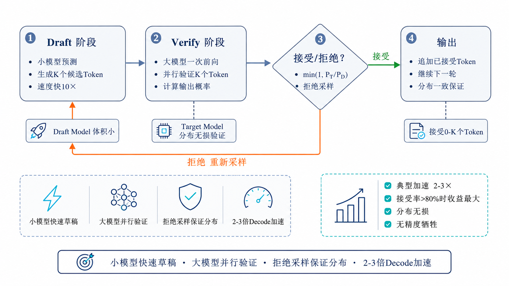

### 一、推测解码的核心动机

自回归解码的核心瓶颈在于Token之间存在依赖关系，通常需要逐步生成，每个Token依赖前一个Token。这导致：
- GPU的并行计算能力被严重浪费（每步只生成1个Token）
- Decode延迟随Token数量线性增长

推测解码的核心思想：**用一个"小而快"的Draft Model预测接下来的K个Token，然后用"大而准"的Target Model一次性验证这些Token，接受正确的部分，拒绝错误的。**

这就是"投机取巧"——反正Decode每步的计算量很小，不如让Target Model一次验证多个Token的推测结果，赌Draft Model预测得对。

### 二、推测解码的工作流程

```
输入: Prompt tokens
循环直到完成:
  1. Draft阶段:
     Draft Model自回归生成K个候选Token (draft_1, draft_2, ..., draft_K)
     (Draft Model很小很快，这一步耗时很短)
  
  2. Verify阶段:
     Target Model一次性处理 (Prompt + draft_1 + ... + draft_K)
     并行计算所有位置的输出概率
     
  3. Accept/Reject（拒绝采样）:
     对每个位置i的draft token x:
       计算接受概率 p_accept = min(1, p_target(x) / p_draft(x))
       以 p_accept 的概率接受该token
       如果接受 → 继续验证下一个draft token
       如果拒绝 → 从 p_target 的残余分布中重新采样，并丢弃后续所有draft token
     
     被接受的Token直接作为输出（可能接受0到K个）
  
  4. 将接受的Token追加到输入，准备下一轮
```

### 三、Draft Model和Target Model的协同机制

**Draft Model（草稿模型/推测模型）**

要求：
- 参数量远小于Target Model（如7B的Target配0.1B的Draft）
- 与Target Model使用相同词表
- 不需要很高的精度，但需要"大致方向正确"
- 推理速度快（最好是Target Model的10倍以上）

常见选择：
- 同一系列的微型版本（如Llama-3-8B配Llama-3-0.1B）
- 或仅用最后几层的轻量Draft Head

**Target Model（目标模型/验证模型）**

要求：
- 就是最终需要的高质量大模型
- 在验证阶段一次前向处理K+1个Token
- 通过注意力掩码实现并行计算所有位置的输出概率

**拒绝采样（Rejection Sampling）保证分布一致**

推测解码的关键数学保证：通过 **min(1, p_target(x) / p_draft(x))** 的拒绝采样机制，使最终输出的Token分布与Target Model直接自回归采样保持一致。因此它通常被称为”分布无损”的加速方法，但实际收益仍取决于Draft模型质量和接受率。需要区分的是，这里的接受判断不是简单比较两个概率的大小，而是基于概率比值进行随机采样——即使 p_target < p_draft 时仍有一定概率被接受，这是保证最终分布一致的关键。

### 四、性能收益分析

**加速比取决于两个因素：**

1. **接受率（Acceptance Rate）**：Draft Model预测被Target Model接受的比例
   - 高接受率（>80%）：受益于Target Model一次验证多个Token
   - 低接受率：大部分Draft Token被拒绝，加速有限

2. **Draft Model速度**：Draft越快越好
   - 理想情况：Draft生成K个Token的时间 << Target一次验证的时间

**典型加速比**：不少场景可达到2×-3×，在Draft模型质量高、接受率高的任务上可能更高；低接受率或Draft开销较大时收益会明显下降。

### 五、推测解码的变体

**1. Medusa（多头预测）**

不依赖独立的Draft Model，而是在Target Model上增加多个"预测头"，每个头负责预测未来不同位置的Token。减少了Draft Model的额外显存占用。

**2. Eagle（投机采样）**

利用Target Model的中间层特征训练轻量Draft Head，而不是独立的Draft Model。进一步降低额外显存和训练成本。

**3. Lookahead Decoding**

利用Jacobi迭代的方式，在Target Model内部实现并行推测，无需额外模型。

### 六、推测解码的局限

1. **Draft Model需要额外显存**：虽然Draft Model很小，但仍需额外空间
2. **小Batch时收益有限**：Target Model Decode本来就不算慢
3. **Draft和Target的对齐**：两者分布差异大时接受率低
4. **长序列验证计算量大**：每轮验证需要处理K个位置的完整注意力

可以总结为：**推测解码通过"小模型预测K个Token→大模型并行验证→拒绝采样保证分布一致"的机制，在不降低生成质量的前提下实现2-3倍的Decode加速。其变体包括Medusa（多头预测）、Eagle（特征级Draft）等。目前vLLM和SGLang都已集成推测解码支持，是大模型推理中低延迟场景的重要优化手段。**

---

<h1 id="8.大模型推理服务评测压测与容量规划">8.大模型推理服务评测、压测与容量规划</h1>

> 大模型推理服务的性能评测与传统推理有显著不同——不仅要看吞吐量，更要关注TTFT（首Token延迟）、TPOT（逐Token延迟）、P99延迟、容量上限和单位成本。构建合理的评测体系，需要先定义指标，再通过压测找到系统拐点，最后结合SLO和成本约束做容量规划。

<h2 id="面试问题-大模型推理服务有哪些核心性能指标ttfttpotthroughput分别衡量什么？">面试问题：大模型推理服务有哪些核心性能指标？TTFT、TPOT、Throughput分别衡量什么？</h2>

**难度评分：⭐⭐⭐⭐ (4/5)  |  考察频率：⭐⭐⭐⭐⭐ (5/5)**

### 一、核心指标体系总览

大模型推理服务的性能评测通常关注四大类指标：

1. **延迟类**：TTFT、TPOT、E2E Latency
2. **吞吐类**：Throughput、QPS、Token/s
3. **资源类**：GPU利用率、显存占用、KV Cache利用率
4. **质量类**：生成质量（Perplexity、任务指标）、首Token正确率

### 二、TTFT（Time To First Token，首Token延迟）

**定义**：从请求发出到收到第一个生成Token的时间间隔。

**TTFT = 排队延迟 + Tokenization时间 + Prefill延迟 + 第一次Decode延迟**

**衡量什么**：用户感知的"响应速度"。TTFT越低，用户感觉响应越快。

**影响因素**：
- Prompt长度：长度越长，Prefill计算量越大，TTFT越高
- 排队情况：高负载时请求在队列中等待，TTFT 增加
- Prefill计算能力：GPU FLOPS越高，Prefill越快

**典型目标**：
- 交互式对话场景：< 200ms（理想），< 500ms（可接受）
- 批量处理场景：< 2s

### 三、TPOT（Time Per Output Token，逐Token延迟）

**定义**：生成阶段中，每个输出Token之间的平均时间间隔。

**TPOT ≈ 一次Decode的计算时间 + 访存时间**

**衡量什么**：生成过程的"流畅度"。TPOT越低，文字"流"得越快。

**影响因素**：
- KV Cache大小（已有的Token数）：序列越长，每次Decode需读取的KV Cache越多，TPOT越高
- HBM带宽：Decode是访存密集型，带宽越大TPOT越低
- Batch Size（并发请求数）：并发越多，每步需处理的请求越多，TPOT可能增加

**典型目标**（需按模型规模区分）：
- 7B/13B 模型交互式场景：< 15-20ms/Token（50+ Token/s 的输出速度）
- 70B+ 模型交互式场景：< 30-50ms/Token（受限于访存瓶颈，单用户 TPOT 难达到 20ms 以内）
- 流式体验（各规模通用）：< 50ms/Token（低于此值时用户感知流畅）
- 批量离线处理：> 100ms/Token 也可接受，关注吞吐而非逐 Token 延迟

### 四、E2E Latency（端到端延迟）

**定义**：从请求发出到收到完整回复（包括所有生成Token）的总时间。

**E2E Latency = TTFT + TPOT × (生成Token数 - 1)**

### 五、Throughput（吞吐量）

**定义**：单位时间内系统处理的Token总数。

**Throughput = 总输出Token数 / 时间（通常以 tokens/s 度量）**

**衡量什么**：系统的整体"产能"。

**影响因素**：
- 并发请求数
- 每批处理的Token数
- Continuous Batching的效率
- GPU数量和型号

**注意区分**：
- 单请求吞吐：延迟敏感型场景关注（TTFT、TPOT更重要）
- 系统总吞吐：批量离线场景关注（Throughput更重要）

### 六、QPS（Queries Per Second）

**定义**：单位时间内成功处理的请求数。

**注意**：大模型场景中QPS关联于多个变量（Prompt长度、生成长度），单纯比较QPS意义有限。通常需要标注输入/输出长度条件。

**正常化QPS**：固定条件（如Prompt=500 Tokens, Output=200 Tokens）下的QPS更有可比性。

### 七、其他重要指标

**1. GPU利用率（GPU Utilization）**：GPU计算单元的使用比例。Decode阶段因为访存绑定，利用率天然低（往往10-30%），不必追求100%利用率。

**2. KV Cache命中率**：Prefix Caching/RadixAttention的命中率。高命中率→更多请求跳过Prefill→更低TTFT。

**3. P50/P95/P99延迟**：延迟的百分位分布，P95/P99反映了"最差体验"。在在线服务中P99比Average Latency更重要。

**4. Time Per Query（TPQ）**：单个请求从进入系统到返回的耗时。

### 八、指标关系图

```
                   E2E Latency
    |←————————————————————————————————————→|
    |←—— TTFT ——→|←—— (N-1) × TPOT ——→|
    |              |                      |
发起请求    收到第1个Token   收到第2个Token   ...   收到第N个Token
```

可以总结为：**大模型推理服务核心指标中，TTFT衡量"用户等多快能看到第一个字"（取决于Prefill速度），TPOT衡量"生成有多流畅"（取决于Decode访存速度），Throughput衡量"系统多久能处理完一批任务"。在线服务优先关注TTFT和P99延迟，离线批量优先关注Throughput。**

---

<h2 id="面试问题-如何进行大模型推理性能benchmark有哪些常用评测工具？">面试问题：如何进行大模型推理性能Benchmark？有哪些常用评测工具？</h2>

**难度评分：⭐⭐⭐ (3/5)  |  考察频率：⭐⭐⭐⭐ (4/5)**

### 一、Benchmark的基本原则

一个有效的大模型推理Benchmark需要做到：

1. **控制变量**：固定输入长度/输出长度/并发数等关键参数
2. **预热（Warmup）**：排除CUDA Graph构建、模型首次加载等冷启动影响
3. **多轮测试**：取多次测试的中位数/P50/P95，而非单次
4. **真实负载模拟**：使用与实际场景相似的输入/输出长度分布、并发模式
5. **结果可复现**：记录硬件配置、框架版本、关键参数

### 二、常用评测工具

**1. vLLM benchmark_serving.py**

vLLM内置的压测脚本是最常用的评测工具：

```bash
# 使用随机数据压测
python benchmarks/benchmark_serving.py \
    --backend vllm \
    --model Qwen/Qwen2-7B-Instruct \
    --dataset-name random \
    --random-input-len 1024 \
    --random-output-len 128 \
    --num-prompts 1000 \
    --request-rate 10
```

输出结果包括：TTFT均值/P99、TPOT均值/P99、Throughput (tokens/s)、Request throughput (req/s)等。

**2. SGLang bench_serving**

SGLang也提供类似的内置评测工具：

```bash
python -m sglang.bench_serving \
    --backend sglang \
    --num-prompts 500 \
    --random-input-len 2048 \
    --random-output-len 512
```

**3. EvalScope**

阿里开源的LLM评测框架，支持性能Benchmark：

```python
from evalscope.perf import PerfBenchmark

benchmark = PerfBenchmark(
    model="Qwen2-7B",
    input_len_range=(100, 2000),
    output_len_range=(50, 500),
    concurrency=[1, 4, 16, 64]
)
results = benchmark.run()
```

**4. GenAI-Perf (NVIDIA)**

NVIDIA官方的大模型性能评测工具，与Triton Inference Server深度集成：

```bash
genai-perf profile \
    --model llama \
    --backend tensorrtllm \
    --num-prompts 100 \
    --request-rate 5
```

**5. Locust / wrk（通用压测）**

通用HTTP压测工具也适用于大模型API服务的压力测试：

```python
# Locust脚本示例
class LLMUser(HttpUser):
    @task
    def chat(self):
        self.client.post("/v1/chat/completions", json={
            "model": "qwen2-7b",
            "messages": [{"role": "user", "content": "你好"}],
            "max_tokens": 100
        })
```

### 三、Benchmark的常见模式

**模式1：固定压力测试**
- 设定固定的请求频率（如10 req/s）
- 观察延迟和吞吐是否稳定
- 适用：容量规划

**模式2：阶梯压力测试**
- 逐步增加请求频率（1→5→10→20→50 req/s）
- 找到系统的"拐点"——延迟开始快速上升的QPS
- 适用：容量上限评估

**模式3：突发压力测试**
- 模拟突发流量（如瞬时100个并发请求）
- 观察TTFT在突发下的表现
- 适用：弹性评估

**模式4：长文本专项测试**
- 使用不同长度的Prompt（1K/4K/16K/32K）
- 观察TTFT和显存的非线性增长
- 适用：长上下文能力评估

### 四、Benchmark结果解读

一份典型的评测报告应包含：

| 指标 | 值 | 备注 |
|------|-----|------|
| 模型 | Qwen2-7B-Instruct | FP16 |
| 并发数 | 32 | — |
| 平均输入长度 | 1024 tokens | — |
| 平均输出长度 | 256 tokens | — |
| TTFT (P50/P99) | 45ms / 120ms | P99在可接受范围 |
| TPOT (P50/P99) | 12ms / 18ms | 生成流畅 |
| Throughput | 3500 tokens/s | 系统总吞吐 |
| QPS | 13.7 req/s | — |
| GPU利用率 | 65% | Decode主导，利用率合理 |
| 显存占用 | 48GB / 80GB | 有充足KV Cache空间 |

可以总结为：**大模型推理Benchmark需要控制变量、预热、多次取样，模拟真实负载。常用工具包括vLLM/SGLang内置的bench_serving、EvalScope、GenAI-Perf等。Benchmark不仅是性能数字，更重要的是通过阶梯压测找到系统瓶颈和容量上限，以及通过P99延迟了解"最差用户体验"。**

---

<h1 id="9.大模型分布式推理部署并行策略与多机多卡实践">9.大模型分布式推理部署：并行策略与多机多卡实践</h1>

> 当模型大到单卡GPU无法容纳，或者单副本无法满足吞吐需求时，分布式推理通常是必要选择。从单卡到多卡再到多机多卡，核心问题是如何组合张量并行、流水线并行和数据并行，并在通信开销、显存占用和服务吞吐之间取得平衡。理解这些并行策略的原理和适用边界，是部署70B及以上模型时经常需要掌握的知识。

<h2 id="面试问题-张量并行流水线并行数据并行在推理中各自适用什么场景？">面试问题：张量并行、流水线并行、数据并行在推理中各自适用什么场景？</h2>

**难度评分：⭐⭐⭐⭐⭐ (5/5)  |  考察频率：⭐⭐⭐⭐ (4/5)**

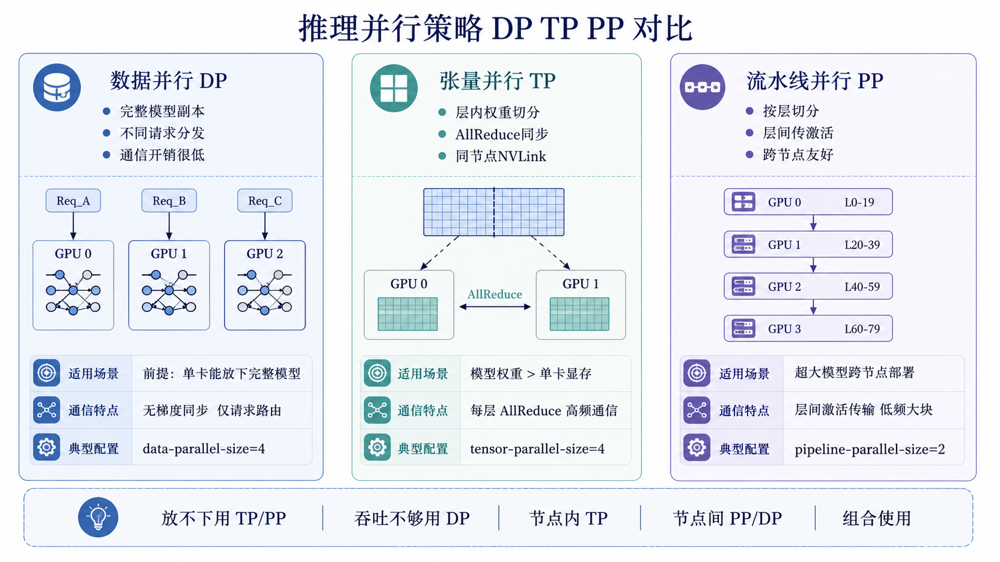

### 一、三种并行的基本概念

**1. 数据并行（Data Parallelism, DP）**

每个GPU持有完整的模型副本，但处理不同的输入数据：

```
GPU0: 完整模型 → 处理 [请求A, 请求B]
GPU1: 完整模型 → 处理 [请求C, 请求D]
```

- 通信：推理时不需要梯度同步；多副本间通常只需要请求路由和状态管理
- 显存：每张卡需要能放下完整模型
- 适用：模型能放入单卡但需要提高吞吐量的场景

**2. 张量并行（Tensor Parallelism, TP）**

将单个Transformer层内的权重矩阵切分到多个GPU上：

```
Attention层的QKV投影矩阵切分：
GPU0: W_Q[:half, :]     → 计算Q的前半部分
GPU1: W_Q[half:, :]     → 计算Q的后半部分
(计算后通过AllReduce合并结果)
```

- 通信：每层需要AllReduce/AllGather，通信频率高但数据量较小
- 显存：每张卡的模型参数量减少为 1/TP_size
- 适用：单层放不下单卡时（如大矩阵乘法的权重超过显存）

**3. 流水线并行（Pipeline Parallelism, PP）**

将模型的不同层分配到不同GPU上，按流水线方式执行：

```
GPU0: Layers 0-19  → 处理完成后传给
GPU1: Layers 20-39 → 处理完成后传给
GPU2: Layers 40-59 → ...
GPU3: Layers 60-79 → 输出最终结果
```

- 通信：层间接口传递激活值，通信频率较低但每次需要传输完整激活
- 显存：每张卡只存放部分层
- 适用：模型总层数太多导致单卡放不下所有层

### 二、推理场景中三种并行的适用性

| 并行方式 | 推理中的适用性 | 通信开销 | 主要用途 |
|---------|-------------|---------|---------|
| 数据并行 | ⭐⭐⭐⭐⭐ 常用 | 很低 | 提高吞吐量（每个GPU副本服务不同请求） |
| 张量并行 | ⭐⭐⭐⭐ 常用 | 中（频繁AllReduce） | 大权重矩阵无法放入单卡 |
| 流水线并行 | ⭐⭐ 较少用 | 低频率但高单次量 | 跨节点部署超大模型 |

### 三、推理中数据并行的特殊性

推理中的数据并行与训练中的数据并行有本质区别：
- 训练的数据并行：需要梯度同步（AllReduce梯度），通信开销大
- 推理的数据并行：每个GPU独立处理不同请求，**通常不需要梯度式模型同步**，通信开销较低

因此推理中数据并行通常很高效——只要每张卡能放下完整模型，数据并行就是较简单的水平扩展方式。

### 四、张量并行在推理中的细节

**为什么推理需要张量并行？**

以Llama-2-70B为例，FP16精度模型权重约140GB，单张A100/H100（80GB显存）无法完整存放。这时就需要将模型权重切分到多张卡上。

**典型的张量并行切分方式：**
1. 对Attention层的Q、K、V投影矩阵按列切分
2. 对FFN的中间层（gate、up）按列切分
3. 通过AllReduce同步部分结果

**通信开销：**
- TP在每层都需要AllReduce，通信频繁
- 因此TP对卡间带宽要求高（需要NVLink或至少PCIe 4.0）
- 跨节点的TP性能会大幅下降（除非有InfiniBand/RoCE）

### 五、如何选择并行策略？

**决策树：**

```
模型能否放入单卡？
├── 能 → 使用数据并行（多卡多副本，提高吞吐）
└── 不能 → 模型多大？
    ├── 2-4张卡能放下 → 张量并行（TP=2/4/8）
    │   - 同节点内使用NVLink连接
    │   - 通常适合70B以下或能在单节点内切分的模型
    └── 需要更多卡 → 张量并行 + 流水线并行
        - 节点内用TP，跨节点用PP
        - 如Llama-405B需要TP=8+PP=2（16卡）
```

**vLLM中的典型配置：**
```bash
# 单节点4卡，TP=4（适合70B模型）
vllm serve model --tensor-parallel-size 4

# 多节点：节点内TP=4，跨2个节点PP=2（适合超大模型）
vllm serve model --tensor-parallel-size 4 --pipeline-parallel-size 2
```

### 六、通信基础设施的重要性

| 连接方式 | 带宽 | 适用并行方式 |
|---------|------|-------------|
| NVLink（同节点GPU间） | 900 GB/s (H100) | TP（优先评估） |
| InfiniBand NDR（跨节点） | 400 GB/s | TP/PP（视负载评估） |
| PCIe 5.0（跨节点） | 128 GB/s | PP（TP容易受带宽限制） |
| 以太网（跨节点） | 100-400 Gb/s | PP/DP（通常不推荐跨节点TP） |

可以总结为：**数据并行是推理中常见且高效的扩展方式，前提是模型能放入单卡或单个副本组。当模型无法放入单卡时，通常优先评估节点内张量并行；流水线并行更常用于跨节点部署超大模型。实际部署中经常组合使用：节点内TP切分大层，跨节点PP切分层分布，请求级数据并行提高吞吐。**

---

<h2 id="面试问题-vllm如何配置多gpu分布式推理关键并行参数如何选择？">面试问题：vLLM V1如何配置多GPU分布式推理？关键并行参数如何选择？</h2>

**难度评分：⭐⭐⭐ (3/5)  |  考察频率：⭐⭐⭐⭐ (4/5)**

### 一、vLLM V1多GPU配置的核心参数

**`--tensor-parallel-size`（张量并行度）**

- 含义：将单个模型副本的权重矩阵切分到多少张GPU上
- 取值：通常为1/2/4/8
- 要求：TP内通信频繁，最好限制在同节点NVLink/NVSwitch范围内
- 适用：模型权重单卡放不下，或单卡放下后KV Cache空间不足

**`--pipeline-parallel-size`（流水线并行度）**

- 含义：将模型层切分到多个流水线阶段
- 取值：通常为1/2/4
- 要求：每个PP stage内部仍可组合TP
- 适用：超大模型跨节点部署，或TP不适合跨节点扩展时

**`--data-parallel-size`（数据并行副本数）**

- 含义：启动多个完整模型副本，每个副本处理不同请求
- 要求：每个DP副本内部可以是单卡，也可以是TP/PP组合
- 适用：单个模型副本已经能跑，但总吞吐不够

**`--distributed-executor-backend`（分布式执行后端）**

- 含义：选择分布式Worker/Executor管理方式
- 单机部署通常使用默认后端即可
- 多节点部署可根据环境选择`ray`等后端，而不是使用旧版`--worker-use-ray`口径

**上下文并行参数**

- `--decode-context-parallel-size`：Decode阶段上下文并行
- `--prefill-context-parallel-size`：Prefill阶段上下文并行
- 适用：超长上下文下单卡/单组GPU处理上下文压力过大时评估

### 二、参数选择指南

**确定模型副本形态的方法：**

1. 先估算单卡能否放下模型权重和必要KV Cache
2. 能放下：优先单卡副本，通过`data-parallel-size`扩吞吐
3. 放不下：优先节点内`tensor-parallel-size`
4. 单节点仍放不下或模型非常大：再组合`pipeline-parallel-size`
5. 长上下文成为主要瓶颈时，再评估Prefill/Decode上下文并行

**常见模型推荐配置：**

| 模型规模 | 精度 | 单卡80GB | 推荐配置 | 说明 |
|---------|------|---------|----------|------|
| 7B | FP16/BF16 | 能放下 | DP多副本 | 提高吞吐优先用数据并行 |
| 13B | FP16/BF16 | 能放下 | DP多副本 | 单副本通常无需TP |
| 34B | FP16/BF16 | 接近上限 | TP2或量化+DP | 需要给KV Cache留空间 |
| 70B | FP16/BF16 | 放不下 | TP4/TP8 | 节点内高速互联更重要 |
| 70B | INT4/AWQ | 能放下或接近 | 单卡/TP2+DP | 量化后可优先扩副本 |
| 405B | FP8/BF16 | 放不下 | TP+PP跨节点 | 需要结合网络和Executor后端 |

### 三、多GPU部署示例

**单节点4卡部署70B模型：**
```bash
vllm serve meta-llama/Llama-2-70b-chat-hf \
    --tensor-parallel-size 4 \
    --gpu-memory-utilization 0.9 \
    --max-model-len 4096
```

**单卡可放下但吞吐不足：使用数据并行扩副本：**
```bash
vllm serve Qwen/Qwen2-7B-Instruct \
    --data-parallel-size 4 \
    --max-num-seqs 128 \
    --max-num-batched-tokens 8192
```

**多节点超大模型：TP+PP并指定分布式后端：**
```bash
vllm serve meta-llama/Llama-3.1-405B-Instruct \
    --tensor-parallel-size 4 \
    --pipeline-parallel-size 2 \
    --distributed-executor-backend ray
```

### 四、多节点部署的关键判断

跨节点部署时，最重要的不是“能不能启动”，而是通信是否划算：

- **TP跨节点风险最大**：每层都可能有AllReduce/AllGather，网络差会严重拖慢TPOT
- **PP跨节点更常见**：层间只传激活，通信频率低于TP，但会有流水线气泡
- **DP跨节点更稳妥**：不同副本处理不同请求，模型内部通信较少
- **PD分离另算一类**：P/D之间需要KV传输，应重点评估`kv-transfer-config`、网络带宽和KV大小

因此一般优先级是：**节点内TP，节点间DP；超大模型再节点间PP；PD分离只在Prefill/Decode瓶颈差异明显时引入。**

### 五、常见配置问题

**问题1：TP size不整除注意力头数**

大多数模型的注意力头数是2的幂次或可被常见TP值整除。如果TP size不能整除头数，可能启动失败或性能不佳。

**问题2：跨节点TP延迟高**

如果跨节点没有InfiniBand/RoCE等高速网络，TP通信会成为瓶颈。此时应优先改成节点内TP、跨节点DP或PP。

**问题3：DP副本吞吐没线性提升**

可能瓶颈不在GPU，而在请求路由、CPU Tokenization、网络、限流策略或后端负载不均衡。

**问题4：长上下文下显存不足**

优先检查`max-model-len`、KV Cache容量、`max-num-seqs`和Prefix Caching命中率，再考虑上下文并行或PD分离。

可以总结为：**vLLM V1多GPU部署要区分”模型放不下”和”吞吐不够”两个问题：放不下通常优先评估TP/PP，吞吐不够通常优先评估DP。旧版`--worker-use-ray`表述应更新为`--distributed-executor-backend`；跨节点部署时优先让高频通信留在节点内，把DP、PP或PD分离放到节点间。**

---

<h1 id="10.大模型推理生产部署实践与常见问题排查">10.大模型推理生产部署实践与常见问题排查</h1>

> 前面九章覆盖了从原理到优化的理论体系，本章聚焦从本地验证走向生产服务时的部署流程和问题排查。Ollama适合本地快速验证，vLLM/SGLang更适合在线服务；实际落地时还需要掌握显存OOM、延迟抖动、吞吐下降等常见问题的定位方法，建立面向生产环境的排障思维。

<h2 id="面试问题-使用ollama本地部署大模型的流程是怎样的有哪些常见问题？">面试问题：使用Ollama本地部署大模型的流程是怎样的？有哪些常见问题？</h2>

**难度评分：⭐⭐ (2/5)  |  考察频率：⭐⭐⭐⭐ (4/5)**

### 一、Ollama部署基本流程

**1. 安装Ollama**

```bash
# Linux/macOS
curl -fsSL https://ollama.com/install.sh | sh

# Windows
# 下载安装包 https://ollama.com/download/windows
```

**2. 拉取并运行模型**

```bash
# 直接运行（自动下载）
ollama run qwen2:7b

# 或先拉取再运行
ollama pull qwen2:7b
ollama run qwen2:7b
```

**3. 常用模型Tag说明**

```
qwen2:7b          → 7B参数，Q4_K_M量化（默认）
qwen2:7b-instruct → 指令微调版
qwen2:72b         → 72B参数，需要足够显存
llama3.1:8b       → Meta Llama 3.1 8B
deepseek-r1:7b    → DeepSeek-R1 7B蒸馏版
```

**4. 自定义模型（Modelfile）**

```
FROM qwen2:7b
SYSTEM "你是一个专业的Python编程助手，回答应该简洁且包含代码示例。"
PARAMETER temperature 0.7
PARAMETER top_p 0.9
```

```bash
ollama create my-assistant -f Modelfile
ollama run my-assistant
```

**5. API服务模式**

```bash
# 启动API服务（默认端口11434）
ollama serve

# 调用API
curl http://localhost:11434/v1/chat/completions \
    -d '{"model":"qwen2:7b","messages":[{"role":"user","content":"你好"}]}'
```

### 二、常见问题与解决

**问题1：下载速度慢**

Ollama默认从海外服务器下载，国内可能很慢甚至超时。

解决方案：
- 使用代理环境变量：`HTTPS_PROXY=http://proxy:port ollama pull model`
- 使用国内ModelScope等镜像站下载GGUF文件，再导入Ollama
- 或者直接从HuggingFace Mirror下载GGUF文件

**问题2：显存不足**

运行大模型时Ollama报错"out of memory"。

解决方案：
- 选择更小的模型版本：如qwen2:1.5b 替代 qwen2:7b
- 选择更高量化等级的Tag（Q2_K < Q4_K_M < Q5_K_M < Q8_0）
- 限制上下文长度：`ollama run model` 后在设置中调低context窗口
- 使用环境变量限制GPU层数：`OLLAMA_NUM_GPU_LAYERS=20`

**问题3：CPU推理非常慢**

如果GPU显存不足，Ollama会回退到CPU推理，速度大幅下降。

判断方法：`ollama ps` 查看模型是否100%在CPU。

解决方案：
- 确保GPU驱动和CUDA正常安装
- 设置 `OLLAMA_NUM_GPU_LAYERS=-1` 强制使用所有GPU层
- 升级到支持更多GPU的硬件

**问题4：并发限制**

Ollama默认不擅长处理高并发请求。

解决方案：
- 设置环境变量增加并行数：`OLLAMA_NUM_PARALLEL=4`
- 对于生产环境，切换到vLLM/SGLang
- 使用多个Ollama实例+负载均衡

### 三、Ollama在生产环境中的定位

Ollama定位更偏向**个人开发、本地测试、原型验证**工具，不是面向高并发生产环境的推理框架。它的优势在于"开箱即用"和"简单易学"，但在并发能力、吞吐量和延迟优化上通常不如vLLM等服务化框架。

**Ollama适合：**
- 本地开发和调试
- 个人项目和小团队内部工具
- 模型功能验证和快速原型
- 隐私敏感场景（可完全离线运行）

**不适合：**
- 高并发在线服务（QPS > 10）
- 需要严格延迟保障的场景
- 需要通过张量并行部署超大模型（>70B）

可以总结为：**Ollama通过`ollama run/pull/serve`等简单命令实现了大模型的一键部署，适合个人开发、本地测试和原型验证。生产环境建议切换到vLLM或SGLang。使用中常见问题包括下载慢（配代理）、显存不足（选小模型/高量化版本）、并发弱（非Ollama设计目标）。**

---

<h2 id="面试问题-大模型推理中显存oom如何排查和解决？">面试问题：大模型推理中显存OOM如何排查和解决？</h2>

**难度评分：⭐⭐⭐⭐ (4/5)  |  考察频率：⭐⭐⭐⭐⭐ (5/5)**

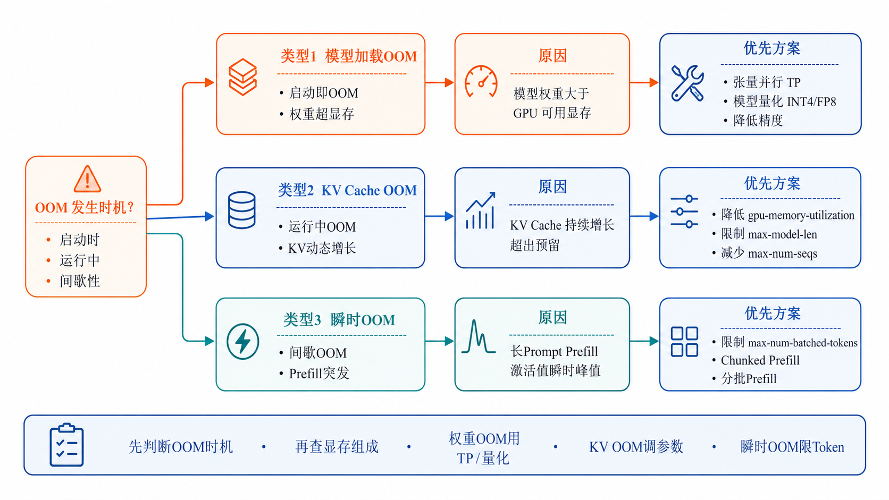

### 一、OOM的分类与定位

大模型推理中的OOM（Out of Memory）通常分为三类：

**类型1：模型加载OOM**
- 现象：模型加载阶段就报OOM，根本无法启动
- 原因：模型权重超过GPU可用显存

**类型2：KV Cache OOM**
- 现象：服务启动成功，但在运行一段时间后、处理到长文本或多并发时OOM
- 原因：KV Cache动态增长超出预留空间

**类型3：瞬时OOM**
- 现象：间歇性OOM，有时正常有时失败
- 原因：Prefill时大量激活值同时分配，瞬时显存峰值超过容量

### 二、OOM排查流程

**Step 1：确认显存使用情况**

```bash
# 实时监控显存
nvidia-smi -l 1
# 或使用
watch -n 1 nvidia-smi

# vLLM启动日志中查看预估显存分配
# 关键日志行：
# "GPU memory utilization: 0.9"
# "Total GPU memory: 80GB"
# "Free GPU memory: XX GB"
# "KV Cache capacity: XX tokens"
```

**Step 2：计算显存分配**

```
总显存分配 = 模型权重 + KV Cache池 + CUDA Context等固定开销

模型权重（FP16）= 参数量 × 2 字节
例如：7B × 2 = 14GB, 70B × 2 = 140GB

KV Cache池 = 总显存 × gpu_memory_utilization - 模型权重 - 固定开销

每个请求的KV Cache = 2 × 层数 × head_dim × kv_heads × 序列长度 × 2字节
```

**Step 3：根据OOM类型定位**

- 启动时OOM → 模型权重过大，需要TP或量化
- 运行中OOM → KV Cache设置过大或限制太宽松
- 瞬时OOM → Prefill burst，max-num-batched-tokens过大

### 三、解决方案

**方案1：降低gpu-memory-utilization**

```bash
vllm serve model --gpu-memory-utilization 0.8  # 从0.9降到0.8
```

减小KV Cache的总池子，降低OOM风险（但会减少可并发请求数）。

**方案2：限制max-model-len**

```bash
vllm serve model --max-model-len 4096  # 从8192降到4096
```

减小每个请求的最大KV Cache预留，有效降低OOM风险。

**方案3：限制max-num-seqs**

```bash
vllm serve model --max-num-seqs 64  # 减少最大并发序列数
```

减少同时活跃的请求数，限制KV Cache的总消耗。

**方案4：使用量化模型**

```bash
# INT4量化模型
vllm serve Qwen/Qwen2-7B-Instruct-AWQ --quantization awq

# FP8量化模型
vllm serve model --quantization fp8
```

模型权重减少到原来的1/4（INT4）或1/2（FP8），留出更多空间给KV Cache。

**方案5：张量并行**

```bash
vllm serve model --tensor-parallel-size 4
```

将模型权重切分到多张卡上，每张卡的权重压力减小。

**方案6：启用KV Cache量化（如LMDeploy）**

```bash
# LMDeploy启用KV Cache INT8量化
lmdeploy serve api_server model --kv-cache-dtype 8
```

### 四、OOM排查速查表

| 现象 | 常见原因 | 优先排查方向 |
|------|----------|-------------|
| 启动即OOM | 模型权重 > 显存 | 张量并行或量化 |
| 长文本OOM | max-model-len设太大 | 降低max-model-len |
| 高并发OOM | KV Cache池耗尽 | 降低max-num-seqs或gpu-memory-utilization |
| 间歇性OOM | Prefill burst瞬发峰值 | 降低max-num-batched-tokens |
| 运行几小时后OOM | 显存碎片或泄漏 | 重启服务，升级vLLM版本 |

可以总结为：**大模型推理OOM排查应首先区分是模型加载OOM、KV Cache OOM还是瞬时OOM，然后针对性解决：模型OOM用TP/量化，KV Cache OOM调低gpu-memory-utilization/max-model-len/max-num-seqs，瞬时OOM限制max-num-batched-tokens。量化模型+张量并行是最有效的OOM解决组合。**

---

<h2 id="面试问题-推理速度突然变慢或延迟抖动通常从哪些方向排查？">面试问题：推理速度突然变慢或延迟抖动，通常从哪些方向排查？</h2>

**难度评分：⭐⭐⭐⭐ (4/5)  |  考察频率：⭐⭐⭐⭐ (4/5)**

### 一、排查方向总览

推理速度变慢或延迟抖动，可以从以下六大方向排查：

1. 请求侧变化
2. 显存与KV Cache状态
3. GPU硬件状态
4. 调度效率
5. 网络与I/O
6. 软件栈问题

### 二、逐方向排查

**方向1：请求侧变化**

首先要排除是不是"不是系统慢了，而是请求变了"：

- Prompt长度是否变长？→ TTFT增加是正常的
- 生成长度是否增加？→ End-to-End延迟增加是正常的
- 并发量是否增加？→ 每步处理的请求变多，TPOT增加
- 请求分布是否变化（更多长文本混入）？→ P99延迟可能上升

排查方法：检查日志中的输入/输出Token统计分布。

**方向2：显存与KV Cache状态**

KV Cache接近饱和时，Scheduler可调度空间会变小，常表现为等待队列增长、抢占增加或TTFT/P99上升：

- 检查 `nvidia-smi` 显存是否接近上限
- 观察KV Cache使用率是否长期接近上限
- 观察running/waiting请求数是否持续升高
- Prefix Cache命中率是否下降

排查方法：
```bash
# vLLM暴露的metrics endpoint
curl http://localhost:8000/metrics | grep vllm
# 关注：
# vllm:num_requests_running (当前运行请求数)
# vllm:num_requests_waiting (等待调度请求数)
# vllm:kv_cache_usage_perc (KV Cache利用率)
# vllm:prefix_cache_queries / vllm:prefix_cache_hits (Prefix Cache命中情况)
# vllm:external_prefix_cache_queries / vllm:external_prefix_cache_hits (外部Prefix Cache命中情况)
```

**方向3：GPU硬件状态**

GPU硬件问题可能导致性能下降：

- GPU降频（Thermal Throttling）：温度过高→自动降频→性能下降
- ECC错误：内存纠错开销→变慢
- GPU与其他进程共享：被其他任务占用部分算力
- NVLink降级：多卡通信带宽下降

排查方法：
```bash
nvidia-smi -q -d TEMPERATURE,CLOCK  # 检查温度和频率
nvidia-smi topo -m                   # 检查NVLink拓扑
nvidia-smi pmon -c 1                 # 检查是否有其他进程
```

**方向4：调度效率**

- 是否出现了"长请求堵塞短请求"？→ 检查scheduler策略
- 批次是否变得不均衡？→ 检查是否有少量超长Prompt占用了大量计算
- Continuous Batching是否正常工作？

排查方法：观察vLLM日志中的调度Pattern，检查是否频繁出现单个请求独占计算的情况。

**方向5：网络与I/O（API服务模式）**

- 网络延迟是否增加？
- Tokenization/Detokenization是否成为瓶颈？
- 是否有其他服务抢占CPU/内存？

排查方法：
```bash
# 检查API服务延迟
time curl -X POST http://localhost:8000/v1/chat/completions ...
# 检查网络
ping <server>
# 检查CPU
top / htop
```

**方向6：软件栈问题**

- vLLM/SGLang版本是否有已知性能回归？
- CUDA/cuDNN版本是否有兼容性问题？
- PyTorch版本变更？
- 其他依赖更新导致的问题？

排查方法：检查最近是否有软件更新，查阅GitHub Issues看是否有类似报告。

### 三、延迟抖动的常见原因

**1. KV Cache接近上限与抢占增加**

KV Cache容量紧张时，Scheduler可选择的请求会变少，部分running请求可能被preempt后回到waiting，表现为TTFT/P99升高、吞吐波动。

**2. Prefill冲击**

一个大Prompt的Prefill可能占用较多计算资源，导致同一批次中其他Decode请求的延迟突然增加（"Prefill Spike"）。

**3. CUDA Graph重建**

如果vLLM因某种原因需要重建CUDA Graph，会有一段短暂的重建期导致延迟抖动。

**4. Python GC**

Python的垃圾回收可能在不可预测的时间触发，导致短暂停顿。

### 四、性能退化排查清单

```
□ 请求特征变化？ → 对比输入/输出长度分布
□ 显存使用是否接近上限？ → nvidia-smi + metrics
□ GPU降频/过热？ → nvidia-smi -q -d TEMPERATURE
□ 其他进程抢占GPU？ → nvidia-smi pmon
□ KV Cache使用率是否过高？ → vllm:kv_cache_usage_perc
□ running/waiting是否持续升高？ → vllm:num_requests_running / vllm:num_requests_waiting
□ 网络延迟？ → ping + curl测试
□ 版本变更？ → git log / pip list对比
□ CPU/内存瓶颈？ → top / htop
```

可以总结为：**推理速度变慢或延迟抖动时应从请求侧、显存状态、GPU硬件、调度效率、网络I/O和软件栈六个方向系统排查。最常见的原因包括：请求特征变化（长Prompt增加）、KV Cache接近饱和、GPU过热降频、Prefill冲击导致Decode抖动。通过vLLM的metrics endpoint（/metrics）和nvidia-smi可以快速定位大多数性能问题。**

---
