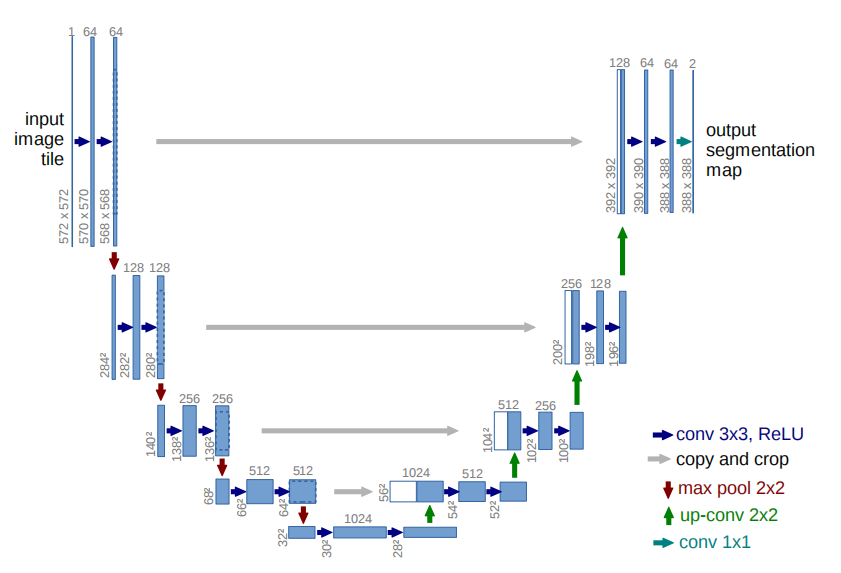
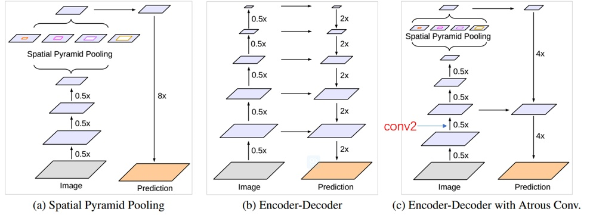
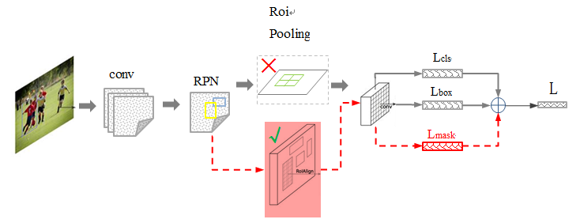

# 目录

## 第一章 图像分割基础范式

[1. 图像分割和检测、分类有什么本质区别？](#q-001)
  - [面试问题：语义分割、实例分割、全景分割有什么区别？](#q-002)
  - [面试问题：FCN 为什么是深度学习图像分割的关键起点？](#q-003)
  - [面试问题：反卷积、上采样和跳连在分割中分别有什么作用？](#q-004)

## 第二章 Encoder-Decoder 与多尺度上下文

[2. U-Net、SegNet、PSPNet、DeepLab 如何解决分割问题？](#q-005)
  - [面试问题：U-Net 为什么在医学影像和 AIGC 控制中长期高频？](#q-006)
  - [面试问题：SegNet 的池化索引上采样有什么特点？](#q-007)
  - [面试问题：PSPNet 和 DeepLab 如何建模多尺度上下文？](#q-008)
  - [面试问题：空洞卷积和 ASPP 的核心作用是什么？](#q-009)

## 第三章 实例分割与统一分割

[3. 从 Mask R-CNN 到 Mask2Former 的分割范式如何演进？](#q-010)
  - [面试问题：Mask R-CNN 如何从检测扩展到实例分割？](#q-011)
  - [面试问题：全景分割为什么要同时处理 thing 和 stuff？](#q-012)
  - [面试问题：Mask2Former 为什么能统一语义、实例和全景分割？](#q-013)

## 第四章 Promptable Segmentation 与视觉基础模型

[4. SAM 为什么成为 AIGC 时代的经典视觉基础模型？](#q-014)
  - [面试问题：SAM 的 image encoder、prompt encoder、mask decoder 分别做什么？](#q-015)
  - [面试问题：SAM 2 相比 SAM 的关键改进是什么？](#q-016)
  - [面试问题：SEEM、SAM、Grounding DINO 如何组合成开放世界视觉工具链？](#q-017)

## 第五章 分割在 AIGC 系统中的应用

[5. 图像分割如何服务生成、编辑、视频和数据工程？](#q-018)
  - [面试问题：分割模型如何用于 ControlNet、图像编辑和视频编辑？](#q-019)
  - [面试问题：分割模型在自动标注、数据清洗和多模态 Agent 中有什么用？](#q-020)

---

<h1 id="q-001">1. 图像分割和检测、分类有什么本质区别？</h1>

分类、检测、分割的输出粒度不同：

- 分类：整张图一个或多个类别。
- 检测：每个目标一个类别和边界框。
- 分割：每个像素都要被赋予语义或实例归属。

分割比检测更细，因为它不只知道“在哪里有目标”，还要知道“目标精确轮廓是什么”。

在 AIGC 中，分割的重要性进一步提升：

- 图像编辑需要精确 mask。
- 视频编辑需要跨帧一致 mask。
- ControlNet / 条件生成可使用语义图、边缘图、人体解析图。
- 自动标注需要高质量区域标签。
- 多模态 Agent 需要定位并操作图像中的具体区域。

<h2 id="q-002">面试问题：语义分割、实例分割、全景分割有什么区别？</h2>

**难度评分：⭐⭐ (2/5)  |  考察频率：⭐⭐⭐⭐⭐ (5/5)**

三类分割的核心区别：

| 类型 | 输出 | 是否区分同类不同实例 | 例子 |
| --- | --- | --- | --- |
| 语义分割 | 每个像素的类别 | 不区分 | 两个人都标为 person |
| 实例分割 | 每个实例的 mask | 区分 | person1、person2 分开 |
| 全景分割 | 所有像素的语义 + 实例 | thing 区分实例，stuff 不区分 | 人、车分实例，天空、道路不分实例 |

thing 指可数物体，如人、车、狗；stuff 指不可数背景区域，如天空、道路、草地。

面试中可这样说：语义分割重类别，实例分割重对象，全景分割试图统一整张图的像素级理解。

<h2 id="q-003">面试问题：FCN 为什么是深度学习图像分割的关键起点？</h2>

**难度评分：⭐⭐⭐ (3/5)  |  考察频率：⭐⭐⭐⭐⭐ (5/5)**

FCN，Fully Convolutional Network，是深度学习语义分割的重要起点。

它的核心贡献：

1. **将全连接层替换为卷积层**

   让网络可以接受任意尺寸输入，并输出空间特征图。

2. **端到端像素级预测**

   不再只输出图像级类别，而是输出每个像素的类别概率。

3. **上采样恢复分辨率**

   将低分辨率语义特征恢复到原图大小。

4. **跳连融合多层特征**

   高层语义强但分辨率低，低层细节强但语义弱，跳连用于融合二者。

FCN 的局限：

- 输出边界较粗。
- 对小目标和细节不够好。
- 多尺度上下文建模不足。

后续 U-Net、DeepLab、PSPNet、Mask R-CNN 等模型都可以看作在 FCN 基础上改进多尺度、边界、实例区分和上下文建模。

<h2 id="q-004">面试问题：反卷积、上采样和跳连在分割中分别有什么作用？</h2>

**难度评分：⭐⭐⭐ (3/5)  |  考察频率：⭐⭐⭐⭐ (4/5)**

分割网络通常先下采样获得高语义特征，再上采样恢复空间分辨率。

常见操作：

| 操作 | 作用 | 特点 |
| --- | --- | --- |
| 最近邻 / 双线性上采样 | 恢复分辨率 | 无学习参数，简单稳定 |
| 转置卷积 | 可学习上采样 | 可能产生棋盘伪影 |
| Unpooling | 利用池化索引恢复位置 | SegNet 常见 |
| 跳连 | 融合低层细节和高层语义 | U-Net、FCN 常见 |

跳连特别重要，因为单纯高层语义特征已经丢失很多边界细节。AIGC 图像编辑中，mask 边缘质量会直接影响编辑区域是否自然。

---

<h1 id="q-005">2. U-Net、SegNet、PSPNet、DeepLab 如何解决分割问题？</h1>

分割模型的经典改进方向：

- Encoder-Decoder 恢复空间细节。
- Skip connection 融合浅层细节。
- 多尺度上下文识别不同大小目标。
- 空洞卷积扩大感受野。
- 条件随机场或边界模块改善边缘。

<h2 id="q-006">面试问题：U-Net 为什么在医学影像和 AIGC 控制中长期高频？</h2>

**难度评分：⭐⭐⭐ (3/5)  |  考察频率：⭐⭐⭐⭐⭐ (5/5)**

U-Net 是 Encoder-Decoder 结构，形状像 U。



核心特点：

- 左侧 encoder 下采样，提取高层语义。
- 右侧 decoder 上采样，恢复空间分辨率。
- 同层 skip connection 将 encoder 细节特征拼接到 decoder。

为什么长期高频：

- 小数据场景表现好，尤其医学影像。
- 边界和细节恢复能力强。
- 结构直观，易改造。
- 扩散模型中 U-Net 成为去噪网络的经典 backbone。
- ControlNet 也继承了 U-Net 多尺度控制思想。

AIGC 联系：

Stable Diffusion 早期主干是 U-Net 去噪网络。它在不同尺度上处理噪声 latent，并通过 cross-attention 注入文本条件。理解 U-Net，有助于理解扩散模型为什么擅长局部细节和多尺度生成。

<h2 id="q-007">面试问题：SegNet 的池化索引上采样有什么特点？</h2>

**难度评分：⭐⭐ (2/5)  |  考察频率：⭐⭐⭐ (3/5)**

SegNet 也是 Encoder-Decoder 结构，但它在 decoder 上采样时使用 encoder max pooling 记录的池化索引。

特点：

- encoder 池化时记录最大值位置。
- decoder unpooling 时把特征放回对应位置。
- 不需要像 U-Net 那样拼接大量 encoder 特征，显存相对更省。

优点：

- 上采样位置更有依据。
- 结构适合语义分割。

局限：

- 只记录最大值位置，细节信息有限。
- 后续很多任务更偏向 U-Net 式 skip connection 或 attention-based decoder。

<h2 id="q-008">面试问题：PSPNet 和 DeepLab 如何建模多尺度上下文？</h2>

**难度评分：⭐⭐⭐⭐ (4/5)  |  考察频率：⭐⭐⭐⭐ (4/5)**

PSPNet 使用 Pyramid Pooling Module 获取不同尺度的上下文信息。

核心思想：

- 对特征图做不同尺度的池化。
- 得到全局到局部的多尺度上下文。
- 上采样后与原特征拼接。

DeepLab 系列主要使用空洞卷积和 ASPP。

DeepLab 演进：

- DeepLabv1：空洞卷积 + CRF。
- DeepLabv2：ASPP 多尺度空洞卷积。
- DeepLabv3：改进 ASPP 和训练策略。
- DeepLabv3+：加入 encoder-decoder 结构改善边界。



对比：

| 模型 | 多尺度方式 | 关键点 |
| --- | --- | --- |
| PSPNet | 金字塔池化 | 全局上下文强 |
| DeepLab | ASPP 空洞卷积 | 不降分辨率扩大感受野 |

<h2 id="q-009">面试问题：空洞卷积和 ASPP 的核心作用是什么？</h2>

**难度评分：⭐⭐⭐ (3/5)  |  考察频率：⭐⭐⭐⭐⭐ (5/5)**

空洞卷积，Dilated Convolution，在卷积核元素之间插入空洞，以不增加参数量的方式扩大感受野。

普通 $3\times3$ 卷积只能看邻近区域；空洞率为 2 的 $3\times3$ 卷积可以覆盖更大范围。

ASPP，Atrous Spatial Pyramid Pooling，将不同 dilation rate 的空洞卷积并联，捕获不同尺度上下文。

作用：

- 在不继续下采样的情况下扩大感受野。
- 保持较高分辨率，利于分割。
- 多尺度识别大小不同的目标。

局限：

- dilation rate 设置不当可能出现 gridding artifact。
- 对边界精细程度仍需 decoder 或后处理改善。

---

<h1 id="q-010">3. 从 Mask R-CNN 到 Mask2Former 的分割范式如何演进？</h1>

实例分割和全景分割将分割从“像素类别”推进到“像素对象”。

演进方向：

- Mask R-CNN：检测框内预测实例 mask。
- Panoptic FPN：语义分割 + 实例分割组合。
- DETR-style mask classification：把分割看作 mask set prediction。
- Mask2Former：用 masked attention 统一语义、实例和全景分割。

<h2 id="q-011">面试问题：Mask R-CNN 如何从检测扩展到实例分割？</h2>

**难度评分：⭐⭐⭐ (3/5)  |  考察频率：⭐⭐⭐⭐⭐ (5/5)**

Mask R-CNN 在 Faster R-CNN 基础上增加一个 mask 分支。



核心改进：

- 保留 Faster R-CNN 的分类和 bbox 分支。
- 新增 FCN-style mask head。
- 使用 ROI Align 替代 ROI Pooling，提高像素对齐精度。

三个输出：

- class label。
- bounding box。
- instance mask。

为什么重要：

- 将检测自然扩展到实例分割。
- 结构清晰，工程成熟。
- 仍是很多实例分割任务的强基线。

<h2 id="q-012">面试问题：全景分割为什么要同时处理 thing 和 stuff？</h2>

**难度评分：⭐⭐⭐ (3/5)  |  考察频率：⭐⭐⭐ (3/5)**

全景分割要求每个像素都有唯一标签，同时覆盖：

- thing：可数实例，如人、车、动物。
- stuff：不可数区域，如天空、路面、草地。

普通语义分割不能区分同类实例；普通实例分割通常不覆盖背景 stuff。全景分割试图统一完整图像理解。

应用：

- 自动驾驶场景理解。
- 机器人导航。
- 视频理解。
- AIGC 图像编辑中的全图结构理解。

难点：

- thing 和 stuff 训练目标不同。
- 实例冲突需要融合策略。
- 评价指标通常使用 PQ，Panoptic Quality。

<h2 id="q-013">面试问题：Mask2Former 为什么能统一语义、实例和全景分割？</h2>

**难度评分：⭐⭐⭐⭐ (4/5)  |  考察频率：⭐⭐⭐ (3/5)**

Mask2Former 的核心是将分割统一为 mask classification 问题。

它不再为每个像素直接分类，而是预测一组 mask，每个 mask 对应一个类别。

关键点：

- 使用 Transformer decoder 生成 mask queries。
- 使用 masked attention，让 query 关注预测 mask 区域内的特征。
- 同一框架可处理语义分割、实例分割和全景分割。

为什么重要：

- 统一多个分割任务。
- 与 DETR-style set prediction 思想一致。
- 更适合和视觉基础模型、多任务训练结合。

---

<h1 id="q-014">4. SAM 为什么成为 AIGC 时代的经典视觉基础模型？</h1>

SAM，Segment Anything Model，将分割从固定任务模型推进到 promptable foundation model。

它的目标不是只在某个数据集上分割固定类别，而是通过点、框、mask 等 prompt，对任意图像中任意对象进行分割。

为什么高频：

- 改变了分割模型的使用方式。
- 极大降低标注成本。
- 可与 Grounding DINO、CLIP、LLM、图像编辑模型组合。
- 是多模态 Agent 的视觉工具组件。

<h2 id="q-015">面试问题：SAM 的 image encoder、prompt encoder、mask decoder 分别做什么？</h2>

**难度评分：⭐⭐⭐⭐ (4/5)  |  考察频率：⭐⭐⭐⭐⭐ (5/5)**

SAM 由三部分组成：

1. **Image Encoder**

   通常是强大的 ViT，用于提取图像 embedding。这个部分计算较重，但可以预计算。

2. **Prompt Encoder**

   编码用户输入的点、框、mask 等提示。点和框属于稀疏 prompt，mask 属于稠密 prompt。

3. **Mask Decoder**

   将图像 embedding 和 prompt embedding 融合，输出一个或多个 mask 及其质量分数。

为什么适合交互：

- 图像 embedding 可缓存。
- prompt 编码和 mask 解码较轻。
- 用户可以多次点击或调整提示快速得到新 mask。

面试金句：SAM 的本质是把分割从“固定类别预测”改造成“由 prompt 控制的通用 mask 生成”。

<h2 id="q-016">面试问题：SAM 2 相比 SAM 的关键改进是什么？</h2>

**难度评分：⭐⭐⭐⭐ (4/5)  |  考察频率：⭐⭐⭐⭐ (4/5)**

SAM 2 将 Segment Anything 从图像扩展到视频。

关键改进：

- 使用带 streaming memory 的 Transformer 架构。
- 支持图像和视频统一 promptable segmentation。
- 能在视频中跟踪和细化目标 mask。
- 构建大规模视频分割数据引擎和 SA-V 数据集。
- 在视频分割中减少交互次数，并提升实时处理能力。

和 SAM 的核心区别：

| 维度 | SAM | SAM 2 |
| --- | --- | --- |
| 主要对象 | 图像 | 图像 + 视频 |
| 记忆机制 | 图像级 prompt 分割 | 视频 streaming memory |
| 输出 | 单图 mask | 跨帧 masklets |
| 应用 | 图像标注、编辑 | 视频编辑、视频理解、AR/VR |

AIGC 场景：

- 视频对象抠图。
- 视频局部编辑。
- 视频生成结果一致性检查。
- 多模态 Agent 对视频目标进行持续追踪。

<h2 id="q-017">面试问题：SEEM、SAM、Grounding DINO 如何组合成开放世界视觉工具链？</h2>

**难度评分：⭐⭐⭐⭐ (4/5)  |  考察频率：⭐⭐⭐⭐ (4/5)**

常见组合方式：

1. **Grounding DINO**

   根据文本 prompt 定位目标框。

2. **SAM / SAM 2**

   根据框、点或 mask prompt 输出精细分割。

3. **SEEM**

   支持更丰富的交互提示，统一多种分割交互。

4. **LLM / 多模态 Agent**

   负责理解用户意图，调用检测、分割、OCR、编辑等工具。

典型流程：

```text
用户文本指令 -> LLM 解析目标 -> Grounding DINO 定位框 -> SAM 分割 mask -> 图像编辑 / 视频编辑 / 自动标注
```

这条工具链把传统检测和分割升级为 AIGC 系统中的“可语言控制视觉操作工具”。

---

<h1 id="q-018">5. 图像分割如何服务生成、编辑、视频和数据工程？</h1>

分割在 AIGC 时代从单一视觉任务变成基础工具。

常见作用：

- 提供局部编辑 mask。
- 提供 ControlNet 条件。
- 提供视频对象跟踪区域。
- 提供自动标注和数据筛选。
- 提供多模态问答的空间证据。

<h2 id="q-019">面试问题：分割模型如何用于 ControlNet、图像编辑和视频编辑？</h2>

**难度评分：⭐⭐⭐ (3/5)  |  考察频率：⭐⭐⭐⭐ (4/5)**

图像编辑：

- 先用 SAM / 人工交互得到目标 mask。
- 对 mask 区域做 inpainting、替换、风格化。
- 对非 mask 区域保持一致。

ControlNet：

- 使用语义分割图、边缘图、深度图、姿态图等作为控制条件。
- 分割图能提供明确的区域类别和空间布局。

视频编辑：

- 使用 SAM 2 或视频分割模型获得跨帧 mask。
- 保持编辑区域跨帧一致。
- 可与视频扩散模型结合做局部视频生成。

关键难点：

- mask 边界要自然。
- 视频中 mask 要时序一致。
- 复杂遮挡和目标形变会导致漂移。

<h2 id="q-020">面试问题：分割模型在自动标注、数据清洗和多模态 Agent 中有什么用？</h2>

**难度评分：⭐⭐⭐ (3/5)  |  考察频率：⭐⭐⭐⭐ (4/5)**

自动标注：

- 检测模型给框。
- SAM 给 mask。
- 人工只需修正少量错误。

数据清洗：

- 过滤目标过小、遮挡严重、mask 质量差的数据。
- 统计区域面积、类别分布、目标数量。
- 为生成模型构造条件数据。

多模态 Agent：

- 根据用户语言定位对象。
- 分割目标区域。
- 对区域执行 OCR、编辑、问答或操作。

例如用户说“把图中左边那辆车变成红色”，Agent 需要：

1. 理解“左边那辆车”。
2. 用开放词汇检测定位车。
3. 用 SAM 得到精确 mask。
4. 调用图像编辑模型只修改 mask 区域。

## 高频速记

- 语义分割分类别，实例分割分对象，全景分割统一 thing 和 stuff。
- FCN 是端到端像素级分割起点。
- U-Net 的核心是 Encoder-Decoder + skip connection。
- DeepLab 的核心是空洞卷积和 ASPP。
- Mask R-CNN 在 Faster R-CNN 上加 mask 分支，并使用 ROI Align。
- Mask2Former 将分割统一为 mask classification。
- SAM 把分割变成 promptable mask generation。
- SAM 2 将 promptable segmentation 扩展到视频，并引入 streaming memory。
- Grounding DINO + SAM 是开放词汇定位和精细分割的常见组合。
- 分割是 AIGC 图像编辑、视频编辑、自动标注和多模态 Agent 的基础工具。

## 参考资料
- Long et al., Fully Convolutional Networks for Semantic Segmentation
- Ronneberger et al., U-Net
- Chen et al., DeepLab 系列
- He et al., Mask R-CNN
- Cheng et al., Mask2Former
- Kirillov et al., Segment Anything
- SAM 2: https://arxiv.org/abs/2408.00714
- SEEM: https://arxiv.org/abs/2304.06718
