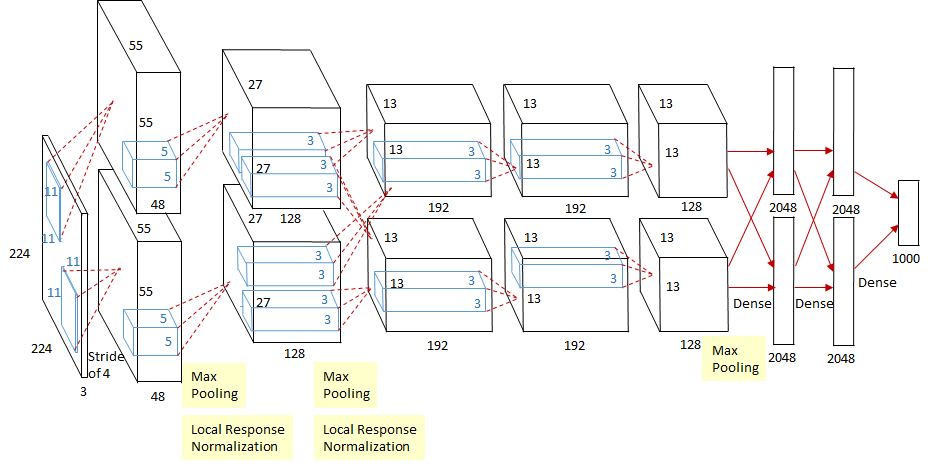
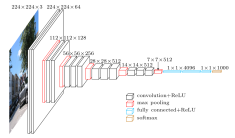
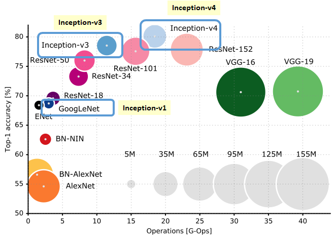

# 目录

## 第一章 CNN 经典骨干演进

[1. CNN 经典骨干的演进主线是什么？](#q-001)
  - [面试问题：LeNet-5、AlexNet、VGG 分别解决了什么关键问题？](#q-002)
  - [面试问题：GoogLeNet / Inception 的核心思想是什么？](#q-003)
  - [面试问题：ResNet 为什么是最重要的 CNN 经典模型之一？](#q-004)
  - [面试问题：DenseNet、ResNeXt、SE-Net 分别改进了什么？](#q-005)

## 第二章 轻量化与工程部署

[2. 轻量化 CNN 为什么在 AIGC 工程中仍然重要？](#q-006)
  - [面试问题：MobileNet 的深度可分离卷积为什么能降计算量？](#q-007)
  - [面试问题：EfficientNet 的复合缩放思想是什么？](#q-008)
  - [面试问题：RepVGG 的结构重参数化为什么适合部署？](#q-009)

## 第三章 Transformer 化视觉骨干

[3. 从 CNN 到 ViT 的核心变化是什么？](#q-010)
  - [面试问题：ViT 如何把图像变成 token 序列？](#q-011)
  - [面试问题：Swin Transformer 为什么适合检测和分割？](#q-012)
  - [面试问题：ConvNeXt 为什么被称为现代化 CNN？](#q-013)

## 第四章 AIGC 时代视觉预训练模型

[4. AIGC 时代哪些视觉骨干最常考？](#q-014)
  - [面试问题：MAE 和 DINOv2 分别代表什么自监督预训练路线？](#q-015)
  - [面试问题：CLIP 为什么改变了视觉分类和检索范式？](#q-016)
  - [面试问题：DiT 为什么会成为扩散模型中的重要 backbone？](#q-017)

---

<h1 id="q-001">1. CNN 经典骨干的演进主线是什么？</h1>

CNN 经典骨干的演进不是简单堆模型名字，而是围绕几个长期有效的问题展开：

- 如何从局部像素中提取层级特征。
- 如何训练更深的网络。
- 如何提升多尺度表达能力。
- 如何减少参数量和计算量。
- 如何让模型更适合检测、分割、生成等下游任务。

经典 CNN 主线中的 LeNet-5、AlexNet、ZFNet、NIN、VGG、GoogLeNet、ResNet、DenseNet，是理解 CNN 发展史的关键节点。AIGC 时代继续补充 MobileNet、EfficientNet、RepVGG、ViT、Swin、ConvNeXt、MAE、DINOv2、CLIP、DiT，形成完整的视觉骨干技术地图。

| 阶段 | 代表模型 | 核心贡献 |
| --- | --- | --- |
| 早期 CNN | LeNet-5 | 卷积 + 池化 + 全连接 |
| 深度 CNN 爆发 | AlexNet | ReLU、Dropout、GPU、数据增强 |
| 深层堆叠 | VGG | 小卷积核、规则堆叠 |
| 多尺度并联 | GoogLeNet / Inception | 多分支、多尺度、$1\times1$ 降维 |
| 超深网络 | ResNet | 残差连接、缓解退化 |
| 特征复用 | DenseNet | 密集连接 |
| 轻量部署 | MobileNet / EfficientNet / RepVGG | 低算力、高吞吐 |
| Transformer 化 | ViT / Swin | Patch token、自注意力 |
| 自监督预训练 | MAE / DINOv2 | 通用视觉表征 |
| 生成骨干 | U-Net / DiT | 扩散模型去噪网络 |

<h2 id="q-002">面试问题：LeNet-5、AlexNet、VGG 分别解决了什么关键问题？</h2>

**难度评分：⭐⭐ (2/5)  |  考察频率：⭐⭐⭐⭐⭐ (5/5)**

LeNet-5 证明了卷积网络在图像识别上的有效性，典型结构是卷积层、池化层、全连接层，主要用于手写数字识别。

AlexNet 让深度 CNN 在大规模视觉识别中真正爆发，关键点包括：

- 使用 ReLU 缓解梯度消失并加速训练。
- 使用 Dropout 降低过拟合。
- 使用数据增强提升泛化。
- 使用 GPU 训练更大的网络。
- 局部响应归一化在当时有一定作用，但后来逐渐被 BatchNorm 等方法替代。

VGG 的价值在于把网络设计变得极其规整：反复堆叠 $3\times3$ 卷积，用小卷积核替代大卷积核，在增加非线性的同时控制参数量。

面试回答可以这样总结：

- LeNet 证明 CNN 可用。
- AlexNet 证明深度 CNN 在大数据和 GPU 下能显著领先传统视觉方法。
- VGG 证明“简单、规则、足够深”的结构也能很强，并成为后续检测、分割骨干的重要基线。

<h2 id="q-003">面试问题：GoogLeNet / Inception 的核心思想是什么？</h2>

**难度评分：⭐⭐⭐ (3/5)  |  考察频率：⭐⭐⭐⭐ (4/5)**

Inception 的核心是多尺度并联：同一层中同时使用 $1\times1$、$3\times3$、$5\times5$ 卷积和池化，让网络自动学习不同感受野的特征。

关键设计：

1. **多分支结构**

   不同分支捕获不同尺度信息。

2. **$1\times1$ 卷积降维**

   在大卷积前先降低通道数，减少计算量。

3. **更高计算效率**

   在参数量较低的情况下提升表达能力。

4. **辅助分类器**

   早期 GoogLeNet 用辅助 loss 缓解深层网络训练困难。

AIGC 时代的联系：

- 多尺度思想延续到 FPN、ASPP、U-Net、ControlNet 多尺度控制。
- $1\times1$ 卷积本质是通道混合，在现代网络中仍非常常见。
- 多分支结构后来在 Inception、ResNeXt、MixConv、NAS 网络中持续演化。

<h2 id="q-004">面试问题：ResNet 为什么是最重要的 CNN 经典模型之一？</h2>

**难度评分：⭐⭐⭐⭐ (4/5)  |  考察频率：⭐⭐⭐⭐⭐ (5/5)**

ResNet 的核心是残差学习：

$$
y = F(x) + x
$$

其中 $F(x)$ 是残差分支，$x$ 是 shortcut identity 分支。

ResNet 解决的不是普通意义上的过拟合，而是深层网络的退化问题：网络加深后，训练误差反而变高。残差连接让网络可以更容易学习恒等映射，使深层网络至少不比浅层网络差。

为什么有效：

- 梯度可以沿 shortcut 更直接传播。
- 优化目标从学习完整映射变为学习残差。
- 允许网络堆得更深。
- 为后来的 Transformer、扩散模型 U-Net、生成模型残差块提供基础结构。

面试高频追问：

| 问题 | 回答要点 |
| --- | --- |
| ResNet 解决梯度消失还是退化？ | 主要解决退化，顺带改善梯度传播 |
| shortcut 维度不一致怎么办？ | 用 $1\times1$ 卷积投影或 stride 调整 |
| Pre-activation ResNet 改进了什么？ | BN/ReLU 放在卷积前，优化更顺 |

AIGC 联系：Transformer block 中的 residual connection、diffusion U-Net 的残差块、DiT block 的残差路径，本质都延续了 ResNet 的优化思想。

<h2 id="q-005">面试问题：DenseNet、ResNeXt、SE-Net 分别改进了什么？</h2>

**难度评分：⭐⭐⭐ (3/5)  |  考察频率：⭐⭐⭐⭐ (4/5)**

DenseNet：

- 每一层都接收前面所有层的特征。
- 强调特征复用。
- 缓解梯度传播问题。
- 缺点是显存访问和特征拼接开销较大。

ResNeXt：

- 在 ResNet 的基础上引入 cardinality，即分组分支数量。
- 用多个相同拓扑的分支提升表达能力。
- 可以理解为“分组卷积 + 残差”的组合。

SE-Net：

- 引入 Squeeze-and-Excitation 通道注意力。
- 先全局池化得到通道描述，再学习通道权重。
- 强调“哪些通道更重要”。

对比：

| 模型 | 核心关键词 | 解决问题 |
| --- | --- | --- |
| DenseNet | 特征复用 | 提升梯度流和参数效率 |
| ResNeXt | cardinality | 用分组分支提升表达 |
| SE-Net | 通道注意力 | 动态重标定通道重要性 |

这些思想后来被广泛吸收到检测、分割、轻量网络和注意力模块中。

---

<h1 id="q-006">2. 轻量化 CNN 为什么在 AIGC 工程中仍然重要？</h1>

AIGC 系统不只有云端大模型，也有大量前后处理、小模型辅助、边缘部署和实时模块。

轻量化模型仍然重要的原因：

- 移动端、摄像头、机器人、车载设备算力有限。
- 大模型调用前常需要小模型做检测、分割、OCR、过滤。
- 低延迟服务需要轻量 backbone。
- 批量数据处理时，小模型能显著降低成本。
- 数字人、视频生成、自动标注系统中常有实时感知模块。

<h2 id="q-007">面试问题：MobileNet 的深度可分离卷积为什么能降计算量？</h2>

**难度评分：⭐⭐⭐ (3/5)  |  考察频率：⭐⭐⭐⭐⭐ (5/5)**

普通卷积同时做空间特征提取和通道混合。假设输入通道 $M$，输出通道 $N$，卷积核大小 $K\times K$，输出特征图大小 $H\times W$，计算量约为：

$$
H \times W \times M \times N \times K^2
$$

MobileNet 的深度可分离卷积拆成两步：

1. **Depthwise Convolution**

   每个输入通道单独做 $K\times K$ 卷积，计算空间特征。

2. **Pointwise Convolution**

   使用 $1\times1$ 卷积做通道混合。

计算量约为：

$$
H \times W \times M \times K^2 + H \times W \times M \times N
$$

当 $K=3$、$N$ 较大时，计算量明显下降。

面试补充：

- MobileNetV1 强调 depthwise separable convolution。
- MobileNetV2 引入 inverted residual 和 linear bottleneck。
- MobileNetV3 结合 NAS、SE、h-swish，进一步面向移动端优化。

AIGC 工程应用：移动端 OCR、人脸检测、姿态估计、轻量分割、实时视频预处理都可能使用 MobileNet 系列或类似轻量 backbone。

<h2 id="q-008">面试问题：EfficientNet 的复合缩放思想是什么？</h2>

**难度评分：⭐⭐⭐ (3/5)  |  考察频率：⭐⭐⭐⭐ (4/5)**

EfficientNet 的核心不是只加深、只加宽或只提高分辨率，而是同时按比例缩放：

- depth：网络深度。
- width：通道宽度。
- resolution：输入分辨率。

复合缩放可以写成：

$$
depth = \alpha^\phi,\quad width = \beta^\phi,\quad resolution = \gamma^\phi
$$

其中 $\phi$ 控制整体资源预算，$\alpha,\beta,\gamma$ 控制三者比例。

为什么有效：

- 只加深可能难训练。
- 只加宽可能计算量太大。
- 只加分辨率可能没有足够高层语义。
- 三者协同更容易在准确率和效率之间取得平衡。

工程意义：AIGC 业务中常遇到“同一模型要部署到不同算力设备”的问题，EfficientNet 的思想提供了模型缩放的系统化思路。

<h2 id="q-009">面试问题：RepVGG 的结构重参数化为什么适合部署？</h2>

**难度评分：⭐⭐⭐⭐ (4/5)  |  考察频率：⭐⭐⭐⭐ (4/5)**

RepVGG 的核心是训练和推理使用不同结构。

训练时：

- 使用多分支结构，例如 $3\times3$ 卷积、$1\times1$ 卷积、identity 分支。
- 多分支有助于优化和表达。

推理时：

- 将多个分支等价融合成单个 $3\times3$ 卷积。
- 推理结构像 VGG 一样简单。

为什么适合部署：

- 单分支卷积对硬件友好。
- 减少分支带来的访存和调度开销。
- 保留训练时多分支表达能力。
- 可用于检测、分割、工业视觉等实时任务。

AIGC 场景：如果大模型系统前面需要一个快速检测/分类/质量过滤模型，结构重参数化模型可以在延迟和精度之间取得较好平衡。

---

<h1 id="q-010">3. 从 CNN 到 ViT 的核心变化是什么？</h1>

CNN 的归纳偏置是局部性和平移等变性；ViT 则把图像切成 patch token，用 Transformer 的自注意力建模全局关系。

对比：

| 维度 | CNN | ViT |
| --- | --- | --- |
| 基本单元 | 卷积核 | Patch token |
| 归纳偏置 | 强，局部性、平移等变 | 弱，更依赖数据 |
| 全局建模 | 需要多层堆叠扩大感受野 | 自注意力天然全局 |
| 数据需求 | 较低 | 通常更依赖大规模预训练 |
| 下游适配 | 检测分割成熟 | 需层级化和多尺度改造 |

<h2 id="q-011">面试问题：ViT 如何把图像变成 token 序列？</h2>

**难度评分：⭐⭐⭐ (3/5)  |  考察频率：⭐⭐⭐⭐⭐ (5/5)**

ViT 的流程：

1. 将图像切成固定大小 patch，例如 $16\times16$。
2. 每个 patch 展平为向量。
3. 通过线性层映射成 token embedding。
4. 加入位置编码。
5. 输入 Transformer Encoder。
6. 使用 `[CLS]` token 或池化特征做分类。

关键点：

- Patch embedding 可以看作 stride 等于 patch size 的卷积。
- ViT 缺少 CNN 的强局部归纳偏置，因此更依赖大规模数据或自监督预训练。
- ViT 在分类中简单直接，但检测和分割需要多尺度特征，因此出现了 Swin、PVT、FPN-style adapter 等改造。

AIGC 联系：

- CLIP 图像编码器可使用 ViT。
- DINOv2 等自监督视觉基础模型常使用 ViT。
- DiT 把 diffusion 中的 latent patch 化后用 Transformer 去噪。

<h2 id="q-012">面试问题：Swin Transformer 为什么适合检测和分割？</h2>

**难度评分：⭐⭐⭐⭐ (4/5)  |  考察频率：⭐⭐⭐⭐ (4/5)**

Swin Transformer 解决 ViT 在密集预测任务中的两个问题：

1. 标准全局注意力对高分辨率图像计算量大。
2. 检测和分割需要层级多尺度特征。

核心设计：

- Window Attention：只在局部窗口内做注意力，降低复杂度。
- Shifted Window：相邻层移动窗口，让不同窗口之间交换信息。
- Patch Merging：逐层降低分辨率、增加通道数，形成类似 CNN 的金字塔特征。

为什么适合检测和分割：

- 输出多尺度特征，容易接 FPN、Mask R-CNN、UPerNet。
- 局部窗口 attention 更适合高分辨率。
- 兼具 Transformer 的建模能力和 CNN 式层级结构。

<h2 id="q-013">面试问题：ConvNeXt 为什么被称为现代化 CNN？</h2>

**难度评分：⭐⭐⭐ (3/5)  |  考察频率：⭐⭐⭐ (3/5)**

ConvNeXt 的思想是：吸收 Transformer 时代的训练和结构经验，重新设计纯 CNN。

关键改造：

- 使用大卷积核 depthwise convolution 扩大感受野。
- 使用 inverted bottleneck。
- 使用 LayerNorm 替代传统 BatchNorm 的部分位置。
- 使用 GELU。
- 减少激活和归一化的数量。
- 借鉴 Swin 的 stage 配置和现代训练 recipe。

意义：

- 说明 CNN 在合理现代化后仍然很强。
- 对工业部署友好，卷积算子成熟。
- 在检测、分割等任务中可作为强 backbone。

面试中可以说：ConvNeXt 不是简单复古，而是把 Transformer 时代学到的设计经验反馈给 CNN。

---

<h1 id="q-014">4. AIGC 时代哪些视觉骨干最常考？</h1>

AIGC 时代的视觉骨干不再只服务分类，而是服务多模态理解、检索、生成控制、检测分割、视频理解和自动标注。

高频模型：

- ViT / Swin / ConvNeXt：通用视觉骨干。
- MAE / DINOv2：自监督视觉预训练。
- CLIP：图文对齐和 zero-shot。
- U-Net / DiT：扩散生成 backbone。
- SAM / SAM 2：promptable segmentation。
- Florence-2：统一视觉任务表示。

<h2 id="q-015">面试问题：MAE 和 DINOv2 分别代表什么自监督预训练路线？</h2>

**难度评分：⭐⭐⭐⭐ (4/5)  |  考察频率：⭐⭐⭐⭐ (4/5)**

MAE 代表 masked image modeling 路线：

- 随机遮挡大比例 patch。
- Encoder 只看可见 patch。
- Decoder 重建被遮挡像素或特征。
- 强调从不完整输入中学习视觉结构。

DINOv2 代表自蒸馏视觉表征路线：

- 通过 teacher-student 框架学习视觉特征。
- 不依赖人工标签。
- 目标是得到可迁移、鲁棒、通用的视觉特征。
- 适合分类、检索、分割、深度估计等下游任务。

对比：

| 模型 | 训练信号 | 学到的能力 |
| --- | --- | --- |
| MAE | 重建被遮挡内容 | 结构理解、上下文恢复 |
| DINOv2 | 自蒸馏表征一致性 | 通用视觉特征、语义聚类 |

面试中要补充：自监督预训练的核心价值是降低对人工标签的依赖，并提升下游任务迁移能力。

<h2 id="q-016">面试问题：CLIP 为什么改变了视觉分类和检索范式？</h2>

**难度评分：⭐⭐⭐⭐ (4/5)  |  考察频率：⭐⭐⭐⭐⭐ (5/5)**

CLIP 使用图像-文本对进行对比学习，将图像和文本映射到同一个语义空间。

核心训练目标：

- 正样本：匹配的图像和文本描述相似度高。
- 负样本：不匹配的图像和文本描述相似度低。

为什么重要：

1. **Zero-shot 分类**

   类别名可以写成 prompt，与图像 embedding 比相似度完成分类。

2. **图文检索**

   文搜图、图搜文变成向量相似搜索。

3. **开放词汇能力**

   模型不再局限固定训练类别。

4. **AIGC 条件控制**

   Stable Diffusion 等文生图系统使用文本编码器提供语义条件，CLIP 式对齐思想非常关键。

5. **多模态基础模型起点**

   GLIP、Grounding DINO、LLaVA 等模型都受图文对齐范式影响。

<h2 id="q-017">面试问题：DiT 为什么会成为扩散模型中的重要 backbone？</h2>

**难度评分：⭐⭐⭐⭐ (4/5)  |  考察频率：⭐⭐⭐⭐ (4/5)**

传统扩散模型常用 U-Net 作为去噪网络，因为 U-Net 擅长多尺度局部生成和细节恢复。DiT，Diffusion Transformer，则用 Transformer 替代 U-Net 作为扩散模型 backbone。

核心思路：

- 在 latent space 中将特征切成 patch token。
- 使用 Transformer block 处理 token。
- 将时间步、类别、文本等条件注入 Transformer。
- 输出噪声预测或 velocity 预测。

为什么重要：

- Transformer 更适合规模化。
- 与大模型架构统一，方便扩大参数和数据。
- 对高层语义建模能力强。
- 影响了后续图像、视频生成模型的 backbone 设计。

局限：

- 局部细节和高分辨率生成需要工程优化。
- 训练成本较高。
- U-Net 在很多工业扩散模型中仍然非常强。

面试表达：DiT 的意义不是简单“Transformer 替换 CNN”，而是让扩散生成模型进入更可规模化的 Transformer 统一架构。

---

<h1 id="q-018">5. 图像分类训练中的数据问题为什么仍然高频？</h1>

图像分类不只是模型结构问题，真实业务中更常见的瓶颈是数据分布、标签质量和评估方式。AIGC 时代尤其如此：自动标注、合成数据、网络爬取数据和多模态弱标注都可能带来类别不平衡、长尾、噪声标签和分布偏移。

<h2 id="q-019">面试问题：图像分类任务中类别不平衡怎么解决？</h2>

**难度评分：⭐⭐⭐ (3/5)  |  考察频率：⭐⭐⭐⭐⭐ (5/5)**

类别不平衡指不同类别样本数量差异很大，模型容易偏向头部类别。

常见方法：

| 方法 | 核心思想 | 适用场景 |
| --- | --- | --- |
| 重采样 | 过采样少数类或欠采样多数类 | 数据量中等、类别差距大 |
| 类别权重 | 给少数类更高 loss 权重 | 简单有效，需注意过拟合 |
| Focal Loss | 降低易分类样本权重 | 难样本多、长尾明显 |
| 数据增强 | 对少数类做增强或合成 | 图像分类、工业缺陷 |
| 两阶段训练 | 先学表征，再平衡分类头 | 长尾识别 |
| 阈值校准 | 不同类别使用不同阈值 | 多标签分类 |

AIGC 场景：

- 合成数据可以补少数类，但要控制生成质量和分布偏差。
- 自动标注长尾类别时，不能只看 overall accuracy，要关注 macro-F1、per-class recall。
- 多模态模型 zero-shot 分类也可能对常见类别偏置，需要 prompt ensemble 或类别描述校准。

<h2 id="q-020">面试问题：图像分类中的标签噪声如何处理？</h2>

**难度评分：⭐⭐⭐ (3/5)  |  考察频率：⭐⭐⭐⭐ (4/5)**

标签噪声包括：

- 错标：图片是猫，标签是狗。
- 多义标签：图片中有多个主体，只标了一个类别。
- 粒度不一致：有的标“狗”，有的标“金毛”。
- 自动标注错误：来自弱模型或爬虫规则的错误标签。

处理方法：

1. **数据清洗**

   用高置信模型、人工复核、聚类可视化发现异常样本。

2. **鲁棒损失**

   Label Smoothing、Generalized Cross Entropy、Bootstrapping Loss 等方法可降低过拟合噪声标签。

3. **样本重加权**

   降低疑似噪声样本权重。

4. **半监督 / 自训练**

   用 teacher 模型生成软标签，但要防止错误累积。

5. **多模态交叉校验**

   对图文数据，可用图像模型和文本模型互相校验。

AIGC 数据工程中，标签噪声很常见。面试时要强调：模型调参只能缓解噪声，真正有效的方案通常是数据治理 + 鲁棒训练结合。

<h2 id="q-021">面试问题：图像分类常用评估指标有哪些？</h2>

**难度评分：⭐⭐ (2/5)  |  考察频率：⭐⭐⭐⭐ (4/5)**

常见指标：

| 指标 | 含义 | 适合场景 |
| --- | --- | --- |
| Accuracy | 总体正确率 | 类别均衡单标签分类 |
| Top-1 / Top-5 | 真实类别是否在前 1 / 前 5 | ImageNet 分类 |
| Precision | 预测为正的样本中有多少是真的 | 误报成本高 |
| Recall | 真实正样本有多少被找回 | 漏报成本高 |
| F1 | Precision 和 Recall 的调和平均 | 类别不平衡 |
| Macro-F1 | 各类别 F1 平均 | 长尾类别 |
| AUC | 排序能力 | 二分类、多标签 |
| Confusion Matrix | 类别混淆关系 | 错误分析 |

AIGC 场景：

- 内容安全分类更关注 recall，漏掉违规内容风险高。
- 工业缺陷分类常关注少数类 recall。
- 多标签图像标签系统不能只看 accuracy，要看 mAP、per-class 指标。
- 开放词汇分类要关注 prompt 稳定性和类别描述质量。

## 高频速记

- LeNet 是 CNN 雏形，AlexNet 引爆深度 CNN，VGG 强调小卷积核深层堆叠。
- Inception 用多尺度并联和 $1\times1$ 降维。
- ResNet 的核心是残差学习，主要解决深层网络退化。
- DenseNet 强调特征复用，SE-Net 强调通道注意力。
- MobileNet 用深度可分离卷积降计算量。
- EfficientNet 用 depth、width、resolution 复合缩放。
- RepVGG 用训练多分支、推理单分支服务部署。
- ViT 把图像 patch 化成 token，Swin 引入窗口和层级结构。
- MAE 是遮挡重建，DINOv2 是自蒸馏通用视觉表征。
- CLIP 是图文对比学习，DiT 是扩散模型 Transformer backbone。
- 类别不平衡、标签噪声和评估指标是分类模型落地中的高频工程问题。

## 参考资料
- He et al., Deep Residual Learning for Image Recognition
- Dosovitskiy et al., An Image is Worth 16x16 Words
- Liu et al., Swin Transformer
- Oquab et al., DINOv2: Learning Robust Visual Features without Supervision
- Radford et al., CLIP: Learning Transferable Visual Models From Natural Language Supervision
- Peebles and Xie, Scalable Diffusion Models with Transformers
