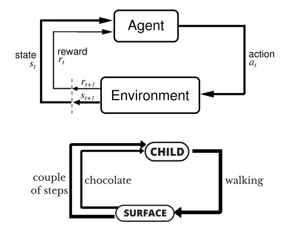

# 目录

## 第一章 强化学习基础模型

[1. 强化学习解决什么类型的问题？](#q-001)
  - [面试问题：Agent、Environment、State、Action、Reward 分别是什么？](#q-002)
  - [面试问题：强化学习和监督学习、无监督学习有什么区别？](#q-003)
  - [面试问题：MDP、价值函数、策略函数的核心概念是什么？](#q-004)

## 第二章 经典强化学习算法

[2. Q-Learning、DQN、Policy Gradient、Actor-Critic 如何对比？](#q-005)
  - [面试问题：Q-Learning 和 DQN 的核心区别是什么？](#q-006)
  - [面试问题：Policy Gradient 为什么能直接优化策略？](#q-007)
  - [面试问题：Actor-Critic 和 PPO 为什么高频？](#q-008)

## 第三章 大模型对齐与 RLHF

[3. 强化学习如何进入大模型对齐？](#q-009)
  - [面试问题：RLHF 的三阶段流程是什么？](#q-010)
  - [面试问题：PPO 在 RLHF 中起什么作用？](#q-011)
  - [面试问题：DPO 与 RLHF/PPO 的区别是什么？](#q-012)
  - [面试问题：RLAIF、Constitutional AI 和 Agent RL 有什么关系？](#q-013)

## 第四章 迁移学习与领域适配

[4. 迁移学习为什么是大模型时代的底层方法论？](#q-014)
  - [面试问题：源域、目标域、源任务、目标任务如何理解？](#q-015)
  - [面试问题：样本迁移、特征迁移、模型迁移、关系迁移有什么区别？](#q-016)
  - [面试问题：什么是负迁移，如何避免？](#q-017)
  - [面试问题：Domain Adaptation 和 Fine-tuning 有什么区别？](#q-018)

## 第五章 参数高效微调与持续学习

[5. LoRA、Adapter、Prompt Tuning 如何连接迁移学习？](#q-019)
  - [面试问题：LoRA 为什么能低成本适配大模型？](#q-020)
  - [面试问题：Adapter、Prefix Tuning、Prompt Tuning 如何对比？](#q-021)
  - [面试问题：灾难性遗忘和持续学习在 AIGC 中如何出现？](#q-022)

---

<h1 id="q-001">1. 强化学习解决什么类型的问题？</h1>

强化学习，Reinforcement Learning，解决的是智能体在环境中通过试错学习策略的问题。

它不是直接从标注样本中学习输入到输出的映射，而是通过行动获得奖励，并优化长期累计回报。

典型场景：

- 游戏智能体。
- 机器人控制。
- 推荐系统策略优化。
- 自动驾驶决策。
- 大模型 RLHF 对齐。
- 多工具 Agent 的行动策略。

本节覆盖强化学习定义、应用、与监督学习和无监督学习的区别、主要算法和工程应用，并补充 PPO、RLHF、DPO、RLAIF 和 Agent RL。

<h2 id="q-002">面试问题：Agent、Environment、State、Action、Reward 分别是什么？</h2>

**难度评分：⭐⭐ (2/5)  |  考察频率：⭐⭐⭐⭐⭐ (5/5)**

强化学习五个基本元素：

| 概念 | 含义 | 例子 |
| --- | --- | --- |
| Agent | 做决策的智能体 | 机器人、游戏 AI、LLM Agent |
| Environment | 智能体交互的环境 | 游戏地图、网页、用户反馈系统 |
| State | 当前环境状态 | 位置、历史对话、页面 DOM |
| Action | 智能体可执行动作 | 移动、点击、调用工具、生成回答 |
| Reward | 行动后的反馈 | 得分、成功率、人类偏好、任务完成 |



在 LLM Agent 中：

- State 是上下文、任务进度、工具返回结果。
- Action 是下一步回复或工具调用。
- Reward 可以来自任务成功、用户评分、自动评测或偏好模型。

<h2 id="q-003">面试问题：强化学习和监督学习、无监督学习有什么区别？</h2>

**难度评分：⭐⭐ (2/5)  |  考察频率：⭐⭐⭐⭐ (4/5)**

| 维度 | 监督学习 | 无监督学习 | 强化学习 |
| --- | --- | --- | --- |
| 数据 | 输入 + 标签 | 无标签数据 | 交互轨迹 |
| 反馈 | 立即明确 | 无明确标签 | 延迟奖励 |
| 目标 | 学映射 | 学结构 / 表征 | 学策略 |
| 典型任务 | 分类、回归 | 聚类、表示学习 | 控制、规划、对齐 |

强化学习的特殊点：

- 行动会影响未来状态。
- 奖励可能延迟。
- 需要平衡探索和利用。
- 关注长期回报而不是单步正确。

大模型对齐中，监督微调告诉模型“应该怎么答”，RLHF 进一步通过偏好奖励优化“哪种回答更符合人类偏好”。

<h2 id="q-004">面试问题：MDP、价值函数、策略函数的核心概念是什么？</h2>

**难度评分：⭐⭐⭐ (3/5)  |  考察频率：⭐⭐⭐⭐ (4/5)**

MDP，Markov Decision Process，通常由五元组表示：

$$
(S, A, P, R, \gamma)
$$

其中：

- $S$：状态空间。
- $A$：动作空间。
- $P(s'|s,a)$：状态转移概率。
- $R(s,a)$：奖励函数。
- $\gamma$：折扣因子。

策略函数：

$$
\pi(a|s)
$$

表示在状态 $s$ 下选择动作 $a$ 的概率。

价值函数：

$$
V^\pi(s)
$$

表示从状态 $s$ 出发按策略 $\pi$ 行动的期望回报。

动作价值函数：

$$
Q^\pi(s,a)
$$

表示在状态 $s$ 先执行动作 $a$，之后按策略 $\pi$ 行动的期望回报。

面试金句：策略告诉智能体怎么行动，价值函数告诉智能体某个状态或动作有多值得。

---

<h1 id="q-005">2. Q-Learning、DQN、Policy Gradient、Actor-Critic 如何对比？</h1>

强化学习算法大致可以分为：

- Value-based：学习价值函数，再根据价值选动作。
- Policy-based：直接学习策略。
- Actor-Critic：同时学习策略和价值。

<h2 id="q-006">面试问题：Q-Learning 和 DQN 的核心区别是什么？</h2>

**难度评分：⭐⭐⭐ (3/5)  |  考察频率：⭐⭐⭐⭐ (4/5)**

Q-Learning 学习动作价值函数 $Q(s,a)$：

$$
Q(s,a) \leftarrow Q(s,a) + \alpha [r + \gamma \max_{a'} Q(s',a') - Q(s,a)]
$$

它适合状态和动作空间较小的表格型问题。

DQN 用神经网络近似 Q 函数：

$$
Q(s,a;\theta)
$$

关键改进：

- Experience Replay：经验回放，打破样本相关性。
- Target Network：目标网络，稳定训练目标。

区别：

| 维度 | Q-Learning | DQN |
| --- | --- | --- |
| 表示 | Q 表 | 神经网络 |
| 状态空间 | 小规模离散 | 高维状态，如图像 |
| 稳定性技巧 | 较少 | 经验回放、目标网络 |
| 代表应用 | 网格世界 | Atari 游戏 |

<h2 id="q-007">面试问题：Policy Gradient 为什么能直接优化策略？</h2>

**难度评分：⭐⭐⭐⭐ (4/5)  |  考察频率：⭐⭐⭐ (3/5)**

Policy Gradient 直接参数化策略：

$$
\pi_\theta(a|s)
$$

目标是最大化期望回报：

$$
J(\theta)=\mathbb{E}_{\pi_\theta}[R]
$$

策略梯度的基本形式：

$$
\nabla_\theta J(\theta)=\mathbb{E}[\nabla_\theta \log \pi_\theta(a|s) R]
$$

优点：

- 可处理连续动作。
- 能学习随机策略。
- 直接优化目标策略。

缺点：

- 方差大。
- 样本效率低。
- 训练不稳定。

Actor-Critic 和 PPO 都是在这个方向上改进稳定性和样本效率。

<h2 id="q-008">面试问题：Actor-Critic 和 PPO 为什么高频？</h2>

**难度评分：⭐⭐⭐⭐ (4/5)  |  考察频率：⭐⭐⭐⭐⭐ (5/5)**

Actor-Critic 同时训练：

- Actor：策略网络，决定怎么行动。
- Critic：价值网络，评估行动好坏。

Critic 可以降低策略梯度方差，使训练更稳定。

PPO，Proximal Policy Optimization，是一种常用策略优化方法。它通过限制新旧策略变化幅度，避免策略更新过大导致性能崩塌。

PPO clipped objective 直觉：

- 如果新策略相对旧策略变化太大，就裁剪更新收益。
- 保持训练稳定。
- 实现比 TRPO 简单。

为什么高频：

- PPO 是强化学习经典算法。
- RLHF 训练语言模型时常用 PPO 类策略优化。
- Agent、机器人、游戏控制中也很常见。

---

<h1 id="q-009">3. 强化学习如何进入大模型对齐？</h1>

大语言模型通过 next token prediction 学到语言和知识，但它不一定天然符合人类偏好。RLHF 将人类偏好转化为奖励信号，用强化学习进一步优化模型行为。

<h2 id="q-010">面试问题：RLHF 的三阶段流程是什么？</h2>

**难度评分：⭐⭐⭐⭐ (4/5)  |  考察频率：⭐⭐⭐⭐⭐ (5/5)**

RLHF，Reinforcement Learning from Human Feedback，典型流程：

1. **SFT，Supervised Fine-tuning**

   使用人工标注或高质量指令数据微调基础模型，让模型学会基本遵循指令。

2. **Reward Model 训练**

   收集同一 prompt 下多个回答的人类偏好排序，训练奖励模型判断哪个回答更好。

3. **RL 优化**

   使用 PPO 等算法优化语言模型，使其生成获得更高奖励的回答，同时通常加入 KL 惩罚，避免偏离原模型太远。

核心目标：

- 更有帮助。
- 更诚实。
- 更安全。
- 更符合人类偏好。

面试要点：RLHF 不是直接用人工写标准答案，而是学习人类偏好，并把偏好变成可优化的奖励信号。

<h2 id="q-011">面试问题：PPO 在 RLHF 中起什么作用？</h2>

**难度评分：⭐⭐⭐⭐ (4/5)  |  考察频率：⭐⭐⭐⭐ (4/5)**

PPO 在 RLHF 中用于更新语言模型策略。

对应关系：

- State：prompt 和上下文。
- Action：生成的 token 序列。
- Policy：语言模型。
- Reward：奖励模型给出的偏好分数。

为什么需要 PPO：

- 直接最大化奖励容易导致模型钻奖励模型漏洞。
- 策略变化过大会导致语言质量崩坏。
- PPO 通过 clipped objective 和 KL 惩罚控制更新幅度。

简化目标：

```text
最大化奖励模型分数
同时限制新模型不要偏离初始 SFT 模型太远
```

高频坑点：

- RLHF 的 reward 不是环境真实奖励，而是奖励模型估计。
- 奖励模型可能被 hack。
- KL penalty 很关键。
- PPO 训练成本高且工程复杂。

<h2 id="q-012">面试问题：DPO 与 RLHF/PPO 的区别是什么？</h2>

**难度评分：⭐⭐⭐⭐ (4/5)  |  考察频率：⭐⭐⭐⭐⭐ (5/5)**

DPO，Direct Preference Optimization，直接用偏好数据优化策略，不显式训练奖励模型，也不需要在线 RL 采样。

RLHF/PPO：

```text
偏好数据 -> 奖励模型 -> PPO 优化策略
```

DPO：

```text
偏好数据 -> 直接优化偏好目标
```

优点：

- 流程更简单。
- 训练更稳定。
- 不需要单独训练 reward model。
- 工程成本低于 PPO。

局限：

- 依赖偏好数据质量。
- 对复杂交互式任务和长期奖励建模不一定足够。
- 不等同于完全替代 RLHF。

面试表达：DPO 将基于偏好的 RL 问题转化成更直接的监督式优化形式，是大模型对齐中非常高频的替代路线。

<h2 id="q-013">面试问题：RLAIF、Constitutional AI 和 Agent RL 有什么关系？</h2>

**难度评分：⭐⭐⭐ (3/5)  |  考察频率：⭐⭐⭐ (3/5)**

RLAIF，Reinforcement Learning from AI Feedback，使用 AI 模型提供反馈，而不是完全依赖人工偏好。

Constitutional AI：

- 设定一组原则或宪法。
- 让模型根据原则自我批评和修改。
- 使用 AI feedback 进行对齐训练。

Agent RL：

- 奖励来自任务完成、工具调用成功、环境反馈或自动评测。
- 更关注多步规划和长期目标。

关系：

| 方法 | 反馈来源 | 典型目标 |
| --- | --- | --- |
| RLHF | 人类偏好 | 对齐人类偏好 |
| RLAIF | AI 反馈 | 降低人工成本 |
| Constitutional AI | 原则 + AI 反馈 | 安全、规范、可控 |
| Agent RL | 环境和任务反馈 | 提升行动成功率 |

---

<h1 id="q-014">4. 迁移学习为什么是大模型时代的底层方法论？</h1>

迁移学习研究如何把一个领域或任务中学到的知识迁移到另一个领域或任务。

迁移学习基础包括基本思路、分布自适应、特征迁移、模型迁移、负迁移和 fine-tuning。大模型时代，这些思想被放大为：

```text
大规模预训练 -> 领域适配 -> 指令微调 -> 参数高效微调 -> 持续学习
```

<h2 id="q-015">面试问题：源域、目标域、源任务、目标任务如何理解？</h2>

**难度评分：⭐⭐ (2/5)  |  考察频率：⭐⭐⭐⭐ (4/5)**

基本概念：

| 概念 | 含义 |
| --- | --- |
| 源域 | 已有知识的数据分布 |
| 目标域 | 希望迁移到的新数据分布 |
| 源任务 | 在源域上学习的任务 |
| 目标任务 | 在目标域上要解决的任务 |

例子：

- ImageNet 分类模型迁移到工业缺陷检测。
- 通用 LLM 迁移到法律问答。
- 英文 OCR 模型迁移到中文票据识别。
- 通用分割模型 SAM 迁移到医学图像分割。

面试中要强调：迁移学习的关键不是简单换数据训练，而是如何利用源域知识提升目标域表现，并避免负迁移。

<h2 id="q-016">面试问题：样本迁移、特征迁移、模型迁移、关系迁移有什么区别？</h2>

**难度评分：⭐⭐⭐ (3/5)  |  考察频率：⭐⭐⭐ (3/5)**

| 类型 | 核心思想 | 例子 |
| --- | --- | --- |
| 样本迁移 | 调整源域样本权重 | 选择与目标域相似的数据 |
| 特征迁移 | 学习领域不变特征 | Domain Adversarial Training |
| 模型迁移 | 复用预训练模型参数 | Fine-tuning、LoRA |
| 关系迁移 | 迁移样本或实体间关系 | 知识图谱、社交网络迁移 |

AIGC 时代最常见的是模型迁移和特征迁移：

- 使用预训练 LLM / VLM。
- 通过 LoRA 适配垂直领域。
- 用领域数据继续预训练。
- 用对比学习对齐跨模态特征。

<h2 id="q-017">面试问题：什么是负迁移，如何避免？</h2>

**难度评分：⭐⭐⭐ (3/5)  |  考察频率：⭐⭐⭐⭐ (4/5)**

负迁移是指源域知识不但没有帮助目标任务，反而降低目标任务性能。

原因：

- 源域和目标域差异太大。
- 标签空间不一致。
- 低质量源数据引入噪声。
- 模型过度保留源任务偏见。
- 微调数据太少导致过拟合或遗忘。

避免方法：

- 评估源域和目标域相似性。
- 做领域自适应。
- 选择高质量相关数据。
- 冻结部分层或使用小学习率。
- 使用参数高效微调减少破坏。
- 加入正则、蒸馏或 replay 缓解遗忘。

大模型例子：把通用模型微调到医疗领域时，如果数据不干净或标注标准不一致，模型可能学到错误诊疗表达，造成负迁移。

<h2 id="q-018">面试问题：Domain Adaptation 和 Fine-tuning 有什么区别？</h2>

**难度评分：⭐⭐⭐ (3/5)  |  考察频率：⭐⭐⭐⭐ (4/5)**

Fine-tuning 是在目标任务数据上继续训练预训练模型。

Domain Adaptation 更关注源域和目标域分布差异，目标是让模型在目标域上表现更好，尤其是目标域标注少或无标注时。

对比：

| 维度 | Fine-tuning | Domain Adaptation |
| --- | --- | --- |
| 关注点 | 任务适配 | 分布对齐 |
| 数据 | 通常有目标任务标注 | 可有标注、少标注或无标注 |
| 方法 | 更新模型参数 | 特征对齐、对抗训练、统计匹配 |
| 大模型对应 | SFT、LoRA | 领域继续预训练、领域对齐 |

两者经常结合：先做领域继续预训练，再做指令微调或 LoRA 适配。

---

<h1 id="q-019">5. LoRA、Adapter、Prompt Tuning 如何连接迁移学习？</h1>

大模型参数巨大，完整微调成本高、存储贵、容易过拟合。参数高效微调，PEFT，是迁移学习在大模型时代的重要实现。

常见方法：

- LoRA。
- Adapter。
- Prefix Tuning。
- Prompt Tuning。
- BitFit。

<h2 id="q-020">面试问题：LoRA 为什么能低成本适配大模型？</h2>

**难度评分：⭐⭐⭐⭐ (4/5)  |  考察频率：⭐⭐⭐⭐⭐ (5/5)**

LoRA 的核心假设是：模型适配时的权重更新具有低秩结构。

原始线性层：

$$
y = Wx
$$

LoRA 冻结 $W$，只训练低秩更新：

$$
W' = W + \Delta W,\quad \Delta W = BA
$$

其中 $A$ 和 $B$ 是低秩矩阵，rank 很小。

优点：

- 可训练参数少。
- 显存占用低。
- 多任务只需保存 LoRA 权重。
- 推理时可与原权重合并，不增加额外延迟。

适用场景：

- 垂直领域问答。
- 文风适配。
- 多模态模型微调。
- 文生图风格 LoRA。
- 企业私有数据适配。

局限：

- rank 太小可能表达不足。
- 数据质量差仍会过拟合。
- 对复杂能力提升不一定等同全量微调。

<h2 id="q-021">面试问题：Adapter、Prefix Tuning、Prompt Tuning 如何对比？</h2>

**难度评分：⭐⭐⭐ (3/5)  |  考察频率：⭐⭐⭐⭐ (4/5)**

| 方法 | 思路 | 优点 | 可能问题 |
| --- | --- | --- | --- |
| Adapter | 在层间插入小模块 | 模块化强 | 可能增加推理延迟 |
| Prefix Tuning | 给每层 attention 加可训练 prefix | 适合生成任务 | 实现和长度设计较复杂 |
| Prompt Tuning | 只训练输入端软 prompt | 参数更少 | 对小模型效果可能弱 |
| LoRA | 低秩更新线性层 | 效果好、可合并 | rank 和注入层需调 |

面试中可这样说：

- Adapter 是加模块。
- Prefix / Prompt 是加可学习提示。
- LoRA 是改权重更新方式。

AIGC 工程里，LoRA 最常见，因为生态成熟、效果稳定、部署方便。

<h2 id="q-022">面试问题：灾难性遗忘和持续学习在 AIGC 中如何出现？</h2>

**难度评分：⭐⭐⭐ (3/5)  |  考察频率：⭐⭐⭐⭐ (4/5)**

灾难性遗忘是指模型学习新任务后，旧任务能力显著下降。

AIGC 场景：

- LLM 微调到客服领域后，通用能力下降。
- 检测模型增量学习新类别后，旧类别 mAP 掉很多。
- 多模态模型适配新领域后，原有视觉问答能力变差。
- 数字人模型学习新身份后，旧身份保持能力下降。

缓解方法：

- Replay：保留部分旧数据混合训练。
- Knowledge Distillation：用旧模型约束新模型输出。
- Regularization：限制重要参数变化。
- Adapter / LoRA：减少对基座模型破坏。
- Continual Learning benchmark：分阶段评估旧任务和新任务。

面试金句：持续学习关注的不是“能不能学新知识”，而是“学新知识时能不能不忘旧知识”。

## 高频速记

- 强化学习关注智能体和环境交互下的长期回报。
- MDP 包含状态、动作、转移、奖励和折扣因子。
- Q-Learning 学 Q 表，DQN 用神经网络近似 Q。
- Policy Gradient 直接优化策略，Actor-Critic 同时学策略和值函数。
- PPO 通过限制策略更新幅度提升稳定性，是 RLHF 高频算法。
- RLHF = SFT + Reward Model + RL 优化。
- DPO 直接用偏好数据优化，不显式训练奖励模型。
- 迁移学习关注源域知识如何帮助目标域任务。
- 负迁移是迁移后变差，要通过数据、领域对齐、冻结、PEFT 等方式缓解。
- LoRA 冻结基座权重，只训练低秩更新，是大模型时代最常见 PEFT 方法之一。

## 参考资料
- Sutton and Barto, Reinforcement Learning: An Introduction
- Mnih et al., Human-level control through deep reinforcement learning
- Schulman et al., PPO: https://arxiv.org/abs/1707.06347
- Ouyang et al., InstructGPT / RLHF: https://arxiv.org/abs/2203.02155
- Rafailov et al., DPO: https://arxiv.org/abs/2305.18290
- Hu et al., LoRA: https://arxiv.org/abs/2106.09685
